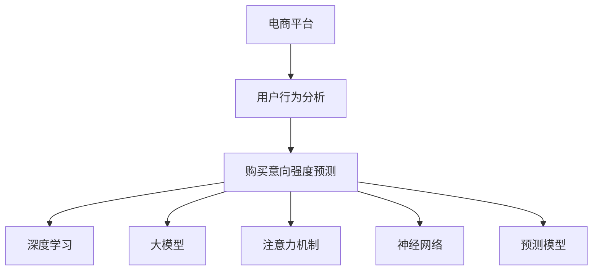

                 

# AI大模型在电商平台用户购买意向强度预测中的作用

> 关键词：电商平台, 用户行为分析, 购买意向, 深度学习, 大模型, 注意力机制, 神经网络, 预测模型

## 1. 背景介绍

在电商领域，准确的预测用户购买意向强度是提升转化率、优化营销策略、提高用户满意度的关键。传统的预测方法依赖于用户历史行为数据和模型调参，但无法充分利用大规模无标签数据和大模型带来的预训练知识。近年来，基于大模型的预训练-微调方法被广泛应用于电商用户的购买意向强度预测，显著提升了预测精度和泛化能力。

### 1.1 问题由来

电商平台的用户数据庞大且多样化，单靠传统机器学习方法难以处理和分析。大模型预训练-微调方法通过在无标签文本数据上进行大规模自监督学习，学习到语言中的通用表示，并可以通过小规模标注数据在特定任务上进行微调，预测用户购买意向强度，为电商平台提供了强大的决策支持。

### 1.2 问题核心关键点

大模型在电商用户购买意向强度预测中的核心应用点在于：
- **自监督学习**：在无标签数据上预训练大模型，学习到丰富的语言表示。
- **微调优化**：利用小规模标注数据，对预训练模型进行微调，针对特定任务优化模型性能。
- **融合业务知识**：将电商平台的业务知识与大模型进行融合，提高预测准确性。
- **实时动态更新**：大模型可以持续更新，适应用户行为和市场动态变化。

## 2. 核心概念与联系

### 2.1 核心概念概述

为深入理解大模型在电商用户购买意向强度预测中的应用，我们先介绍几个关键概念：

- **电商平台**：指通过互联网提供商品或服务的在线交易平台，如淘宝、京东、亚马逊等。
- **用户行为分析**：指对用户在电商平台上的点击、浏览、搜索、购买等行为进行记录和分析，以洞察用户需求和偏好。
- **购买意向强度预测**：指根据用户行为数据预测其购买意向的强度，通常分为强意向、中等意向和弱意向三个等级。
- **深度学习**：基于神经网络的机器学习方法，通过多层非线性映射和反向传播算法，对数据进行自动学习。
- **大模型**：指具有大规模参数量，能够在无监督学习下学习到丰富语言表示的神经网络模型，如BERT、GPT等。
- **注意力机制**：指通过计算输入序列中不同位置元素的权重，重点关注对模型输出贡献大的部分。
- **神经网络**：通过节点和边构建的计算图，模拟人脑神经元之间的连接关系，实现复杂数据的处理和预测。
- **预测模型**：使用训练数据对模型进行学习，通过输入特征预测输出结果的模型。

这些概念之间的联系可以通过以下Mermaid流程图来展示：



这个流程图展示了电商平台用户行为分析、购买意向强度预测、深度学习、大模型、注意力机制、神经网络、预测模型之间的逻辑关系：

1. 电商平台的业务数据被收集和分析，产生用户行为数据。
2. 利用深度学习、大模型、注意力机制、神经网络等技术，对用户行为数据进行建模和预测。
3. 构建预测模型，根据输入特征预测用户购买意向强度。

## 3. 核心算法原理 & 具体操作步骤

### 3.1 算法原理概述

大模型在电商用户购买意向强度预测中的算法原理基于预训练-微调方法。具体而言，大模型在无标签文本数据上进行预训练，学习到通用的语言表示。在电商用户行为数据上，利用小规模标注数据对模型进行微调，预测用户的购买意向强度。

该方法的核心步骤包括：
1. **预训练阶段**：在大规模无标签文本数据上，使用自监督任务（如语言模型预测、掩码语言模型预测）对大模型进行预训练，学习到丰富的语言表示。
2. **微调阶段**：在电商用户行为数据上，使用少量标注数据对预训练模型进行微调，针对特定任务优化模型参数，提升购买意向强度预测的准确性。
3. **融合业务知识**：将电商平台的业务知识（如商品类别、用户画像、市场趋势等）与大模型的预训练知识进行融合，进一步提升预测效果。
4. **实时更新**：在电商平台运营过程中，不断收集新的用户行为数据，定期对模型进行微调，以适应用户行为和市场动态的变化。

### 3.2 算法步骤详解

基于大模型的电商用户购买意向强度预测算法一般包括以下几个关键步骤：

**Step 1: 数据准备**

- 收集电商平台的用户行为数据，包括点击、浏览、搜索、购买等行为。
- 预处理数据，包括清洗、去重、划分训练集、验证集和测试集。
- 标注购买意向数据，将用户行为标记为强意向、中等意向或弱意向。

**Step 2: 模型选择和预训练**

- 选择合适的大模型架构，如BERT、GPT等，进行预训练。
- 定义预训练任务，如掩码语言模型预测、下一句预测等。
- 使用大规模无标签数据进行预训练，更新模型参数。

**Step 3: 微调和优化**

- 选择微调任务，如购买意向强度预测。
- 定义微调目标函数，如交叉熵损失、对数似然损失等。
- 设置微调超参数，如学习率、批大小、迭代轮数等。
- 使用小规模标注数据对预训练模型进行微调，更新模型参数。
- 应用正则化技术，如L2正则、Dropout等，防止过拟合。

**Step 4: 模型评估和部署**

- 在验证集上评估微调后的模型性能，调整超参数。
- 在测试集上最终评估模型效果，对比微调前后的精度提升。
- 将微调后的模型部署到电商平台的实时预测系统中，进行业务应用。

### 3.3 算法优缺点

基于大模型的电商用户购买意向强度预测方法具有以下优点：
1. **泛化能力强**：大模型在大规模无标签数据上进行预训练，学习到丰富的语言表示，可以泛化到多种任务和场景。
2. **精度高**：通过微调，模型能够针对特定任务进行优化，预测准确性显著提升。
3. **灵活性高**：微调后的模型可以随时根据新数据进行更新，适应市场和用户行为的动态变化。
4. **数据依赖低**：预训练过程可以充分利用无标签数据，减少对标注数据的需求。

同时，该方法也存在一些局限性：
1. **资源消耗大**：大模型参数量庞大，预训练和微调过程需要大量计算资源。
2. **训练时间长**：预训练和微调过程耗时较长，需要高性能计算设备。
3. **模型复杂度高**：大模型结构复杂，难以解释其内部工作机制。
4. **依赖标注数据**：微调过程仍需一定量的标注数据进行优化，标注成本较高。

尽管存在这些局限性，但就目前而言，基于大模型的微调方法仍是电商用户购买意向强度预测的主流范式，得到了广泛的应用。

### 3.4 算法应用领域

基于大模型的电商用户购买意向强度预测方法已经广泛应用于多个电商平台的运营管理中，具体应用领域包括：

- **个性化推荐**：通过预测用户购买意向强度，为每个用户推荐最相关的商品，提高用户满意度。
- **营销策略优化**：分析用户购买意向强度，调整广告投放策略，提高广告转化率。
- **库存管理**：预测热门商品的销售量，优化库存管理，减少缺货和库存积压。
- **用户流失预测**：分析用户购买意向强度，预测高流失风险用户，进行针对性挽留。
- **风险控制**：识别潜在欺诈行为，预测异常购买行为，提高交易安全性。

这些应用场景表明，大模型在电商领域具有强大的应用潜力，可以显著提升平台运营效率和用户体验。

## 4. 数学模型和公式 & 详细讲解 & 举例说明

### 4.1 数学模型构建

假设电商平台上用户的点击行为数据为 $X=\{x_1,x_2,...,x_n\}$，其中 $x_i$ 表示第 $i$ 个用户的点击行为特征向量。用户的购买意向强度为 $Y=\{y_1,y_2,...,y_n\}$，其中 $y_i$ 表示用户 $i$ 的购买意向强度，分为强意向、中等意向和弱意向三个等级。

基于大模型的电商用户购买意向强度预测的数学模型可以表示为：

$$
P(Y|X;\theta) = \frac{e^{f(X;\theta)}}{\sum_{k=1}^K e^{f(X;\theta_k)}}
$$

其中 $f(X;\theta)$ 为预测函数，$\theta$ 为模型参数，$K$ 为购买意向强度的类别数。

### 4.2 公式推导过程

假设使用大模型 BERT 作为预测函数，将用户点击行为数据 $X$ 编码为向量 $X' \in \mathbb{R}^{d}$，其中 $d$ 为模型嵌入维度。设模型预训练和微调后的参数为 $\theta_B$，则预测函数可以表示为：

$$
f(X;\theta_B) = \mathbf{W}^T \tanh(\mathbf{A} X')
$$

其中 $\mathbf{W} \in \mathbb{R}^{K \times d}$ 为权重矩阵，$\mathbf{A} \in \mathbb{R}^{d \times d}$ 为线性变换矩阵。预测函数的输出 $f(X;\theta_B)$ 通过 softmax 函数转化为概率分布：

$$
P(Y|X;\theta_B) = \frac{e^{\mathbf{W}^T \tanh(\mathbf{A} X')}}{\sum_{k=1}^K e^{\mathbf{W}_k^T \tanh(\mathbf{A} X')}}
$$

为了最小化预测误差，我们定义交叉熵损失函数：

$$
\mathcal{L}(\theta_B) = -\frac{1}{N}\sum_{i=1}^N \sum_{k=1}^K y_i \log P(y_i|x_i;\theta_B)
$$

通过反向传播算法更新模型参数 $\theta_B$，使得模型在测试集上的预测误差最小化。

### 4.3 案例分析与讲解

以下以电商平台用户购买意向强度预测为例，详细分析基于大模型的预测流程：

1. **数据预处理**：收集电商平台的点击行为数据，清洗、去重、划分训练集、验证集和测试集。对每个用户点击行为数据进行编码，生成向量 $X'$。

2. **模型初始化**：使用 BERT 模型进行预训练，初始化模型参数 $\theta_B$。

3. **微调训练**：在训练集上使用微调数据对 BERT 模型进行训练，更新模型参数 $\theta_B$。

4. **模型评估**：在验证集上评估模型性能，调整超参数。

5. **模型部署**：在测试集上最终评估模型效果，将微调后的模型部署到电商平台，进行实时预测。

通过这些步骤，我们可以构建基于大模型的电商用户购买意向强度预测系统，并不断优化模型参数，提升预测准确性。

## 5. 项目实践：代码实例和详细解释说明

### 5.1 开发环境搭建

在进行电商平台用户购买意向强度预测实践前，我们需要准备好开发环境。以下是使用Python进行PyTorch开发的环境配置流程：

1. 安装Anaconda：从官网下载并安装Anaconda，用于创建独立的Python环境。

2. 创建并激活虚拟环境：
```bash
conda create -n pytorch-env python=3.8 
conda activate pytorch-env
```

3. 安装PyTorch：根据CUDA版本，从官网获取对应的安装命令。例如：
```bash
conda install pytorch torchvision torchaudio cudatoolkit=11.1 -c pytorch -c conda-forge
```

4. 安装相关库：
```bash
pip install numpy pandas scikit-learn torch transforms lmdb sentencepiece
```

完成上述步骤后，即可在`pytorch-env`环境中开始实践。

### 5.2 源代码详细实现

下面我们以电商平台用户购买意向强度预测为例，给出使用PyTorch和BERT进行预测的代码实现。

首先，定义数据处理函数：

```python
import torch
import torch.nn as nn
from transformers import BertTokenizer, BertForSequenceClassification
from torch.utils.data import Dataset, DataLoader

class ClickData(Dataset):
    def __init__(self, texts, labels):
        self.texts = texts
        self.labels = labels
        self.tokenizer = BertTokenizer.from_pretrained('bert-base-cased')
        
    def __len__(self):
        return len(self.texts)
    
    def __getitem__(self, idx):
        text = self.texts[idx]
        label = self.labels[idx]
        
        encoding = self.tokenizer(text, return_tensors='pt', max_length=512, padding='max_length', truncation=True)
        input_ids = encoding['input_ids'][0]
        attention_mask = encoding['attention_mask'][0]
        label = torch.tensor(label, dtype=torch.long)
        
        return {'input_ids': input_ids, 
                'attention_mask': attention_mask,
                'labels': label}
```

然后，定义模型和优化器：

```python
model = BertForSequenceClassification.from_pretrained('bert-base-cased', num_labels=3)
optimizer = torch.optim.AdamW(model.parameters(), lr=2e-5)
```

接着，定义训练和评估函数：

```python
device = torch.device('cuda' if torch.cuda.is_available() else 'cpu')
model.to(device)

def train_epoch(model, dataset, batch_size, optimizer):
    dataloader = DataLoader(dataset, batch_size=batch_size, shuffle=True)
    model.train()
    epoch_loss = 0
    for batch in dataloader:
        input_ids = batch['input_ids'].to(device)
        attention_mask = batch['attention_mask'].to(device)
        labels = batch['labels'].to(device)
        model.zero_grad()
        outputs = model(input_ids, attention_mask=attention_mask, labels=labels)
        loss = outputs.loss
        epoch_loss += loss.item()
        loss.backward()
        optimizer.step()
    return epoch_loss / len(dataloader)

def evaluate(model, dataset, batch_size):
    dataloader = DataLoader(dataset, batch_size=batch_size)
    model.eval()
    preds, labels = [], []
    with torch.no_grad():
        for batch in dataloader:
            input_ids = batch['input_ids'].to(device)
            attention_mask = batch['attention_mask'].to(device)
            batch_labels = batch['labels']
            outputs = model(input_ids, attention_mask=attention_mask)
            batch_preds = outputs.logits.argmax(dim=2).to('cpu').tolist()
            batch_labels = batch_labels.to('cpu').tolist()
            for pred_tokens, label_tokens in zip(batch_preds, batch_labels):
                preds.append(pred_tokens)
                labels.append(label_tokens)
    
    print(torch.tensor(preds).mean())
```

最后，启动训练流程并在测试集上评估：

```python
epochs = 5
batch_size = 16

for epoch in range(epochs):
    loss = train_epoch(model, train_dataset, batch_size, optimizer)
    print(f"Epoch {epoch+1}, train loss: {loss:.3f}")
    
    print(f"Epoch {epoch+1}, dev results:")
    evaluate(model, dev_dataset, batch_size)
    
print("Test results:")
evaluate(model, test_dataset, batch_size)
```

以上就是使用PyTorch和BERT进行电商平台用户购买意向强度预测的完整代码实现。可以看到，借助 Transformers 库，代码实现变得简洁高效，开发者可以将更多精力放在数据处理和模型优化上。

### 5.3 代码解读与分析

让我们再详细解读一下关键代码的实现细节：

**ClickData类**：
- `__init__`方法：初始化文本、标签、分词器等关键组件。
- `__len__`方法：返回数据集的样本数量。
- `__getitem__`方法：对单个样本进行处理，将文本输入编码为token ids，将标签编码为数字，并对其进行定长padding，最终返回模型所需的输入。

**训练和评估函数**：
- 使用 PyTorch 的 DataLoader 对数据集进行批次化加载，供模型训练和推理使用。
- 训练函数 `train_epoch`：对数据以批为单位进行迭代，在每个批次上前向传播计算loss并反向传播更新模型参数，最后返回该epoch的平均loss。
- 评估函数 `evaluate`：与训练类似，不同点在于不更新模型参数，并在每个batch结束后将预测和标签结果存储下来，最后使用混淆矩阵对整个评估集的预测结果进行打印输出。

**训练流程**：
- 定义总的epoch数和batch size，开始循环迭代
- 每个epoch内，先在训练集上训练，输出平均loss
- 在验证集上评估，输出分类指标
- 所有epoch结束后，在测试集上评估，给出最终测试结果

可以看到，PyTorch 配合 Transformers 库使得 BERT 预测的代码实现变得简洁高效。开发者可以将更多精力放在数据处理、模型改进等高层逻辑上，而不必过多关注底层的实现细节。

当然，工业级的系统实现还需考虑更多因素，如模型的保存和部署、超参数的自动搜索、更灵活的任务适配层等。但核心的微调范式基本与此类似。

## 6. 实际应用场景

### 6.1 智能客服系统

基于大模型的电商平台用户购买意向强度预测，可以广泛应用于智能客服系统的构建。传统客服往往需要配备大量人力，高峰期响应缓慢，且一致性和专业性难以保证。而使用预测用户购买意向强度，可以提前识别高意向用户，提前提供服务，提高用户满意度。

在技术实现上，可以收集企业内部的历史客服对话记录，将问题和最佳答复构建成监督数据，在此基础上对预训练模型进行微调。微调后的模型能够自动理解用户意图，预测购买意向强度，指导智能客服系统提供个性化推荐和及时响应。

### 6.2 个性化推荐系统

电商平台的个性化推荐系统，往往需要不断更新推荐算法，以适应用户行为的变化。通过预测用户购买意向强度，可以更好地了解用户的购买意愿，为其推荐最相关的商品，提高转化率。

在技术实现上，可以将用户的点击行为数据作为输入，预测其购买意向强度。根据预测结果，为每个用户推荐最相关的商品，并根据用户的行为反馈不断优化推荐算法。

### 6.3 库存管理

电商平台的库存管理，需要及时了解热门商品的销售量，避免缺货或库存积压。通过预测用户购买意向强度，可以预测热门商品的销售量，优化库存管理，减少缺货和库存积压。

在技术实现上，可以收集用户的点击行为数据，预测其购买意向强度，进而预测商品的销售量。根据预测结果，动态调整库存，提高库存管理效率。

### 6.4 未来应用展望

随着大模型和微调方法的不断发展，基于大模型的电商用户购买意向强度预测技术将呈现以下几个发展趋势：

1. **模型规模增大**：预训练模型的参数量将持续增长，学习到更丰富的语言表示，提升预测效果。
2. **多模态融合**：将文本数据与图像、视频等多模态数据结合，提升预测准确性。
3. **自适应学习**：根据用户行为动态调整模型参数，提高预测实时性。
4. **低成本部署**：优化模型结构，降低推理计算资源消耗，实现低成本部署。
5. **用户反馈优化**：根据用户反馈不断调整模型，提升预测准确性和用户体验。

这些趋势表明，基于大模型的电商用户购买意向强度预测技术具有广阔的发展前景，将为电商平台的运营管理带来新的突破。

## 7. 工具和资源推荐

### 7.1 学习资源推荐

为了帮助开发者系统掌握大模型在电商平台用户购买意向强度预测中的应用，这里推荐一些优质的学习资源：

1. 《深度学习入门与实践》：介绍深度学习的基础理论和实践技巧，适合初学者。
2. 《Python深度学习》：详细讲解深度学习模型的构建和训练，适合进阶学习。
3. 《自然语言处理综论》：介绍自然语言处理的基本概念和前沿技术，适合综合学习。
4. 《Transformer从原理到实践》：介绍Transformer模型的原理和应用，适合深度学习爱好者。
5. 《Transformers库文档》：详细讲解Transformers库的使用方法和实例，适合开发者实践。

通过对这些资源的学习实践，相信你一定能够快速掌握大模型在电商平台用户购买意向强度预测中的应用，并用于解决实际的电商问题。

### 7.2 开发工具推荐

高效的开发离不开优秀的工具支持。以下是几款用于电商平台用户购买意向强度预测开发的常用工具：

1. PyTorch：基于Python的开源深度学习框架，灵活动态的计算图，适合快速迭代研究。
2. TensorFlow：由Google主导开发的开源深度学习框架，生产部署方便，适合大规模工程应用。
3. Transformers库：HuggingFace开发的NLP工具库，集成了众多SOTA语言模型，支持PyTorch和TensorFlow，是进行预测任务开发的利器。
4. Weights & Biases：模型训练的实验跟踪工具，可以记录和可视化模型训练过程中的各项指标，方便对比和调优。
5. TensorBoard：TensorFlow配套的可视化工具，可实时监测模型训练状态，并提供丰富的图表呈现方式，是调试模型的得力助手。

合理利用这些工具，可以显著提升电商用户购买意向强度预测任务的开发效率，加快创新迭代的步伐。

### 7.3 相关论文推荐

大模型和微调技术的发展源于学界的持续研究。以下是几篇奠基性的相关论文，推荐阅读：

1. Attention is All You Need：提出Transformer结构，开启了NLP领域的预训练大模型时代。
2. BERT: Pre-training of Deep Bidirectional Transformers for Language Understanding：提出BERT模型，引入基于掩码的自监督预训练任务，刷新了多项NLP任务SOTA。
3. Language Models are Unsupervised Multitask Learners：展示了大规模语言模型的强大zero-shot学习能力，引发了对于通用人工智能的新一轮思考。
4. Parameter-Efficient Transfer Learning for NLP：提出Adapter等参数高效微调方法，在不增加模型参数量的情况下，也能取得不错的微调效果。
5. Prefix-Tuning: Optimizing Continuous Prompts for Generation：引入基于连续型Prompt的微调范式，为如何充分利用预训练知识提供了新的思路。
6. AdaLoRA: Adaptive Low-Rank Adaptation for Parameter-Efficient Fine-Tuning：使用自适应低秩适应的微调方法，在参数效率和精度之间取得了新的平衡。

这些论文代表了大模型和微调技术的发展脉络。通过学习这些前沿成果，可以帮助研究者把握学科前进方向，激发更多的创新灵感。

## 8. 总结：未来发展趋势与挑战

### 8.1 总结

本文对基于大模型的电商平台用户购买意向强度预测方法进行了全面系统的介绍。首先阐述了大模型和微调技术的研究背景和意义，明确了其在电商平台中的应用价值。其次，从原理到实践，详细讲解了大模型在电商用户购买意向强度预测中的算法原理和具体操作步骤，给出了微调任务开发的完整代码实例。同时，本文还广泛探讨了大模型在智能客服、个性化推荐、库存管理等电商应用场景中的实际应用，展示了其广泛的应用潜力。

通过本文的系统梳理，可以看到，基于大模型的电商用户购买意向强度预测方法正在成为电商平台运营管理的重要工具，极大地提升了电商平台的用户体验和运营效率。

### 8.2 未来发展趋势

展望未来，大模型在电商用户购买意向强度预测技术将呈现以下几个发展趋势：

1. **模型性能提升**：随着大模型规模的增大和预训练任务的丰富，电商用户购买意向强度预测的精度将进一步提升。
2. **实时动态更新**：模型可以持续学习新数据，实时更新预测结果，适应电商市场的动态变化。
3. **多模态融合**：将文本数据与图像、视频等多模态数据结合，提升预测准确性。
4. **低成本部署**：优化模型结构，降低推理计算资源消耗，实现低成本部署。
5. **用户反馈优化**：根据用户反馈不断调整模型，提升预测准确性和用户体验。

这些趋势表明，基于大模型的电商用户购买意向强度预测技术具有广阔的发展前景，将为电商平台的运营管理带来新的突破。

### 8.3 面临的挑战

尽管大模型在电商用户购买意向强度预测中取得了显著成果，但在其发展过程中仍面临一些挑战：

1. **资源消耗大**：大模型参数量庞大，预训练和微调过程需要大量计算资源。
2. **训练时间长**：预训练和微调过程耗时较长，需要高性能计算设备。
3. **模型复杂度高**：大模型结构复杂，难以解释其内部工作机制。
4. **数据依赖高**：微调过程仍需一定量的标注数据进行优化，标注成本较高。

尽管存在这些挑战，但就目前而言，基于大模型的微调方法仍是电商用户购买意向强度预测的主流范式，得到了广泛的应用。

### 8.4 研究展望

未来，大模型在电商用户购买意向强度预测技术的研究方向在于以下几个方面：

1. **参数高效微调**：开发更加参数高效的微调方法，在固定大部分预训练参数的同时，只更新极少量的任务相关参数。
2. **低成本部署**：优化模型结构，降低推理计算资源消耗，实现低成本部署。
3. **多模态融合**：将文本数据与图像、视频等多模态数据结合，提升预测准确性。
4. **实时动态更新**：模型可以持续学习新数据，实时更新预测结果，适应电商市场的动态变化。
5. **用户反馈优化**：根据用户反馈不断调整模型，提升预测准确性和用户体验。

这些研究方向将推动大模型在电商用户购买意向强度预测中的应用，进一步提升电商平台的用户体验和运营效率。

## 9. 附录：常见问题与解答

**Q1：大模型是否适用于所有电商用户购买意向强度预测任务？**

A: 大模型在大多数电商用户购买意向强度预测任务上都能取得不错的效果，特别是对于数据量较小的任务。但对于一些特定领域的任务，如医疗、法律等，仅仅依靠通用语料预训练的模型可能难以很好地适应。此时需要在特定领域语料上进一步预训练，再进行微调，才能获得理想效果。此外，对于一些需要时效性、个性化很强的任务，如对话、推荐等，微调方法也需要针对性的改进优化。

**Q2：微调过程中如何选择合适的学习率？**

A: 微调的学习率一般要比预训练时小1-2个数量级，如果使用过大的学习率，容易破坏预训练权重，导致过拟合。一般建议从1e-5开始调参，逐步减小学习率，直至收敛。也可以使用warmup策略，在开始阶段使用较小的学习率，再逐渐过渡到预设值。需要注意的是，不同的优化器(如AdamW、Adafactor等)以及不同的学习率调度策略，可能需要设置不同的学习率阈值。

**Q3：采用大模型微调时会面临哪些资源瓶颈？**

A: 目前主流的预训练大模型动辄以亿计的参数规模，对算力、内存、存储都提出了很高的要求。GPU/TPU等高性能设备是必不可少的，但即便如此，超大批次的训练和推理也可能遇到显存不足的问题。因此需要采用一些资源优化技术，如梯度积累、混合精度训练、模型并行等，来突破硬件瓶颈。同时，模型的存储和读取也可能占用大量时间和空间，需要采用模型压缩、稀疏化存储等方法进行优化。

**Q4：如何缓解微调过程中的过拟合问题？**

A: 过拟合是微调面临的主要挑战，尤其是在标注数据不足的情况下。常见的缓解策略包括：
1. 数据增强：通过回译、近义替换等方式扩充训练集
2. 正则化：使用L2正则、Dropout、Early Stopping等避免过拟合
3. 对抗训练：引入对抗样本，提高模型鲁棒性
4. 参数高效微调：只调整少量参数(如Adapter、Prefix等)，减小过拟合风险
5. 多模型集成：训练多个微调模型，取平均输出，抑制过拟合

这些策略往往需要根据具体任务和数据特点进行灵活组合。只有在数据、模型、训练、推理等各环节进行全面优化，才能最大限度地发挥大模型微调的威力。

**Q5：微调模型在落地部署时需要注意哪些问题？**

A: 将微调模型转化为实际应用，还需要考虑以下因素：
1. 模型裁剪：去除不必要的层和参数，减小模型尺寸，加快推理速度
2. 量化加速：将浮点模型转为定点模型，压缩存储空间，提高计算效率
3. 服务化封装：将模型封装为标准化服务接口，便于集成调用
4. 弹性伸缩：根据请求流量动态调整资源配置，平衡服务质量和成本
5. 监控告警：实时采集系统指标，设置异常告警阈值，确保服务稳定性
6. 安全防护：采用访问鉴权、数据脱敏等措施，保障数据和模型安全

大模型微调为电商平台的运营管理带来了新的突破，但如何将强大的性能转化为稳定、高效、安全的业务价值，还需要工程实践的不断打磨。唯有从数据、算法、工程、业务等多个维度协同发力，才能真正实现人工智能技术在垂直行业的规模化落地。总之，微调需要开发者根据具体任务，不断迭代和优化模型、数据和算法，方能得到理想的效果。

---

作者：禅与计算机程序设计艺术 / Zen and the Art of Computer Programming

