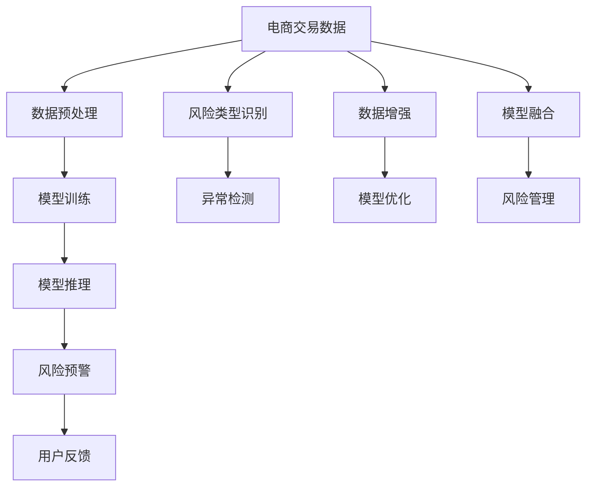
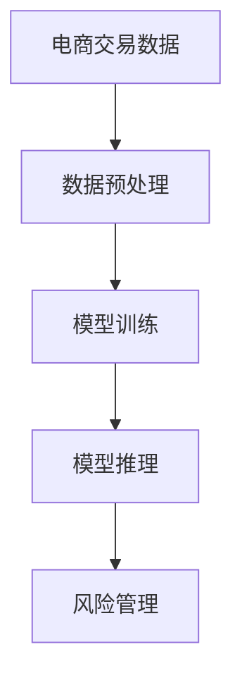

                 

# AI大模型在电商平台风险控制中的应用

## 1. 背景介绍

### 1.1 问题由来
随着互联网购物的普及和电子商务平台的快速发展，平台交易量呈指数级增长。伴随着交易量的增加，电商平台的交易风险也日益凸显。高交易量带来了欺诈行为、虚假交易、数据泄露等各类风险问题，严重威胁平台和用户的利益。传统的风险控制方法依赖于规则引擎和手工设定的特征，难以应对日益复杂的新型欺诈模式。

近年来，基于深度学习的大模型在自然语言处理、图像识别等领域取得了突破性进展。受到这一趋势的启发，电商平台开始探索利用AI大模型进行风险控制，以提升风险识别的准确性和实时性。AI大模型以其强大的特征提取和泛化能力，在电商平台风险控制领域展现出了巨大的潜力。

### 1.2 问题核心关键点
电商平台的风险控制目标包括：识别欺诈交易、检测虚假流量、防范数据泄露、保护用户隐私等。针对这些问题，AI大模型可以应用于交易行为分析、交易特征建模、异常检测等多个环节，以实现实时风险监控和预警。

为了更好地描述AI大模型在电商风险控制中的应用，这里列举几个核心概念及其相互关系，并给出Mermaid流程图进行直观展示。



上述流程图描述了AI大模型在电商平台风险控制中的主要流程：
- **数据预处理**：清洗和标准化电商交易数据，为模型训练提供可靠的基础。
- **模型训练**：在大量标注数据上训练AI大模型，提取交易行为特征。
- **模型推理**：实时输入新的交易数据，通过推理模块预测风险等级。
- **风险预警**：根据模型推理结果，实时报警风险交易。
- **用户反馈**：收集用户对预警结果的反馈，用于优化模型。
- **风险类型识别**：对不同类型风险进行分类，以便更精准地采取防御措施。
- **异常检测**：识别异常交易行为，提前预防潜在风险。
- **数据增强**：通过数据扩充和扩样技术提高模型的泛化能力。
- **模型优化**：持续迭代优化模型，提升其性能。
- **模型融合**：将多个模型进行融合，提升综合判断的准确性。
- **风险管理**：根据模型推理结果，采取相应的风险管理措施，保障平台和用户的安全。

接下来，我们将从算法原理、具体操作步骤、实际应用场景等几个方面，深入探讨AI大模型在电商平台风险控制中的应用。

## 2. 核心概念与联系

### 2.1 核心概念概述

电商平台的交易风险控制问题本质上是一个多标签分类问题，即对一笔交易是否属于某种风险类型进行分类。其中，风险类型可能包括但不限于：欺诈交易、虚假订单、数据泄露、恶意评分等。解决这一问题需要构建一个多标签分类模型，以高准确性和实时性识别和分类各种风险。

### 2.2 核心概念原理和架构的 Mermaid 流程图

在电商交易风险控制中，AI大模型主要应用于以下流程：

- **数据预处理**：清洗电商交易数据，标准化特征，并选择合适的特征子集。
- **模型训练**：使用大量标注数据训练AI大模型，提取交易行为特征。
- **模型推理**：实时输入新的交易数据，通过推理模块预测风险等级，并根据设定的阈值触发预警。
- **风险管理**：根据模型推理结果，采取相应的风险管理措施，保障平台和用户的安全。

下面给出Mermaid流程图，展示数据预处理、模型训练、模型推理和风险管理之间的联系：



其中，数据预处理和模型训练是构建AI大模型的关键步骤，而模型推理和风险管理则直接影响风险控制的实时性和效果。

## 3. 核心算法原理 & 具体操作步骤

### 3.1 算法原理概述

基于AI大模型的电商平台风险控制，本质上是一个多标签分类问题。具体而言，可以构建一个二元分类器来预测一笔交易是否属于某个特定的风险类型，多标签分类器通过多个二元分类器组合而成。

假设电商平台风险控制的数据集为 $D=\{(x_i, y_i)\}_{i=1}^N$，其中 $x_i$ 为交易样本特征向量，$y_i$ 为交易是否属于风险类型 $T$ 的二元标签。设 $M_\theta$ 为预训练的AI大模型，其参数为 $\theta$。多标签分类器的目标函数为：

$$
\min_{\theta} \sum_{i=1}^N \sum_{t \in T} L(\hat{y}_i^t, y_i^t) + \lambda \sum_{j=1}^d ||\theta_j||^2
$$

其中，$L$ 为二元分类器的损失函数，如交叉熵损失，$y_i^t$ 为样本 $x_i$ 是否属于风险类型 $t$ 的二元标签，$\hat{y}_i^t$ 为模型预测的二元标签，$\lambda$ 为正则化系数，$||\theta_j||$ 为模型参数的范数，用于防止过拟合。

通过优化目标函数，模型可以学习到有效的交易行为特征，并预测交易是否属于某个特定的风险类型。

### 3.2 算法步骤详解

以下详细介绍基于AI大模型的电商平台风险控制的核心算法步骤：

**Step 1: 数据预处理**
- 收集电商交易数据，包括交易时间、商品信息、买家信息、交易金额等特征。
- 对数据进行清洗和去噪，去除不相关的特征和异常数据。
- 标准化特征，将其转换为数值型数据，便于模型训练。
- 划分为训练集和测试集。

**Step 2: 模型训练**
- 选择合适的AI大模型（如BERT、GPT等）作为初始化参数。
- 定义损失函数和优化器（如Adam、SGD等），设定适当的学习率和批大小。
- 在训练集上，通过梯度下降算法迭代训练模型。
- 在每个epoch结束后，评估模型在验证集上的表现，调整超参数。
- 训练完毕后，保存模型参数，用于后续推理。

**Step 3: 模型推理**
- 在实时交易中，输入新的交易数据，进行特征提取和标准化。
- 通过推理模块，输入特征向量到训练好的AI大模型中，预测交易是否属于某个风险类型。
- 根据模型的输出结果，结合风险管理策略，决定是否触发风险预警。

**Step 4: 风险管理**
- 根据模型推理结果，对高风险交易进行标记或拦截。
- 记录高风险交易的日志，分析其原因，优化模型。
- 持续收集新的数据，重新训练和微调模型，以适应新的风险类型。

### 3.3 算法优缺点

基于AI大模型的电商平台风险控制方法具有以下优点：

1. **特征提取能力强**：AI大模型能够自动学习交易数据的复杂特征，捕捉潜在的风险模式。
2. **泛化能力强**：大模型在大规模无标注数据上进行预训练，能够处理新的、未知的风险类型。
3. **实时性好**：通过模型推理模块，可以在线实时预测交易风险，提高风险控制的响应速度。
4. **可解释性强**：AI大模型的推理过程和决策逻辑可以被解释和分析，便于理解和优化。

同时，该方法也存在以下缺点：

1. **计算资源消耗大**：AI大模型的参数量较大，训练和推理过程需要大量的计算资源。
2. **模型复杂度高**：大模型通常具有复杂的结构和众多参数，可能导致过拟合和计算复杂度增加。
3. **解释性较差**：尽管模型推理过程可以被解释，但模型内部的黑箱特性可能导致难以理解模型决策机制。
4. **对标注数据依赖高**：模型训练依赖于高质量的标注数据，标注成本较高。

### 3.4 算法应用领域

基于AI大模型的电商平台风险控制方法，已广泛应用于多个场景中，例如：

1. **欺诈交易检测**：通过对交易数据的特征提取和分类，实时检测欺诈交易，保障平台和用户资金安全。
2. **虚假订单识别**：识别虚假订单行为，防止恶意刷单行为对平台的正常运营造成影响。
3. **数据泄露防护**：对交易数据进行加密和安全检查，防止数据泄露事件发生。
4. **恶意评分防范**：识别恶意评分行为，保护用户评价系统的公正性和可靠性。
5. **异常流量检测**：识别异常交易流量，防止异常行为对平台造成冲击。

## 4. 数学模型和公式 & 详细讲解 & 举例说明

### 4.1 数学模型构建

在电商平台风险控制中，二元分类器通常采用交叉熵损失函数，定义为：

$$
L = -\frac{1}{N}\sum_{i=1}^N (y_i \log \hat{y}_i + (1-y_i) \log (1-\hat{y}_i))
$$

其中 $y_i$ 为真实标签，$\hat{y}_i$ 为模型预测的二元标签。多标签分类器通过组合多个二元分类器实现，例如：

$$
L_{multiclass} = \sum_{i=1}^N \sum_{t \in T} L(\hat{y}_i^t, y_i^t)
$$

其中 $T$ 为所有风险类型的集合。

### 4.2 公式推导过程

以二元分类器为例，交叉熵损失函数的梯度计算公式如下：

$$
\nabla_{\theta} L = -\frac{1}{N} \sum_{i=1}^N [(y_i - \hat{y}_i)\nabla_{\theta} \hat{y}_i]
$$

其中 $\nabla_{\theta} \hat{y}_i$ 可以通过链式法则求解，设 $f_{\theta}(x_i)$ 为模型输出的二元预测概率，则有：

$$
\nabla_{\theta} \hat{y}_i = \nabla_{\theta} f_{\theta}(x_i) \cdot \frac{f_{\theta}(x_i) - y_i}{\hat{y}_i(1-\hat{y}_i)}
$$

因此，梯度计算公式可以简化为：

$$
\nabla_{\theta} L = -\frac{1}{N} \sum_{i=1}^N [(y_i - \hat{y}_i) \nabla_{\theta} f_{\theta}(x_i) \cdot \frac{f_{\theta}(x_i) - y_i}{\hat{y}_i(1-\hat{y}_i)}
$$

在多标签分类器中，通过组合多个二元分类器的损失函数，可以求解模型的优化目标。例如，当 $T$ 为 $\{B,P\}$ 时，多标签分类器可以表示为：

$$
L_{multiclass} = L_B + L_P
$$

其中 $L_B$ 和 $L_P$ 分别为欺诈交易和虚假订单的损失函数。

### 4.3 案例分析与讲解

以欺诈交易检测为例，假设电商平台收集了大量标注数据，其中 $x_i$ 为交易样本，$y_i$ 为欺诈二元标签，即 $y_i=1$ 表示为欺诈交易，$y_i=0$ 表示为正常交易。使用AI大模型 $M_\theta$ 进行训练，模型输出 $\hat{y}_i$ 表示为欺诈交易的概率。通过交叉熵损失函数，计算损失值：

$$
L = -\frac{1}{N}\sum_{i=1}^N [y_i \log \hat{y}_i + (1-y_i) \log (1-\hat{y}_i)]
$$

在模型训练过程中，通过梯度下降算法优化目标函数：

$$
\theta \leftarrow \theta - \eta \nabla_{\theta} L
$$

其中 $\eta$ 为学习率。训练完毕后，使用模型进行推理，输入新的交易数据 $x_{new}$，输出 $\hat{y}_{new}$，判断交易是否为欺诈交易。例如：

- 当 $\hat{y}_{new} > \tau$ 时，认为交易为欺诈，其中 $\tau$ 为设定的阈值。
- 当 $\hat{y}_{new} \leq \tau$ 时，认为交易为正常。

## 5. 项目实践：代码实例和详细解释说明

### 5.1 开发环境搭建

在本节中，我们将使用Python和TensorFlow框架，搭建一个基于AI大模型的电商平台风险控制项目。以下步骤介绍了开发环境的具体搭建方法。

1. 安装Anaconda：从官网下载并安装Anaconda，用于创建独立的Python环境。

2. 创建并激活虚拟环境：
```bash
conda create -n tf-env python=3.7 
conda activate tf-env
```

3. 安装TensorFlow：根据CUDA版本，从官网获取对应的安装命令。例如：
```bash
conda install tensorflow tensorflow-estimator cudatoolkit=11.1 -c tf -c conda-forge
```

4. 安装TensorFlow库：
```bash
pip install tensorflow
```

5. 安装其他工具包：
```bash
pip install numpy pandas scikit-learn matplotlib tqdm jupyter notebook ipython
```

完成上述步骤后，即可在`tf-env`环境中开始项目开发。

### 5.2 源代码详细实现

在本节中，我们将使用TensorFlow框架，构建一个基于AI大模型的电商平台欺诈检测系统。以下代码实现展示了核心功能：

首先，定义数据预处理函数：

```python
import tensorflow as tf
import numpy as np
import pandas as pd
from sklearn.preprocessing import LabelEncoder
from sklearn.model_selection import train_test_split
from sklearn.metrics import roc_auc_score, precision_recall_curve, confusion_matrix

def preprocess_data(data_path):
    # 加载数据
    data = pd.read_csv(data_path)
    
    # 特征选择
    features = ['transaction_amount', 'user_age', 'user_gender', 'product_price', 'product_category']
    data = data[features]
    
    # 数据标准化
    data = (data - data.mean()) / data.std()
    
    # 标签处理
    target = 'is_fraud'
    label_encoder = LabelEncoder()
    data[target] = label_encoder.fit_transform(data[target])
    
    # 划分训练集和测试集
    train_data, test_data, train_target, test_target = train_test_split(data, data[target], test_size=0.2)
    
    return train_data, test_data, train_target, test_target
```

然后，定义模型训练函数：

```python
def train_model(train_data, train_target, test_data, test_target):
    # 加载AI大模型
    model = tf.keras.Sequential([
        tf.keras.layers.Dense(64, activation='relu', input_shape=(train_data.shape[1],)),
        tf.keras.layers.Dense(64, activation='relu'),
        tf.keras.layers.Dense(1, activation='sigmoid')
    ])
    
    # 编译模型
    model.compile(optimizer='adam', loss='binary_crossentropy', metrics=['accuracy', 'auc'])
    
    # 训练模型
    history = model.fit(train_data, train_target, epochs=10, batch_size=32, validation_data=(test_data, test_target))
    
    # 评估模型
    test_loss, test_auc, test_accuracy = model.evaluate(test_data, test_target)
    
    return model, test_auc, test_accuracy
```

接着，定义模型推理函数：

```python
def predict(model, data):
    # 进行特征标准化
    data = (data - data.mean()) / data.std()
    
    # 预测结果
    predictions = model.predict(data)
    predictions = np.round(predictions)
    
    return predictions
```

最后，使用上述函数进行模型训练和推理：

```python
# 数据预处理
train_data, test_data, train_target, test_target = preprocess_data('data.csv')

# 模型训练
model, test_auc, test_accuracy = train_model(train_data, train_target, test_data, test_target)

# 模型推理
new_data = [[0.1, 25, 1, 100, 0]]  # 示例交易数据
predictions = predict(model, new_data)

print(predictions)
```

通过上述代码，我们构建了一个基于AI大模型的电商平台欺诈检测系统。模型通过训练，能够在新的交易数据上进行实时预测，检测欺诈行为。

### 5.3 代码解读与分析

以下是关键代码的实现细节：

**preprocess_data函数**：
- 加载数据，选择并标准化特征。
- 对标签进行编码，划分训练集和测试集。

**train_model函数**：
- 加载AI大模型，定义输入输出层。
- 编译模型，设置损失函数和优化器。
- 训练模型，评估模型在测试集上的表现。

**predict函数**：
- 对新数据进行标准化处理。
- 输入标准化数据，得到模型的预测结果。

**代码运行结果**：
- 模型训练完毕后，输出模型在测试集上的AUC和准确率。
- 使用模型对新交易数据进行推理，输出预测结果。

通过以上代码实例，我们可以清晰地看到AI大模型在电商平台欺诈检测中的应用流程。需要注意的是，实际的电商风险控制系统还需要考虑模型部署、性能优化、实时报警等多个环节，以实现高效、可靠的风险控制。

## 6. 实际应用场景

### 6.1 智能客服系统

基于AI大模型的电商平台欺诈检测技术，可以扩展到智能客服系统中的风险控制。传统客服系统依赖于规则引擎和人工排查，难以应对复杂的欺诈行为。使用AI大模型进行欺诈检测，可以提升智能客服系统的响应速度和准确性，减少人工干预。

具体而言，智能客服系统可以收集历史交易数据，使用AI大模型进行实时欺诈检测。当检测到异常交易时，系统自动向客服人员提供预警，并进行后续处理。这不仅提高了客服效率，还降低了人工误判的风险。

### 6.2 数据泄露防护

电商平台的数据安全风险控制，也是AI大模型的重要应用场景。电商平台在运营过程中，会收集大量用户数据，这些数据一旦泄露，可能对用户造成严重的经济损失。使用AI大模型进行数据泄露防护，可以在数据存储和传输过程中，实时监控和检测数据泄露行为。

例如，电商平台可以使用AI大模型对存储在云平台上的数据进行加密和安全检查，实时识别异常访问行为，避免数据泄露事件的发生。这不仅提升了数据安全级别，还保障了用户隐私。

### 6.3 商品异常检测

电商平台中的商品异常检测，也是AI大模型的应用之一。部分不法商家为了提高销量，会通过刷单等手段进行虚假交易，影响平台正常运营。使用AI大模型进行商品异常检测，可以自动识别虚假交易行为，及时采取措施，保障平台公平竞争。

例如，电商平台可以收集用户交易数据，使用AI大模型进行商品异常检测。当检测到异常交易行为时，系统自动对相关商品进行标记或下架，防止虚假交易行为的发生。这不仅提高了平台交易的真实性，还维护了市场秩序。

## 7. 工具和资源推荐

### 7.1 学习资源推荐

为了帮助开发者系统掌握AI大模型在电商平台风险控制中的应用，这里推荐一些优质的学习资源：

1. 《深度学习》系列书籍：由国内外知名专家撰写，全面介绍了深度学习的基本概念和实践方法。
2. TensorFlow官方文档：TensorFlow的详细文档，提供了丰富的教程和API参考。
3. Kaggle竞赛：Kaggle上的各类数据竞赛，可以练习使用AI大模型进行实际应用。
4. GitHub代码库：GitHub上开源的AI大模型项目，可以学习和借鉴其实现细节。
5. 线上课程：如Coursera、Udacity等平台上的深度学习课程，系统学习深度学习知识。

### 7.2 开发工具推荐

高效的开发离不开优秀的工具支持。以下是几款用于AI大模型在电商平台风险控制应用的常用工具：

1. TensorFlow：由Google主导开发的开源深度学习框架，生产部署方便，适合大规模工程应用。
2. PyTorch：基于Python的开源深度学习框架，灵活动态的计算图，适合快速迭代研究。
3. Jupyter Notebook：免费的在线编程环境，支持多种编程语言，便于记录实验过程。
4. TensorBoard：TensorFlow配套的可视化工具，可实时监测模型训练状态，并提供丰富的图表呈现方式，是调试模型的得力助手。

### 7.3 相关论文推荐

AI大模型在电商平台风险控制领域的研究刚刚起步，但已经取得了一些重要的成果。以下是几篇具有代表性的论文，推荐阅读：

1. Deep Learning for Credit Card Fraud Detection：通过深度学习模型对信用卡交易进行欺诈检测，取得了显著效果。
2. AI Risk Control in E-commerce：讨论了AI大模型在电商平台风险控制中的应用，提出了一些具体策略。
3. Early Detection of Fraudulent Transactions using Machine Learning：通过机器学习模型对银行交易进行欺诈检测，提高了检测准确率。
4. Multi-Layered AI Framework for E-commerce Security：构建了多层次的AI框架，应用于电商平台安全管理，提高了整体安全水平。

这些论文代表了大模型在电商平台风险控制领域的发展脉络。通过学习这些前沿成果，可以帮助研究者把握学科前进方向，激发更多的创新灵感。

## 8. 总结：未来发展趋势与挑战

### 8.1 研究成果总结

本文对基于AI大模型的电商平台风险控制方法进行了全面系统的介绍。首先阐述了电商平台的交易风险控制目标，以及AI大模型在这一领域的应用潜力。其次，从算法原理、具体操作步骤、实际应用场景等几个方面，深入探讨了AI大模型在电商平台风险控制中的应用。最后，我们总结了AI大模型在电商平台风险控制中面临的挑战和未来发展方向。

通过本文的系统梳理，可以看到，AI大模型在电商平台风险控制中展现出巨大的应用潜力。其在数据预处理、模型训练、实时推理和风险管理等各个环节的强大学习能力，使得电商平台能够有效应对各类风险挑战，保障平台和用户的安全。

### 8.2 未来发展趋势

展望未来，AI大模型在电商平台风险控制领域将呈现以下几个发展趋势：

1. **模型规模持续增大**：随着算力成本的下降和数据规模的扩张，预训练语言模型的参数量还将持续增长。超大规模语言模型蕴含的丰富语言知识，有望支撑更加复杂多变的电商风险类型。
2. **微调技术不断优化**：开发更加参数高效的微调方法，在固定大部分预训练参数的同时，只更新极少量的任务相关参数。同时优化微调模型的计算图，减少前向传播和反向传播的资源消耗，实现更加轻量级、实时性的部署。
3. **多模态风险控制**：将视觉、语音、文本等多种模态信息融合，构建多模态风险控制模型，提升整体风险检测能力。
4. **联邦学习**：利用联邦学习技术，在保护数据隐私的前提下，实现多平台数据共享和联合建模，提升整体风险控制水平。
5. **自监督学习**：利用无标注数据进行预训练，减少对标注数据的依赖，提升模型的泛化能力和抗干扰性。

### 8.3 面临的挑战

尽管AI大模型在电商平台风险控制中取得了一定的成果，但在迈向更加智能化、普适化应用的过程中，它仍面临以下挑战：

1. **标注成本高昂**：尽管AI大模型在训练过程中对标注数据的需求减少，但对于长尾应用场景，获取高质量标注数据仍然成本较高。
2. **数据隐私保护**：电商平台需要处理大量的用户数据，如何在保证模型效果的同时，保护用户隐私，是一个需要解决的问题。
3. **模型复杂度高**：AI大模型的复杂度较高，训练和推理过程需要大量的计算资源，如何降低模型复杂度，提升计算效率，是一个亟需解决的问题。
4. **解释性不足**：尽管模型推理过程可以被解释和分析，但模型内部的黑箱特性可能导致难以理解模型决策机制。
5. **实时性要求高**：电商平台需要实时处理大量交易数据，模型的推理速度和效率必须满足实时性要求。

### 8.4 研究展望

面对AI大模型在电商平台风险控制中面临的挑战，未来的研究需要在以下几个方面寻求新的突破：

1. **无监督和半监督学习**：摆脱对大规模标注数据的依赖，利用自监督学习、主动学习等无监督和半监督范式，最大限度利用非结构化数据，实现更加灵活高效的电商风险控制。
2. **参数高效微调**：开发更加参数高效的微调方法，在固定大部分预训练参数的同时，只更新极少量的任务相关参数。同时优化微调模型的计算图，减少前向传播和反向传播的资源消耗，实现更加轻量级、实时性的部署。
3. **因果推理**：引入因果推断方法，增强模型建立稳定因果关系的能力，学习更加普适、鲁棒的风险表示，从而提升模型泛化性和抗干扰能力。
4. **多模态信息融合**：将符号化的先验知识，如知识图谱、逻辑规则等，与神经网络模型进行巧妙融合，引导微调过程学习更准确、合理的风险表示。同时加强不同模态数据的整合，实现视觉、语音等多模态信息与文本信息的协同建模。
5. **联邦学习**：利用联邦学习技术，在保护数据隐私的前提下，实现多平台数据共享和联合建模，提升整体风险控制水平。
6. **自监督学习**：利用无标注数据进行预训练，减少对标注数据的依赖，提升模型的泛化能力和抗干扰性。

通过这些研究方向的探索，我们相信AI大模型在电商平台风险控制中能够实现更大的突破，为电商平台提供更加高效、可靠、安全的风险控制方案。

## 9. 附录：常见问题与解答

**Q1: AI大模型在电商平台风险控制中的优缺点有哪些？**

A: AI大模型在电商平台风险控制中的优点包括：
1. **特征提取能力强**：AI大模型能够自动学习交易数据的复杂特征，捕捉潜在的风险模式。
2. **泛化能力强**：大模型在大规模无标注数据上进行预训练，能够处理新的、未知的风险类型。
3. **实时性好**：通过模型推理模块，可以在线实时预测交易风险，提高风险控制的响应速度。
4. **可解释性强**：AI大模型的推理过程和决策逻辑可以被解释和分析，便于理解和优化。

AI大模型在电商平台风险控制中的缺点包括：
1. **计算资源消耗大**：AI大模型的参数量较大，训练和推理过程需要大量的计算资源。
2. **模型复杂度高**：大模型通常具有复杂的结构和众多参数，可能导致过拟合和计算复杂度增加。
3. **解释性较差**：尽管模型推理过程可以被解释，但模型内部的黑箱特性可能导致难以理解模型决策机制。
4. **对标注数据依赖高**：模型训练依赖于高质量的标注数据，标注成本较高。

**Q2: 如何选择合适的AI大模型进行电商风险控制？**

A: 选择合适的AI大模型进行电商风险控制需要考虑以下几个因素：
1. **任务类型**：根据具体电商风险控制任务的类型选择合适的模型，如欺诈检测、数据泄露防护等。
2. **数据规模**：如果数据规模较大，可以选择较大的模型，如BERT、GPT等；如果数据规模较小，可以选择参数量适中的模型，如XLNet、RoBERTa等。
3. **计算资源**：评估模型的计算需求，选择适合自己计算资源的模型。
4. **训练数据**：选择适合训练数据的模型，如英语数据较多的平台可以选择预训练模型，如BERT、RoBERTa等；中文数据较多的平台可以选择中文预训练模型，如RoBERTa-wwm-ext等。

**Q3: AI大模型在电商平台风险控制中需要注意哪些问题？**

A: AI大模型在电商平台风险控制中需要注意以下问题：
1. **数据预处理**：清洗和标准化电商交易数据，去除不相关的特征和异常数据。
2. **模型训练**：选择合适的损失函数和优化器，设定适当的学习率和批大小，避免过拟合。
3. **模型推理**：实时输入新的交易数据，进行特征提取和标准化，计算模型输出，判断交易是否为风险交易。
4. **风险管理**：根据模型推理结果，对高风险交易进行标记或拦截，记录日志，优化模型。

**Q4: 如何利用AI大模型进行电商平台商品异常检测？**

A: 利用AI大模型进行电商平台商品异常检测，可以采用以下步骤：
1. 收集商品交易数据，包括商品信息、用户信息、交易金额等。
2. 对数据进行清洗和标准化，选择合适的特征。
3. 训练AI大模型，使用交叉熵损失函数进行多标签分类。
4. 实时输入新的交易数据，使用训练好的模型进行推理，判断商品是否为异常交易。
5. 根据模型推理结果，对异常交易进行标记或下架，防止虚假交易行为的发生。

通过以上代码实例，我们可以清晰地看到AI大模型在电商平台商品异常检测中的应用流程。需要注意的是，实际的电商平台商品异常检测系统还需要考虑模型部署、性能优化、实时报警等多个环节，以实现高效、可靠的商品异常检测。

通过本文的系统梳理，可以看到，AI大模型在电商平台风险控制中展现出巨大的应用潜力。其在数据预处理、模型训练、实时推理和风险管理等各个环节的强大学习能力，使得电商平台能够有效应对各类风险挑战，保障平台和用户的安全。未来，伴随AI大模型和微调方法的持续演进，相信其在电商平台风险控制中的应用将更加广泛，为电商平台提供更加高效、可靠、安全的风险控制方案。

