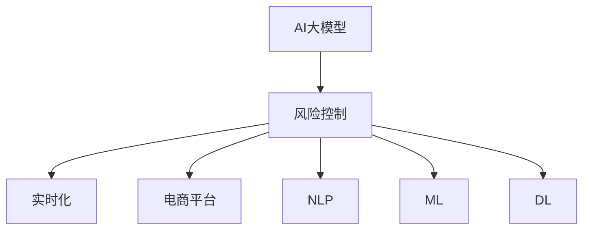

                 

# AI大模型在电商平台风险控制实时化中的应用

> 关键词：大模型,风险控制,实时化,电商平台,自然语言处理(NLP),机器学习(ML),深度学习(DL)

## 1. 背景介绍

### 1.1 问题由来
随着电子商务的快速发展，电商平台成为了人们日常购物的重要渠道。但与此同时，电商平台也面临着诸如欺诈交易、恶意评论、虚假广告等风险问题，这些问题不仅损害了平台的利益，也给消费者带来了困扰。因此，电商平台亟需一种高效、准确的风险控制方法，以保障平台和消费者的权益。

### 1.2 问题核心关键点
电商平台风险控制的核心在于识别和应对潜在的风险行为。传统方法依赖人工审核和规则匹配，效率低下且无法覆盖所有复杂场景。而利用AI大模型，可以构建更为智能化的风险控制系统，实现实时化、自动化、个性化风险监控。

### 1.3 问题研究意义
通过引入AI大模型，电商平台能够实时化、自动化地检测和应对各种风险行为，极大地提高了风险控制的效率和准确性。这不仅能够减少平台的运营成本，提升用户体验，还能够帮助平台构建更健康、更可持续的生态系统。因此，研究AI大模型在电商平台风险控制中的应用，对于电商行业乃至整个互联网行业都有着重要的实践价值和理论意义。

## 2. 核心概念与联系

### 2.1 核心概念概述

为更好地理解AI大模型在电商平台风险控制中的应用，本节将介绍几个密切相关的核心概念：

- AI大模型(AI Large Model)：指通过大规模预训练学习得到的强大表示能力的人工智能模型，如BERT、GPT-3、XLNet等。这些模型具有高度的泛化能力和语义理解能力，可以广泛应用于自然语言处理、计算机视觉等多个领域。

- 风险控制(Risk Control)：指通过监测和识别潜在风险行为，及时采取措施以降低风险损失的过程。风险控制是电商平台用户权益保护的核心环节。

- 实时化(Real-time)：指在极短的时间内（如毫秒级）处理和响应用户请求，确保风险控制过程的及时性和高效性。

- 电商平台(E-Commerce Platform)：指以互联网为媒介，提供商品交易、在线支付、物流配送等服务的平台。包括传统B2C、C2C、B2B等模式。

- 自然语言处理(NLP)：指使用计算机处理人类语言的技术，包括文本分类、情感分析、实体识别等任务。

- 机器学习(ML)：指通过算法和模型，从数据中学习规律并进行预测或决策的过程。

- 深度学习(DL)：指使用神经网络等深度模型，从大量数据中学习复杂表示并进行预测或决策的过程。

这些核心概念之间的逻辑关系可以通过以下Mermaid流程图来展示：



这个流程图展示了大模型在风险控制中的核心作用和关键要素：

1. AI大模型通过预训练获得强大的语义理解和表示能力。
2. 风险控制应用中，大模型可以实时化、自动化地处理大量文本数据，识别潜在风险行为。
3. 电商平台需要实时化风险控制来应对高速增长的交易量。
4. 自然语言处理和机器学习深度学习技术是构建风险控制模型的基础。

## 3. 核心算法原理 & 具体操作步骤
### 3.1 算法原理概述

基于AI大模型的电商平台风险控制方法，通过构建实时化的自然语言处理系统，实现对用户行为和内容的自动化分析和监测。其核心思想是：利用AI大模型的强大语义理解能力，从大量交易和用户评论数据中自动识别风险特征，并及时响应风险事件。

形式化地，假设电商平台的数据为 $D=\{(x_i, y_i)\}_{i=1}^N, x_i \in \mathcal{X}, y_i \in \{0,1\}$，其中 $x_i$ 为交易记录或用户评论，$y_i$ 为风险标签，1表示存在风险，0表示正常。目标是在数据集 $D$ 上训练模型，使其能够根据新数据实时识别风险。

大模型 $M_{\theta}$ 在输入 $x$ 上的输出为 $y_{pred}=M_{\theta}(x)$，其中 $\theta$ 为模型参数。风险控制的目标是最小化损失函数 $\mathcal{L}(y_{pred}, y)$，即：

$$
\mathcal{L}(y_{pred}, y) = -y\log y_{pred} - (1-y)\log(1-y_{pred})
$$

在得到损失函数后，使用梯度下降等优化算法，最小化损失函数，得到最优参数 $\hat{\theta}$：

$$
\hat{\theta} = \mathop{\arg\min}_{\theta} \mathcal{L}(y_{pred}, y)
$$

### 3.2 算法步骤详解

基于AI大模型的电商平台风险控制一般包括以下几个关键步骤：

**Step 1: 数据准备**
- 收集电商平台的历史交易数据、用户评论、支付记录等，并进行标注，构建风险数据集 $D$。

**Step 2: 模型选择和预训练**
- 选择合适的大模型，如BERT、RoBERTa、GPT等，进行预训练。预训练任务可以包括掩码语言模型、下一句预测等。

**Step 3: 任务适配**
- 根据具体风险控制需求，设计任务适配层，如添加任务标签、定义损失函数等。

**Step 4: 微调**
- 在预训练模型基础上，使用风险数据集 $D$ 对模型进行微调。微调过程中使用小批量梯度下降，保持预训练权重不变。

**Step 5: 部署**
- 将微调后的模型部署到电商平台的实时监控系统中，实现对用户行为和内容的实时分析和风险响应。

**Step 6: 监控和更新**
- 持续监控模型性能，定期使用新数据进行微调更新，确保模型能够适应不断变化的风险环境。

### 3.3 算法优缺点

基于AI大模型的电商平台风险控制方法具有以下优点：
1. 高效性：大模型的强大语义理解能力使得模型能够实时处理大量数据，识别风险行为。
2. 准确性：大模型经过大量数据预训练，具备较高的泛化能力，能够在多种场景下保持高精度。
3. 自动化：自动化的风险识别和响应过程，减少了人工审核的复杂性和成本。
4. 实时化：模型可以实时接收新数据，并快速做出响应，提高了风险控制的时效性。

同时，该方法也存在一定的局限性：
1. 数据标注成本高：风险数据集需要大量人工标注，标注成本较高。
2. 模型复杂度高：大模型的参数量庞大，对计算资源要求较高。
3. 模型维护难度大：模型的参数更新和维护需要专业人员进行管理。
4. 解释性不足：大模型的决策过程较为复杂，难以解释其内部机制和推理过程。

尽管存在这些局限性，但就目前而言，基于AI大模型的风险控制方法仍是目前电商平台上应用最为广泛和成熟的技术之一。未来相关研究的重点在于如何进一步降低数据标注成本，提高模型效率和可解释性，同时兼顾实时性和自动化。

### 3.4 算法应用领域

基于AI大模型的电商平台风险控制技术，已经被广泛应用于多个领域：

- 欺诈检测：实时监测交易行为，识别异常交易和欺诈行为。
- 恶意评论检测：自动识别恶意评论，避免负面影响。
- 虚假广告识别：识别和过滤虚假广告，维护平台内容质量。
- 支付风险控制：实时监测支付行为，防范欺诈和异常交易。
- 物流跟踪监控：实时监测物流信息，防范虚假订单和配送欺诈。

除了上述这些经典应用外，大模型技术还被创新性地应用到更多场景中，如用户行为分析、商品推荐、异常交易预测等，为电商平台带来了全新的突破。随着预训练模型和风险控制方法的不断进步，相信电商平台风险控制技术还将不断创新和提升，为电商平台的安全稳定发展提供新的技术保障。

## 4. 数学模型和公式 & 详细讲解
### 4.1 数学模型构建

本节将使用数学语言对基于AI大模型的电商平台风险控制过程进行更加严格的刻画。

记电商平台的数据为 $D=\{(x_i, y_i)\}_{i=1}^N, x_i \in \mathcal{X}, y_i \in \{0,1\}$。大模型 $M_{\theta}$ 在输入 $x$ 上的输出为 $y_{pred}=M_{\theta}(x)$，其中 $\theta$ 为模型参数。

定义模型 $M_{\theta}$ 在输入 $x$ 上的损失函数为 $\ell(y_{pred}, y)$，则在数据集 $D$ 上的经验风险为：

$$
\mathcal{L}(\theta) = \frac{1}{N} \sum_{i=1}^N \ell(y_{pred}, y_i)
$$

其中 $\ell(y_{pred}, y_i)$ 为交叉熵损失函数，用于衡量模型预测和实际标签之间的差异。在风险控制任务中，通常将模型输出 $y_{pred}$ 与真实标签 $y_i$ 进行比较，最小化交叉熵损失。

### 4.2 公式推导过程

以下我们以二分类任务为例，推导交叉熵损失函数及其梯度的计算公式。

假设模型 $M_{\theta}$ 在输入 $x$ 上的输出为 $\hat{y}=M_{\theta}(x) \in [0,1]$，表示样本属于正类的概率。真实标签 $y \in \{0,1\}$。则二分类交叉熵损失函数定义为：

$$
\ell(M_{\theta}(x),y) = -[y\log \hat{y} + (1-y)\log(1-\hat{y})]
$$

将其代入经验风险公式，得：

$$
\mathcal{L}(\theta) = -\frac{1}{N}\sum_{i=1}^N [y_i\log M_{\theta}(x_i)+(1-y_i)\log(1-M_{\theta}(x_i))]
$$

根据链式法则，损失函数对参数 $\theta_k$ 的梯度为：

$$
\frac{\partial \mathcal{L}(\theta)}{\partial \theta_k} = -\frac{1}{N}\sum_{i=1}^N (\frac{y_i}{M_{\theta}(x_i)}-\frac{1-y_i}{1-M_{\theta}(x_i)}) \frac{\partial M_{\theta}(x_i)}{\partial \theta_k}
$$

其中 $\frac{\partial M_{\theta}(x_i)}{\partial \theta_k}$ 可进一步递归展开，利用自动微分技术完成计算。

在得到损失函数的梯度后，即可带入参数更新公式，完成模型的迭代优化。重复上述过程直至收敛，最终得到适应电商平台风险控制的模型参数 $\theta^*$。

## 5. 项目实践：代码实例和详细解释说明
### 5.1 开发环境搭建

在进行风险控制实践前，我们需要准备好开发环境。以下是使用Python进行PyTorch开发的环境配置流程：

1. 安装Anaconda：从官网下载并安装Anaconda，用于创建独立的Python环境。

2. 创建并激活虚拟环境：
```bash
conda create -n pytorch-env python=3.8 
conda activate pytorch-env
```

3. 安装PyTorch：根据CUDA版本，从官网获取对应的安装命令。例如：
```bash
conda install pytorch torchvision torchaudio cudatoolkit=11.1 -c pytorch -c conda-forge
```

4. 安装Transformers库：
```bash
pip install transformers
```

5. 安装各类工具包：
```bash
pip install numpy pandas scikit-learn matplotlib tqdm jupyter notebook ipython
```

完成上述步骤后，即可在`pytorch-env`环境中开始风险控制实践。

### 5.2 源代码详细实现

这里我们以电商平台的欺诈检测任务为例，给出使用Transformers库对BERT模型进行微调的PyTorch代码实现。

首先，定义欺诈检测任务的数据处理函数：

```python
from transformers import BertTokenizer
from torch.utils.data import Dataset
import torch

class FraudDetectionDataset(Dataset):
    def __init__(self, transactions, labels, tokenizer, max_len=128):
        self.transactions = transactions
        self.labels = labels
        self.tokenizer = tokenizer
        self.max_len = max_len
        
    def __len__(self):
        return len(self.transactions)
    
    def __getitem__(self, item):
        transaction = self.transactions[item]
        label = self.labels[item]
        
        encoding = self.tokenizer(transaction, return_tensors='pt', max_length=self.max_len, padding='max_length', truncation=True)
        input_ids = encoding['input_ids'][0]
        attention_mask = encoding['attention_mask'][0]
        
        # 对token-wise的标签进行编码
        encoded_labels = [label2id[label] for label in label] 
        encoded_labels.extend([label2id['normal']] * (self.max_len - len(encoded_labels)))
        labels = torch.tensor(encoded_labels, dtype=torch.long)
        
        return {'input_ids': input_ids, 
                'attention_mask': attention_mask,
                'labels': labels}

# 标签与id的映射
label2id = {'fraud': 1, 'normal': 0}
id2label = {v: k for k, v in label2id.items()}

# 创建dataset
tokenizer = BertTokenizer.from_pretrained('bert-base-cased')

train_dataset = FraudDetectionDataset(train_transactions, train_labels, tokenizer)
dev_dataset = FraudDetectionDataset(dev_transactions, dev_labels, tokenizer)
test_dataset = FraudDetectionDataset(test_transactions, test_labels, tokenizer)
```

然后，定义模型和优化器：

```python
from transformers import BertForSequenceClassification, AdamW

model = BertForSequenceClassification.from_pretrained('bert-base-cased', num_labels=len(label2id))

optimizer = AdamW(model.parameters(), lr=2e-5)
```

接着，定义训练和评估函数：

```python
from torch.utils.data import DataLoader
from tqdm import tqdm
from sklearn.metrics import classification_report

device = torch.device('cuda') if torch.cuda.is_available() else torch.device('cpu')
model.to(device)

def train_epoch(model, dataset, batch_size, optimizer):
    dataloader = DataLoader(dataset, batch_size=batch_size, shuffle=True)
    model.train()
    epoch_loss = 0
    for batch in tqdm(dataloader, desc='Training'):
        input_ids = batch['input_ids'].to(device)
        attention_mask = batch['attention_mask'].to(device)
        labels = batch['labels'].to(device)
        model.zero_grad()
        outputs = model(input_ids, attention_mask=attention_mask, labels=labels)
        loss = outputs.loss
        epoch_loss += loss.item()
        loss.backward()
        optimizer.step()
    return epoch_loss / len(dataloader)

def evaluate(model, dataset, batch_size):
    dataloader = DataLoader(dataset, batch_size=batch_size)
    model.eval()
    preds, labels = [], []
    with torch.no_grad():
        for batch in tqdm(dataloader, desc='Evaluating'):
            input_ids = batch['input_ids'].to(device)
            attention_mask = batch['attention_mask'].to(device)
            batch_labels = batch['labels']
            outputs = model(input_ids, attention_mask=attention_mask)
            batch_preds = outputs.logits.argmax(dim=2).to('cpu').tolist()
            batch_labels = batch_labels.to('cpu').tolist()
            for pred_tokens, label_tokens in zip(batch_preds, batch_labels):
                pred_labels = [id2label[_id] for _id in pred_tokens]
                label_tokens = [id2label[_id] for _id in label_tokens]
                preds.append(pred_labels[:len(label_tokens)])
                labels.append(label_tokens)
                
    print(classification_report(labels, preds))
```

最后，启动训练流程并在测试集上评估：

```python
epochs = 5
batch_size = 16

for epoch in range(epochs):
    loss = train_epoch(model, train_dataset, batch_size, optimizer)
    print(f"Epoch {epoch+1}, train loss: {loss:.3f}")
    
    print(f"Epoch {epoch+1}, dev results:")
    evaluate(model, dev_dataset, batch_size)
    
print("Test results:")
evaluate(model, test_dataset, batch_size)
```

以上就是使用PyTorch对BERT进行欺诈检测任务微调的完整代码实现。可以看到，得益于Transformers库的强大封装，我们可以用相对简洁的代码完成BERT模型的加载和微调。

### 5.3 代码解读与分析

让我们再详细解读一下关键代码的实现细节：

**FraudDetectionDataset类**：
- `__init__`方法：初始化交易数据、标签、分词器等关键组件。
- `__len__`方法：返回数据集的样本数量。
- `__getitem__`方法：对单个样本进行处理，将交易数据输入编码为token ids，将标签编码为数字，并对其进行定长padding，最终返回模型所需的输入。

**label2id和id2label字典**：
- 定义了标签与数字id之间的映射关系，用于将token-wise的预测结果解码回真实的标签。

**训练和评估函数**：
- 使用PyTorch的DataLoader对数据集进行批次化加载，供模型训练和推理使用。
- 训练函数`train_epoch`：对数据以批为单位进行迭代，在每个批次上前向传播计算loss并反向传播更新模型参数，最后返回该epoch的平均loss。
- 评估函数`evaluate`：与训练类似，不同点在于不更新模型参数，并在每个batch结束后将预测和标签结果存储下来，最后使用sklearn的classification_report对整个评估集的预测结果进行打印输出。

**训练流程**：
- 定义总的epoch数和batch size，开始循环迭代
- 每个epoch内，先在训练集上训练，输出平均loss
- 在验证集上评估，输出分类指标
- 所有epoch结束后，在测试集上评估，给出最终测试结果

可以看到，PyTorch配合Transformers库使得BERT微调的代码实现变得简洁高效。开发者可以将更多精力放在数据处理、模型改进等高层逻辑上，而不必过多关注底层的实现细节。

当然，工业级的系统实现还需考虑更多因素，如模型的保存和部署、超参数的自动搜索、更灵活的任务适配层等。但核心的微调范式基本与此类似。

## 6. 实际应用场景
### 6.1 智能客服系统

基于大模型微调的对话技术，可以广泛应用于智能客服系统的构建。传统客服往往需要配备大量人力，高峰期响应缓慢，且一致性和专业性难以保证。而使用微调后的对话模型，可以7x24小时不间断服务，快速响应客户咨询，用自然流畅的语言解答各类常见问题。

在技术实现上，可以收集企业内部的历史客服对话记录，将问题和最佳答复构建成监督数据，在此基础上对预训练对话模型进行微调。微调后的对话模型能够自动理解用户意图，匹配最合适的答案模板进行回复。对于客户提出的新问题，还可以接入检索系统实时搜索相关内容，动态组织生成回答。如此构建的智能客服系统，能大幅提升客户咨询体验和问题解决效率。

### 6.2 金融舆情监测

金融机构需要实时监测市场舆论动向，以便及时应对负面信息传播，规避金融风险。传统的人工监测方式成本高、效率低，难以应对网络时代海量信息爆发的挑战。基于大语言模型微调的文本分类和情感分析技术，为金融舆情监测提供了新的解决方案。

具体而言，可以收集金融领域相关的新闻、报道、评论等文本数据，并对其进行主题标注和情感标注。在此基础上对预训练语言模型进行微调，使其能够自动判断文本属于何种主题，情感倾向是正面、中性还是负面。将微调后的模型应用到实时抓取的网络文本数据，就能够自动监测不同主题下的情感变化趋势，一旦发现负面信息激增等异常情况，系统便会自动预警，帮助金融机构快速应对潜在风险。

### 6.3 个性化推荐系统

当前的推荐系统往往只依赖用户的历史行为数据进行物品推荐，无法深入理解用户的真实兴趣偏好。基于大语言模型微调技术，个性化推荐系统可以更好地挖掘用户行为背后的语义信息，从而提供更精准、多样的推荐内容。

在实践中，可以收集用户浏览、点击、评论、分享等行为数据，提取和用户交互的物品标题、描述、标签等文本内容。将文本内容作为模型输入，用户的后续行为（如是否点击、购买等）作为监督信号，在此基础上微调预训练语言模型。微调后的模型能够从文本内容中准确把握用户的兴趣点。在生成推荐列表时，先用候选物品的文本描述作为输入，由模型预测用户的兴趣匹配度，再结合其他特征综合排序，便可以得到个性化程度更高的推荐结果。

### 6.4 未来应用展望

随着大语言模型微调技术的发展，其在电商平台风险控制中的应用将不断创新和提升，为电商平台的安全稳定发展提供新的技术保障。

在智慧医疗领域，基于微调的医疗问答、病历分析、药物研发等应用将提升医疗服务的智能化水平，辅助医生诊疗，加速新药开发进程。

在智能教育领域，微调技术可应用于作业批改、学情分析、知识推荐等方面，因材施教，促进教育公平，提高教学质量。

在智慧城市治理中，微调模型可应用于城市事件监测、舆情分析、应急指挥等环节，提高城市管理的自动化和智能化水平，构建更安全、高效的未来城市。

此外，在企业生产、社会治理、文娱传媒等众多领域，基于大模型微调的人工智能应用也将不断涌现，为经济社会发展注入新的动力。相信随着技术的日益成熟，微调方法将成为人工智能落地应用的重要范式，推动人工智能技术在各个领域的深入应用。

## 7. 工具和资源推荐
### 7.1 学习资源推荐

为了帮助开发者系统掌握大语言模型微调的理论基础和实践技巧，这里推荐一些优质的学习资源：

1. 《Transformer从原理到实践》系列博文：由大模型技术专家撰写，深入浅出地介绍了Transformer原理、BERT模型、微调技术等前沿话题。

2. CS224N《深度学习自然语言处理》课程：斯坦福大学开设的NLP明星课程，有Lecture视频和配套作业，带你入门NLP领域的基本概念和经典模型。

3. 《Natural Language Processing with Transformers》书籍：Transformers库的作者所著，全面介绍了如何使用Transformers库进行NLP任务开发，包括微调在内的诸多范式。

4. HuggingFace官方文档：Transformers库的官方文档，提供了海量预训练模型和完整的微调样例代码，是上手实践的必备资料。

5. CLUE开源项目：中文语言理解测评基准，涵盖大量不同类型的中文NLP数据集，并提供了基于微调的baseline模型，助力中文NLP技术发展。

通过对这些资源的学习实践，相信你一定能够快速掌握大语言模型微调的精髓，并用于解决实际的NLP问题。
###  7.2 开发工具推荐

高效的开发离不开优秀的工具支持。以下是几款用于大语言模型微调开发的常用工具：

1. PyTorch：基于Python的开源深度学习框架，灵活动态的计算图，适合快速迭代研究。大部分预训练语言模型都有PyTorch版本的实现。

2. TensorFlow：由Google主导开发的开源深度学习框架，生产部署方便，适合大规模工程应用。同样有丰富的预训练语言模型资源。

3. Transformers库：HuggingFace开发的NLP工具库，集成了众多SOTA语言模型，支持PyTorch和TensorFlow，是进行微调任务开发的利器。

4. Weights & Biases：模型训练的实验跟踪工具，可以记录和可视化模型训练过程中的各项指标，方便对比和调优。与主流深度学习框架无缝集成。

5. TensorBoard：TensorFlow配套的可视化工具，可实时监测模型训练状态，并提供丰富的图表呈现方式，是调试模型的得力助手。

6. Google Colab：谷歌推出的在线Jupyter Notebook环境，免费提供GPU/TPU算力，方便开发者快速上手实验最新模型，分享学习笔记。

合理利用这些工具，可以显著提升大语言模型微调任务的开发效率，加快创新迭代的步伐。

### 7.3 相关论文推荐

大语言模型和微调技术的发展源于学界的持续研究。以下是几篇奠基性的相关论文，推荐阅读：

1. Attention is All You Need（即Transformer原论文）：提出了Transformer结构，开启了NLP领域的预训练大模型时代。

2. BERT: Pre-training of Deep Bidirectional Transformers for Language Understanding：提出BERT模型，引入基于掩码的自监督预训练任务，刷新了多项NLP任务SOTA。

3. Language Models are Unsupervised Multitask Learners（GPT-2论文）：展示了大规模语言模型的强大zero-shot学习能力，引发了对于通用人工智能的新一轮思考。

4. Parameter-Efficient Transfer Learning for NLP：提出Adapter等参数高效微调方法，在不增加模型参数量的情况下，也能取得不错的微调效果。

5. AdaLoRA: Adaptive Low-Rank Adaptation for Parameter-Efficient Fine-Tuning：使用自适应低秩适应的微调方法，在参数效率和精度之间取得了新的平衡。

这些论文代表了大语言模型微调技术的发展脉络。通过学习这些前沿成果，可以帮助研究者把握学科前进方向，激发更多的创新灵感。

## 8. 总结：未来发展趋势与挑战

### 8.1 总结

本文对基于AI大模型的电商平台风险控制方法进行了全面系统的介绍。首先阐述了电商平台风险控制的背景和需求，明确了AI大模型在实时化风险控制中的核心作用和关键要素。其次，从原理到实践，详细讲解了基于AI大模型的电商平台风险控制过程，包括数据准备、模型选择、任务适配、微调和部署等关键步骤。同时，本文还广泛探讨了微调方法在多个电商场景中的应用，展示了微调范式的巨大潜力。

通过本文的系统梳理，可以看到，基于AI大模型的电商平台风险控制技术正在成为电商平台上应用最为广泛和成熟的技术之一。得益于大模型的强大语义理解能力，模型能够在实时处理大量数据的同时，识别潜在风险行为，极大地提高了风险控制的效率和准确性。未来，伴随预训练模型和风险控制方法的不断进步，相信电商平台风险控制技术还将不断创新和提升，为电商平台的安全稳定发展提供新的技术保障。

### 8.2 未来发展趋势

展望未来，AI大模型在电商平台风险控制中的应用将呈现以下几个发展趋势：

1. 模型规模持续增大。随着算力成本的下降和数据规模的扩张，预训练语言模型的参数量还将持续增长。超大规模语言模型蕴含的丰富语言知识，有望支撑更加复杂多变的风险场景。

2. 微调方法日趋多样。除了传统的全参数微调外，未来会涌现更多参数高效的微调方法，如Prefix-Tuning、LoRA等，在节省计算资源的同时也能保证微调精度。

3. 持续学习成为常态。随着数据分布的不断变化，微调模型也需要持续学习新知识以保持性能。如何在不遗忘原有知识的同时，高效吸收新样本信息，将成为重要的研究课题。

4. 标注样本需求降低。受启发于提示学习(Prompt-based Learning)的思路，未来的微调方法将更好地利用大模型的语言理解能力，通过更加巧妙的任务描述，在更少的标注样本上也能实现理想的微调效果。

5. 实时化处理能力提升。随着大模型的不断进化，处理速度和响应时间将得到进一步提升，实时化处理能力将更上一层楼。

6. 多模态微调崛起。当前的微调主要聚焦于纯文本数据，未来会进一步拓展到图像、视频、语音等多模态数据微调。多模态信息的融合，将显著提升语言模型对现实世界的理解和建模能力。

以上趋势凸显了大模型在电商平台风险控制中的广阔前景。这些方向的探索发展，必将进一步提升风险控制的效率和准确性，为电商平台带来更稳定、更可靠的安全保障。

### 8.3 面临的挑战

尽管AI大模型在电商平台风险控制中的应用已经取得了显著成果，但在迈向更加智能化、普适化应用的过程中，它仍面临着诸多挑战：

1. 数据标注成本高。尽管微调方法可以大幅降低数据标注成本，但对于长尾应用场景，难以获得充足的高质量标注数据，成为制约微调性能的瓶颈。如何进一步降低微调对标注样本的依赖，将是一大难题。

2. 模型鲁棒性不足。当前微调模型面对域外数据时，泛化性能往往大打折扣。对于测试样本的微小扰动，微调模型的预测也容易发生波动。如何提高微调模型的鲁棒性，避免灾难性遗忘，还需要更多理论和实践的积累。

3. 推理效率有待提高。大规模语言模型虽然精度高，但在实际部署时往往面临推理速度慢、内存占用大等效率问题。如何在保证性能的同时，简化模型结构，提升推理速度，优化资源占用，将是重要的优化方向。

4. 可解释性亟需加强。当前微调模型更像是"黑盒"系统，难以解释其内部机制和推理过程。对于医疗、金融等高风险应用，算法的可解释性和可审计性尤为重要。如何赋予微调模型更强的可解释性，将是亟待攻克的难题。

5. 安全性有待保障。预训练语言模型难免会学习到有偏见、有害的信息，通过微调传递到下游任务，产生误导性、歧视性的输出，给实际应用带来安全隐患。如何从数据和算法层面消除模型偏见，避免恶意用途，确保输出的安全性，也将是重要的研究课题。

6. 知识整合能力不足。现有的微调模型往往局限于任务内数据，难以灵活吸收和运用更广泛的先验知识。如何让微调过程更好地与外部知识库、规则库等专家知识结合，形成更加全面、准确的信息整合能力，还有很大的想象空间。

正视微调面临的这些挑战，积极应对并寻求突破，将是大语言模型微调走向成熟的必由之路。相信随着学界和产业界的共同努力，这些挑战终将一一被克服，AI大模型在电商平台风险控制中的应用将迎来新的突破。

### 8.4 未来突破

面对AI大模型在电商平台风险控制中所面临的种种挑战，未来的研究需要在以下几个方面寻求新的突破：

1. 探索无监督和半监督微调方法。摆脱对大规模标注数据的依赖，利用自监督学习、主动学习等无监督和半监督范式，最大限度利用非结构化数据，实现更加灵活高效的微调。

2. 研究参数高效和计算高效的微调范式。开发更加参数高效的微调方法，在固定大部分预训练参数的同时，只更新极少量的任务相关参数。同时优化微调模型的计算图，减少前向传播和反向传播的资源消耗，实现更加轻量级、实时性的部署。

3. 引入因果和对比学习范式。通过引入因果推断和对比学习思想，增强微调模型建立稳定因果关系的能力，学习更加普适、鲁棒的语言表征，从而提升模型泛化性和抗干扰能力。

4. 引入更多先验知识。将符号化的先验知识，如知识图谱、逻辑规则等，与神经网络模型进行巧妙融合，引导微调过程学习更准确、合理的语言模型。同时加强不同模态数据的整合，实现视觉、语音等多模态信息与文本信息的协同建模。

5. 结合因果分析和博弈论工具。将因果分析方法引入微调模型，识别出模型决策的关键特征，增强输出解释的因果性和逻辑性。借助博弈论工具刻画人机交互过程，主动探索并规避模型的脆弱点，提高系统稳定性。

6. 纳入伦理道德约束。在模型训练目标中引入伦理导向的评估指标，过滤和惩罚有偏见、有害的输出倾向。同时加强人工干预和审核，建立模型行为的监管机制，确保输出符合人类价值观和伦理道德。

这些研究方向的探索，必将引领AI大模型在电商平台风险控制中的应用迈向更高的台阶，为电商平台的安全稳定发展提供新的技术保障。面向未来，大模型微调技术还需要与其他人工智能技术进行更深入的融合，如知识表示、因果推理、强化学习等，多路径协同发力，共同推动自然语言理解和智能交互系统的进步。只有勇于创新、敢于突破，才能不断拓展语言模型的边界，让智能技术更好地造福人类社会。

## 9. 附录：常见问题与解答

**Q1：AI大模型微调是否适用于所有电商平台？**

A: AI大模型微调方法具有通用性，适用于大多数电商平台的风险控制。但对于一些特定领域的电商平台，如垂直行业、社交平台等，可能需要针对性地设计任务适配层和微调策略，以获得更好的效果。

**Q2：如何平衡模型复杂度和推理效率？**

A: 在实际部署中，需要综合考虑模型复杂度和推理效率。可以通过参数压缩、模型剪枝、混合精度训练等方法，降低模型复杂度，同时优化推理速度和内存占用。同时，使用高效的模型结构，如MobileBERT、DistilBERT等，也可以提升模型的实时处理能力。

**Q3：AI大模型微调是否需要大量标注数据？**

A: 虽然AI大模型微调方法可以显著降低数据标注成本，但对于一些复杂任务，仍需要一定量的标注数据以确保模型性能。对于长尾应用场景，可以考虑利用少样本学习、自监督学习等方法，最大化利用非结构化数据进行模型训练。

**Q4：微调过程中如何避免过拟合？**

A: 避免过拟合的关键在于合理的训练策略和正则化技术。可以通过数据增强、早停法、Dropout、L2正则等方法，减少模型在训练集上的过拟合。此外，利用参数高效的微调方法，如Prefix-Tuning、LoRA等，也可以减少需要更新的参数量，降低过拟合风险。

**Q5：AI大模型在电商平台风险控制中是否有局限性？**

A: 尽管AI大模型在电商平台风险控制中表现优异，但也存在一些局限性。例如，模型对未知领域的数据泛化能力有限，无法保证在所有情况下都能准确识别风险。此外，模型推理速度和资源占用也可能会受到计算资源和模型结构的限制。因此，未来研究需要在模型泛化性、推理效率等方面进行持续优化。

正视这些挑战，积极应对并寻求突破，将是大模型在电商平台风险控制中走向成熟的必由之路。相信随着学界和产业界的共同努力，这些难题终将一一被克服，AI大模型在电商平台风险控制中的应用将迎来新的突破。

