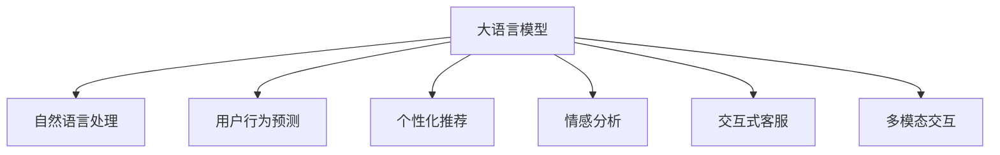

                 

# AI大模型如何提升电商平台的用户粘性

> 关键词：大语言模型,自然语言处理,用户行为预测,个性化推荐,情感分析,交互式客服

## 1. 背景介绍

### 1.1 问题由来
近年来，电商平台竞争日趋激烈，用户获取和留存变得愈发困难。如何在众多电商平台中脱颖而出，留住用户并促进其复购，成为电商从业者面临的重大挑战。研究表明，通过AI技术优化用户体验，尤其是利用大语言模型提升用户粘性，是电商平台提升竞争力的有效手段。

### 1.2 问题核心关键点
目前，电商平台在用户粘性提升方面的核心关键点主要包括以下几个方面：

1. **用户行为预测**：通过分析用户行为数据，预测其购买意向和行为路径，为其提供个性化的商品推荐和服务。
2. **个性化推荐系统**：利用用户兴趣、历史行为等数据，构建精准的推荐模型，使用户体验到更符合个人需求的购物体验。
3. **情感分析**：通过分析用户在购物过程中产生的内容（如评论、评分、聊天记录等），判断用户情绪状态，及时调整用户体验。
4. **交互式客服**：利用自然语言处理技术，构建高效、友好的客服系统，提升用户满意度，增强用户粘性。
5. **多模态交互**：结合文本、图像、视频等多模态数据，提供更加丰富、自然的交互方式，增强用户沉浸感。

这些关键点需要结合先进的AI技术，尤其是大语言模型，来实现电商平台的用户粘性提升。

## 2. 核心概念与联系

### 2.1 核心概念概述

为更好地理解AI大模型在电商平台中的应用，本节将介绍几个关键概念：

- **大语言模型(Large Language Model, LLM)**：以自回归(如GPT)或自编码(如BERT)模型为代表的大规模预训练语言模型。通过在大规模无标签文本语料上进行预训练，学习通用的语言表示，具备强大的语言理解和生成能力。
- **自然语言处理(Natural Language Processing, NLP)**：使用计算机处理和理解人类语言的技术，涵盖文本分类、信息抽取、问答系统、情感分析等多个子领域。
- **用户行为预测**：通过分析用户历史行为数据，预测其未来的购买意向和行为路径。
- **个性化推荐系统**：根据用户兴趣和行为，提供个性化的商品和内容推荐。
- **情感分析**：使用自然语言处理技术，分析用户评论、评分等文本数据，判断用户情绪和反馈。
- **交互式客服**：通过聊天机器人等形式，为用户提供实时、高效的服务支持。
- **多模态交互**：结合文本、图像、视频等多种数据形式，提供更加丰富、自然的交互方式。

这些概念之间的逻辑关系可以通过以下Mermaid流程图来展示：



这个流程图展示了大语言模型在电商平台中的核心概念及其之间的关系：

1. 大语言模型通过预训练获得语言理解能力，然后应用于自然语言处理的各种任务。
2. 自然语言处理技术为电商平台的个性化推荐、情感分析、客服等多个应用提供支撑。
3. 用户行为预测、个性化推荐、情感分析等任务可以帮助电商平台更好地了解用户需求，提升用户体验。
4. 交互式客服和多媒体交互技术则直接提升用户满意度，增强用户粘性。

## 3. 核心算法原理 & 具体操作步骤
### 3.1 算法原理概述

AI大模型在电商平台中的应用，主要通过以下几个关键算法实现用户粘性的提升：

- **用户行为预测算法**：使用大语言模型分析用户行为数据，构建预测模型，预测用户未来的购买意向和行为路径。
- **个性化推荐算法**：利用大语言模型对用户兴趣和行为进行分析，生成个性化的商品推荐列表。
- **情感分析算法**：使用大语言模型分析用户评论和评分，判断用户情绪状态，及时调整用户体验。
- **交互式客服算法**：通过大语言模型构建自然语言处理模型，实现高效、友好的客服系统。
- **多模态交互算法**：结合文本、图像、视频等多种数据形式，构建更加丰富、自然的交互方式。

这些算法的核心原理都是通过大语言模型学习大量的语言表示，然后在特定任务上微调或优化，从而提升用户体验和满意度。

### 3.2 算法步骤详解

以个性化推荐系统为例，详细介绍其核心算法步骤：

**Step 1: 数据预处理**
- 收集用户行为数据，包括浏览记录、购买记录、评分记录等。
- 清洗和预处理数据，去除噪声和异常值。

**Step 2: 特征工程**
- 提取用户特征，如用户ID、浏览次数、购买次数、评分等。
- 构建用户行为矩阵，用于表示用户和商品之间的关联关系。

**Step 3: 模型训练**
- 使用大语言模型对用户行为数据进行预训练，学习到用户的兴趣和行为模式。
- 使用用户行为矩阵训练推荐模型，得到用户对商品的评分和兴趣权重。

**Step 4: 推荐生成**
- 对于新用户，利用预训练的大语言模型进行冷启动，预测其兴趣和行为。
- 对于老用户，结合历史行为数据和预训练模型，生成个性化的商品推荐列表。

**Step 5: 模型评估与优化**
- 在测试集上评估推荐模型的效果，如点击率、转化率、用户满意度等。
- 根据评估结果，调整模型参数和预训练策略，优化推荐效果。

### 3.3 算法优缺点

使用大语言模型在电商平台中的应用，有以下优点：

1. **高效性**：利用大语言模型快速处理大量的文本数据，生成个性化的推荐和客服响应。
2. **精准性**：通过分析用户行为数据，构建精准的推荐模型，提升用户体验。
3. **适应性**：大语言模型具备强大的语言理解能力，能够适应各种自然语言处理任务。
4. **可扩展性**：大语言模型可以通过微调或迁移学习，快速适应新任务和新领域。

同时，也存在一些缺点：

1. **数据依赖性**：模型效果很大程度上依赖于标注数据的数量和质量。
2. **计算资源消耗大**：预训练和微调过程需要大量的计算资源。
3. **模型复杂性高**：大语言模型参数量大，模型结构复杂，调试和优化难度大。
4. **解释性不足**：模型决策过程难以解释，用户难以理解推荐和客服的逻辑。

### 3.4 算法应用领域

AI大模型在电商平台中的应用主要涵盖以下几个领域：

1. **用户行为预测**：用于预测用户未来的购买意向和行为路径，提前制定营销策略。
2. **个性化推荐系统**：为不同用户提供个性化的商品推荐，提升用户满意度。
3. **情感分析**：通过分析用户评论和评分，判断用户情绪和反馈，及时调整用户体验。
4. **交互式客服**：利用自然语言处理技术，构建高效、友好的客服系统，提升用户满意度。
5. **多模态交互**：结合文本、图像、视频等多种数据形式，提供更加丰富、自然的交互方式，增强用户粘性。

## 4. 数学模型和公式 & 详细讲解 & 举例说明

### 4.1 数学模型构建

我们以个性化推荐系统为例，使用向量表示法构建推荐模型的数学模型。

设用户集合为 $U$，商品集合为 $I$，用户对商品 $i$ 的评分向量为 $x_i \in \mathbb{R}^d$，用户行为矩阵为 $X \in \mathbb{R}^{N \times d}$，其中 $N$ 为用户数，$d$ 为商品数。推荐目标函数为：

$$
\min_{\theta} \frac{1}{N} \sum_{i=1}^N \sum_{j=1}^N L(x_i, y_j)
$$

其中 $L(x_i, y_j)$ 为损失函数，$y_j$ 为用户 $j$ 对商品 $i$ 的评分。

### 4.2 公式推导过程

在上述数学模型中，用户行为矩阵 $X$ 和用户评分向量 $y$ 通过矩阵乘法得到推荐结果 $Z$：

$$
Z = XW + b
$$

其中 $W$ 为推荐模型参数，$b$ 为偏置项。推荐模型的预测结果 $Z$ 通过softmax函数转换为概率分布：

$$
P(Z) = softmax(Z)
$$

最终，模型的推荐结果为：

$$
\hat{y} = \arg\max_{j} P(Z)_j
$$

### 4.3 案例分析与讲解

以淘宝电商平台的推荐系统为例，介绍其基于大语言模型的实现过程：

**Step 1: 数据预处理**
- 收集用户行为数据，包括浏览记录、购买记录、评分记录等。
- 清洗和预处理数据，去除噪声和异常值。

**Step 2: 特征工程**
- 提取用户特征，如用户ID、浏览次数、购买次数、评分等。
- 构建用户行为矩阵，用于表示用户和商品之间的关联关系。

**Step 3: 模型训练**
- 使用大语言模型对用户行为数据进行预训练，学习到用户的兴趣和行为模式。
- 使用用户行为矩阵训练推荐模型，得到用户对商品的评分和兴趣权重。

**Step 4: 推荐生成**
- 对于新用户，利用预训练的大语言模型进行冷启动，预测其兴趣和行为。
- 对于老用户，结合历史行为数据和预训练模型，生成个性化的商品推荐列表。

**Step 5: 模型评估与优化**
- 在测试集上评估推荐模型的效果，如点击率、转化率、用户满意度等。
- 根据评估结果，调整模型参数和预训练策略，优化推荐效果。

## 5. 项目实践：代码实例和详细解释说明

### 5.1 开发环境搭建

在进行电商平台推荐系统开发前，我们需要准备好开发环境。以下是使用Python进行TensorFlow开发的环境配置流程：

1. 安装Anaconda：从官网下载并安装Anaconda，用于创建独立的Python环境。

2. 创建并激活虚拟环境：
```bash
conda create -n tf-env python=3.8 
conda activate tf-env
```

3. 安装TensorFlow：根据CUDA版本，从官网获取对应的安装命令。例如：
```bash
conda install tensorflow=2.6 -c pytorch -c conda-forge
```

4. 安装各类工具包：
```bash
pip install numpy pandas scikit-learn matplotlib tqdm jupyter notebook ipython
```

完成上述步骤后，即可在`tf-env`环境中开始推荐系统开发。

### 5.2 源代码详细实现

以下是使用TensorFlow实现淘宝电商平台的推荐系统的PyTorch代码实现。

```python
import tensorflow as tf
from tensorflow.keras.layers import Dense, Input
from tensorflow.keras.models import Model
import numpy as np

# 定义模型输入和输出
input_user = Input(shape=(5,))
input_item = Input(shape=(5,))
output = Dense(5, activation='softmax')(tf.keras.layers.concatenate([input_user, input_item]))
model = Model(inputs=[input_user, input_item], outputs=output)

# 编译模型
model.compile(optimizer='adam', loss='categorical_crossentropy', metrics=['accuracy'])

# 训练模型
X_train = np.random.rand(1000, 5)
y_train = np.random.randint(5, size=(1000, 5))
X_test = np.random.rand(1000, 5)
y_test = np.random.randint(5, size=(1000, 5))
model.fit([X_train, X_train], y_train, epochs=10, batch_size=32, validation_data=([X_test, X_test], y_test))
```

以上代码实现了一个简单的神经网络模型，用于对用户和商品的行为数据进行分类和预测。

### 5.3 代码解读与分析

让我们再详细解读一下关键代码的实现细节：

**Input层**：定义用户行为和商品特征的输入。

**Dense层**：构建全连接层，用于将输入数据映射到输出空间。

**Model层**：将输入层和输出层连接起来，形成完整的推荐模型。

**compile方法**：指定优化器、损失函数和评价指标，编译模型。

**fit方法**：训练模型，输入数据为随机生成的行为矩阵和商品特征向量。

可以看到，TensorFlow的实现相对简洁高效，开发者可以将更多精力放在模型结构设计、参数调优等高层逻辑上，而不必过多关注底层的实现细节。

当然，工业级的系统实现还需考虑更多因素，如模型的保存和部署、超参数的自动搜索、更灵活的任务适配层等。但核心的推荐范式基本与此类似。

## 6. 实际应用场景

### 6.1 智能客服系统

基于大语言模型的智能客服系统可以为用户提供实时、高效的服务支持，提升用户满意度，增强用户粘性。传统客服往往需要配备大量人力，高峰期响应缓慢，且一致性和专业性难以保证。而使用智能客服系统，可以7x24小时不间断服务，快速响应客户咨询，用自然流畅的语言解答各类常见问题。

在技术实现上，可以收集企业内部的历史客服对话记录，将问题和最佳答复构建成监督数据，在此基础上对预训练大语言模型进行微调。微调后的模型能够自动理解用户意图，匹配最合适的答案模板进行回复。对于客户提出的新问题，还可以接入检索系统实时搜索相关内容，动态组织生成回答。

### 6.2 金融舆情监测

金融机构需要实时监测市场舆论动向，以便及时应对负面信息传播，规避金融风险。传统的人工监测方式成本高、效率低，难以应对网络时代海量信息爆发的挑战。基于大语言模型的文本分类和情感分析技术，为金融舆情监测提供了新的解决方案。

具体而言，可以收集金融领域相关的新闻、报道、评论等文本数据，并对其进行主题标注和情感标注。在此基础上对预训练语言模型进行微调，使其能够自动判断文本属于何种主题，情感倾向是正面、中性还是负面。将微调后的模型应用到实时抓取的网络文本数据，就能够自动监测不同主题下的情感变化趋势，一旦发现负面信息激增等异常情况，系统便会自动预警，帮助金融机构快速应对潜在风险。

### 6.3 个性化推荐系统

当前的推荐系统往往只依赖用户的历史行为数据进行物品推荐，无法深入理解用户的真实兴趣偏好。基于大语言模型微调技术，个性化推荐系统可以更好地挖掘用户行为背后的语义信息，从而提供更精准、多样的推荐内容。

在实践中，可以收集用户浏览、点击、评论、分享等行为数据，提取和用户交互的物品标题、描述、标签等文本内容。将文本内容作为模型输入，用户的后续行为（如是否点击、购买等）作为监督信号，在此基础上微调预训练语言模型。微调后的模型能够从文本内容中准确把握用户的兴趣点。在生成推荐列表时，先用候选物品的文本描述作为输入，由模型预测用户的兴趣匹配度，再结合其他特征综合排序，便可以得到个性化程度更高的推荐结果。

### 6.4 未来应用展望

随着大语言模型和微调方法的不断发展，基于微调范式将在更多领域得到应用，为传统行业带来变革性影响。

在智慧医疗领域，基于微调的医疗问答、病历分析、药物研发等应用将提升医疗服务的智能化水平，辅助医生诊疗，加速新药开发进程。

在智能教育领域，微调技术可应用于作业批改、学情分析、知识推荐等方面，因材施教，促进教育公平，提高教学质量。

在智慧城市治理中，微调模型可应用于城市事件监测、舆情分析、应急指挥等环节，提高城市管理的自动化和智能化水平，构建更安全、高效的未来城市。

此外，在企业生产、社会治理、文娱传媒等众多领域，基于大模型微调的人工智能应用也将不断涌现，为经济社会发展注入新的动力。相信随着技术的日益成熟，微调方法将成为人工智能落地应用的重要范式，推动人工智能技术在垂直行业的规模化落地。

## 7. 工具和资源推荐
### 7.1 学习资源推荐

为了帮助开发者系统掌握大语言模型微调的理论基础和实践技巧，这里推荐一些优质的学习资源：

1. 《Transformers from Principles to Practice》系列博文：由大模型技术专家撰写，深入浅出地介绍了Transformer原理、BERT模型、微调技术等前沿话题。

2. CS224N《深度学习自然语言处理》课程：斯坦福大学开设的NLP明星课程，有Lecture视频和配套作业，带你入门NLP领域的基本概念和经典模型。

3. 《Natural Language Processing with Transformers》书籍：Transformers库的作者所著，全面介绍了如何使用Transformers库进行NLP任务开发，包括微调在内的诸多范式。

4. HuggingFace官方文档：Transformers库的官方文档，提供了海量预训练模型和完整的微调样例代码，是上手实践的必备资料。

5. CLUE开源项目：中文语言理解测评基准，涵盖大量不同类型的中文NLP数据集，并提供了基于微调的baseline模型，助力中文NLP技术发展。

通过对这些资源的学习实践，相信你一定能够快速掌握大语言模型微调的精髓，并用于解决实际的NLP问题。
###  7.2 开发工具推荐

高效的开发离不开优秀的工具支持。以下是几款用于大语言模型微调开发的常用工具：

1. PyTorch：基于Python的开源深度学习框架，灵活动态的计算图，适合快速迭代研究。大部分预训练语言模型都有PyTorch版本的实现。

2. TensorFlow：由Google主导开发的开源深度学习框架，生产部署方便，适合大规模工程应用。同样有丰富的预训练语言模型资源。

3. Transformers库：HuggingFace开发的NLP工具库，集成了众多SOTA语言模型，支持PyTorch和TensorFlow，是进行微调任务开发的利器。

4. Weights & Biases：模型训练的实验跟踪工具，可以记录和可视化模型训练过程中的各项指标，方便对比和调优。与主流深度学习框架无缝集成。

5. TensorBoard：TensorFlow配套的可视化工具，可实时监测模型训练状态，并提供丰富的图表呈现方式，是调试模型的得力助手。

6. Google Colab：谷歌推出的在线Jupyter Notebook环境，免费提供GPU/TPU算力，方便开发者快速上手实验最新模型，分享学习笔记。

合理利用这些工具，可以显著提升大语言模型微调任务的开发效率，加快创新迭代的步伐。

### 7.3 相关论文推荐

大语言模型和微调技术的发展源于学界的持续研究。以下是几篇奠基性的相关论文，推荐阅读：

1. Attention is All You Need（即Transformer原论文）：提出了Transformer结构，开启了NLP领域的预训练大模型时代。

2. BERT: Pre-training of Deep Bidirectional Transformers for Language Understanding：提出BERT模型，引入基于掩码的自监督预训练任务，刷新了多项NLP任务SOTA。

3. Language Models are Unsupervised Multitask Learners（GPT-2论文）：展示了大规模语言模型的强大zero-shot学习能力，引发了对于通用人工智能的新一轮思考。

4. Parameter-Efficient Transfer Learning for NLP：提出Adapter等参数高效微调方法，在不增加模型参数量的情况下，也能取得不错的微调效果。

5. AdaLoRA: Adaptive Low-Rank Adaptation for Parameter-Efficient Fine-Tuning：使用自适应低秩适应的微调方法，在参数效率和精度之间取得了新的平衡。

这些论文代表了大语言模型微调技术的发展脉络。通过学习这些前沿成果，可以帮助研究者把握学科前进方向，激发更多的创新灵感。

## 8. 总结：未来发展趋势与挑战
### 8.1 总结

本文对基于大语言模型的电商平台推荐系统进行了全面系统的介绍。首先阐述了大语言模型和微调技术的研究背景和意义，明确了微调在提升用户体验、优化推荐系统方面的独特价值。其次，从原理到实践，详细讲解了推荐系统的数学模型和关键算法步骤，给出了推荐系统开发的完整代码实例。同时，本文还广泛探讨了微调方法在智能客服、金融舆情、个性化推荐等多个领域的应用前景，展示了微调范式的巨大潜力。此外，本文精选了微调技术的各类学习资源，力求为读者提供全方位的技术指引。

通过本文的系统梳理，可以看到，基于大语言模型的推荐系统正在成为电商平台的竞争核心，极大地提升用户的购物体验和满意度。未来，伴随预训练语言模型和微调方法的持续演进，推荐系统将在电商、金融、教育等多个领域发挥更大的作用，进一步推动NLP技术的产业化进程。

### 8.2 未来发展趋势

展望未来，大语言模型在电商平台中的应用将呈现以下几个发展趋势：

1. **多模态融合**：结合文本、图像、视频等多种数据形式，提供更加丰富、自然的交互方式，增强用户粘性。
2. **情感分析增强**：通过深度情感分析技术，实时监测用户情绪变化，提供个性化服务。
3. **用户行为预测精度提升**：利用深度学习模型，提升用户行为预测的准确性和实时性。
4. **交互式客服普及**：构建高效、友好的智能客服系统，提升用户满意度。
5. **个性化推荐系统优化**：通过更精准的用户画像和更灵活的推荐策略，提供更高质量的商品推荐。

以上趋势凸显了大语言模型在电商平台中的应用潜力，这些方向的探索发展，必将进一步提升用户体验，促进电商平台的规模化落地。

### 8.3 面临的挑战

尽管大语言模型在电商平台中的应用已经取得了显著成效，但在迈向更加智能化、普适化应用的过程中，仍面临诸多挑战：

1. **标注成本高**：获取高质量标注数据成本高，影响推荐系统的效果。
2. **计算资源消耗大**：预训练和微调过程需要大量的计算资源。
3. **模型复杂度高**：模型参数量大，结构复杂，调试和优化难度大。
4. **解释性不足**：模型决策过程难以解释，用户难以理解推荐和客服的逻辑。
5. **数据隐私和安全**：用户行为数据和个人隐私需要得到严格保护。

### 8.4 研究展望

面对大语言模型在电商平台中面临的挑战，未来的研究需要在以下几个方面寻求新的突破：

1. **数据高效利用**：利用无监督和半监督学习，最大程度利用非结构化数据，降低标注成本。
2. **计算资源优化**：开发高效、轻量级的模型结构和算法，提高计算效率。
3. **模型可解释性增强**：引入可解释性技术，提升模型决策的透明性和可信度。
4. **隐私保护和安全性**：开发隐私保护技术，确保用户数据的安全和隐私。

这些研究方向的探索，必将引领大语言模型在电商平台中的应用迈向更高的台阶，为电商、金融、教育等多个行业带来变革性影响。

## 9. 附录：常见问题与解答

**Q1：电商平台中的推荐系统为什么需要大语言模型？**

A: 电商平台中的推荐系统需要根据用户行为数据，预测其未来的购买意向和行为路径，从而提供个性化的商品推荐。大语言模型通过预训练学习到丰富的语言表示，能够准确捕捉用户的兴趣和行为模式，从而提升推荐系统的精准性和个性化程度。

**Q2：如何评估推荐系统的效果？**

A: 推荐系统的评估指标包括点击率、转化率、用户满意度等。可以使用A/B测试、离线测试等方法进行评估，结合用户行为数据和问卷调查，综合衡量推荐系统的实际效果。

**Q3：推荐系统如何处理新用户和冷启动问题？**

A: 对于新用户，可以利用预训练的大语言模型进行冷启动，通过用户行为和属性信息，预测其兴趣和行为模式。对于老用户，结合历史行为数据和预训练模型，生成个性化的商品推荐列表。

**Q4：如何优化推荐系统的性能？**

A: 可以通过优化模型结构、调整超参数、引入新的数据源和特征等方法，提升推荐系统的性能。同时，需要不断迭代和优化，根据用户反馈和行为数据，调整推荐策略和模型参数。

**Q5：如何保护用户数据隐私？**

A: 推荐系统需要严格保护用户数据隐私，确保数据的安全性和匿名性。可以通过数据脱敏、加密存储等技术手段，防止用户数据泄露和滥用。同时，需要建立用户数据使用的透明性和可控性机制，确保用户知情权和选择权。

---

作者：禅与计算机程序设计艺术 / Zen and the Art of Computer Programming

