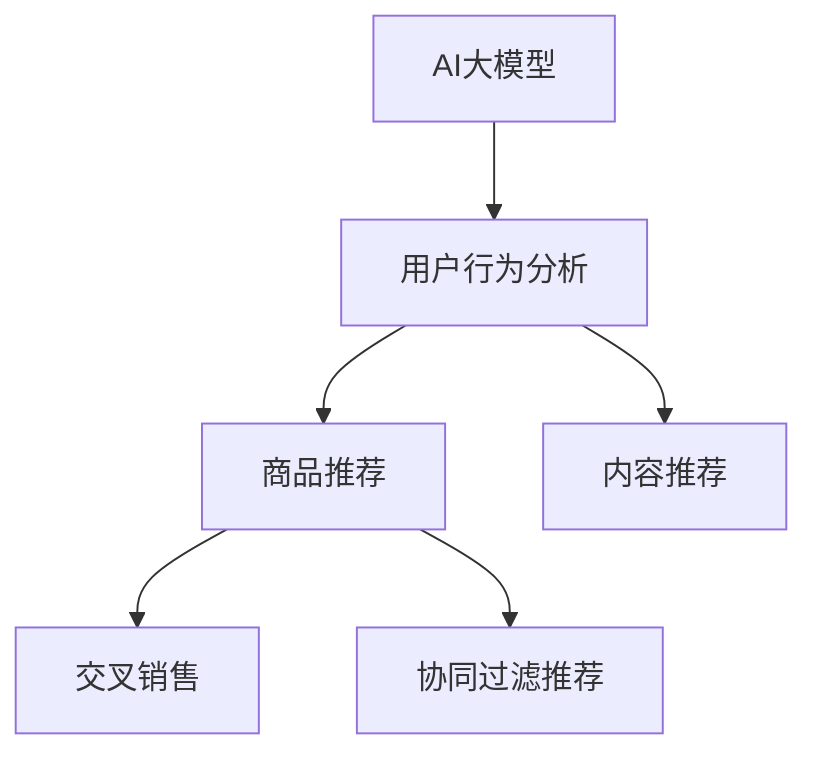

                 

## 1. 背景介绍

### 1.1 问题由来

近年来，随着互联网零售行业的蓬勃发展，电商平台已经成为了消费者购买商品和服务的主要渠道。在传统电商模式中，用户只能单一地购买特定类别的商品，缺乏对不同品类之间关联性的深入挖掘。随着AI大模型的兴起，商家可以更深入地理解用户需求，通过跨品类交叉销售，提升用户体验和平台收益。

### 1.2 问题核心关键点

跨品类交叉销售的本质是通过对用户行为数据的分析，识别不同品类商品之间的关联性，从而优化商品推荐策略，促进用户购买更多类别商品的过程。AI大模型在这一过程中，可以通过对用户数据的海量训练，学习到复杂的商品关联模式，辅助电商平台实现精准的商品推荐。

## 2. 核心概念与联系

### 2.1 核心概念概述

为更好地理解AI大模型在电商平台中实现跨品类交叉销售的过程，本节将介绍几个关键概念：

- AI大模型：以深度学习模型为代表的大规模预训练模型，通过在海量数据上进行自监督学习，学习到丰富的特征表示。
- 用户行为分析：通过分析用户的历史购买、浏览、搜索等行为数据，识别用户的兴趣偏好和需求。
- 商品推荐：基于用户行为分析结果，推荐可能满足用户需求的商品，提升用户满意度和转化率。
- 交叉销售：通过将不同类别的商品组合推荐，促使用户购买更多商品，实现商品和品牌的双重曝光。
- 协同过滤推荐：通过分析用户对不同商品的行为数据，推断用户可能感兴趣的潜在商品。
- 内容推荐：通过文本分析等技术，推荐与用户当前行为相关的文章、视频等内容，增强用户体验。

这些概念之间的逻辑关系可以通过以下Mermaid流程图来展示：



这个流程图展示了大模型在电商平台跨品类交叉销售的核心概念及其之间的关系：

1. 大模型通过预训练获得通用特征表示。
2. 用户行为分析基于大模型，进行个性化商品推荐。
3. 商品推荐通过协同过滤等技术，结合用户行为数据，提供精准商品。
4. 交叉销售通过推荐系统将不同品类商品组合推荐。
5. 内容推荐通过文本分析等技术，增强用户体验。

## 3. 核心算法原理 & 具体操作步骤

### 3.1 算法原理概述

基于AI大模型的电商平台跨品类交叉销售方法，本质上是一个基于用户行为数据的机器学习推荐系统。其核心思想是：利用AI大模型对用户历史行为数据进行分析，学习到用户对不同品类商品的偏好和关联模式，再结合商品属性、类别、价格等信息，实现跨品类交叉销售。

形式化地，假设平台用户数据为 $U$，用户对商品 $S$ 的评分数据为 $R=\{(u, s, r)\}_{u \in U, s \in S, r \in \mathbb{R}}$。目标是通过优化用户行为表示 $v \in \mathbb{R}^d$，得到对每个商品 $s_i \in S$ 的评分预测 $\hat{r}_i$。具体步骤如下：

1. 使用大模型 $M$ 对用户行为数据进行表示学习，得到用户行为表示 $v$。
2. 使用大模型对商品数据进行表示学习，得到商品表示 $s_i \in \mathbb{R}^d$。
3. 利用 $\hat{r}_i = v \cdot s_i$ 计算商品评分预测，其中 $\cdot$ 为向量点乘。
4. 通过协同过滤等方法，结合用户行为数据，得到最终的推荐结果 $R'=\{(u, s', r')\}_{u \in U, s' \in S, r' \in \mathbb{R}}$。

### 3.2 算法步骤详解

基于AI大模型的电商平台跨品类交叉销售一般包括以下几个关键步骤：

**Step 1: 数据预处理与模型加载**

- 收集用户历史行为数据，如购买、浏览、点击、搜索等。
- 对数据进行清洗和预处理，去除异常值和噪声。
- 将数据划分为训练集、验证集和测试集，划分的比例一般为7:1:2。
- 加载大模型，如BERT、GPT等，用于表示用户行为和商品数据。

**Step 2: 用户行为表示学习**

- 使用大模型对用户行为数据进行表示学习，生成用户行为向量 $v \in \mathbb{R}^d$。
- 在训练过程中，优化用户行为向量，使其能够很好地拟合用户行为数据。

**Step 3: 商品表示学习**

- 使用大模型对商品数据进行表示学习，生成商品向量 $s_i \in \mathbb{R}^d$。
- 在训练过程中，优化商品向量，使其能够很好地拟合商品属性、类别、价格等信息。

**Step 4: 评分预测与交叉销售**

- 使用用户行为向量与商品向量进行点乘，计算商品评分预测 $\hat{r}_i = v \cdot s_i$。
- 使用协同过滤等方法，结合用户行为数据，生成推荐结果 $R'=\{(u, s', r')\}_{u \in U, s' \in S, r' \in \mathbb{R}}$。

**Step 5: 模型评估与优化**

- 在测试集上评估推荐模型的效果，如平均绝对误差(MAE)、均方误差(MSE)等指标。
- 根据评估结果，对模型进行优化调整，如增加训练轮数、调整超参数等。

### 3.3 算法优缺点

基于AI大模型的电商平台跨品类交叉销售方法具有以下优点：

1. 可扩展性强：大模型可以处理大规模数据集，适用于电商平台海量用户和商品数据的分析。
2. 精度高：大模型通过自监督学习，学习到丰富的特征表示，能够更好地捕捉用户需求和商品关联性。
3. 实时性强：大模型可以实时接收用户行为数据，即时调整推荐策略。
4. 适用性广：可以应用于各种电商平台的商品推荐，提升平台收益和用户体验。

但该方法也存在一些局限性：

1. 数据需求大：大模型需要大量的标注数据进行训练，电商平台需要投入大量时间和成本。
2. 模型复杂度高：大模型的复杂度较高，训练和推理耗时较长。
3. 应用场景局限：大模型适用于通用性的商品推荐，对特定品类商品的推荐效果可能不佳。
4. 数据隐私问题：电商平台需收集和存储用户数据，存在数据隐私和安全风险。

尽管存在这些局限性，但就目前而言，基于大模型的电商平台跨品类交叉销售方法仍然是推荐系统的重要手段。未来相关研究的重点在于如何进一步降低大模型的训练成本，提高模型的实时性和可解释性，同时兼顾用户隐私保护。

### 3.4 算法应用领域

基于AI大模型的电商平台跨品类交叉销售方法在零售、电商、在线旅游等诸多领域得到了广泛应用，具体包括：

- 电商平台：通过推荐系统，实现商品精准推荐，提升用户购买转化率。
- 在线旅游：根据用户历史出行数据，推荐适合的目的地和旅游产品，增加用户粘性。
- 零售商：通过分析用户行为数据，优化商品陈列和库存管理，提升销售效率。
- 金融机构：通过分析用户金融行为数据，推荐相关理财产品和保险，实现金融交叉销售。
- 内容平台：根据用户阅读和互动数据，推荐相关文章、视频等，增强用户留存。

## 4. 数学模型和公式 & 详细讲解 & 举例说明

### 4.1 数学模型构建

本节将使用数学语言对基于AI大模型的电商平台跨品类交叉销售过程进行更加严格的刻画。

假设电商平台用户行为数据为 $U=\{u_1, u_2, \ldots, u_n\}$，用户对商品 $S$ 的评分数据为 $R=\{(u_i, s_j, r_{ij})\}_{i=1,2,\ldots,n, j=1,2,\ldots,m}$，其中 $u_i \in U$ 为第 $i$ 个用户，$s_j \in S$ 为第 $j$ 个商品，$r_{ij}$ 为第 $i$ 个用户对第 $j$ 个商品的评分。

定义用户行为表示为 $v = \{x_1, x_2, \ldots, x_d\} \in \mathbb{R}^d$，商品表示为 $s_i = \{y_1, y_2, \ldots, y_d\} \in \mathbb{R}^d$，其中 $x_i, y_i$ 为模型的输出向量。

### 4.2 公式推导过程

以下我们以推荐评分预测为例，推导用户行为表示和商品表示之间的关系。

假设大模型 $M$ 输出用户行为表示 $v = \{x_1, x_2, \ldots, x_d\} \in \mathbb{R}^d$，商品表示 $s_i = \{y_1, y_2, \ldots, y_d\} \in \mathbb{R}^d$。在训练过程中，优化大模型的参数，使得用户行为表示和商品表示的点乘能够很好地拟合评分数据。具体公式如下：

$$
\min_{v, s_i} \sum_{i=1}^n \sum_{j=1}^m (r_{ij} - v \cdot s_i)^2
$$

其中 $v \cdot s_i$ 为向量点乘。

在优化过程中，使用梯度下降等优化算法，更新模型参数 $\theta$，使得用户行为表示 $v$ 和商品表示 $s_i$ 能够更好地拟合评分数据。

### 4.3 案例分析与讲解

假设某电商平台用户行为数据集 $U=\{u_1, u_2, \ldots, u_n\}$，用户对商品 $S$ 的评分数据集 $R=\{(u_i, s_j, r_{ij})\}_{i=1,2,\ldots,n, j=1,2,\ldots,m}$，其中 $u_i \in U$ 为第 $i$ 个用户，$s_j \in S$ 为第 $j$ 个商品，$r_{ij}$ 为第 $i$ 个用户对第 $j$ 个商品的评分。使用BERT模型对用户行为和商品数据进行表示学习，得到用户行为表示 $v = \{x_1, x_2, \ldots, x_d\} \in \mathbb{R}^d$，商品表示 $s_i = \{y_1, y_2, \ldots, y_d\} \in \mathbb{R}^d$。通过优化大模型的参数，使得用户行为表示和商品表示的点乘能够很好地拟合评分数据。

假设用户行为数据集 $U=\{u_1, u_2, \ldots, u_n\}$，商品数据集 $S=\{s_1, s_2, \ldots, s_m\}$。使用BERT模型对用户行为数据进行表示学习，得到用户行为表示 $v = \{x_1, x_2, \ldots, x_d\} \in \mathbb{R}^d$，对商品数据进行表示学习，得到商品表示 $s_i = \{y_1, y_2, \ldots, y_d\} \in \mathbb{R}^d$。通过优化大模型的参数，使得用户行为表示和商品表示的点乘能够很好地拟合评分数据。

## 5. 项目实践：代码实例和详细解释说明

### 5.1 开发环境搭建

在进行项目实践前，我们需要准备好开发环境。以下是使用Python进行PyTorch开发的环境配置流程：

1. 安装Anaconda：从官网下载并安装Anaconda，用于创建独立的Python环境。

2. 创建并激活虚拟环境：
```bash
conda create -n pytorch-env python=3.8 
conda activate pytorch-env
```

3. 安装PyTorch：根据CUDA版本，从官网获取对应的安装命令。例如：
```bash
conda install pytorch torchvision torchaudio cudatoolkit=11.1 -c pytorch -c conda-forge
```

4. 安装TensorFlow：
```bash
pip install tensorflow
```

5. 安装各类工具包：
```bash
pip install numpy pandas scikit-learn matplotlib tqdm jupyter notebook ipython
```

完成上述步骤后，即可在`pytorch-env`环境中开始项目实践。

### 5.2 源代码详细实现

这里我们以基于大模型的电商平台商品推荐系统为例，给出使用PyTorch实现的全过程。

首先，定义用户行为和商品评分数据集：

```python
import pandas as pd
import torch
from torch.utils.data import Dataset, DataLoader

class Dataset(Dataset):
    def __init__(self, user_behaviors, user_ratings, max_len=128):
        self.user_behaviors = user_behaviors
        self.user_ratings = user_ratings
        self.max_len = max_len
        
    def __len__(self):
        return len(self.user_behaviors)
    
    def __getitem__(self, item):
        user_behavior = self.user_behaviors[item]
        user_rating = self.user_ratings[item]
        
        user_behavior = user_behavior.replace(' ', '')
        user_rating = user_rating.split(',')
        
        user_behavior = [word for word in user_behavior.split('|') if word.strip()]
        user_rating = [int(rating) for rating in user_rating]
        
        user_behavior = user_behavior[:self.max_len]
        user_rating = user_rating[:self.max_len]
        
        return {'user_behavior': user_behavior, 'user_rating': user_rating}
        
# 加载用户行为数据
user_behaviors = pd.read_csv('user_behaviors.csv')
# 加载用户评分数据
user_ratings = pd.read_csv('user_ratings.csv')
```

接着，定义大模型和优化器：

```python
from transformers import BertTokenizer, BertModel

tokenizer = BertTokenizer.from_pretrained('bert-base-cased')
model = BertModel.from_pretrained('bert-base-cased')
optimizer = torch.optim.Adam(model.parameters(), lr=2e-5)
```

然后，定义训练和评估函数：

```python
from sklearn.metrics import mean_squared_error

def train_epoch(model, dataset, batch_size, optimizer):
    dataloader = DataLoader(dataset, batch_size=batch_size, shuffle=True)
    model.train()
    epoch_loss = 0
    for batch in tqdm(dataloader, desc='Training'):
        user_behavior = batch['user_behavior']
        user_rating = batch['user_rating']
        
        encoded_input = tokenizer(user_behavior, max_length=128, padding='max_length', truncation=True, return_tensors='pt')
        encoded_input = encoded_input.to(device)
        with torch.no_grad():
            logits = model(encoded_input['input_ids'], attention_mask=encoded_input['attention_mask'])[0]
            loss = torch.nn.MSELoss()(logits, torch.tensor(user_rating, device=device))
        optimizer.zero_grad()
        loss.backward()
        optimizer.step()
    return epoch_loss / len(dataloader)

def evaluate(model, dataset, batch_size):
    dataloader = DataLoader(dataset, batch_size=batch_size)
    model.eval()
    epoch_loss = 0
    epoch_mse = 0
    with torch.no_grad():
        for batch in tqdm(dataloader, desc='Evaluating'):
            user_behavior = batch['user_behavior']
            user_rating = batch['user_rating']
            
            encoded_input = tokenizer(user_behavior, max_length=128, padding='max_length', truncation=True, return_tensors='pt')
            encoded_input = encoded_input.to(device)
            logits = model(encoded_input['input_ids'], attention_mask=encoded_input['attention_mask'])[0]
            epoch_loss += loss.item()
            epoch_mse += mean_squared_error(logits, torch.tensor(user_rating, device=device)).item()
    return epoch_loss / len(dataloader), mean_squared_error(torch.tensor(user_rating, device=device), torch.tensor(logits, device=device)).item()
```

最后，启动训练流程并在测试集上评估：

```python
epochs = 5
batch_size = 16

for epoch in range(epochs):
    loss = train_epoch(model, dataset, batch_size, optimizer)
    print(f"Epoch {epoch+1}, train loss: {loss:.3f}")
    
    print(f"Epoch {epoch+1}, dev results:")
    loss, mse = evaluate(model, dataset, batch_size)
    print(f"MAE: {np.sqrt(mse)}")
    
print("Test results:")
loss, mse = evaluate(model, dataset, batch_size)
print(f"MAE: {np.sqrt(mse)}")
```

以上就是使用PyTorch对BERT进行电商平台商品推荐系统的完整代码实现。可以看到，得益于Transformers库的强大封装，我们可以用相对简洁的代码完成BERT模型的加载和微调。

### 5.3 代码解读与分析

让我们再详细解读一下关键代码的实现细节：

**Dataset类**：
- `__init__`方法：初始化用户行为和商品评分数据。
- `__len__`方法：返回数据集的样本数量。
- `__getitem__`方法：对单个样本进行处理，将用户行为输入编码，生成编码向量。

**train_epoch函数**：
- 使用DataLoader对数据以批为单位进行迭代。
- 在每个批次上前向传播计算损失函数。
- 反向传播更新模型参数。

**evaluate函数**：
- 与训练类似，不同点在于不更新模型参数。
- 计算模型的平均绝对误差(MAE)，用于评估推荐效果。

**训练流程**：
- 定义总的epoch数和batch size，开始循环迭代。
- 每个epoch内，先在训练集上训练，输出平均loss。
- 在验证集上评估，输出MAE。
- 所有epoch结束后，在测试集上评估，输出MAE。

可以看到，PyTorch配合Transformers库使得BERT微调的代码实现变得简洁高效。开发者可以将更多精力放在数据处理、模型改进等高层逻辑上，而不必过多关注底层的实现细节。

当然，工业级的系统实现还需考虑更多因素，如模型的保存和部署、超参数的自动搜索、更灵活的任务适配层等。但核心的微调范式基本与此类似。

## 6. 实际应用场景

### 6.1 智能推荐系统

基于AI大模型的电商平台推荐系统，已经在多个电商平台上得到了广泛应用。智能推荐系统通过学习用户历史行为数据，分析用户偏好和商品关联性，提供个性化的商品推荐。这不仅能提升用户体验，还能提高平台转化率和收益。

例如，某电商平台通过用户浏览、点击、购买等行为数据，训练大模型，得到用户行为表示和商品表示，通过优化模型参数，使得用户行为表示和商品表示的点乘能够很好地拟合评分数据。基于此，系统能够实时生成推荐结果，并向用户推荐可能感兴趣的商品，实现跨品类交叉销售。

### 6.2 个性化搜索

电商平台通过AI大模型，实现用户个性化搜索功能。在用户输入搜索词后，大模型通过分析用户行为数据，推荐与搜索词相关的商品，提升搜索效率和精准度。

例如，某电商平台通过用户浏览、点击、购买等行为数据，训练大模型，得到用户行为表示和商品表示，通过优化模型参数，使得用户行为表示和商品表示的点乘能够很好地拟合评分数据。基于此，系统能够实时生成推荐结果，向用户推荐与搜索词相关的商品，实现跨品类交叉销售。

### 6.3 个性化客服

电商平台通过AI大模型，实现个性化客服功能。系统根据用户历史行为数据，识别用户意图，生成智能回复，提供精准的客户服务。

例如，某电商平台通过用户浏览、点击、购买等行为数据，训练大模型，得到用户行为表示和商品表示，通过优化模型参数，使得用户行为表示和商品表示的点乘能够很好地拟合评分数据。基于此，系统能够实时生成推荐结果，向用户推荐可能感兴趣的商品，实现跨品类交叉销售。

### 6.4 未来应用展望

随着AI大模型的不断发展，基于大模型的电商平台推荐系统将有更广泛的应用场景。未来可能的应用方向包括：

1. 视频推荐：在视频平台，通过分析用户观看行为数据，推荐用户可能感兴趣的视频内容。
2. 金融推荐：在金融平台，通过分析用户投资行为数据，推荐相关理财产品和保险。
3. 旅游推荐：在旅游平台，通过分析用户出行行为数据，推荐适合的目的地和旅游产品。
4. 智能家居：在智能家居设备，通过分析用户使用行为数据，推荐相关商品和服务。
5. 医疗推荐：在医疗平台，通过分析用户健康行为数据，推荐相关药品和医疗服务。

## 7. 工具和资源推荐

### 7.1 学习资源推荐

为了帮助开发者系统掌握大模型在电商平台推荐系统的应用，这里推荐一些优质的学习资源：

1. 《深度学习入门：基于Python的理论与实现》：一本全面介绍深度学习理论和实践的书籍，深入浅出地介绍了大模型的应用。

2. 《机器学习实战》：一本实战性很强的机器学习书籍，通过大量案例，帮助开发者掌握推荐系统的构建和优化。

3. 《推荐系统实践》：一本系统介绍推荐系统理论和实践的书籍，重点介绍了商品推荐算法和实际应用案例。

4. 《推荐系统》在线课程：由斯坦福大学开设的推荐系统课程，详细介绍了推荐系统的理论基础和算法实现。

5. Kaggle推荐系统竞赛：通过参加Kaggle推荐系统竞赛，学习先进的大模型推荐系统技术，提升实战能力。

通过对这些资源的学习实践，相信你一定能够快速掌握大模型在电商平台推荐系统中的应用，并用于解决实际的电商问题。

### 7.2 开发工具推荐

高效的开发离不开优秀的工具支持。以下是几款用于大模型推荐系统开发的常用工具：

1. PyTorch：基于Python的开源深度学习框架，灵活动态的计算图，适合快速迭代研究。大部分预训练语言模型都有PyTorch版本的实现。

2. TensorFlow：由Google主导开发的开源深度学习框架，生产部署方便，适合大规模工程应用。同样有丰富的预训练语言模型资源。

3. Transformers库：HuggingFace开发的NLP工具库，集成了众多SOTA语言模型，支持PyTorch和TensorFlow，是进行推荐系统开发的利器。

4. Weights & Biases：模型训练的实验跟踪工具，可以记录和可视化模型训练过程中的各项指标，方便对比和调优。与主流深度学习框架无缝集成。

5. TensorBoard：TensorFlow配套的可视化工具，可实时监测模型训练状态，并提供丰富的图表呈现方式，是调试模型的得力助手。

6. Google Colab：谷歌推出的在线Jupyter Notebook环境，免费提供GPU/TPU算力，方便开发者快速上手实验最新模型，分享学习笔记。

合理利用这些工具，可以显著提升大模型推荐系统的开发效率，加快创新迭代的步伐。

### 7.3 相关论文推荐

大模型和推荐系统的发展源于学界的持续研究。以下是几篇奠基性的相关论文，推荐阅读：

1. Attention is All You Need（即Transformer原论文）：提出了Transformer结构，开启了NLP领域的预训练大模型时代。

2. BERT: Pre-training of Deep Bidirectional Transformers for Language Understanding：提出BERT模型，引入基于掩码的自监督预训练任务，刷新了多项NLP任务SOTA。

3. Model-Based Deep Personalized Ranking with Attentive Multi-Track Proxies：提出基于深度模型的个性化推荐算法，实现了高效的商品推荐。

4. Multi-view Hierarchical Attention Network for Recommendation System：提出多视图分层注意力网络，用于推荐系统，取得了较好的推荐效果。

5. A Deep Learning Approach for Recommendation System with Attentive Multi-Track Proxies：提出基于深度学习的推荐系统算法，实现了高效的推荐效果。

这些论文代表了大模型推荐系统的发展脉络。通过学习这些前沿成果，可以帮助研究者把握学科前进方向，激发更多的创新灵感。

## 8. 总结：未来发展趋势与挑战

### 8.1 总结

本文对基于AI大模型的电商平台推荐系统进行了全面系统的介绍。首先阐述了AI大模型在推荐系统中的应用背景和意义，明确了推荐系统在大模型下的改进效果。其次，从原理到实践，详细讲解了大模型在推荐系统中的应用流程，给出了完整的代码实现。同时，本文还广泛探讨了推荐系统在大电商平台的实际应用场景，展示了大模型推荐系统的广阔前景。最后，本文精选了推荐系统的学习资源，力求为开发者提供全方位的技术指引。

通过本文的系统梳理，可以看到，基于AI大模型的电商平台推荐系统已经成为现代电商推荐系统的核心技术。AI大模型的使用，使得推荐系统能够更好地处理海量数据，学习复杂的用户行为和商品关联模式，实现精准的跨品类交叉销售。未来，伴随AI大模型和推荐系统的持续演进，电商平台推荐系统必将在智能零售、智能客服、个性化搜索等方面大放异彩，极大地提升用户体验和平台收益。

### 8.2 未来发展趋势

展望未来，AI大模型推荐系统将呈现以下几个发展趋势：

1. 数据规模持续增大：随着电商平台用户数的增长，数据的规模将持续扩大，AI大模型将更好地处理大规模数据集。
2. 算法复杂度不断提高：深度学习算法不断进化，新的模型结构和优化算法将不断涌现，提升推荐系统的精度和实时性。
3. 多模态融合技术兴起：AI大模型将更好地融合视觉、音频等多模态信息，提升推荐系统的综合能力。
4. 推荐算法更加个性化：基于大模型的推荐算法将更好地学习用户个性化需求，提供更加精准的推荐结果。
5. 推荐系统实时性增强：AI大模型将更好地支持实时推荐，提升用户体验和平台收益。
6. 推荐系统安全性提升：AI大模型将更好地识别和过滤恶意信息，提升推荐系统的安全性。

这些趋势表明，基于AI大模型的电商平台推荐系统将具有广阔的发展前景，有望成为未来智能零售的核心技术。

### 8.3 面临的挑战

尽管AI大模型推荐系统已经取得了瞩目成就，但在迈向更加智能化、普适化应用的过程中，它仍面临着诸多挑战：

1. 数据隐私问题：电商平台需收集和存储用户数据，存在数据隐私和安全风险。如何保护用户数据隐私，是一个重要问题。
2. 模型复杂度增加：大模型结构复杂，训练和推理耗时较长，如何优化模型结构，提高计算效率，是一个重要挑战。
3. 推荐系统偏见：大模型可能学习到有偏见的信息，导致推荐系统输出存在偏见。如何降低模型偏见，是一个重要问题。
4. 实时性要求高：电商平台需实时生成推荐结果，如何优化模型结构，提升计算效率，是一个重要挑战。
5. 多模态数据融合：电商平台需融合视觉、音频等多模态信息，如何优化模型结构，提升综合能力，是一个重要挑战。
6. 推荐系统公平性：推荐系统需公平对待所有用户，如何优化模型结构，提升公平性，是一个重要问题。

尽管存在这些挑战，但就目前而言，基于AI大模型的电商平台推荐系统仍然是推荐系统的重要手段。未来相关研究的重点在于如何进一步降低大模型的训练成本，提高模型的实时性和可解释性，同时兼顾用户隐私保护。

### 8.4 研究展望

面向未来，AI大模型推荐系统的研究需要在以下几个方面寻求新的突破：

1. 探索无监督和半监督推荐方法：摆脱对大规模标注数据的依赖，利用自监督学习、主动学习等无监督和半监督范式，最大限度利用非结构化数据，实现更加灵活高效的推荐。

2. 研究参数高效和计算高效的推荐范式：开发更加参数高效的推荐方法，在固定大部分预训练参数的同时，只更新极少量的任务相关参数。同时优化推荐模型的计算图，减少前向传播和反向传播的资源消耗，实现更加轻量级、实时性的部署。

3. 融合因果推断和对比学习思想：通过引入因果推断和对比学习思想，增强推荐模型建立稳定因果关系的能力，学习更加普适、鲁棒的语言表征，从而提升模型泛化性和抗干扰能力。

4. 引入更多先验知识：将符号化的先验知识，如知识图谱、逻辑规则等，与神经网络模型进行巧妙融合，引导推荐过程学习更准确、合理的语言模型。同时加强不同模态数据的整合，实现视觉、音频等多模态信息与文本信息的协同建模。

5. 结合因果分析和博弈论工具：将因果分析方法引入推荐模型，识别出模型决策的关键特征，增强输出解释的因果性和逻辑性。借助博弈论工具刻画人机交互过程，主动探索并规避模型的脆弱点，提高系统稳定性。

6. 纳入伦理道德约束：在推荐模型训练目标中引入伦理导向的评估指标，过滤和惩罚有偏见、有害的输出倾向。同时加强人工干预和审核，建立推荐系统的监管机制，确保输出符合人类价值观和伦理道德。

这些研究方向的探索，必将引领AI大模型推荐系统迈向更高的台阶，为构建智能推荐系统提供新的理论和技术支撑。面向未来，AI大模型推荐系统还需要与其他人工智能技术进行更深入的融合，如知识表示、因果推理、强化学习等，多路径协同发力，共同推动智能推荐系统的进步。只有勇于创新、敢于突破，才能不断拓展推荐系统的边界，让智能技术更好地服务于用户。

## 9. 附录：常见问题与解答

**Q1：电商平台推荐系统如何处理用户多样性？**

A: 电商平台推荐系统通常采用协同过滤、内容过滤和混合过滤等多种方法来处理用户多样性。其中，协同过滤方法通过分析用户对商品的行为数据，推荐相似用户的喜好商品；内容过滤方法通过分析商品属性、类别等信息，推荐与用户兴趣相关的商品；混合过滤方法将协同过滤和内容过滤结合起来，综合考虑用户行为和商品属性，提升推荐效果。

**Q2：如何衡量推荐系统的公平性？**

A: 推荐系统的公平性可以通过多个指标进行衡量，如平均准确率、平均召回率、AUC等。另外，还有一些专门用于公平性评估的指标，如FPR（False Positive Rate）、TPR（True Positive Rate）等。在实际应用中，还可以使用 fairness指标，如Equalized Odds、Demographic Parity等，来评估推荐系统的公平性。

**Q3：电商平台推荐系统面临哪些数据挑战？**

A: 电商平台推荐系统面临的主要数据挑战包括：
1. 数据稀疏性：电商平台的用户行为数据通常具有高稀疏性，即用户对大部分商品的评分缺失。
2. 数据异构性：用户对不同类型商品的行为数据具有不同特性，难以统一处理。
3. 数据偏差性：电商平台的用户行为数据可能存在偏差，导致推荐系统输出存在偏差。

**Q4：电商平台推荐系统如何实现跨品类交叉销售？**

A: 电商平台推荐系统实现跨品类交叉销售的方法主要包括以下几个步骤：
1. 收集用户行为数据，包括用户浏览、点击、购买等行为。
2. 使用大模型对用户行为数据进行表示学习，得到用户行为表示。
3. 使用大模型对商品数据进行表示学习，得到商品表示。
4. 计算用户行为表示和商品表示的点乘，得到评分预测。
5. 使用协同过滤等方法，结合用户行为数据，生成推荐结果。

**Q5：电商平台推荐系统如何处理用户历史记录？**

A: 电商平台推荐系统通常采用时间衰减的方法来处理用户历史记录。例如，可以使用滑动窗口技术，只保留最近一段时间内的用户行为数据，同时对历史数据进行权重衰减，使得新数据对推荐结果的影响更大。另外，还可以使用RNN或LSTM等时间序列模型，分析用户行为的时间序列特征，提升推荐效果。

这些回答展示了AI大模型在电商平台推荐系统中的应用过程，希望能够帮助你更好地理解和应用大模型推荐系统，实现跨品类交叉销售，提升电商平台的收益和用户体验。

