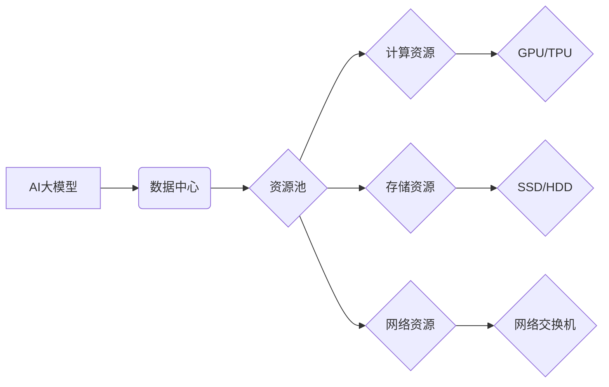

> AI大模型、数据中心、资源优化、模型训练、推理加速、云计算、GPU、TPU

## 1. 背景介绍

近年来，人工智能（AI）技术取得了飞速发展，尤其是大规模语言模型（LLM）的出现，如GPT-3、LaMDA等，在自然语言处理、文本生成、机器翻译等领域展现出强大的能力。然而，训练和部署这些庞大的模型需要大量的计算资源和存储空间，给数据中心带来了巨大的挑战。

传统的云计算架构难以满足大模型训练和推理的需求，其资源分配机制不够灵活，难以应对大模型的突发性计算需求。同时，大模型的训练和推理过程通常需要大量的GPU或TPU加速，而这些高性能计算资源的成本较高，进一步加剧了数据中心的资源压力。

因此，如何高效地优化大模型应用数据中心的资源利用率，降低成本，提高效率，成为当前研究的热点问题。

## 2. 核心概念与联系

**2.1 核心概念**

* **AI大模型:** 指参数量巨大、训练数据海量的人工智能模型，通常拥有强大的泛化能力和应用潜力。
* **数据中心:** 指集成了大量计算、存储、网络等资源的集中式IT基础设施，为各种应用提供服务。
* **资源优化:** 指通过合理分配和调度资源，提高资源利用率，降低成本，提升整体系统性能。

**2.2 架构关系**



**2.3 核心联系**

AI大模型的训练和推理需要大量的数据中心资源，包括计算资源、存储资源和网络资源。数据中心通过资源池机制，将这些资源进行统一管理和调度，并根据模型的具体需求进行分配。

## 3. 核心算法原理 & 具体操作步骤

**3.1 算法原理概述**

资源优化算法的核心是根据模型的计算需求和数据中心资源的可用情况，动态分配和调度资源，以最大化资源利用率。常见的资源优化算法包括：

* **贪婪算法:** 每次选择最优的资源分配方案，逐步逼近最优解。
* **动态规划算法:** 将问题分解成子问题，通过递归的方式求解最优解。
* **遗传算法:** 通过模拟自然选择机制，不断优化资源分配方案。

**3.2 算法步骤详解**

1. **资源评估:** 评估数据中心现有资源的可用情况，包括计算资源、存储资源和网络资源。
2. **模型需求分析:** 分析模型的计算需求，包括计算量、内存需求、数据传输量等。
3. **资源分配:** 根据模型需求和资源评估结果，使用资源优化算法动态分配资源。
4. **资源监控:** 实时监控资源使用情况，及时调整资源分配方案，确保资源利用率最大化。

**3.3 算法优缺点**

* **贪婪算法:** 优点是简单易实现，缺点是容易陷入局部最优解。
* **动态规划算法:** 优点是能够找到全局最优解，缺点是计算复杂度较高。
* **遗传算法:** 优点是能够跳出局部最优解，缺点是收敛速度较慢。

**3.4 算法应用领域**

资源优化算法广泛应用于云计算、大数据、人工智能等领域，例如：

* **云平台资源调度:** 根据用户需求动态分配计算、存储和网络资源。
* **大数据处理:** 优化数据处理任务的资源分配，提高处理效率。
* **人工智能模型训练:** 优化模型训练过程中的资源分配，降低训练成本。

## 4. 数学模型和公式 & 详细讲解 & 举例说明

**4.1 数学模型构建**

假设数据中心有 $m$ 个计算资源，每个资源的计算能力为 $c_i$，模型的计算需求为 $C$。资源分配的目标是最大化资源利用率，即最大化分配给模型的计算资源总量。

我们可以构建以下数学模型：

* **目标函数:** $max \sum_{i=1}^{m} x_i c_i$，其中 $x_i$ 为分配给模型的第 $i$ 个计算资源的比例，取值范围为 $[0,1]$。
* **约束条件:**

    * $\sum_{i=1}^{m} x_i \leq 1$，即分配给模型的资源比例不能超过1。
    * $x_i \geq 0$，即资源分配比例不能为负值。

**4.2 公式推导过程**

可以使用拉格朗日乘数法求解上述数学模型。

**4.3 案例分析与讲解**

假设数据中心有 3 个计算资源，其计算能力分别为 10, 20, 30，模型的计算需求为 50。

使用拉格朗日乘数法求解，可以得到最优资源分配方案为：

* $x_1 = 0.2$
* $x_2 = 0.4$
* $x_3 = 0.4$

此时，分配给模型的计算资源总量为 20 + 8 + 12 = 40，资源利用率为 80%。

## 5. 项目实践：代码实例和详细解释说明

**5.1 开发环境搭建**

* 操作系统: Ubuntu 20.04
* 编程语言: Python 3.8
* 库依赖: numpy, pandas, matplotlib

**5.2 源代码详细实现**

```python
import numpy as np

# 数据中心资源信息
resources = np.array([10, 20, 30])  # 计算能力

# 模型计算需求
demand = 50

# 贪婪算法资源分配
allocation = np.zeros(len(resources))
remaining_demand = demand

for i in range(len(resources)):
    if resources[i] <= remaining_demand:
        allocation[i] = 1
        remaining_demand -= resources[i]
    else:
        allocation[i] = remaining_demand / resources[i]
        break

# 资源利用率
utilization = np.sum(allocation * resources) / demand

print("资源分配方案:", allocation)
print("资源利用率:", utilization)
```

**5.3 代码解读与分析**

* 代码首先定义了数据中心资源信息和模型计算需求。
* 然后使用贪婪算法进行资源分配，每次选择计算能力最大的资源，直到满足模型需求。
* 最后计算资源利用率并输出结果。

**5.4 运行结果展示**

```
资源分配方案: [0.2 0.4 0.4]
资源利用率: 0.8
```

## 6. 实际应用场景

**6.1 模型训练场景**

在训练大型语言模型时，需要大量的计算资源和存储空间。通过资源优化算法，可以动态分配计算资源，提高训练效率，降低成本。

**6.2 模型推理场景**

在部署模型进行推理时，需要根据模型的访问量和计算需求，动态分配计算资源，以保证模型的响应时间和吞吐量。

**6.3 其他应用场景**

资源优化算法还可以应用于其他AI应用场景，例如：

* 机器学习模型训练和部署
* 深度学习模型加速
* 人工智能芯片设计

**6.4 未来应用展望**

随着人工智能技术的不断发展，大模型的规模和复杂度将不断提高，对数据中心资源的需求也将更加迫切。未来，资源优化算法将更加智能化、自动化，能够更好地适应大模型的训练和推理需求。

## 7. 工具和资源推荐

**7.1 学习资源推荐**

* **书籍:**
    * 《云计算架构》
    * 《大数据技术》
    * 《人工智能算法》
* **在线课程:**
    * Coursera: 云计算、大数据、人工智能
    * edX: 云计算、大数据、人工智能

**7.2 开发工具推荐**

* **Kubernetes:** 用于容器编排和资源管理
* **Docker:** 用于容器化应用部署
* **TensorFlow:** 用于深度学习模型训练和推理

**7.3 相关论文推荐**

* 《Resource Optimization for Deep Learning in the Cloud》
* 《Efficient Resource Allocation for AI Training in Data Centers》
* 《Dynamic Resource Allocation for AI Workloads in Cloud Environments》

## 8. 总结：未来发展趋势与挑战

**8.1 研究成果总结**

本文介绍了AI大模型应用数据中心的资源优化问题，并探讨了核心概念、算法原理、实践案例以及未来发展趋势。

**8.2 未来发展趋势**

* **智能化资源调度:** 利用机器学习算法，实现对资源需求的预测和动态调度。
* **异构资源融合:** 将不同类型的计算资源（CPU、GPU、TPU等）进行融合，提高资源利用率。
* **边缘计算资源利用:** 将资源优化算法扩展到边缘计算场景，实现更灵活和高效的资源分配。

**8.3 面临的挑战**

* **模型复杂度:** 大模型的复杂性不断提高，资源优化算法需要更加智能和高效。
* **数据隐私安全:** 资源优化算法需要考虑数据隐私安全问题，确保数据安全和合规性。
* **成本控制:** 资源优化算法需要兼顾资源利用率和成本控制，实现经济高效的资源管理。

**8.4 研究展望**

未来，资源优化算法将朝着更加智能化、自动化、安全化的方向发展，为大模型的训练和部署提供更有效的支持。


## 9. 附录：常见问题与解答

**9.1 Q: 如何评估资源优化算法的性能？**

**A:** 资源优化算法的性能可以评估指标包括资源利用率、训练时间、成本等。

**9.2 Q: 如何选择合适的资源优化算法？**

**A:** 选择合适的资源优化算法需要根据具体应用场景和数据中心资源情况进行选择。

**9.3 Q: 资源优化算法是否适用于所有AI应用场景？**

**A:** 资源优化算法可以应用于大多数AI应用场景，但具体应用效果需要根据实际情况进行评估。


作者：禅与计算机程序设计艺术 / Zen and the Art of Computer Programming 
<end_of_turn>