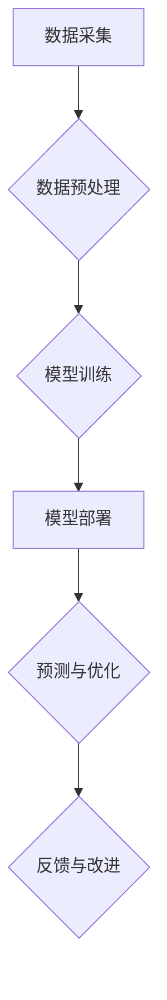

> AI，碳中和，可持续发展，机器学习，深度学习，优化算法，环境监测，能源管理

## 1. 背景介绍

全球气候变化已成为人类面临的严峻挑战，碳排放是导致气候变化的主要因素之一。为了应对气候变化，世界各国纷纷制定了碳中和目标，旨在实现经济发展与环境保护的平衡。人工智能（AI）作为一种新兴技术，具有强大的计算能力和学习能力，为实现碳中和目标提供了新的思路和解决方案。

近年来，AI技术在环境保护领域取得了显著进展，例如：

* **环境监测:** AI算法可以分析卫星图像、气象数据等，监测森林覆盖率、空气质量、水质等环境指标，为环境保护提供数据支持。
* **能源管理:** AI可以优化能源分配、预测能源需求、控制能源消耗，提高能源利用效率，减少碳排放。
* **绿色制造:** AI可以优化生产流程、减少废物排放、提高资源利用率，推动绿色制造业发展。

## 2. 核心概念与联系

**2.1 碳中和的概念**

碳中和是指人类活动排放的二氧化碳等温室气体，通过自然吸收或其他技术手段，最终实现净零排放的状态。

**2.2 AI技术与碳中和的联系**

AI技术可以帮助我们实现碳中和目标，主要通过以下途径：

* **提高能源效率:** AI可以优化能源分配、预测能源需求、控制能源消耗，提高能源利用效率，减少碳排放。
* **促进绿色出行:** AI可以优化交通流量、规划绿色出行路线、促进电动汽车普及，减少交通运输碳排放。
* **推动绿色产业发展:** AI可以优化生产流程、减少废物排放、提高资源利用率，推动绿色制造业发展。

**2.3 AI技术架构**



## 3. 核心算法原理 & 具体操作步骤

**3.1 算法原理概述**

在AI技术助力碳中和的应用中，常用的算法包括机器学习、深度学习、强化学习等。

* **机器学习:** 通过训练模型，让模型从数据中学习规律，并对新的数据进行预测或分类。
* **深度学习:** 基于多层神经网络，能够学习更复杂的特征，适用于处理海量数据和复杂问题。
* **强化学习:** 通过奖励机制，让智能体在环境中学习最优策略，适用于优化决策和控制系统。

**3.2 算法步骤详解**

以机器学习为例，其基本步骤包括：

1. **数据收集:** 收集与碳中和相关的各种数据，例如能源消耗数据、交通流量数据、环境监测数据等。
2. **数据预处理:** 对收集到的数据进行清洗、转换、特征提取等处理，使其适合模型训练。
3. **模型选择:** 根据具体应用场景选择合适的机器学习模型，例如回归模型、分类模型、聚类模型等。
4. **模型训练:** 使用训练数据训练模型，调整模型参数，使其能够准确预测或分类。
5. **模型评估:** 使用测试数据评估模型性能，例如准确率、召回率、F1-score等。
6. **模型部署:** 将训练好的模型部署到实际应用场景中，用于预测或控制。

**3.3 算法优缺点**

* **优点:**

    * 能够自动学习数据规律，无需人工编程。
    * 能够处理海量数据，发现隐藏的模式。
    * 能够不断学习和改进，提高预测精度。

* **缺点:**

    * 需要大量的数据进行训练。
    * 模型训练过程可能耗时和耗能。
    * 模型解释性较差，难以理解模型的决策过程。

**3.4 算法应用领域**

* **能源管理:** 预测能源需求、优化能源分配、控制能源消耗。
* **交通运输:** 优化交通流量、规划绿色出行路线、促进电动汽车普及。
* **环境监测:** 监测森林覆盖率、空气质量、水质等环境指标。
* **绿色制造:** 优化生产流程、减少废物排放、提高资源利用率。

## 4. 数学模型和公式 & 详细讲解 & 举例说明

**4.1 数学模型构建**

碳排放预测模型可以构建为一个回归模型，其目标是预测未来某个时间段的碳排放量。模型输入包括历史碳排放数据、经济发展数据、人口数据等，模型输出为预测的碳排放量。

**4.2 公式推导过程**

假设碳排放量为Y，其与输入变量X的关系可以用线性回归模型表示：

$$Y = \beta_0 + \beta_1X_1 + \beta_2X_2 + ... + \beta_nX_n + \epsilon$$

其中：

* $\beta_0$ 为截距项
* $\beta_1, \beta_2, ..., \beta_n$ 为回归系数
* $X_1, X_2, ..., X_n$ 为输入变量
* $\epsilon$ 为随机误差项

通过最小二乘法，可以求解回归系数，得到最佳拟合的回归模型。

**4.3 案例分析与讲解**

假设我们想要预测某个城市的未来5年的碳排放量，输入变量包括该城市的GDP增长率、人口增长率、交通运输结构等。通过收集历史数据，训练一个碳排放预测模型，并使用模型预测未来5年的碳排放量。

## 5. 项目实践：代码实例和详细解释说明

**5.1 开发环境搭建**

* 操作系统: Ubuntu 20.04
* Python 版本: 3.8
* 必要的库: pandas, numpy, scikit-learn, matplotlib

**5.2 源代码详细实现**

```python
import pandas as pd
from sklearn.linear_model import LinearRegression
from sklearn.model_selection import train_test_split
import matplotlib.pyplot as plt

# 加载数据
data = pd.read_csv('carbon_emission_data.csv')

# 选择特征和目标变量
X = data[['GDP_growth_rate', 'population_growth_rate', 'transport_structure']]
y = data['carbon_emission']

# 将数据分为训练集和测试集
X_train, X_test, y_train, y_test = train_test_split(X, y, test_size=0.2, random_state=42)

# 创建线性回归模型
model = LinearRegression()

# 训练模型
model.fit(X_train, y_train)

# 预测测试集数据
y_pred = model.predict(X_test)

# 评估模型性能
print('R-squared:', model.score(X_test, y_test))

# 可视化预测结果
plt.scatter(y_test, y_pred)
plt.xlabel('Actual Carbon Emission')
plt.ylabel('Predicted Carbon Emission')
plt.title('Carbon Emission Prediction')
plt.show()
```

**5.3 代码解读与分析**

* 代码首先加载数据，选择特征和目标变量。
* 然后将数据分为训练集和测试集，用于训练和评估模型。
* 创建线性回归模型，并使用训练集训练模型。
* 使用训练好的模型预测测试集数据，并评估模型性能。
* 最后，可视化预测结果，观察模型的预测效果。

**5.4 运行结果展示**

运行代码后，会输出模型的R-squared值，以及预测结果的可视化图。R-squared值表示模型对数据的拟合程度，值越高表示模型拟合越好。可视化图可以直观地展示模型的预测效果。

## 6. 实际应用场景

**6.1 能源管理**

AI可以帮助能源公司优化能源分配、预测能源需求、控制能源消耗，提高能源利用效率，减少碳排放。例如，AI可以分析历史能源消耗数据、天气预报数据等，预测未来能源需求，并根据预测结果调整能源供应，避免能源浪费。

**6.2 交通运输**

AI可以帮助优化交通流量、规划绿色出行路线、促进电动汽车普及，减少交通运输碳排放。例如，AI可以分析交通流量数据、路况数据等，优化交通信号灯控制，减少交通拥堵，降低车辆油耗。

**6.3 环境监测**

AI可以帮助监测森林覆盖率、空气质量、水质等环境指标，为环境保护提供数据支持。例如，AI可以分析卫星图像数据，监测森林覆盖率的变化，及时发现森林火灾等环境问题。

**6.4 未来应用展望**

随着AI技术的不断发展，其在碳中和领域的应用将更加广泛和深入。例如，AI可以帮助开发更先进的碳捕获与封存技术，可以帮助设计更节能环保的建筑和交通系统，可以帮助制定更有效的碳减排政策。

## 7. 工具和资源推荐

**7.1 学习资源推荐**

* **在线课程:** Coursera, edX, Udacity 等平台提供丰富的AI相关课程。
* **书籍:** 《深度学习》、《机器学习实战》等书籍可以帮助深入理解AI技术。
* **开源项目:** TensorFlow, PyTorch 等开源项目可以帮助实践AI技术。

**7.2 开发工具推荐**

* **Python:** Python 是AI开发最常用的编程语言。
* **Jupyter Notebook:** Jupyter Notebook 是一个交互式编程环境，方便进行AI开发和实验。
* **IDE:** VS Code, PyCharm 等IDE可以提高AI开发效率。

**7.3 相关论文推荐**

* **碳排放预测:** "A Deep Learning Approach for Carbon Emission Forecasting"
* **能源管理:** "Deep Reinforcement Learning for Smart Grid Energy Management"
* **环境监测:** "AI-Powered Environmental Monitoring: A Review"

## 8. 总结：未来发展趋势与挑战

**8.1 研究成果总结**

AI技术在碳中和领域取得了显著进展，为实现碳中和目标提供了新的思路和解决方案。

**8.2 未来发展趋势**

* **模型更加复杂:** 未来AI模型将更加复杂，能够处理更复杂的数据和问题。
* **数据更加丰富:** 未来将收集更多的数据，为AI模型提供更丰富的训练数据。
* **应用更加广泛:** AI技术将应用于更多领域，例如碳捕获与封存、绿色制造等。

**8.3 面临的挑战**

* **数据质量:** AI模型的性能依赖于数据质量，需要确保数据的准确性和完整性。
* **模型解释性:** AI模型的决策过程难以理解，需要提高模型的解释性。
* **伦理问题:** AI技术应用需要考虑伦理问题，例如数据隐私、算法偏见等。

**8.4 研究展望**

未来研究将重点关注以下方面:

* 开发更准确、更鲁棒的AI模型。
* 提高AI模型的解释性，使其决策过程更加透明。
* 研究AI技术在碳中和领域的伦理问题，确保其安全和可持续发展。

## 9. 附录：常见问题与解答

**9.1 如何选择合适的AI模型？**

选择合适的AI模型需要根据具体应用场景和数据特点进行选择。例如，对于预测连续变量的数据，可以使用回归模型；对于分类数据，可以使用分类模型。

**9.2 如何评估AI模型的性能？**

常用的AI模型性能评估指标包括准确率、召回率、F1-score、R-squared等。

**9.3 如何解决AI模型的过拟合问题？**

过拟合是指模型对训练数据过拟合，导致在测试数据上表现不佳。解决过拟合问题的方法包括：

* 减少模型复杂度
* 增加训练数据量
* 使用正则化技术

作者：禅与计算机程序设计艺术 / Zen and the Art of Computer Programming


<end_of_turn>