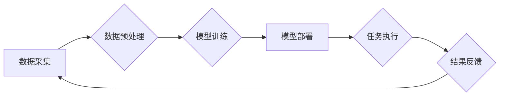

> AIGC, 企业任务, 自然语言处理, 机器学习, 深度学习, 模型训练, 应用场景, 挑战

## 1. 背景介绍

近年来，人工智能（AI）技术取得了飞速发展，特别是生成式人工智能（AIGC）的兴起，为企业数字化转型和业务创新带来了前所未有的机遇。AIGC是指利用人工智能技术，从文本、图像、音频等数据中生成新的内容，例如文本创作、图像生成、代码编写等。

传统的企业任务往往需要大量的人工投入和时间成本，而AIGC能够自动化完成许多重复性、规则性任务，提高效率，降低成本。例如，AIGC可以帮助企业自动生成营销文案、客户服务回复、产品说明书等，解放人力资源，提升工作效率。

## 2. 核心概念与联系

**2.1 AIGC 的核心概念**

AIGC的核心是利用深度学习算法，训练模型能够理解和生成人类语言和数据。

**2.2 AIGC 与企业任务的联系**

AIGC可以应用于企业任务的各个环节，例如：

* **营销与销售:** 自动生成营销文案、广告创意、产品描述等，提高营销效率。
* **客户服务:** 自动回复客户咨询、处理常见问题，提升客户服务体验。
* **内容创作:** 自动生成博客文章、新闻报道、社交媒体内容等，丰富内容输出。
* **研发与设计:** 自动生成代码、设计草图、产品原型等，加速研发流程。

**2.3 AIGC 应用架构**



## 3. 核心算法原理 & 具体操作步骤

**3.1 算法原理概述**

AIGC的核心算法主要包括：

* **Transformer网络:** Transformer网络是一种深度学习模型，能够有效处理序列数据，例如文本。它利用注意力机制，能够捕捉文本中的长距离依赖关系，提高文本生成质量。
* **生成式对抗网络 (GAN):** GAN由两个网络组成：生成器和鉴别器。生成器试图生成逼真的数据，而鉴别器试图区分真实数据和生成数据。通过对抗训练，生成器能够生成越来越逼真的数据。

**3.2 算法步骤详解**

**3.2.1 Transformer网络训练步骤:**

1. **数据预处理:** 将文本数据进行清洗、分词、词嵌入等预处理操作。
2. **模型训练:** 使用Transformer网络模型，训练模型能够预测下一个词。
3. **模型评估:** 使用测试集评估模型的性能，例如困惑度、BLEU分数等。

**3.2.2 GAN训练步骤:**

1. **初始化生成器和鉴别器:** 使用随机初始化生成器和鉴别器网络参数。
2. **生成器训练:** 使用真实数据训练鉴别器，并使用鉴别器反馈信息训练生成器。
3. **鉴别器训练:** 使用真实数据和生成器生成的假数据训练鉴别器。
4. **重复步骤2和3:** 直到生成器能够生成逼真的数据。

**3.3 算法优缺点**

**3.3.1 Transformer网络:**

* **优点:** 能够有效处理长距离依赖关系，生成高质量文本。
* **缺点:** 训练成本高，需要大量数据和计算资源。

**3.3.2 GAN:**

* **优点:** 可以生成逼真的数据，适用于图像、音频等多种数据类型。
* **缺点:** 训练过程不稳定，容易出现模式崩溃等问题。

**3.4 算法应用领域**

* **文本生成:** 文章写作、故事创作、对话系统等。
* **图像生成:** 图片合成、图像修复、风格迁移等。
* **音频生成:** 语音合成、音乐创作、音效制作等。

## 4. 数学模型和公式 & 详细讲解 & 举例说明

**4.1 数学模型构建**

Transformer网络的数学模型主要基于注意力机制和多头注意力机制。

**4.1.1 注意力机制:**

注意力机制可以帮助模型关注输入序列中重要的部分，并根据其重要性分配不同的权重。注意力机制的公式如下：

$$
\text{Attention}(Q, K, V) = \text{softmax}\left(\frac{Q K^T}{\sqrt{d_k}}\right) V
$$

其中：

* $Q$：查询矩阵
* $K$：键矩阵
* $V$：值矩阵
* $d_k$：键向量的维度

**4.1.2 多头注意力机制:**

多头注意力机制将注意力机制应用于多个不同的子空间，并通过拼接和线性变换将结果融合在一起。

**4.2 公式推导过程**

Transformer网络的具体公式推导过程比较复杂，涉及到矩阵运算、激活函数等多个步骤。

**4.3 案例分析与讲解**

例如，在机器翻译任务中，Transformer网络可以将源语言句子编码为一个向量表示，然后利用注意力机制和解码器生成目标语言句子。

## 5. 项目实践：代码实例和详细解释说明

**5.1 开发环境搭建**

* Python 3.7+
* TensorFlow/PyTorch
* CUDA/cuDNN

**5.2 源代码详细实现**

```python
# 使用 TensorFlow 实现 Transformer 网络
import tensorflow as tf

# 定义 Transformer 网络结构
class Transformer(tf.keras.Model):
    def __init__(self, vocab_size, embedding_dim, num_heads, num_layers):
        super(Transformer, self).__init__()
        self.embedding = tf.keras.layers.Embedding(vocab_size, embedding_dim)
        self.transformer_layers = [
            tf.keras.layers.MultiHeadAttention(num_heads=num_heads, key_dim=embedding_dim)
            for _ in range(num_layers)
        ]
        self.dense = tf.keras.layers.Dense(vocab_size)

    def call(self, inputs):
        # ...
```

**5.3 代码解读与分析**

* `embedding` 层将单词转换为向量表示。
* `transformer_layers` 包含多个 Transformer 层，每个层包含多头注意力机制和前馈神经网络。
* `dense` 层将 Transformer 输出转换为单词概率分布。

**5.4 运行结果展示**

使用训练好的 Transformer 模型，可以对文本进行生成、翻译、摘要等任务。

## 6. 实际应用场景

**6.1 营销与销售:**

* 自动生成营销文案、广告创意、产品描述等，提高营销效率。
* 个性化推荐产品，提升用户体验。

**6.2 客户服务:**

* 自动回复客户咨询、处理常见问题，提升客户服务效率。
* 提供24小时在线客服，提高客户满意度。

**6.3 内容创作:**

* 自动生成博客文章、新闻报道、社交媒体内容等，丰富内容输出。
* 创作不同风格的文本，满足不同需求。

**6.4 研发与设计:**

* 自动生成代码、设计草图、产品原型等，加速研发流程。
* 辅助程序员进行代码编写，提高开发效率。

**6.5 未来应用展望**

* AIGC将进一步融入到企业各个业务环节，提高效率和创新能力。
* AIGC将推动个性化定制、智能化服务等新模式的出现。

## 7. 工具和资源推荐

**7.1 学习资源推荐:**

* **书籍:**
    * 《深度学习》
    * 《自然语言处理》
* **在线课程:**
    * Coursera
    * edX
* **博客和论坛:**
    * TensorFlow Blog
    * PyTorch Forum

**7.2 开发工具推荐:**

* **TensorFlow:** 开源深度学习框架
* **PyTorch:** 开源深度学习框架
* **Hugging Face:** 提供预训练模型和工具

**7.3 相关论文推荐:**

* 《Attention Is All You Need》
* 《Generative Adversarial Networks》

## 8. 总结：未来发展趋势与挑战

**8.1 研究成果总结**

AIGC技术取得了显著进展，能够生成高质量的文本、图像、音频等数据。

**8.2 未来发展趋势**

* 模型规模和能力将进一步提升。
* AIGC将更加细化和专业化，应用于更多领域。
* AIGC与其他AI技术将融合，形成更强大的应用场景。

**8.3 面临的挑战**

* 数据安全和隐私保护
* 模型可解释性和信任度
* 伦理和社会影响

**8.4 研究展望**

* 研究更安全、更可靠、更可解释的AIGC模型。
* 探索AIGC在更多领域的新应用场景。
* 构建AIGC的伦理规范和治理机制。

## 9. 附录：常见问题与解答

**9.1 如何选择合适的AIGC模型？**

选择合适的AIGC模型需要根据具体的应用场景和需求进行选择。例如，对于文本生成任务，可以选择Transformer网络模型；对于图像生成任务，可以选择GAN模型。

**9.2 如何训练AIGC模型？**

训练AIGC模型需要准备大量的训练数据，并使用深度学习框架进行训练。

**9.3 如何评估AIGC模型的性能？**

AIGC模型的性能可以根据具体的应用场景进行评估，例如使用困惑度、BLEU分数等指标评估文本生成模型的性能。


作者：禅与计算机程序设计艺术 / Zen and the Art of Computer Programming 
<end_of_turn>