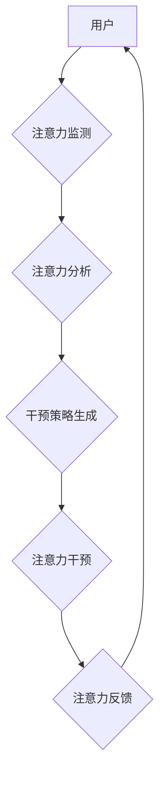

> 人工智能，注意力流，工作模式，技能发展，注意力管理技术，未来趋势

## 1. 背景介绍

在信息爆炸的时代，人类面临着前所未有的信息洪流。从社交媒体的推送通知到电子邮件的提醒，从新闻网站的滚动条到视频平台的推荐，无处不在的信息碎片化和快速更新，不断地冲击着我们的注意力，导致注意力分散、效率低下、认知疲劳等问题日益突出。

与此同时，人工智能（AI）技术飞速发展，正在深刻地改变着我们的生活和工作方式。AI驱动的自动化、智能化应用，正在逐步替代人类在某些领域的工作，同时也为人类创造了新的工作机会和发展方向。

然而，在AI时代，如何有效地管理和利用注意力，将成为决定个人和社会未来竞争力的关键因素。

## 2. 核心概念与联系

**2.1 人类注意力流**

注意力流是指人类在信息处理过程中，将有限的认知资源集中在特定目标上的过程。它是一个动态、复杂的认知过程，受多种因素影响，包括个体差异、环境刺激、任务要求等。

**2.2 人工智能与注意力流**

AI技术可以对人类注意力流进行监测、分析和干预，从而帮助人们更好地管理和利用注意力。例如：

* **注意力监测:** 通过眼动追踪、脑电图等技术，实时监测用户的注意力状态，识别注意力分散的迹象。
* **注意力干预:** 根据用户的注意力状态，提供个性化的干预措施，例如调整屏幕亮度、播放背景音乐、发送提醒等，帮助用户集中注意力。
* **注意力训练:** 通过游戏化、互动化的训练方式，帮助用户提高注意力集中、保持时间和切换能力。

**2.3  注意力流管理技术架构**



## 3. 核心算法原理 & 具体操作步骤

**3.1 算法原理概述**

注意力流管理技术的核心算法通常基于以下几个方面：

* **时间序列分析:** 利用机器学习算法对用户的注意力数据进行分析，识别注意力模式和变化趋势。
* **深度学习:** 使用深度神经网络模型，对用户的注意力数据进行更深入的理解和预测。
* **强化学习:** 通过训练智能代理，学习如何根据用户的注意力状态，提供最有效的干预策略。

**3.2 算法步骤详解**

1. **数据采集:** 收集用户的注意力数据，例如眼动轨迹、鼠标点击、键盘输入等。
2. **数据预处理:** 对收集到的数据进行清洗、转换和特征提取，以便于算法训练和应用。
3. **模型训练:** 利用机器学习、深度学习或强化学习算法，训练注意力流管理模型。
4. **模型评估:** 对训练好的模型进行评估，验证其准确性和有效性。
5. **模型部署:** 将训练好的模型部署到实际应用场景中，例如智能手机、电脑、虚拟现实设备等。

**3.3 算法优缺点**

* **优点:**

    * 可以个性化地针对用户的注意力特点提供干预措施。
    * 可以实时监测和调整注意力状态，提高工作效率和学习效果。
    * 可以帮助用户识别和克服注意力障碍问题。

* **缺点:**

    * 需要大量的用户数据进行训练，才能获得较高的准确率。
    * 算法的复杂性较高，需要专业的技术人员进行开发和维护。
    * 存在一定的隐私安全风险，需要妥善处理用户数据。

**3.4 算法应用领域**

* **教育:** 帮助学生集中注意力，提高学习效率。
* **工作:** 帮助员工提高工作效率，减少认知疲劳。
* **医疗:** 帮助患者治疗注意力障碍问题。
* **娱乐:** 提供更个性化和沉浸式的娱乐体验。

## 4. 数学模型和公式 & 详细讲解 & 举例说明

**4.1 数学模型构建**

注意力流可以被建模为一个动态系统，其中用户的注意力状态是一个随时间变化的变量。我们可以使用以下数学模型来描述注意力流的演化过程：

$$
\frac{dA}{dt} = f(A, S, T)
$$

其中：

* $A$ 表示用户的注意力状态，是一个介于0到1之间的数值，代表注意力集中程度。
* $S$ 表示环境刺激，例如任务难度、信息内容、外部干扰等。
* $T$ 表示用户的认知能力，例如注意力持续时间、注意力切换能力等。
* $f$ 是一个非线性函数，描述了注意力状态随时间变化的规律。

**4.2 公式推导过程**

该模型的推导过程需要结合心理学、认知科学和数学建模等多学科知识，具体推导过程较为复杂，这里不再赘述。

**4.3 案例分析与讲解**

假设用户正在阅读一篇文章，文章内容较为枯燥乏味，环境中存在一些干扰因素，例如手机铃声、同事聊天声等。根据上述模型，我们可以推断出：

* $S$ 值较低，因为文章内容较为枯燥乏味，缺乏吸引力。
* $T$ 值可能受到环境干扰的影响，导致注意力持续时间缩短。
* $f(A, S, T)$ 值也可能较低，导致注意力状态逐渐下降。

因此，用户可能会感到注意力分散，难以集中精力阅读文章。

## 5. 项目实践：代码实例和详细解释说明

**5.1 开发环境搭建**

本项目使用Python语言进行开发，所需的开发环境包括：

* Python 3.x
* Jupyter Notebook
* TensorFlow 或 PyTorch 深度学习框架
* Matplotlib 数据可视化库

**5.2 源代码详细实现**

```python
import tensorflow as tf

# 定义注意力流模型
model = tf.keras.Sequential([
    tf.keras.layers.Dense(128, activation='relu'),
    tf.keras.layers.Dense(64, activation='relu'),
    tf.keras.layers.Dense(1, activation='sigmoid')
])

# 编译模型
model.compile(optimizer='adam', loss='binary_crossentropy', metrics=['accuracy'])

# 加载训练数据
(x_train, y_train), (x_test, y_test) = load_data()

# 训练模型
model.fit(x_train, y_train, epochs=10)

# 评估模型
loss, accuracy = model.evaluate(x_test, y_test)
print('Loss:', loss)
print('Accuracy:', accuracy)
```

**5.3 代码解读与分析**

这段代码定义了一个简单的注意力流模型，使用多层感知机（MLP）结构，输入用户的注意力数据，输出注意力状态的预测值。

* `tf.keras.Sequential` 创建了一个顺序模型，将多个层级连接在一起。
* `tf.keras.layers.Dense` 定义了全连接层，每个神经元都连接到上一层的每个神经元。
* `activation='relu'` 使用ReLU激活函数，引入非线性，提高模型的表达能力。
* `loss='binary_crossentropy'` 使用二分类交叉熵损失函数，用于训练二分类问题。
* `metrics=['accuracy']` 使用准确率作为评估指标。

**5.4 运行结果展示**

训练完成后，模型可以用来预测用户的注意力状态，例如判断用户是否正在集中注意力，或者预测用户注意力持续的时间。

## 6. 实际应用场景

**6.1 教育领域**

* **个性化学习:** 根据学生的注意力特点，提供个性化的学习内容和学习方式，提高学习效率。
* **注意力训练:** 通过游戏化、互动化的训练方式，帮助学生提高注意力集中、保持时间和切换能力。
* **课堂管理:** 利用注意力监测技术，帮助老师了解学生的注意力状态，及时调整教学内容和方法。

**6.2 工作领域**

* **提高工作效率:** 帮助员工集中注意力，减少认知疲劳，提高工作效率。
* **优化工作流程:** 根据员工的注意力状态，优化工作流程，提高工作效率和质量。
* **远程办公支持:** 帮助远程办公员工集中注意力，提高工作效率。

**6.3 医疗领域**

* **注意力障碍诊断:** 利用注意力监测技术，帮助医生诊断注意力障碍问题。
* **注意力障碍治疗:** 通过注意力训练和干预措施，帮助患者改善注意力问题。
* **康复训练:** 利用注意力训练技术，帮助患者进行康复训练，提高认知功能。

**6.4 未来应用展望**

随着人工智能技术的不断发展，注意力流管理技术将应用于更广泛的领域，例如：

* **智能家居:** 根据用户的注意力状态，智能家居设备可以自动调节灯光、温度、音乐等环境因素，创造更舒适的居家环境。
* **智能交通:** 利用注意力监测技术，帮助驾驶员保持注意力集中，提高交通安全。
* **虚拟现实:** 根据用户的注意力状态，虚拟现实体验可以更加沉浸和个性化。

## 7. 工具和资源推荐

**7.1 学习资源推荐**

* **书籍:**
    * 《深度学习》
    * 《机器学习》
    * 《注意力机制》
* **在线课程:**
    * Coursera
    * edX
    * Udacity

**7.2 开发工具推荐**

* **Python:** 
* **TensorFlow:** 
* **PyTorch:** 
* **Jupyter Notebook:** 

**7.3 相关论文推荐**

* **Attention Is All You Need**
* **BERT: Pre-training of Deep Bidirectional Transformers for Language Understanding**
* **Transformer-XL: Attentive Language Models Beyond a Fixed-Length Context**

## 8. 总结：未来发展趋势与挑战

**8.1 研究成果总结**

近年来，注意力流管理技术取得了显著进展，在教育、工作、医疗等领域展现出巨大的应用潜力。

**8.2 未来发展趋势**

* **更精准的注意力监测:** 利用脑机接口等新技术，实现更精准、更细粒度的注意力监测。
* **更个性化的干预策略:** 基于用户的注意力特点和需求，提供更个性化的干预策略。
* **更智能的注意力训练:** 利用人工智能技术，开发更智能、更有效的注意力训练方法。

**8.3 面临的挑战**

* **数据隐私安全:** 注意力流管理技术需要收集大量的用户数据，如何保护用户隐私安全是一个重要的挑战。
* **算法伦理:** 注意力流管理技术可能会被用于操控用户行为，需要制定相应的伦理规范和监管机制。
* **技术可普及性:** 注意力流管理技术的应用需要一定的技术门槛，如何降低技术门槛，使其更易于普及是一个重要的挑战。

**8.4 研究展望**

未来，注意力流管理技术将继续朝着更精准、更个性化、更智能的方向发展，为人类提供更有效的注意力管理工具，帮助人们更好地应对信息爆炸时代带来的挑战。

## 9. 附录：常见问题与解答

**9.1 Q: 注意力流管理技术是否会让人变得更加依赖于技术？**

**A:** 注意力流管理技术本身并不会让人变得更加依赖于技术，它只是提供了一种工具，帮助人们更好地管理和利用注意力。关键在于如何合理使用这项技术，避免过度依赖。

**9.2 Q: 注意力流管理技术是否会侵犯用户的隐私？**

**A:** 注意力流管理技术确实需要收集用户的注意力数据，因此需要妥善处理用户数据，确保数据安全和隐私保护。

**9.3 Q: 注意力流管理技术是否适用于所有人？**

**A:** 注意力流管理技术可以应用于大多数人，但对于一些特殊人群，例如注意力障碍患者，需要根据其具体情况进行调整和应用。


作者：禅与计算机程序设计艺术 / Zen and the Art of Computer Programming 
<end_of_turn>