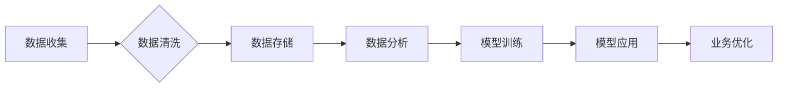

> AI创业, 数据积累, 数据应用, 数据策略, 数据质量, 数据安全, 数据可视化

## 1. 背景介绍

人工智能（AI）技术近年来发展迅速，已渗透到各个行业，成为推动经济发展和社会进步的重要力量。对于众多创业者而言，AI技术蕴藏着巨大的商业价值，但想要成功利用AI，数据积累和应用是关键。

数据是AI技术的基石，高质量的数据能够训练出更精准、更智能的AI模型，从而赋能企业创造新的价值。然而，数据积累是一个复杂的过程，需要企业制定合理的策略，并投入大量的时间和资源。

## 2. 核心概念与联系

**2.1 数据积累**

数据积累是指企业收集、整理、存储和管理各种类型的数据，形成一个庞大的数据资产。数据来源可以是内部数据（如销售记录、客户信息、运营数据等）或外部数据（如市场调研报告、行业数据、公开数据等）。

**2.2 数据应用**

数据应用是指利用收集到的数据，通过AI算法和模型，实现对业务的优化和提升。例如，利用客户数据进行精准营销，利用运营数据进行生产流程优化，利用市场数据进行产品研发等。

**2.3 数据策略**

数据策略是指企业在数据积累和应用过程中，制定的一系列原则、目标和行动计划。数据策略应与企业的整体战略相一致，并明确数据收集、存储、管理、分析和应用的流程和规范。

**2.4 数据质量**

数据质量是指数据准确性、完整性、一致性和及时性等方面的指标。高质量的数据是AI模型训练和应用的基础，因此企业需要重视数据质量的控制和提升。

**2.5 数据安全**

数据安全是指保护数据免受未经授权的访问、使用、修改或删除等威胁。企业需要采取相应的安全措施，确保数据的安全性和隐私性。

**2.6 数据可视化**

数据可视化是指将数据以图形、图表等形式呈现出来，以便于人们理解和分析。数据可视化可以帮助企业更好地发现数据中的趋势和模式，从而做出更明智的决策。

**Mermaid 流程图**



## 3. 核心算法原理 & 具体操作步骤

**3.1 算法原理概述**

在AI创业中，常用的算法包括机器学习、深度学习、自然语言处理等。

* **机器学习**：通过训练模型，让模型从数据中学习规律，并对新数据进行预测或分类。
* **深度学习**：一种更高级的机器学习方法，利用多层神经网络，能够学习更复杂的特征和模式。
* **自然语言处理**：处理和理解人类语言，例如文本分类、情感分析、机器翻译等。

**3.2 算法步骤详解**

1. **数据准备**: 收集、清洗、预处理数据，使其适合算法训练。
2. **模型选择**: 根据业务需求选择合适的算法模型。
3. **模型训练**: 利用训练数据训练模型，调整模型参数，使其能够准确预测或分类。
4. **模型评估**: 使用测试数据评估模型的性能，例如准确率、召回率、F1-score等。
5. **模型部署**: 将训练好的模型部署到生产环境中，用于实际应用。

**3.3 算法优缺点**

不同的算法有不同的优缺点，需要根据具体业务场景选择合适的算法。

* **机器学习**: 优点：易于理解和实现，适用于数据量较小的场景。缺点：难以学习复杂特征，需要人工特征工程。
* **深度学习**: 优点：能够学习复杂特征，无需人工特征工程。缺点：需要大量数据训练，计算资源消耗大。
* **自然语言处理**: 优点：能够处理和理解人类语言，应用场景广泛。缺点：模型训练复杂，需要专业知识。

**3.4 算法应用领域**

AI算法广泛应用于各个行业，例如：

* **电商**: 商品推荐、精准营销、客户服务
* **金融**: 风险评估、欺诈检测、投资决策
* **医疗**: 疾病诊断、药物研发、个性化治疗
* **制造**: 质量控制、预测维护、生产优化

## 4. 数学模型和公式 & 详细讲解 & 举例说明

**4.1 数学模型构建**

在AI算法中，数学模型是描述算法逻辑和关系的数学表达式。例如，线性回归模型的数学表达式为：

$$y = w_0 + w_1x_1 + w_2x_2 + ... + w_nx_n + \epsilon$$

其中：

* $y$ 是预测值
* $w_0, w_1, w_2, ..., w_n$ 是模型参数
* $x_1, x_2, ..., x_n$ 是输入特征
* $\epsilon$ 是误差项

**4.2 公式推导过程**

模型参数的学习过程通常使用梯度下降算法，通过不断调整参数，使得模型预测值与真实值之间的误差最小化。梯度下降算法的公式为：

$$w_i = w_i - \alpha \frac{\partial Loss}{\partial w_i}$$

其中：

* $w_i$ 是模型参数
* $\alpha$ 是学习率
* $\frac{\partial Loss}{\partial w_i}$ 是损失函数对参数 $w_i$ 的梯度

**4.3 案例分析与讲解**

例如，在预测房价问题中，我们可以使用线性回归模型，将房屋面积、房间数量、地理位置等特征作为输入，预测房价。通过训练模型，我们可以得到模型参数，例如房屋面积每增加1平方米，房价会增加多少元。

## 5. 项目实践：代码实例和详细解释说明

**5.1 开发环境搭建**

* Python 3.x
* Jupyter Notebook
* TensorFlow 或 PyTorch

**5.2 源代码详细实现**

```python
import tensorflow as tf

# 定义模型
model = tf.keras.models.Sequential([
    tf.keras.layers.Dense(64, activation='relu', input_shape=(4,)),
    tf.keras.layers.Dense(1)
])

# 编译模型
model.compile(optimizer='adam', loss='mse')

# 训练模型
model.fit(X_train, y_train, epochs=10)

# 评估模型
loss = model.evaluate(X_test, y_test)
print('Loss:', loss)

# 预测房价
new_house = [[100, 2, 1, 0]]
prediction = model.predict(new_house)
print('Predicted price:', prediction)
```

**5.3 代码解读与分析**

* 代码首先定义了一个简单的线性回归模型，包含两层全连接神经网络。
* 然后，模型被编译，指定了优化器、损失函数等参数。
* 接着，模型被训练，使用训练数据调整模型参数。
* 最后，模型被评估，并使用新数据进行预测。

**5.4 运行结果展示**

运行结果会显示模型的损失值和对新房子的预测价格。

## 6. 实际应用场景

**6.1 电商推荐系统**

利用用户购买历史、浏览记录等数据，训练推荐模型，推荐用户可能感兴趣的商品。

**6.2 金融风险评估**

利用客户信用评分、交易记录等数据，训练风险评估模型，评估客户的贷款风险。

**6.3 医疗诊断辅助系统**

利用患者病历、检查结果等数据，训练诊断模型，辅助医生进行疾病诊断。

**6.4 未来应用展望**

AI技术将继续发展，在更多领域得到应用，例如：自动驾驶、机器人、个性化教育等。

## 7. 工具和资源推荐

**7.1 学习资源推荐**

* **在线课程**: Coursera, edX, Udacity
* **书籍**: 《深度学习》、《机器学习实战》
* **博客**: Towards Data Science, Machine Learning Mastery

**7.2 开发工具推荐**

* **Python**: TensorFlow, PyTorch, scikit-learn
* **云平台**: AWS, Azure, GCP

**7.3 相关论文推荐**

* **ImageNet Classification with Deep Convolutional Neural Networks**
* **Attention Is All You Need**
* **BERT: Pre-training of Deep Bidirectional Transformers for Language Understanding**

## 8. 总结：未来发展趋势与挑战

**8.1 研究成果总结**

近年来，AI技术取得了显著进展，在各个领域都取得了突破性成果。

**8.2 未来发展趋势**

* **模型更加强大**: 模型规模将继续扩大，性能将进一步提升。
* **应用更加广泛**: AI技术将应用于更多领域，解决更多问题。
* **伦理问题更加突出**: AI技术发展需要关注伦理问题，确保其安全、公平、可解释。

**8.3 面临的挑战**

* **数据获取**: 高质量的数据是AI模型训练的基础，获取高质量数据仍然是一个挑战。
* **计算资源**: 训练大型AI模型需要大量的计算资源，成本较高。
* **人才缺口**: AI领域人才需求量大，人才缺口仍然存在。

**8.4 研究展望**

未来，AI研究将继续深入，探索更强大的模型、更广泛的应用场景，并解决伦理问题，推动AI技术健康发展。

## 9. 附录：常见问题与解答

**9.1 如何选择合适的AI算法？**

选择合适的AI算法需要根据具体业务场景和数据特点进行分析。

**9.2 如何保证数据质量？**

数据质量需要通过数据清洗、数据验证等手段进行保证。

**9.3 如何解决AI模型的解释性问题？**

可以使用可解释AI技术，例如LIME、SHAP等，提高模型的解释性。


作者：禅与计算机程序设计艺术 / Zen and the Art of Computer Programming 
<end_of_turn>