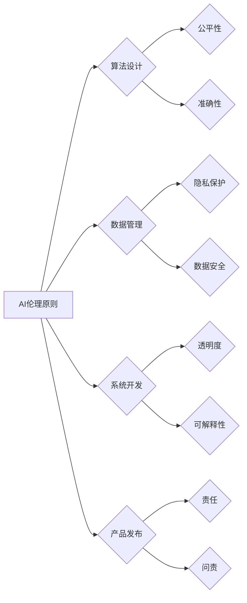

> 人工智能伦理、AI创业公司、算法偏见、数据隐私、透明度、可解释性、责任

## 1. 背景介绍

人工智能（AI）技术飞速发展，正在深刻地改变着我们的生活和工作方式。AI创业公司涌现，在各个领域带来创新和变革。然而，随着AI技术的应用越来越广泛，其潜在的伦理风险也日益凸显。

AI创业公司在追求商业成功的同时，必须认真对待AI伦理问题，确保其产品和服务符合社会道德规范，并对社会产生积极影响。

## 2. 核心概念与联系

**2.1 AI伦理的核心概念**

AI伦理是指在人工智能技术研发、应用和监管过程中，遵循道德原则和社会规范，确保AI技术安全、可控、可信赖的伦理准则。

**2.2 AI伦理与AI创业公司**

AI伦理与AI创业公司息息相关。AI创业公司利用AI技术开发产品和服务，其产品和服务直接影响着人们的生活和社会发展。因此，AI创业公司必须将AI伦理融入到公司的文化、战略和运营中，确保其产品和服务符合社会道德规范，并对社会产生积极影响。

**2.3 AI伦理的联系**

AI伦理涉及多个方面，包括：

* **算法公平性:** 确保AI算法不产生歧视或偏见，公平地对待所有用户。
* **数据隐私:** 保护用户数据隐私，防止数据泄露和滥用。
* **透明度和可解释性:** 使AI决策过程透明可解释，让人们能够理解AI是如何做出决定的。
* **责任和问责:** 明确AI系统的责任主体，并建立相应的问责机制。
* **人机协作:** 确保AI技术与人类协作，而不是取代人类。

**2.4 AI伦理架构**



## 3. 核心算法原理 & 具体操作步骤

**3.1 算法原理概述**

在AI伦理建设中，算法公平性是核心问题之一。算法偏见是指AI算法在训练数据中学习到的不公平或歧视性模式，导致算法对不同群体做出不公平的决策。

**3.2 算法步骤详解**

为了解决算法偏见问题，可以采用以下步骤：

1. **识别潜在的偏见:** 分析训练数据，识别可能导致偏见的特征。
2. **数据预处理:** 对训练数据进行清洗和处理，消除或减轻偏见。
3. **算法设计:** 选择合适的算法模型，并进行参数调整，以减少算法偏见。
4. **模型评估:** 对训练好的模型进行评估，检测是否存在偏见。
5. **持续监控:** 对模型在实际应用中的表现进行持续监控，及时发现和解决偏见问题。

**3.3 算法优缺点**

* **优点:** 可以有效减少算法偏见，提高算法公平性。
* **缺点:** 需要投入大量时间和资源进行数据预处理和模型评估。

**3.4 算法应用领域**

* **金融领域:** 避免算法在贷款审批、风险评估等方面产生歧视。
* **医疗领域:** 确保算法在疾病诊断、治疗方案推荐等方面公平公正。
* **司法领域:** 避免算法在判决、刑罚量刑等方面产生偏见。

## 4. 数学模型和公式 & 详细讲解 & 举例说明

**4.1 数学模型构建**

为了量化算法偏见，可以构建以下数学模型：

* **偏见度:**  定义为算法对不同群体的预测结果差异。

$$
Bias = \frac{1}{N} \sum_{i=1}^{N} |f(x_i) - g(x_i)|
$$

其中:

* $f(x_i)$ 是算法对第i个样本的预测结果。
* $g(x_i)$ 是对第i个样本的真实结果。
* $N$ 是样本总数。

**4.2 公式推导过程**

偏见度公式的推导过程如下:

1. 计算算法对每个样本的预测结果和真实结果的差值。
2. 对所有样本的差值求平均值，得到偏见度。

**4.3 案例分析与讲解**

假设我们有一个用于预测房价的算法，训练数据包含不同种族和收入水平的房屋信息。如果算法在预测不同种族房屋的房价时存在差异，则说明算法存在种族偏见。

## 5. 项目实践：代码实例和详细解释说明

**5.1 开发环境搭建**

* 操作系统: Ubuntu 20.04
* Python 版本: 3.8
* 必要的库: scikit-learn, pandas, numpy

**5.2 源代码详细实现**

```python
import pandas as pd
from sklearn.model_selection import train_test_split
from sklearn.linear_model import LinearRegression
from sklearn.metrics import mean_squared_error

# 加载数据
data = pd.read_csv('housing_data.csv')

# 划分训练集和测试集
X_train, X_test, y_train, y_test = train_test_split(data.drop('price', axis=1), data['price'], test_size=0.2, random_state=42)

# 创建线性回归模型
model = LinearRegression()

# 训练模型
model.fit(X_train, y_train)

# 预测测试集结果
y_pred = model.predict(X_test)

# 计算均方误差
mse = mean_squared_error(y_test, y_pred)

# 打印均方误差
print(f'Mean Squared Error: {mse}')
```

**5.3 代码解读与分析**

* 代码首先加载房价数据，然后将数据划分成训练集和测试集。
* 然后，代码创建了一个线性回归模型，并使用训练集训练模型。
* 最后，代码使用测试集预测房价，并计算均方误差来评估模型性能。

**5.4 运行结果展示**

运行代码后，会输出模型的均方误差值。

## 6. 实际应用场景

**6.1 AI伦理在金融领域的应用**

在金融领域，AI技术被广泛应用于贷款审批、风险评估、欺诈检测等方面。然而，如果算法存在偏见，可能会导致不公平的贷款审批结果，或对特定群体进行过度风险评估。

**6.2 AI伦理在医疗领域的应用**

在医疗领域，AI技术被用于疾病诊断、治疗方案推荐、药物研发等方面。如果算法存在偏见，可能会导致对不同种族或性别患者的诊断和治疗方案存在差异。

**6.3 AI伦理在司法领域的应用**

在司法领域，AI技术被用于判决、刑罚量刑、风险评估等方面。如果算法存在偏见，可能会导致对不同种族或社会背景的被告人进行不公平的判决或刑罚量刑。

**6.4 未来应用展望**

随着AI技术的不断发展，其应用场景将更加广泛，AI伦理问题也将更加重要。未来，AI伦理将成为AI技术发展的重要方向之一，需要政府、企业、学术界共同努力，制定相应的规范和标准，确保AI技术安全、可控、可信赖。

## 7. 工具和资源推荐

**7.1 学习资源推荐**

* **书籍:**
    * 《人工智能伦理》
    * 《AI Superpowers》
* **在线课程:**
    * Coursera: AI Ethics
    * edX: AI for Social Good

**7.2 开发工具推荐**

* **TensorFlow:** 开源机器学习框架
* **PyTorch:** 开源机器学习框架
* **Scikit-learn:** Python机器学习库

**7.3 相关论文推荐**

* **On the Dangers of Stochastic Parrots: Can Language Models Be Too Big?**
* **Algorithmic Fairness**

## 8. 总结：未来发展趋势与挑战

**8.1 研究成果总结**

近年来，AI伦理研究取得了显著进展，人们对AI伦理问题有了更深入的理解。

**8.2 未来发展趋势**

未来，AI伦理研究将更加注重实践应用，并与其他学科交叉融合，例如法律、哲学、社会学等。

**8.3 面临的挑战**

AI伦理研究面临着许多挑战，例如：

* 如何量化和评估AI伦理风险
* 如何制定有效的AI伦理规范和标准
* 如何确保AI伦理规范的实施和执行

**8.4 研究展望**

未来，AI伦理研究将继续深入发展，为AI技术的健康发展提供重要的理论和实践指导。

## 9. 附录：常见问题与解答

**9.1 如何识别算法偏见?**

可以通过分析训练数据、评估模型性能、进行案例分析等方式识别算法偏见。

**9.2 如何解决算法偏见?**

可以通过数据预处理、算法设计、模型评估等方式解决算法偏见。

**9.3 AI伦理的制定者是谁?**

AI伦理的制定者是一个多方参与的过程，包括政府、企业、学术界、社会公众等。

**9.4 AI伦理的监管机制是什么?**

目前，AI伦理的监管机制尚未完善，各国正在制定相应的法律法规和政策。

**9.5 AI伦理的未来发展趋势是什么?**

未来，AI伦理将更加注重实践应用，并与其他学科交叉融合。


作者：禅与计算机程序设计艺术 / Zen and the Art of Computer Programming 
<end_of_turn>