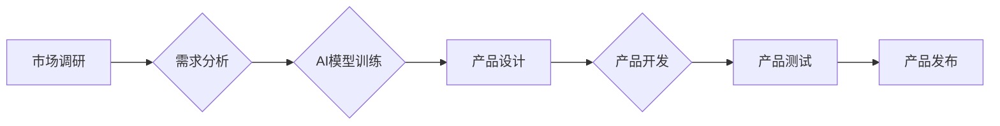

>人工智能，产品创新，机器学习，深度学习，自然语言处理，数据分析，设计自动化

## 1. 背景介绍

在当今科技飞速发展的时代，人工智能（AI）正以惊人的速度改变着我们生活的方方面面。从智能手机的语音助手到自动驾驶汽车，AI技术的应用日益广泛。在产品创新领域，AI也展现出巨大的潜力，能够帮助企业更快、更有效地开发出满足用户需求的新产品。

传统的产品创新流程通常是一个漫长而复杂的周期，需要大量的资源投入和时间成本。从市场调研、需求分析到产品设计、开发和测试，每个环节都充满了挑战和不确定性。而AI技术的介入可以有效地优化和加速整个创新流程，提高产品创新效率和成功率。

## 2. 核心概念与联系

**2.1 产品创新与AI**

产品创新是指企业通过开发新产品、改进现有产品或创造新的产品组合来满足用户需求，从而获得竞争优势的过程。AI技术可以帮助企业在以下几个方面辅助产品创新：

* **市场洞察:** AI可以分析海量用户数据，识别用户需求和趋势，为产品开发提供更精准的市场洞察。
* **需求预测:** AI可以根据历史数据和用户行为预测未来的产品需求，帮助企业制定更有效的产品策略。
* **设计优化:** AI可以辅助设计师进行产品设计，例如生成创意设计方案、优化产品结构和功能，提高产品的美观性和实用性。
* **开发加速:** AI可以自动化一些重复性的开发任务，例如代码生成、测试用例编写，提高开发效率。
* **用户体验提升:** AI可以根据用户行为和反馈，个性化定制产品体验，提升用户满意度。

**2.2 AI技术应用场景**

AI技术在产品创新过程中的应用场景非常广泛，例如：

* **智能家居:** AI可以帮助开发智能家居设备，例如智能音箱、智能照明、智能安防系统，提供更便捷、舒适的生活体验。
* **医疗保健:** AI可以辅助医生进行诊断、治疗和预防疾病，开发个性化的医疗方案，提高医疗效率和质量。
* **金融科技:** AI可以帮助开发智能理财产品、风险管理系统、欺诈检测系统，提高金融服务的效率和安全性。
* **教育科技:** AI可以开发个性化学习平台、智能辅导系统，帮助学生更好地掌握知识和技能。

**2.3 AI流程图**



## 3. 核心算法原理 & 具体操作步骤

**3.1 算法原理概述**

在产品创新过程中，AI技术可以利用多种算法来辅助创新工作。其中，机器学习（ML）和深度学习（DL）是应用最为广泛的算法。

* **机器学习:** 机器学习算法可以从数据中学习模式和规律，并根据学习到的知识进行预测或分类。例如，可以使用机器学习算法分析用户行为数据，预测用户的购买意愿。
* **深度学习:** 深度学习算法是一种更高级的机器学习算法，它使用多层神经网络来模拟人类大脑的学习过程。深度学习算法能够处理更复杂的数据，例如图像、语音和文本，并取得更优异的性能。

**3.2 算法步骤详解**

**机器学习算法的典型步骤:**

1. **数据收集:** 收集与产品创新相关的各种数据，例如用户行为数据、市场趋势数据、产品设计数据等。
2. **数据预处理:** 对收集到的数据进行清洗、转换和格式化，使其适合机器学习算法的训练。
3. **模型选择:** 根据具体的产品创新任务选择合适的机器学习算法，例如分类算法、回归算法、聚类算法等。
4. **模型训练:** 使用训练数据训练选择的机器学习模型，使其能够学习到数据中的模式和规律。
5. **模型评估:** 使用测试数据评估模型的性能，例如准确率、召回率、F1-score等。
6. **模型部署:** 将训练好的模型部署到实际应用场景中，例如用于产品推荐、用户画像、需求预测等。

**3.3 算法优缺点**

**机器学习算法的优点:**

* 可以从数据中自动学习模式和规律，无需人工编程。
* 可以处理海量数据，发现隐藏的趋势和关系。
* 可以不断学习和改进，随着数据量的增加，模型性能会不断提升。

**机器学习算法的缺点:**

* 需要大量的训练数据，否则模型性能会下降。
* 对数据质量要求较高，数据噪声和偏差会影响模型的准确性。
* 模型解释性较差，难以理解模型是如何做出决策的。

**3.4 算法应用领域**

机器学习算法在产品创新领域应用广泛，例如：

* **市场调研:** 分析用户行为数据，预测用户需求和市场趋势。
* **产品设计:** 生成创意设计方案，优化产品结构和功能。
* **产品开发:** 自动化代码生成、测试用例编写等开发任务。
* **用户体验优化:** 根据用户行为和反馈，个性化定制产品体验。

## 4. 数学模型和公式 & 详细讲解 & 举例说明

**4.1 数学模型构建**

在机器学习中，常用的数学模型包括线性回归模型、逻辑回归模型、支持向量机模型等。这些模型都基于一定的数学公式，通过对数据的拟合来学习数据中的模式和规律。

**4.2 公式推导过程**

例如，线性回归模型的目标是找到一条直线，使得这条直线与数据点之间的距离最小。线性回归模型的数学公式如下：

$$y = w_0 + w_1x_1 + w_2x_2 + ... + w_nx_n$$

其中，$y$ 是预测值，$w_0, w_1, w_2, ..., w_n$ 是模型参数，$x_1, x_2, ..., x_n$ 是输入特征。

模型参数的求解可以通过最小二乘法来实现。最小二乘法的目标是找到一组参数，使得模型预测值与真实值之间的平方误差最小。

**4.3 案例分析与讲解**

假设我们有一个数据集，包含房屋面积和房屋价格的信息。我们想要使用线性回归模型来预测房屋价格。

我们可以将房屋面积作为输入特征，房屋价格作为输出目标。然后，使用最小二乘法来求解模型参数，得到一个线性回归模型。

这个模型可以用来预测新的房屋价格，只需要输入新的房屋面积即可。

## 5. 项目实践：代码实例和详细解释说明

**5.1 开发环境搭建**

为了实现AI辅助产品创新，需要搭建一个合适的开发环境。常用的开发环境包括：

* **Python:** Python是一种流行的编程语言，在机器学习和深度学习领域应用广泛。
* **Jupyter Notebook:** Jupyter Notebook是一种交互式编程环境，方便进行机器学习模型的开发和测试。
* **机器学习库:** TensorFlow、PyTorch、Scikit-learn等机器学习库提供了丰富的算法和工具，可以简化机器学习模型的开发过程。

**5.2 源代码详细实现**

以下是一个使用Python和Scikit-learn库实现线性回归模型的代码示例：

```python
from sklearn.linear_model import LinearRegression
from sklearn.model_selection import train_test_split
import pandas as pd

# 加载数据
data = pd.read_csv('house_data.csv')

# 分割数据
X = data[['面积']]
y = data['价格']
X_train, X_test, y_train, y_test = train_test_split(X, y, test_size=0.2, random_state=42)

# 创建线性回归模型
model = LinearRegression()

# 训练模型
model.fit(X_train, y_train)

# 预测测试数据
y_pred = model.predict(X_test)

# 评估模型性能
from sklearn.metrics import mean_squared_error
mse = mean_squared_error(y_test, y_pred)
print('均方误差:', mse)
```

**5.3 代码解读与分析**

这段代码首先加载了房屋数据，然后将房屋面积作为输入特征，房屋价格作为输出目标。接着，将数据分割成训练集和测试集。

然后，创建了一个线性回归模型，并使用训练集训练模型。最后，使用测试集预测房屋价格，并计算模型的均方误差来评估模型性能。

**5.4 运行结果展示**

运行这段代码后，会输出模型的均方误差值。均方误差值越小，模型的预测性能越好。

## 6. 实际应用场景

**6.1 智能家居**

AI可以帮助开发智能家居设备，例如智能音箱、智能照明、智能安防系统，提供更便捷、舒适的生活体验。例如，可以使用语音识别技术让用户通过语音控制智能家居设备，或者使用机器学习算法分析用户的行为模式，自动调节家居环境。

**6.2 医疗保健**

AI可以辅助医生进行诊断、治疗和预防疾病，开发个性化的医疗方案，提高医疗效率和质量。例如，可以使用深度学习算法分析医学图像，辅助医生诊断疾病，或者使用机器学习算法分析患者的医疗记录，预测患者的风险，进行个性化的预防和治疗。

**6.3 金融科技**

AI可以帮助开发智能理财产品、风险管理系统、欺诈检测系统，提高金融服务的效率和安全性。例如，可以使用机器学习算法分析用户的投资行为，推荐个性化的理财产品，或者使用深度学习算法检测金融交易中的欺诈行为。

**6.4 教育科技**

AI可以开发个性化学习平台、智能辅导系统，帮助学生更好地掌握知识和技能。例如，可以使用机器学习算法分析学生的学习进度和表现，提供个性化的学习建议，或者使用自然语言处理技术开发智能聊天机器人，为学生提供24小时的学习辅导。

**6.5 未来应用展望**

随着AI技术的不断发展，其在产品创新领域的应用将更加广泛和深入。例如，未来可能会出现以下应用场景：

* **AI驱动的产品设计:** AI可以根据用户需求和市场趋势，自动生成产品设计方案，提高产品设计效率和创新性。
* **个性化产品定制:** AI可以根据用户的个人喜好和需求，定制个性化的产品，满足用户的个性化需求。
* **智能产品维护:** AI可以监控产品的运行状态，预测产品的故障风险，并提供智能的维护建议，延长产品的使用寿命。

## 7. 工具和资源推荐

**7.1 学习资源推荐**

* **在线课程:** Coursera、edX、Udacity等平台提供丰富的机器学习和深度学习课程。
* **书籍:** 《深度学习》、《机器学习实战》等书籍是学习AI技术的经典教材。
* **博客和论坛:** Kaggle、Towards Data Science等网站提供大量的AI技术相关的博客文章和论坛讨论。

**7.2 开发工具推荐**

* **Python:** Python是一种流行的编程语言，在机器学习和深度学习领域应用广泛。
* **Jupyter Notebook:** Jupyter Notebook是一种交互式编程环境，方便进行机器学习模型的开发和测试。
* **TensorFlow:** TensorFlow是一个开源的机器学习框架，提供丰富的算法和工具。
* **PyTorch:** PyTorch是一个开源的深度学习框架，以其灵活性和易用性而闻名。
* **Scikit-learn:** Scikit-learn是一个开源的机器学习库，提供各种常用的机器学习算法。

**7.3 相关论文推荐**

* **《ImageNet Classification with Deep Convolutional Neural Networks》**
* **《Attention Is All You Need》**
* **《Generative Adversarial Networks》**

## 8. 总结：未来发展趋势与挑战

**8.1 研究成果总结**

近年来，AI技术取得了长足的进步，在产品创新领域也展现出巨大的潜力。机器学习和深度学习算法已经能够处理更复杂的数据，并取得更优异的性能。

**8.2 未来发展趋势**

未来，AI技术在产品创新领域的应用将更加广泛和深入。例如，AI驱动的产品设计、个性化产品定制、智能产品维护等应用场景将会更加普及。

