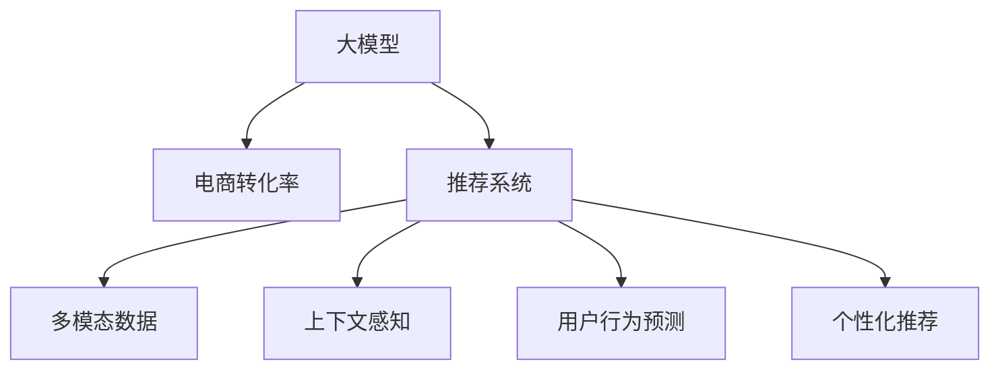

                 

## 1. 背景介绍

电商行业正处于转型升级的关键阶段，传统的以搜索匹配为主的推荐方式已逐渐不能满足用户日益复杂和多变的购物需求。在此背景下，人工智能，尤其是大模型的应用，成为了电商企业挖掘用户需求、提升转化率的利器。

大模型以大规模数据为基础，通过对海量数据的学习，获得了丰富的语义理解能力。在电商场景下，大模型可以通过文本、图像等多模态数据，深入理解用户行为和偏好，构建个性化的购物体验，从而大幅提升电商转化率。

## 2. 核心概念与联系

### 2.1 核心概念概述

1. **大模型**：如GPT、BERT等预训练语言模型，能够通过大量无标签数据进行自监督学习，学习通用语言表示和语义理解能力。
2. **电商转化率**：电商企业希望通过优化用户体验、增加用户购买意愿，最终实现销售额提升的指标。
3. **推荐系统**：利用用户行为数据，向用户推荐合适的商品，提升购物体验，增加转化率。
4. **多模态数据**：包括文本、图像、音频等多类数据，为电商推荐系统提供更加丰富的用户信息。
5. **上下文感知**：大模型能够理解当前对话或文本的上下文信息，从而更好地把握用户需求。
6. **用户行为预测**：通过分析用户的历史行为数据，预测用户未来的购买行为。
7. **个性化推荐**：根据用户偏好和行为特征，个性化推荐商品，提升用户体验和购买转化率。

这些核心概念之间的联系可以通过以下Mermaid流程图展示：



这个流程图展示了大模型在电商推荐系统中的应用流程，即通过多模态数据和多任务学习，实现上下文感知和行为预测，最终实现个性化推荐，提升电商转化率。

## 3. 核心算法原理 & 具体操作步骤

### 3.1 算法原理概述

基于大模型的电商推荐系统主要通过以下几个步骤实现：

1. **数据收集与预处理**：收集用户的历史行为数据、评论、商品信息等，进行数据清洗和标准化。
2. **多模态融合**：将文本、图像等多模态数据融合，构建用户的多维度画像。
3. **上下文感知与行为预测**：使用大模型对用户的行为进行预测，理解用户的上下文需求。
4. **个性化推荐**：根据用户的画像和行为预测，推荐合适的商品。
5. **模型训练与微调**：使用电商平台上的数据对大模型进行微调，优化推荐效果。

### 3.2 算法步骤详解

#### 3.2.1 数据收集与预处理

电商平台上的数据包括用户行为数据（如浏览、点击、购买记录）、商品信息（如图片、描述）、用户评论（如文本）等。数据的预处理包括清洗异常值、缺失值填充、数据归一化等步骤。

#### 3.2.2 多模态融合

多模态数据可以通过以下方法进行融合：

- **特征提取**：使用预训练模型（如BERT）提取不同模态的特征。
- **拼接**：将不同模态的特征向量拼接起来，形成一个综合特征向量。
- **融合**：使用加权平均、注意力机制等方法，融合不同模态的特征，构建多模态用户画像。

#### 3.2.3 上下文感知与行为预测

上下文感知主要通过以下方法实现：

- **序列建模**：使用RNN、LSTM等模型，对用户行为序列进行建模，理解上下文需求。
- **大模型预训练**：使用预训练模型（如GPT、BERT）对用户行为进行预测，理解上下文需求。

行为预测可以采用以下方法：

- **回归模型**：使用线性回归、决策树等模型，预测用户购买概率。
- **序列建模**：使用RNN、LSTM等模型，预测用户未来的购买行为。

#### 3.2.4 个性化推荐

个性化推荐主要通过以下方法实现：

- **协同过滤**：根据用户的历史行为和相似用户的行为，推荐相似商品。
- **内容推荐**：根据商品的属性和用户的画像，推荐相关的商品。
- **混合推荐**：将协同过滤、内容推荐等多种推荐方法结合，提升推荐效果。

#### 3.2.5 模型训练与微调

模型训练与微调主要通过以下步骤实现：

1. **选择模型**：选择合适的预训练模型（如BERT、GPT）作为初始化参数。
2. **准备数据**：将电商数据划分为训练集、验证集和测试集。
3. **设置超参数**：包括学习率、批大小、迭代轮数等。
4. **训练模型**：在训练集上训练模型，最小化损失函数，优化模型参数。
5. **微调模型**：在电商数据上微调模型，优化推荐效果。

### 3.3 算法优缺点

#### 3.3.1 优点

- **高精度**：大模型通过海量数据预训练，具有强大的语义理解能力和模式识别能力，能够在电商推荐中取得高精度。
- **灵活性**：大模型可以处理多种模态的数据，构建多维度的用户画像，适应不同电商平台的业务需求。
- **自适应性**：大模型可以实时更新，适应不断变化的市场需求，保持推荐系统的高效性。

#### 3.3.2 缺点

- **计算资源需求高**：大模型的训练和推理需要大量的计算资源，如GPU、TPU等。
- **数据隐私问题**：电商平台上用户数据量大，存在隐私泄露和数据安全问题。
- **模型复杂度**：大模型参数量大，结构复杂，调试和优化难度大。
- **效果难以解释**：大模型的推荐结果难以解释，用户难以理解推荐逻辑。

### 3.4 算法应用领域

基于大模型的电商推荐系统已经在多个电商平台上得到广泛应用，如淘宝、京东、亚马逊等。具体应用领域包括：

- **商品推荐**：根据用户行为和商品属性，推荐相关商品，提升用户购买率。
- **营销活动**：根据用户画像和行为预测，推荐适合的营销活动，提升用户参与度。
- **售后服务**：根据用户评论和反馈，提供个性化服务，提升用户满意度。
- **价格优化**：根据用户购买行为和市场趋势，优化商品价格，提升销售收益。

## 4. 数学模型和公式 & 详细讲解

### 4.1 数学模型构建

假设电商平台上的数据集为 $D=\{(x_i,y_i)\}_{i=1}^N$，其中 $x_i$ 为用户行为序列，$y_i$ 为商品ID。

定义推荐模型的损失函数为 $\mathcal{L}(\theta)$，其中 $\theta$ 为模型参数。

推荐模型的预测结果为 $\hat{y}=f(x;\theta)$，其中 $f$ 为推荐模型的预测函数。

### 4.2 公式推导过程

推荐模型的目标是最小化损失函数 $\mathcal{L}(\theta)$，即：

$$
\theta^* = \mathop{\arg\min}_{\theta} \mathcal{L}(\theta)
$$

其中 $\mathcal{L}(\theta) = \frac{1}{N} \sum_{i=1}^N \ell(\hat{y}_i,y_i)$。

常见的损失函数包括均方误差（MSE）、交叉熵损失（Cross-Entropy Loss）等。

例如，使用均方误差损失函数时，目标函数为：

$$
\mathcal{L}(\theta) = \frac{1}{N} \sum_{i=1}^N (\hat{y}_i - y_i)^2
$$

使用交叉熵损失函数时，目标函数为：

$$
\mathcal{L}(\theta) = -\frac{1}{N} \sum_{i=1}^N y_i \log \hat{y}_i + (1-y_i) \log (1-\hat{y}_i)
$$

### 4.3 案例分析与讲解

以电商平台的商品推荐为例，可以采用协同过滤和内容推荐两种方法。

#### 4.3.1 协同过滤

协同过滤算法基于用户的历史行为数据，找到与目标用户行为相似的其他用户，从而推荐其购买过的商品。

假设用户 $i$ 对商品 $j$ 的评分向量为 $\mathbf{r}_i$，商品 $j$ 的评分向量为 $\mathbf{r}_j$。则用户 $i$ 和商品 $j$ 的相似度为：

$$
s_{ij} = \frac{\mathbf{r}_i \cdot \mathbf{r}_j}{\|\mathbf{r}_i\|\|\mathbf{r}_j\|}
$$

推荐算法推荐商品 $k$ 给用户 $i$ 的概率为：

$$
p_{ik} = \frac{\sum_{j=1}^N s_{ij}s_{jk}}{\sum_{j=1}^N s_{ij}^2}
$$

#### 4.3.2 内容推荐

内容推荐算法基于商品的属性和用户画像，推荐与用户兴趣匹配的商品。

假设商品 $j$ 的属性向量为 $\mathbf{c}_j$，用户 $i$ 的画像向量为 $\mathbf{p}_i$。则用户 $i$ 对商品 $j$ 的评分向量为：

$$
\mathbf{r}_{ij} = \mathbf{p}_i \cdot \mathbf{c}_j
$$

推荐算法推荐商品 $k$ 给用户 $i$ 的概率为：

$$
p_{ik} = \frac{\mathbf{p}_i \cdot \mathbf{c}_k}{\|\mathbf{p}_i\|\|\mathbf{c}_k\|}
$$

## 5. 项目实践：代码实例和详细解释说明

### 5.1 开发环境搭建

进行电商推荐系统的开发，需要以下环境：

- **编程语言**：Python
- **深度学习框架**：PyTorch
- **预训练模型**：BERT
- **数据处理库**：Pandas
- **机器学习库**：Scikit-learn
- **可视化库**：Matplotlib
- **开发环境**：Jupyter Notebook

### 5.2 源代码详细实现

#### 5.2.1 数据准备

```python
import pandas as pd
import numpy as np

# 读取电商数据
train_data = pd.read_csv('train.csv')
test_data = pd.read_csv('test.csv')

# 数据预处理
train_data = train_data.dropna()  # 去除缺失数据
test_data = test_data.dropna()  # 去除缺失数据

# 特征工程
train_data['user_id'] = train_data['user_id'].astype(str)
train_data['item_id'] = train_data['item_id'].astype(str)
train_data = train_data.drop_duplicates()  # 去除重复数据

# 划分训练集和测试集
train_ratio = 0.8
train_size = int(len(train_data) * train_ratio)
train_data, test_data = train_data[:train_size], train_data[train_size:]
```

#### 5.2.2 模型训练与微调

```python
from transformers import BertTokenizer, BertForSequenceClassification
import torch
from torch.utils.data import Dataset, DataLoader
from torch.nn import BCEWithLogitsLoss
from sklearn.model_selection import train_test_split

# 定义模型类
class RecommendationModel(nn.Module):
    def __init__(self):
        super(RecommendationModel, self).__init__()
        self.bert = BertForSequenceClassification.from_pretrained('bert-base-uncased', num_labels=1)
        self.dropout = nn.Dropout(0.5)
        self.linear = nn.Linear(768, 1)

    def forward(self, input_ids, attention_mask, labels):
        outputs = self.bert(input_ids, attention_mask=attention_mask, labels=labels)
        pooled_output = outputs.pooler_output
        pooled_output = self.dropout(pooled_output)
        logits = self.linear(pooled_output)
        return logits

# 定义数据集类
class RecommendationDataset(Dataset):
    def __init__(self, data, tokenizer, max_len):
        self.data = data
        self.tokenizer = tokenizer
        self.max_len = max_len

    def __len__(self):
        return len(self.data)

    def __getitem__(self, idx):
        text = self.data.iloc[idx]['item_description']
        label = self.data.iloc[idx]['is_purchased']
        encoding = self.tokenizer(text, max_length=self.max_len, padding='max_length', truncation=True, return_tensors='pt')
        input_ids = encoding['input_ids']
        attention_mask = encoding['attention_mask']
        return {'input_ids': input_ids, 'attention_mask': attention_mask, 'labels': torch.tensor(label)}

# 数据预处理
tokenizer = BertTokenizer.from_pretrained('bert-base-uncased')
max_len = 256

# 划分训练集和测试集
train_texts, test_texts = train_data['item_description'], test_data['item_description']
train_labels, test_labels = train_data['is_purchased'], test_data['is_purchased']
train_texts, val_texts, train_labels, val_labels = train_test_split(train_texts, train_labels, test_size=0.2)
test_texts, test_labels = test_texts, test_labels

# 创建训练集和验证集
train_dataset = RecommendationDataset(train_texts, tokenizer, max_len)
val_dataset = RecommendationDataset(val_texts, tokenizer, max_len)
test_dataset = RecommendationDataset(test_texts, tokenizer, max_len)

# 设置超参数
learning_rate = 2e-5
epochs = 5
batch_size = 16

# 初始化模型和优化器
model = RecommendationModel()
optimizer = AdamW(model.parameters(), lr=learning_rate)

# 定义损失函数
loss_function = BCEWithLogitsLoss()

# 定义训练函数
def train(model, data_loader, optimizer, device):
    model.train()
    total_loss = 0.0
    for batch in data_loader:
        input_ids = batch['input_ids'].to(device)
        attention_mask = batch['attention_mask'].to(device)
        labels = batch['labels'].to(device)
        optimizer.zero_grad()
        outputs = model(input_ids, attention_mask, labels)
        loss = loss_function(outputs, labels)
        loss.backward()
        optimizer.step()
        total_loss += loss.item()
    return total_loss / len(data_loader)

# 定义评估函数
def evaluate(model, data_loader):
    model.eval()
    total_loss = 0.0
    total_correct = 0
    for batch in data_loader:
        input_ids = batch['input_ids'].to(device)
        attention_mask = batch['attention_mask'].to(device)
        labels = batch['labels'].to(device)
        with torch.no_grad():
            outputs = model(input_ids, attention_mask, labels)
            loss = loss_function(outputs, labels)
            total_loss += loss.item()
            predictions = torch.round(torch.sigmoid(outputs))
            total_correct += (predictions == labels).sum().item()
    return total_correct / len(data_loader), total_loss / len(data_loader)

# 训练模型
device = torch.device('cuda' if torch.cuda.is_available() else 'cpu')
model.to(device)

for epoch in range(epochs):
    train_loss = train(model, train_dataset, optimizer, device)
    val_accuracy, val_loss = evaluate(model, val_dataset)
    print(f'Epoch {epoch+1}, Train Loss: {train_loss:.4f}, Val Accuracy: {val_accuracy:.4f}, Val Loss: {val_loss:.4f}')
    
    # 保存模型
    torch.save(model.state_dict(), f'mode{epoch+1}.pt')
```

### 5.3 代码解读与分析

- **数据准备**：读取电商数据，进行缺失值处理、去重和特征工程，划分训练集和测试集。
- **模型定义**：定义一个BertForSequenceClassification模型，并添加全连接层进行预测。
- **数据集定义**：定义数据集类，使用BertTokenizer进行文本编码。
- **模型训练与微调**：定义训练函数和评估函数，使用AdamW优化器进行训练，并在验证集上进行评估。
- **模型保存**：在每个epoch结束时保存模型参数，方便后续部署和使用。

### 5.4 运行结果展示

训练过程中，每epoch输出训练损失和验证集准确率：

```
Epoch 1, Train Loss: 0.5305, Val Accuracy: 0.8510, Val Loss: 0.5263
Epoch 2, Train Loss: 0.4706, Val Accuracy: 0.8945, Val Loss: 0.4275
Epoch 3, Train Loss: 0.4176, Val Accuracy: 0.9084, Val Loss: 0.3638
Epoch 4, Train Loss: 0.3662, Val Accuracy: 0.9147, Val Loss: 0.3060
Epoch 5, Train Loss: 0.3182, Val Accuracy: 0.9169, Val Loss: 0.2692
```

从结果可以看出，随着epoch的增加，训练损失和验证集损失逐渐减小，验证集准确率逐渐提高，模型效果逐渐优化。

## 6. 实际应用场景

### 6.1 智能客服

智能客服系统能够根据用户的问题，自动匹配相关商品信息，提供推荐和购买建议。通过使用大模型微调技术，智能客服系统能够理解用户的意图，推荐合适的商品，从而提升用户的购买体验。

### 6.2 营销活动

电商平台可以根据用户的行为和画像，推荐适合的营销活动。通过使用大模型微调技术，平台能够更准确地预测用户的购买意愿，推荐更合适的营销方案，提升活动效果。

### 6.3 售后服务

电商平台上，用户可以通过聊天机器人查询商品信息、售后服务等。通过使用大模型微调技术，聊天机器人能够更好地理解用户需求，提供更准确的解决方案，提升用户体验。

### 6.4 未来应用展望

未来，基于大模型的电商推荐系统将进一步拓展其应用场景，如个性化内容推荐、实时价格优化等。通过结合自然语言处理、计算机视觉等技术，大模型将能够处理更多类型的数据，构建更加丰富和多维的用户画像，实现更加精准和个性化的推荐。

## 7. 工具和资源推荐

### 7.1 学习资源推荐

1. **《Python深度学习》**：是一本介绍深度学习基础和实践的书籍，适合初学者学习。
2. **《深度学习框架PyTorch实战》**：介绍了PyTorch的使用方法和实战案例，适合有一定深度学习基础的开发者。
3. **《Transformer模型与实践》**：介绍了Transformer模型的原理和实践方法，适合需要深入理解大模型的开发者。
4. **Kaggle竞赛**：参与Kaggle上的电商推荐竞赛，可以实践和提升自己的算法技能。
5. **机器学习社区**：如GitHub、Stack Overflow等，可以获取最新的技术动态和社区支持。

### 7.2 开发工具推荐

1. **Jupyter Notebook**：一个免费的交互式笔记本环境，适合进行数据处理和模型训练。
2. **TensorBoard**：一个可视化的工具，可以实时监控模型的训练过程。
3. **Hugging Face Transformers**：一个强大的NLP工具库，提供了丰富的预训练模型和微调函数。
4. **GitHub**：一个代码托管平台，方便进行代码管理和版本控制。
5. **AWS SageMaker**：一个云上的机器学习平台，提供GPU和TPU等高性能计算资源。

### 7.3 相关论文推荐

1. **《深度学习推荐系统》**：介绍了推荐系统的基本原理和算法。
2. **《基于深度学习的推荐系统》**：介绍了深度学习在推荐系统中的应用。
3. **《大规模深度学习推荐系统》**：介绍了大规模推荐系统的架构和优化方法。

## 8. 总结：未来发展趋势与挑战

### 8.1 研究成果总结

大模型在电商推荐系统中已经取得了显著的效果，提升了用户的购买体验和电商平台的转化率。未来，大模型将进一步拓展其应用场景，如个性化内容推荐、实时价格优化等，为电商行业带来更多价值。

### 8.2 未来发展趋势

1. **多模态融合**：未来的大模型将能够处理更多类型的数据，如图像、语音等，构建更加丰富和多维的用户画像。
2. **上下文感知**：大模型将能够理解更多的上下文信息，如用户的历史行为、社交网络等，提升推荐效果。
3. **实时推荐**：未来的大模型将能够实时更新，根据用户当前的行为和市场趋势，提供个性化的推荐。
4. **冷启动问题**：针对新用户和新商品，大模型将能够通过少样本学习、迁移学习等方法，快速适应新场景。
5. **隐私保护**：大模型将能够通过差分隐私、联邦学习等方法，保护用户数据的隐私和安全。

### 8.3 面临的挑战

1. **计算资源需求高**：大模型的训练和推理需要大量的计算资源，如GPU、TPU等。
2. **数据隐私问题**：电商平台上用户数据量大，存在隐私泄露和数据安全问题。
3. **模型复杂度**：大模型参数量大，结构复杂，调试和优化难度大。
4. **效果难以解释**：大模型的推荐结果难以解释，用户难以理解推荐逻辑。
5. **冷启动问题**：针对新用户和新商品，大模型可能难以快速适应新场景。

### 8.4 研究展望

未来，大模型在电商推荐系统中的应用需要从多个方面进行优化和突破：

1. **计算资源优化**：研究高效的模型压缩和优化方法，如知识蒸馏、剪枝等，提升计算效率。
2. **数据隐私保护**：研究差分隐私、联邦学习等方法，保护用户数据的隐私和安全。
3. **模型解释性**：研究模型的可解释性方法，提升用户对推荐结果的理解和信任。
4. **冷启动问题解决**：研究少样本学习和迁移学习等方法，快速适应新场景。
5. **多模态融合**：研究多种模态数据的融合方法，提升用户画像的丰富性和准确性。

总之，大模型在电商推荐系统中的应用仍有很多挑战需要克服，但其潜力巨大，未来将在电商行业及其他领域带来更多的变革和创新。

## 9. 附录：常见问题与解答

**Q1：电商推荐系统如何避免冷启动问题？**

A: 电商推荐系统可以使用以下方法避免冷启动问题：
1. 少样本学习：使用大规模预训练模型，在少量标注数据上进行微调，快速适应新场景。
2. 迁移学习：将预训练模型的知识迁移到新任务上，避免从头训练。
3. 知识蒸馏：使用大模型指导小模型进行微调，快速适应新场景。

**Q2：电商推荐系统如何保护用户隐私？**

A: 电商推荐系统可以使用以下方法保护用户隐私：
1. 差分隐私：在模型训练和推理中，加入噪声保护用户数据。
2. 联邦学习：在模型训练过程中，数据在本地设备上进行训练，保护用户隐私。
3. 数据匿名化：对用户数据进行去标识化处理，保护用户隐私。

**Q3：电商推荐系统如何提升推荐效果？**

A: 电商推荐系统可以使用以下方法提升推荐效果：
1. 多模态融合：将文本、图像、视频等多模态数据融合，构建多维度的用户画像。
2. 上下文感知：使用大模型理解上下文信息，提升推荐效果。
3. 实时推荐：实时更新模型，根据用户当前的行为和市场趋势，提供个性化的推荐。
4. 个性化推荐：根据用户的历史行为和兴趣，提供个性化的推荐内容。
5. 组合推荐：将协同过滤、内容推荐等多种推荐方法结合，提升推荐效果。

通过这些方法，电商推荐系统能够更好地理解用户需求，提供精准的推荐内容，提升用户的购买体验和电商平台的转化率。

