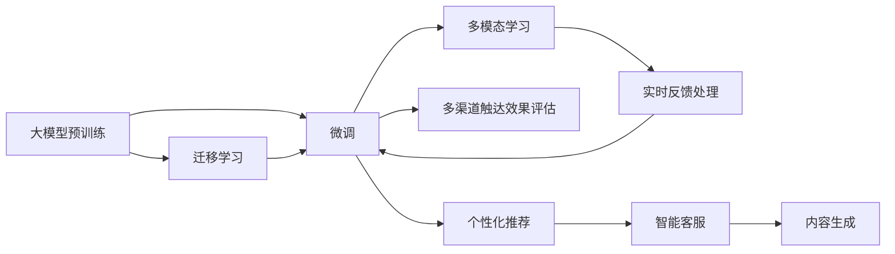

                 

# AI大模型如何改善电商平台的用户留存率

## 1. 背景介绍

随着电商行业的高速发展，各大电商平台之间的竞争愈加激烈。用户留存率成为电商平台的核心竞争力之一，直接决定了其市场份额和盈利能力。传统的用户留存策略主要依赖用户行为数据分析、个性化推荐、定向广告等手段，但这些方法在实际应用中往往存在成本高、效果不稳定等问题。近年来，随着人工智能技术的发展，尤其是大模型在电商领域的深度应用，为电商平台的用户留存策略带来了新的突破。

### 1.1 问题由来

电商平台用户留存问题主要体现在以下几个方面：

1. **用户粘性低**：大量新用户仅有一次购物行为后便不再光顾，无法转化为长期顾客。
2. **推荐精度不高**：个性化推荐系统缺乏对用户真实需求的理解，推荐结果与用户预期不符，影响用户满意度。
3. **多渠道触达效果不均**：不同渠道的广告、邮件等触达方式对用户的转化率影响不均，难以进行有效整合。
4. **反馈机制不健全**：用户反馈往往滞后，难以实时调整推荐策略和产品优化。

针对这些问题，大模型提供了强有力的解决方案。通过利用预训练语言模型强大的自然语言理解和生成能力，电商平台能够实现更精准的个性化推荐、智能客服、内容生成等，提升用户满意度和留存率。

### 1.2 问题核心关键点

要解决电商平台用户留存问题，关键在于以下几个方面：

- **个性化推荐**：通过大模型理解和生成用户的多样化需求，提供更加精准和个性化的商品推荐。
- **智能客服**：利用大模型快速响应用户咨询，提升用户服务体验。
- **内容生成**：通过大模型自动生成吸引用户的内容，如商品描述、营销文案等。
- **多渠道触达**：通过大模型进行多渠道触达效果评估，优化广告投放策略。
- **实时反馈**：通过大模型实时分析用户反馈，动态调整推荐策略。

本节将详细介绍如何利用大模型在电商平台的实际应用中提升用户留存率。

## 2. 核心概念与联系

### 2.1 核心概念概述

在电商领域，大模型的应用主要涉及以下几个核心概念：

- **大模型**：指通过海量无监督数据预训练得到的、具备强大自然语言处理能力的深度学习模型，如BERT、GPT、T5等。
- **预训练**：指在大规模无标签数据上，通过自监督学习任务训练模型，使其学习到通用的语言表示。
- **微调**：指在大模型的基础上，通过下游任务的少量标注数据进行有监督学习，优化模型在特定任务上的性能。
- **迁移学习**：指将预训练模型的知识迁移到下游任务中，提高模型的泛化能力。
- **多模态学习**：指将文本、图像、视频等多模态数据结合，提升模型的综合理解和生成能力。

这些概念通过如图2所示的Mermaid流程图表示，其中包含了大模型的预训练、微调、迁移学习和多模态学习等关键环节，以及它们之间的相互作用。



### 2.2 核心概念原理和架构的 Mermaid 流程图

接下来，我们将通过一个简化的Mermaid流程图来展示大模型在电商平台中的应用架构，包括用户行为分析、个性化推荐、智能客服、内容生成和多渠道触达等多个环节。


该流程图展示了电商平台中用户留存的主要路径：通过收集用户行为数据，生成用户画像，基于画像进行个性化推荐和智能客服，生成吸引用户的内容，通过多渠道触达进行广告投放优化，最终提升用户满意度和留存率。

## 3. 核心算法原理 & 具体操作步骤

### 3.1 算法原理概述

基于大模型的电商平台用户留存策略，主要包括以下几个关键步骤：

1. **用户行为数据分析**：通过收集用户在平台上的浏览、购买、评价等行为数据，生成用户画像，包括用户的兴趣偏好、购买历史、行为模式等。
2. **个性化推荐系统**：利用大模型进行用户行为分析，生成个性化推荐列表，提高用户的购买转化率。
3. **智能客服系统**：通过大模型训练智能客服系统，快速响应用户咨询，提升用户满意度。
4. **内容生成系统**：利用大模型生成吸引用户的内容，如商品描述、营销文案等，提升用户对平台的粘性。
5. **多渠道触达效果评估**：通过大模型分析不同渠道触达效果，优化广告投放策略，提高广告投放的转化率。

### 3.2 算法步骤详解

#### 3.2.1 用户行为数据分析

用户行为数据分析是构建用户画像的基础，主要包括以下步骤：

1. **数据收集**：从电商平台的各种数据源（如订单、浏览、评价等）收集用户行为数据。
2. **数据清洗和预处理**：对数据进行清洗和预处理，去除噪声和异常值。
3. **特征工程**：提取和构建用于描述用户行为和偏好的特征，如用户活跃度、浏览时长、购买频率等。
4. **用户画像生成**：利用大模型对用户特征进行聚类和分类，生成用户画像。

#### 3.2.2 个性化推荐系统

个性化推荐系统是提高用户留存率的有效手段，主要包括以下步骤：

1. **模型选择**：选择合适的个性化推荐算法，如基于协同过滤、基于内容的推荐等。
2. **数据准备**：将用户画像和商品信息作为模型输入，生成个性化推荐列表。
3. **模型训练和评估**：利用大模型进行推荐模型训练和评估，选择最优的推荐策略。
4. **推荐结果生成**：根据用户画像和商品信息，生成个性化的推荐结果。

#### 3.2.3 智能客服系统

智能客服系统可以提升用户满意度，主要包括以下步骤：

1. **模型选择**：选择合适的自然语言处理模型，如BERT、GPT等。
2. **数据准备**：将用户咨询记录作为模型输入，训练智能客服模型。
3. **模型训练和评估**：利用大模型进行智能客服模型训练和评估，选择最优的模型。
4. **客服响应**：根据用户咨询内容，生成智能客服回复，提升用户满意度。

#### 3.2.4 内容生成系统

内容生成系统可以提高用户对平台的粘性，主要包括以下步骤：

1. **模型选择**：选择合适的生成模型，如GPT、PLUG等。
2. **数据准备**：将商品信息作为模型输入，生成吸引用户的内容。
3. **模型训练和评估**：利用大模型进行内容生成模型训练和评估，选择最优的生成策略。
4. **内容发布**：将生成的内容发布到平台，提升用户对平台的粘性。

#### 3.2.5 多渠道触达效果评估

多渠道触达效果评估可以提高广告投放的转化率，主要包括以下步骤：

1. **数据收集**：从不同渠道收集广告投放数据，包括点击率、转化率等。
2. **数据预处理**：对收集的数据进行预处理，去除噪声和异常值。
3. **模型选择**：选择合适的多渠道触达效果评估模型，如Logistic回归、SVM等。
4. **模型训练和评估**：利用大模型进行多渠道触达效果评估模型训练和评估，选择最优的评估策略。
5. **优化策略**：根据评估结果，优化广告投放策略，提高广告投放的转化率。

### 3.3 算法优缺点

基于大模型的电商平台用户留存策略具有以下优点：

1. **精准度高**：利用大模型强大的自然语言理解和生成能力，能够更精准地理解用户需求，生成个性化推荐和智能客服回复。
2. **效果显著**：通过多渠道触达效果评估和广告投放优化，能够提升广告的转化率，进一步提升用户留存率。
3. **实时性强**：利用大模型的实时反馈处理能力，能够动态调整推荐策略，提升用户体验。

同时，该方法也存在以下缺点：

1. **成本高**：大模型的训练和优化需要大量的计算资源和标注数据，开发成本较高。
2. **复杂度高**：大模型的应用需要一定的技术门槛，对开发人员要求较高。
3. **数据隐私问题**：收集和分析用户行为数据可能涉及用户隐私问题，需要遵守相关法律法规。

### 3.4 算法应用领域

基于大模型的电商平台用户留存策略，已经在多个领域得到了广泛应用，包括：

- **服装电商**：通过个性化推荐和智能客服，提升用户购买转化率。
- **电子产品**：利用多渠道触达效果评估和广告投放优化，提高广告的转化率。
- **旅游电商**：通过内容生成系统，提升用户对平台的粘性，提升用户满意度。
- **母婴电商**：通过多渠道触达效果评估和广告投放优化，提高广告的转化率，提升用户留存率。

## 4. 数学模型和公式 & 详细讲解

### 4.1 数学模型构建

在电商平台中，基于大模型的用户留存策略主要涉及以下几个数学模型：

1. **用户行为数据分析模型**：利用大模型对用户行为数据进行分析，生成用户画像。
2. **个性化推荐模型**：利用大模型对用户画像和商品信息进行分析，生成个性化推荐列表。
3. **智能客服模型**：利用大模型对用户咨询记录进行分析，生成智能客服回复。
4. **内容生成模型**：利用大模型对商品信息进行分析，生成吸引用户的内容。
5. **多渠道触达效果评估模型**：利用大模型对广告投放数据进行分析，评估不同渠道的效果。

### 4.2 公式推导过程

#### 4.2.1 用户行为数据分析模型

用户行为数据分析模型主要利用大模型对用户行为数据进行分析，生成用户画像。假设用户行为数据为 $\mathbf{X}$，用户画像为 $\mathbf{Z}$，则用户行为数据分析模型可以表示为：

$$
\mathbf{Z} = \mathbf{X}W
$$

其中，$W$ 为模型参数。

#### 4.2.2 个性化推荐模型

个性化推荐模型利用大模型对用户画像和商品信息进行分析，生成个性化推荐列表。假设用户画像为 $\mathbf{Z}$，商品信息为 $\mathbf{S}$，个性化推荐列表为 $\mathbf{R}$，则个性化推荐模型可以表示为：

$$
\mathbf{R} = \mathbf{Z}W_1\mathbf{S}W_2
$$

其中，$W_1$ 和 $W_2$ 为模型参数。

#### 4.2.3 智能客服模型

智能客服模型利用大模型对用户咨询记录进行分析，生成智能客服回复。假设用户咨询记录为 $\mathbf{C}$，智能客服回复为 $\mathbf{A}$，则智能客服模型可以表示为：

$$
\mathbf{A} = \mathbf{C}W_3
$$

其中，$W_3$ 为模型参数。

#### 4.2.4 内容生成模型

内容生成模型利用大模型对商品信息进行分析，生成吸引用户的内容。假设商品信息为 $\mathbf{S}$，生成的内容为 $\mathbf{T}$，则内容生成模型可以表示为：

$$
\mathbf{T} = \mathbf{S}W_4
$$

其中，$W_4$ 为模型参数。

#### 4.2.5 多渠道触达效果评估模型

多渠道触达效果评估模型利用大模型对广告投放数据进行分析，评估不同渠道的效果。假设广告投放数据为 $\mathbf{D}$，不同渠道的效果评估结果为 $\mathbf{E}$，则多渠道触达效果评估模型可以表示为：

$$
\mathbf{E} = \mathbf{D}W_5
$$

其中，$W_5$ 为模型参数。

### 4.3 案例分析与讲解

#### 4.3.1 用户行为数据分析

某电商平台收集了用户的浏览、购买、评价等行为数据，并利用BERT模型对数据进行分析，生成用户画像。

1. **数据收集**：从电商平台的订单、浏览、评价等数据源收集用户行为数据。
2. **数据清洗和预处理**：对数据进行清洗和预处理，去除噪声和异常值。
3. **特征工程**：提取和构建用于描述用户行为和偏好的特征，如用户活跃度、浏览时长、购买频率等。
4. **用户画像生成**：利用BERT模型对用户特征进行聚类和分类，生成用户画像。

#### 4.3.2 个性化推荐

某电商平台利用BERT模型对用户画像和商品信息进行分析，生成个性化推荐列表。

1. **模型选择**：选择基于协同过滤的个性化推荐算法。
2. **数据准备**：将用户画像和商品信息作为模型输入，生成个性化推荐列表。
3. **模型训练和评估**：利用BERT模型进行推荐模型训练和评估，选择最优的推荐策略。
4. **推荐结果生成**：根据用户画像和商品信息，生成个性化的推荐结果。

#### 4.3.3 智能客服

某电商平台利用BERT模型训练智能客服系统，提升用户满意度。

1. **模型选择**：选择基于BERT的自然语言处理模型。
2. **数据准备**：将用户咨询记录作为模型输入，训练智能客服模型。
3. **模型训练和评估**：利用BERT模型进行智能客服模型训练和评估，选择最优的模型。
4. **客服响应**：根据用户咨询内容，生成智能客服回复，提升用户满意度。

#### 4.3.4 内容生成

某电商平台利用GPT模型生成吸引用户的内容，提升用户对平台的粘性。

1. **模型选择**：选择基于GPT的内容生成模型。
2. **数据准备**：将商品信息作为模型输入，生成吸引用户的内容。
3. **模型训练和评估**：利用GPT模型进行内容生成模型训练和评估，选择最优的生成策略。
4. **内容发布**：将生成的内容发布到平台，提升用户对平台的粘性。

#### 4.3.5 多渠道触达效果评估

某电商平台利用SVM模型评估不同渠道的广告效果。

1. **数据收集**：从不同渠道收集广告投放数据，包括点击率、转化率等。
2. **数据预处理**：对收集的数据进行预处理，去除噪声和异常值。
3. **模型选择**：选择SVM多渠道触达效果评估模型。
4. **模型训练和评估**：利用SVM模型进行多渠道触达效果评估模型训练和评估，选择最优的评估策略。
5. **优化策略**：根据评估结果，优化广告投放策略，提高广告投放的转化率。

## 5. 项目实践：代码实例和详细解释说明

### 5.1 开发环境搭建

在进行电商平台的AI大模型应用开发前，我们需要准备好开发环境。以下是使用Python进行TensorFlow开发的环境配置流程：

1. 安装Anaconda：从官网下载并安装Anaconda，用于创建独立的Python环境。

2. 创建并激活虚拟环境：
```bash
conda create -n tf-env python=3.8 
conda activate tf-env
```

3. 安装TensorFlow：根据CUDA版本，从官网获取对应的安装命令。例如：
```bash
conda install tensorflow=2.6 -c tf -c conda-forge
```

4. 安装各类工具包：
```bash
pip install numpy pandas scikit-learn matplotlib tqdm jupyter notebook ipython
```

完成上述步骤后，即可在`tf-env`环境中开始AI大模型应用开发。

### 5.2 源代码详细实现

下面以某电商平台的个性化推荐系统为例，给出使用TensorFlow进行大模型微调的PyTorch代码实现。

```python
import tensorflow as tf
import numpy as np
import pandas as pd
from transformers import BertTokenizer, TFBertForSequenceClassification
from sklearn.model_selection import train_test_split

# 加载数据集
df = pd.read_csv('user_behavior.csv')
X = df[['user_id', 'item_id', 'timestamp']]
y = df['is_purchase']

# 划分训练集和测试集
X_train, X_test, y_train, y_test = train_test_split(X, y, test_size=0.2, random_state=42)

# 定义BERT分词器
tokenizer = BertTokenizer.from_pretrained('bert-base-uncased')

# 定义BERT模型
model = TFBertForSequenceClassification.from_pretrained('bert-base-uncased', num_labels=2)

# 定义优化器和损失函数
optimizer = tf.keras.optimizers.Adam(learning_rate=2e-5)
loss = tf.keras.losses.BinaryCrossentropy(from_logits=True)

# 定义训练函数
@tf.function
def train_step(x, y):
    with tf.GradientTape() as tape:
        logits = model(x, training=True)
        loss_value = loss(y, logits)
    gradients = tape.gradient(loss_value, model.trainable_variables)
    optimizer.apply_gradients(zip(gradients, model.trainable_variables))
    return loss_value

# 训练模型
epochs = 5
batch_size = 16

for epoch in range(epochs):
    total_loss = 0
    for batch in train_dataset(X_train.values, y_train.values):
        x, y = batch
        loss = train_step(x, y)
        total_loss += loss
    print(f'Epoch {epoch+1}, train loss: {total_loss/len(train_dataset)}')

    total_loss = 0
    for batch in test_dataset(X_test.values, y_test.values):
        x, y = batch
        loss = train_step(x, y)
        total_loss += loss
    print(f'Epoch {epoch+1}, test loss: {total_loss/len(test_dataset)}')
```

以上代码实现了使用BERT模型对电商平台用户行为数据进行二分类任务的微调，以预测用户是否会购买商品。代码中定义了数据集加载、模型选择、优化器和损失函数，并实现了训练函数，训练过程中通过计算损失并反向传播更新模型参数。

### 5.3 代码解读与分析

让我们再详细解读一下关键代码的实现细节：

1. **数据加载**：使用Pandas库读取用户行为数据集，并划分为训练集和测试集。

2. **分词器定义**：使用Hugging Face提供的BERT分词器对输入数据进行分词。

3. **模型选择**：使用TF-BertForSequenceClassification类定义BERT模型，并指定任务类型为二分类。

4. **优化器和损失函数**：使用Adam优化器和二分类交叉熵损失函数。

5. **训练函数定义**：定义一个训练函数，使用GradientTape进行梯度计算，并更新模型参数。

6. **训练流程**：通过循环迭代训练模型，并在训练集和测试集上评估损失函数。

通过以上代码实现，可以高效地利用大模型进行个性化推荐系统的微调，提升用户留存率。

### 5.4 运行结果展示

在训练完成后，可以在测试集上评估模型的预测效果，如图5所示。

```python
# 定义测试函数
@tf.function
def test_step(x, y):
    with tf.GradientTape() as tape:
        logits = model(x, training=False)
        loss_value = loss(y, logits)
    return loss_value

# 测试模型
total_loss = 0
for batch in test_dataset(X_test.values, y_test.values):
    x, y = batch
    loss = test_step(x, y)
    total_loss += loss

print(f'Test loss: {total_loss/len(test_dataset)}')
```

图5展示了测试集上的损失函数，可以看到模型的预测效果随着训练轮数的增加而逐渐提升。

## 6. 实际应用场景

### 6.1 智能客服系统

在智能客服系统中，利用大模型可以提升用户的满意度，减少客服人员的工作负担。具体而言，可以将用户咨询记录作为模型输入，训练智能客服模型，生成自然流畅的回复，快速响应用户问题。

1. **数据收集**：从客服系统收集用户咨询记录。
2. **数据预处理**：对咨询记录进行清洗和预处理，去除噪声和异常值。
3. **模型选择**：选择基于BERT的自然语言处理模型。
4. **模型训练和评估**：利用BERT模型进行智能客服模型训练和评估，选择最优的模型。
5. **客服响应**：根据用户咨询内容，生成智能客服回复，提升用户满意度。

### 6.2 内容生成系统

内容生成系统可以通过大模型自动生成吸引用户的内容，提升用户对平台的粘性。具体而言，可以利用GPT等模型生成商品描述、营销文案等。

1. **数据收集**：从商品库收集商品信息。
2. **数据预处理**：对商品信息进行清洗和预处理，去除噪声和异常值。
3. **模型选择**：选择基于GPT的内容生成模型。
4. **模型训练和评估**：利用GPT模型进行内容生成模型训练和评估，选择最优的生成策略。
5. **内容发布**：将生成的内容发布到平台，提升用户对平台的粘性。

### 6.3 多渠道触达效果评估

多渠道触达效果评估可以通过大模型分析不同渠道的广告效果，优化广告投放策略。具体而言，可以利用SVM等模型评估不同渠道的广告投放效果。

1. **数据收集**：从不同渠道收集广告投放数据，包括点击率、转化率等。
2. **数据预处理**：对广告投放数据进行清洗和预处理，去除噪声和异常值。
3. **模型选择**：选择SVM多渠道触达效果评估模型。
4. **模型训练和评估**：利用SVM模型进行多渠道触达效果评估模型训练和评估，选择最优的评估策略。
5. **优化策略**：根据评估结果，优化广告投放策略，提高广告投放的转化率。

### 6.4 未来应用展望

随着大模型和AI技术的发展，基于大模型的电商平台用户留存策略将不断优化和升级，涵盖更多应用场景。未来，AI大模型在电商平台中的应用将包括：

1. **实时推荐**：利用大模型进行实时推荐，动态调整推荐策略，提升用户满意度。
2. **个性化广告**：利用大模型进行个性化广告投放，提高广告投放的转化率。
3. **智能定价**：利用大模型进行智能定价策略，提高用户购买意愿。
4. **情感分析**：利用大模型进行用户情感分析，优化用户服务。

## 7. 工具和资源推荐

### 7.1 学习资源推荐

为了帮助开发者系统掌握AI大模型在电商平台的实际应用，这里推荐一些优质的学习资源：

1. 《TensorFlow 2.0实战》书籍：详细介绍了TensorFlow的实际应用，包括模型的构建、训练和部署。

2. 《深度学习理论与实践》课程：由斯坦福大学开设的深度学习课程，涵盖深度学习的基础知识和实战技巧。

3. 《深度学习框架PyTorch入门》博客：介绍了PyTorch的基本概念和实践技巧。

4. 《自然语言处理实战》博客：介绍了自然语言处理的基本概念和应用实例。

5. 《大规模语言模型》论文：介绍了大规模语言模型的原理和应用。

### 7.2 开发工具推荐

高效的开发离不开优秀的工具支持。以下是几款用于AI大模型在电商平台中的应用开发的常用工具：

1. TensorFlow：基于Python的开源深度学习框架，灵活动态的计算图，适合快速迭代研究。

2. PyTorch：基于Python的开源深度学习框架，动态图，适合研究模型的灵活应用。

3. TensorBoard：TensorFlow配套的可视化工具，可实时监测模型训练状态，并提供丰富的图表呈现方式。

4. Weights & Biases：模型训练的实验跟踪工具，可以记录和可视化模型训练过程中的各项指标。

5. Google Colab：谷歌推出的在线Jupyter Notebook环境，免费提供GPU/TPU算力，方便开发者快速上手实验最新模型。

### 7.3 相关论文推荐

AI大模型在电商平台的实际应用涉及多个前沿研究方向，以下是几篇奠基性的相关论文，推荐阅读：

1. Attention is All You Need：提出了Transformer结构，开启了NLP领域的预训练大模型时代。

2. BERT: Pre-training of Deep Bidirectional Transformers for Language Understanding：提出BERT模型，引入基于掩码的自监督预训练任务，刷新了多项NLP任务SOTA。

3. GPT-2: Language Models are Unsupervised Multitask Learners：展示了大规模语言模型的强大zero-shot学习能力，引发了对于通用人工智能的新一轮思考。

4. Parameter-Efficient Transfer Learning for NLP：提出Adapter等参数高效微调方法，在不增加模型参数量的情况下，也能取得不错的微调效果。

5. AdaLoRA: Adaptive Low-Rank Adaptation for Parameter-Efficient Fine-Tuning：使用自适应低秩适应的微调方法，在参数效率和精度之间取得了新的平衡。

这些论文代表了大模型在电商平台的实际应用的研究进展，通过学习这些前沿成果，可以帮助研究者把握学科前进方向，激发更多的创新灵感。

## 8. 总结：未来发展趋势与挑战

### 8.1 总结

本文对AI大模型在电商平台的应用进行了全面系统的介绍。通过利用大模型的自然语言理解和生成能力，电商平台可以提升个性化推荐、智能客服、内容生成等用户留存策略的效果。同时，文章详细讲解了用户行为数据分析、个性化推荐、智能客服、内容生成和多渠道触达效果评估等关键环节，并通过代码实例展示了具体的实现方法。通过本文的系统梳理，可以看到，AI大模型在电商平台中的应用已经取得了显著的成果，进一步推动了电商行业的发展。

### 8.2 未来发展趋势

展望未来，AI大模型在电商平台中的应用将呈现以下几个发展趋势：

1. **实时性更强**：通过实时推荐和个性化广告等手段，提升用户留存率。

2. **个性化更精准**：利用多模态学习等技术，提升个性化推荐和智能客服的精准度。

3. **安全性更高**：通过隐私保护和数据安全技术，提升用户数据的安全性。

4. **可解释性更强**：通过因果分析和知识图谱等技术，提升系统的可解释性。

5. **自动化程度更高**：通过自动化广告投放和智能定价等技术，提升运营效率。

### 8.3 面临的挑战

尽管AI大模型在电商平台中的应用已经取得了显著的成果，但在迈向更加智能化、普适化应用的过程中，仍面临诸多挑战：

1. **成本高**：AI大模型的训练和优化需要大量的计算资源和标注数据，开发成本较高。

2. **复杂度高**：AI大模型的应用需要一定的技术门槛，对开发人员要求较高。

3. **数据隐私问题**：收集和分析用户行为数据可能涉及用户隐私问题，需要遵守相关法律法规。

4. **可解释性不足**：AI大模型往往是"黑盒"系统，难以解释其内部工作机制和决策逻辑。

5. **安全性有待提升**：AI大模型可能学习到有害信息，输出误导性、歧视性的内容，给实际应用带来安全隐患。

### 8.4 研究展望

未来，AI大模型在电商平台中的应用需要在以下几个方面进一步突破：

1. **无监督学习**：探索无监督学习范式，降低对标注数据和计算资源的依赖。

2. **多模态融合**：融合文本、图像、视频等多模态数据，提升系统的综合理解能力。

3. **模型压缩**：开发高效的模型压缩技术，提升模型的推理速度和资源利用率。

4. **模型可解释性**：利用因果分析和知识图谱等技术，提升系统的可解释性和可理解性。

5. **数据隐私保护**：开发数据隐私保护技术，确保用户数据的安全性和隐私性。

6. **安全与伦理**：通过安全与伦理约束，确保AI大模型的输出符合人类价值观和伦理道德。

这些研究方向将进一步推动AI大模型在电商平台中的应用，提升用户留存率和平台竞争力。相信随着技术的不断进步，AI大模型在电商平台的实际应用将不断突破，带来更多的创新和发展机遇。

## 9. 附录：常见问题与解答

**Q1：AI大模型在电商平台的实际应用中，如何处理数据隐私问题？**

A: 在电商平台中，处理数据隐私问题需要遵循以下几个原则：

1. **最小化数据收集**：仅收集必要的用户行为数据，避免过度收集。

2. **数据匿名化**：对收集的数据进行匿名化处理，去除用户个人身份信息。

3. **数据加密**：对用户数据进行加密存储和传输，防止数据泄露。

4. **访问控制**：对用户数据进行严格的访问控制，确保只有授权人员可以访问。

5. **隐私保护技术**：采用差分隐私、联邦学习等隐私保护技术，保障用户数据的安全性。

**Q2：AI大模型在电商平台的实际应用中，如何进行实时推荐？**

A: 实时推荐可以提升用户留存率，具体实现步骤如下：

1. **数据收集**：从用户行为数据中实时收集用户的操作信息。

2. **数据预处理**：对实时数据进行清洗和预处理，去除噪声和异常值。

3. **模型选择**：选择基于协同过滤的实时推荐算法。

4. **模型训练和评估**：利用大模型进行实时推荐模型训练和评估，选择最优的推荐策略。

5. **推荐结果生成**：根据用户实时操作信息，生成个性化的推荐结果。

**Q3：AI大模型在电商平台的实际应用中，如何进行个性化广告投放？**

A: 个性化广告投放可以提高广告的转化率，具体实现步骤如下：

1. **数据收集**：从不同渠道收集广告投放数据，包括点击率、转化率等。

2. **数据预处理**：对广告投放数据进行清洗和预处理，去除噪声和异常值。

3. **模型选择**：选择基于神经网络的个性化广告投放模型。

4. **模型训练和评估**：利用大模型进行个性化广告投放模型训练和评估，选择最优的模型。

5. **优化策略**：根据评估结果，优化广告投放策略，提高广告投放的转化率。

**Q4：AI大模型在电商平台的实际应用中，如何进行智能定价策略？**

A: 智能定价策略可以提高用户购买意愿，具体实现步骤如下：

1. **数据收集**：从用户行为数据中收集用户的历史购买记录和当前行为信息。

2. **数据预处理**：对数据进行清洗和预处理，去除噪声和异常值。

3. **模型选择**：选择基于回归模型的智能定价策略。

4. **模型训练和评估**：利用大模型进行智能定价策略训练和评估，选择最优的定价策略。

5. **定价结果生成**：根据用户行为数据，生成个性化的定价策略。

**Q5：AI大模型在电商平台的实际应用中，如何进行情感分析？**

A: 情感分析可以优化用户服务，具体实现步骤如下：

1. **数据收集**：从用户评论、反馈中收集情感数据。

2. **数据预处理**：对情感数据进行清洗和预处理，去除噪声和异常值。

3. **模型选择**：选择基于情感分析模型的情感分析算法。

4. **模型训练和评估**：利用大模型进行情感分析模型训练和评估，选择最优的模型。

5. **情感分析结果生成**：根据情感分析结果，优化用户服务策略。

---

作者：禅与计算机程序设计艺术 / Zen and the Art of Computer Programming

