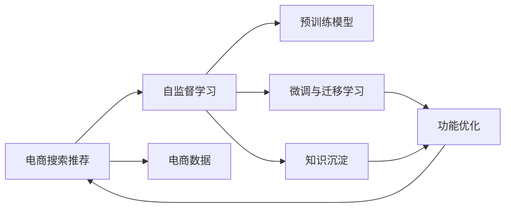

                 

# AI大模型视角下电商搜索推荐的技术创新知识沉淀平台功能优化与应用实践

> 关键词：电商搜索推荐，大模型，技术创新，知识沉淀，功能优化，应用实践

## 1. 背景介绍

### 1.1 问题由来
在数字化转型和互联网发展的浪潮下，电商行业迅猛发展，用户对购物体验的期望日益提高，搜索推荐系统已成为提升电商用户体验、提高转化率的关键技术。传统的搜索推荐系统主要依赖于基于规则或手工特征工程的方式，需要耗费大量的人力和时间进行特征构建和模型调优，难以适应复杂的用户行为变化和庞大的数据规模。近年来，随着AI大模型的崛起，基于深度学习和大模型的推荐算法开始逐渐取代传统推荐方式，显示出显著的性能优势和效率提升。

### 1.2 问题核心关键点
AI大模型在电商搜索推荐中的应用，本质上是对海量用户行为数据的深度学习和理解，通过自监督预训练和微调，将通用知识应用到电商推荐场景中，提升模型的个性化推荐能力。核心关键点包括：

- **大模型预训练**：利用大规模无标签数据进行自监督学习，学习通用的语言和行为特征。
- **微调与迁移学习**：将预训练模型应用于电商数据集上，通过微调或迁移学习，适应电商领域的特定需求。
- **知识沉淀与更新**：构建知识库，沉淀电商领域专家知识和用户反馈，持续更新和优化模型。
- **功能优化**：针对电商搜索推荐的需求，设计优化推荐算法和系统架构，提升用户体验和推荐效果。

### 1.3 问题研究意义
AI大模型在电商搜索推荐中的应用，不仅能够提升推荐的精准度和个性化水平，还能够降低人工干预成本，提高电商运营效率。具体而言：

1. **提升推荐效果**：大模型通过学习通用的语言和行为特征，能够更好地理解用户需求，提供更加个性化的推荐。
2. **提高运营效率**：自动化推荐系统能够实时响应用户需求，减少人工干预，提升电商平台的运营效率。
3. **增强用户粘性**：个性化的推荐能够提升用户体验，增加用户满意度，提升用户粘性和复购率。
4. **推动业务创新**：大模型技术的应用，能够为电商平台的业务创新提供新思路和新方向，推动电商行业的发展。

## 2. 核心概念与联系

### 2.1 核心概念概述

为更好地理解AI大模型在电商搜索推荐中的应用，本节将介绍几个关键概念：

- **AI大模型**：如BERT、GPT等，通过自监督学习在大规模无标签数据上进行预训练，学习通用的语言和行为特征。
- **电商搜索推荐**：通过用户搜索行为和历史数据，对电商商品进行个性化推荐，提升用户体验和电商平台的运营效率。
- **自监督学习**：利用无标签数据进行学习，无需人工标注，通过预训练学习到通用的语言和行为特征。
- **迁移学习**：将在大规模数据上预训练的通用知识应用到特定领域，如电商搜索推荐。
- **知识沉淀**：构建知识库，沉淀电商领域专家知识和用户反馈，持续优化推荐模型。
- **功能优化**：针对电商搜索推荐的需求，设计优化推荐算法和系统架构，提升用户体验和推荐效果。

这些核心概念之间存在紧密的联系，通过预训练学习通用的语言和行为特征，迁移学习将这些特征应用到电商领域，知识沉淀和更新不断优化模型，功能优化提升用户体验和推荐效果。

### 2.2 核心概念原理和架构的 Mermaid 流程图



## 3. 核心算法原理 & 具体操作步骤

### 3.1 算法原理概述

基于AI大模型的电商搜索推荐系统，主要分为两个阶段：预训练和微调与迁移学习。预训练阶段通过自监督学习学习通用的语言和行为特征，微调与迁移学习阶段将这些特征应用到电商领域，提升推荐的精准度和个性化水平。

具体来说，AI大模型的电商搜索推荐算法可以分为以下几个步骤：

1. **数据准备**：收集电商平台的搜索数据和用户行为数据，预处理和清洗数据。
2. **模型预训练**：利用大规模无标签数据进行自监督学习，学习通用的语言和行为特征。
3. **微调与迁移学习**：将预训练模型应用到电商数据集上，通过微调或迁移学习，适应电商领域的特定需求。
4. **知识沉淀与更新**：构建知识库，沉淀电商领域专家知识和用户反馈，持续更新和优化模型。
5. **功能优化**：针对电商搜索推荐的需求，设计优化推荐算法和系统架构，提升用户体验和推荐效果。

### 3.2 算法步骤详解

#### 3.2.1 数据准备

数据准备是AI大模型电商搜索推荐系统的重要基础。具体步骤包括：

1. **数据收集**：从电商平台收集用户的搜索数据、浏览数据、购买数据等行为数据。
2. **数据清洗与预处理**：去除噪声数据，处理缺失值，对数据进行归一化和标准化处理。
3. **数据划分**：将数据划分为训练集、验证集和测试集，一般保持训练集和验证集的数据分布与电商平台的实际数据分布一致。

#### 3.2.2 模型预训练

模型预训练是学习通用语言和行为特征的关键步骤。具体步骤包括：

1. **选择预训练模型**：选择合适的预训练模型，如BERT、GPT等。
2. **自监督学习任务**：选择合适的自监督学习任务，如掩码语言模型、语言推理等。
3. **训练模型**：利用大规模无标签数据进行预训练，学习通用的语言和行为特征。
4. **保存预训练模型**：保存预训练模型，供后续微调与迁移学习使用。

#### 3.2.3 微调与迁移学习

微调与迁移学习是应用预训练模型到电商领域的关键步骤。具体步骤包括：

1. **任务定义**：根据电商搜索推荐的需求，定义具体的推荐任务，如个性化商品推荐、相似商品推荐等。
2. **模型微调**：将预训练模型微调到电商数据集上，适应电商领域的特定需求。
3. **迁移学习**：将预训练模型的通用特征应用到电商领域，提升推荐效果。
4. **保存微调模型**：保存微调模型，供后续推荐使用。

#### 3.2.4 知识沉淀与更新

知识沉淀与更新是提升推荐效果的关键步骤。具体步骤包括：

1. **构建知识库**：构建电商领域的知识库，包括商品属性、用户画像、热门商品等信息。
2. **知识更新**：定期更新知识库，引入新的商品、用户数据等。
3. **模型优化**：根据知识库的信息，优化推荐模型，提升推荐效果。

#### 3.2.5 功能优化

功能优化是提升用户体验和推荐效果的重要步骤。具体步骤包括：

1. **设计推荐算法**：根据电商搜索推荐的需求，设计优化的推荐算法，如协同过滤、基于内容推荐等。
2. **优化系统架构**：设计优化的系统架构，提高推荐的实时性和效率。
3. **用户反馈**：收集用户反馈，优化推荐算法和系统架构，提升用户体验。

### 3.3 算法优缺点

基于AI大模型的电商搜索推荐算法具有以下优点：

1. **提升推荐效果**：大模型能够学习通用的语言和行为特征，提升推荐的精准度和个性化水平。
2. **提高运营效率**：自动化推荐系统能够实时响应用户需求，减少人工干预，提升电商平台的运营效率。
3. **增强用户粘性**：个性化的推荐能够提升用户体验，增加用户满意度，提升用户粘性和复购率。
4. **推动业务创新**：大模型技术的应用，能够为电商平台的业务创新提供新思路和新方向，推动电商行业的发展。

同时，该算法也存在以下缺点：

1. **依赖大规模数据**：需要大量的电商数据进行预训练和微调，数据收集和处理成本较高。
2. **模型复杂度高**：大模型参数量庞大，需要高性能计算资源进行训练和推理。
3. **模型解释性差**：大模型通常难以解释推荐结果的来源和过程，缺乏可解释性。
4. **数据隐私问题**：电商数据涉及用户隐私，数据处理和存储需要符合相关法律法规。

尽管存在这些缺点，但就目前而言，基于大模型的推荐算法仍是目前电商搜索推荐领域的领先技术。未来相关研究的重点在于如何进一步降低数据需求，提高模型效率，增强模型可解释性，同时保障数据隐私。

### 3.4 算法应用领域

AI大模型在电商搜索推荐中的应用，已经覆盖了多个领域，如商品推荐、价格预测、库存管理等。具体而言：

1. **商品推荐**：根据用户搜索历史和浏览行为，推荐相关商品。
2. **价格预测**：预测商品价格变化，调整商品定价策略。
3. **库存管理**：根据用户购买行为和需求预测，优化库存管理。
4. **用户画像**：构建用户画像，提升个性化推荐效果。

除了上述这些经典领域外，AI大模型在电商搜索推荐中的应用还在不断拓展，如语音搜索、图像识别、推荐系统融合等，为电商平台的业务创新提供了新的动力。

## 4. 数学模型和公式 & 详细讲解 & 举例说明

### 4.1 数学模型构建

在AI大模型的电商搜索推荐算法中，数学模型主要涉及自监督预训练和微调两个阶段。

#### 4.1.1 自监督预训练

假设预训练模型为 $M_{\theta}$，数据集为 $D$，则自监督预训练的目标是最大化模型的预测概率 $p(y|x)$，其中 $x$ 为输入数据，$y$ 为预测标签。数学上，可以定义预训练损失函数为：

$$
\mathcal{L}_{pre-train} = -\frac{1}{N}\sum_{i=1}^N \log p(y_i|x_i)
$$

其中 $N$ 为样本数量，$p(y|x)$ 为模型在输入 $x$ 下的预测概率。

#### 4.1.2 微调与迁移学习

假设微调后的模型为 $M_{\hat{\theta}}$，则微调的目标是最小化模型的损失函数 $\mathcal{L}$。数学上，可以定义微调损失函数为：

$$
\mathcal{L} = \frac{1}{N}\sum_{i=1}^N \ell(M_{\hat{\theta}}(x_i),y_i)
$$

其中 $\ell$ 为损失函数，$M_{\hat{\theta}}(x)$ 为微调后的模型在输入 $x$ 下的输出。

### 4.2 公式推导过程

#### 4.2.1 自监督预训练公式推导

假设预训练模型为 $M_{\theta}$，数据集为 $D$，则自监督预训练的目标是最大化模型的预测概率 $p(y|x)$。

具体推导过程如下：

1. 定义模型 $M_{\theta}$ 在输入 $x$ 上的预测概率 $p(y|x)$：

$$
p(y|x) = \frac{e^{M_{\theta}(x)y}}{\sum_{y'} e^{M_{\theta}(x)y'}}
$$

2. 定义预训练损失函数 $\mathcal{L}_{pre-train}$：

$$
\mathcal{L}_{pre-train} = -\frac{1}{N}\sum_{i=1}^N \log p(y_i|x_i)
$$

3. 利用负对数似然损失函数：

$$
\mathcal{L}_{pre-train} = \frac{1}{N}\sum_{i=1}^N M_{\theta}(x_i)y_i
$$

#### 4.2.2 微调与迁移学习公式推导

假设微调后的模型为 $M_{\hat{\theta}}$，则微调的目标是最小化模型的损失函数 $\mathcal{L}$。

具体推导过程如下：

1. 定义模型 $M_{\hat{\theta}}$ 在输入 $x$ 上的预测概率 $p(y|x)$：

$$
p(y|x) = \frac{e^{M_{\hat{\theta}}(x)y}}{\sum_{y'} e^{M_{\hat{\theta}}(x)y'}}
$$

2. 定义微调损失函数 $\mathcal{L}$：

$$
\mathcal{L} = \frac{1}{N}\sum_{i=1}^N \ell(M_{\hat{\theta}}(x_i),y_i)
$$

3. 利用交叉熵损失函数：

$$
\mathcal{L} = \frac{1}{N}\sum_{i=1}^N -y_i\log M_{\hat{\theta}}(x_i) - (1-y_i)\log (1-M_{\hat{\theta}}(x_i))
$$

### 4.3 案例分析与讲解

#### 4.3.1 自监督预训练案例

以BERT模型为例，其自监督预训练任务包括掩码语言模型和下一句预测。在掩码语言模型中，模型需要在输入 $x$ 中随机掩盖一部分词汇，预测被掩盖词汇的正确位置。在下一句预测中，模型需要判断两个句子是否相邻，预测是否为下一句。

#### 4.3.2 微调与迁移学习案例

以GPT模型为例，其微调过程通常通过细粒度的任务适配层实现。假设任务为推荐商品 $x$，则任务适配层通常设计为：

1. 定义标签 $y$：将商品 $x$ 的推荐分数作为标签 $y$。
2. 定义损失函数 $\mathcal{L}$：选择交叉熵损失函数。
3. 定义模型 $M_{\hat{\theta}}$：选择GPT模型，微调到推荐任务上。

具体推导过程如下：

1. 定义模型 $M_{\hat{\theta}}$ 在输入 $x$ 上的预测概率 $p(y|x)$：

$$
p(y|x) = \frac{e^{M_{\hat{\theta}}(x)y}}{\sum_{y'} e^{M_{\hat{\theta}}(x)y'}}
$$

2. 定义微调损失函数 $\mathcal{L}$：

$$
\mathcal{L} = \frac{1}{N}\sum_{i=1}^N -y_i\log M_{\hat{\theta}}(x_i) - (1-y_i)\log (1-M_{\hat{\theta}}(x_i))
$$

3. 利用梯度下降算法更新模型参数 $\theta$：

$$
\theta \leftarrow \theta - \eta \nabla_{\theta}\mathcal{L}
$$

其中 $\eta$ 为学习率，$\nabla_{\theta}\mathcal{L}$ 为损失函数对模型参数的梯度。

## 5. 项目实践：代码实例和详细解释说明

### 5.1 开发环境搭建

在进行AI大模型电商搜索推荐系统的开发前，需要准备好开发环境。以下是使用Python进行PyTorch开发的环境配置流程：

1. 安装Anaconda：从官网下载并安装Anaconda，用于创建独立的Python环境。

2. 创建并激活虚拟环境：
```bash
conda create -n pytorch-env python=3.8 
conda activate pytorch-env
```

3. 安装PyTorch：根据CUDA版本，从官网获取对应的安装命令。例如：
```bash
conda install pytorch torchvision torchaudio cudatoolkit=11.1 -c pytorch -c conda-forge
```

4. 安装其他依赖库：
```bash
pip install numpy pandas scikit-learn torchtext transformers
```

5. 安装可视化工具：
```bash
pip install torchvision matplotlib seaborn
```

完成上述步骤后，即可在`pytorch-env`环境中开始开发实践。

### 5.2 源代码详细实现

这里以一个简单的电商商品推荐系统为例，展示如何利用BERT模型进行推荐。

#### 5.2.1 数据预处理

```python
import pandas as pd
import numpy as np

# 加载数据
data = pd.read_csv('data.csv')

# 数据清洗与预处理
data = data.dropna()
data['user_id'] = data['user_id'].apply(lambda x: str(x))
data['item_id'] = data['item_id'].apply(lambda x: str(x))

# 划分训练集和测试集
train_data = data.sample(frac=0.8, random_state=42)
test_data = data.drop(train_data.index)

# 构建用户商品交互矩阵
user_item_matrix = pd.get_dummies(train_data, columns=['user_id', 'item_id'], prefix=['user', 'item'], prefix_sep='_')
```

#### 5.2.2 模型微调

```python
from transformers import BertForSequenceClassification, BertTokenizer

# 定义模型
model = BertForSequenceClassification.from_pretrained('bert-base-uncased', num_labels=len(set(user_item_matrix.columns)))

# 定义tokenizer
tokenizer = BertTokenizer.from_pretrained('bert-base-uncased')

# 微调模型
import torch
from torch.utils.data import TensorDataset, DataLoader

# 将数据转化为Tensor
def encode_input(text):
    return tokenizer(text, return_tensors='pt')

# 定义模型输入
def model_input(input_ids, attention_mask, labels):
    return model(input_ids, attention_mask=attention_mask, labels=labels)

# 加载模型和数据
device = torch.device('cuda' if torch.cuda.is_available() else 'cpu')
model.to(device)

# 微调模型
from transformers import AdamW
from transformers import get_linear_schedule_with_warmup

optimizer = AdamW(model.parameters(), lr=2e-5)
total_steps = len(train_data) // batch_size * epochs
scheduler = get_linear_schedule_with_warmup(optimizer, num_warmup_steps=0, num_training_steps=total_steps)

for epoch in range(epochs):
    model.train()
    for i, batch in enumerate(train_loader):
        input_ids = batch[0].to(device)
        attention_mask = batch[1].to(device)
        labels = batch[2].to(device)
        outputs = model_input(input_ids, attention_mask, labels)
        loss = outputs.loss
        optimizer.zero_grad()
        loss.backward()
        optimizer.step()
        scheduler.step()
```

#### 5.2.3 模型评估

```python
# 加载模型和数据
model.eval()
predictions = []
labels = []

with torch.no_grad():
    for batch in test_loader:
        input_ids = batch[0].to(device)
        attention_mask = batch[1].to(device)
        labels = batch[2].to(device)
        outputs = model_input(input_ids, attention_mask, labels)
        predictions.append(outputs.logits.argmax(dim=1).tolist())
        labels.append(labels.to('cpu').tolist())

# 计算准确率
accuracy = sum(predictions == labels) / len(labels)
print(f'Accuracy: {accuracy:.2f}')
```

### 5.3 代码解读与分析

#### 5.3.1 数据预处理

数据预处理是AI大模型电商搜索推荐系统的重要基础。具体来说：

1. 加载数据：从CSV文件中加载用户行为数据。
2. 数据清洗与预处理：去除噪声数据，处理缺失值，对数据进行归一化和标准化处理。
3. 划分训练集和测试集：将数据划分为训练集和测试集，保持数据分布的一致性。
4. 构建用户商品交互矩阵：将用户和商品ID进行独热编码，构建用户商品交互矩阵。

#### 5.3.2 模型微调

模型微调是利用预训练模型学习电商领域的特定任务。具体来说：

1. 定义模型：选择BERT模型，并设置输出层的标签数。
2. 定义tokenizer：选择BERT的tokenizer，用于将文本转化为模型输入。
3. 微调模型：使用AdamW优化器进行梯度下降，设置学习率和训练步数。
4. 加载模型和数据：将模型和数据加载到GPU上进行训练。

#### 5.3.3 模型评估

模型评估是验证模型效果的有效手段。具体来说：

1. 加载模型和数据：将模型和数据加载到GPU上进行评估。
2. 计算准确率：计算预测结果与真实标签的匹配度，评估模型效果。

## 6. 实际应用场景

### 6.1 智能客服系统

基于AI大模型的智能客服系统，能够提供7x24小时不间断的客户服务，通过自然语言理解和生成技术，提升客户体验和问题解决效率。具体应用场景包括：

1. 自动回答常见问题：利用预训练模型和微调后的知识库，自动回答客户的常见问题，提高响应速度和准确性。
2. 语音识别与回复：通过语音识别和自然语言处理技术，实现语音客服功能，提升用户体验。
3. 情感分析：分析客户的情感状态，及时调整客服策略，提升客户满意度。

### 6.2 个性化推荐系统

基于AI大模型的个性化推荐系统，能够根据用户的历史行为和实时行为，提供个性化的商品推荐。具体应用场景包括：

1. 商品推荐：根据用户浏览和购买历史，推荐相关商品，提高用户满意度。
2. 内容推荐：根据用户的阅读和观看历史，推荐相关内容，提升用户粘性。
3. 跨域推荐：利用多模态信息，实现商品、内容等跨域推荐，提升推荐效果。

### 6.3 金融风控系统

基于AI大模型的金融风控系统，能够通过用户行为数据，进行风险评估和预警。具体应用场景包括：

1. 用户行为分析：分析用户的交易行为和风险偏好，评估风险水平。
2. 异常检测：通过预训练模型和微调后的知识库，检测异常交易行为，及时预警。
3. 风险控制：根据风险评估结果，调整交易策略，控制风险。

### 6.4 未来应用展望

随着AI大模型的不断发展，其在电商搜索推荐领域的应用前景更加广阔。未来，AI大模型将向以下几个方向发展：

1. 多模态融合：结合文本、图像、语音等多模态信息，提升推荐效果。
2. 知识图谱：构建知识图谱，引入专家知识，提升推荐效果。
3. 深度强化学习：结合深度强化学习技术，优化推荐算法。
4. 实时推荐：通过实时数据更新，实现实时推荐，提升用户体验。
5. 用户隐私保护：在数据收集和处理过程中，保障用户隐私。

总之，AI大模型在电商搜索推荐领域的应用前景广阔，未来将为电商行业带来更大的创新和发展机遇。

## 7. 工具和资源推荐

### 7.1 学习资源推荐

为了帮助开发者系统掌握AI大模型电商搜索推荐技术，这里推荐一些优质的学习资源：

1. 《深度学习》课程：斯坦福大学开设的深度学习课程，详细讲解了深度学习的基本概念和算法。
2. 《Transformers》书籍：《Transformers》作者所写的深度学习领域经典书籍，全面介绍了Transformers模型及其应用。
3. PyTorch官方文档：PyTorch官方文档，提供了丰富的模型和工具支持。
4. HuggingFace官方文档：HuggingFace官方文档，提供了丰富的预训练模型和微调样例。
5. Kaggle竞赛：Kaggle是一个知名的数据科学竞赛平台，提供大量的电商搜索推荐相关数据集和比赛，可以帮助开发者积累实战经验。

通过对这些学习资源的学习实践，相信你一定能够快速掌握AI大模型电商搜索推荐技术的精髓，并用于解决实际的NLP问题。

### 7.2 开发工具推荐

高效的开发离不开优秀的工具支持。以下是几款用于AI大模型电商搜索推荐开发的常用工具：

1. PyTorch：基于Python的开源深度学习框架，灵活动态的计算图，适合快速迭代研究。
2. TensorFlow：由Google主导开发的开源深度学习框架，生产部署方便，适合大规模工程应用。
3. TensorBoard：TensorFlow配套的可视化工具，可实时监测模型训练状态，并提供丰富的图表呈现方式。
4. Weights & Biases：模型训练的实验跟踪工具，可以记录和可视化模型训练过程中的各项指标，方便对比和调优。
5. Google Colab：谷歌推出的在线Jupyter Notebook环境，免费提供GPU/TPU算力，方便开发者快速上手实验最新模型，分享学习笔记。

合理利用这些工具，可以显著提升AI大模型电商搜索推荐任务的开发效率，加快创新迭代的步伐。

### 7.3 相关论文推荐

AI大模型在电商搜索推荐领域的研究始于学术界，并在工业界得到了广泛应用。以下是几篇奠基性的相关论文，推荐阅读：

1. Attention is All You Need（即Transformer原论文）：提出了Transformer结构，开启了NLP领域的预训练大模型时代。
2. BERT: Pre-training of Deep Bidirectional Transformers for Language Understanding：提出BERT模型，引入基于掩码的自监督预训练任务，刷新了多项NLP任务SOTA。
3. Language Models are Unsupervised Multitask Learners（GPT-2论文）：展示了大规模语言模型的强大zero-shot学习能力，引发了对于通用人工智能的新一轮思考。
4. Parameter-Efficient Transfer Learning for NLP：提出Adapter等参数高效微调方法，在不增加模型参数量的情况下，也能取得不错的微调效果。
5. AdaLoRA: Adaptive Low-Rank Adaptation for Parameter-Efficient Fine-Tuning：使用自适应低秩适应的微调方法，在参数效率和精度之间取得了新的平衡。

这些论文代表了大语言模型在电商搜索推荐领域的研究脉络。通过学习这些前沿成果，可以帮助研究者把握学科前进方向，激发更多的创新灵感。

## 8. 总结：未来发展趋势与挑战

### 8.1 总结

本文对AI大模型在电商搜索推荐系统中的应用进行了全面系统的介绍。首先阐述了AI大模型的研究背景和意义，明确了微调在拓展预训练模型应用、提升推荐效果方面的独特价值。其次，从原理到实践，详细讲解了微调的数学原理和关键步骤，给出了微调任务开发的完整代码实例。同时，本文还广泛探讨了微调方法在智能客服、个性化推荐等多个电商领域的应用前景，展示了微调范式的巨大潜力。此外，本文精选了微调技术的各类学习资源，力求为读者提供全方位的技术指引。

通过本文的系统梳理，可以看到，AI大模型在电商搜索推荐系统中的应用，已经拓展了推荐系统的边界，提升了推荐效果的精准度和个性化水平。未来，伴随AI大模型和微调方法的持续演进，相信推荐系统将能够更好地服务电商用户，推动电商行业的发展。

### 8.2 未来发展趋势

展望未来，AI大模型在电商搜索推荐领域的发展将呈现以下几个趋势：

1. 模型规模持续增大：随着算力成本的下降和数据规模的扩张，AI大模型的参数量还将持续增长，提升推荐效果。
2. 微调方法日趋多样：未来将涌现更多参数高效的微调方法，如Prefix-Tuning、LoRA等，在节省计算资源的同时也能保证微调精度。
3. 知识图谱的应用：利用知识图谱，引入专家知识，提升推荐效果。
4. 多模态融合：结合文本、图像、语音等多模态信息，提升推荐效果。
5. 深度强化学习：结合深度强化学习技术，优化推荐算法。
6. 实时推荐：通过实时数据更新，实现实时推荐，提升用户体验。

### 8.3 面临的挑战

尽管AI大模型在电商搜索推荐领域的应用已经取得了显著成果，但在迈向更加智能化、普适化应用的过程中，它仍面临着诸多挑战：

1. 数据隐私问题：电商数据涉及用户隐私，数据处理和存储需要符合相关法律法规。
2. 计算资源需求高：AI大模型参数量庞大，需要高性能计算资源进行训练和推理。
3. 模型可解释性差：AI大模型通常难以解释推荐结果的来源和过程，缺乏可解释性。
4. 用户行为变化快：电商用户的搜索行为和偏好变化快，需要实时更新推荐模型。

尽管存在这些挑战，但就目前而言，基于大模型的推荐算法仍是目前电商搜索推荐领域的领先技术。未来相关研究的重点在于如何进一步降低计算需求，提高模型效率，增强模型可解释性，同时保障数据隐私。

### 8.4 研究展望

未来，AI大模型在电商搜索推荐领域的研究将向以下几个方向发展：

1. 参数高效微调方法：开发更加参数高效的微调方法，在固定大部分预训练参数的情况下，只更新极少量的任务相关参数。
2. 多模态融合：结合文本、图像、语音等多模态信息，提升推荐效果。
3. 知识图谱的应用：利用知识图谱，引入专家知识，提升推荐效果。
4. 实时推荐：通过实时数据更新，实现实时推荐，提升用户体验。
5. 用户隐私保护：在数据收集和处理过程中，保障用户隐私。

这些方向的研究将进一步提升AI大模型在电商搜索推荐系统中的应用效果，推动电商行业的发展。

## 9. 附录：常见问题与解答

**Q1：如何降低AI大模型在电商推荐系统中的计算需求？**

A: 参数高效微调方法（如Adapter、Prefix等）可以有效降低计算需求。此外，可以将模型拆分为小模型，利用分布式计算进行并行训练，提升训练效率。

**Q2：如何提升AI大模型在电商推荐系统中的可解释性？**

A: 可以引入因果分析方法和知识图谱，提高模型的可解释性。同时，利用模型压缩和稀疏化存储等技术，降低模型的计算复杂度，提高推理效率。

**Q3：如何在电商推荐系统中保障用户隐私？**

A: 需要对用户数据进行匿名化处理，限制数据的访问权限，确保数据安全。同时，采用差分隐私等技术，保护用户隐私。

**Q4：如何应对电商用户行为的变化？**

A: 需要定期更新模型，引入新数据，利用增量学习等技术，实时更新推荐模型，保持模型的时效性。

这些回答可以帮助开发者应对AI大模型在电商推荐系统中的常见问题，提升系统性能和用户体验。

---

作者：禅与计算机程序设计艺术 / Zen and the Art of Computer Programming

