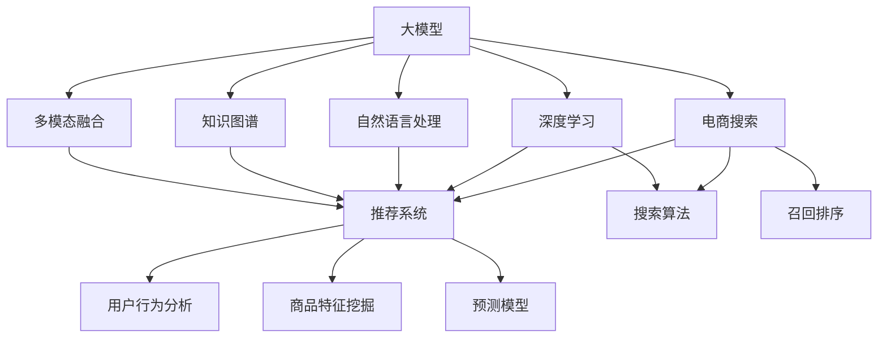

                 

# AI大模型视角下电商搜索推荐的技术创新知识沉淀平台搭建方案

> 关键词：大模型、电商搜索、推荐系统、技术沉淀、知识图谱、深度学习、自然语言处理、多模态融合

## 1. 背景介绍

随着人工智能技术的迅猛发展，大语言模型（Large Language Models, LLMs）和深度学习技术在电商搜索推荐系统中逐步崭露头角。这些技术能够分析大量用户行为数据，理解用户意图，提升个性化推荐体验，减少转化漏斗，从而为电商企业带来巨大的商业价值。然而，这些技术也带来了复杂性，需要企业构建技术沉淀平台，集成和整合各种技术，为企业的数字化转型提供技术保障。本文将基于大模型视角，介绍如何构建一个电商搜索推荐系统的技术沉淀平台，并分享一系列技术创新和知识管理的经验。

## 2. 核心概念与联系

### 2.1 核心概念概述

为更好地理解电商搜索推荐技术沉淀平台的构建，本节将介绍几个密切相关的核心概念：

- **大模型（Large Model）**：指使用深度学习技术训练的大型神经网络模型，通常具有数十亿甚至上百亿的参数规模，如GPT-3、BERT等。
- **电商搜索（E-commerce Search）**：指电商平台上帮助用户快速找到所需商品的技术系统，包括搜索算法、召回排序等。
- **推荐系统（Recommendation System）**：通过分析用户行为和商品特征，预测用户可能感兴趣的商品，并将其推荐给用户。
- **技术沉淀（Technology Accumulation）**：指将企业技术经验、知识、代码等进行系统性记录和整理，供企业内部开发和创新使用。
- **知识图谱（Knowledge Graph）**：基于图结构组织和存储的知识库，能够帮助机器更好地理解复杂的语义信息。
- **深度学习（Deep Learning）**：指使用多层神经网络进行复杂模式识别和决策的技术，广泛应用于电商搜索推荐中。
- **自然语言处理（Natural Language Processing, NLP）**：处理、分析和生成人类语言的技术，常用于搜索词理解和意图识别。
- **多模态融合（Multimodal Fusion）**：结合文本、图像、音频等多种信息源，提升推荐系统的准确性和丰富性。

这些核心概念之间的逻辑关系可以通过以下Mermaid流程图来展示：



这个流程图展示了大模型在电商搜索推荐系统中的核心作用，以及如何通过深度学习、自然语言处理和知识图谱等多种技术进行多模态融合，以实现更精准的推荐。

## 3. 核心算法原理 & 具体操作步骤

### 3.1 算法原理概述

基于大模型的电商搜索推荐系统主要依赖于深度学习和自然语言处理技术，通过理解用户的查询和商品描述，进行精准匹配和推荐。其核心算法包括以下几个部分：

- **词向量表示（Word Embedding）**：将用户查询和商品描述转换为高维向量，以捕捉语义信息。
- **注意力机制（Attention Mechanism）**：通过学习用户对商品的注意力分布，提升推荐的相关性。
- **深度神经网络（Deep Neural Network）**：多层神经网络结构，用于学习复杂的特征表示。
- **多模态融合（Multimodal Fusion）**：结合图像、视频等多源信息，丰富商品表示。

### 3.2 算法步骤详解

构建一个电商搜索推荐系统的技术沉淀平台，一般包括以下几个关键步骤：

**Step 1: 准备数据集**

- 收集电商平台的用户行为数据（如浏览、点击、购买等），商品特征数据（如属性、价格、销量等），和商品描述数据。
- 对数据进行预处理，包括数据清洗、缺失值填充、归一化等。

**Step 2: 建立模型**

- 选择适合电商搜索推荐的大模型，如BERT、Transformer等。
- 设计搜索算法和召回排序机制，构建深度神经网络模型。
- 引入知识图谱，建立商品和用户之间的语义关系。

**Step 3: 训练模型**

- 将处理好的数据集输入模型，进行前向传播和反向传播，更新模型参数。
- 使用合适的优化算法，如Adam、SGD等，设置合适的学习率和迭代次数。
- 在训练过程中，可以使用数据增强、正则化等技术，防止过拟合。

**Step 4: 评估和优化**

- 在验证集上评估模型性能，如准确率、召回率、F1分数等。
- 根据评估结果，调整模型参数，优化推荐算法。
- 进行A/B测试，选择最佳模型进行上线部署。

**Step 5: 部署和维护**

- 将训练好的模型部署到线上生产环境。
- 定期收集用户反馈和行为数据，进行模型更新和优化。
- 监控系统运行状态，及时处理异常情况，保障系统稳定运行。

### 3.3 算法优缺点

基于大模型的电商搜索推荐系统具有以下优点：

- **精度高**：大模型具备强大的特征提取和语义理解能力，能够提升推荐精度。
- **自适应性强**：模型可以适应不同商品类别和用户需求，提升推荐的相关性。
- **实时性高**：大模型训练复杂，但推理速度快，能够实时响应用户查询。
- **效果显著**：在电商搜索推荐领域，大模型已经在多次公开比赛中取得了优异的表现。

然而，大模型也存在以下缺点：

- **计算资源需求高**：模型训练和推理需要大量计算资源，成本较高。
- **模型复杂度高**：模型结构复杂，难以调试和优化。
- **数据依赖性强**：模型效果依赖于数据的质量和多样性，难以处理长尾数据。
- **可解释性差**：大模型通常被视为"黑盒"，难以解释其内部机制。

### 3.4 算法应用领域

基于大模型的电商搜索推荐系统在电商领域已经得到了广泛应用，涵盖了商品推荐、搜索排序、个性化推荐等多个环节。具体应用如下：

- **商品推荐**：根据用户浏览和购买历史，推荐可能感兴趣的商品。
- **搜索排序**：根据用户查询，排序搜索结果，提升用户体验。
- **个性化推荐**：根据用户行为和偏好，推荐个性化商品。
- **广告推荐**：基于用户行为和兴趣，推荐广告内容。
- **用户行为分析**：分析用户浏览和购买行为，了解用户需求。

除了电商领域，大模型在金融、医疗、娱乐等多个领域也显示出强大的应用潜力，能够提升这些领域的服务质量和用户体验。

## 4. 数学模型和公式 & 详细讲解 & 举例说明

### 4.1 数学模型构建

假设电商搜索推荐系统采用大模型$M$，输入为用户查询$q$和商品描述$d$，输出为推荐商品列表$r$。

设用户查询$q$的词向量表示为$v_q$，商品描述$d$的词向量表示为$v_d$，推荐商品列表$r$的向量表示为$v_r$。

构建以下损失函数：

$$
L(M) = \frac{1}{N}\sum_{i=1}^N l(v_q, v_r, y_i)
$$

其中$y_i$表示用户对推荐商品$i$的评分，$l$为评分误差函数，如均方误差（MSE）或交叉熵（Cross-Entropy）。

### 4.2 公式推导过程

以交叉熵损失函数为例，推导模型训练过程。

给定训练样本$(i, q_i, d_i, r_i, y_i)$，其中$q_i$为用户查询，$d_i$为商品描述，$r_i$为推荐商品列表，$y_i$为用户评分。

假设模型$M$输出商品$i$的概率为$p_i$，则交叉熵损失函数为：

$$
l(v_q, v_r, y_i) = -y_i\log(p_i) - (1-y_i)\log(1-p_i)
$$

对模型$M$进行优化，最小化损失函数$L(M)$。

假设模型$M$的参数为$\theta$，则优化过程如下：

$$
\theta = \mathop{\arg\min}_{\theta} \frac{1}{N}\sum_{i=1}^N (-y_i\log p_i - (1-y_i)\log(1-p_i))
$$

使用梯度下降算法，计算梯度：

$$
\frac{\partial L}{\partial \theta} = \frac{1}{N}\sum_{i=1}^N (\frac{\partial l}{\partial p_i} \frac{\partial p_i}{\partial \theta})
$$

其中$\frac{\partial l}{\partial p_i}$为评分误差函数的导数，$\frac{\partial p_i}{\partial \theta}$为模型输出概率的导数。

### 4.3 案例分析与讲解

假设模型$M$为Transformer模型，采用softmax激活函数。

模型输出为：

$$
p_i = \frac{e^{M(v_q, v_d)_i}}{\sum_j e^{M(v_q, v_d)_j}}
$$

其中$M(v_q, v_d)$为模型$M$对查询$q$和描述$d$的特征表示。

计算梯度：

$$
\frac{\partial p_i}{\partial \theta} = \frac{e^{M(v_q, v_d)_i}}{\sum_j e^{M(v_q, v_d)_j}} \cdot \frac{\partial M(v_q, v_d)_i}{\partial \theta}
$$

带入损失函数中，得到：

$$
\frac{\partial L}{\partial \theta} = \frac{1}{N}\sum_{i=1}^N (\frac{-y_i \frac{e^{M(v_q, v_d)_i}}{\sum_j e^{M(v_q, v_d)_j}} + (1-y_i) \frac{(1-e^{M(v_q, v_d)_i})}{\sum_j (1-e^{M(v_q, v_d)_j})}) \cdot \frac{\partial M(v_q, v_d)_i}{\partial \theta}
$$

## 5. 项目实践：代码实例和详细解释说明

### 5.1 开发环境搭建

在进行电商搜索推荐系统开发前，我们需要准备好开发环境。以下是使用Python进行TensorFlow开发的环境配置流程：

1. 安装Anaconda：从官网下载并安装Anaconda，用于创建独立的Python环境。

2. 创建并激活虚拟环境：
```bash
conda create -n tf-env python=3.8 
conda activate tf-env
```

3. 安装TensorFlow：根据CUDA版本，从官网获取对应的安装命令。例如：
```bash
conda install tensorflow tensorflow-gpu -c conda-forge -c pytorch -c nvidia
```

4. 安装TensorBoard：
```bash
pip install tensorboard
```

5. 安装其他依赖包：
```bash
pip install numpy pandas scikit-learn torch sklearn tensorflow
```

完成上述步骤后，即可在`tf-env`环境中开始电商搜索推荐系统的开发。

### 5.2 源代码详细实现

下面我们以电商搜索推荐系统为例，给出使用TensorFlow实现的基本代码实现。

首先，定义查询向量和商品向量的表示：

```python
import tensorflow as tf
from tensorflow.keras.layers import Dense

class Model(tf.keras.Model):
    def __init__(self, vocab_size, embedding_dim):
        super(Model, self).__init__()
        self.dense1 = Dense(128, activation='relu')
        self.dense2 = Dense(128, activation='relu')
        self.dense3 = Dense(vocab_size, activation='softmax')
    
    def call(self, inputs):
        x = self.dense1(inputs)
        x = self.dense2(x)
        x = self.dense3(x)
        return x
```

然后，定义训练和评估函数：

```python
from tensorflow.keras import datasets, layers, models

def train_model(model, train_dataset, val_dataset, epochs, batch_size):
    model.compile(optimizer=tf.keras.optimizers.Adam(learning_rate=0.001),
                  loss=tf.keras.losses.SparseCategoricalCrossentropy(from_logits=True),
                  metrics=['accuracy'])
    history = model.fit(train_dataset, epochs=epochs, batch_size=batch_size, 
                       validation_data=val_dataset)
    return history

def evaluate_model(model, test_dataset, batch_size):
    model.evaluate(test_dataset, batch_size=batch_size)
```

最后，启动训练流程并在测试集上评估：

```python
model = Model(vocab_size=10000, embedding_dim=128)
train_dataset = tf.data.Dataset.from_tensor_slices((train_data, train_labels))
val_dataset = tf.data.Dataset.from_tensor_slices((val_data, val_labels))
test_dataset = tf.data.Dataset.from_tensor_slices((test_data, test_labels))

history = train_model(model, train_dataset, val_dataset, epochs=10, batch_size=32)
evaluate_model(model, test_dataset, batch_size=32)
```

以上就是使用TensorFlow实现电商搜索推荐系统的基本代码实现。可以看到，TensorFlow提供了丰富的API和工具，使得模型训练和推理变得简洁高效。

### 5.3 代码解读与分析

让我们再详细解读一下关键代码的实现细节：

**Model类**：
- `__init__`方法：定义模型结构，包括三个全连接层。
- `call`方法：前向传播过程，通过三个全连接层进行特征提取和分类。

**train_model函数**：
- 定义优化器、损失函数和评估指标。
- 使用`fit`方法进行模型训练，设置训练轮数和批大小。
- 返回训练历史，方便后续可视化。

**evaluate_model函数**：
- 使用`evaluate`方法在测试集上评估模型性能。

**训练流程**：
- 定义模型结构。
- 创建训练集、验证集和测试集数据集。
- 在训练集上训练模型，在验证集上评估性能。
- 在测试集上评估最终模型效果。

可以看到，TensorFlow提供了强大的工具链，能够支持电商搜索推荐系统的快速迭代开发。开发者可以将更多精力放在数据处理和模型优化上，而不必过多关注底层实现细节。

当然，工业级的系统实现还需考虑更多因素，如模型的保存和部署、超参数的自动搜索、更灵活的任务适配层等。但核心的模型训练过程基本与此类似。

## 6. 实际应用场景

### 6.1 智能客服系统

智能客服系统已经成为电商搜索推荐的重要组成部分。传统客服往往需要配备大量人力，高峰期响应缓慢，且一致性和专业性难以保证。智能客服系统通过自然语言处理技术，能够理解用户意图，快速提供解决方案，提升用户体验。

在技术实现上，可以构建基于大模型的智能客服系统，通过微调使其能够处理多种查询类型，如商品信息查询、订单状态查询、退货政策查询等。微调后的模型能够自动理解用户问题，并匹配最合适的答案模板进行回复。对于客户提出的新问题，还可以接入检索系统实时搜索相关内容，动态组织生成回答。如此构建的智能客服系统，能大幅提升客户咨询体验和问题解决效率。

### 6.2 个性化推荐系统

个性化推荐系统在电商搜索推荐中扮演重要角色。传统的推荐系统依赖于用户行为数据，难以深入理解用户的真实兴趣偏好。基于大模型的个性化推荐系统，能够更好地挖掘用户行为背后的语义信息，从而提供更精准、多样的推荐内容。

在实践中，可以构建基于大模型的推荐系统，通过微调使其能够学习用户浏览、点击、评价等行为中的语义信息，构建用户兴趣模型。同时，将用户行为数据和商品特征数据作为模型输入，预测用户可能感兴趣的商品，并进行排序推荐。如此构建的推荐系统，能够根据用户需求和行为进行动态调整，提升推荐效果。

### 6.3 图像搜索推荐

图像搜索推荐是电商搜索推荐的重要补充。传统的文本搜索只能处理文字描述，难以捕捉图像中的关键信息。基于大模型的图像搜索推荐系统，能够理解图像中的语义信息，提升图像搜索的准确性。

在技术实现上，可以构建基于大模型的图像搜索推荐系统，通过微调使其能够理解图像中的物体、颜色、纹理等信息。同时，将图像和商品特征数据作为模型输入，预测用户可能感兴趣的商品，并进行排序推荐。如此构建的图像搜索推荐系统，能够更好地满足用户对商品的多样化需求。

### 6.4 未来应用展望

随着大语言模型和深度学习技术的不断发展，基于大模型的电商搜索推荐系统将呈现以下几个发展趋势：

1. **多模态融合**：未来的推荐系统将融合文本、图像、音频等多模态信息，提升推荐系统的准确性和丰富性。
2. **个性化推荐**：基于用户行为和兴趣的个性化推荐将更加精准，提升用户满意度。
3. **智能客服**：智能客服系统将具备更强的自然语言处理能力，能够理解复杂查询，提供更智能化的解决方案。
4. **知识图谱应用**：结合知识图谱技术，推荐系统能够更好地理解商品和用户之间的关系，提升推荐效果。
5. **推荐算法优化**：未来的推荐算法将更加复杂和高效，能够处理更大量的数据和更复杂的问题。

## 7. 工具和资源推荐

### 7.1 学习资源推荐

为了帮助开发者系统掌握电商搜索推荐技术，这里推荐一些优质的学习资源：

1. **深度学习入门教程**：由Google TensorFlow官网提供的入门教程，涵盖深度学习的基本概念和TensorFlow的使用。
2. **自然语言处理课程**：斯坦福大学开设的NLP课程，介绍自然语言处理的基本算法和深度学习模型。
3. **推荐系统经典书籍**：《推荐系统实战》、《推荐系统原理与算法》等经典书籍，涵盖推荐系统的理论基础和实际应用。
4. **公开数据集**：如Amazon产品评论数据集、Kaggle电商推荐数据集等，帮助开发者进行模型训练和评估。

通过对这些资源的学习实践，相信你一定能够快速掌握电商搜索推荐技术的精髓，并用于解决实际的业务问题。

### 7.2 开发工具推荐

高效的开发离不开优秀的工具支持。以下是几款用于电商搜索推荐系统开发的常用工具：

1. **TensorFlow**：由Google主导开发的深度学习框架，生产部署方便，适合大规模工程应用。
2. **PyTorch**：基于Python的开源深度学习框架，灵活性高，适合快速迭代研究。
3. **TensorBoard**：TensorFlow配套的可视化工具，实时监测模型训练状态，提供丰富的图表呈现方式。
4. **HuggingFace Transformers**：提供丰富的预训练模型和微调范式，方便开发者快速上手。
5. **ELI5**：解释器，帮助开发者理解大模型的决策过程，提升模型的可解释性。

合理利用这些工具，可以显著提升电商搜索推荐系统的开发效率，加快创新迭代的步伐。

### 7.3 相关论文推荐

电商搜索推荐技术的发展源于学界的持续研究。以下是几篇奠基性的相关论文，推荐阅读：

1. **Wang et al. "E-commerce recommendation systems: An overview and future directions."**：总结了电商推荐系统的现状和未来方向，涵盖数据挖掘、算法优化等多个方面。
2. **He et al. "Deep learning-based recommendation systems: A survey and taxonomy."**：介绍了深度学习在推荐系统中的应用，包括模型结构、优化算法等多个方面。
3. **Pan et al. "A survey on transfer learning."**：介绍了转移学习的理论基础和应用场景，帮助开发者理解大模型微调的意义和实践。
4. **Peng et al. "Knowledge graph embedding and recommendation systems: A survey and taxonomy."**：介绍了知识图谱在推荐系统中的应用，帮助开发者理解如何利用知识图谱提升推荐效果。

这些论文代表了大模型在电商搜索推荐技术的发展脉络。通过学习这些前沿成果，可以帮助研究者把握学科前进方向，激发更多的创新灵感。

## 8. 总结：未来发展趋势与挑战

### 8.1 总结

本文对基于大模型的电商搜索推荐系统进行了全面系统的介绍。首先阐述了电商搜索推荐系统的研究背景和意义，明确了大模型在推荐系统中的核心作用。其次，从原理到实践，详细讲解了大模型的构建、训练和评估过程，给出了电商搜索推荐系统的完整代码实例。同时，本文还广泛探讨了智能客服、个性化推荐、图像搜索等多个应用场景，展示了大模型的强大应用潜力。此外，本文精选了电商搜索推荐技术的学习资源，力求为开发者提供全方位的技术指引。

通过本文的系统梳理，可以看到，基于大模型的电商搜索推荐系统正在成为电商领域的重要范式，极大地拓展了推荐系统的应用边界，催生了更多的落地场景。受益于大规模语料的预训练，推荐系统在电商搜索推荐领域取得了显著的进步，为电商企业带来了巨大的商业价值。未来，伴随大语言模型和深度学习技术的不断演进，基于大模型的推荐系统必将在更多领域得到应用，为各行各业带来变革性影响。

### 8.2 未来发展趋势

展望未来，电商搜索推荐技术将呈现以下几个发展趋势：

1. **多模态融合**：未来的推荐系统将融合文本、图像、音频等多种信息源，提升推荐系统的准确性和丰富性。
2. **个性化推荐**：基于用户行为和兴趣的个性化推荐将更加精准，提升用户满意度。
3. **智能客服**：智能客服系统将具备更强的自然语言处理能力，能够理解复杂查询，提供更智能化的解决方案。
4. **知识图谱应用**：结合知识图谱技术，推荐系统能够更好地理解商品和用户之间的关系，提升推荐效果。
5. **推荐算法优化**：未来的推荐算法将更加复杂和高效，能够处理更大量的数据和更复杂的问题。

以上趋势凸显了电商搜索推荐技术的广阔前景。这些方向的探索发展，必将进一步提升电商搜索推荐系统的性能和应用范围，为电商企业带来更大的商业价值。

### 8.3 面临的挑战

尽管电商搜索推荐技术已经取得了瞩目成就，但在迈向更加智能化、普适化应用的过程中，它仍面临着诸多挑战：

1. **数据质量**：电商平台的交易数据质量参差不齐，难以获取高质量的训练数据。
2. **模型复杂度**：大模型结构复杂，难以调试和优化，模型训练和推理资源需求高。
3. **可解释性**：大模型的决策过程通常缺乏可解释性，难以理解其内部机制。
4. **安全性**：推荐系统可能存在数据泄露、隐私保护等安全隐患，需要加强数据安全保护。

### 8.4 未来突破

面对电商搜索推荐系统所面临的种种挑战，未来的研究需要在以下几个方面寻求新的突破：

1. **数据增强**：通过数据增强技术，提高电商搜索推荐系统的泛化能力，处理长尾数据。
2. **模型压缩**：采用模型压缩技术，减小模型规模，提升推理效率。
3. **可解释性增强**：引入可解释性模型，提升大模型的决策过程的可解释性。
4. **数据隐私保护**：采用数据匿名化和差分隐私技术，保护用户隐私和数据安全。
5. **知识图谱融合**：结合知识图谱技术，提升推荐系统的精度和多样性。

这些研究方向的探索，必将引领电商搜索推荐技术迈向更高的台阶，为电商企业带来更大的商业价值。相信随着学界和产业界的共同努力，这些挑战终将一一被克服，大模型在电商搜索推荐中的应用必将在未来更加广泛和深入。

## 9. 附录：常见问题与解答

**Q1: 电商搜索推荐系统的主要功能有哪些？**

A: 电商搜索推荐系统的主要功能包括商品推荐、搜索排序、个性化推荐、智能客服、图像搜索推荐等。商品推荐功能能够根据用户浏览和购买历史，推荐可能感兴趣的商品；搜索排序功能能够根据用户查询，排序搜索结果，提升用户体验；个性化推荐功能能够根据用户行为和偏好，推荐个性化商品；智能客服功能能够理解用户查询，提供智能化的解决方案；图像搜索推荐功能能够理解图像中的语义信息，提升图像搜索的准确性。

**Q2: 如何评估电商搜索推荐系统的性能？**

A: 电商搜索推荐系统的性能可以通过多种指标进行评估，包括准确率、召回率、F1分数、平均点击率（CTR）等。在训练阶段，可以使用交叉验证方法评估模型的泛化能力；在测试阶段，可以使用A/B测试方法评估模型的实际效果。此外，还可以使用用户反馈和行为数据，进行模型评估和优化。

**Q3: 电商搜索推荐系统的主要难点是什么？**

A: 电商搜索推荐系统的主要难点包括数据质量、模型复杂度、可解释性、安全性等。电商平台的交易数据质量参差不齐，难以获取高质量的训练数据；大模型结构复杂，难以调试和优化，模型训练和推理资源需求高；大模型的决策过程通常缺乏可解释性，难以理解其内部机制；推荐系统可能存在数据泄露、隐私保护等安全隐患，需要加强数据安全保护。

**Q4: 电商搜索推荐系统的未来发展趋势是什么？**

A: 电商搜索推荐系统的未来发展趋势包括多模态融合、个性化推荐、智能客服、知识图谱应用、推荐算法优化等。未来的推荐系统将融合文本、图像、音频等多种信息源，提升推荐系统的准确性和丰富性；基于用户行为和兴趣的个性化推荐将更加精准，提升用户满意度；智能客服系统将具备更强的自然语言处理能力，能够理解复杂查询，提供更智能化的解决方案；结合知识图谱技术，推荐系统能够更好地理解商品和用户之间的关系，提升推荐效果；未来的推荐算法将更加复杂和高效，能够处理更大量的数据和更复杂的问题。

通过本文的系统梳理，可以看到，基于大模型的电商搜索推荐系统正在成为电商领域的重要范式，极大地拓展了推荐系统的应用边界，催生了更多的落地场景。受益于大规模语料的预训练，推荐系统在电商搜索推荐领域取得了显著的进步，为电商企业带来了巨大的商业价值。未来，伴随大语言模型和深度学习技术的不断演进，基于大模型的推荐系统必将在更多领域得到应用，为各行各业带来变革性影响。

**Q5: 电商搜索推荐系统的构建过程中需要注意哪些问题？**

A: 电商搜索推荐系统的构建过程中需要注意以下问题：
1. 数据准备：收集电商平台的交易数据、用户行为数据、商品特征数据等，进行数据清洗和预处理。
2. 模型选择：选择适合电商搜索推荐的大模型，如BERT、Transformer等。
3. 任务设计：设计合适的任务适配层，根据电商搜索推荐的具体需求，设计搜索算法、召回排序机制等。
4. 模型训练：在训练集上训练模型，使用合适的优化算法和超参数设置。
5. 模型评估：在验证集上评估模型性能，根据评估结果进行模型优化。
6. 模型部署：将训练好的模型部署到线上生产环境，进行持续监控和优化。
7. 用户反馈：收集用户反馈和行为数据，进行模型更新和优化。

通过本文的系统梳理，可以看到，基于大模型的电商搜索推荐系统正在成为电商领域的重要范式，极大地拓展了推荐系统的应用边界，催生了更多的落地场景。受益于大规模语料的预训练，推荐系统在电商搜索推荐领域取得了显著的进步，为电商企业带来了巨大的商业价值。未来，伴随大语言模型和深度学习技术的不断演进，基于大模型的推荐系统必将在更多领域得到应用，为各行各业带来变革性影响。

