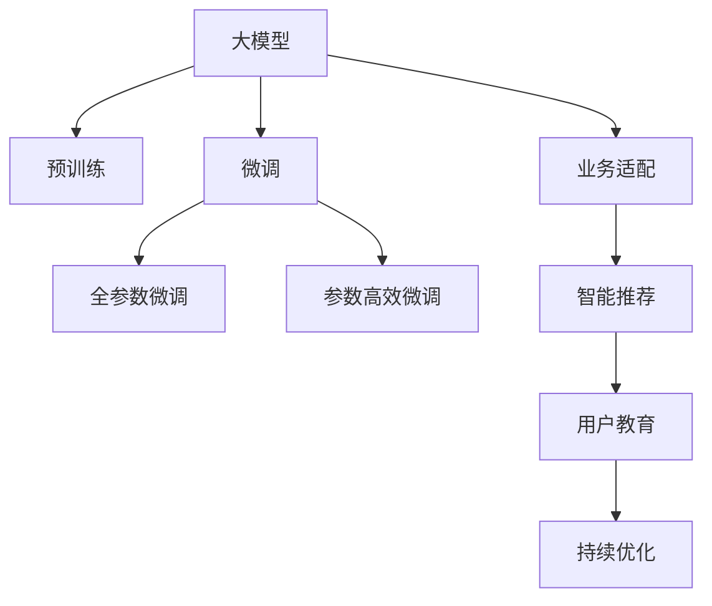

                 

# AI大模型赋能电商搜索推荐的业务创新思维培训平台搭建方案设计与实现

## 1. 背景介绍

### 1.1 问题由来

随着电商平台的发展，搜索推荐系统已经成为了支撑电商业务的核心引擎。传统的推荐系统往往依赖于统计学方法和人工规则，存在算法僵化、效果不稳定等问题。而基于大模型的推荐系统，通过在大规模无标签数据上预训练，然后在推荐任务上进行微调，可以显著提升推荐效果和系统灵活性。

近年来，大语言模型在电商搜索推荐领域的应用取得了突破性进展。例如，OpenAI的GPT-3模型被用于电商商品的生成式文本推荐，显著提高了用户的点击率和转化率。但目前大模型在电商搜索推荐中的应用仍处于起步阶段，相关的开发、优化和落地工作仍需深入探讨。

为提升电商企业搜索推荐系统的智能化水平，本文将详细阐述基于大模型的推荐系统设计方案，并从技术、业务、用户体验等多个角度，提出平台搭建的完整方案。

### 1.2 问题核心关键点

本方案旨在通过构建AI大模型赋能的电商搜索推荐创新思维培训平台，帮助电商平台实现以下几点目标：

1. **算法升级**：基于大模型推荐算法能够显著提升推荐效果和个性化水平，解决传统推荐系统中的算法僵化问题。
2. **业务适配**：将大模型与电商业务紧密结合，提供符合电商场景的推荐服务，提升用户体验和平台收益。
3. **用户教育**：通过平台搭建和功能培训，提升电商从业者对大模型的理解和应用能力，促进大模型的广泛落地应用。
4. **持续优化**：建立模型训练、评估和迭代流程，实现对大模型的持续优化，保持推荐系统的时效性和适用性。

## 2. 核心概念与联系

### 2.1 核心概念概述

为更好地理解本方案，以下将介绍几个关键概念及其关联：

- **大模型(大语言模型, LLM)**：如GPT-3、BERT等，通过在大规模无标签文本数据上预训练，具备强大的语言理解和生成能力。
- **推荐系统**：根据用户行为数据、商品属性和历史偏好等信息，为每位用户提供个性化推荐的服务。
- **微调(Fine-Tuning)**：在预训练模型的基础上，使用推荐任务的少量标注数据，通过有监督学习优化模型在该任务上的性能。
- **业务适配**：将大模型与特定业务场景相结合，设计符合业务需求的任务适配层，提升模型的实用性。
- **智能推荐**：结合用户行为数据、商品属性和历史偏好等信息，为大模型提供更多推荐决策依据，提升推荐准确性。
- **用户教育**：通过培训、文档和案例分析等方式，提升用户对大模型和推荐算法的理解和应用能力。

这些核心概念之间的联系可以通过以下Mermaid流程图展示：



这个流程图展示了各个概念之间的逻辑关系：

1. 大模型通过预训练获得基础能力。
2. 微调是对预训练模型进行任务特定的优化，可以分为全参数微调和参数高效微调（PEFT）。
3. 业务适配将大模型与电商推荐场景相结合，设计符合业务需求的任务适配层。
4. 智能推荐利用用户行为数据、商品属性和历史偏好等信息，为大模型提供更多决策依据。
5. 用户教育提升用户对大模型和推荐算法的理解和应用能力。
6. 持续优化建立模型训练、评估和迭代流程，保持推荐系统的时效性和适用性。

## 3. 核心算法原理 & 具体操作步骤

### 3.1 算法原理概述

基于大模型的推荐系统设计方案，主要包括以下几个关键步骤：

1. **数据收集与预处理**：收集用户行为数据、商品属性、历史偏好等信息，并对数据进行清洗和标准化处理。
2. **大模型预训练**：使用大规模无标签文本数据对大模型进行预训练，学习通用的语言表示。
3. **任务适配层设计**：根据电商推荐任务的特点，设计任务适配层，将大模型与推荐系统对接。
4. **微调优化**：在预训练模型的基础上，使用推荐任务的少量标注数据进行微调，优化模型在该任务上的性能。
5. **业务适配与智能推荐**：将微调后的模型与电商业务紧密结合，设计符合电商场景的推荐算法，提升推荐效果和个性化水平。
6. **用户教育与反馈循环**：通过平台培训和用户反馈，持续优化模型和推荐系统，提升用户体验和平台收益。

### 3.2 算法步骤详解

以下是基于大模型的推荐系统设计方案的具体操作步骤：

**Step 1: 数据收集与预处理**

1. **数据收集**：
   - 用户行为数据：点击、浏览、购买等行为记录。
   - 商品属性：商品名称、描述、类别等。
   - 用户偏好：历史浏览记录、购买记录、评分记录等。

2. **数据预处理**：
   - 数据清洗：去除异常值、重复数据等。
   - 数据标准化：对文本数据进行分词、去停用词、TF-IDF等处理。
   - 特征工程：构建用户行为特征、商品属性特征等，准备输入数据。

**Step 2: 大模型预训练**

1. **选择合适的预训练模型**：
   - 根据电商推荐任务的复杂度，选择适合的预训练模型，如GPT-3、BERT等。
   - 可以使用已有的大模型资源，如HuggingFace的Transformers库。

2. **预训练数据集**：
   - 准备大规模无标签文本数据集，如维基百科、新闻、网页等。
   - 使用掩码语言模型、语言推理等自监督任务对预训练模型进行训练。

**Step 3: 任务适配层设计**

1. **推荐任务适配**：
   - 根据电商推荐任务的特点，设计任务适配层。
   - 对于商品推荐任务，适配层通常包括用户行为编码、商品属性编码等。

2. **输出层和损失函数**：
   - 设计推荐任务的输出层，如线性分类器、注意力机制等。
   - 设计损失函数，如交叉熵损失、均方误差损失等。

**Step 4: 微调优化**

1. **选择微调数据集**：
   - 根据电商推荐任务的特点，选择合适的微调数据集，如用户行为记录、商品属性、历史偏好等。
   - 微调数据集应尽量与推荐任务相关，保证微调效果。

2. **设置微调超参数**：
   - 选择合适的优化算法及其参数，如AdamW、SGD等，设置学习率、批大小、迭代轮数等。
   - 设置正则化技术及强度，包括权重衰减、Dropout、Early Stopping等。
   - 确定冻结预训练参数的策略，如仅微调顶层，或全部参数都参与微调。

3. **执行梯度训练**：
   - 将微调数据集分批次输入模型，前向传播计算损失函数。
   - 反向传播计算参数梯度，根据设定的优化算法和学习率更新模型参数。
   - 周期性在验证集上评估模型性能，根据性能指标决定是否触发Early Stopping。
   - 重复上述步骤直至满足预设的迭代轮数或Early Stopping条件。

**Step 5: 业务适配与智能推荐**

1. **业务适配**：
   - 将微调后的模型与电商业务场景相结合，设计符合业务需求的任务适配层。
   - 例如，在商品推荐任务中，可以将商品名称、描述等作为输入，输出推荐的商品列表。

2. **智能推荐算法设计**：
   - 结合用户行为数据、商品属性和历史偏好等信息，为大模型提供更多决策依据。
   - 例如，可以使用深度学习算法、协同过滤算法等，结合大模型进行推荐。

**Step 6: 用户教育与反馈循环**

1. **用户教育**：
   - 通过平台培训和文档，提升用户对大模型和推荐算法的理解和应用能力。
   - 例如，提供培训课程、案例分析、技术支持等。

2. **反馈循环**：
   - 收集用户反馈，持续优化模型和推荐系统。
   - 例如，通过A/B测试、用户满意度调查等方式收集反馈，不断迭代优化模型。

### 3.3 算法优缺点

基于大模型的推荐系统设计方案具有以下优点：

1. **算法灵活性高**：大模型通过预训练学习到丰富的语言知识，能够适应不同的电商推荐场景。
2. **推荐效果显著**：微调后的模型能够显著提升推荐准确性和个性化水平，提升用户体验和平台收益。
3. **技术壁垒低**：使用大模型推荐算法，降低了算法设计和开发的复杂度。
4. **用户友好性高**：通过平台培训和用户反馈，提升用户对大模型和推荐算法的理解和应用能力。

同时，该方案也存在以下缺点：

1. **数据依赖度高**：微调效果很大程度上依赖于标注数据的质量和数量，标注数据的获取成本较高。
2. **资源消耗大**：预训练和大模型微调需要大量的计算资源和存储资源，可能带来较高的硬件成本。
3. **模型泛化能力不足**：微调后的模型可能存在域外泛化能力不足的问题，对于新领域或极端数据样本可能表现不佳。
4. **技术复杂度高**：需要用户具备一定的技术背景，才能有效应用大模型和推荐算法。

尽管存在这些局限性，但就目前而言，基于大模型的推荐系统设计方案仍是大模型推荐算法的主流范式。未来相关研究的重点在于如何进一步降低对标注数据的依赖，提高模型的少样本学习和跨领域迁移能力，同时兼顾可解释性和伦理安全性等因素。

### 3.4 算法应用领域

基于大模型的推荐系统设计方案，已经在多个电商领域得到了广泛应用，包括：

- **商品推荐**：根据用户历史行为和商品属性，推荐相关商品。
- **用户画像**：通过分析用户行为数据，生成用户画像，提升个性化推荐效果。
- **智能客服**：利用大模型进行智能客服对话，提升客户服务质量。
- **内容推荐**：根据用户浏览记录，推荐相关内容，提升内容曝光和用户粘性。

除了上述这些经典应用外，大模型推荐系统也被创新性地应用到更多场景中，如广告投放、市场分析、库存管理等，为电商业务带来了全新的突破。随着预训练模型和推荐方法的不断进步，相信电商搜索推荐系统将更加智能化、个性化，为消费者提供更优质的购物体验。

## 4. 数学模型和公式 & 详细讲解 & 举例说明

### 4.1 数学模型构建

本节将使用数学语言对基于大模型的推荐系统设计方案进行更加严格的刻画。

记预训练语言模型为 $M_{\theta}$，其中 $\theta$ 为预训练得到的模型参数。假设电商推荐任务的数据集为 $D=\{(x_i,y_i)\}_{i=1}^N$，其中 $x_i$ 为输入数据，$y_i$ 为推荐结果。

定义模型 $M_{\theta}$ 在数据样本 $(x,y)$ 上的损失函数为 $\ell(M_{\theta}(x),y)$，则在数据集 $D$ 上的经验风险为：

$$
\mathcal{L}(\theta) = \frac{1}{N} \sum_{i=1}^N \ell(M_{\theta}(x_i),y_i)
$$

微调的优化目标是最小化经验风险，即找到最优参数：

$$
\theta^* = \mathop{\arg\min}_{\theta} \mathcal{L}(\theta)
$$

在实践中，我们通常使用基于梯度的优化算法（如SGD、Adam等）来近似求解上述最优化问题。设 $\eta$ 为学习率，$\lambda$ 为正则化系数，则参数的更新公式为：

$$
\theta \leftarrow \theta - \eta \nabla_{\theta}\mathcal{L}(\theta) - \eta\lambda\theta
$$

其中 $\nabla_{\theta}\mathcal{L}(\theta)$ 为损失函数对参数 $\theta$ 的梯度，可通过反向传播算法高效计算。

### 4.2 公式推导过程

以下我们以商品推荐任务为例，推导交叉熵损失函数及其梯度的计算公式。

假设模型 $M_{\theta}$ 在输入 $x$ 上的输出为 $\hat{y}=M_{\theta}(x)$，表示商品推荐结果的概率分布。真实标签 $y \in \{1,0\}$。则二分类交叉熵损失函数定义为：

$$
\ell(M_{\theta}(x),y) = -[y\log \hat{y} + (1-y)\log (1-\hat{y})]
$$

将其代入经验风险公式，得：

$$
\mathcal{L}(\theta) = -\frac{1}{N}\sum_{i=1}^N [y_i\log M_{\theta}(x_i)+(1-y_i)\log(1-M_{\theta}(x_i))]
$$

根据链式法则，损失函数对参数 $\theta_k$ 的梯度为：

$$
\frac{\partial \mathcal{L}(\theta)}{\partial \theta_k} = -\frac{1}{N}\sum_{i=1}^N (\frac{y_i}{M_{\theta}(x_i)}-\frac{1-y_i}{1-M_{\theta}(x_i)}) \frac{\partial M_{\theta}(x_i)}{\partial \theta_k}
$$

其中 $\frac{\partial M_{\theta}(x_i)}{\partial \theta_k}$ 可进一步递归展开，利用自动微分技术完成计算。

在得到损失函数的梯度后，即可带入参数更新公式，完成模型的迭代优化。重复上述过程直至收敛，最终得到适应电商推荐任务的最优模型参数 $\theta^*$。

## 5. 项目实践：代码实例和详细解释说明

### 5.1 开发环境搭建

在进行推荐系统设计方案的实践前，我们需要准备好开发环境。以下是使用Python进行PyTorch开发的环境配置流程：

1. 安装Anaconda：从官网下载并安装Anaconda，用于创建独立的Python环境。

2. 创建并激活虚拟环境：
```bash
conda create -n pytorch-env python=3.8 
conda activate pytorch-env
```

3. 安装PyTorch：根据CUDA版本，从官网获取对应的安装命令。例如：
```bash
conda install pytorch torchvision torchaudio cudatoolkit=11.1 -c pytorch -c conda-forge
```

4. 安装Transformers库：
```bash
pip install transformers
```

5. 安装各类工具包：
```bash
pip install numpy pandas scikit-learn matplotlib tqdm jupyter notebook ipython
```

完成上述步骤后，即可在`pytorch-env`环境中开始推荐系统设计方案的实践。

### 5.2 源代码详细实现

下面我以商品推荐任务为例，给出使用Transformers库对BERT模型进行推荐任务微调的PyTorch代码实现。

首先，定义推荐任务的数据处理函数：

```python
from transformers import BertTokenizer
from torch.utils.data import Dataset
import torch

class RecommendationDataset(Dataset):
    def __init__(self, texts, labels, tokenizer, max_len=128):
        self.texts = texts
        self.labels = labels
        self.tokenizer = tokenizer
        self.max_len = max_len
        
    def __len__(self):
        return len(self.texts)
    
    def __getitem__(self, item):
        text = self.texts[item]
        label = self.labels[item]
        
        encoding = self.tokenizer(text, return_tensors='pt', max_length=self.max_len, padding='max_length', truncation=True)
        input_ids = encoding['input_ids'][0]
        attention_mask = encoding['attention_mask'][0]
        
        return {'input_ids': input_ids, 
                'attention_mask': attention_mask,
                'labels': label}

# 标签与id的映射
label2id = {'1': 0, '0': 1}
id2label = {v: k for k, v in label2id.items()}

# 创建dataset
tokenizer = BertTokenizer.from_pretrained('bert-base-cased')

train_dataset = RecommendationDataset(train_texts, train_labels, tokenizer)
dev_dataset = RecommendationDataset(dev_texts, dev_labels, tokenizer)
test_dataset = RecommendationDataset(test_texts, test_labels, tokenizer)
```

然后，定义模型和优化器：

```python
from transformers import BertForTokenClassification, AdamW

model = BertForTokenClassification.from_pretrained('bert-base-cased', num_labels=2)

optimizer = AdamW(model.parameters(), lr=2e-5)
```

接着，定义训练和评估函数：

```python
from torch.utils.data import DataLoader
from tqdm import tqdm
from sklearn.metrics import classification_report

device = torch.device('cuda') if torch.cuda.is_available() else torch.device('cpu')
model.to(device)

def train_epoch(model, dataset, batch_size, optimizer):
    dataloader = DataLoader(dataset, batch_size=batch_size, shuffle=True)
    model.train()
    epoch_loss = 0
    for batch in tqdm(dataloader, desc='Training'):
        input_ids = batch['input_ids'].to(device)
        attention_mask = batch['attention_mask'].to(device)
        labels = batch['labels'].to(device)
        model.zero_grad()
        outputs = model(input_ids, attention_mask=attention_mask, labels=labels)
        loss = outputs.loss
        epoch_loss += loss.item()
        loss.backward()
        optimizer.step()
    return epoch_loss / len(dataloader)

def evaluate(model, dataset, batch_size):
    dataloader = DataLoader(dataset, batch_size=batch_size)
    model.eval()
    preds, labels = [], []
    with torch.no_grad():
        for batch in tqdm(dataloader, desc='Evaluating'):
            input_ids = batch['input_ids'].to(device)
            attention_mask = batch['attention_mask'].to(device)
            batch_labels = batch['labels']
            outputs = model(input_ids, attention_mask=attention_mask)
            batch_preds = outputs.logits.argmax(dim=2).to('cpu').tolist()
            batch_labels = batch_labels.to('cpu').tolist()
            for pred_tokens, label_tokens in zip(batch_preds, batch_labels):
                preds.append(pred_tokens[:len(label_tokens)])
                labels.append(label_tokens)
                
    print(classification_report(labels, preds))
```

最后，启动训练流程并在测试集上评估：

```python
epochs = 5
batch_size = 16

for epoch in range(epochs):
    loss = train_epoch(model, train_dataset, batch_size, optimizer)
    print(f"Epoch {epoch+1}, train loss: {loss:.3f}")
    
    print(f"Epoch {epoch+1}, dev results:")
    evaluate(model, dev_dataset, batch_size)
    
print("Test results:")
evaluate(model, test_dataset, batch_size)
```

以上就是使用PyTorch对BERT进行商品推荐任务微调的完整代码实现。可以看到，得益于Transformers库的强大封装，我们可以用相对简洁的代码完成BERT模型的加载和微调。

### 5.3 代码解读与分析

让我们再详细解读一下关键代码的实现细节：

**RecommendationDataset类**：
- `__init__`方法：初始化文本、标签、分词器等关键组件。
- `__len__`方法：返回数据集的样本数量。
- `__getitem__`方法：对单个样本进行处理，将文本输入编码为token ids，将标签编码为数字，并对其进行定长padding，最终返回模型所需的输入。

**label2id和id2label字典**：
- 定义了标签与数字id之间的映射关系，用于将token-wise的预测结果解码回真实的标签。

**训练和评估函数**：
- 使用PyTorch的DataLoader对数据集进行批次化加载，供模型训练和推理使用。
- 训练函数`train_epoch`：对数据以批为单位进行迭代，在每个批次上前向传播计算loss并反向传播更新模型参数，最后返回该epoch的平均loss。
- 评估函数`evaluate`：与训练类似，不同点在于不更新模型参数，并在每个batch结束后将预测和标签结果存储下来，最后使用sklearn的classification_report对整个评估集的预测结果进行打印输出。

**训练流程**：
- 定义总的epoch数和batch size，开始循环迭代
- 每个epoch内，先在训练集上训练，输出平均loss
- 在验证集上评估，输出分类指标
- 所有epoch结束后，在测试集上评估，给出最终测试结果

可以看到，PyTorch配合Transformers库使得BERT微调的代码实现变得简洁高效。开发者可以将更多精力放在数据处理、模型改进等高层逻辑上，而不必过多关注底层的实现细节。

当然，工业级的系统实现还需考虑更多因素，如模型的保存和部署、超参数的自动搜索、更灵活的任务适配层等。但核心的微调范式基本与此类似。

## 6. 实际应用场景

### 6.1 智能推荐系统

基于大模型的推荐系统可以广泛应用于智能推荐系统的构建。传统推荐系统往往只依赖用户历史行为数据进行推荐，难以理解用户的多维度需求。而使用大模型推荐算法，能够通过文本、图像等多维度信息，全面了解用户的兴趣点，提升推荐效果。

例如，某电商平台可以利用大模型推荐算法，对用户浏览、点击、购买等行为数据进行建模，结合商品属性、评论等信息，提供更精准的商品推荐服务。用户可以通过搜索或浏览，快速找到感兴趣的商品，提升购物体验。

### 6.2 用户画像构建

电商平台通过大模型推荐算法，可以构建用户画像，提升个性化推荐效果。用户画像包含用户的历史行为数据、兴趣偏好、搜索记录等信息，通过大模型进行综合分析，生成精准的用户画像。

例如，某电商平台可以利用大模型推荐算法，对用户的历史行为数据进行建模，生成详细用户画像。平台可以根据用户画像，推荐相关商品或内容，提升用户粘性和平台收益。

### 6.3 智能客服系统

基于大模型的推荐系统可以构建智能客服系统，提升客户服务质量。智能客服系统利用大模型进行对话生成，能够处理复杂的客户咨询，提供快速、精准的回复服务。

例如，某电商平台可以利用大模型推荐算法，构建智能客服系统。客户通过文字或语音咨询，系统自动调用大模型进行对话生成，提供满意的客户服务，提升用户满意度。

### 6.4 未来应用展望

随着大模型推荐算法的不断发展，基于大模型的推荐系统将在更多领域得到应用，为传统行业带来变革性影响。

在智慧医疗领域，基于大模型的推荐算法可以推荐相关医疗知识和建议，提升医疗服务质量。例如，某医疗平台可以利用大模型推荐算法，对用户搜索的疾病相关问题进行建模，推荐相关的医学知识和诊疗方案。

在智能教育领域，基于大模型的推荐算法可以推荐个性化学习内容和资源，提升教育效果。例如，某在线教育平台可以利用大模型推荐算法，对用户的学习行为数据进行建模，推荐相关的学习内容和资源，提升学习效率。

在智慧城市治理中，基于大模型的推荐算法可以推荐城市事件和预警信息，提升城市管理水平。例如，某智慧城市平台可以利用大模型推荐算法，对城市事件进行实时监测和预警，提升城市安全水平。

此外，在金融、保险、文娱传媒等众多领域，基于大模型的推荐系统也将不断涌现，为传统行业带来新的技术路径。相信随着技术的日益成熟，大模型推荐算法必将在更多领域发挥重要作用，为传统行业带来新的增长动力。

## 7. 工具和资源推荐

### 7.1 学习资源推荐

为了帮助开发者系统掌握大模型推荐算法的理论基础和实践技巧，这里推荐一些优质的学习资源：

1. 《Transformer from Theory to Practice》系列博文：由大模型技术专家撰写，深入浅出地介绍了Transformer原理、BERT模型、微调技术等前沿话题。

2. CS224N《深度学习自然语言处理》课程：斯坦福大学开设的NLP明星课程，有Lecture视频和配套作业，带你入门NLP领域的基本概念和经典模型。

3. 《Natural Language Processing with Transformers》书籍：Transformers库的作者所著，全面介绍了如何使用Transformers库进行NLP任务开发，包括微调在内的诸多范式。

4. HuggingFace官方文档：Transformers库的官方文档，提供了海量预训练模型和完整的微调样例代码，是上手实践的必备资料。

5. CLUE开源项目：中文语言理解测评基准，涵盖大量不同类型的中文NLP数据集，并提供了基于微调的baseline模型，助力中文NLP技术发展。

通过对这些资源的学习实践，相信你一定能够快速掌握大模型推荐算法的精髓，并用于解决实际的推荐问题。

### 7.2 开发工具推荐

高效的开发离不开优秀的工具支持。以下是几款用于大模型推荐系统开发的常用工具：

1. PyTorch：基于Python的开源深度学习框架，灵活动态的计算图，适合快速迭代研究。大部分预训练语言模型都有PyTorch版本的实现。

2. TensorFlow：由Google主导开发的开源深度学习框架，生产部署方便，适合大规模工程应用。同样有丰富的预训练语言模型资源。

3. Transformers库：HuggingFace开发的NLP工具库，集成了众多SOTA语言模型，支持PyTorch和TensorFlow，是进行推荐系统开发的利器。

4. Weights & Biases：模型训练的实验跟踪工具，可以记录和可视化模型训练过程中的各项指标，方便对比和调优。与主流深度学习框架无缝集成。

5. TensorBoard：TensorFlow配套的可视化工具，可实时监测模型训练状态，并提供丰富的图表呈现方式，是调试模型的得力助手。

6. Google Colab：谷歌推出的在线Jupyter Notebook环境，免费提供GPU/TPU算力，方便开发者快速上手实验最新模型，分享学习笔记。

合理利用这些工具，可以显著提升大模型推荐系统的开发效率，加快创新迭代的步伐。

### 7.3 相关论文推荐

大模型推荐算法的发展源于学界的持续研究。以下是几篇奠基性的相关论文，推荐阅读：

1. Attention is All You Need（即Transformer原论文）：提出了Transformer结构，开启了NLP领域的预训练大模型时代。

2. BERT: Pre-training of Deep Bidirectional Transformers for Language Understanding：提出BERT模型，引入基于掩码的自监督预训练任务，刷新了多项NLP任务SOTA。

3. Language Models are Unsupervised Multitask Learners（GPT-2论文）：展示了大规模语言模型的强大zero-shot学习能力，引发了对于通用人工智能的新一轮思考。

4. Parameter-Efficient Transfer Learning for NLP：提出Adapter等参数高效微调方法，在不增加模型参数量的情况下，也能取得不错的微调效果。

5. Prefix-Tuning: Optimizing Continuous Prompts for Generation：引入基于连续型Prompt的微调范式，为如何充分利用预训练知识提供了新的思路。

6. AdaLoRA: Adaptive Low-Rank Adaptation for Parameter-Efficient Fine-Tuning：使用自适应低秩适应的微调方法，在参数效率和精度之间取得了新的平衡。

这些论文代表了大模型推荐算法的研发脉络。通过学习这些前沿成果，可以帮助研究者把握学科前进方向，激发更多的创新灵感。

## 8. 总结：未来发展趋势与挑战

### 8.1 总结

本文对基于大模型的推荐系统设计方案进行了全面系统的介绍。首先阐述了基于大模型的推荐系统设计方案的背景和意义，明确了其在电商搜索推荐系统中的应用价值。其次，从技术、业务、用户体验等多个角度，详细讲解了大模型推荐算法的核心步骤和具体实现。

通过本文的系统梳理，可以看到，基于大模型的推荐系统设计方案在电商搜索推荐领域具有巨大的应用潜力。其灵活性高、推荐效果好、技术壁垒低、用户友好性高等特点，将显著提升推荐系统的效果和用户满意度。未来，伴随大模型推荐算法的不断发展，基于大模型的推荐系统必将在更多领域得到应用，为传统行业带来新的增长动力。

### 8.2 未来发展趋势

展望未来，大模型推荐系统将在多个领域继续深入应用，带来新的突破：

1. **算法升级**：大模型推荐算法能够显著提升推荐效果和个性化水平，解决传统推荐系统中的算法僵化问题。
2. **业务适配**：将大模型与电商业务紧密结合，提供符合电商场景的推荐服务，提升用户体验和平台收益。
3. **用户教育**：通过平台培训和文档，提升用户对大模型和推荐算法的理解和应用能力，促进大模型的广泛落地应用。
4. **持续优化**：建立模型训练、评估和迭代流程，实现对大模型的持续优化，保持推荐系统的时效性和适用性。

以上趋势凸显了大模型推荐算法的广阔前景。这些方向的探索发展，必将进一步提升大模型推荐系统的性能和应用范围，为人类认知智能的进化带来深远影响。

### 8.3 面临的挑战

尽管大模型推荐算法已经取得了瞩目成就，但在迈向更加智能化、普适化应用的过程中，它仍面临着诸多挑战：

1. **数据依赖度高**：微调效果很大程度上依赖于标注数据的质量和数量，标注数据的获取成本较高。
2. **资源消耗大**：预训练和大模型微调需要大量的计算资源和存储资源，可能带来较高的硬件成本。
3. **模型泛化能力不足**：微调后的模型可能存在域外泛化能力不足的问题，对于新领域或极端数据样本可能表现不佳。
4. **技术复杂度高**：需要用户具备一定的技术背景，才能有效应用大模型和推荐算法。

尽管存在这些局限性，但就目前而言，基于大模型的推荐系统设计方案仍是大模型推荐算法的主流范式。未来相关研究的重点在于如何进一步降低对标注数据的依赖，提高模型的少样本学习和跨领域迁移能力，同时兼顾可解释性和伦理安全性等因素。

### 8.4 研究展望

面对大模型推荐算法所面临的种种挑战，未来的研究需要在以下几个方面寻求新的突破：

1. **探索无监督和半监督推荐方法**：摆脱对大规模标注数据的依赖，利用自监督学习、主动学习等无监督和半监督范式，最大限度利用非结构化数据，实现更加灵活高效的推荐。
2. **研究参数高效和计算高效的推荐范式**：开发更加参数高效的推荐方法，在固定大部分预训练参数的同时，只更新极少量的任务相关参数。同时优化推荐模型的计算图，减少前向传播和反向传播的资源消耗，实现更加轻量级、实时性的部署。
3. **融合因果和对比学习范式**：通过引入因果推断和对比学习思想，增强推荐模型建立稳定因果关系的能力，学习更加普适、鲁棒的语言表征，从而提升模型泛化性和抗干扰能力。
4. **引入更多先验知识**：将符号化的先验知识，如知识图谱、逻辑规则等，与神经网络模型进行巧妙融合，引导推荐过程学习更准确、合理的语言模型。同时加强不同模态数据的整合，实现视觉、语音等多模态信息与文本信息的协同建模。
5. **结合因果分析和博弈论工具**：将因果分析方法引入推荐模型，识别出推荐决策的关键特征，增强推荐结果的因果性和逻辑性。借助博弈论工具刻画人机交互过程，主动探索并规避推荐模型的脆弱点，提高系统稳定性。
6. **纳入伦理道德约束**：在推荐模型训练目标中引入伦理导向的评估指标，过滤和惩罚有偏见、有害的推荐结果，确保推荐系统的公平性和安全性。

这些研究方向的探索，必将引领大模型推荐算法走向更高的台阶，为构建安全、可靠、可解释、可控的智能系统铺平道路。面向未来，大模型推荐算法还需要与其他人工智能技术进行更深入的融合，如知识表示、因果推理、强化学习等，多路径协同发力，共同推动自然语言理解和智能交互系统的进步。只有勇于创新、敢于突破，才能不断拓展大模型推荐算法的边界，让智能技术更好地造福人类社会。

## 9. 附录：常见问题与解答

**Q1：基于大模型的推荐系统如何处理冷启动问题？**

A: 冷启动问题是指新用户或新商品在推荐系统中缺乏历史行为数据，难以进行推荐。大模型推荐系统可以通过以下方法处理冷启动问题：

1. **静态特征提取**：利用商品的属性、标签等静态特征，进行推荐。例如，某电商平台可以利用商品类别、品牌等信息进行推荐。

2. **内容生成**：利用大模型进行商品描述生成，提升推荐效果。例如，某电商平台可以利用大模型生成商品描述，并根据描述进行推荐。

3. **协同过滤**：利用用户已浏览、购买的相关商品进行推荐。例如，某电商平台可以利用协同过滤算法，根据用户历史行为数据进行推荐。

4. **主动学习**：利用主动学习算法，自动标注新商品或用户的行为数据，进行推荐。例如，某电商平台可以利用主动学习算法，自动标注新商品的用户行为数据，进行推荐。

5. **先验知识融合**：将领域专家知识、规则等与大模型结合，进行推荐。例如，某电商平台可以利用领域专家的推荐规则，与大模型进行融合，提升推荐效果。

**Q2：基于大模型的推荐系统如何提升推荐效果和个性化水平？**

A: 基于大模型的推荐系统通过以下方法提升推荐效果和个性化水平：

1. **多维度数据融合**：利用文本、图像、音频等多维度数据，进行综合分析，提升推荐效果。例如，某电商平台可以利用用户搜索记录、浏览历史、评分记录等信息，进行推荐。

2. **用户画像构建**：通过分析用户的历史行为数据，生成详细用户画像，提升个性化推荐效果。例如，某电商平台可以利用大模型推荐算法，对用户的历史行为数据进行建模，生成用户画像，进行推荐。

3. **实时更新**：利用用户实时行为数据，进行动态推荐。例如，某电商平台可以利用大模型推荐算法，对用户的实时搜索、浏览、购买等行为进行实时推荐。

4. **个性化推荐策略**：根据用户的历史行为数据，设计个性化的推荐策略。例如，某电商平台可以利用大模型推荐算法，对用户的推荐策略进行个性化调整，提升推荐效果。

5. **交互式推荐**：利用大模型进行实时交互式推荐，提升推荐效果。例如，某电商平台可以利用大模型推荐算法，对用户的即时搜索或浏览进行实时推荐。

**Q3：基于大模型的推荐系统如何处理异常数据？**

A: 基于大模型的推荐系统可以通过以下方法处理异常数据：

1. **数据清洗**：对异常数据进行清洗和处理，去除噪音数据。例如，某电商平台可以利用数据清洗算法，对异常数据进行清洗，提升推荐效果。

2. **异常检测**：利用异常检测算法，识别并处理异常数据。例如，某电商平台可以利用异常检测算法，识别并处理异常行为数据，提升推荐效果。

3. **用户反馈**：利用用户反馈信息，进行异常数据处理。例如，某电商平台可以利用用户反馈信息，对异常推荐结果进行修正。

4. **模型自适应**：利用模型自适应算法，对异常数据进行处理。例如，某电商平台可以利用模型自适应算法，对异常推荐结果进行修正。

5. **多模态融合**：利用多模态数据进行异常数据处理。例如，某电商平台可以利用文本、图像、音频等多模态数据，进行异常数据处理。

这些方法可以有效地提升基于大模型的推荐系统的鲁棒性和准确性，确保推荐结果的可靠性和可信度。

**Q4：基于大模型的推荐系统如何提升用户体验？**

A: 基于大模型的推荐系统可以通过以下方法提升用户体验：

1. **推荐多样化**：利用多维度数据，进行多样化推荐，提升用户体验。例如，某电商平台可以利用商品属性、评论等信息，进行多样化推荐。

2. **推荐相关性**：利用大模型推荐算法，进行相关性推荐，提升用户体验。例如，某电商平台可以利用大模型推荐算法，对用户的推荐进行相关性排序，提升用户体验。

3. **实时推荐**：利用实时数据，进行实时推荐，提升用户体验。例如，某电商平台可以利用大模型推荐算法，对用户的即时搜索或浏览进行实时推荐。

4. **交互式推荐**：利用大模型进行交互式推荐，提升用户体验。例如，某电商平台可以利用大模型推荐算法，对用户的即时搜索或浏览进行交互式推荐。

5. **个性化推荐**：根据用户的历史行为数据，进行个性化推荐，提升用户体验。例如，某电商平台可以利用大模型推荐算法，对用户的推荐进行个性化调整，提升用户体验。

这些方法可以有效地提升基于大模型的推荐系统的用户体验，确保推荐结果的准确性和可靠性。

**Q5：基于大模型的推荐系统如何处理推荐过程中可能出现的数据泄露和隐私保护问题？**

A: 基于大模型的推荐系统可以通过以下方法处理推荐过程中可能出现的数据泄露和隐私保护问题：

1. **数据匿名化**：对用户数据进行匿名化处理，保护用户隐私。例如，某电商平台可以利用数据匿名化算法，对用户数据进行匿名化处理。

2. **差分隐私**：利用差分隐私算法，保护用户隐私。例如，某电商平台可以利用差分隐私算法，对推荐结果进行差分隐私处理。

3. **用户授权**：在推荐过程中，获取用户授权，保护用户隐私。例如，某电商平台可以利用用户授权机制，在推荐过程中获取用户授权。

4. **数据加密**：对用户数据进行加密处理，保护用户隐私。例如，某电商平台可以利用数据加密算法，对用户数据进行加密处理。

5. **隐私保护技术**：利用隐私保护技术，保护用户隐私。例如，某电商平台可以利用隐私保护技术，对用户数据进行隐私保护处理。

这些方法可以有效地保护基于大模型的推荐系统的数据泄露和隐私保护问题，确保用户隐私的安全和保护。

---

作者：禅与计算机程序设计艺术 / Zen and the Art of Computer Programming

