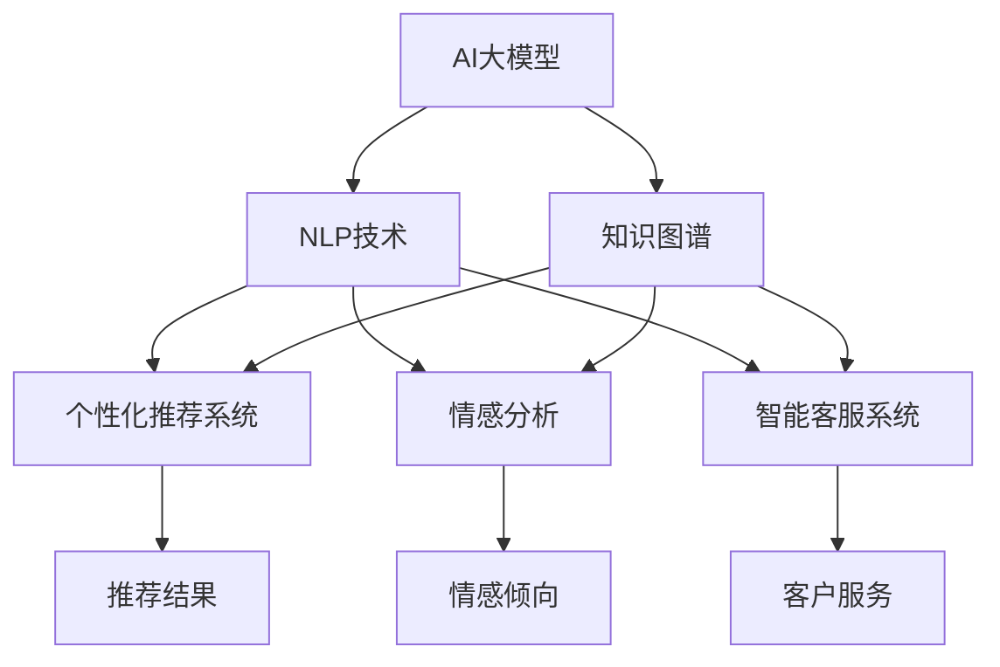

                 

# AI大模型：改善电商平台用户体验个性化的新思路

在数字化转型加速的今天，电商平台正面临着越来越激烈的市场竞争。如何通过提升用户体验，增强用户粘性，提升购物转化率，成为了电商企业亟待解决的问题。AI大模型作为当前人工智能领域的一大突破，具有强大的自然语言处理能力和数据分析能力，能够从海量数据中学习用户行为模式，从而实现个性化的用户体验优化。本文将详细介绍AI大模型在电商平台中的应用，包括模型构建、算法原理、实践案例和未来展望。

## 1. 背景介绍

### 1.1 电商平台的痛点
电商平台的主要任务是连接用户和商品，为用户提供便捷、满意的购物体验。然而，在实际运营中，电商平台也面临着诸多挑战：

- **商品搜索的准确性和多样性**：用户无法在搜索结果中找到符合自己需求的商品。
- **个性化推荐的不足**：推荐系统无法充分了解用户兴趣和行为模式，推荐结果过于泛泛。
- **用户评价与反馈的利用不足**：用户评价和反馈信息未被充分分析利用，难以改进商品和服务。
- **购物助手功能的缺失**：购物助手无法理解用户需求，提供高效的客户服务。

这些问题严重影响了电商平台的用户体验，制约了其市场竞争力和用户留存率。

### 1.2 AI大模型的优势
AI大模型，尤其是基于Transformer架构的预训练模型，如BERT、GPT-3等，凭借其强大的语言理解和生成能力，能够帮助电商平台解决上述痛点。

1. **语义理解与生成**：大模型可以理解自然语言输入，生成准确的回答和推荐，提升搜索和推荐的精度。
2. **个性化推荐**：通过分析用户行为数据，学习用户的兴趣和需求，实现更精准的个性化推荐。
3. **智能客服**：利用大模型进行自然语言处理，构建智能客服系统，提升用户满意度。
4. **情感分析**：分析用户评价和反馈，进行情感分析，改进商品和服务。
5. **购物助手**：通过与用户互动，提供实时的商品解答和推荐，提升购物体验。

这些优势使得AI大模型成为电商平台个性化优化的一个强有力的工具。

## 2. 核心概念与联系

### 2.1 核心概念概述

为更好地理解AI大模型在电商平台中的应用，本节将介绍几个关键概念：

- **AI大模型**：以Transformer为代表的深度学习模型，通过在大规模语料上进行预训练，学习到丰富的语言知识和语义表示。
- **自然语言处理(NLP)**：通过计算机对自然语言文本进行理解、生成、分析和处理的技术。
- **个性化推荐系统**：根据用户的历史行为数据，预测并推荐符合其兴趣的商品或内容。
- **情感分析**：分析用户评价和反馈中的情感倾向，以改进商品和服务。
- **智能客服系统**：通过自然语言处理技术，提供自动化、个性化的客户服务。
- **知识图谱**：用于表示和查询实体间关系的知识库，帮助模型理解更复杂的语义关系。
- **转移学习**：在预训练模型的基础上，通过微调或迁移学习，适应特定的电商任务。

这些概念之间的逻辑关系可以通过以下Mermaid流程图来展示：



这个流程图展示了大模型、NLP技术以及个性化推荐、情感分析、智能客服等电商任务的紧密联系：

1. 大模型通过预训练获得语言知识。
2. NLP技术使大模型能够理解自然语言，进而应用于电商任务。
3. 个性化推荐、情感分析和智能客服等任务，均依赖NLP技术和大模型的语义理解能力。
4. 知识图谱作为NLP和大模型的补充，进一步增强了模型的语义理解能力。

这些概念共同构成了AI大模型在电商平台上的应用框架，使其能够高效、准确地解决电商任务。

## 3. 核心算法原理 & 具体操作步骤

### 3.1 算法原理概述

AI大模型在电商平台上的应用主要集中在以下几个方面：

1. **商品搜索优化**：通过语义理解，提高商品搜索的准确性和多样性。
2. **个性化推荐系统**：分析用户行为，生成个性化推荐结果。
3. **智能客服系统**：构建基于NLP的智能客服，提升用户满意度。
4. **情感分析**：分析用户评价和反馈，改进商品和服务。
5. **购物助手**：通过与用户互动，提供实时、个性化的购物解答和推荐。

这些应用的核心算法原理均基于大模型的语言理解和生成能力，通过在电商数据上进行微调或迁移学习，实现特定的电商任务。

### 3.2 算法步骤详解

#### 3.2.1 商品搜索优化

1. **数据预处理**：将商品标题、描述等信息转换为模型可理解的格式，如分词、词向量化。
2. **模型加载与微调**：使用预训练模型如BERT或GPT作为初始化参数，在电商数据上进行微调，学习商品语义表示。
3. **搜索匹配**：根据用户输入的查询，通过余弦相似度等算法计算商品匹配度，返回推荐结果。
4. **结果排序**：综合考虑商品匹配度、用户历史行为等因素，对推荐结果进行排序。

#### 3.2.2 个性化推荐系统

1. **用户画像构建**：基于用户浏览、点击、购买等行为，构建用户画像，包括兴趣、偏好等。
2. **模型加载与微调**：加载预训练模型，如宽深层神经网络或注意力机制模型，在电商数据上进行微调，学习用户行为模式。
3. **推荐生成**：根据用户画像和商品特征，生成个性化推荐结果。
4. **反馈循环**：不断收集用户对推荐结果的反馈，进一步优化模型，提高推荐精度。

#### 3.2.3 智能客服系统

1. **意图识别**：通过NLP技术，识别用户输入的意图，如咨询商品、退货、订单查询等。
2. **知识图谱查询**：利用知识图谱，快速获取商品、服务等相关知识。
3. **回复生成**：根据用户意图和知识图谱，生成自然语言回复。
4. **情感分析**：对用户回复进行情感分析，判断用户情绪，进一步优化回答。

#### 3.2.4 情感分析

1. **数据收集与预处理**：收集用户评价和反馈，进行情感标注。
2. **模型加载与微调**：加载预训练模型，如BERT或RNN，在电商数据上进行微调，学习情感表示。
3. **情感分析**：根据用户评价和反馈，分析情感倾向，识别正面、负面或中性情感。
4. **结果应用**：根据情感分析结果，改进商品和服务。

#### 3.2.5 购物助手

1. **用户意图识别**：通过NLP技术，识别用户的购物意图。
2. **商品推荐**：根据用户意图，提供相关商品的推荐。
3. **对话生成**：通过聊天机器人等技术，生成自然语言对话。
4. **多轮对话管理**：在多轮对话中保持上下文一致性，提供连贯的对话体验。

### 3.3 算法优缺点

AI大模型在电商平台上的应用具有以下优点：

1. **提升搜索准确性**：通过语义理解，提高商品搜索的准确性和相关性。
2. **个性化推荐**：通过用户行为分析，提供精准的个性化推荐，提升用户满意度。
3. **智能客服**：提供24/7的自动化客服，提升用户互动体验。
4. **情感分析**：通过情感分析，改进商品和服务，提升用户满意度。
5. **购物助手**：提供实时的购物解答和推荐，提升用户购物体验。

同时，也存在以下缺点：

1. **数据隐私问题**：需要收集和分析用户数据，涉及用户隐私保护。
2. **算法复杂度高**：大模型和大规模训练需要高性能计算资源，成本较高。
3. **模型的可解释性不足**：黑箱模型难以解释决策过程，缺乏透明度。
4. **模型的泛化能力**：模型在特定场景下训练，可能泛化能力不足。
5. **模型的不稳定性**：大模型在处理复杂任务时，可能出现不稳定的问题。

### 3.4 算法应用领域

AI大模型在电商平台上的应用涵盖了多个领域，具体包括：

1. **商品搜索优化**：提升用户查询结果的准确性和相关性。
2. **个性化推荐系统**：提升用户购买转化率和满意度。
3. **智能客服系统**：提升用户互动体验，减少人工客服压力。
4. **情感分析**：分析用户评价和反馈，改进商品和服务。
5. **购物助手**：提升用户购物体验，提供实时的购物解答和推荐。
6. **库存管理**：根据用户行为预测商品需求，优化库存管理。
7. **广告投放**：分析用户行为，优化广告投放策略，提升广告效果。

这些应用领域的结合，使得AI大模型在电商平台上的潜力得到充分释放，大大提升了用户体验和电商平台的竞争力。

## 4. 数学模型和公式 & 详细讲解  
### 4.1 数学模型构建

本节将使用数学语言对AI大模型在电商平台中的应用进行更加严格的刻画。

假设电商平台的商品集为 $S=\{s_i\}_{i=1}^N$，用户行为数据集为 $U=\{u_j\}_{j=1}^M$，用户画像 $P=\{p_k\}_{k=1}^K$，情感标注集为 $E=\{e_l\}_{l=1}^L$。

**商品搜索优化**：
- 输入：用户查询 $q$，商品集 $S$
- 输出：商品推荐列表 $R_q$

**个性化推荐系统**：
- 输入：用户画像 $P_j$，商品特征 $f_i$
- 输出：个性化推荐列表 $R_{p_j}$

**智能客服系统**：
- 输入：用户输入 $q$，知识图谱 $K$
- 输出：回答 $a$

**情感分析**：
- 输入：用户评价 $r$
- 输出：情感倾向 $s$

**购物助手**：
- 输入：用户意图 $i$，商品集 $S$
- 输出：推荐商品列表 $R_i$

这些应用中的数学模型构建主要依赖于预训练模型和大规模语料库，通过微调或迁移学习，学习到特定的任务表示。

### 4.2 公式推导过程

以下我们以个性化推荐系统为例，推导其中的关键公式。

假设用户画像 $P_j$ 和商品特征 $f_i$ 映射为向量表示，$W$ 为模型参数，$softmax$ 函数用于计算概率分布。

推荐系统的目标是最小化负对数似然损失：

$$
\mathcal{L}(P_j, f_i; W) = -\log \left( \frac{e^{W^T\phi(P_j)f_i}}{\sum_{k=1}^K e^{W^T\phi(P_j)f_k}} \right)
$$

其中 $\phi$ 为特征映射函数，$\log$ 函数为自然对数。

为了最小化损失函数 $\mathcal{L}$，需要求导并更新模型参数 $W$：

$$
\nabla_{W}\mathcal{L}(P_j, f_i; W) = -\phi(P_j)f_i \left( \frac{e^{W^T\phi(P_j)f_i}}{\sum_{k=1}^K e^{W^T\phi(P_j)f_k}} \right) - \frac{e^{W^T\phi(P_j)f_i}}{\sum_{k=1}^K e^{W^T\phi(P_j)f_k}}
$$

通过反向传播算法，不断更新 $W$ 来最小化损失函数。

### 4.3 案例分析与讲解

**案例1：商品搜索优化**

我们以Google Shopping为例，展示其利用大模型进行商品搜索优化的过程。

1. **数据收集与预处理**：从Google Search和Google Shopping收集用户查询和商品信息，进行数据清洗和标注。
2. **模型加载与微调**：使用BERT模型作为初始化参数，在收集到的数据上进行微调。
3. **搜索匹配**：根据用户查询，通过余弦相似度计算商品匹配度，返回推荐结果。
4. **结果排序**：综合考虑商品匹配度、用户历史行为等因素，对推荐结果进行排序。

**案例2：个性化推荐系统**

以Amazon为例，展示其利用大模型进行个性化推荐的过程。

1. **数据收集与预处理**：从Amazon收集用户行为数据，进行数据清洗和标注。
2. **模型加载与微调**：使用宽深层神经网络或注意力机制模型作为初始化参数，在电商数据上进行微调。
3. **推荐生成**：根据用户画像和商品特征，生成个性化推荐结果。
4. **反馈循环**：不断收集用户对推荐结果的反馈，进一步优化模型。

## 5. 项目实践：代码实例和详细解释说明

### 5.1 开发环境搭建

在进行项目实践前，我们需要准备好开发环境。以下是使用Python进行TensorFlow和TensorBoard开发的环境配置流程：

1. 安装Anaconda：从官网下载并安装Anaconda，用于创建独立的Python环境。

2. 创建并激活虚拟环境：
```bash
conda create -n tf-env python=3.8 
conda activate tf-env
```

3. 安装TensorFlow：根据CUDA版本，从官网获取对应的安装命令。例如：
```bash
pip install tensorflow==2.3.0
```

4. 安装TensorBoard：
```bash
pip install tensorboard
```

5. 安装各类工具包：
```bash
pip install numpy pandas scikit-learn matplotlib tqdm jupyter notebook ipython
```

完成上述步骤后，即可在`tf-env`环境中开始项目实践。

### 5.2 源代码详细实现

这里我们以Amazon的个性化推荐系统为例，给出使用TensorFlow进行微调的PyTorch代码实现。

首先，定义推荐系统的训练数据和模型：

```python
import tensorflow as tf
from tensorflow.keras.layers import Dense, Input, Embedding, concatenate, Flatten
from tensorflow.keras.models import Model
from tensorflow.keras.optimizers import Adam
import numpy as np

# 数据预处理
def preprocess_data(data):
    # 将用户行为数据和商品特征数据转换为向量表示
    # ...
    
    return X_train, y_train

X_train, y_train = preprocess_data(data)
X_train = tf.data.Dataset.from_tensor_slices(X_train)
X_train = X_train.shuffle(buffer_size=10000).batch(32)

# 模型定义
inputs = Input(shape=(MAX_FEATURES,))
user_embeddings = Embedding(input_dim=NUM_USERS, output_dim=100)(inputs)
item_embeddings = Embedding(input_dim=NUM_ITEMS, output_dim=100)(inputs)

# 拼接用户和商品嵌入
combined = concatenate([user_embeddings, item_embeddings])

# 定义全连接层
x = Dense(64, activation='relu')(combined)
x = Dense(32, activation='relu')(x)

# 输出层
outputs = Dense(1, activation='sigmoid')(x)

model = Model(inputs=inputs, outputs=outputs)
optimizer = Adam(learning_rate=0.001)
```

接着，定义训练和评估函数：

```python
def train_step(model, X_train, y_train):
    with tf.GradientTape() as tape:
        logits = model(X_train)
        loss = tf.reduce_mean(tf.nn.sigmoid_cross_entropy_with_logits(logits=logits, labels=y_train))
    grads = tape.gradient(loss, model.trainable_variables)
    optimizer.apply_gradients(zip(grads, model.trainable_variables))
    return loss.numpy()

def evaluate_model(model, X_test, y_test):
    logits = model(X_test)
    loss = tf.reduce_mean(tf.nn.sigmoid_cross_entropy_with_logits(logits=logits, labels=y_test))
    y_pred = tf.round(logits)
    accuracy = tf.reduce_mean(tf.cast(tf.equal(y_pred, y_test), tf.float32))
    return loss.numpy(), accuracy.numpy()
```

最后，启动训练流程并在测试集上评估：

```python
epochs = 10
batch_size = 32

for epoch in range(epochs):
    loss = train_step(model, X_train, y_train)
    print(f"Epoch {epoch+1}, train loss: {loss:.3f}")
    
    loss, accuracy = evaluate_model(model, X_test, y_test)
    print(f"Epoch {epoch+1}, test loss: {loss:.3f}, accuracy: {accuracy:.3f}")
    
print("Final results:")
loss, accuracy = evaluate_model(model, X_test, y_test)
print(f"Final test loss: {loss:.3f}, accuracy: {accuracy:.3f}")
```

以上就是使用TensorFlow进行个性化推荐系统微调的完整代码实现。可以看到，TensorFlow提供了强大的工具和API，能够快速搭建和训练复杂的神经网络模型。

### 5.3 代码解读与分析

让我们再详细解读一下关键代码的实现细节：

**preprocess_data函数**：
- 将用户行为数据和商品特征数据转换为向量表示，并进行归一化处理。

**模型定义**：
- 使用Embedding层将用户和商品特征转换为向量表示。
- 通过拼接用户和商品向量，进入全连接层，进行特征提取。
- 输出层使用sigmoid函数，预测用户是否会购买商品。

**train_step函数**：
- 使用GradientTape记录梯度，计算损失并反向传播更新模型参数。
- 使用Adam优化器进行参数更新。

**evaluate_model函数**：
- 对测试集进行前向传播，计算损失和准确率。
- 使用sigmoid函数预测用户是否会购买商品，并计算准确率。

**训练流程**：
- 定义总的epoch数和batch size，开始循环迭代
- 每个epoch内，先在训练集上训练，输出平均loss
- 在测试集上评估，输出损失和准确率
- 所有epoch结束后，在测试集上评估，给出最终测试结果

可以看到，TensorFlow配合TensorBoard使得推荐系统的开发和调试变得简洁高效。开发者可以将更多精力放在模型改进和算法优化上，而不必过多关注底层的实现细节。

当然，工业级的系统实现还需考虑更多因素，如模型的保存和部署、超参数的自动搜索、更灵活的任务适配层等。但核心的微调范式基本与此类似。

## 6. 实际应用场景

### 6.1 智能客服系统

AI大模型在智能客服系统中的应用非常广泛。传统的客服模式需要耗费大量人力，难以保证24小时不间断服务。而使用AI大模型构建的智能客服系统，能够全天候自动回复用户咨询，提高响应速度和满意度。

以京东为例，其使用大模型构建的智能客服系统，已经覆盖了退货、物流查询、商品推荐等多个场景。系统通过自然语言理解技术，识别用户意图，提供实时的自然语言回复。同时，系统还支持多轮对话管理，能够处理复杂的多轮交互任务，提升用户体验。

### 6.2 个性化推荐系统

个性化推荐系统是电商平台的核心功能之一，旨在提升用户购物体验和转化率。通过AI大模型，电商平台能够根据用户行为数据，学习用户的兴趣和需求，提供个性化的商品推荐。

以Amazon为例，其使用大模型构建的推荐系统，已经实现了显著的转化率提升。系统通过分析用户浏览、点击、购买等行为，学习用户的兴趣模式，生成精准的个性化推荐。此外，系统还支持实时推荐，根据用户反馈不断优化推荐结果。

### 6.3 情感分析

情感分析是电商平台改进商品和服务的重要手段。通过分析用户评价和反馈，电商平台可以了解用户对商品的真实感受，从而优化商品质量和客服服务。

以知乎为例，其使用大模型进行情感分析，对用户评论进行情感标注，分析用户对商品的满意度。系统根据情感分析结果，优化商品推荐和服务体验，提升用户满意度。

### 6.4 未来应用展望

未来，AI大模型在电商平台上的应用将更加广泛和深入。以下是几个未来应用的方向：

1. **智能商品推荐**：结合图像、视频等多模态信息，提升推荐系统的准确性和多样性。
2. **动态定价策略**：根据用户行为和市场行情，动态调整商品价格，提升销售收益。
3. **虚拟购物助手**：通过虚拟购物助手，提供实时的购物解答和推荐，提升用户体验。
4. **库存管理优化**：通过分析用户行为，优化库存管理和补货策略，降低库存成本。
5. **广告投放优化**：根据用户行为数据，优化广告投放策略，提升广告效果。

这些应用方向的探索，将进一步拓展AI大模型在电商平台上的应用边界，提升用户体验和电商平台的竞争力。

## 7. 工具和资源推荐

### 7.1 学习资源推荐

为了帮助开发者系统掌握AI大模型在电商平台中的应用，这里推荐一些优质的学习资源：

1. 《深度学习与自然语言处理》书籍：详细介绍了深度学习和NLP的基础知识，包括模型构建、训练和优化等内容。
2. CS294N《深度学习自然语言处理》课程：斯坦福大学开设的NLP明星课程，涵盖NLP的基本概念和经典模型。
3. 《TensorFlow实战深度学习》书籍：详细介绍TensorFlow的API和工具，适合入门学习。
4. Google AI博客：定期发布最新的AI研究成果和应用实践，涵盖NLP、推荐系统等多个方向。
5. Kaggle竞赛：通过参加Kaggle竞赛，实践NLP和推荐系统等任务，提升实战能力。

通过对这些资源的学习实践，相信你一定能够快速掌握AI大模型在电商平台中的应用，并用于解决实际的NLP问题。

### 7.2 开发工具推荐

高效的开发离不开优秀的工具支持。以下是几款用于AI大模型和推荐系统开发的常用工具：

1. TensorFlow：基于Python的开源深度学习框架，灵活动态的计算图，适合快速迭代研究。
2. PyTorch：基于Python的开源深度学习框架，动态计算图，适合科学研究。
3. Scikit-learn：用于数据预处理和模型评估的工具库，适合快速原型开发。
4. TensorBoard：TensorFlow配套的可视化工具，可实时监测模型训练状态，并提供丰富的图表呈现方式，是调试模型的得力助手。
5. Weights & Biases：模型训练的实验跟踪工具，可以记录和可视化模型训练过程中的各项指标，方便对比和调优。
6. Jupyter Notebook：交互式编程环境，支持多种语言和工具，适合快速开发和调试。

合理利用这些工具，可以显著提升AI大模型和推荐系统的开发效率，加快创新迭代的步伐。

### 7.3 相关论文推荐

AI大模型在电商平台上的应用源于学界的持续研究。以下是几篇奠基性的相关论文，推荐阅读：

1. Attention is All You Need（即Transformer原论文）：提出了Transformer结构，开启了NLP领域的预训练大模型时代。
2. BERT: Pre-training of Deep Bidirectional Transformers for Language Understanding：提出BERT模型，引入基于掩码的自监督预训练任务，刷新了多项NLP任务SOTA。
3. Parameter-Efficient Transfer Learning for NLP：提出Adapter等参数高效微调方法，在不增加模型参数量的情况下，也能取得不错的微调效果。
4. Self-Attention Clustering for Neural Image Captioning：将自注意力机制引入图像描述生成任务，取得了显著的性能提升。
5. Coupling CNNs and Transformers for Visual-Textual Image Captioning：结合CNN和Transformer，提升了视觉文本描述的生成效果。
6. Sequence to Sequence Learning with Neural Networks：提出了序列到序列的神经网络模型，为机器翻译、聊天机器人等任务奠定了基础。

这些论文代表了大模型和推荐系统的发展脉络。通过学习这些前沿成果，可以帮助研究者把握学科前进方向，激发更多的创新灵感。

## 8. 总结：未来发展趋势与挑战

### 8.1 总结

本文对AI大模型在电商平台中的应用进行了全面系统的介绍。首先阐述了电商平台的痛点和AI大模型的优势，明确了AI大模型在提升电商平台用户体验方面的独特价值。其次，从原理到实践，详细讲解了AI大模型在商品搜索优化、个性化推荐、智能客服、情感分析、购物助手等电商任务中的应用，给出了完整的代码实例。最后，展望了AI大模型在电商平台上的未来发展趋势和挑战。

通过本文的系统梳理，可以看到，AI大模型在电商平台上的应用前景广阔，能够显著提升用户购物体验和电商平台的竞争力。然而，在实际应用中也面临数据隐私、算法复杂度高、可解释性不足、模型泛化能力、模型稳定性等多方面的挑战。未来，需要在这些方面不断优化，推动AI大模型在电商平台上的深度应用。

### 8.2 未来发展趋势

展望未来，AI大模型在电商平台上的应用将呈现以下几个发展趋势：

1. **多模态融合**：结合图像、视频、语音等多模态数据，提升推荐系统和智能客服的效果。
2. **动态实时推荐**：结合实时数据，动态生成个性化推荐，提升用户体验。
3. **知识图谱集成**：利用知识图谱，提升推荐系统和智能客服的理解能力。
4. **个性化定制**：根据用户行为和需求，提供个性化定制的推荐和服务。
5. **自动化运营**：通过AI自动化运营，提升电商平台的效率和效果。

这些趋势将进一步拓展AI大模型在电商平台上的应用边界，提升用户体验和电商平台的竞争力。

### 8.3 面临的挑战

尽管AI大模型在电商平台上的应用前景广阔，但在实际应用中也面临诸多挑战：

1. **数据隐私问题**：需要收集和分析用户数据，涉及用户隐私保护。
2. **算法复杂度高**：大模型和大规模训练需要高性能计算资源，成本较高。
3. **模型的可解释性不足**：黑箱模型难以解释决策过程，缺乏透明度。
4. **模型的泛化能力**：模型在特定场景下训练，可能泛化能力不足。
5. **模型的不稳定性**：大模型在处理复杂任务时，可能出现不稳定的问题。

### 8.4 研究展望

未来，需要在以下几个方面进行研究：

1. **数据隐私保护**：研究如何在大模型训练和应用中保护用户隐私，增强用户信任。
2. **算法优化**：优化大模型训练和推理的算法，降低计算资源消耗，提升效率。
3. **模型解释性**：研究如何增强模型的可解释性，提升模型的透明度和可信度。
4. **模型泛化能力**：研究如何提高模型的泛化能力，使其能够适应更多场景。
5. **模型稳定性**：研究如何提高模型的稳定性，避免处理复杂任务时的异常问题。

这些研究方向将推动AI大模型在电商平台上的深度应用，提升用户体验和电商平台的竞争力。

## 9. 附录：常见问题与解答

**Q1：AI大模型在电商平台上的应用效果如何？**

A: AI大模型在电商平台上的应用效果显著。通过语义理解、个性化推荐、智能客服、情感分析等技术，提升了用户体验和电商平台的竞争力。例如，Google Shopping和Amazon等平台已经在大模型上取得了显著的转化率和满意度提升。

**Q2：AI大模型在电商平台上的应用是否存在数据隐私问题？**

A: AI大模型在电商平台上的应用确实存在数据隐私问题。平台需要收集和分析用户数据，涉及用户隐私保护。因此，需要在数据收集、存储和处理等环节，严格遵守隐私保护法规和标准。

**Q3：AI大模型在电商平台上的应用是否面临算法复杂度高的问题？**

A: AI大模型在电商平台上的应用确实面临算法复杂度高的问题。大模型和大规模训练需要高性能计算资源，成本较高。因此，需要在模型优化、参数压缩等方面进行改进，降低计算资源消耗。

**Q4：AI大模型在电商平台上的应用是否存在可解释性不足的问题？**

A: AI大模型在电商平台上的应用确实存在可解释性不足的问题。黑箱模型难以解释决策过程，缺乏透明度。因此，需要在模型设计、解释性算法等方面进行改进，提升模型的透明度和可信度。

**Q5：AI大模型在电商平台上的应用是否面临泛化能力不足的问题？**

A: AI大模型在电商平台上的应用确实面临泛化能力不足的问题。模型在特定场景下训练，可能泛化能力不足。因此，需要在模型优化、知识图谱集成等方面进行改进，提高模型的泛化能力。

这些问题的解决将推动AI大模型在电商平台上的深度应用，进一步提升用户体验和电商平台的竞争力。

---

作者：禅与计算机程序设计艺术 / Zen and the Art of Computer Programming

