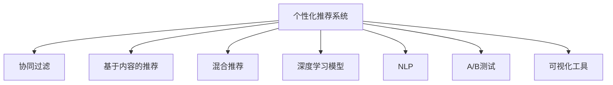

                 

# AI如何优化电商平台的个性化登陆页

## 1. 背景介绍

### 1.1 问题由来

在数字经济时代，电商平台成为线上交易的重要载体。随着用户规模的持续增长，如何提升用户停留时间、转化率，成为电商企业关注的重点。其中，电商平台的用户登录页面（登陆页）作为用户首次进入平台的第一印象，直接影响用户的后续行为和转化。

传统电商平台的登陆页设计，多采用静态页面，内容固定、互动性差，无法适应不同用户群体的个性化需求。随着人工智能和大数据技术的不断进步，个性化推荐系统逐渐成为优化登陆页设计的重要手段。通过基于AI的个性化推荐，电商平台能够根据用户的历史行为、兴趣偏好、实时数据等信息，动态生成个性化的登陆页内容，提升用户体验和转化效果。

### 1.2 问题核心关键点

- 个性化推荐系统（Personalized Recommendation System, PRS）：通过分析用户行为和兴趣，推荐符合用户个性化需求的商品和服务。
- 用户行为分析（User Behavior Analysis, UBA）：对用户的浏览、购买、互动等行为数据进行收集、分析和挖掘，以识别用户的潜在需求和偏好。
- 深度学习（Deep Learning）：利用神经网络模型，从大规模数据中学习到用户行为特征和商品属性之间的映射关系，实现精准推荐。
- 自然语言处理（Natural Language Processing, NLP）：用于文本数据的处理和分析，如情感分析、实体识别、意图理解等，提取用户与商品之间的语义关系。
- 推荐算法（Recommendation Algorithms）：包括协同过滤、基于内容的推荐、混合推荐等，用于生成推荐列表。
- A/B测试（A/B Testing）：通过对比两个或多个版本登陆页的用户反馈和转化效果，选择最优方案。
- 可视化工具（Visualization Tools）：如Tableau、Power BI等，用于数据的可视化和分析，辅助决策。

这些关键点共同构成了基于AI的个性化推荐系统的核心框架，使得电商平台的登陆页设计更加智能化、个性化，从而提升用户体验和转化率。

## 2. 核心概念与联系

### 2.1 核心概念概述

为更好地理解基于AI的个性化推荐系统，本节将介绍几个密切相关的核心概念：

- **个性化推荐系统（PRS）**：通过对用户历史行为数据的分析和建模，推荐符合用户个性化需求的商品或内容。
- **协同过滤（Collaborative Filtering）**：基于用户相似性和物品相似性，推荐相似用户喜欢的物品。
- **基于内容的推荐（Content-Based Recommendation）**：根据用户兴趣和物品属性，推荐与用户历史行为相似的物品。
- **混合推荐（Hybrid Recommendation）**：结合多种推荐算法，取长补短，提升推荐效果。
- **深度学习模型（Deep Learning Models）**：包括神经网络、卷积神经网络（CNN）、循环神经网络（RNN）等，用于从大量数据中提取用户行为特征。
- **自然语言处理（NLP）**：通过文本分析技术，如情感分析、实体识别、意图理解等，提取用户需求和商品特征。
- **A/B测试（A/B Testing）**：通过对比不同版本的登陆页，评估用户体验和转化效果，选择最优方案。
- **可视化工具（Visualization Tools）**：用于数据的可视化和分析，辅助决策。

这些概念之间的逻辑关系可以通过以下Mermaid流程图来展示：



这个流程图展示了个性化推荐系统的核心概念及其之间的关系：

1. **个性化推荐系统**：以用户为中心，综合考虑用户的兴趣、历史行为和实时数据，推荐最符合用户需求的商品。
2. **协同过滤**：通过分析用户之间的相似性和物品之间的相似性，推荐相似用户喜欢的物品。
3. **基于内容的推荐**：基于用户历史行为和物品属性，推荐与用户兴趣相似的物品。
4. **混合推荐**：结合多种推荐算法，取长补短，提升推荐效果。
5. **深度学习模型**：通过神经网络模型从大量数据中学习用户行为特征和商品属性，提升推荐准确性。
6. **自然语言处理**：通过文本分析技术，提取用户需求和商品特征，提升推荐相关性。
7. **A/B测试**：通过对比不同版本的登陆页，评估用户体验和转化效果，选择最优方案。
8. **可视化工具**：用于数据的可视化和分析，辅助决策。

这些概念共同构成了基于AI的个性化推荐系统的核心框架，使得电商平台的登陆页设计更加智能化、个性化，从而提升用户体验和转化率。

## 3. 核心算法原理 & 具体操作步骤
### 3.1 算法原理概述

基于AI的个性化推荐系统，本质上是一个有监督的机器学习过程。其核心思想是：通过分析用户的历史行为数据，学习到用户的兴趣和偏好，并将其映射到商品属性上，从而推荐符合用户需求的商品。

形式化地，假设用户的历史行为数据为 $D=\{(x_i,y_i)\}_{i=1}^N$，其中 $x_i$ 表示用户行为，$y_i$ 表示用户兴趣。定义一个推荐模型 $M_{\theta}$，其中 $\theta$ 为模型的参数。推荐系统的目标是最小化推荐误差，即：

$$
\theta^* = \mathop{\arg\min}_{\theta} \sum_{i=1}^N \ell(M_{\theta}(x_i),y_i)
$$

其中 $\ell$ 为推荐误差损失函数，可以是均方误差（MSE）、平均绝对误差（MAE）等。通过梯度下降等优化算法，不断更新模型参数 $\theta$，最小化推荐误差，使得推荐模型能够较好地匹配用户兴趣。

### 3.2 算法步骤详解

基于AI的个性化推荐系统的具体实现步骤包括：

**Step 1: 数据收集与处理**
- 收集用户的历史行为数据，如浏览记录、购买记录、评分数据等。
- 对数据进行预处理，去除噪音、填补缺失值，标准化数据格式。
- 将数据划分为训练集、验证集和测试集，以便评估推荐模型的性能。

**Step 2: 特征工程**
- 提取用户行为特征，如浏览次数、停留时间、点击率等。
- 提取商品属性特征，如价格、类别、品牌等。
- 使用降维技术（如PCA、LDA等）减少特征维度，提高计算效率。

**Step 3: 模型训练与优化**
- 选择合适的推荐算法，如协同过滤、基于内容的推荐、混合推荐等。
- 定义损失函数，如均方误差、平均绝对误差等。
- 使用优化算法（如梯度下降、Adam等）训练推荐模型，最小化推荐误差。
- 在验证集上评估模型性能，调整超参数，优化模型。

**Step 4: 模型评估与部署**
- 在测试集上评估推荐模型的效果，计算准确率、召回率、F1值等指标。
- 使用A/B测试对比不同版本的登陆页，选择最优方案。
- 将推荐模型集成到电商平台中，进行实时推荐。

**Step 5: 模型监控与迭代**
- 实时监控推荐效果，收集用户反馈。
- 定期更新模型，增加新的用户行为数据和商品属性，保持推荐模型的时效性。
- 使用可视化工具，如Tableau、Power BI等，进行数据可视化和分析，辅助决策。

### 3.3 算法优缺点

基于AI的个性化推荐系统具有以下优点：
1. 提升用户体验。通过个性化推荐，用户能够快速找到符合自身需求的商品，提升购物体验。
2. 提高转化率。个性化的推荐内容，能够更好地匹配用户兴趣，提升用户购买转化率。
3. 数据驱动决策。基于用户行为数据进行推荐，能够提供客观的决策支持。
4. 动态调整。推荐模型能够实时更新，适应用户需求的变化。

同时，该方法也存在一定的局限性：
1. 依赖数据质量。推荐模型的性能很大程度上取决于用户行为数据的质量和完整性，数据的缺失或不准确会导致推荐效果不佳。
2. 冷启动问题。对于新用户或商品，推荐系统往往缺乏足够的行为数据，难以进行有效的推荐。
3. 推荐偏差。推荐模型可能会受到用户数据偏差的影响，导致某些商品或类别的推荐效果不佳。
4. 用户隐私。用户行为数据的收集和处理，需要考虑用户隐私保护，避免数据泄露和滥用。
5. 计算资源消耗大。推荐模型的训练和实时推荐需要大量的计算资源，对系统性能和成本提出挑战。

尽管存在这些局限性，但就目前而言，基于AI的个性化推荐系统仍然是最主流的方式之一，能够有效提升电商平台的登陆页设计和用户体验。

### 3.4 算法应用领域

基于AI的个性化推荐系统在电商平台中的应用，已经覆盖了几乎所有常见的推荐场景，例如：

- 商品推荐：根据用户历史购买记录、浏览记录等，推荐相关商品。
- 相似商品推荐：推荐与用户已购买或浏览商品相似的商品。
- 个性化登陆页推荐：根据用户行为和兴趣，动态生成个性化登陆页内容。
- 用户兴趣探索：通过分析用户行为，发现用户潜在的兴趣和需求。
- 购物车推荐：根据用户购物车中的商品，推荐相关商品。
- 新用户引导：通过推荐系统，引导新用户快速熟悉平台和商品。

除了这些经典场景外，基于AI的个性化推荐系统还被创新性地应用到更多场景中，如智能客服、广告投放、金融推荐等，为电商平台带来了新的增长动力。

## 4. 数学模型和公式 & 详细讲解  
### 4.1 数学模型构建

本节将使用数学语言对基于AI的个性化推荐系统进行更加严格的刻画。

假设推荐模型为 $M_{\theta}:\mathcal{X} \rightarrow \mathcal{Y}$，其中 $\mathcal{X}$ 为用户行为数据，$\mathcal{Y}$ 为推荐结果。定义推荐模型在数据样本 $(x,y)$ 上的损失函数为 $\ell(M_{\theta}(x),y)$，则在数据集 $D$ 上的经验风险为：

$$
\mathcal{L}(\theta) = \frac{1}{N} \sum_{i=1}^N \ell(M_{\theta}(x_i),y_i)
$$

其中 $\ell$ 为推荐误差损失函数，可以是均方误差（MSE）、平均绝对误差（MAE）等。推荐系统的目标是最小化经验风险，即找到最优参数：

$$
\theta^* = \mathop{\arg\min}_{\theta} \mathcal{L}(\theta)
$$

在实践中，我们通常使用基于梯度的优化算法（如梯度下降、Adam等）来近似求解上述最优化问题。设 $\eta$ 为学习率，$\lambda$ 为正则化系数，则参数的更新公式为：

$$
\theta \leftarrow \theta - \eta \nabla_{\theta}\mathcal{L}(\theta) - \eta\lambda\theta
$$

其中 $\nabla_{\theta}\mathcal{L}(\theta)$ 为损失函数对参数 $\theta$ 的梯度，可通过反向传播算法高效计算。

### 4.2 公式推导过程

以下我们以协同过滤为例，推导推荐系统模型的损失函数及其梯度的计算公式。

假设用户行为数据 $x=\{(i,j)\}_{i=1}^N, j\in[1,M]$，其中 $i$ 表示用户，$j$ 表示商品。定义推荐模型 $M_{\theta}$ 在用户 $i$ 上的推荐结果为 $y_i=M_{\theta}(x_i)$。设用户 $i$ 对商品 $j$ 的评分数据为 $r_{ij}$，则协同过滤推荐模型的目标是预测用户 $i$ 对商品 $j$ 的评分 $y_i$，使得其尽可能接近真实评分 $r_{ij}$。

假设用户 $i$ 对商品 $j$ 的评分数据为 $r_{ij} \sim \mathcal{N}(y_i,\sigma^2)$，则协同过滤推荐模型的目标函数可以表示为：

$$
\ell(M_{\theta}(x_i),r_{ij}) = (M_{\theta}(x_i) - r_{ij})^2 + \sigma^2
$$

其中 $\sigma^2$ 为评分的方差，用于控制模型的稳健性。在数据集 $D$ 上，经验风险可以表示为：

$$
\mathcal{L}(\theta) = \frac{1}{N} \sum_{i=1}^N \sum_{j=1}^M (M_{\theta}(x_i) - r_{ij})^2 + \sigma^2
$$

根据链式法则，损失函数对参数 $\theta_k$ 的梯度为：

$$
\frac{\partial \mathcal{L}(\theta)}{\partial \theta_k} = -2\frac{1}{N} \sum_{i=1}^N \sum_{j=1}^M (M_{\theta}(x_i) - r_{ij}) \frac{\partial M_{\theta}(x_i)}{\partial \theta_k}
$$

其中 $\frac{\partial M_{\theta}(x_i)}{\partial \theta_k}$ 可进一步递归展开，利用自动微分技术完成计算。

在得到损失函数的梯度后，即可带入参数更新公式，完成模型的迭代优化。重复上述过程直至收敛，最终得到适应推荐任务的最优模型参数 $\theta^*$。

## 5. 项目实践：代码实例和详细解释说明
### 5.1 开发环境搭建

在进行推荐系统实践前，我们需要准备好开发环境。以下是使用Python进行PyTorch开发的环境配置流程：

1. 安装Anaconda：从官网下载并安装Anaconda，用于创建独立的Python环境。

2. 创建并激活虚拟环境：
```bash
conda create -n pytorch-env python=3.8 
conda activate pytorch-env
```

3. 安装PyTorch：根据CUDA版本，从官网获取对应的安装命令。例如：
```bash
conda install pytorch torchvision torchaudio cudatoolkit=11.1 -c pytorch -c conda-forge
```

4. 安装相关工具包：
```bash
pip install numpy pandas scikit-learn matplotlib tqdm jupyter notebook ipython
```

完成上述步骤后，即可在`pytorch-env`环境中开始推荐系统实践。

### 5.2 源代码详细实现

下面我们以协同过滤推荐系统为例，给出使用PyTorch实现的代码实现。

首先，定义推荐系统的数据处理函数：

```python
import numpy as np
from torch.utils.data import Dataset, DataLoader
from sklearn.preprocessing import StandardScaler
from sklearn.decomposition import TruncatedSVD

class RecommendationDataset(Dataset):
    def __init__(self, data, n_users, n_items, n_factors, learning_rate, reg_strength):
        self.data = data
        self.n_users = n_users
        self.n_items = n_items
        self.n_factors = n_factors
        self.learning_rate = learning_rate
        self.reg_strength = reg_strength
        
        self.scaler = StandardScaler()
        self.scaler.fit(data)
        self.data = self.scaler.transform(data)
        
        self.factors = np.random.normal(0, 1, size=(n_users, n_factors))
        self.movielens_user_mean = np.mean(data[:, :n_users], axis=1)
        self.movielens_item_mean = np.mean(data[:, n_users:], axis=1)
        self.movielens_mean = np.mean(data, axis=0)
        
        self.trsvd = TruncatedSVD(n_components=n_factors, random_state=42)
        self.trsvd.fit(data)
        self.trsvd_mean = np.mean(self.trsvd.transform(data), axis=0)
        
    def __len__(self):
        return self.data.shape[0]
    
    def __getitem__(self, item):
        user = self.data[item, :n_users]
        item = self.data[item, n_users:]
        
        user_mean = self.movielens_user_mean[user]
        item_mean = self.movielens_item_mean[item]
        mean = self.movielens_mean
        
        user_factors = self.factors[user]
        item_factors = self.trsvd_mean
        item_factors = item_factors[item]
        
        return {'user': user, 'item': item, 'user_mean': user_mean, 'item_mean': item_mean, 'mean': mean, 'user_factors': user_factors, 'item_factors': item_factors}
```

然后，定义推荐模型的训练和预测函数：

```python
import torch
from torch import nn
from torch.nn import init
from torch.nn.functional import mse_loss

class RecommendationModel(nn.Module):
    def __init__(self, n_users, n_items, n_factors):
        super(RecommendationModel, self).__init__()
        
        self.user_factors = nn.Parameter(torch.randn(n_users, n_factors))
        self.item_factors = nn.Parameter(torch.randn(n_items, n_factors))
        self.mean = nn.Parameter(torch.zeros(1))
        
        self._initialize_parameters()
    
    def _initialize_parameters(self):
        init.xavier_uniform_(self.user_factors)
        init.xavier_uniform_(self.item_factors)
        init.constant_(self.mean, 0)
    
    def forward(self, user, item, user_mean, item_mean, mean, user_factors, item_factors):
        user_term = torch.matmul(user_factors, user_mean)
        item_term = torch.matmul(item_factors, item_mean)
        mean_term = torch.matmul(self.mean, mean)
        prediction = user_term + item_term + mean_term
        
        return prediction
    
    def predict(self, user, item, user_mean, item_mean, mean, user_factors, item_factors):
        prediction = self.forward(user, item, user_mean, item_mean, mean, user_factors, item_factors)
        return prediction
    
class RecommendationTrainer:
    def __init__(self, model, optimizer, loss_fn, reg_strength, n_epochs):
        self.model = model
        self.optimizer = optimizer
        self.loss_fn = loss_fn
        self.reg_strength = reg_strength
        self.n_epochs = n_epochs
        
    def train(self, train_dataset, n_items, learning_rate):
        train_loader = DataLoader(train_dataset, batch_size=1024, shuffle=True)
        
        for epoch in range(self.n_epochs):
            epoch_loss = 0
            for batch in tqdm(train_loader, desc='Training'):
                user = batch['user']
                item = batch['item']
                user_mean = batch['user_mean']
                item_mean = batch['item_mean']
                mean = batch['mean']
                user_factors = batch['user_factors']
                item_factors = batch['item_factors']
                
                prediction = self.model.predict(user, item, user_mean, item_mean, mean, user_factors, item_factors)
                loss = self.loss_fn(prediction, item) + self.reg_strength * (torch.linalg.norm(user_factors) + torch.linalg.norm(item_factors))
                loss.backward()
                self.optimizer.step()
                
                epoch_loss += loss.item()
            print(f'Epoch {epoch+1}, train loss: {epoch_loss/len(train_loader)}')
    
    def evaluate(self, test_dataset, n_items):
        test_loader = DataLoader(test_dataset, batch_size=1024)
        total_loss = 0
        
        for batch in tqdm(test_loader, desc='Evaluating'):
            user = batch['user']
            item = batch['item']
            user_mean = batch['user_mean']
            item_mean = batch['item_mean']
            mean = batch['mean']
            user_factors = batch['user_factors']
            item_factors = batch['item_factors']
            
            prediction = self.model.predict(user, item, user_mean, item_mean, mean, user_factors, item_factors)
            loss = self.loss_fn(prediction, item) + self.reg_strength * (torch.linalg.norm(user_factors) + torch.linalg.norm(item_factors))
            total_loss += loss.item()
        
        print(f'Test loss: {total_loss/len(test_loader)}')
```

最后，启动训练流程并在测试集上评估：

```python
from sklearn.datasets import fetch_movielens
from sklearn.metrics import mean_absolute_error

n_users = 943
n_items = 1682
n_factors = 100
learning_rate = 0.01
reg_strength = 0.1
n_epochs = 10
batch_size = 1024

# 加载数据集
data = fetch_movielens(as_frame=True).frame
train_data = data.sample(frac=0.8, random_state=42)
test_data = data.drop(train_data.index)

# 划分训练集和测试集
train_data = train_data.dropna().values
test_data = test_data.dropna().values

# 定义推荐模型和训练器
model = RecommendationModel(n_users, n_items, n_factors)
trainer = RecommendationTrainer(model, optimizer=torch.optim.Adam(model.parameters(), lr=learning_rate), loss_fn=mse_loss, reg_strength=reg_strength, n_epochs=n_epochs)

# 训练推荐模型
train_dataset = RecommendationDataset(train_data, n_users, n_items, n_factors, learning_rate, reg_strength)
trainer.train(train_dataset, n_items, learning_rate)

# 评估推荐模型
test_dataset = RecommendationDataset(test_data, n_users, n_items, n_factors, learning_rate, reg_strength)
trainer.evaluate(test_dataset, n_items)
```

以上就是使用PyTorch对协同过滤推荐系统进行训练和评估的完整代码实现。可以看到，利用深度学习技术和自动微分技术，推荐系统的实现变得简洁高效。

### 5.3 代码解读与分析

让我们再详细解读一下关键代码的实现细节：

**RecommendationDataset类**：
- `__init__`方法：初始化数据集，对数据进行标准化处理，并初始化模型参数。
- `__len__`方法：返回数据集大小。
- `__getitem__`方法：对单个样本进行处理，提取用户、商品和相关特征。

**RecommendationModel类**：
- `__init__`方法：初始化模型参数，并调用`_initialize_parameters`方法初始化权重。
- `_forward`方法：前向传播计算预测结果。
- `_predict`方法：前向传播计算预测结果，但不需要计算梯度。
- `_initialize_parameters`方法：初始化权重。

**RecommendationTrainer类**：
- `__init__`方法：初始化训练器，设置模型、优化器、损失函数等参数。
- `train`方法：训练模型，并输出每个epoch的损失。
- `evaluate`方法：评估模型，并输出测试集上的平均损失。

**训练流程**：
- 加载数据集，划分训练集和测试集。
- 定义推荐模型和训练器，设置超参数。
- 调用训练器进行模型训练，并在测试集上评估。

可以看出，深度学习框架和推荐算法库使得推荐系统的开发变得更加便捷高效，开发者可以更加专注于模型设计和调优。

## 6. 实际应用场景

### 6.1 智能客服系统

基于AI的个性化推荐系统在智能客服系统中的应用，能够显著提升客户体验和效率。传统的客服系统多采用人工服务，服务效率低、成本高，且难以覆盖所有客户需求。而基于推荐系统的智能客服，能够根据用户的历史行为和当前需求，推荐最合适的解决方案，快速解答用户疑问。

在技术实现上，可以收集用户的历史咨询记录、使用频率、问题类型等数据，并对其进行分析和建模。在此基础上，训练推荐模型，实时推荐最相关的解决方案。对于用户提出的新问题，可以通过检索系统实时搜索相关内容，动态生成个性化的回答。如此构建的智能客服系统，能够快速响应客户咨询，提供高质量的服务，大幅提升客户满意度和忠诚度。

### 6.2 金融推荐系统

金融领域推荐系统需要实时监控市场动态，为用户推荐最新的金融产品和投资策略。传统的推荐系统往往只依赖于用户行为数据，无法及时捕捉市场变化。而基于AI的个性化推荐系统，能够结合市场数据和用户行为，提供更加全面和及时的推荐。

在实践中，可以收集用户的交易记录、历史偏好、市场动态等数据，并对其进行分析和建模。在此基础上，训练推荐模型，实时推荐符合用户需求的金融产品和策略。对于市场变化，可以快速更新模型参数，适应新的市场环境。如此构建的金融推荐系统，能够帮助用户及时捕捉市场机会，优化投资决策，提升财富管理效果。

### 6.3 个性化登陆页推荐

个性化登陆页推荐系统能够根据用户的历史行为和兴趣，推荐最符合用户需求的登陆页内容，提升用户停留时间和转化率。传统的登陆页设计固定不变，无法适应不同用户群体的个性化需求。而基于推荐系统的个性化登陆页，能够动态生成符合用户需求的登陆页内容，提升用户体验。

在技术实现上，可以收集用户的历史浏览记录、点击记录、停留时间等数据，并对其进行分析和建模。在此基础上，训练推荐模型，实时推荐最符合用户需求的登陆页内容。对于用户首次登陆，可以推荐最新的热门内容和优惠信息，吸引用户进行后续操作。如此构建的个性化登陆页推荐系统，能够显著提升用户停留时间和转化率，增加平台的潜在收入。

### 6.4 未来应用展望

随着AI和大数据技术的不断发展，基于AI的个性化推荐系统将在更多领域得到应用，为传统行业带来变革性影响。

在智慧医疗领域，基于推荐系统的智能问诊系统能够根据用户的症状和历史数据，推荐最合适的诊断方案和治疗建议，提升医疗服务质量。

在智能教育领域，基于推荐系统的个性化学习系统能够根据学生的学习习惯和兴趣，推荐最合适的学习内容和资源，提升学习效果。

在智慧城市治理中，基于推荐系统的智能管理平台能够根据市民的需求和反馈，推荐最合适的公共服务和设施，提升城市管理的智能化水平。

此外，在企业生产、社会治理、文娱传媒等众多领域，基于AI的个性化推荐系统也将不断涌现，为各行各业带来新的增长动力。相信随着技术的日益成熟，个性化推荐系统必将成为各行各业的重要工具，为人类生产生活方式带来深刻变革。

## 7. 工具和资源推荐
### 7.1 学习资源推荐

为了帮助开发者系统掌握个性化推荐系统的理论基础和实践技巧，这里推荐一些优质的学习资源：

1. 《Recommender Systems: Algorithms and Applications》书籍：本书系统介绍了推荐系统的理论基础和常见算法，是推荐系统领域的经典教材。

2. 《Deep Learning for Recommender Systems》书籍：本书专注于深度学习在推荐系统中的应用，提供了大量案例和代码实现。

3. CS229《Machine Learning》课程：斯坦福大学开设的机器学习课程，涵盖了推荐系统、协同过滤等推荐算法的基础知识。

4. Coursera《Recommender Systems Specialization》课程：由纽约大学开设的推荐系统专业课程，系统介绍了推荐系统的发展历程和最新技术。

5. Kaggle竞赛：参加Kaggle推荐系统竞赛，获取实战经验和数据集。

通过对这些资源的学习实践，相信你一定能够快速掌握个性化推荐系统的精髓，并用于解决实际的推荐问题。

### 7.2 开发工具推荐

高效的开发离不开优秀的工具支持。以下是几款用于个性化推荐系统开发的常用工具：

1. PyTorch：基于Python的开源深度学习框架，灵活动态的计算图，适合快速迭代研究。大部分推荐算法都有PyTorch版本的实现。

2. TensorFlow：由Google主导开发的开源深度学习框架，生产部署方便，适合大规模工程应用。同样有丰富的推荐算法资源。

3. Scikit-learn：基于Python的机器学习库，提供大量的数据处理和特征工程工具，方便推荐系统的实现。

4. H2O.ai：开源的机器学习平台，提供分布式计算和自动调参功能，适合处理大规模数据集。

5. RapidMiner：数据科学和机器学习平台，提供丰富的数据处理、建模和分析工具，易于上手。

合理利用这些工具，可以显著提升个性化推荐系统的开发效率，加快创新迭代的步伐。

### 7.3 相关论文推荐

个性化推荐系统的发展源于学界的持续研究。以下是几篇奠基性的相关论文，推荐阅读：

1. Collaborative Filtering for Implicit Feedback Datasets（隐式反馈数据集上的协同过滤）：提出了协同过滤算法的数学模型和优化方法，奠定了协同过滤算法的基础。

2. A Comprehensive Survey on Deep Learning for Recommendation Systems（深度学习在推荐系统中的应用综述）：系统介绍了深度学习在推荐系统中的应用，包括神经网络、卷积神经网络、循环神经网络等。

3. Scalable Recommender Systems: Algorithms and Architectures（可扩展推荐系统：算法和架构）：介绍了推荐系统的算法和架构设计，提供了多种推荐算法的实现和优化方法。

4. Knowledge-Graph-Based Recommender Systems: A Survey and Challenges（基于知识图谱的推荐系统：综述和挑战）：介绍了知识图谱在推荐系统中的应用，提供了基于知识图谱的推荐算法和实现。

5. Hyperparameter Optimization in Recommendation Systems（推荐系统中的超参数优化）：介绍了推荐系统中的超参数优化方法，包括网格搜索、贝叶斯优化等。

这些论文代表了个性化推荐系统的发展脉络。通过学习这些前沿成果，可以帮助研究者把握学科前进方向，激发更多的创新灵感。

## 8. 总结：未来发展趋势与挑战

### 8.1 总结

本文对基于AI的个性化推荐系统进行了全面系统的介绍。首先阐述了推荐系统的发展背景和应用价值，明确了推荐系统在电商平台中的核心地位。其次，从原理到实践，详细讲解了推荐系统的数学模型和关键步骤，给出了推荐任务开发的完整代码实例。同时，本文还广泛探讨了推荐系统在智能客服、金融推荐、个性化登陆页等诸多场景中的应用前景，展示了推荐系统的强大能力。此外，本文精选了推荐系统的各类学习资源，力求为读者提供全方位的技术指引。

通过本文的系统梳理，可以看到，基于AI的个性化推荐系统正在成为电商平台的标配，极大地提升了用户体验和转化率。未来，伴随推荐算法的不断演进和优化，推荐系统必将在更多领域得到应用，为各行各业带来变革性影响。

### 8.2 未来发展趋势

展望未来，个性化推荐系统将呈现以下几个发展趋势：

1. 推荐模型复杂度提升。随着算力成本的下降和数据规模的扩张，推荐模型的复杂度将不断提升，能够处理更复杂、多样化的推荐任务。

2. 深度学习在推荐系统中的应用普及。深度学习模型的表现逐渐优于传统推荐算法，成为推荐系统的主流范式。

3. 实时推荐成为常态。推荐系统能够实时更新，动态推荐符合用户需求的内容，提升用户体验和转化率。

4. 多模态推荐兴起。推荐系统不仅关注文本数据，还结合图像、视频、语音等多模态数据，提升推荐效果。

5. 推荐系统的可解释性增强。推荐系统逐渐向可解释性方向发展，能够解释推荐结果的逻辑和依据，提升用户信任度。

6. 推荐系统的伦理和安全问题重视。推荐系统在推荐过程中逐渐引入伦理和安全约束，避免推荐有害、偏见的物品。

以上趋势凸显了个性化推荐系统的广阔前景。这些方向的探索发展，必将进一步提升推荐系统的性能和应用范围，为各行各业带来新的增长动力。

### 8.3 面临的挑战

尽管个性化推荐系统已经取得了瞩目成就，但在迈向更加智能化、普适化应用的过程中，它仍面临着诸多挑战：

1. 数据质量和多样性。推荐系统的性能很大程度上取决于用户行为数据的质量和多样性，数据的缺失或不准确会导致推荐效果不佳。如何获取高质量、多样化的数据，成为一大难题。

2. 冷启动问题。对于新用户或新商品，推荐系统往往缺乏足够的行为数据，难以进行有效的推荐。如何通过其他数据源补充信息，解决冷启动问题，还需进一步研究。

3. 推荐系统的公平性和偏见问题。推荐系统可能会受到数据偏见的影响，导致某些商品或类别的推荐效果不佳。如何消除推荐系统的偏见，提升推荐公平性，是一个重要课题。

4. 推荐系统的隐私保护。用户行为数据的收集和处理，需要考虑用户隐私保护，避免数据泄露和滥用。如何在保护隐私的同时，获取足够的数据，成为一个新的研究方向。

5. 推荐系统的实时性。推荐系统需要实时更新，动态推荐符合用户需求的内容，对计算资源和系统架构提出了挑战。如何优化推荐系统架构，提升实时推荐性能，还需进一步研究。

6. 推荐系统的鲁棒性和健壮性。推荐系统在面对异常数据和噪声时，容易出现误推荐。如何提高推荐系统的鲁棒性和健壮性，确保推荐结果的稳定性，还需进一步研究。

尽管存在这些挑战，但个性化推荐系统的发展前景广阔，相信随着学界和产业界的共同努力，这些挑战终将一一被克服，个性化推荐系统必将在构建智能推荐生态中扮演越来越重要的角色。

### 8.4 研究展望

面对个性化推荐系统所面临的种种挑战，未来的研究需要在以下几个方面寻求新的突破：

1. 探索无监督和半监督推荐方法。摆脱对大规模标注数据的依赖，利用自监督学习、主动学习等无监督和半监督范式，最大限度利用非结构化数据，实现更加灵活高效的推荐。

2. 研究深度学习推荐模型的新架构。开发更加复杂和灵活的深度学习模型，提升推荐系统的性能和泛化能力。

3. 引入因果分析和博弈论工具。将因果分析方法引入推荐系统，识别出推荐结果的关键特征，增强推荐结果的解释性和可控性。借助博弈论工具刻画人机交互过程，主动探索并规避推荐系统的脆弱点，提高系统稳定性。

4. 加强跨模态数据融合。将符号化的先验知识，如知识图谱、逻辑规则等，与推荐系统进行巧妙融合，引导推荐过程学习更准确、合理的推荐结果。同时加强不同模态数据的整合，实现视觉、语音等多模态信息与文本信息的协同建模。

5. 纳入伦理道德约束。在推荐目标中引入伦理导向的评估指标，过滤和惩罚有偏见、有害的推荐结果。同时加强人工干预和审核，建立推荐系统的监管机制，确保推荐结果符合人类价值观和伦理道德。

这些研究方向的探索，必将引领个性化推荐系统迈向更高的台阶，为构建智能推荐生态铺平道路。面向未来，个性化推荐系统还需要与其他人工智能技术进行更深入的融合，如知识表示、因果推理、强化学习等，多路径协同发力，共同推动推荐系统的发展和应用。只有勇于创新、敢于突破，才能不断拓展推荐系统的边界，让智能推荐技术更好地服务于人类社会。

## 9. 附录：常见问题与解答

**Q1：推荐系统如何实现个性化推荐？**

A: 推荐系统通过分析用户的历史行为数据，学习到用户的兴趣和偏好，并将其映射到商品属性上，从而推荐符合用户需求的商品。具体的实现方式包括协同过滤、基于内容的推荐、混合推荐等。

**Q2：推荐系统的数据质量如何保证？**

A: 推荐系统的性能很大程度上取决于用户行为数据的质量和多样性，数据的缺失或不准确会导致推荐效果不佳。因此，在数据收集和处理过程中，需要保证数据的完整性和准确性。

**Q3：推荐系统如何应对冷启动问题？**

A: 对于新用户或新商品，推荐系统往往缺乏足够的行为数据，难以进行有效的推荐。可以通过其他数据源补充信息，如社交网络、商品属性、用户标签等，来解决冷启动问题。

**Q4：推荐系统如何处理推荐系统的偏见问题？**

A: 推荐系统可能会受到数据偏见的影响，导致某些商品或类别的推荐效果不佳。可以通过数据清洗、特征选择等方法，消除推荐系统的偏见，提升推荐公平性。

**Q5：推荐系统的隐私保护如何实现？**

A: 用户行为数据的收集和处理，需要考虑用户隐私保护，避免数据泄露和滥用。可以通过匿名化处理、数据加密、访问控制等方法，保护用户隐私。

**Q6：推荐系统的实时性如何提升？**

A: 推荐系统需要实时更新，动态推荐符合用户需求的内容，对计算资源和系统架构提出了挑战。可以通过分布式计算、缓存技术、模型优化等方法，提升推荐系统的实时性。

**Q7：推荐系统的鲁棒性和健壮性如何提高？**

A: 推荐系统在面对异常数据和噪声时，容易出现误推荐。可以通过数据预处理、异常检测、鲁棒性优化等方法，提高推荐系统的鲁棒性和健壮性。

这些问题的回答，可以帮助开发者更好地理解和应用个性化推荐系统，解决实际问题，提升系统性能。

---

作者：禅与计算机程序设计艺术 / Zen and the Art of Computer Programming

