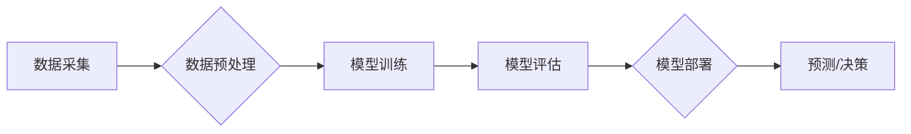

> 人工智能，深度学习，机器学习，算法，应用挑战，伦理问题，可解释性，数据隐私

## 1. 背景介绍

人工智能（AI）技术近年来发展迅速，取得了令人瞩目的成就。从语音识别、图像识别到自然语言处理，AI已经渗透到我们生活的方方面面。然而，将AI技术从实验室推向实际应用仍然面临着诸多挑战。

AI技术的应用潜力巨大，但其发展也引发了广泛的讨论和关注。一方面，AI技术可以帮助我们解决许多复杂问题，提高生产效率，改善生活质量。另一方面，AI技术也存在一些潜在的风险和挑战，例如算法偏见、数据隐私泄露、工作岗位替代等。

## 2. 核心概念与联系

**2.1  人工智能（AI）**

人工智能是指模拟人类智能行为的计算机系统。AI系统能够学习、推理、决策、解决问题等，并不断改进自身性能。

**2.2  机器学习（ML）**

机器学习是人工智能的一个重要分支，它通过算法训练模型，使模型能够从数据中学习规律，并对新数据进行预测或分类。

**2.3  深度学习（DL）**

深度学习是机器学习的一个子领域，它使用多层神经网络来模拟人类大脑的学习过程。深度学习算法能够处理海量数据，并提取出复杂的特征，从而实现更精准的预测和识别。

**2.4  算法**

算法是解决特定问题的步骤或规则。在AI领域，算法是机器学习模型的核心，它决定了模型的学习能力和性能。

**2.5  数据**

数据是AI模型训练和运行的基础。高质量的数据能够帮助模型学习更准确的规律，提高预测精度。

**2.6  应用场景**

AI技术广泛应用于各个领域，例如：

* **医疗保健:** 疾病诊断、药物研发、个性化治疗
* **金融服务:** 风险评估、欺诈检测、投资决策
* **制造业:** 自动化生产、质量控制、 predictive maintenance
* **零售业:** 个性化推荐、库存管理、客户服务
* **交通运输:** 自动驾驶、交通流量优化、物流管理

**2.7  Mermaid 流程图**



## 3. 核心算法原理 & 具体操作步骤

### 3.1  算法原理概述

**3.1.1  监督学习**

监督学习是机器学习的一种类型，它使用标记数据来训练模型。标记数据是指每个样本都带有对应的标签，模型通过学习这些标签之间的关系，能够对新的数据进行预测或分类。

**3.1.2  无监督学习**

无监督学习是机器学习的一种类型，它使用未标记数据来训练模型。模型通过发现数据中的模式和结构，能够对数据进行聚类、降维等操作。

**3.1.3  强化学习**

强化学习是机器学习的一种类型，它通过奖励和惩罚机制来训练模型。模型通过与环境交互，学习如何做出最优决策，以获得最大的奖励。

### 3.2  算法步骤详解

**3.2.1  监督学习算法步骤**

1. 数据采集和预处理
2. 特征工程
3. 模型选择
4. 模型训练
5. 模型评估
6. 模型部署

**3.2.2  无监督学习算法步骤**

1. 数据采集和预处理
2. 特征工程
3. 聚类算法选择
4. 模型训练
5. 模型评估
6. 模型部署

**3.2.3  强化学习算法步骤**

1. 环境建模
2. 策略选择
3. 奖励函数设计
4. 模型训练
5. 模型评估
6. 模型部署

### 3.3  算法优缺点

**3.3.1  监督学习算法**

* **优点:** 准确率高，能够处理分类和回归问题。
* **缺点:** 需要大量的标记数据，容易受到数据偏差的影响。

**3.3.2  无监督学习算法**

* **优点:** 不需要标记数据，能够发现数据中的潜在模式。
* **缺点:** 难以评估模型性能，结果解释性较差。

**3.3.3  强化学习算法**

* **优点:** 能够学习复杂的决策策略，适应动态环境。
* **缺点:** 训练过程复杂，需要大量的试错和奖励机制设计。

### 3.4  算法应用领域

**3.4.1  监督学习算法应用领域**

* 医疗诊断
* 欺诈检测
* 邮件分类
* 图像识别

**3.4.2  无监督学习算法应用领域**

* 客户群分析
* 数据聚类
* 异常检测
* 降维

**3.4.3  强化学习算法应用领域**

* 自动驾驶
* 游戏AI
* 机器人控制
* 优化算法

## 4. 数学模型和公式 & 详细讲解 & 举例说明

### 4.1  数学模型构建

**4.1.1  线性回归模型**

线性回归模型是一种用于预测连续变量的监督学习算法。其数学模型如下：

$$
y = \theta_0 + \theta_1x_1 + \theta_2x_2 + ... + \theta_nx_n + \epsilon
$$

其中：

* $y$ 是预测变量
* $x_1, x_2, ..., x_n$ 是输入特征
* $\theta_0, \theta_1, ..., \theta_n$ 是模型参数
* $\epsilon$ 是误差项

**4.1.2  逻辑回归模型**

逻辑回归模型是一种用于预测分类变量的监督学习算法。其数学模型如下：

$$
p(y=1|x) = \frac{1}{1 + e^{-( \theta_0 + \theta_1x_1 + \theta_2x_2 + ... + \theta_nx_n )}}
$$

其中：

* $p(y=1|x)$ 是预测类别为1的概率
* $x_1, x_2, ..., x_n$ 是输入特征
* $\theta_0, \theta_1, ..., \theta_n$ 是模型参数

### 4.2  公式推导过程

**4.2.1  线性回归模型参数估计**

线性回归模型的参数估计可以使用最小二乘法。最小二乘法的目标是找到一组参数，使得模型预测值与实际值之间的误差平方和最小。

**4.2.2  逻辑回归模型参数估计**

逻辑回归模型的参数估计可以使用最大似然估计法。最大似然估计法的目标是找到一组参数，使得模型能够最大化观测数据的似然概率。

### 4.3  案例分析与讲解

**4.3.1  线性回归模型案例**

假设我们想要预测房屋价格，输入特征包括房屋面积、房间数量、地理位置等。我们可以使用线性回归模型来建立房屋价格预测模型。

**4.3.2  逻辑回归模型案例**

假设我们想要预测客户是否会购买产品，输入特征包括客户年龄、收入、购买历史等。我们可以使用逻辑回归模型来建立客户购买预测模型。

## 5. 项目实践：代码实例和详细解释说明

### 5.1  开发环境搭建

* Python 3.x
* Jupyter Notebook
* scikit-learn
* TensorFlow/PyTorch

### 5.2  源代码详细实现

```python
# 导入必要的库
import pandas as pd
from sklearn.model_selection import train_test_split
from sklearn.linear_model import LinearRegression

# 加载数据
data = pd.read_csv('house_price.csv')

# 选择特征和目标变量
X = data[['area', 'rooms', 'location']]
y = data['price']

# 将数据划分为训练集和测试集
X_train, X_test, y_train, y_test = train_test_split(X, y, test_size=0.2, random_state=42)

# 创建线性回归模型
model = LinearRegression()

# 训练模型
model.fit(X_train, y_train)

# 预测测试集数据
y_pred = model.predict(X_test)

# 评估模型性能
from sklearn.metrics import mean_squared_error
mse = mean_squared_error(y_test, y_pred)
print(f'Mean Squared Error: {mse}')
```

### 5.3  代码解读与分析

* 首先，我们导入必要的库，并加载数据。
* 然后，我们选择特征和目标变量，并将数据划分为训练集和测试集。
* 接下来，我们创建线性回归模型，并使用训练集训练模型。
* 然后，我们使用训练好的模型预测测试集数据。
* 最后，我们评估模型性能，例如使用均方误差（MSE）来衡量模型预测的准确性。

### 5.4  运行结果展示

运行上述代码后，会输出模型的均方误差值。

## 6. 实际应用场景

### 6.1  医疗保健

* **疾病诊断:** AI算法可以分析患者的医疗影像、病史和基因信息，辅助医生诊断疾病。
* **药物研发:** AI算法可以加速药物研发过程，例如预测药物的有效性和安全性。
* **个性化治疗:** AI算法可以根据患者的个体特征，制定个性化的治疗方案。

### 6.2  金融服务

* **风险评估:** AI算法可以分析客户的财务数据，评估其信用风险。
* **欺诈检测:** AI算法可以识别异常交易行为，防止金融欺诈。
* **投资决策:** AI算法可以分析市场数据，辅助投资决策。

### 6.3  制造业

* **自动化生产:** AI算法可以控制机器人和自动化设备，提高生产效率。
* **质量控制:** AI算法可以识别产品缺陷，确保产品质量。
* **预测性维护:** AI算法可以预测设备故障，避免设备停机。

### 6.4  未来应用展望

AI技术的发展将继续推动各个领域的创新和变革。未来，AI技术将在以下领域发挥更重要的作用：

* **自动驾驶:** AI技术将推动自动驾驶汽车的普及。
* **个性化教育:** AI技术将提供个性化的学习体验。
* **智能家居:** AI技术将使家居更加智能化和便捷。

## 7. 工具和资源推荐

### 7.1  学习资源推荐

* **在线课程:** Coursera, edX, Udacity
* **书籍:**
    * 《深度学习》
    * 《机器学习实战》
    * 《Python机器学习》
* **博客:**
    * Towards Data Science
    * Machine Learning Mastery

### 7.2  开发工具推荐

* **Python:** 
* **Jupyter Notebook:** 
* **TensorFlow:** 
* **PyTorch:** 
* **scikit-learn:**

### 7.3  相关论文推荐

* **《ImageNet Classification with Deep Convolutional Neural Networks》**
* **《Attention Is All You Need》**
* **《Deep Reinforcement Learning》**

## 8. 总结：未来发展趋势与挑战

### 8.1  研究成果总结

近年来，AI技术取得了令人瞩目的成就，例如在图像识别、自然语言处理、游戏AI等领域取得了突破。

### 8.2  未来发展趋势

* **模型规模和复杂度提升:** 未来，AI模型将更加庞大复杂，能够处理更复杂的任务。
* **跨模态学习:** AI模型将能够处理多种数据类型，例如文本、图像、音频等。
* **边缘计算:** AI模型将部署在边缘设备上，实现更快速的响应和更低的延迟。

### 8.3  面临的挑战

* **算法可解释性:** 许多AI算法是黑箱模型，难以解释其决策过程。
* **数据隐私和安全:** AI模型的训练和应用需要大量数据，如何保护数据隐私和安全是一个重要挑战。
* **算法偏见:** AI算法可能