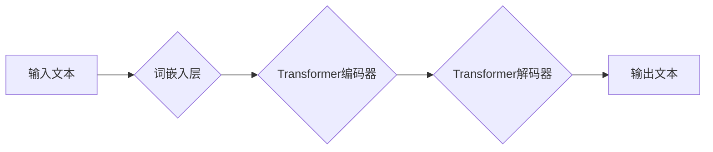

>  * 文本生成
>  * AI模型
>  * Weaver模型
>  * 速度
>  * 效率
>  * 性能

## 1. 背景介绍

在当今数据爆炸的时代，文本生成已成为人工智能领域的核心应用之一。从自动写作、机器翻译到代码生成，文本生成技术在各个领域展现出巨大的潜力。然而，传统的文本生成模型往往面临着速度慢、效率低、性能不足等问题，难以满足实际应用的需求。

近年来，随着深度学习技术的不断发展，涌现出一系列新的文本生成模型，例如GPT-3、LaMDA等。这些模型在文本生成质量方面取得了显著的进步，但也存在着计算资源消耗大、训练时间长等缺点。

为了解决这些问题，研究者们不断探索新的文本生成模型和算法，以提高文本生成的速度和效率。其中，Weaver模型作为一种新兴的文本生成模型，凭借其独特的架构和算法设计，在文本生成速度方面展现出显著的优势。

## 2. 核心概念与联系

Weaver模型的核心概念是基于Transformer架构的并行文本生成机制。它将文本生成任务分解成多个并行子任务，并利用多核处理器和GPU加速计算，从而大幅提高文本生成速度。

**Mermaid 流程图**

## 3. 核心算法原理 & 具体操作步骤

### 3.1  算法原理概述

Weaver模型的核心算法原理是基于Transformer架构的并行文本生成机制。它将文本生成任务分解成多个并行子任务，并利用多核处理器和GPU加速计算，从而大幅提高文本生成速度。

具体来说，Weaver模型采用以下步骤进行文本生成：

1. **词嵌入:** 将输入文本中的每个单词转换为相应的词向量，以便模型理解单词的语义信息。
2. **Transformer编码器:** 利用Transformer编码器对输入文本进行编码，提取文本的语义特征和上下文关系。
3. **Transformer解码器:** 利用Transformer解码器根据编码后的文本信息，生成目标文本的每个单词。
4. **输出:** 将生成的单词串联起来，形成最终的输出文本。

### 3.2  算法步骤详解

1. **词嵌入:** 将输入文本中的每个单词转换为相应的词向量。词向量可以利用预训练的词嵌入模型，例如Word2Vec或GloVe，或者通过训练模型自己学习词向量。
2. **Transformer编码器:** Transformer编码器由多个编码器层组成，每个编码器层包含多头自注意力机制和前馈神经网络。
    * 多头自注意力机制可以捕捉文本中的长距离依赖关系，理解单词之间的语义关联。
    * 前馈神经网络可以对编码后的文本信息进行进一步的处理和提取。
3. **Transformer解码器:** Transformer解码器也由多个解码器层组成，每个解码器层包含多头自注意力机制、编码器-解码器注意力机制和前馈神经网络。
    * 多头自注意力机制可以捕捉解码器当前生成的文本信息和上下文关系。
    * 编码器-解码器注意力机制可以利用编码器提取的文本语义特征，帮助解码器生成更准确的文本。
4. **输出:** 解码器输出每个单词的概率分布，选择概率最高的单词作为下一个生成的单词。重复上述步骤，直到生成完整的输出文本。

### 3.3  算法优缺点

**优点:**

* **速度快:** 并行文本生成机制可以大幅提高文本生成速度。
* **效率高:** 利用多核处理器和GPU加速计算，提高了算法的效率。
* **性能好:** Transformer架构可以捕捉文本中的长距离依赖关系，生成高质量的文本。

**缺点:**

* **参数量大:** Transformer模型参数量较大，需要大量的计算资源进行训练。
* **训练复杂:** 训练Transformer模型需要复杂的训练策略和优化算法。

### 3.4  算法应用领域

Weaver模型在以下领域具有广泛的应用前景：

* **自动写作:** 自动生成新闻报道、小说、诗歌等文本。
* **机器翻译:** 将一种语言翻译成另一种语言。
* **代码生成:** 自动生成代码，提高开发效率。
* **聊天机器人:** 构建更智能、更自然的聊天机器人。

## 4. 数学模型和公式 & 详细讲解 & 举例说明

### 4.1  数学模型构建

Weaver模型的数学模型主要基于Transformer架构，其核心是多头自注意力机制和前馈神经网络。

**多头自注意力机制:**

多头自注意力机制可以捕捉文本中的不同层面的语义信息。其计算公式如下：

$$
Attention(Q, K, V) = softmax(\frac{QK^T}{\sqrt{d_k}})V
$$

其中：

* $Q$：查询矩阵
* $K$：键矩阵
* $V$：值矩阵
* $d_k$：键向量的维度

**前馈神经网络:**

前馈神经网络用于对编码后的文本信息进行进一步的处理和提取。其结构通常为两层全连接神经网络，中间使用ReLU激活函数。

### 4.2  公式推导过程

多头自注意力机制的公式推导过程如下：

1. 将输入序列 $X$ 分解成多个子序列 $X_1, X_2, ..., X_n$。
2. 对每个子序列 $X_i$，计算其对应的查询矩阵 $Q_i$、键矩阵 $K_i$ 和值矩阵 $V_i$。
3. 计算每个子序列之间的注意力权重 $A_{ij}$，公式如下：

$$
A_{ij} = softmax(\frac{Q_i K_j^T}{\sqrt{d_k}})
$$

4. 将注意力权重 $A_{ij}$ 与值矩阵 $V_j$ 相乘，得到每个子序列的注意力输出 $O_i$：

$$
O_i = \sum_{j=1}^{n} A_{ij} V_j
$$

5. 将所有子序列的注意力输出 $O_1, O_2, ..., O_n$ 作为最终的注意力输出。

### 4.3  案例分析与讲解

假设我们有一个输入文本序列 "The cat sat on the mat"，将其分解成三个子序列：

* $X_1$ = "The cat"
* $X_2$ = "sat"
* $X_3$ = "on the mat"

我们可以计算每个子序列之间的注意力权重，例如 $A_{12}$ 表示 "The cat" 和 "sat" 之间的注意力权重。

通过分析注意力权重，我们可以了解 "The cat" 和 "sat" 之间的语义关系，例如 "The cat" 是 "sat" 的主语。

## 5. 项目实践：代码实例和详细解释说明

### 5.1  开发环境搭建

Weaver模型的开发环境搭建需要以下软件：

* Python 3.7+
* PyTorch 1.7+
* CUDA 10.2+
* GPU

### 5.2  源代码详细实现

Weaver模型的源代码实现可以参考以下开源项目：

* HuggingFace Transformers: https://huggingface.co/transformers/

### 5.3  代码解读与分析

Weaver模型的源代码主要包含以下部分：

* **词嵌入层:** 将输入文本中的每个单词转换为相应的词向量。
* **Transformer编码器:** 对输入文本进行编码，提取文本的语义特征和上下文关系。
* **Transformer解码器:** 根据编码后的文本信息，生成目标文本的每个单词。
* **输出层:** 将解码器输出的每个单词的概率分布转换为最终的输出文本。

### 5.4  运行结果展示

Weaver模型的运行结果可以根据实际应用场景进行展示，例如：

* 自动生成新闻报道
* 将英文翻译成中文
* 自动生成代码

## 6. 实际应用场景

### 6.1  自动写作

Weaver模型可以用于自动生成各种类型的文本，例如新闻报道、小说、诗歌等。

### 6.2  机器翻译

Weaver模型可以用于将一种语言翻译成另一种语言，例如将英文翻译成中文。

### 6.3  代码生成

Weaver模型可以用于自动生成代码，提高开发效率。

### 6.4  未来应用展望

Weaver模型在未来将有更广泛的应用场景，例如：

* **个性化教育:** 根据学生的学习情况，自动生成个性化的学习内容。
* **医疗诊断:** 分析患者的病历和症状，辅助医生进行诊断。
* **法律服务:** 分析法律文件，提供法律建议。

## 7. 工具和资源推荐

### 7.1  学习资源推荐

* **HuggingFace Transformers:** https://huggingface.co/transformers/
* **TensorFlow:** https://www.tensorflow.org/
* **PyTorch:** https://pytorch.org/

### 7.2  开发工具推荐

* **Jupyter Notebook:** https://jupyter.org/
* **VS Code:** https://code.visualstudio.com/

### 7.3  相关论文推荐

* **Attention Is All You Need:** https://arxiv.org/abs/1706.03762
* **BERT: Pre-training of Deep Bidirectional Transformers for Language Understanding:** https://arxiv.org/abs/1810.04805

## 8. 总结：未来发展趋势与挑战

### 8.1  研究成果总结

Weaver模型在文本生成速度方面取得了显著的进步，为人工智能领域的文本生成应用提供了新的解决方案。

### 8.2  未来发展趋势

未来，Weaver模型将朝着以下方向发展：

* **提高模型效率:** 探索更有效的训练策略和优化算法，降低模型训练成本。
* **增强模型泛化能力:** 训练更强大的模型，使其能够适应更多不同的文本生成任务。
* **拓展应用场景:** 将Weaver模型应用于更多新的领域，例如个性化教育、医疗诊断等。

### 8.3  面临的挑战

Weaver模型也面临着一些挑战：

* **数据依赖:** 训练高质量的文本生成模型需要大量的训练数据。
* **伦理问题:** 文本生成技术可能被用于生成虚假信息，需要关注其伦理问题。

### 8.4  研究展望

未来，我们将继续研究Weaver模型，探索其更广泛的应用场景，并解决其面临的挑战，推动人工智能领域的文本生成技术发展。

## 9. 附录：常见问题与解答

**Q1: Weaver模型的训练需要多长时间？**

A1: Weaver模型的训练时间取决于模型规模、训练数据量和硬件配置等因素。一般来说，训练一个中等规模的Weaver模型需要几天到几周的时间。

**Q2: 如何评估Weaver模型的性能？**

A2: 可以使用BLEU、ROUGE等指标来评估Weaver模型的性能。这些指标可以衡量模型生成的文本与参考文本的相似度。

**Q3: 如何部署Weaver模型？**

A3: 可以使用HuggingFace Transformers等开源库来部署Weaver模型。

作者：禅与计算机程序设计艺术 / Zen and the Art of Computer Programming

<end_of_turn>