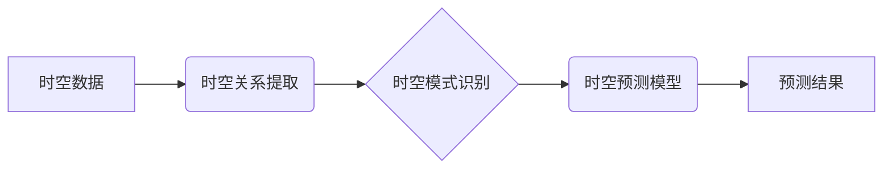

> AI时空建模，时空数据，深度学习，图神经网络，时间序列分析，预测建模，应用场景

## 1. 背景介绍

随着人工智能技术的飞速发展，时空数据在各个领域得到了广泛应用。时空数据包含了时间和空间两个维度的信息，例如地理位置、交通流量、气象数据等。有效地建模和分析时空数据对于理解复杂系统、预测未来趋势、优化资源配置等具有重要意义。

传统的时空建模方法主要依赖于统计学和地理信息系统 (GIS) 技术，但这些方法往往难以处理高维、高复杂度的时空数据。近年来，深度学习技术在时空建模领域取得了显著进展，能够更好地捕捉时空数据的复杂关系和模式。

## 2. 核心概念与联系

**2.1 时空建模的概念**

时空建模是指利用数学模型、算法和技术，对时空数据进行表示、分析和预测。其目标是揭示时空数据的内在规律，并为决策支持、预测分析等提供依据。

**2.2 核心概念**

* **时空数据:** 包含时间和空间两个维度信息的数字化数据。
* **时空关系:** 指不同时空实体之间的时间和空间关联。
* **时空模式:** 指时空数据中重复出现的时空特征和规律。
* **时空预测:** 利用历史时空数据预测未来时空事件或趋势。

**2.3 架构图**



## 3. 核心算法原理 & 具体操作步骤

**3.1 算法原理概述**

时空建模的核心算法主要包括：

* **时空关系提取:** 识别时空数据中不同实体之间的时空关联，例如位置关系、时间间隔等。
* **时空模式识别:** 利用机器学习算法，从时空数据中识别出重复出现的时空特征和规律。
* **时空预测模型:** 建立基于时空数据的预测模型，预测未来时空事件或趋势。

**3.2 算法步骤详解**

**3.2.1 时空关系提取**

1. **数据预处理:** 对时空数据进行清洗、格式转换等预处理操作。
2. **关系提取规则定义:** 根据具体应用场景，定义时空关系的提取规则。
3. **关系提取算法:** 利用规则引擎、机器学习算法等方法，提取时空数据中的时空关系。

**3.2.2 时空模式识别**

1. **特征提取:** 从时空数据中提取时空特征，例如位置、时间、速度、方向等。
2. **模式识别算法:** 利用聚类算法、关联规则挖掘算法等方法，识别时空模式。

**3.2.3 时空预测模型**

1. **模型选择:** 根据具体应用场景，选择合适的时空预测模型，例如时间序列模型、空间回归模型、深度学习模型等。
2. **模型训练:** 利用历史时空数据训练预测模型。
3. **模型评估:** 利用测试数据评估模型的预测精度。

**3.3 算法优缺点**

**3.3.1 时空关系提取算法**

* **优点:** 可以准确提取时空数据中的时空关系。
* **缺点:** 需要定义明确的规则，对数据格式要求较高。

**3.3.2 时空模式识别算法**

* **优点:** 可以发现时空数据中的隐含模式。
* **缺点:** 算法复杂度较高，对数据量要求较高。

**3.3.3 时空预测模型**

* **优点:** 可以对未来时空事件进行预测。
* **缺点:** 预测精度受历史数据质量影响，对模型选择和训练方法要求较高。

**3.4 算法应用领域**

时空建模技术广泛应用于以下领域：

* **交通运输:** 交通流量预测、路线规划、拥堵缓解。
* **城市规划:** 城市发展规划、公共设施布局、人口流动预测。
* **环境监测:** 污染物扩散预测、自然灾害预警、生态环境监测。
* **医疗卫生:** 病情预测、疾病传播模型、医疗资源配置。

## 4. 数学模型和公式 & 详细讲解 & 举例说明

**4.1 数学模型构建**

时空建模通常采用以下数学模型：

* **空间模型:** 使用地理坐标系、距离计算等方法表示空间关系。
* **时间模型:** 使用时间序列、时间间隔等方法表示时间关系。
* **时空模型:** 将空间模型和时间模型结合起来，表示时空关系。

**4.2 公式推导过程**

例如，可以使用欧几里得距离公式计算两个地理位置之间的距离：

$$
d = \sqrt{(x_2 - x_1)^2 + (y_2 - y_1)^2}
$$

其中，$(x_1, y_1)$ 和 $(x_2, y_2)$ 分别表示两个地理位置的经纬度坐标。

**4.3 案例分析与讲解**

假设我们想要预测城市交通流量。我们可以使用以下时空建模方法：

1. **空间模型:** 使用地理信息系统 (GIS) 数据构建城市道路网络模型。
2. **时间模型:** 使用历史交通流量数据构建时间序列模型。
3. **时空模型:** 将空间模型和时间模型结合起来，构建时空交通流量预测模型。

我们可以使用深度学习算法，例如循环神经网络 (RNN) 或长短期记忆网络 (LSTM)，训练时空交通流量预测模型。

## 5. 项目实践：代码实例和详细解释说明

**5.1 开发环境搭建**

* 操作系统: Ubuntu 20.04
* Python 版本: 3.8
* 必要的库: pandas, numpy, scikit-learn, tensorflow

**5.2 源代码详细实现**

```python
import pandas as pd
from sklearn.model_selection import train_test_split
from tensorflow.keras.models import Sequential
from tensorflow.keras.layers import LSTM, Dense

# 加载交通流量数据
data = pd.read_csv('traffic_data.csv')

# 提取时间和流量特征
time_features = data['time']
traffic_features = data['traffic']

# 将时间特征转换为时间序列
time_series = pd.Series(time_features).values.reshape(-1, 1)

# 将流量特征转换为时间序列
traffic_series = pd.Series(traffic_features).values.reshape(-1, 1)

# 将数据分割为训练集和测试集
X_train, X_test, y_train, y_test = train_test_split(time_series, traffic_series, test_size=0.2)

# 建立 LSTM 模型
model = Sequential()
model.add(LSTM(units=50, return_sequences=True, input_shape=(X_train.shape[1], 1)))
model.add(LSTM(units=50))
model.add(Dense(units=1))

# 编译模型
model.compile(loss='mean_squared_error', optimizer='adam')

# 训练模型
model.fit(X_train, y_train, epochs=100, batch_size=32)

# 评估模型
loss = model.evaluate(X_test, y_test)
print('模型损失:', loss)

# 预测未来流量
future_traffic = model.predict(X_test)
```

**5.3 代码解读与分析**

* 代码首先加载交通流量数据，并提取时间和流量特征。
* 然后，将时间特征转换为时间序列，并使用 `train_test_split` 函数将数据分割为训练集和测试集。
* 接下来，建立一个 LSTM 模型，并使用 `compile` 函数编译模型。
* 最后，使用 `fit` 函数训练模型，并使用 `evaluate` 函数评估模型性能。

**5.4 运行结果展示**

运行代码后，会输出模型损失值，以及预测的未来流量值。

## 6. 实际应用场景

**6.1 交通运输**

* **交通流量预测:** 利用时空建模技术预测城市道路交通流量，为交通管理提供决策依据。
* **路线规划:** 根据实时交通状况，为用户提供最优路线规划方案。
* **拥堵缓解:** 通过调整交通信号灯、引导车辆行驶等方式，缓解交通拥堵。

**6.2 城市规划**

* **城市发展规划:** 利用时空数据分析城市人口流动、经济发展等趋势，为城市发展规划提供参考。
* **公共设施布局:** 根据人口分布、交通流量等数据，优化公共设施布局，提高服务效率。
* **环境监测:** 利用时空数据监测城市空气质量、水质等环境指标，及时发现环境问题。

**6.3 其他应用场景**

* **医疗卫生:** 预测疾病流行趋势、优化医疗资源配置。
* **金融:** 预测股票价格、识别金融风险。
* **零售:** 预测商品需求、优化库存管理。

**6.4 未来应用展望**

随着人工智能技术的不断发展，时空建模技术将应用于更多领域，例如：

* **智能城市:** 建立智慧交通、智慧能源、智慧环境等系统，提高城市管理效率。
* **个性化服务:** 根据用户的时空轨迹和行为模式，提供个性化服务。
* **自动驾驶:** 利用时空建模技术，帮助自动驾驶汽车感知周围环境，做出安全决策。

## 7. 工具和资源推荐

**7.1 学习资源推荐**

* **书籍:**
    * 《深度学习》 by Ian Goodfellow, Yoshua Bengio, Aaron Courville
    * 《时空数据分析》 by Michael F. Goodchild
* **在线课程:**
    * Coursera: 深度学习
    * edX: 时空数据分析

**7.2 开发工具推荐**

* **Python:** 广泛应用于时空建模开发，拥有丰富的库和工具。
* **GIS 软件:** ArcGIS, QGIS 等软件可以用于处理地理空间数据。
* **深度学习框架:** TensorFlow, PyTorch 等框架可以用于构建深度学习模型。

**7.3 相关论文推荐**

* **时空建模综述:**
    * "A Survey of Spatiotemporal Data Mining" by J. Han, J. Pei, and Y. Yin
* **深度学习在时空建模中的应用:**
    * "Spatiotemporal Deep Learning for Traffic Flow Prediction" by Y. Wang, X. Li, and Z. Wang

## 8. 总结：未来发展趋势与挑战

**8.1 研究成果总结**

时空建模技术取得了显著进展，能够有效地处理高维、高复杂度的时空数据，并为多个领域提供了解决方案。

**8.2 未来发展趋势**

* **模型复杂度提升:** 开发更复杂、更强大的时空建模模型，例如图神经网络、强化学习等。
* **数据融合:** 将不同类型时空数据融合在一起，构建更全面的时空模型。
* **解释性增强:** 提高时空建模模型的解释性，使模型决策更加透明可信。

**8.3 面临的挑战**

* **数据质量:** 时空数据往往存在噪声、缺失值等问题，需要进行有效的数据清洗和预处理。
* **计算资源:** 训练复杂时空建模模型需要大量的计算资源。
* **隐私保护:** 时空数据往往包含个人隐私信息，需要采取有效措施保护用户隐私。

**8.4 研究展望**

未来时空建模技术将朝着更智能、更可解释、更安全的方向发展，为社会经济发展提供更强大的支持。

## 9. 附录：常见问题与解答

**9.1 什么是时空数据？**

时空数据是指包含时间和空间两个维度信息的数字化数据。例如，地理位置、交通流量、气象数据等。

**9.2 时空建模有哪些应用场景？**

时空建模技术广泛应用于交通运输、城市规划、环境监测、医疗卫生、金融等多个领域。

**9.3 如何选择合适的时空建模算法？**

选择合适的时空建模算法需要根据具体应用场景、数据特点和模型需求进行综合考虑。

**9.4 如何处理时空数据中的噪声和缺失值？**

可以使用数据清洗和预处理方法，例如均值填充、插值法等，处理时空