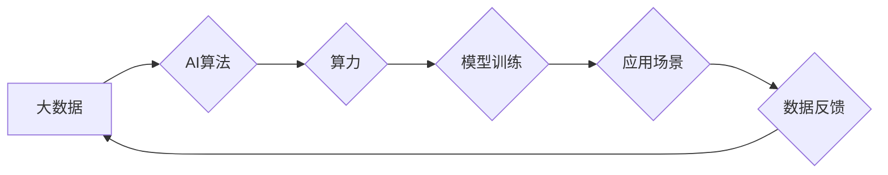

> AI算法, 算力, 大数据, 深度学习, 机器学习, 算法优化, 并行计算, 云计算

## 1. 背景介绍

人工智能 (AI) 正以惊人的速度发展，深刻地改变着我们生活的方方面面。从自动驾驶汽车到智能语音助手，从医疗诊断到金融风险评估，AI 正在无处不在地展现其强大的潜力。

然而，AI 的发展离不开三个关键要素：算法、算力和数据。这三个要素相互依存，共同推动着 AI 的进步。

* **算法** 是 AI 的大脑，它提供了一种解决问题的逻辑和步骤。不同的算法适用于不同的任务，例如分类、预测、识别等。
* **算力** 是 AI 的肌肉，它提供计算能力，使算法能够高效地处理海量数据。随着 AI 模型的复杂性不断增加，对算力的需求也越来越高。
* **数据** 是 AI 的燃料，它为算法提供训练和学习的素材。数据越多，算法训练得越准确，模型的性能也就越好。

## 2. 核心概念与联系

AI 算法、算力和大数据之间的关系可以看作是一个相互促进、共同发展的循环。

**数据驱动算法的训练和优化:** 大数据为 AI 算法提供丰富的训练样本，使算法能够学习到更复杂的模式和规律。同时，算法的优化也能够提高数据处理效率，从而进一步促进数据分析和挖掘。

**算力支撑算法的训练和应用:** 强大的算力能够加速 AI 算法的训练过程，缩短训练时间，提高训练效率。同时，也能够支持 AI 模型在实际应用中的实时推理和处理。

**算法提升数据分析和挖掘能力:** AI 算法能够从海量数据中提取出有价值的信息，发现隐藏的模式和趋势，为数据分析和挖掘提供新的思路和方法。

**Mermaid 流程图:**



## 3. 核心算法原理 & 具体操作步骤

### 3.1  算法原理概述

深度学习是目前 AI 领域最热门的算法之一，它能够模拟人类大脑的神经网络结构，通过多层神经元网络进行特征提取和学习。

深度学习算法的核心原理是**反向传播算法**，它通过不断调整神经网络权重，使模型的预测结果与实际结果之间的误差最小化。

### 3.2  算法步骤详解

1. **数据预处理:** 将原始数据进行清洗、转换和格式化，使其能够被深度学习算法所接受。
2. **网络结构设计:** 根据具体任务需求，设计深度神经网络的结构，包括神经元数量、层数、激活函数等。
3. **模型训练:** 使用训练数据，通过反向传播算法，不断调整神经网络权重，使模型的预测结果越来越准确。
4. **模型评估:** 使用测试数据，评估模型的性能，例如准确率、召回率、F1-score等。
5. **模型调优:** 根据评估结果，调整模型参数，例如学习率、批处理大小等，进一步提高模型性能。
6. **模型部署:** 将训练好的模型部署到实际应用场景中，用于预测和决策。

### 3.3  算法优缺点

**优点:**

* 能够学习到复杂的非线性关系。
* 性能优于传统机器学习算法。
* 能够处理海量数据。

**缺点:**

* 训练时间长，需要大量的算力和数据。
* 模型解释性差，难以理解模型的决策过程。
* 容易过拟合，需要进行数据增强和正则化等技术来避免。

### 3.4  算法应用领域

深度学习算法在各个领域都有广泛的应用，例如：

* **计算机视觉:** 图像识别、物体检测、图像分割等。
* **自然语言处理:** 文本分类、情感分析、机器翻译等。
* **语音识别:** 语音转文本、语音合成等。
* **医疗诊断:** 病理图像分析、疾病预测等。
* **金融风险评估:** 欺诈检测、信用评分等。

## 4. 数学模型和公式 & 详细讲解 & 举例说明

### 4.1  数学模型构建

深度学习模型的核心是神经网络，它由多个层级的神经元组成。每个神经元接收来自上一层的输入信号，经过激活函数处理后，输出到下一层。

**神经网络模型的数学表示:**

$$
y = f(W^L x^L + b^L)
$$

其中:

* $y$ 是输出结果
* $x^L$ 是上一层神经元的输出
* $W^L$ 是当前层的权重矩阵
* $b^L$ 是当前层的偏置向量
* $f$ 是激活函数

### 4.2  公式推导过程

反向传播算法的核心是通过计算梯度，不断调整神经网络的权重和偏置，使模型的预测结果与实际结果之间的误差最小化。

**损失函数:**

$$
L = \frac{1}{N} \sum_{i=1}^{N} (y_i - \hat{y}_i)^2
$$

其中:

* $L$ 是损失函数
* $N$ 是样本数量
* $y_i$ 是实际输出
* $\hat{y}_i$ 是预测输出

**梯度下降算法:**

$$
\theta_{t+1} = \theta_t - \alpha \nabla L(\theta_t)
$$

其中:

* $\theta$ 是权重和偏置的集合
* $\alpha$ 是学习率
* $\nabla L(\theta_t)$ 是损失函数关于权重和偏置的梯度

### 4.3  案例分析与讲解

**举例说明:**

假设我们有一个简单的深度学习模型，用于预测房价。模型的输入是房屋的面积、房间数量等特征，输出是房价。

我们可以使用反向传播算法，通过训练数据，不断调整模型的权重和偏置，使模型的预测结果与实际房价之间的误差最小化。

## 5. 项目实践：代码实例和详细解释说明

### 5.1  开发环境搭建

* **操作系统:** Ubuntu 20.04 LTS
* **编程语言:** Python 3.8
* **深度学习框架:** TensorFlow 2.0
* **其他工具:** Jupyter Notebook, Git

### 5.2  源代码详细实现

```python
import tensorflow as tf

# 定义模型结构
model = tf.keras.models.Sequential([
    tf.keras.layers.Dense(64, activation='relu', input_shape=(4,)),
    tf.keras.layers.Dense(32, activation='relu'),
    tf.keras.layers.Dense(1)
])

# 编译模型
model.compile(optimizer='adam', loss='mse', metrics=['mae'])

# 训练模型
model.fit(x_train, y_train, epochs=10, batch_size=32)

# 评估模型
loss, mae = model.evaluate(x_test, y_test)
print('Loss:', loss)
print('MAE:', mae)
```

### 5.3  代码解读与分析

* **模型结构:** 代码定义了一个简单的深度学习模型，包含三个全连接层。
* **激活函数:** 使用 ReLU 激活函数，可以提高模型的表达能力。
* **损失函数:** 使用均方误差 (MSE) 作为损失函数，用于衡量模型预测结果与实际结果之间的误差。
* **优化器:** 使用 Adam 优化器，可以加速模型训练。
* **训练过程:** 使用训练数据训练模型，设置训练轮数 (epochs) 和批处理大小 (batch_size)。
* **评估过程:** 使用测试数据评估模型的性能，计算损失函数值和平均绝对误差 (MAE)。

### 5.4  运行结果展示

训练完成后，可以将模型应用于新的数据，进行房价预测。

## 6. 实际应用场景

### 6.1  金融领域

* **信用评分:** 使用深度学习算法分析客户的财务数据，预测其信用风险。
* **欺诈检测:** 识别异常交易行为，防止金融欺诈。
* **投资决策:** 分析市场数据，预测股票价格走势。

### 6.2  医疗领域

* **疾病诊断:** 分析病理图像，辅助医生诊断疾病。
* **药物研发:** 预测药物的疗效和副作用。
* **个性化医疗:** 根据患者的基因信息，提供个性化的治疗方案。

### 6.3  零售领域

* **商品推荐:** 根据用户的购买历史和偏好，推荐相关的商品。
* **库存管理:** 预测商品的需求量，优化库存管理。
* **客户服务:** 使用聊天机器人，提供自动化的客户服务。

### 6.4  未来应用展望

随着 AI 技术的不断发展，其应用场景将更加广泛，例如：

* **自动驾驶:** 深度学习算法可以帮助自动驾驶汽车感知周围环境，做出决策。
* **机器人:** 深度学习算法可以使机器人更加智能，能够执行更复杂的任务。
* **个性化教育:** 深度学习算法可以根据学生的学习情况，提供个性化的学习方案。

## 7. 工具和资源推荐

### 7.1  学习资源推荐

* **书籍:**
    * 深度学习 (Deep Learning) - Ian Goodfellow, Yoshua Bengio, Aaron Courville
    * 构建深度学习模型 (Hands-On Machine Learning with Scikit-Learn, Keras & TensorFlow) - Aurélien Géron
* **在线课程:**
    * 深度学习 Specialization - Andrew Ng (Coursera)
    * fast.ai - Practical Deep Learning for Coders
* **博客和网站:**
    * TensorFlow Blog
    * PyTorch Blog
    * Towards Data Science

### 7.2  开发工具推荐

* **深度学习框架:** TensorFlow, PyTorch, Keras
* **编程语言:** Python
* **数据处理工具:** Pandas, NumPy
* **可视化工具:** Matplotlib, Seaborn

### 7.3  相关论文推荐

* **ImageNet Classification with Deep Convolutional Neural Networks** - Alex Krizhevsky, Ilya Sutskever, Geoffrey E. Hinton
* **Attention Is All You Need** - Ashish Vaswani, Noam Shazeer, Niki Parmar, Jakob Uszkoreit, Llion Jones, Aidan N. Gomez, Łukasz Kaiser, Illia Polosukhin
* **BERT: Pre-training of Deep Bidirectional Transformers for Language Understanding** - Jacob Devlin, Ming-Wei Chang, Kenton Lee, Kristina Toutanova

## 8. 总结：未来发展趋势与挑战

### 8.1  研究成果总结

近年来，AI 算法、算力和大数据取得了长足的进步，推动了 AI 技术的快速发展。深度学习算法在各个领域取得了显著的成果，例如图像识别、自然语言处理、语音识别等。

### 8.2  未来发展趋势

* **模型规模和复杂度:** AI 模型将继续朝着更大、更复杂的方向发展，例如千亿参数的模型。
* **数据质量和多样性:** 数据将成为 AI 发展的关键要素，需要更加高质量、多样化的数据来训练模型。
* **算力提升:** 随着 AI 模型的规模不断增长，对算力的需求也将不断增加，需要开发更加高效的算力架构。
* **算法创新:** 需要不断探索新的 AI 算法，例如强化学习、联邦学习等，以解决现有算法的局限性。

### 8.3  面临的挑战

* **数据隐私和安全:** AI 模型的训练需要大量数据，如何保护数据隐私和安全是一个重要的挑战。
* **算法可解释性:** 深度学习模型的决策过程难以理解，如何提高算法的可解释性是一个重要的研究方向。
* **公平性和偏见:** AI 模型可能存在公平性和偏见问题，需要开发更加公平、公正的 AI 系统。

### 8.4  研究展望

未来，AI 技术将继续发展，并在各个领域发挥越来越重要的作用。我们需要加强对 AI 技术的理解和研究，并积极应对 AI 