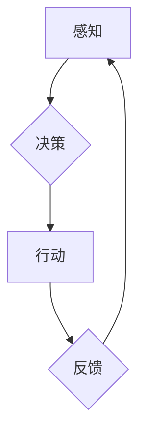

> 智能体 (Agent)、架构、设计模式、状态机、行为树、决策树、强化学习、机器学习、深度学习

## 1. 背景介绍

在人工智能领域，智能体 (Agent) 作为实现智能行为的核心单元，扮演着至关重要的角色。从简单的聊天机器人到复杂的无人驾驶系统，智能体都旨在通过感知环境、做出决策并执行行动，以实现预定的目标。然而，构建高效、灵活、可扩展的智能体架构是一个复杂而具有挑战性的任务。

随着人工智能技术的不断发展，智能体的功能和复杂性也在不断提升。传统的基于规则的智能体架构已经难以满足现代智能体的需求，因此，探索新的智能体架构设计模式和技术成为研究热点。

## 2. 核心概念与联系

智能体的核心概念包括感知、决策和行动。

* **感知:** 智能体通过传感器获取环境信息，例如图像、声音、文本等。
* **决策:** 智能体根据感知到的信息，利用算法和知识库做出选择，决定下一步的行动。
* **行动:** 智能体通过执行器与环境进行交互，例如移动、控制机械臂、发出语音指令等。

**架构设计**

智能体的架构设计旨在将这些核心概念有效地组织和连接起来，形成一个完整的智能体系统。常见的智能体架构设计模式包括：

* **状态机:** 状态机是一种基于状态转换的模型，用于描述智能体的行为模式。
* **行为树:** 行为树是一种树形结构，用于表示智能体的行为决策树，每个节点代表一个行为或条件。
* **决策树:** 决策树是一种树形结构，用于表示智能体的决策过程，每个节点代表一个决策，每个分支代表一个可能的决策结果。

**Mermaid 流程图**



## 3. 核心算法原理 & 具体操作步骤

### 3.1  算法原理概述

智能体决策的核心算法可以分为以下几类：

* **基于规则的算法:** 基于预先定义的规则和知识库，通过推理和匹配来做出决策。
* **基于机器学习的算法:** 利用训练数据学习决策模型，例如决策树、支持向量机、神经网络等。
* **基于强化学习的算法:** 通过与环境交互，学习最优的策略，以最大化奖励。

### 3.2  算法步骤详解

**基于规则的算法:**

1. **知识表示:** 将领域知识表示为规则和事实。
2. **推理引擎:** 使用推理引擎根据规则和事实进行推理，得出结论。
3. **决策生成:** 根据推理结果生成决策。

**基于机器学习的算法:**

1. **数据收集:** 收集大量训练数据。
2. **特征工程:** 从数据中提取特征。
3. **模型训练:** 使用机器学习算法训练模型，学习决策模型。
4. **模型评估:** 使用测试数据评估模型性能。
5. **决策生成:** 将新数据输入模型，得到决策结果。

**基于强化学习的算法:**

1. **环境建模:** 建立环境模型，描述环境状态和动作。
2. **策略学习:** 使用强化学习算法学习最优策略，以最大化奖励。
3. **决策生成:** 根据学习到的策略，选择最优动作。

### 3.3  算法优缺点

| 算法类型 | 优点 | 缺点 |
|---|---|---|
| 基于规则 | 易于理解和维护 | 难以表达复杂知识，缺乏适应性 |
| 基于机器学习 | 能够学习复杂模式，具有适应性 | 需要大量训练数据，解释性差 |
| 基于强化学习 | 能够学习最优策略，适应性强 | 训练过程复杂，需要大量试错 |

### 3.4  算法应用领域

* **机器人控制:** 控制机器人运动和行为。
* **游戏 AI:** 开发游戏中的智能对手。
* **自然语言处理:** 理解和生成自然语言。
* **推荐系统:** 为用户推荐感兴趣的内容。
* **医疗诊断:** 辅助医生进行诊断。

## 4. 数学模型和公式 & 详细讲解 & 举例说明

### 4.1  数学模型构建

智能体决策过程可以抽象为一个马尔可夫决策过程 (MDP)，其中包括以下要素：

* **状态空间 (S):** 智能体可能处于的所有状态。
* **动作空间 (A):** 智能体可以执行的所有动作。
* **转移概率 (P):** 从一个状态执行一个动作后转移到另一个状态的概率。
* **奖励函数 (R):** 智能体在某个状态执行某个动作后获得的奖励。

### 4.2  公式推导过程

MDP 的目标是找到一个最优策略，使得智能体在长期的交互过程中获得最大的总奖励。最优策略可以用价值函数来表示，价值函数表示从某个状态执行某个策略的期望总奖励。

价值函数的更新公式为：

$$
V(s) = \max_a \sum_{s'} P(s'|s,a) [R(s,a,s') + \gamma V(s')]
$$

其中：

* $V(s)$ 是状态 $s$ 的价值函数。
* $a$ 是智能体可以执行的动作。
* $s'$ 是状态 $s$ 执行动作 $a$ 后可能转移到的状态。
* $P(s'|s,a)$ 是从状态 $s$ 执行动作 $a$ 后转移到状态 $s'$ 的概率。
* $R(s,a,s')$ 是在状态 $s$ 执行动作 $a$ 后转移到状态 $s'$ 获得的奖励。
* $\gamma$ 是折扣因子，控制未来奖励的权重。

### 4.3  案例分析与讲解

例如，在一个简单的迷宫环境中，智能体需要找到出口。我们可以将迷宫环境建模为一个 MDP，其中状态空间是迷宫中的每个位置，动作空间是上下左右四个方向，转移概率是根据迷宫地图计算的，奖励函数是到达出口时获得最大奖励，其他状态获得零奖励。

通过使用价值函数更新公式，智能体可以学习最优策略，找到从起点到出口的最短路径。

## 5. 项目实践：代码实例和详细解释说明

### 5.1  开发环境搭建

* 操作系统: Ubuntu 20.04
* Python 版本: 3.8
* 必要的库: numpy, pandas, matplotlib, tensorflow

### 5.2  源代码详细实现

```python
import numpy as np

# 定义状态空间
states = [(0, 0), (0, 1), (1, 0), (1, 1)]

# 定义动作空间
actions = ['up', 'down', 'left', 'right']

# 定义转移概率矩阵
transition_matrix = np.array([
    [[0.8, 0.1, 0.0, 0.1],
     [0.0, 0.9, 0.0, 0.1],
     [0.0, 0.0, 0.8, 0.2],
     [0.1, 0.0, 0.1, 0.8]],

    [[0.1, 0.0, 0.8, 0.1],
     [0.0, 0.9, 0.0, 0.1],
     [0.0, 0.0, 0.8, 0.2],
     [0.1, 0.0, 0.1, 0.8]],

    [[0.0, 0.1, 0.8, 0.1],
     [0.0, 0.0, 0.9, 0.1],
     [0.0, 0.0, 0.8, 0.2],
     [0.1, 0.0, 0.1, 0.8]],

    [[0.1, 0.0, 0.1, 0.8],
     [0.0, 0.9, 0.0, 0.1],
     [0.0, 0.0, 0.8, 0.2],
     [0.1, 0.0, 0.1, 0.8]]
])

# 定义奖励函数
reward_function = {
    (0, 0): -1,
    (0, 1): -1,
    (1, 0): -1,
    (1, 1): 10
}

# 定义价值函数
value_function = np.zeros(len(states))

# 定义学习率
learning_rate = 0.1

# 定义折扣因子
gamma = 0.9

# 训练价值函数
for episode in range(1000):
    current_state = states[0]
    while current_state != (1, 1):
        action = np.argmax(transition_matrix[states.index(current_state)])
        next_state = np.random.choice(len(states), p=transition_matrix[states.index(current_state)][action])
        reward = reward_function[next_state]
        value_function[states.index(current_state)] += learning_rate * (reward + gamma * value_function[next_state] - value_function[states.index(current_state)])
        current_state = states[next_state]

# 打印价值函数
print(value_function)
```

### 5.3  代码解读与分析

这段代码实现了一个简单的迷宫环境中的强化学习算法。

* 首先，定义了状态空间、动作空间、转移概率矩阵和奖励函数。
* 然后，初始化了价值函数，并定义了学习率和折扣因子。
* 最后，使用强化学习算法训练价值函数，并打印最终的价值函数。

### 5.4  运行结果展示

运行代码后，会输出一个包含每个状态价值的数组。

## 6. 实际应用场景

智能体在各个领域都有广泛的应用场景，例如：

* **机器人控制:** 智能体可以控制机器人的运动和行为，例如自动驾驶汽车、工业机器人等。
* **游戏 AI:** 智能体可以作为游戏中的对手，例如围棋、象棋、电子游戏等。
* **自然语言处理:** 智能体可以理解和生成自然语言，例如聊天机器人、机器翻译等。
* **推荐系统:** 智能体可以根据用户的历史行为和偏好，推荐感兴趣的内容，例如电商平台、音乐平台等。
* **医疗诊断:** 智能体可以辅助医生进行诊断，例如分析医学图像、预测疾病风险等。

### 6.4  未来应用展望

随着人工智能技术的不断发展，智能体的应用场景将会更加广泛和深入。例如：

* **个性化教育:** 智能体可以根据学生的学习情况，提供个性化的学习方案。
* **智能家居:** 智能体可以控制家居设备，例如灯光、空调、音响等，提供更加舒适的生活体验。
* **智慧城市:** 智能体可以帮助城市管理者优化交通、能源、环境等方面，提高城市效率和居民生活质量。

## 7. 工具和资源推荐

### 7.1  学习资源推荐

* **书籍:**
    * 《人工智能：现代方法》
    * 《机器学习》
    * 《深度学习》
* **在线课程:**
    * Coursera: 人工智能课程
    * edX: 机器学习课程
    * Udacity: 深度学习课程

### 7.2  开发工具推荐

* **Python:** 广泛用于人工智能开发的编程语言。
* **TensorFlow:** 深度学习框架。
* **PyTorch:** 深度学习框架。
* **OpenAI Gym:** 机器学习算法测试环境。

### 7.3  相关论文推荐

* **Deep Reinforcement Learning: An Overview**
* **AlphaGo: Mastering the Game of Go with Deep Neural Networks and Tree Search**
* **Attention Is All You Need**

## 8. 总结：未来发展趋势与挑战

### 8.1  研究成果总结

近年来，人工智能领域取得了显著进展，智能体