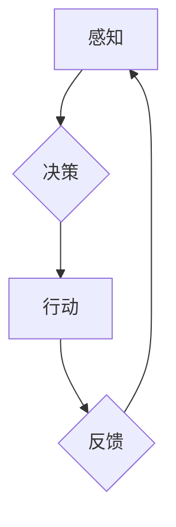

> 智能代理, 强化学习, 深度学习, 自然语言处理, 机器学习, 人工智能

## 1. 背景介绍

在瞬息万变的科技时代，人工智能（AI）正以惊人的速度发展，其核心技术之一——智能代理（Agent）也逐渐成为推动未来科技进步的引擎。智能代理是指能够感知环境、做出决策并采取行动的软件实体。它们能够自主学习、适应环境变化，并完成复杂的任务，在各个领域展现出巨大的应用潜力。

从早期的简单规则型代理到如今的基于深度学习的复杂代理，智能代理技术经历了长足的进步。随着机器学习、深度学习等技术的不断发展，智能代理的智能水平和应用场景也日益拓展。

## 2. 核心概念与联系

智能代理的核心概念包括感知、决策、行动和学习。

* **感知:** 代理通过传感器获取环境信息，例如图像、文本、音频等。
* **决策:** 代理根据感知到的信息，利用算法和策略做出决策，决定下一步的行动。
* **行动:** 代理通过执行器与环境进行交互，例如移动、控制设备、生成文本等。
* **学习:** 代理通过经验积累和反馈，不断调整策略，提高决策能力。

**智能代理架构**



## 3. 核心算法原理 & 具体操作步骤

### 3.1  算法原理概述

智能代理的核心算法主要包括：

* **强化学习 (Reinforcement Learning):** 代理通过与环境交互，获得奖励和惩罚，学习最优策略。
* **深度学习 (Deep Learning):** 利用多层神经网络，学习复杂特征和模式，提高代理的感知和决策能力。
* **搜索算法 (Search Algorithms):** 在有限状态空间中，寻找最优行动序列。

### 3.2  算法步骤详解

**强化学习算法步骤:**

1. **环境建模:** 建立代理与环境的交互模型。
2. **策略初始化:** 初始化代理的策略，例如随机策略。
3. **环境交互:** 代理与环境交互，感知环境状态，采取行动。
4. **奖励反馈:** 环境根据代理的行动提供奖励或惩罚。
5. **策略更新:** 利用奖励信号，更新代理的策略，使其朝着获得更高奖励的方向发展。
6. **重复步骤3-5:** 持续与环境交互，更新策略，直到达到预设的目标或终止条件。

**深度学习算法步骤:**

1. **数据收集:** 收集大量相关数据，例如图像、文本、音频等。
2. **数据预处理:** 对数据进行清洗、转换、增强等预处理操作。
3. **模型构建:** 设计深度神经网络模型，例如卷积神经网络 (CNN)、循环神经网络 (RNN) 等。
4. **模型训练:** 利用训练数据，训练深度神经网络模型，使其学习特征和模式。
5. **模型评估:** 利用测试数据，评估模型的性能，例如准确率、召回率等。
6. **模型调优:** 根据评估结果，调整模型参数，提高模型性能。

### 3.3  算法优缺点

**强化学习:**

* **优点:** 能够学习复杂决策策略，适应动态环境。
* **缺点:** 训练过程可能很长，需要大量的样本数据和计算资源。

**深度学习:**

* **优点:** 能够学习复杂特征，取得优异的性能。
* **缺点:** 需要大量的训练数据，容易过拟合，解释性较差。

### 3.4  算法应用领域

* **游戏:** 智能代理可以学习玩游戏，例如围棋、Go、Dota 2 等。
* **机器人:** 智能代理可以控制机器人完成任务，例如导航、抓取、组装等。
* **自动驾驶:** 智能代理可以帮助车辆自动驾驶，例如路径规划、避障、决策控制等。
* **医疗保健:** 智能代理可以辅助医生诊断疾病、制定治疗方案等。

## 4. 数学模型和公式 & 详细讲解 & 举例说明

### 4.1  数学模型构建

强化学习的数学模型主要包括状态空间、动作空间、奖励函数和价值函数。

* **状态空间 (State Space):** 环境可能存在的各种状态的集合。
* **动作空间 (Action Space):** 代理可以采取的各种动作的集合。
* **奖励函数 (Reward Function):** 奖励代理采取特定动作在特定状态下的函数。
* **价值函数 (Value Function):** 评估代理在特定状态下采取特定策略的长期奖励的函数。

### 4.2  公式推导过程

**价值函数的更新公式:**

$$
V(s) = \max_{\pi} \sum_{t=0}^{\infty} \gamma^t r(s_t, a_t)
$$

其中:

* $V(s)$ 是状态 $s$ 的价值函数。
* $\pi$ 是代理采取的动作策略。
* $r(s_t, a_t)$ 是在状态 $s_t$ 采取动作 $a_t$ 得到的奖励。
* $\gamma$ 是折扣因子，控制未来奖励的权重。

### 4.3  案例分析与讲解

**例子:**

一个智能代理在玩游戏，状态空间是游戏中的所有场景，动作空间是游戏中的所有操作，奖励函数是获得分数，价值函数是评估代理在每个场景下获得分数的总和。

通过强化学习算法，代理可以学习最优策略，例如在哪些场景下采取哪些操作，以获得最高的总分。

## 5. 项目实践：代码实例和详细解释说明

### 5.1  开发环境搭建

* Python 3.x
* TensorFlow 或 PyTorch
* OpenAI Gym

### 5.2  源代码详细实现

```python
import gym
import tensorflow as tf

# 定义代理模型
model = tf.keras.Sequential([
    tf.keras.layers.Dense(128, activation='relu'),
    tf.keras.layers.Dense(64, activation='relu'),
    tf.keras.layers.Dense(env.action_space.n, activation='softmax')
])

# 定义损失函数和优化器
loss_fn = tf.keras.losses.CategoricalCrossentropy()
optimizer = tf.keras.optimizers.Adam()

# 训练代理
for episode in range(num_episodes):
    state = env.reset()
    done = False
    while not done:
        # 选择动作
        action = tf.argmax(model(state), axis=1).numpy()[0]
        # 执行动作
        next_state, reward, done, _ = env.step(action)
        # 更新状态
        state = next_state
        # 计算损失
        with tf.GradientTape() as tape:
            predictions = model(state)
            loss = loss_fn(tf.one_hot(action, depth=env.action_space.n), predictions)
        # 更新模型参数
        gradients = tape.gradient(loss, model.trainable_variables)
        optimizer.apply_gradients(zip(gradients, model.trainable_variables))

# 测试代理
state = env.reset()
while True:
    # 选择动作
    action = tf.argmax(model(state), axis=1).numpy()[0]
    # 执行动作
    next_state, reward, done, _ = env.step(action)
    # 更新状态
    state = next_state
    # 显示状态
    env.render()
    if done:
        break
```

### 5.3  代码解读与分析

* 代码首先定义了代理模型，这是一个简单的多层神经网络。
* 然后定义了损失函数和优化器，用于训练代理模型。
* 训练过程是一个循环，代理在环境中交互，根据奖励信号更新模型参数。
* 测试过程是代理在环境中执行动作，并显示状态。

### 5.4  运行结果展示

运行代码后，代理将在环境中执行动作，并尝试完成任务。例如，在 OpenAI Gym 的 CartPole 环境中，代理将尝试平衡杆。

## 6. 实际应用场景

### 6.1  智能客服

智能代理可以作为智能客服，通过自然语言处理技术理解用户需求，并提供自动回复和解决方案。

### 6.2  个性化推荐

智能代理可以根据用户的行为数据和偏好，提供个性化的商品、内容和服务推荐。

### 6.3  自动交易

智能代理可以根据市场数据和交易策略，自动进行股票、期货等金融资产的交易。

### 6.4  未来应用展望

随着人工智能技术的不断发展，智能代理的应用场景将更加广泛，例如：

* **医疗诊断:** 智能代理可以辅助医生诊断疾病，提高诊断准确率。
* **教育教学:** 智能代理可以提供个性化的学习辅导，提高学习效率。
* **城市管理:** 智能代理可以帮助城市管理部门优化交通流量、能源消耗等。

## 7. 工具和资源推荐

### 7.1  学习资源推荐

* **书籍:**
    * 《Reinforcement Learning: An Introduction》 by Richard S. Sutton and Andrew G. Barto
    * 《Deep Learning》 by Ian Goodfellow, Yoshua Bengio, and Aaron Courville
* **在线课程:**
    * Coursera: Reinforcement Learning Specialization
    * Udacity: Deep Learning Nanodegree

### 7.2  开发工具推荐

* **TensorFlow:** 开源深度学习框架
* **PyTorch:** 开源深度学习框架
* **OpenAI Gym:** 强化学习环境库

### 7.3  相关论文推荐

* **Deep Reinforcement Learning with Double Q-learning**
* **Proximal Policy Optimization Algorithms**
* **Attention Is All You Need**

## 8. 总结：未来发展趋势与挑战

### 8.1  研究成果总结

智能代理技术取得了长足的进步，在游戏、机器人、自动驾驶等领域取得了显著成果。

### 8.2  未来发展趋势

* **更强大的学习能力:** 研究更强大的强化学习算法，使代理能够学习更复杂的任务。
* **更安全的代理:** 研究更安全的代理，避免代理出现不可预知的行为。
* **更广泛的应用场景:** 将智能代理应用到更多领域，例如医疗、教育、城市管理等。

### 8.3  面临的挑战

* **数据获取和标注:** 强化学习算法需要大量的训练数据，获取和标注数据成本高。
* **模型解释性:** 深度学习模型的决策过程难以解释，这可能导致代理的行为不可预测。
* **伦理问题:** 智能代理的应用可能引发伦理问题，例如代理的决策是否公平、透明、可控等。

### 8.4  研究展望

未来，智能代理技术将继续发展，并对社会产生深远影响。我们需要加强对智能代理技术的研究，解决技术挑战，并制定相应的伦理规范，确保智能代理技术安全、可控、惠及人类。

## 9. 附录：常见问题与解答

**常见问题:**

* **什么是智能代理？**

智能代理是指能够感知环境、做出决策并采取行动的软件实体。

* **智能代理有哪些应用场景？**

智能代理的应用场景非常广泛，例如游戏、机器人、自动驾驶、智能客服、个性化推荐等。

* **如何训练智能代理？**

智能代理的训练通常使用强化学习算法，通过与环境交互，学习最优策略。

* **智能代理有哪些挑战？**

智能代理面临的数据获取、模型解释性、伦理问题等挑战。

**作者：禅与计算机程序设计艺术 / Zen and the Art of Computer Programming**


<end_of_turn>