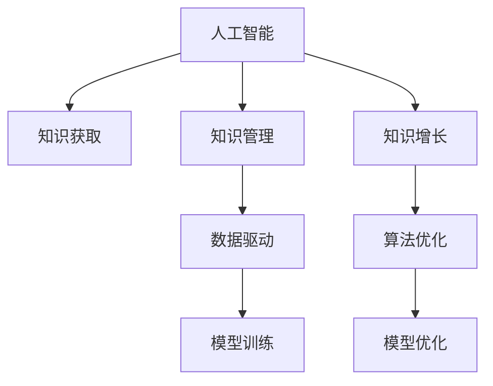

                 

# AI如何助力人类知识增长

> 关键词：AI技术,知识增长,知识管理,知识获取,数据驱动,算法优化

## 1. 背景介绍

在信息爆炸的时代，知识的积累与更新成为了人类社会发展的关键。传统知识获取方式已无法满足现代社会对信息量的需求，如何在海量信息中找到有价值的内容，并将其转化为有用的知识，成为了一个重要议题。

人工智能（AI）作为现代技术的重要组成部分，以其强大的数据处理和分析能力，为人类知识增长提供了新的可能性。AI不仅能够快速处理大量信息，还能够通过智能算法发现知识间的内在联系，从而加速知识的生成、传播与应用。

## 2. 核心概念与联系

### 2.1 核心概念概述

为了更好地理解AI如何助力人类知识增长，本节将介绍几个关键概念及其之间的关系：

- **人工智能（AI）**：通过算法和计算能力，使计算机能够执行通常需要人类智能的任务，包括感知、学习、推理、规划等。
- **知识获取**：从大量数据中提取有用的信息，形成系统化的知识结构。
- **知识管理**：对知识进行组织、存储和利用，确保知识能够被高效地检索、共享和应用。
- **知识增长**：通过AI技术对知识进行智能处理和融合，形成新的、更高级的知识形态。
- **数据驱动**：利用大量数据训练AI模型，使模型能够从数据中学习规律，作出准确预测和决策。
- **算法优化**：不断优化算法性能，提高AI系统处理数据的效率和效果。

这些概念之间的联系可以通过以下Mermaid流程图来展示：



这个流程图展示了AI技术如何通过知识获取、知识管理和知识增长三个环节，来加速人类知识的积累与进步。其中，数据驱动和算法优化是贯穿始终的关键要素。

## 3. 核心算法原理 & 具体操作步骤

### 3.1 算法原理概述

AI助力人类知识增长的核心原理，是通过数据驱动的方式，利用算法优化来不断优化知识获取和知识管理过程。

**数据驱动**：在AI技术中，数据是知识和智慧的源泉。通过收集、清洗和标注大量数据，AI模型能够学习数据的规律和模式，从而在特定任务上表现出色。数据驱动的AI技术，能够从数据中挖掘出有价值的信息，帮助人类发现新知识、理解复杂问题。

**算法优化**：AI的核心在于算法。通过不断优化算法，AI能够更高效地处理数据、识别模式，提高知识获取的准确性和速度。常见的算法优化技术包括模型压缩、分布式训练、混合精度计算等。

### 3.2 算法步骤详解

AI助力知识增长的具体算法步骤包括数据预处理、模型训练、知识抽取、知识融合和知识应用等。

**数据预处理**：对原始数据进行清洗、去噪、标注等操作，确保数据的准确性和可用性。常用的数据预处理方法包括数据清洗、特征提取、归一化等。

**模型训练**：选择合适的AI模型，并利用标注好的数据集对其进行训练。训练过程中，通过反向传播算法不断调整模型参数，使模型能够准确预测新数据。常用的AI模型包括深度学习模型（如CNN、RNN、LSTM等）和强化学习模型。

**知识抽取**：通过模型训练，从数据中抽取有用的知识。知识抽取通常包括实体识别、关系抽取、情感分析等任务。

**知识融合**：将抽取出的知识进行整合，形成系统化的知识结构。知识融合过程包括知识分类、知识关联、知识存储等。

**知识应用**：将抽取和融合好的知识应用于实际问题中，如自动问答、智能推荐、知识图谱构建等。知识应用过程通常需要结合具体场景进行优化。

### 3.3 算法优缺点

AI助力人类知识增长的算法具有以下优点：

- **高效性**：通过数据驱动，AI能够快速处理大量数据，发现其中的规律和模式，加速知识获取和应用。
- **广泛性**：AI技术可以应用于多种场景，从医疗、金融到教育、娱乐，无处不在。
- **智能性**：AI模型能够自我学习和优化，不断提高自身的准确性和效率。

然而，AI技术在助力知识增长过程中也存在一些缺点：

- **依赖高质量数据**：AI模型的性能高度依赖于数据质量。如果数据标注不准确或数据质量较差，模型的预测结果也会受到影响。
- **算法复杂度高**：一些复杂的AI算法，如深度学习模型，需要消耗大量计算资源和存储空间，对硬件设备的要求较高。
- **黑盒问题**：部分AI模型如深度神经网络，其内部工作机制难以解释，不易于理解和调试。
- **伦理和隐私问题**：AI模型在处理敏感数据时，可能存在隐私泄露和伦理道德问题。

### 3.4 算法应用领域

AI助力人类知识增长的算法广泛应用于以下领域：

- **医疗领域**：AI通过分析医疗数据，辅助医生进行疾病诊断、治疗方案推荐等，提高医疗服务质量和效率。
- **教育领域**：AI通过智能辅导、个性化推荐等，提升学生的学习效果和教育资源的利用率。
- **金融领域**：AI通过风险评估、智能投顾等，提升金融决策的准确性和效率。
- **零售领域**：AI通过需求预测、智能推荐等，优化供应链管理，提升用户体验。
- **娱乐领域**：AI通过内容推荐、语音交互等，提升用户体验和互动性。

## 4. 数学模型和公式 & 详细讲解 & 举例说明

### 4.1 数学模型构建

本节将使用数学语言对AI助力人类知识增长的方法进行更加严格的刻画。

设 $D$ 为数据集，$x_i \in X$ 为输入特征，$y_i \in Y$ 为输出标签。目标是训练一个函数 $f(x; \theta)$，使得 $f(x; \theta)$ 能够通过数据集 $D$ 学习到输入和输出之间的映射关系。

数据驱动的AI模型通常采用监督学习（Supervised Learning）或无监督学习（Unsupervised Learning）的方式进行训练。监督学习的目标是最大化训练数据上的损失函数 $L(f)$，通常采用交叉熵损失函数，即：

$$
L(f) = -\frac{1}{N}\sum_{i=1}^N [y_i \log f(x_i; \theta) + (1 - y_i) \log (1 - f(x_i; \theta))]
$$

无监督学习的目标则是最大化数据集 $D$ 上的似然函数 $p(x; \theta)$，通过最大化似然函数，使模型能够学习数据的概率分布。

### 4.2 公式推导过程

以下以深度学习模型为例，推导其数学模型和优化目标函数。

深度学习模型通常由多层神经网络组成，每个神经元都有一组权重参数 $\theta$。模型的输出为 $f(x; \theta) = W^T \sigma(Wx + b)$，其中 $W$ 为权重矩阵，$b$ 为偏置向量，$\sigma$ 为激活函数。

假设模型的损失函数为均方误差损失，即 $L(f) = \frac{1}{N} \sum_{i=1}^N (y_i - f(x_i; \theta))^2$。通过反向传播算法，求得损失函数对参数 $\theta$ 的梯度，更新模型参数。

反向传播算法步骤如下：

1. 前向传播计算模型的预测值 $\hat{y} = f(x; \theta)$。
2. 计算损失函数对预测值的梯度 $\frac{\partial L}{\partial \hat{y}}$。
3. 通过链式法则，反向传播计算损失函数对模型参数 $\theta$ 的梯度 $\frac{\partial L}{\partial \theta}$。
4. 使用梯度下降等优化算法，更新模型参数 $\theta$。

### 4.3 案例分析与讲解

以医疗领域为例，AI技术可以通过分析患者病历、基因数据、临床试验等数据，辅助医生进行疾病诊断和治疗方案推荐。

假设医疗数据集 $D$ 包含 $N$ 个样本，每个样本包含患者的病历信息 $x_i$ 和对应的诊断结果 $y_i$。通过训练一个二分类模型 $f(x; \theta)$，使得模型能够根据患者病历信息，预测其是否患有某种疾病。

训练过程中，采用交叉熵损失函数，通过反向传播算法不断调整模型参数，直到模型在验证集上表现良好。训练好的模型可以用于新患者的疾病诊断，提高了诊断的准确性和效率。

## 5. 项目实践：代码实例和详细解释说明

### 5.1 开发环境搭建

在进行AI知识增长项目的开发时，需要准备一个合适的开发环境。以下是使用Python进行TensorFlow开发的环境配置流程：

1. 安装Anaconda：从官网下载并安装Anaconda，用于创建独立的Python环境。
2. 创建并激活虚拟环境：
```bash
conda create -n tf-env python=3.8 
conda activate tf-env
```
3. 安装TensorFlow：根据CUDA版本，从官网获取对应的安装命令。例如：
```bash
conda install tensorflow tensorflow-gpu -c tf -c conda-forge
```
4. 安装各类工具包：
```bash
pip install numpy pandas scikit-learn matplotlib tqdm jupyter notebook ipython
```
完成上述步骤后，即可在`tf-env`环境中开始开发实践。

### 5.2 源代码详细实现

下面我们以医疗领域中的疾病诊断为例，给出使用TensorFlow进行AI知识增长的PyTorch代码实现。

首先，定义医疗数据集和模型：

```python
import tensorflow as tf
from tensorflow.keras.layers import Input, Dense
from tensorflow.keras.models import Model

# 定义输入层
inputs = Input(shape=(input_shape,))

# 定义神经网络层
x = Dense(units=64, activation='relu')(inputs)
x = Dense(units=32, activation='relu')(x)
x = Dense(units=num_classes, activation='softmax')(x)

# 定义输出层
outputs = Dense(units=num_classes, activation='softmax')(x)

# 定义模型
model = Model(inputs=inputs, outputs=outputs)
```

然后，定义损失函数和优化器：

```python
from tensorflow.keras.losses import CategoricalCrossentropy

# 定义损失函数
loss_fn = CategoricalCrossentropy()

# 定义优化器
optimizer = tf.keras.optimizers.Adam(learning_rate=0.001)
```

接着，定义训练和评估函数：

```python
from tensorflow.keras.optimizers import SGD
from tensorflow.keras.metrics import CategoricalAccuracy

# 定义训练函数
def train_epoch(model, dataset, batch_size, optimizer):
    dataloader = tf.data.Dataset.from_tensor_slices((dataset)).batch(batch_size).shuffle(buffer_size=1024).repeat().prefetch(buffer_size=32)
    for batch in dataloader:
        with tf.GradientTape() as tape:
            x, y = batch
            logits = model(x)
            loss = loss_fn(y, logits)
        grads = tape.gradient(loss, model.trainable_variables)
        optimizer.apply_gradients(zip(grads, model.trainable_variables))
        train_loss += loss.numpy() / num_batches

# 定义评估函数
def evaluate(model, dataset, batch_size):
    dataloader = tf.data.Dataset.from_tensor_slices((dataset)).batch(batch_size).shuffle(buffer_size=1024).repeat().prefetch(buffer_size=32)
    eval_loss, eval_accuracy = tf.keras.metrics.CategoricalAccuracy()(np.argmax(model(x), axis=1), y)
    eval_loss = eval_loss.numpy() / num_batches
    eval_accuracy = eval_accuracy.numpy() / num_batches
```

最后，启动训练流程并在测试集上评估：

```python
epochs = 10
batch_size = 64

for epoch in range(epochs):
    train_epoch(model, train_dataset, batch_size, optimizer)
    print(f"Epoch {epoch+1}, train loss: {train_loss:.3f}")
    
    print(f"Epoch {epoch+1}, eval results:")
    evaluate(model, test_dataset, batch_size)
    
print("Final eval results:")
evaluate(model, test_dataset, batch_size)
```

以上就是使用TensorFlow对医疗诊断任务进行AI知识增长的完整代码实现。可以看到，TensorFlow提供了丰富的API接口，可以方便地搭建深度学习模型，进行数据预处理和模型训练。

### 5.3 代码解读与分析

让我们再详细解读一下关键代码的实现细节：

**定义数据集和模型**：
- `Input`类定义输入层，`Dense`类定义神经网络层。
- 通过多层神经网络组成模型，并设置激活函数。
- 输出层使用`softmax`函数，用于多分类任务。

**定义损失函数和优化器**：
- `CategoricalCrossentropy`定义分类任务上的交叉熵损失函数。
- `Adam`优化器用于模型参数的优化。

**定义训练和评估函数**：
- `tf.data.Dataset`用于处理数据集，支持批处理、随机化、预取等操作。
- `tf.GradientTape`用于计算梯度。
- `model.trainable_variables`获取可训练参数。
- `optimizer.apply_gradients`更新模型参数。

**训练和评估过程**：
- 在每个epoch中，进行模型训练，记录训练损失。
- 在测试集上评估模型性能，输出损失和准确率。

通过代码实现的逐步讲解，相信你一定能够理解AI技术在知识增长中的实际应用。

## 6. 实际应用场景

### 6.1 智能医疗

AI技术在医疗领域的应用场景非常广泛。通过分析医疗数据，AI可以帮助医生进行疾病诊断、治疗方案推荐、病程管理等。

例如，在肿瘤治疗中，AI可以分析患者的基因数据、影像数据等，辅助医生制定个性化的治疗方案。AI还可以实时监测患者的生命体征，及时发现异常情况，并发出警报。

### 6.2 教育领域

AI技术在教育领域中的应用同样不可小觑。通过分析学生的学习行为和成绩，AI可以帮助教师制定个性化的教学方案，提供智能辅导和学习建议。

例如，AI可以分析学生的作业和测试成绩，发现其薄弱环节，并根据薄弱环节推荐相应的学习资源。AI还可以与学生进行自然语言互动，解答学生的问题，提供学习支持。

### 6.3 金融领域

金融领域中的AI应用包括风险评估、智能投顾、市场分析等。通过分析大量的金融数据，AI可以帮助投资者制定投资策略，降低风险。

例如，AI可以分析股票、债券等金融产品的历史数据，预测其未来的走势，帮助投资者做出决策。AI还可以分析市场舆情，发现投资机会，提高投资收益。

### 6.4 未来应用展望

随着AI技术的不断进步，其在知识增长中的应用前景将更加广阔。未来AI有望在更多领域实现突破：

- **自动驾驶**：AI可以分析道路数据，辅助驾驶车辆做出决策，提高道路安全性和交通效率。
- **智能制造**：AI可以分析生产数据，优化生产流程，提高生产效率和产品质量。
- **智能城市**：AI可以分析城市数据，优化城市管理，提升城市运行效率和居民生活质量。

总之，AI技术在知识增长中的应用，将带来新的技术革命，推动社会向更智能、更高效的方向发展。

## 7. 工具和资源推荐

### 7.1 学习资源推荐

为了帮助开发者系统掌握AI知识增长的理论基础和实践技巧，这里推荐一些优质的学习资源：

1. 《深度学习》系列书籍：由深度学习领域的权威专家撰写，系统介绍了深度学习的原理和应用。
2. Coursera《深度学习专项课程》：由深度学习领域的知名教授授课，涵盖深度学习的各个方面。
3. TensorFlow官方文档：提供了丰富的教程和API文档，是学习TensorFlow的最佳资源。
4. Kaggle竞赛平台：提供了大量数据集和开源代码，是学习和实践AI技术的好地方。

通过对这些资源的学习实践，相信你一定能够快速掌握AI技术在知识增长中的应用，并用于解决实际的AI问题。

### 7.2 开发工具推荐

高效的开发离不开优秀的工具支持。以下是几款用于AI知识增长开发的常用工具：

1. TensorFlow：由Google主导开发的开源深度学习框架，生产部署方便，适合大规模工程应用。
2. PyTorch：基于Python的开源深度学习框架，灵活动态的计算图，适合快速迭代研究。
3. Jupyter Notebook：开源的交互式笔记本，支持代码、数据、结果的共享和协作。
4. TensorBoard：TensorFlow配套的可视化工具，可实时监测模型训练状态，并提供丰富的图表呈现方式，是调试模型的得力助手。
5. Weights & Biases：模型训练的实验跟踪工具，可以记录和可视化模型训练过程中的各项指标，方便对比和调优。

合理利用这些工具，可以显著提升AI知识增长任务的开发效率，加快创新迭代的步伐。

### 7.3 相关论文推荐

AI技术在知识增长中的应用领域非常广泛，相关研究涉及众多领域，以下是几篇奠基性的相关论文，推荐阅读：

1. Google DeepMind的AlphaGo：通过深度学习技术，AlphaGo在围棋领域取得了突破性的成果，展示了AI在复杂决策中的潜力。
2. Google Brain的BERT模型：通过预训练和微调技术，BERT模型在自然语言处理任务上取得了SOTA，展示了AI在自然语言理解中的强大能力。
3. Facebook的GPT-3模型：通过大规模预训练和微调技术，GPT-3模型在生成式语言任务上取得了突破性的成果，展示了AI在生成式任务中的潜力。
4. IBM的Watson：通过自然语言理解和知识推理技术，Watson在医疗、金融等领域取得了广泛应用，展示了AI在实际应用中的价值。

这些论文代表了大规模AI模型在知识增长中的应用趋势，通过学习这些前沿成果，可以帮助研究者把握学科前进方向，激发更多的创新灵感。

## 8. 总结：未来发展趋势与挑战

### 8.1 总结

本文对AI助力人类知识增长的方法进行了全面系统的介绍。首先阐述了AI技术在知识增长中的作用，明确了数据驱动和算法优化在知识获取和知识管理中的重要性。其次，从原理到实践，详细讲解了AI知识增长的数学模型和操作步骤，给出了具体的代码实现和分析。同时，本文还广泛探讨了AI技术在医疗、教育、金融等领域的实际应用，展示了AI技术在知识增长中的巨大潜力。

通过本文的系统梳理，可以看到，AI技术在知识增长中的应用，不仅能够加速知识获取和应用，还能提升知识管理的效率和效果。未来，伴随AI技术的不断进步，AI将在更多领域实现突破，为知识增长带来新的可能。

### 8.2 未来发展趋势

展望未来，AI技术在知识增长中的应用将呈现以下几个发展趋势：

1. **自动化程度提高**：随着AI技术的不断进步，知识获取和知识管理过程将越来越自动化，减少了人工干预的环节，提高了效率。
2. **跨领域融合**：AI技术将与其他技术（如区块链、物联网等）进行更深入的融合，推动跨领域的知识增长。
3. **多模态融合**：AI技术将更好地整合多模态数据，提高知识获取和管理的全面性和准确性。
4. **泛化能力增强**：AI技术将不断提高泛化能力，能够从复杂环境中抽取有价值的信息，生成高质的新知识。
5. **伦理和隐私保护**：AI技术将更加重视伦理和隐私保护，确保知识获取和管理的合规性和安全性。

以上趋势凸显了AI技术在知识增长中的广阔前景。这些方向的探索发展，将进一步提升AI技术在知识增长中的应用，为社会发展和人类进步提供新的动力。

### 8.3 面临的挑战

尽管AI技术在知识增长中的应用取得了显著进展，但在迈向更加智能化、普适化应用的过程中，它仍面临着诸多挑战：

1. **数据质量问题**：AI技术的性能高度依赖于数据质量。如果数据标注不准确或数据质量较差，模型的预测结果也会受到影响。
2. **算法复杂度高**：一些复杂的AI算法，如深度学习模型，需要消耗大量计算资源和存储空间，对硬件设备的要求较高。
3. **模型鲁棒性不足**：AI模型面对新数据时，泛化性能往往大打折扣。对于测试样本的微小扰动，模型也容易发生波动。
4. **伦理和隐私问题**：AI模型在处理敏感数据时，可能存在隐私泄露和伦理道德问题。如何确保数据安全和隐私保护，是AI技术应用的重要课题。
5. **黑盒问题**：部分AI模型如深度神经网络，其内部工作机制难以解释，不易于理解和调试。如何提高AI模型的可解释性，也是亟待解决的问题。

### 8.4 研究展望

面对AI技术在知识增长中面临的挑战，未来的研究需要在以下几个方面寻求新的突破：

1. **数据增强技术**：通过数据增强技术，提高数据集的多样性和代表性，减少模型对数据集的依赖。
2. **模型压缩技术**：通过模型压缩技术，减少模型参数量，提高模型的计算效率和存储效率。
3. **模型鲁棒性增强**：通过对抗训练、数据增强等技术，提高模型的鲁棒性和泛化能力。
4. **可解释性增强**：通过可解释性技术，提高AI模型的可解释性和可理解性。
5. **隐私保护技术**：通过隐私保护技术，确保数据安全和隐私保护。

这些研究方向的探索，将进一步推动AI技术在知识增长中的应用，提高其可靠性和安全性。

## 9. 附录：常见问题与解答

**Q1：AI技术如何应用于知识增长？**

A: AI技术在知识增长中的应用主要通过数据驱动的方式，利用算法优化来不断优化知识获取和知识管理过程。具体而言，AI通过分析大量数据，从中提取有用的信息，形成系统化的知识结构。在知识管理过程中，AI可以优化知识检索、存储和应用，提高知识获取和应用的效果和效率。

**Q2：AI技术在实际应用中面临哪些挑战？**

A: AI技术在实际应用中面临的主要挑战包括：
1. 数据质量问题：AI模型的性能高度依赖于数据质量。如果数据标注不准确或数据质量较差，模型的预测结果也会受到影响。
2. 算法复杂度高：一些复杂的AI算法，如深度学习模型，需要消耗大量计算资源和存储空间，对硬件设备的要求较高。
3. 模型鲁棒性不足：AI模型面对新数据时，泛化性能往往大打折扣。对于测试样本的微小扰动，模型也容易发生波动。
4. 伦理和隐私问题：AI模型在处理敏感数据时，可能存在隐私泄露和伦理道德问题。如何确保数据安全和隐私保护，是AI技术应用的重要课题。
5. 黑盒问题：部分AI模型如深度神经网络，其内部工作机制难以解释，不易于理解和调试。如何提高AI模型的可解释性，也是亟待解决的问题。

**Q3：如何提高AI模型的可解释性？**

A: 提高AI模型的可解释性，可以通过以下方法：
1. 使用可解释性技术，如LIME、SHAP等，分析模型决策过程中的关键特征。
2. 引入符号化的先验知识，如知识图谱、逻辑规则等，引导模型学习更准确、合理的语言模型。
3. 通过可视化工具，如TensorBoard等，展示模型训练和推理过程中的各项指标。
4. 建立模型行为监管机制，确保输出符合人类价值观和伦理道德。

这些方法可以帮助提高AI模型的可解释性，使其更加透明和可信。

