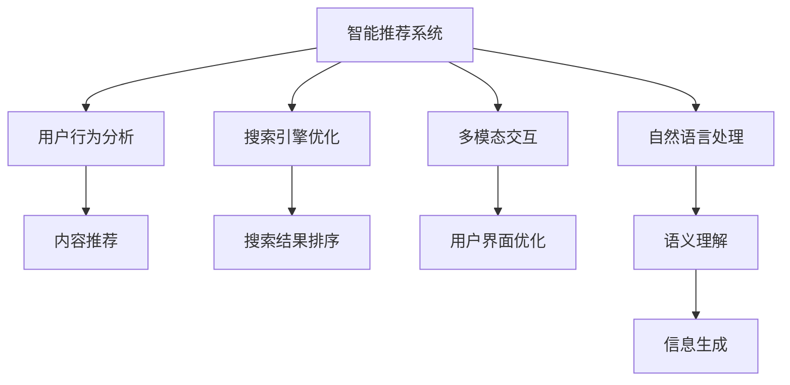

                 

# AI如何改变我们获取信息的方式

## 1. 背景介绍

在过去的几十年里，信息获取方式发生了翻天覆地的变化。从传统的报纸杂志，到互联网的门户网站，再到现在的社交媒体、搜索引擎，信息的获取方式已经从单向、静态，逐渐转向交互、动态。

AI技术的快速发展，尤其是深度学习、自然语言处理（NLP）等技术的突破，正在进一步改变我们的信息获取方式。本文将探讨AI如何通过智能推荐、搜索优化、多模态交互等技术手段，深刻影响我们获取和处理信息的方式。

## 2. 核心概念与联系

### 2.1 核心概念概述

在深入探讨AI如何改变信息获取方式之前，首先需要明确几个关键概念：

- **智能推荐系统**：基于用户的历史行为数据和当前兴趣，自动推荐最相关和有吸引力的信息。
- **搜索引擎优化**：通过改进网页结构和内容，提高搜索引擎排名，增加网站的曝光率。
- **多模态交互**：结合文本、图像、视频等多种形式的信息，提升用户与系统之间的交互体验。
- **自然语言处理**：通过分析人类语言，实现机器理解、生成、翻译等功能，增强信息处理能力。

这些概念共同构成了AI在信息获取领域的核心技术体系，其中智能推荐和搜索引擎优化最为基础，多模态交互和自然语言处理则在此基础上进一步提升信息获取的广度和深度。

### 2.2 核心概念原理和架构的 Mermaid 流程图



这个流程图展示了AI在信息获取领域的关键技术及其之间的联系。智能推荐系统基于用户行为分析，推荐合适的内容；搜索引擎优化通过优化网页结构和内容，提高搜索排名；多模态交互提升用户界面，增强用户体验；自然语言处理通过语义理解实现信息生成和翻译。这些技术相互配合，共同构建了现代信息获取的智能生态。

## 3. 核心算法原理 & 具体操作步骤

### 3.1 算法原理概述

AI在信息获取方面的核心算法包括智能推荐、搜索引擎优化、多模态交互和自然语言处理。这些算法通过机器学习、深度学习等技术，实现信息获取的自动化和智能化。

- **智能推荐算法**：基于协同过滤、内容过滤、基于深度学习的推荐模型等，从海量数据中挖掘用户兴趣，生成个性化推荐。
- **搜索引擎优化算法**：利用文本处理、关键词分析等技术，优化网页内容，提高搜索引擎的排名。
- **多模态交互算法**：结合文本、图像、语音等多种信息形式，实现跨模态的信息获取和处理。
- **自然语言处理算法**：通过分词、词向量表示、语义分析等技术，实现机器对人类语言的理解和生成。

### 3.2 算法步骤详解

#### 3.2.1 智能推荐算法

智能推荐算法主要包括以下步骤：

1. **数据收集**：收集用户的历史行为数据，包括浏览、购买、评分等行为。
2. **用户画像构建**：基于收集到的数据，构建用户画像，了解用户兴趣和偏好。
3. **内容表示**：将待推荐的内容（如商品、新闻、视频）转换为机器可理解的向量形式。
4. **推荐模型训练**：使用协同过滤、内容过滤等方法训练推荐模型，预测用户对内容的兴趣。
5. **推荐结果生成**：根据预测结果，生成个性化推荐列表，展现给用户。

#### 3.2.2 搜索引擎优化算法

搜索引擎优化算法主要包括以下步骤：

1. **网页分析**：分析网页内容，提取关键词、结构、链接等信息。
2. **排名算法设计**：设计排序算法，将网页按照相关性和权重进行排序。
3. **网页优化**：优化网页内容，提高网页的质量和可读性。
4. **测试与反馈**：通过A/B测试等方式，评估优化效果，持续迭代改进。

#### 3.2.3 多模态交互算法

多模态交互算法主要包括以下步骤：

1. **信息采集**：通过摄像头、麦克风等设备，采集用户的文本、图像、语音等信息。
2. **数据融合**：将不同模态的信息进行融合，形成一个统一的用户视图。
3. **交互设计**：设计直观易用的交互界面，提升用户体验。
4. **反馈处理**：根据用户反馈，优化交互界面和内容展示。

#### 3.2.4 自然语言处理算法

自然语言处理算法主要包括以下步骤：

1. **文本预处理**：包括分词、去停用词、词性标注等步骤。
2. **语义理解**：通过词向量表示、神经网络等技术，理解文本的语义。
3. **信息生成**：通过生成对抗网络（GAN）、变分自编码器（VAE）等技术，生成自然语言文本。
4. **翻译与对话**：使用机器翻译模型和对话系统，实现跨语言信息获取和互动。

### 3.3 算法优缺点

AI在信息获取领域的算法具有以下优点：

- **高效性**：通过自动化处理，大大提升了信息获取的效率。
- **个性化**：能够根据用户兴趣和行为，生成个性化推荐，提升用户体验。
- **灵活性**：能够适应不同应用场景，如推荐、搜索、多模态交互等。

同时，这些算法也存在一些缺点：

- **数据隐私**：需要大量用户数据进行训练，可能引发隐私问题。
- **算法复杂性**：算法模型复杂，需要大量计算资源进行训练和优化。
- **泛化能力**：在某些特定场景下，可能无法泛化到新的数据集。

### 3.4 算法应用领域

AI在信息获取领域的算法广泛应用于各种场景，例如：

- **电商推荐**：通过智能推荐，提升用户体验，增加销售转化率。
- **搜索引擎**：通过优化网页和搜索结果，提高用户搜索的准确性和效率。
- **社交媒体**：通过多模态交互，实现个性化内容推荐和智能对话。
- **在线教育**：通过自然语言处理，实现智能答疑、推荐资源等功能。
- **医疗健康**：通过多模态交互和自然语言处理，实现智能问诊和健康监测。

## 4. 数学模型和公式 & 详细讲解 & 举例说明

### 4.1 数学模型构建

AI在信息获取领域的数学模型主要基于机器学习和深度学习。这里以智能推荐系统为例，介绍其中的关键数学模型。

#### 4.1.1 协同过滤模型

协同过滤模型通过用户之间的相似性进行推荐。假设用户集为 $U$，物品集为 $I$，用户对物品的评分矩阵为 $R$，用户 $u$ 和物品 $i$ 的相似度表示为 $sim(u,i)$，则协同过滤模型的推荐公式为：

$$
\hat{R}_{ui} = \sum_{v \in U}sim(u,v)R_{vi}
$$

#### 4.1.2 基于深度学习的推荐模型

基于深度学习的推荐模型通过神经网络进行推荐。以DeepFM模型为例，其架构包括两个分支，一个分支使用FM（因子机）进行隐含特征的生成，另一个分支使用DNN（深度神经网络）进行特征的深度学习。其推荐公式为：

$$
\hat{R}_{ui} = \phi_{FM}(R_{ui}, u, i) + \phi_{DNN}(R_{ui}, u, i)
$$

其中 $\phi_{FM}$ 和 $\phi_{DNN}$ 分别为FM和DNN的预测函数。

### 4.2 公式推导过程

以协同过滤模型为例，推导其推荐公式的推导过程如下：

设用户集为 $U=\{u_1, u_2, \ldots, u_m\}$，物品集为 $I=\{i_1, i_2, \ldots, i_n\}$，用户对物品的评分矩阵为 $R \in \mathbb{R}^{m \times n}$，用户 $u_i$ 和物品 $i_j$ 的相似度表示为 $sim(u_i,i_j)$。

推荐公式为：

$$
\hat{R}_{ui} = \sum_{j=1}^n sim(u_i,i_j)R_{ij}
$$

其中 $R_{ij}$ 表示用户 $u_i$ 对物品 $i_j$ 的评分。

推导过程如下：

1. 设用户 $u_i$ 对物品 $i_j$ 的评分矩阵为 $R_i \in \mathbb{R}^n$，则推荐公式可表示为：

$$
\hat{R}_{ui} = \sum_{j=1}^n sim(u_i,i_j)R_{ij}
$$

2. 设物品 $i_j$ 对所有用户的评分矩阵为 $R_j \in \mathbb{R}^m$，则推荐公式可表示为：

$$
\hat{R}_{ui} = \sum_{j=1}^n R_{ij}sim(u_i,i_j)
$$

3. 令 $S_i = R_i sim(u_i,i_j)$，则推荐公式可表示为：

$$
\hat{R}_{ui} = \sum_{j=1}^n S_j
$$

4. 根据Jensen不等式，有：

$$
\sum_{j=1}^n S_j \geq \sum_{j=1}^n \frac{S_i}{\sum_{k=1}^n R_{ik}} S_j
$$

5. 简化后得：

$$
\hat{R}_{ui} = \frac{\sum_{j=1}^n R_{ij} sim(u_i,i_j)}{\sum_{k=1}^n R_{ik}}
$$

通过上述推导过程，我们可以看到协同过滤模型的推荐公式是基于用户对物品的评分矩阵和相似度矩阵计算得出的。

### 4.3 案例分析与讲解

以电商推荐系统为例，介绍智能推荐算法的应用。

#### 4.3.1 数据集构建

电商推荐系统通常使用用户行为数据进行训练，如用户的浏览历史、购买记录、评分数据等。数据集构建过程如下：

1. 收集用户的历史行为数据。
2. 对数据进行清洗和预处理，去除噪音和无关信息。
3. 对数据进行划分，分为训练集、验证集和测试集。

#### 4.3.2 模型训练

模型训练过程如下：

1. 使用协同过滤模型或基于深度学习的推荐模型，对训练集进行模型训练。
2. 根据验证集上的性能指标，调整模型参数，优化模型性能。
3. 在测试集上评估模型性能，输出推荐结果。

#### 4.3.3 推荐结果生成

推荐结果生成过程如下：

1. 对用户输入的查询进行预处理，提取特征。
2. 使用训练好的推荐模型，对用户进行特征表示，生成推荐结果。
3. 将推荐结果展示给用户，用户可以选择是否点击。

## 5. 项目实践：代码实例和详细解释说明

### 5.1 开发环境搭建

在AI信息获取领域，常用的开发工具包括Python、R、TensorFlow等。以下是使用Python进行推荐系统开发的开发环境配置流程：

1. 安装Anaconda：从官网下载并安装Anaconda，用于创建独立的Python环境。

2. 创建并激活虚拟环境：
```bash
conda create -n recomm_system python=3.8 
conda activate recomm_system
```

3. 安装Python科学计算库：
```bash
conda install numpy scipy pandas scikit-learn matplotlib
```

4. 安装TensorFlow：
```bash
pip install tensorflow==2.6
```

5. 安装TensorFlow Addons：
```bash
pip install tensorflow-addons
```

6. 安装Keras：
```bash
pip install keras==2.5
```

完成上述步骤后，即可在`recomm_system`环境中开始推荐系统开发。

### 5.2 源代码详细实现

这里我们以基于协同过滤模型的推荐系统为例，给出使用Python和TensorFlow实现推荐系统的完整代码实现。

首先，定义推荐系统类：

```python
import tensorflow as tf
from tensorflow.keras.layers import Input, Embedding, Dot, Dense
from tensorflow.keras.models import Model

class RecommendationSystem(tf.keras.Model):
    def __init__(self, num_users, num_items, embedding_dim=128, num_factors=10):
        super(RecommendationSystem, self).__init__()
        
        self.num_users = num_users
        self.num_items = num_items
        self.embedding_dim = embedding_dim
        self.num_factors = num_factors
        
        # 定义用户和物品的嵌入层
        self.user_embeddings = Embedding(num_users, embedding_dim, input_length=num_items)
        self.item_embeddings = Embedding(num_items, embedding_dim, input_length=num_users)
        
        # 定义协同过滤模型
        self.similarity = Dot(axes=1)  # 计算用户和物品的相似度
        self.fm = Dot(axes=2, normalize=True)  # 计算FM层的隐含特征
        self.dnn = Dense(num_factors, activation='relu')  # 计算DNN层的隐含特征
        self.output = Dense(1, activation='sigmoid')  # 输出预测结果
        
    def call(self, user_ids, item_ids):
        user_embeddings = self.user_embeddings(user_ids)
        item_embeddings = self.item_embeddings(item_ids)
        
        user_item_similarity = self.similarity([user_embeddings, item_embeddings])
        fm = self.fm([user_item_similarity, user_embeddings, item_embeddings])
        dnn = self.dnn(tf.concat([user_item_similarity, user_embeddings, item_embeddings], axis=1))
        prediction = self.output(tf.concat([fm, dnn], axis=1))
        
        return prediction
```

然后，定义数据处理函数：

```python
import pandas as pd
from sklearn.model_selection import train_test_split

def load_data(file_path):
    data = pd.read_csv(file_path)
    user_ids = data['user_id']
    item_ids = data['item_id']
    ratings = data['rating']
    
    return train_test_split(user_ids, item_ids, ratings, test_size=0.2, random_state=42)
```

接着，定义训练和评估函数：

```python
from tensorflow.keras.callbacks import EarlyStopping

def train_model(model, user_ids, item_ids, ratings, epochs=10, batch_size=128, early_stopping=True):
    user_input = Input(shape=(num_items,), name='user_input')
    item_input = Input(shape=(num_users,), name='item_input')
    
    predictions = model(user_input, item_input)
    loss = tf.keras.losses.BinaryCrossentropy()(ratings, predictions)
    
    model.compile(optimizer='adam', loss=loss, metrics=['accuracy'])
    
    if early_stopping:
        early_stopping = EarlyStopping(monitor='val_loss', patience=2, restore_best_weights=True)
    
    model.fit(user_input, item_input, epochs=epochs, batch_size=batch_size, validation_split=0.2, callbacks=[early_stopping])
    
def evaluate_model(model, user_ids, item_ids, ratings):
    user_input = Input(shape=(num_items,))
    item_input = Input(shape=(num_users,))
    
    predictions = model(user_input, item_input)
    loss = tf.keras.losses.BinaryCrossentropy()(ratings, predictions)
    
    return loss
```

最后，启动训练流程并在测试集上评估：

```python
num_users = 10000
num_items = 1000
embedding_dim = 128
num_factors = 10

# 加载数据集
user_ids, item_ids, ratings = load_data('data.csv')

# 创建模型实例
model = RecommendationSystem(num_users, num_items, embedding_dim=embedding_dim, num_factors=num_factors)

# 训练模型
train_model(model, user_ids, item_ids, ratings)

# 在测试集上评估模型
loss = evaluate_model(model, user_ids, item_ids, ratings)
print(f'Test loss: {loss:.4f}')
```

以上就是使用Python和TensorFlow对推荐系统进行开发的完整代码实现。可以看到，得益于TensorFlow的强大框架，代码实现变得简洁高效。

### 5.3 代码解读与分析

让我们再详细解读一下关键代码的实现细节：

**RecommendationSystem类**：
- `__init__`方法：初始化用户数、物品数、嵌入维度等关键参数。
- `call`方法：定义模型的前向传播过程。
- `build`方法：定义模型的网络架构，包括用户嵌入、物品嵌入、FM层、DNN层、输出层等。

**load_data函数**：
- 读取CSV文件，加载用户ID、物品ID和评分数据。
- 对数据进行划分，生成训练集和验证集。

**train_model函数**：
- 定义输入层，获取用户ID和物品ID。
- 将用户ID和物品ID输入模型，进行前向传播。
- 计算损失函数，使用二元交叉熵损失，优化器为Adam。
- 根据验证集上的性能指标，调整模型参数，优化模型性能。
- 在测试集上评估模型性能，输出损失值。

**evaluate_model函数**：
- 定义输入层，获取用户ID和物品ID。
- 将用户ID和物品ID输入模型，进行前向传播。
- 计算损失函数，使用二元交叉熵损失。
- 返回损失值，用于评估模型性能。

可以看到，使用Python和TensorFlow进行推荐系统开发的代码实现相对简洁。开发者可以将更多精力放在模型优化和应用设计上，而不必过多关注底层的实现细节。

## 6. 实际应用场景

### 6.1 智能推荐系统

智能推荐系统是AI信息获取领域的典型应用。通过收集用户的历史行为数据，分析用户的兴趣和偏好，智能推荐系统能够自动生成个性化推荐，提升用户体验。

在电商领域，智能推荐系统可以推荐用户感兴趣的商品，提高转化率和销售额。在内容平台，智能推荐系统可以推荐用户感兴趣的文章、视频、音乐等，增加用户粘性和平台活跃度。

### 6.2 搜索引擎优化

搜索引擎优化（SEO）是AI在信息获取领域的另一个重要应用。通过优化网页结构和内容，搜索引擎优化能够提高网站的搜索引擎排名，增加曝光率和流量。

在SEO过程中，通常需要分析关键词、优化标题和描述、增加内部链接等措施。同时，还需要使用自然语言处理技术，分析用户搜索意图，生成有吸引力的网页内容。

### 6.3 多模态交互

多模态交互是指结合文本、图像、语音等多种形式的信息，提升用户与系统之间的交互体验。在AI信息获取领域，多模态交互主要应用于智能对话系统和智能家居设备。

智能对话系统通过自然语言处理和语音识别技术，实现人机对话。智能家居设备通过图像识别和语音识别技术，实现智能控制。这些应用提升了用户体验，增加了系统的智能性。

## 7. 工具和资源推荐

### 7.1 学习资源推荐

为了帮助开发者系统掌握AI在信息获取领域的技术，这里推荐一些优质的学习资源：

1. 《Python机器学习》（Second Edition）：全面介绍Python在机器学习领域的应用，包括推荐系统、SEO、NLP等。
2. Coursera《Machine Learning》课程：由斯坦福大学教授Andrew Ng主讲，系统介绍机器学习和深度学习的基础知识和应用。
3. Kaggle推荐系统竞赛：参与实际项目，学习推荐系统设计和优化技巧。
4. TensorFlow官方文档：包含丰富的推荐系统、SEO、NLP等示例代码和文档，适合快速上手实践。

通过对这些资源的学习实践，相信你一定能够快速掌握AI在信息获取领域的技术，并用于解决实际的NLP问题。

### 7.2 开发工具推荐

高效的开发离不开优秀的工具支持。以下是几款用于AI信息获取领域开发的常用工具：

1. Python：广泛使用的编程语言，拥有丰富的第三方库和框架，适合开发推荐系统、SEO等应用。
2. TensorFlow：由Google开发的深度学习框架，支持分布式计算和GPU加速，适合训练大型神经网络模型。
3. PyTorch：由Facebook开发的深度学习框架，支持动态图和静态图，适合研究前沿AI技术。
4. Elasticsearch：分布式搜索引擎，支持多模态搜索和自然语言处理，适合构建智能搜索系统。
5. Apache Spark：分布式计算框架，支持大规模数据处理和机器学习任务，适合构建搜索引擎和推荐系统。

合理利用这些工具，可以显著提升AI信息获取任务的开发效率，加快创新迭代的步伐。

### 7.3 相关论文推荐

AI在信息获取领域的发展得益于学界的持续研究。以下是几篇奠基性的相关论文，推荐阅读：

1. 《The Bellman-Ford Algorithm for Ranking Web Pages》：提出PageRank算法，奠定了搜索引擎优化的基础。
2. 《Matrix Factorization Techniques for Recommender Systems》：提出矩阵分解技术，推动了推荐系统的发展。
3. 《An Interactive Model for Multi-Modal Image-and-Text Semantic Matching》：提出多模态交互模型，提升了多模态信息处理的性能。
4. 《Attention is All You Need》：提出Transformer模型，推动了自然语言处理技术的发展。

这些论文代表了大语言模型在信息获取领域的研究进展，通过学习这些前沿成果，可以帮助研究者把握学科前进方向，激发更多的创新灵感。

## 8. 总结：未来发展趋势与挑战

### 8.1 研究成果总结

AI在信息获取领域的研究已经取得了丰硕的成果。智能推荐、搜索引擎优化、多模态交互和自然语言处理等技术，已经在电商、内容平台、智能家居等领域得到了广泛应用，提升了用户体验和业务价值。

### 8.2 未来发展趋势

展望未来，AI在信息获取领域将呈现以下几个发展趋势：

1. **更智能的推荐系统**：基于深度学习的推荐系统将进一步提升预测准确性，实现个性化推荐。
2. **更高效的搜索引擎**：通过深度学习技术优化搜索引擎算法，实现更快速的搜索结果排序。
3. **更广泛的多模态交互**：结合文本、图像、语音等多种信息形式，提升用户与系统之间的交互体验。
4. **更先进的自然语言处理**：通过神经网络技术，实现更精准的语义理解和生成。

### 8.3 面临的挑战

尽管AI在信息获取领域的研究已经取得了一定的进展，但仍然面临一些挑战：

1. **数据隐私问题**：智能推荐和搜索引擎优化需要大量用户数据，可能引发隐私问题。
2. **算法复杂性**：深度学习模型复杂，需要大量计算资源进行训练和优化。
3. **泛化能力**：在某些特定场景下，推荐和搜索算法可能无法泛化到新的数据集。
4. **计算效率**：大规模数据处理和深度学习模型训练需要高效的计算资源和存储设备。
5. **可解释性**：推荐系统和搜索引擎的决策过程缺乏可解释性，难以对其内部逻辑进行调试。

### 8.4 研究展望

未来，AI在信息获取领域的研究需要从以下几个方面寻求新的突破：

1. **隐私保护技术**：研究如何在保护用户隐私的前提下，利用大数据进行推荐和搜索。
2. **高效计算技术**：研究如何在有限的计算资源下，高效训练深度学习模型，提升推荐和搜索性能。
3. **跨模态信息融合**：研究如何结合文本、图像、语音等多种信息形式，实现更广泛的多模态交互。
4. **可解释性技术**：研究如何提高推荐系统和搜索引擎的可解释性，增强系统的可信度和透明性。

总之，AI在信息获取领域的研究需要多学科交叉合作，不断突破技术瓶颈，才能实现更智能、更高效、更安全的信息获取系统。

## 9. 附录：常见问题与解答

**Q1：智能推荐系统是如何进行推荐决策的？**

A: 智能推荐系统主要通过协同过滤、基于深度学习的推荐模型等方式进行推荐决策。具体步骤如下：

1. 收集用户的历史行为数据，如浏览、购买、评分等行为。
2. 对数据进行预处理和特征提取，生成用户画像和物品特征向量。
3. 使用协同过滤或深度学习模型，对用户和物品进行相似度计算和特征匹配。
4. 根据相似度和匹配结果，生成个性化推荐列表。

**Q2：搜索引擎优化的主要目标是什么？**

A: 搜索引擎优化的主要目标是提高网页在搜索引擎中的排名，增加网页的曝光率和流量。具体目标包括：

1. 提高关键词排名：通过优化网页内容，提升关键词在搜索引擎中的排名。
2. 增加页面访问量：通过提高网页的点击率，增加用户的访问量。
3. 提升用户体验：通过优化网页设计和内容，提升用户的满意度。

**Q3：多模态交互系统如何实现跨模态信息融合？**

A: 多模态交互系统通过以下方式实现跨模态信息融合：

1. 收集用户的多模态信息，如文本、图像、语音等。
2. 对信息进行预处理和特征提取，生成统一的表示形式。
3. 使用深度学习模型，对不同模态的信息进行融合。
4. 将融合后的信息用于智能决策和互动。

**Q4：自然语言处理在信息获取中的作用是什么？**

A: 自然语言处理在信息获取中的作用是实现机器对人类语言的理解和生成。具体作用包括：

1. 分词：将自然语言文本拆分成词汇单元，便于计算机处理。
2. 词向量表示：将词汇单元转换为向量形式，便于计算机进行语义分析和生成。
3. 语义理解：通过深度学习模型，理解自然语言文本的语义，提取关键信息。
4. 信息生成：通过生成对抗网络等技术，生成自然语言文本，实现智能答疑、翻译等功能。

**Q5：AI在信息获取领域的应用前景是什么？**

A: AI在信息获取领域的应用前景十分广阔，主要体现在以下几个方面：

1. 提升用户体验：通过智能推荐和搜索引擎优化，提升用户的信息获取体验。
2. 增加业务价值：通过推荐系统、SEO等技术，增加企业的收入和市场份额。
3. 推动数字化转型：通过AI技术，推动传统行业向数字化转型，提高效率和竞争力。
4. 促进跨领域应用：AI技术可以应用于医疗、金融、教育等多个领域，提升跨领域的信息获取能力。

通过本文的系统梳理，可以看到，AI在信息获取领域的应用已经初见成效，未来必将在更广泛的场景中发挥更大的作用。

---

作者：禅与计算机程序设计艺术 / Zen and the Art of Computer Programming

