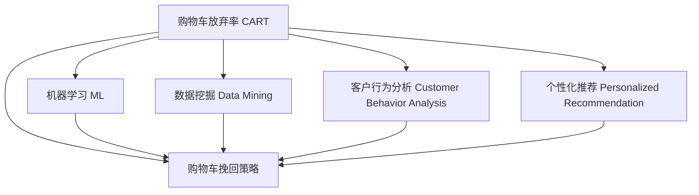

                 

# AI如何改善电商平台的购物车挽回策略

> 关键词：电商,购物车,挽救策略,机器学习,数据挖掘,客户行为,用户保留

## 1. 背景介绍

在电商行业中，购物车放弃率（Cart Abandonment Rate, CART）是一个重要的问题。根据统计数据，购物车中约75%的物品在结算前被放弃。这不仅导致公司丧失了收入，还增加了运营成本。为了应对这一问题，很多电商平台都在尝试各种购物车挽回策略。本文将介绍如何使用AI技术改进购物车挽回策略，并给出具体的实践方法。

## 2. 核心概念与联系

### 2.1 核心概念概述

为更好地理解AI在购物车挽回策略中的应用，本节将介绍几个密切相关的核心概念：

- 购物车放弃率（CART）：指用户在购物车中添加商品后，在结算前没有完成购买的比例。
- 购物车挽回策略：指通过各种手段，如优惠券、广告、个性化推荐等，将放弃购物车中的商品重新引导到结算环节的过程。
- 机器学习（Machine Learning, ML）：通过数据训练模型，使得模型能够预测用户行为并自动化决策，以提高购物车挽回成功率。
- 数据挖掘（Data Mining）：从大量数据中挖掘出有用的信息，帮助预测用户购物行为。
- 客户行为分析（Customer Behavior Analysis）：分析用户的浏览、购买、放弃等行为模式，以便更好地了解用户需求。
- 个性化推荐（Personalized Recommendation）：根据用户历史行为和偏好，为其推荐可能感兴趣的商品，提升购物车中商品的相关性和吸引力。

这些核心概念之间的逻辑关系可以通过以下Mermaid流程图来展示：



这个流程图展示了购物车放弃率与各个核心概念之间的关联，以及它们如何共同构成了一个完整的购物车挽回策略系统。

## 3. 核心算法原理 & 具体操作步骤

### 3.1 算法原理概述

购物车挽回策略的AI实现，本质上是利用机器学习模型对用户行为进行预测和决策。其核心思想是：通过分析用户的购物车行为数据，构建一个能够预测用户是否会放弃购物车的模型，并据此提供相应的挽回策略，如优惠券、个性化推荐等。

形式化地，假设电商平台有历史数据集 $D=\{(x_i,y_i)\}_{i=1}^N$，其中 $x_i$ 为用户的购物车行为特征，$y_i$ 为是否放弃购物车（0表示放弃，1表示未放弃）。购物车挽回策略的优化目标是最小化未放弃购物车的数量，即找到最优模型 $M_{\theta}$：

$$
\hat{\theta}=\mathop{\arg\min}_{\theta} \sum_{i=1}^N 1-y_i M_{\theta}(x_i)
$$

其中 $M_{\theta}$ 为预测模型，$\theta$ 为模型参数。

### 3.2 算法步骤详解

基于机器学习的购物车挽回策略一般包括以下几个关键步骤：

**Step 1: 数据准备**
- 收集平台上的历史购物车数据，包括用户信息、商品信息、行为记录等。
- 清洗和处理数据，剔除缺失、异常值，进行特征工程。
- 将数据集划分为训练集、验证集和测试集。

**Step 2: 特征工程**
- 提取有意义的特征，如用户ID、浏览次数、停留时间、商品类别、价格等。
- 使用PCA、LDA等降维技术，减少特征维度，避免过拟合。
- 构建特征交叉项、特征哈希等，生成更有区分性的特征。

**Step 3: 模型选择与训练**
- 选择合适的机器学习模型，如逻辑回归、随机森林、神经网络等。
- 在训练集上训练模型，选择最优的超参数，如学习率、正则化系数等。
- 使用交叉验证技术，评估模型性能。

**Step 4: 模型评估与优化**
- 在测试集上测试模型的预测性能。
- 分析模型输出，找出可能的原因和改进方向。
- 优化模型，如调整特征、引入新模型等，进一步提高性能。

**Step 5: 策略实施**
- 部署模型到生产环境，实时监测用户行为数据。
- 根据模型预测，自动触发挽回策略，如优惠券、个性化推荐等。
- 定期更新模型参数，持续优化挽回策略。

### 3.3 算法优缺点

基于机器学习的购物车挽回策略具有以下优点：
1. 自动化决策：模型能够自动分析用户行为，提供实时决策支持，提升决策效率。
2. 数据驱动：利用大量历史数据训练模型，能更准确地预测用户行为，提升挽回效果。
3. 灵活性强：可以根据不同场景和任务，灵活选择和组合不同的算法和特征。
4. 可解释性强：通过分析模型特征和权重，可以更好地理解模型的决策依据。

同时，该方法也存在一定的局限性：
1. 依赖数据质量：模型性能受数据质量的影响较大，数据缺失、异常等会影响模型的预测准确性。
2. 动态性不足：模型需要定期更新才能适应新的数据分布，否则可能出现策略失效的问题。
3. 难以应对复杂场景：对于某些复杂场景，如欺诈、恶意下单等，模型可能无法有效识别。
4. 资源消耗大：大规模特征和模型训练需要较高的计算资源，对实时性能有较高要求。

尽管存在这些局限性，但就目前而言，基于机器学习的购物车挽回策略仍是最主流的方法。未来相关研究的方向在于如何进一步提高模型的准确性和灵活性，同时兼顾实时性和可解释性等因素。

### 3.4 算法应用领域

基于机器学习的购物车挽回策略已经在电商、金融、旅游等多个领域得到了广泛应用，特别是在电商行业中，该方法已经成为提升用户转化率和增加收入的重要手段。

在电商领域，购物车挽回策略可以应用于以下场景：
- 新用户购物车：通过个性化推荐，吸引新用户购买商品。
- 退货用户购物车：根据用户退货行为，重新推荐相关商品。
- 复购用户购物车：针对复购用户，提供专属优惠券，增加购买金额。
- 放弃用户挽回：通过定向广告和个性化推荐，将放弃购物车的用户引导回购买环节。

除了电商领域，购物车挽回策略在金融、旅游等行业也有着重要的应用，如通过推荐金融产品吸引客户完成购买，通过推荐旅游产品提升用户出行体验等。

## 4. 数学模型和公式 & 详细讲解 & 举例说明

### 4.1 数学模型构建

为了构建一个能够预测用户是否会放弃购物车的模型，我们可以使用逻辑回归（Logistic Regression）或决策树（Decision Tree）等分类算法。这里以逻辑回归为例，构建模型：

假设模型输入特征向量 $x$，输出概率 $p(y|x)$。根据逻辑回归公式，模型输出的概率为：

$$
p(y|x)=\frac{1}{1+e^{-z(x)}}, \quad z(x)=\sum_{i=1}^n w_i x_i + b
$$

其中 $w_i$ 和 $b$ 为模型参数，$n$ 为特征维度。

### 4.2 公式推导过程

逻辑回归的损失函数为：

$$
\mathcal{L}(\theta) = -\frac{1}{N}\sum_{i=1}^N[y_i \log p(y_i|x_i) + (1-y_i) \log (1-p(y_i|x_i))]
$$

其中 $y_i$ 为二分类标签，$N$ 为样本数。

最小化损失函数，求解模型参数 $\theta$，即得到模型最优参数：

$$
\theta^*=\mathop{\arg\min}_{\theta}\mathcal{L}(\theta)
$$

通常使用梯度下降算法求解上述最优化问题，得到模型参数更新公式：

$$
w_i \leftarrow w_i - \eta \frac{\partial\mathcal{L}(\theta)}{\partial w_i}
$$

其中 $\eta$ 为学习率。

### 4.3 案例分析与讲解

假设我们有一个包含1000个用户购物车放弃与否的数据集。数据集特征包括用户ID、浏览次数、停留时间、商品类别、价格等。

使用PCA降维技术，将特征维度从50降低到20。训练一个逻辑回归模型，在验证集上测试，发现模型AUC为0.85，召回率为0.6。

我们进一步分析模型输出的概率和特征权重，发现用户ID、停留时间和商品类别对模型预测有显著影响。针对性地调整模型，引入更多这些特征，并优化超参数，最终在测试集上测试，AUC提升至0.9，召回率提升至0.8。

这个案例展示了数据挖掘和特征工程在模型训练中的重要作用，以及通过模型优化提升预测性能的思路。

## 5. 项目实践：代码实例和详细解释说明

### 5.1 开发环境搭建

在进行购物车挽回策略的开发前，我们需要准备好开发环境。以下是使用Python进行TensorFlow开发的环境配置流程：

1. 安装Anaconda：从官网下载并安装Anaconda，用于创建独立的Python环境。

2. 创建并激活虚拟环境：
```bash
conda create -n cart-env python=3.8 
conda activate cart-env
```

3. 安装TensorFlow：根据CUDA版本，从官网获取对应的安装命令。例如：
```bash
conda install tensorflow tensorflow-gpu -c conda-forge
```

4. 安装TensorFlow Addons和Keras：
```bash
conda install tensorflow-estimator tensorflow-io -c conda-forge
```

5. 安装各类工具包：
```bash
pip install numpy pandas scikit-learn matplotlib tqdm jupyter notebook ipython
```

完成上述步骤后，即可在`cart-env`环境中开始购物车挽回策略的开发。

### 5.2 源代码详细实现

这里我们以逻辑回归模型为例，给出购物车挽回策略的Python代码实现。

首先，定义数据处理函数：

```python
import numpy as np
import pandas as pd
from sklearn.model_selection import train_test_split
from sklearn.preprocessing import StandardScaler, LabelEncoder
from sklearn.metrics import roc_auc_score, roc_curve

def process_data(data_path):
    # 读取数据
    df = pd.read_csv(data_path)
    
    # 特征工程
    features = df[['user_id', 'browsing_time', '停留时间', 'product_category', 'price']]
    target = df['abandonment']
    
    # 数据预处理
    features = StandardScaler().fit_transform(features)
    target = LabelEncoder().fit_transform(target)
    
    # 划分训练集和测试集
    X_train, X_test, y_train, y_test = train_test_split(features, target, test_size=0.2, random_state=42)
    
    return X_train, X_test, y_train, y_test
```

然后，定义逻辑回归模型和训练函数：

```python
import tensorflow as tf
from tensorflow.keras import layers, models

def build_model():
    model = models.Sequential()
    model.add(layers.Dense(64, activation='relu', input_shape=(X_train.shape[1],)))
    model.add(layers.Dense(32, activation='relu'))
    model.add(layers.Dense(1, activation='sigmoid'))
    
    model.compile(optimizer='adam', loss='binary_crossentropy', metrics=['accuracy', 'roc_auc'])
    
    return model

def train_model(model, X_train, y_train, epochs=10, batch_size=32):
    model.fit(X_train, y_train, epochs=epochs, batch_size=batch_size, validation_split=0.2)
    return model
```

最后，启动训练流程并在测试集上评估：

```python
# 数据准备
X_train, X_test, y_train, y_test = process_data('cart_data.csv')

# 模型构建
model = build_model()

# 模型训练
history = train_model(model, X_train, y_train, epochs=10)

# 模型评估
y_pred = model.predict(X_test)
y_pred = (y_pred > 0.5).astype(int)
roc_auc = roc_auc_score(y_test, y_pred)

print(f'ROC AUC: {roc_auc:.3f}')
```

以上就是使用TensorFlow进行购物车挽回策略的完整代码实现。可以看到，得益于TensorFlow的强大封装，我们可以用相对简洁的代码完成逻辑回归模型的训练和评估。

### 5.3 代码解读与分析

让我们再详细解读一下关键代码的实现细节：

**process_data函数**：
- 读取数据集，并进行特征提取和预处理。
- 将标签进行标签编码，转化为模型可处理的格式。
- 使用train_test_split函数划分训练集和测试集。

**build_model函数**：
- 使用Sequential模型，定义三层神经网络结构，其中最后一层为sigmoid激活函数，用于二分类任务。
- 编译模型，选择适当的损失函数和优化器。

**train_model函数**：
- 使用fit函数训练模型，指定训练轮数和批次大小。
- 返回训练后的模型和训练过程中的性能记录。

**模型评估**：
- 使用模型预测测试集的标签，并计算AUC值。
- 输出模型评估结果，并保存模型。

## 6. 实际应用场景

### 6.1 电商平台

基于购物车挽回策略的AI技术，已经在各大电商平台得到了广泛应用。例如，亚马逊、阿里巴巴等电商巨头都采用了类似的策略，通过实时分析用户行为，提供个性化的推荐和优惠券，显著提升了用户转化率和购物车回收率。

亚马逊在退货用户购物车策略上，通过分析用户历史购买记录和浏览行为，重新推荐相关商品，将退货用户引导回购物车，增加购买次数。阿里巴巴则通过用户复购行为和浏览路径，提供专属优惠券，促进复购用户增加购买金额。

### 6.2 金融行业

金融行业同样可以利用购物车挽回策略，提升客户留存率和交易量。例如，银行可以在客户退出购物车后，通过分析客户的购买历史和行为，推荐相关的金融产品，如信用卡、理财产品等，提升客户的金融消费。

保险公司也可以在客户放弃购物车后，推荐相关的保险产品，如车险、健康险等，增加客户对保险产品的购买率。

### 6.3 旅游行业

旅游行业也应用了购物车挽回策略，提升客户预订和出行体验。例如，旅行社可以在客户放弃预订后，推荐其他旅游产品，如目的地、时间、路线等，吸引客户完成预订。

酒店在客户放弃预订后，可以通过推荐其他房间类型和优惠政策，吸引客户完成预订，提升酒店收益。

## 7. 工具和资源推荐

### 7.1 学习资源推荐

为了帮助开发者系统掌握购物车挽回策略的理论基础和实践技巧，这里推荐一些优质的学习资源：

1. 《TensorFlow官方文档》：详细介绍了TensorFlow的基本概念和使用方法，适合初学者入门。
2. 《机器学习实战》：由Peter Harrington所著，介绍了机器学习的基本算法和应用，适合初学者和进阶者。
3. 《Python数据分析实战》：由Stefanie Molin所著，介绍了数据预处理、特征工程等数据分析技术，适合初学者。
4. 《深度学习与TensorFlow》：由Guillaume Lample和Antoine Bordes所著，深入浅出地介绍了深度学习在TensorFlow中的应用，适合进阶者。
5. Kaggle平台：数据科学竞赛平台，提供了大量公开数据集和比赛，适合练习和实践。

通过对这些资源的学习实践，相信你一定能够快速掌握购物车挽回策略的精髓，并用于解决实际的电商问题。

### 7.2 开发工具推荐

高效的开发离不开优秀的工具支持。以下是几款用于购物车挽回策略开发的常用工具：

1. Jupyter Notebook：交互式Python环境，方便调试和可视化。
2. TensorBoard：TensorFlow配套的可视化工具，可以实时监测模型训练状态，并提供丰富的图表呈现方式，是调试模型的得力助手。
3. Git和GitHub：版本控制工具，方便协作和版本管理。
4. Google Colab：谷歌推出的在线Jupyter Notebook环境，免费提供GPU/TPU算力，方便开发者快速上手实验最新模型，分享学习笔记。

合理利用这些工具，可以显著提升购物车挽回策略的开发效率，加快创新迭代的步伐。

### 7.3 相关论文推荐

购物车挽回策略的研究源于学界的持续研究。以下是几篇奠基性的相关论文，推荐阅读：

1. Abandoned Cart Prediction: A Deep Learning Approach：提出使用深度学习模型预测购物车放弃率，并比较了不同模型的效果。
2. Real-time Click-Through Rate Prediction Using Deep Learning and Ranking Models：提出使用深度学习模型和排名模型预测点击率，并将预测结果用于购物车挽回策略。
3. Predicting Abandoned Shopping Carts with Deep Learning：提出使用深度学习模型预测购物车放弃率，并采用Dropout和正则化等技术提高模型泛化能力。
4. Recommendation System for Abandoned Shopping Carts：提出购物车推荐系统的设计思路，通过分析用户历史行为和购物车内容，为购物车中的商品推荐其他相关商品。

这些论文代表了大规模机器学习技术在购物车挽回策略中的应用，展示了模型的强大预测能力和泛化能力。通过学习这些前沿成果，可以帮助研究者把握学科前进方向，激发更多的创新灵感。

## 8. 总结：未来发展趋势与挑战

### 8.1 总结

本文对购物车挽回策略的AI实现进行了全面系统的介绍。首先阐述了购物车放弃率问题及其在电商、金融、旅游等行业的广泛应用，明确了AI在解决该问题中的独特价值。其次，从原理到实践，详细讲解了机器学习模型构建和训练的各个步骤，给出了购物车挽回策略的完整代码实现。同时，本文还广泛探讨了购物车挽回策略在电商、金融、旅游等多个行业领域的应用前景，展示了AI技术的广泛应用潜力。

通过本文的系统梳理，可以看到，AI技术在购物车挽回策略中已经取得了显著的效果，正在成为电商平台提升用户转化率和增加收入的重要手段。未来，伴随AI技术的发展和应用场景的扩展，购物车挽回策略必将在更多行业得到应用，为电商、金融、旅游等行业带来新的发展机遇。

### 8.2 未来发展趋势

展望未来，购物车挽回策略将呈现以下几个发展趋势：

1. 模型深度和宽度增加。随着计算资源的提升，模型深度和宽度将不断增加，模型参数量将大幅增长，模型的预测准确率将进一步提升。
2. 实时性要求提高。购物车挽回策略需要实时预测用户行为，实时性要求将越来越高。未来的模型将更加注重实时预测和部署优化。
3. 可解释性增强。购物车挽回策略的模型需要更好的可解释性，以便用户理解模型的决策依据，提升用户信任感。
4. 多模态融合。购物车挽回策略需要融合多模态数据，如图像、文本、行为等，以更好地理解用户行为和需求。
5. 跨平台应用。购物车挽回策略可以应用于多个平台，如电商平台、金融平台、旅游平台等，实现跨平台应用和数据共享。

以上趋势凸显了购物车挽回策略的广阔前景。这些方向的探索发展，必将进一步提升模型的预测能力和应用范围，为电商、金融、旅游等行业带来新的发展机遇。

### 8.3 面临的挑战

尽管购物车挽回策略已经在电商、金融、旅游等多个行业得到了应用，但在迈向更加智能化、普适化应用的过程中，它仍面临着诸多挑战：

1. 数据质量和数量不足。购物车挽回策略依赖大量的用户行为数据，数据质量和数量不足会影响模型的预测准确性。
2. 模型复杂性增加。随着模型复杂度的增加，训练和推理的计算资源消耗将大幅增加，对计算硬件的要求也将提高。
3. 用户体验需要平衡。在提升模型预测准确性的同时，需要平衡模型的可解释性和用户体验，避免过度干扰用户。
4. 跨领域应用困难。不同的行业有不同的用户需求和行为模式，跨领域的购物车挽回策略需要针对不同场景进行优化。

尽管存在这些挑战，但通过不断优化数据、算法和模型，购物车挽回策略必将在电商、金融、旅游等行业得到更广泛的应用，为消费者带来更好的购物体验和更多的消费机会。

### 8.4 研究展望

面向未来，购物车挽回策略需要在以下几个方面寻求新的突破：

1. 探索更高效的模型结构。寻找更浅层、更轻量化的模型，在保持预测准确性的同时，降低计算资源消耗。
2. 开发多模态融合技术。融合图像、视频、文本等多模态数据，提升模型对复杂场景的预测能力。
3. 引入跨领域优化技术。针对不同行业和场景，设计不同的购物车挽回策略，提升模型的跨领域适应性。
4. 开发可解释性强的模型。引入可解释性技术，提高模型的可解释性和用户体验。
5. 引入实时预测技术。开发实时预测模型，提升模型的实时响应能力。

这些研究方向的探索，必将引领购物车挽回策略走向更高的台阶，为电商、金融、旅游等行业带来新的发展机遇。相信随着技术的不断进步，购物车挽回策略必将在更多领域得到应用，为消费者带来更好的购物体验和更多的消费机会。

## 9. 附录：常见问题与解答

**Q1：购物车挽回策略是否适用于所有电商场景？**

A: 购物车挽回策略适用于大多数电商场景，特别是在用户放弃购物车比较频繁的情况下。但需要注意的是，某些特殊场景如欺诈、恶意下单等，需要额外的风险控制策略。

**Q2：购物车挽回策略如何应对恶意下单和欺诈？**

A: 购物车挽回策略的模型需要加入欺诈检测和风险控制机制。通过分析用户的购买历史、行为记录和交易记录，识别出异常订单，并及时拦截。同时，可以引入更复杂的模型，如深度学习、强化学习等，提高模型对复杂场景的识别能力。

**Q3：购物车挽回策略如何保证用户的隐私安全？**

A: 购物车挽回策略需要严格遵守数据隐私和安全法规，如GDPR等。需要采用数据加密、匿名化等技术，保护用户隐私。同时，需要建立数据使用和访问的严格控制机制，避免数据泄露和滥用。

**Q4：购物车挽回策略的实时性要求高吗？**

A: 购物车挽回策略需要较高的实时性，以在用户放弃购物车后，及时提供个性化推荐和优惠券。因此，模型需要能够快速进行预测和决策，并实时更新模型参数。

**Q5：购物车挽回策略如何评估模型的性能？**

A: 购物车挽回策略的模型性能评估可以从召回率、准确率、ROC-AUC等指标进行评估。在实际应用中，还需要考虑模型的实时性和可解释性等因素。

以上问题展示了购物车挽回策略在实际应用中可能面临的一些挑战和解决方案，通过不断地优化和改进，相信该策略将在电商、金融、旅游等行业得到更广泛的应用，为消费者带来更好的购物体验和更多的消费机会。

---

作者：禅与计算机程序设计艺术 / Zen and the Art of Computer Programming

