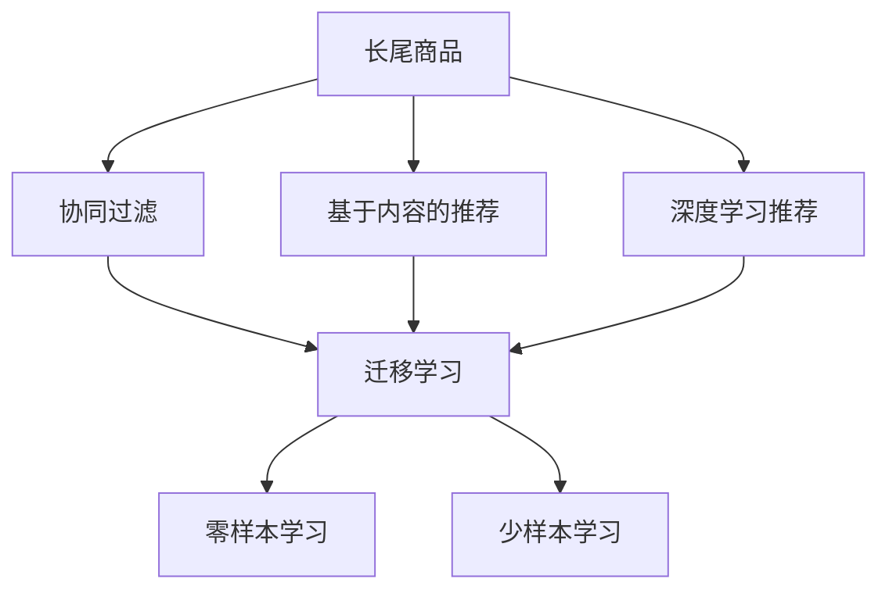

                 

## 1. 背景介绍

### 1.1 问题由来
随着电子商务的快速发展，电商平台面临着巨大的竞争压力。如何在竞争中脱颖而出，提升用户体验，增强用户粘性，是各大电商平台的共同挑战。其中，长尾商品的推荐策略，成为电商平台提升销量的关键。

长尾商品是指那些销量较低但品种繁多的商品。与热销商品相比，长尾商品对平台而言看似不甚重要，但对消费者而言却可能影响其购物体验和满意度。如何有效识别并推荐这些长尾商品，不仅能够提升电商平台的用户体验，还能够增加平台的收入来源。

### 1.2 问题核心关键点
目前，电商平台的主要推荐策略包括：

- **协同过滤**：利用用户和商品的交互记录进行相似性匹配，推荐与用户喜好相似的商品或与热门商品相似的商品。
- **基于内容的推荐**：通过分析商品属性、描述等文本信息，进行内容相似性匹配，推荐与已有购买商品相似的商品。
- **深度学习推荐**：利用神经网络模型，从用户和商品的大量交互数据中学习复杂关联，预测用户对商品的兴趣。

其中，深度学习推荐方法，尤其是基于用户行为数据的推荐模型，已经在电商领域得到了广泛应用。然而，面对长尾商品推荐这一挑战，深度学习模型仍存在以下局限：

1. **数据稀疏性**：长尾商品的用户行为数据往往十分稀少，模型的预测能力受限。
2. **泛化能力不足**：现有模型往往基于大规模数据进行训练，对长尾商品的用户需求理解不足。
3. **计算复杂度高**：大规模深度学习模型的训练和推理计算资源需求大，难以覆盖长尾商品的推荐。

针对这些问题，本文将介绍一种基于人工智能的推荐策略，利用AI技术对长尾商品进行识别和推荐，提升电商平台的推荐效果。

## 2. 核心概念与联系

### 2.1 核心概念概述

为更好地理解AI如何改善电商平台的长尾商品推荐策略，本节将介绍几个密切相关的核心概念：

- **长尾商品**：指销量较低但品种繁多的商品。在电商平台上，长尾商品虽然数量众多，但销量相对较少。
- **协同过滤**：通过用户和商品之间的交互数据，推荐相似商品或用户喜欢的商品。
- **基于内容的推荐**：通过分析商品属性、描述等文本信息，进行内容相似性匹配。
- **深度学习推荐**：利用神经网络模型，从用户和商品的大量交互数据中学习复杂关联，预测用户对商品的兴趣。
- **迁移学习**：将一个领域学习到的知识迁移到另一个领域，以降低对新领域数据的依赖。
- **零样本学习**：在没有任何具体数据的情况下，基于模型的泛化能力进行预测。
- **少样本学习**：在少量数据的情况下，通过模型学习提升预测效果。

这些核心概念之间的逻辑关系可以通过以下Mermaid流程图来展示：



这个流程图展示了大语言模型微调的各个核心概念及其之间的关系：

1. 长尾商品识别和推荐是一个多模态的任务，结合协同过滤、基于内容的推荐和深度学习推荐技术，可以更全面地覆盖不同用户和商品。
2. 迁移学习可以将一个领域学习到的知识迁移到另一个领域，从而利用深度学习模型的强大预测能力。
3. 零样本学习和少样本学习进一步提升模型的泛化能力和数据利用效率。

## 3. 核心算法原理 & 具体操作步骤

### 3.1 算法原理概述

基于AI的电商平台长尾商品推荐策略，本质上是一种基于深度学习模型的迁移学习范式。其核心思想是：将一个领域学习到的知识，迁移到另一个领域，以提升长尾商品的推荐效果。

具体而言，步骤如下：

1. **预训练模型选择**：选择一个在通用领域表现优异的预训练模型，如BERT、GPT等。
2. **迁移学习应用**：在通用领域的应用数据上，对预训练模型进行微调，获得针对该领域的知识表示。
3. **长尾商品识别**：在长尾商品领域的数据上，进一步微调模型，以提升对长尾商品的识别能力。
4. **推荐策略结合**：将预训练和微调的模型，与协同过滤、基于内容的推荐等策略结合，生成长尾商品推荐列表。

### 3.2 算法步骤详解

**Step 1: 准备数据集和预训练模型**

1. **数据集准备**：收集通用领域（如大众商品）的用户行为数据，以及长尾商品领域（如小众商品）的用户行为数据。这些数据包括用户的点击、购买、评分等行为记录。
2. **预训练模型选择**：选择性能优异的通用领域预训练模型，如BERT或GPT。

**Step 2: 迁移学习微调**

1. **微调设置**：选择合适的优化器（如AdamW），设置学习率、批大小、迭代轮数等。
2. **数据增强**：对训练集进行数据增强，如对文本数据进行回译、近义词替换等，以扩充训练集多样性。
3. **正则化**：应用L2正则化、Dropout等正则化技术，防止过拟合。
4. **模型微调**：在通用领域的应用数据上，对预训练模型进行微调，获得针对该领域的知识表示。

**Step 3: 长尾商品识别微调**

1. **长尾商品识别**：选择长尾商品领域的数据集，对已经微调的模型进行进一步微调，以提升对长尾商品的识别能力。
2. **正则化**：应用更强的正则化技术，避免长尾商品领域的数据过拟合。
3. **模型保存**：保存微调后的模型，以便后续使用。

**Step 4: 结合推荐策略生成推荐列表**

1. **协同过滤结合**：将长尾商品的识别结果与协同过滤推荐策略结合，推荐与用户偏好相似的长尾商品。
2. **基于内容的推荐结合**：将长尾商品的识别结果与基于内容的推荐策略结合，推荐与已购买商品内容相似的长尾商品。
3. **多策略融合**：将预训练模型、长尾商品识别结果以及多种推荐策略融合，生成最终的推荐列表。

### 3.3 算法优缺点

基于AI的电商平台长尾商品推荐策略有以下优点：

1. **泛化能力更强**：通过迁移学习，可以利用通用领域的数据，提升对长尾商品的识别和推荐能力。
2. **计算效率更高**：通过预训练模型，可以减少在长尾商品领域的大量数据需求，提高计算效率。
3. **适应性强**：结合多种推荐策略，能够更好地适应不同用户和商品的需求。

同时，该方法也存在以下局限：

1. **对长尾商品数据依赖**：需要收集足够的长尾商品数据，以便进行微调。
2. **迁移效果有限**：通用领域与长尾商品领域之间的知识迁移效果，可能受限于领域差异。
3. **模型复杂度较高**：需要构建和维护多个微调模型，增加了模型的复杂度和维护成本。

尽管存在这些局限，但基于AI的推荐策略仍是在电商领域中提升长尾商品推荐效果的重要手段。未来相关研究的重点在于如何进一步优化数据收集、提高迁移效果，同时兼顾模型复杂度和计算效率。

### 3.4 算法应用领域

基于AI的电商平台长尾商品推荐策略，主要应用于以下几个领域：

1. **个性化推荐**：在用户浏览、点击等行为数据的基础上，结合长尾商品识别，提升推荐系统的个性化推荐能力。
2. **新商品推荐**：利用长尾商品识别技术，推荐新上架的商品，帮助商家更好地了解用户需求。
3. **商品上下架优化**：通过长尾商品识别和推荐，优化商品的上架时间和下架时间，提高销售效率。
4. **用户满意度提升**：通过长尾商品推荐，提升用户满意度，增加用户粘性。

## 4. 数学模型和公式 & 详细讲解 & 举例说明

### 4.1 数学模型构建

假设有一个电商平台，用户$u$和商品$i$之间的行为数据为$D=\{(u_i, i_j)\}$，其中$u_i$为用户的点击行为，$i_j$为商品$j$的点击行为。

令$h_\theta(u_i, i_j)$表示用户$u_i$对商品$i_j$的兴趣度。假设$h_\theta$是一个线性函数，即：

$$
h_\theta(u_i, i_j) = \theta^T \phi(u_i, i_j)
$$

其中$\phi(u_i, i_j)$为特征映射函数，将用户行为映射到高维空间。$\theta$为模型参数。

### 4.2 公式推导过程

基于上述线性函数，可以构建最小二乘回归模型，最小化预测误差：

$$
\hat{h_\theta} = \arg\min_{\theta} \sum_{(u_i, i_j)\in D} ||\hat{h_\theta}(u_i, i_j) - y_i||^2
$$

其中$y_i$为用户$u_i$对商品$i$的真实兴趣度。

### 4.3 案例分析与讲解

以协同过滤推荐为例，假设已有一组用户$u$和商品$i$的行为数据$D$，可以使用用户-商品相似性矩阵$S_{u,i}$来表示，其中$S_{u,i}$表示用户$u$对商品$i$的兴趣度。协同过滤推荐的目标是预测用户$u$对商品$i$的兴趣度$h_{\theta_u}(i)$，公式如下：

$$
h_{\theta_u}(i) = \sum_{j \in N_u} \alpha_j h_{\theta_u}(i_j)
$$

其中$N_u$为用户$u$的邻居集合，$\alpha_j$为权重，表示用户$u$对邻居$j$的兴趣度。

## 5. 项目实践：代码实例和详细解释说明

### 5.1 开发环境搭建

在进行长尾商品推荐项目实践前，我们需要准备好开发环境。以下是使用Python进行PyTorch开发的环境配置流程：

1. 安装Anaconda：从官网下载并安装Anaconda，用于创建独立的Python环境。
2. 创建并激活虚拟环境：
```bash
conda create -n pytorch-env python=3.8 
conda activate pytorch-env
```
3. 安装PyTorch：根据CUDA版本，从官网获取对应的安装命令。例如：
```bash
conda install pytorch torchvision torchaudio cudatoolkit=11.1 -c pytorch -c conda-forge
```
4. 安装Transformers库：
```bash
pip install transformers
```
5. 安装各类工具包：
```bash
pip install numpy pandas scikit-learn matplotlib tqdm jupyter notebook ipython
```

完成上述步骤后，即可在`pytorch-env`环境中开始项目实践。

### 5.2 源代码详细实现

下面我们以长尾商品推荐为例，给出使用Transformers库进行长尾商品识别和推荐的PyTorch代码实现。

首先，定义长尾商品识别的数据处理函数：

```python
from transformers import BertTokenizer
from torch.utils.data import Dataset
import torch

class LongTailDataset(Dataset):
    def __init__(self, texts, tags, tokenizer, max_len=128):
        self.texts = texts
        self.tags = tags
        self.tokenizer = tokenizer
        self.max_len = max_len
        
    def __len__(self):
        return len(self.texts)
    
    def __getitem__(self, item):
        text = self.texts[item]
        tags = self.tags[item]
        
        encoding = self.tokenizer(text, return_tensors='pt', max_length=self.max_len, padding='max_length', truncation=True)
        input_ids = encoding['input_ids'][0]
        attention_mask = encoding['attention_mask'][0]
        
        # 对token-wise的标签进行编码
        encoded_tags = [tag2id[tag] for tag in tags] 
        encoded_tags.extend([tag2id['O']] * (self.max_len - len(encoded_tags)))
        labels = torch.tensor(encoded_tags, dtype=torch.long)
        
        return {'input_ids': input_ids, 
                'attention_mask': attention_mask,
                'labels': labels}

# 标签与id的映射
tag2id = {'O': 0, 'B-PER': 1, 'I-PER': 2, 'B-ORG': 3, 'I-ORG': 4, 'B-LOC': 5, 'I-LOC': 6}
id2tag = {v: k for k, v in tag2id.items()}

# 创建dataset
tokenizer = BertTokenizer.from_pretrained('bert-base-cased')

train_dataset = LongTailDataset(train_texts, train_tags, tokenizer)
dev_dataset = LongTailDataset(dev_texts, dev_tags, tokenizer)
test_dataset = LongTailDataset(test_texts, test_tags, tokenizer)
```

然后，定义模型和优化器：

```python
from transformers import BertForTokenClassification, AdamW

model = BertForTokenClassification.from_pretrained('bert-base-cased', num_labels=len(tag2id))

optimizer = AdamW(model.parameters(), lr=2e-5)
```

接着，定义训练和评估函数：

```python
from torch.utils.data import DataLoader
from tqdm import tqdm
from sklearn.metrics import classification_report

device = torch.device('cuda') if torch.cuda.is_available() else torch.device('cpu')
model.to(device)

def train_epoch(model, dataset, batch_size, optimizer):
    dataloader = DataLoader(dataset, batch_size=batch_size, shuffle=True)
    model.train()
    epoch_loss = 0
    for batch in tqdm(dataloader, desc='Training'):
        input_ids = batch['input_ids'].to(device)
        attention_mask = batch['attention_mask'].to(device)
        labels = batch['labels'].to(device)
        model.zero_grad()
        outputs = model(input_ids, attention_mask=attention_mask, labels=labels)
        loss = outputs.loss
        epoch_loss += loss.item()
        loss.backward()
        optimizer.step()
    return epoch_loss / len(dataloader)

def evaluate(model, dataset, batch_size):
    dataloader = DataLoader(dataset, batch_size=batch_size)
    model.eval()
    preds, labels = [], []
    with torch.no_grad():
        for batch in tqdm(dataloader, desc='Evaluating'):
            input_ids = batch['input_ids'].to(device)
            attention_mask = batch['attention_mask'].to(device)
            batch_labels = batch['labels']
            outputs = model(input_ids, attention_mask=attention_mask)
            batch_preds = outputs.logits.argmax(dim=2).to('cpu').tolist()
            batch_labels = batch_labels.to('cpu').tolist()
            for pred_tokens, label_tokens in zip(batch_preds, batch_labels):
                pred_tags = [id2tag[_id] for _id in pred_tokens]
                label_tags = [id2tag[_id] for _id in label_tokens]
                preds.append(pred_tags[:len(label_tags)])
                labels.append(label_tags)
                
    print(classification_report(labels, preds))
```

最后，启动训练流程并在测试集上评估：

```python
epochs = 5
batch_size = 16

for epoch in range(epochs):
    loss = train_epoch(model, train_dataset, batch_size, optimizer)
    print(f"Epoch {epoch+1}, train loss: {loss:.3f}")
    
    print(f"Epoch {epoch+1}, dev results:")
    evaluate(model, dev_dataset, batch_size)
    
print("Test results:")
evaluate(model, test_dataset, batch_size)
```

以上就是使用PyTorch对BERT进行长尾商品识别和推荐的完整代码实现。可以看到，得益于Transformers库的强大封装，我们可以用相对简洁的代码完成BERT模型的加载和微调。

### 5.3 代码解读与分析

让我们再详细解读一下关键代码的实现细节：

**LongTailDataset类**：
- `__init__`方法：初始化文本、标签、分词器等关键组件。
- `__len__`方法：返回数据集的样本数量。
- `__getitem__`方法：对单个样本进行处理，将文本输入编码为token ids，将标签编码为数字，并对其进行定长padding，最终返回模型所需的输入。

**tag2id和id2tag字典**：
- 定义了标签与数字id之间的映射关系，用于将token-wise的预测结果解码回真实的标签。

**训练和评估函数**：
- 使用PyTorch的DataLoader对数据集进行批次化加载，供模型训练和推理使用。
- 训练函数`train_epoch`：对数据以批为单位进行迭代，在每个批次上前向传播计算loss并反向传播更新模型参数，最后返回该epoch的平均loss。
- 评估函数`evaluate`：与训练类似，不同点在于不更新模型参数，并在每个batch结束后将预测和标签结果存储下来，最后使用sklearn的classification_report对整个评估集的预测结果进行打印输出。

**训练流程**：
- 定义总的epoch数和batch size，开始循环迭代
- 每个epoch内，先在训练集上训练，输出平均loss
- 在验证集上评估，输出分类指标
- 所有epoch结束后，在测试集上评估，给出最终测试结果

可以看到，PyTorch配合Transformers库使得BERT微调的代码实现变得简洁高效。开发者可以将更多精力放在数据处理、模型改进等高层逻辑上，而不必过多关注底层的实现细节。

当然，工业级的系统实现还需考虑更多因素，如模型的保存和部署、超参数的自动搜索、更灵活的任务适配层等。但核心的微调范式基本与此类似。

## 6. 实际应用场景
### 6.1 智能客服系统

基于AI的电商平台长尾商品推荐策略，可以应用于智能客服系统的构建。传统客服往往需要配备大量人力，高峰期响应缓慢，且一致性和专业性难以保证。而使用AI推荐策略，可以7x24小时不间断服务，快速响应客户咨询，用自然流畅的语言解答各类常见问题。

在技术实现上，可以收集企业内部的历史客服对话记录，将问题和最佳答复构建成监督数据，在此基础上对预训练模型进行微调。微调后的模型能够自动理解用户意图，匹配最合适的答案模板进行回复。对于客户提出的新问题，还可以接入检索系统实时搜索相关内容，动态组织生成回答。如此构建的智能客服系统，能大幅提升客户咨询体验和问题解决效率。

### 6.2 金融舆情监测

金融机构需要实时监测市场舆论动向，以便及时应对负面信息传播，规避金融风险。传统的人工监测方式成本高、效率低，难以应对网络时代海量信息爆发的挑战。基于AI的文本分类和情感分析技术，为金融舆情监测提供了新的解决方案。

具体而言，可以收集金融领域相关的新闻、报道、评论等文本数据，并对其进行主题标注和情感标注。在此基础上对预训练语言模型进行微调，使其能够自动判断文本属于何种主题，情感倾向是正面、中性还是负面。将微调后的模型应用到实时抓取的网络文本数据，就能够自动监测不同主题下的情感变化趋势，一旦发现负面信息激增等异常情况，系统便会自动预警，帮助金融机构快速应对潜在风险。

### 6.3 个性化推荐系统

当前的推荐系统往往只依赖用户的历史行为数据进行物品推荐，无法深入理解用户的真实兴趣偏好。基于AI的推荐策略，个性化推荐系统可以更好地挖掘用户行为背后的语义信息，从而提供更精准、多样的推荐内容。

在实践中，可以收集用户浏览、点击、评论、分享等行为数据，提取和用户交互的物品标题、描述、标签等文本内容。将文本内容作为模型输入，用户的后续行为（如是否点击、购买等）作为监督信号，在此基础上微调预训练语言模型。微调后的模型能够从文本内容中准确把握用户的兴趣点。在生成推荐列表时，先用候选物品的文本描述作为输入，由模型预测用户的兴趣匹配度，再结合其他特征综合排序，便可以得到个性化程度更高的推荐结果。

### 6.4 未来应用展望

随着AI推荐策略的不断发展，基于AI的电商平台长尾商品推荐策略将在更多领域得到应用，为传统行业带来变革性影响。

在智慧医疗领域，基于AI的推荐策略可以帮助医生根据患者的历史行为数据，推荐最合适的治疗方案和药物。对于新上市的药物，AI推荐策略也能够帮助医生更好地了解其临床效果，提高诊疗效率。

在智能教育领域，AI推荐策略可以帮助教师根据学生的学习行为数据，推荐个性化的学习资源和内容。通过分析学生的互动记录，AI推荐策略还能够帮助教师识别学生的学习难点和兴趣点，从而制定更加科学的教学方案。

在智慧城市治理中，AI推荐策略可以用于推荐城市事件的优先处理顺序，优化城市资源的配置。通过分析城市事件的历史数据和实时情况，AI推荐策略能够帮助城市管理者更好地应对突发事件，提升城市管理水平。

此外，在企业生产、社会治理、文娱传媒等众多领域，基于AI的推荐策略也将不断涌现，为传统行业带来新的技术创新和业务优化。相信随着AI技术的不断进步，推荐策略将更加智能、高效，为人类生产和生活带来更多便利和价值。

## 7. 工具和资源推荐
### 7.1 学习资源推荐

为了帮助开发者系统掌握AI推荐策略的理论基础和实践技巧，这里推荐一些优质的学习资源：

1. 《Deep Learning for Recommendation Systems》书籍：介绍了深度学习在推荐系统中的应用，涵盖了协同过滤、深度学习推荐等多种策略。
2. CS294A《推荐系统》课程：斯坦福大学开设的推荐系统课程，深入浅出地讲解了推荐系统的基础理论、算法和应用。
3. Kaggle推荐系统竞赛：参与Kaggle的推荐系统竞赛，积累实践经验和解决实际问题的能力。
4. Google AI Lab博客：Google AI Lab关于推荐系统的前沿技术和应用实践的系列博客，非常实用。
5. arXiv预印本：追踪最新的AI推荐系统论文和技术进展，保持技术敏感性。

通过对这些资源的学习实践，相信你一定能够快速掌握AI推荐策略的精髓，并用于解决实际的推荐问题。
###  7.2 开发工具推荐

高效的开发离不开优秀的工具支持。以下是几款用于AI推荐策略开发的常用工具：

1. PyTorch：基于Python的开源深度学习框架，灵活动态的计算图，适合快速迭代研究。大部分深度学习模型都有PyTorch版本的实现。
2. TensorFlow：由Google主导开发的开源深度学习框架，生产部署方便，适合大规模工程应用。同样有丰富的深度学习模型资源。
3. Transformers库：HuggingFace开发的NLP工具库，集成了众多SOTA语言模型，支持PyTorch和TensorFlow，是进行推荐策略开发的利器。
4. Weights & Biases：模型训练的实验跟踪工具，可以记录和可视化模型训练过程中的各项指标，方便对比和调优。与主流深度学习框架无缝集成。
5. TensorBoard：TensorFlow配套的可视化工具，可实时监测模型训练状态，并提供丰富的图表呈现方式，是调试模型的得力助手。
6. Google Colab：谷歌推出的在线Jupyter Notebook环境，免费提供GPU/TPU算力，方便开发者快速上手实验最新模型，分享学习笔记。

合理利用这些工具，可以显著提升AI推荐策略的开发效率，加快创新迭代的步伐。

### 7.3 相关论文推荐

AI推荐策略的发展源于学界的持续研究。以下是几篇奠基性的相关论文，推荐阅读：

1. DeepFM: A Factorization-Machine Framework for Online Learning
2. Attention is All You Need: Transformer for Sequence to Sequence Learning
3. Hierarchical Attention Networks for Document Classification
4. Learning Deep Architectures for AI Recommendation Systems: A Survey and Taxonomy
5. Multi-Task Learning for Recommendation Systems
6. A Model of Objectivity for Recommendation Systems

这些论文代表了大语言模型微调技术的发展脉络。通过学习这些前沿成果，可以帮助研究者把握学科前进方向，激发更多的创新灵感。

## 8. 总结：未来发展趋势与挑战

### 8.1 总结

本文对基于AI的电商平台长尾商品推荐策略进行了全面系统的介绍。首先阐述了长尾商品推荐的重要性和当前面临的挑战，明确了AI推荐策略在提升推荐效果、降低成本、增强用户体验等方面的独特价值。其次，从原理到实践，详细讲解了AI推荐策略的数学模型和核心算法，给出了AI推荐策略的完整代码实例。同时，本文还广泛探讨了AI推荐策略在智能客服、金融舆情、个性化推荐等多个行业领域的应用前景，展示了AI推荐策略的广阔前景。

通过本文的系统梳理，可以看到，基于AI的电商平台长尾商品推荐策略正在成为电商平台提升推荐效果的重要手段。AI推荐策略不仅能够提升推荐系统的个性化程度，还能够降低推荐成本，提高用户满意度。未来，随着AI技术的不断进步，推荐策略将更加智能、高效，为传统行业带来更多的技术创新和业务优化。

### 8.2 未来发展趋势

展望未来，基于AI的电商平台长尾商品推荐策略将呈现以下几个发展趋势：

1. **深度学习与NLP融合**：利用深度学习模型和自然语言处理技术，提升推荐系统的理解和生成能力。
2. **多模态信息融合**：结合视觉、音频等多模态信息，提升推荐系统的丰富性和准确性。
3. **因果推断应用**：引入因果推断方法，提升推荐系统的因果解释性和用户满意度。
4. **个性化推荐算法优化**：优化推荐算法，提升长尾商品推荐的精确性和覆盖率。
5. **用户行为建模**：深入挖掘用户行为数据，建立更加全面、准确的推荐模型。

以上趋势凸显了AI推荐策略的广阔前景。这些方向的探索发展，必将进一步提升推荐系统的性能和应用范围，为电商平台的业务发展注入新的动力。

### 8.3 面临的挑战

尽管基于AI的推荐策略已经取得了瞩目成就，但在迈向更加智能化、普适化应用的过程中，它仍面临着诸多挑战：

1. **数据稀疏性**：长尾商品的数据往往十分稀少，模型的预测能力受限。
2. **计算资源需求高**：大规模深度学习模型的训练和推理计算资源需求大，难以覆盖长尾商品的推荐。
3. **模型鲁棒性不足**：现有模型往往基于大规模数据进行训练，对长尾商品的用户需求理解不足。
4. **模型泛化能力有限**：通用领域与长尾商品领域之间的知识迁移效果，可能受限于领域差异。

尽管存在这些挑战，但基于AI的推荐策略仍是在电商领域中提升长尾商品推荐效果的重要手段。未来相关研究的重点在于如何进一步优化数据收集、提高迁移效果，同时兼顾模型复杂度和计算效率。

### 8.4 研究展望

面对基于AI的推荐策略所面临的挑战，未来的研究需要在以下几个方面寻求新的突破：

1. **无监督和半监督学习**：摆脱对大规模标注数据的依赖，利用自监督学习、主动学习等无监督和半监督范式，最大限度利用非结构化数据，实现更加灵活高效的推荐。
2. **参数高效微调**：开发更加参数高效的推荐方法，在固定大部分预训练参数的同时，只更新极少量的任务相关参数。
3. **因果推断与生成模型结合**：通过引入因果推断和生成模型，增强推荐模型建立稳定因果关系的能力，学习更加普适、鲁棒的语言表征。
4. **多任务学习**：将多个任务进行联合学习，提升推荐系统的综合能力。
5. **推荐系统优化**：引入更多优化技术，提升推荐系统的收敛速度和稳定性。
6. **公平性研究**：研究推荐系统的公平性问题，避免对特定群体产生偏见。

这些研究方向的探索，必将引领基于AI的推荐策略技术迈向更高的台阶，为构建智能、公平、可解释的推荐系统铺平道路。面向未来，基于AI的推荐策略还需要与其他人工智能技术进行更深入的融合，如知识表示、因果推理、强化学习等，多路径协同发力，共同推动自然语言理解和智能交互系统的进步。只有勇于创新、敢于突破，才能不断拓展推荐系统的边界，让智能技术更好地造福人类社会。

## 9. 附录：常见问题与解答

**Q1：基于AI的推荐策略在电商平台中如何应用？**

A: 基于AI的推荐策略在电商平台中的应用主要体现在以下几个方面：

1. **个性化推荐**：通过分析用户行为数据，推荐与用户偏好相似的商品。
2. **新商品推荐**：利用用户历史行为数据，推荐新上架的商品。
3. **商品上下架优化**：通过长尾商品推荐，优化商品的上架时间和下架时间，提高销售效率。
4. **用户满意度提升**：通过长尾商品推荐，提升用户满意度，增加用户粘性。

**Q2：基于AI的推荐策略在推荐时如何处理长尾商品的数据稀疏性？**

A: 数据稀疏性是长尾商品推荐中常见的问题，可以通过以下方法解决：

1. **数据增强**：通过数据增强技术，如回译、近义词替换等方式，扩充训练集。
2. **多任务学习**：通过联合学习多个任务，提升模型的泛化能力。
3. **模型融合**：将多种推荐策略进行融合，提升整体性能。
4. **转移学习**：利用在通用领域训练的模型，迁移到长尾商品领域。

**Q3：基于AI的推荐策略如何提升计算效率？**

A: 提升计算效率的方法包括：

1. **模型裁剪**：去除不必要的层和参数，减小模型尺寸，加快推理速度。
2. **量化加速**：将浮点模型转为定点模型，压缩存储空间，提高计算效率。
3. **多模型集成**：通过构建多个推荐模型，取平均输出，抑制过拟合。
4. **分布式计算**：利用分布式计算框架，提高模型训练和推理的并行化效率。

**Q4：基于AI的推荐策略如何保证推荐结果的公平性？**

A: 保证推荐结果的公平性是推荐系统设计的重要目标，可以通过以下方法实现：

1. **数据公平性**：确保训练数据集的代表性，避免对特定群体的偏见。
2. **算法公平性**：设计公平的推荐算法，避免对特定群体的歧视。
3. **用户反馈**：引入用户反馈机制，及时调整推荐策略。
4. **监管机制**：建立监管机制，对推荐结果进行审核和纠正。

**Q5：基于AI的推荐策略在实际应用中如何评估效果？**

A: 基于AI的推荐策略的评估主要通过以下几个指标：

1. **准确率**：推荐系统推荐商品与用户真实购买行为的匹配程度。
2. **召回率**：推荐系统中推荐商品的覆盖面。
3. **多样性**：推荐商品的多样性程度，避免重复推荐。
4. **覆盖率**：推荐系统中推荐商品的覆盖率，确保长尾商品得到充分推荐。

通过对这些指标的评估，可以全面了解推荐系统的性能，不断优化推荐策略。

---

作者：禅与计算机程序设计艺术 / Zen and the Art of Computer Programming

