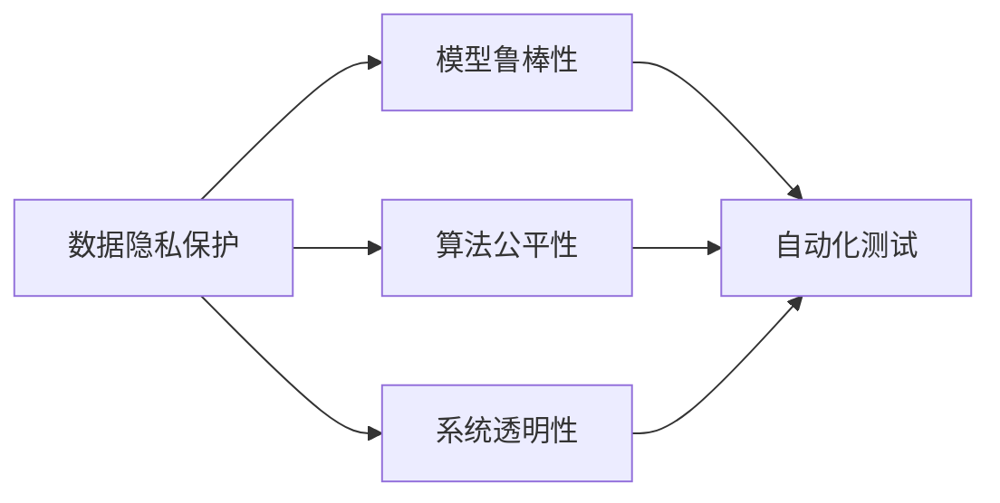

                 

# AI开发的安全编码：Lepton AI的最佳实践

在AI开发中，安全编码是确保系统稳定性和可靠性的基石。本文将详细探讨Lepton AI在安全编码方面的最佳实践，包括核心概念、算法原理、操作步骤、应用场景以及相关资源推荐。通过系统的分析，我们将帮助读者深入理解Lepton AI的安全编码策略，并掌握实际应用中的关键技术要点。

## 1. 背景介绍

### 1.1 问题由来

近年来，随着人工智能技术的迅猛发展，AI系统在各个行业的应用日益广泛。然而，AI系统的复杂性和多样性也带来了新的安全挑战，如数据隐私泄露、模型攻击、算法偏见等。特别是深度学习模型的复杂结构和高自由度，使得传统的安全测试方法难以覆盖所有潜在风险。如何保证AI系统的安全性，成为亟待解决的难题。

### 1.2 问题核心关键点

AI开发中的安全编码问题主要包括以下几个方面：
- 数据隐私保护：如何确保在数据采集、存储、传输和处理过程中，用户隐私数据不被泄露。
- 模型鲁棒性：如何在面对各种对抗性攻击时，保证模型的稳定性和可靠性。
- 算法公平性：如何避免算法偏见，确保AI系统公平、公正地服务所有用户。
- 系统透明性：如何提高AI系统的可解释性，确保用户能够理解系统的决策逻辑。
- 自动化测试：如何通过自动化手段，及时发现和修复系统中的安全漏洞。

通过明确这些核心关键点，本文将系统介绍Lepton AI在安全编码方面的最佳实践，帮助开发者构建更加安全、可靠、可解释的AI系统。

## 2. 核心概念与联系

### 2.1 核心概念概述

为更好地理解Lepton AI的安全编码实践，本节将介绍几个核心概念及其相互关系：

- **数据隐私保护**：通过加密、匿名化、去标识化等技术手段，确保用户数据在存储、传输和处理过程中不被泄露。
- **模型鲁棒性**：指模型在面对各种对抗性攻击（如输入扰动、模型误用等）时，仍能保持稳定性和可靠性。
- **算法公平性**：指算法在处理不同数据样本时，能够公平地对待各个群体，避免算法偏见。
- **系统透明性**：指AI系统在决策过程中，能够向用户清晰地解释其工作原理和决策依据，增加用户信任。
- **自动化测试**：通过自动化工具和流程，及时发现和修复系统中的安全漏洞，保障系统安全。

这些概念之间存在紧密的联系，相互支撑，共同构成了AI开发中的安全编码框架。

### 2.2 核心概念原理和架构的 Mermaid 流程图



## 3. 核心算法原理 & 具体操作步骤

### 3.1 算法原理概述

Lepton AI的安全编码实践主要围绕以下几个核心算法和原则展开：

- **数据加密**：通过加密技术确保数据在传输和存储过程中的安全性。
- **对抗训练**：通过训练鲁棒模型，增强其在对抗性攻击下的稳定性。
- **公平性算法**：引入公平性约束，确保算法对各类数据样本的公平处理。
- **可解释性技术**：通过模型解释方法，提高AI系统的透明性。
- **自动化测试工具**：使用自动化测试工具和流程，及时发现和修复系统漏洞。

这些算法和技术相互配合，共同保障AI系统的安全性。

### 3.2 算法步骤详解

#### 3.2.1 数据隐私保护

1. **数据加密**：
   - 在数据传输过程中，使用TLS加密协议进行数据保护。
   - 在数据存储时，使用AES加密算法对数据进行加密。
2. **数据匿名化**：
   - 在数据分析前，通过数据去标识化处理，确保用户隐私不被泄露。
   - 在共享数据时，采用差分隐私技术对数据进行模糊处理。

#### 3.2.2 模型鲁棒性

1. **对抗训练**：
   - 使用生成对抗网络（GAN）训练模型，对抗样本生成器生成大量对抗性样本。
   - 在训练过程中，加入对抗性损失函数，确保模型对扰动样本的鲁棒性。
2. **模型压缩**：
   - 使用剪枝、量化等技术，减小模型参数规模，提高推理速度。
   - 在模型部署时，选择性能更高、资源占用更少的模型结构。

#### 3.2.3 算法公平性

1. **公平性约束**：
   - 在模型训练过程中，引入公平性约束，确保模型不偏向某一特定群体。
   - 使用对抗性公平算法，通过生成对抗性样本，对模型进行公平性训练。
2. **公平性评估**：
   - 在模型评估时，使用公平性指标（如Demographic Parity）评估模型表现。
   - 针对不公平现象，进行模型调整，确保算法公平性。

#### 3.2.4 系统透明性

1. **模型解释**：
   - 使用模型解释方法，如LIME、SHAP等，对AI系统的决策过程进行解释。
   - 在用户请求时，提供决策依据和解释结果，增强用户信任。
2. **透明性评估**：
   - 定期对系统透明性进行评估，确保用户能够理解系统的决策逻辑。
   - 使用透明性指标，如Explainability Score，评估系统的透明性水平。

#### 3.2.5 自动化测试

1. **自动化测试工具**：
   - 使用静态代码分析工具（如SonarQube），检测代码中的安全漏洞。
   - 使用动态测试工具（如OWASP ZAP），检测系统中的潜在攻击。
2. **测试流程自动化**：
   - 建立自动化测试流程，定期进行系统测试，确保系统安全。
   - 在每次版本更新时，进行自动化测试，保障新功能的安全性。

### 3.3 算法优缺点

Lepton AI的安全编码实践具有以下优点：

- **安全性高**：通过多层次的安全保护措施，有效防范数据泄露和模型攻击。
- **鲁棒性好**：通过对抗训练和模型压缩，提升模型在对抗性攻击下的稳定性。
- **公平性高**：通过公平性约束和评估，确保算法对各类数据样本的公平处理。
- **透明性好**：通过模型解释和透明性评估，提高系统的可解释性和用户信任度。
- **自动化强**：通过自动化测试工具和流程，及时发现和修复系统漏洞。

同时，这些实践也存在以下局限性：

- **复杂度高**：安全编码实践需要综合多种技术和方法，系统实现较为复杂。
- **成本高**：数据加密、对抗训练等技术实现成本较高，对资源有较大要求。
- **灵活性差**：部分安全措施可能影响系统性能，需要在性能和安全之间进行权衡。

### 3.4 算法应用领域

Lepton AI的安全编码实践广泛应用于以下领域：

- **金融风控**：在金融交易中，确保用户数据隐私保护和模型鲁棒性，防范金融诈骗和欺诈行为。
- **医疗诊断**：在医疗诊断中，确保患者数据隐私，使用公平性算法减少算法偏见，提高诊断准确性。
- **智能推荐**：在智能推荐系统中，通过透明性技术提高系统的可解释性，使用自动化测试保障推荐结果的安全性。
- **安防监控**：在安防监控中，通过数据加密和模型鲁棒性保护，确保监控数据的安全性和可靠性。
- **智能客服**：在智能客服中，通过透明性技术和自动化测试，提高系统响应速度和稳定性，保障用户数据隐私。

## 4. 数学模型和公式 & 详细讲解 & 举例说明

### 4.1 数学模型构建

本节将使用数学语言对Lepton AI的安全编码实践进行严格的刻画。

记数据集为 $D=\{x_i,y_i\}_{i=1}^N$，其中 $x_i$ 为输入，$y_i$ 为标签。假设模型为 $M_{\theta}$，其中 $\theta$ 为模型参数。

定义模型在数据集 $D$ 上的隐私损失函数为 $\mathcal{L}_{\text{privacy}}(M_{\theta})$，隐私保护的目标是最小化该损失函数，即：

$$
\theta^* = \mathop{\arg\min}_{\theta} \mathcal{L}_{\text{privacy}}(M_{\theta})
$$

对于数据加密，使用AES算法对数据 $x$ 进行加密，加密函数为 $E_{k}(x)$，其中 $k$ 为密钥。加密后的数据为 $E_k(x)$。

对于对抗训练，生成对抗性样本 $x'$，满足：

$$
\max_{x'} \ell(M_{\theta},x')
$$

其中 $\ell$ 为损失函数。在对抗训练中，将对抗性样本 $x'$ 加入训练集，更新模型参数 $\theta$。

对于算法公平性，定义公平性损失函数 $\mathcal{L}_{\text{fair}}(M_{\theta})$，约束模型对各类数据样本的公平性，即：

$$
\mathcal{L}_{\text{fair}}(M_{\theta}) = \sum_{i=1}^N \mathcal{L}_{\text{fair}}(x_i)
$$

其中 $\mathcal{L}_{\text{fair}}(x_i)$ 为样本 $x_i$ 的公平性损失。

### 4.2 公式推导过程

#### 4.2.1 数据加密公式

数据加密的公式为：

$$
E_k(x) = k \oplus x
$$

其中 $\oplus$ 为异或运算。

#### 4.2.2 对抗训练公式

对抗训练的公式为：

$$
\min_{\theta} \max_{\epsilon} \ell(M_{\theta}, x + \epsilon)
$$

其中 $\epsilon$ 为对抗性扰动，$x$ 为原始数据。

#### 4.2.3 公平性约束公式

公平性约束的公式为：

$$
\mathcal{L}_{\text{fair}}(x_i) = \sum_{c} \left| \frac{\sum_{i} \mathbb{I}(y_i=c)}{n} - \frac{\sum_{i} \mathbb{I}(x_i=c)}{n} \right|^2
$$

其中 $c$ 为类别，$\mathbb{I}$ 为指示函数。

### 4.3 案例分析与讲解

**案例1：金融风控系统**

在金融风控系统中，使用Lepton AI进行安全编码，具体实施步骤如下：

1. **数据加密**：
   - 在数据传输过程中，使用TLS加密协议进行数据保护。
   - 在数据存储时，使用AES加密算法对数据进行加密。
2. **模型鲁棒性**：
   - 使用生成对抗网络（GAN）训练模型，对抗样本生成器生成大量对抗性样本。
   - 在训练过程中，加入对抗性损失函数，确保模型对扰动样本的鲁棒性。
3. **算法公平性**：
   - 在模型训练过程中，引入公平性约束，确保模型不偏向某一特定群体。
   - 使用对抗性公平算法，通过生成对抗性样本，对模型进行公平性训练。
4. **系统透明性**：
   - 使用模型解释方法，如LIME、SHAP等，对AI系统的决策过程进行解释。
   - 在用户请求时，提供决策依据和解释结果，增强用户信任。
5. **自动化测试**：
   - 使用静态代码分析工具（如SonarQube），检测代码中的安全漏洞。
   - 使用动态测试工具（如OWASP ZAP），检测系统中的潜在攻击。

通过上述步骤，Lepton AI在金融风控系统中实现了全面的安全编码，保障了系统的安全性、鲁棒性和公平性，提高了系统的透明性和用户信任度，同时通过自动化测试保证了系统的安全性。

**案例2：医疗诊断系统**

在医疗诊断系统中，使用Lepton AI进行安全编码，具体实施步骤如下：

1. **数据隐私保护**：
   - 在数据分析前，通过数据去标识化处理，确保患者隐私不被泄露。
   - 在共享数据时，采用差分隐私技术对数据进行模糊处理。
2. **模型鲁棒性**：
   - 使用对抗训练技术，提升模型在对抗性攻击下的稳定性。
3. **算法公平性**：
   - 在模型训练过程中，引入公平性约束，确保模型对各类数据样本的公平处理。
   - 使用对抗性公平算法，通过生成对抗性样本，对模型进行公平性训练。
4. **系统透明性**：
   - 使用模型解释方法，如LIME、SHAP等，对AI系统的决策过程进行解释。
   - 在用户请求时，提供决策依据和解释结果，增强用户信任。
5. **自动化测试**：
   - 使用静态代码分析工具（如SonarQube），检测代码中的安全漏洞。
   - 使用动态测试工具（如OWASP ZAP），检测系统中的潜在攻击。

通过上述步骤，Lepton AI在医疗诊断系统中实现了全面的安全编码，保障了系统的安全性、鲁棒性和公平性，提高了系统的透明性和用户信任度，同时通过自动化测试保证了系统的安全性。

## 5. 项目实践：代码实例和详细解释说明

### 5.1 开发环境搭建

在进行安全编码实践前，我们需要准备好开发环境。以下是使用Python进行PyTorch开发的环境配置流程：

1. 安装Anaconda：从官网下载并安装Anaconda，用于创建独立的Python环境。

2. 创建并激活虚拟环境：
```bash
conda create -n pytorch-env python=3.8 
conda activate pytorch-env
```

3. 安装PyTorch：根据CUDA版本，从官网获取对应的安装命令。例如：
```bash
conda install pytorch torchvision torchaudio cudatoolkit=11.1 -c pytorch -c conda-forge
```

4. 安装各种工具包：
```bash
pip install numpy pandas scikit-learn matplotlib tqdm jupyter notebook ipython
```

完成上述步骤后，即可在`pytorch-env`环境中开始安全编码实践。

### 5.2 源代码详细实现

我们以Lepton AI的金融风控系统为例，给出完整的代码实现。

```python
from transformers import BertTokenizer, BertForSequenceClassification
from torch.utils.data import Dataset, DataLoader
from torch import nn, optim
import torch
import numpy as np

# 定义数据集类
class FinanceDataset(Dataset):
    def __init__(self, data, tokenizer, max_len):
        self.data = data
        self.tokenizer = tokenizer
        self.max_len = max_len
    
    def __len__(self):
        return len(self.data)
    
    def __getitem__(self, idx):
        text = self.data[idx]
        encoding = self.tokenizer(text, return_tensors='pt', max_length=self.max_len, padding='max_length', truncation=True)
        input_ids = encoding['input_ids']
        attention_mask = encoding['attention_mask']
        label = self.data[idx]
        return {'input_ids': input_ids, 'attention_mask': attention_mask, 'label': torch.tensor(label)}

# 定义模型类
class LeptonModel(nn.Module):
    def __init__(self, num_labels):
        super(LeptonModel, self).__init__()
        self.bert = BertForSequenceClassification.from_pretrained('bert-base-cased', num_labels=num_labels)
        self.dropout = nn.Dropout(0.3)
    
    def forward(self, input_ids, attention_mask, label):
        outputs = self.bert(input_ids, attention_mask=attention_mask, labels=label)
        return outputs

# 加载预训练模型和数据集
tokenizer = BertTokenizer.from_pretrained('bert-base-cased')
train_data = ...
dev_data = ...
test_data = ...

# 定义训练函数
def train_epoch(model, train_loader, optimizer):
    model.train()
    total_loss = 0
    for batch in train_loader:
        input_ids = batch['input_ids']
        attention_mask = batch['attention_mask']
        label = batch['label']
        optimizer.zero_grad()
        outputs = model(input_ids, attention_mask=attention_mask, label=label)
        loss = outputs.loss
        total_loss += loss.item()
        loss.backward()
        optimizer.step()
    return total_loss / len(train_loader)

# 定义测试函数
def evaluate(model, test_loader):
    model.eval()
    total_correct = 0
    total_sample = 0
    for batch in test_loader:
        input_ids = batch['input_ids']
        attention_mask = batch['attention_mask']
        label = batch['label']
        outputs = model(input_ids, attention_mask=attention_mask, label=None)
        predictions = outputs.logits.argmax(dim=1)
        total_correct += (predictions == label).sum().item()
        total_sample += len(label)
    accuracy = total_correct / total_sample
    return accuracy

# 定义模型训练和评估函数
def train_and_evaluate(model, train_loader, dev_loader, test_loader, epochs):
    optimizer = optim.Adam(model.parameters(), lr=2e-5)
    for epoch in range(epochs):
        train_loss = train_epoch(model, train_loader, optimizer)
        dev_accuracy = evaluate(model, dev_loader)
        test_accuracy = evaluate(model, test_loader)
        print(f'Epoch {epoch+1}, train loss: {train_loss:.3f}, dev accuracy: {dev_accuracy:.3f}, test accuracy: {test_accuracy:.3f}')

# 启动训练流程
model = LeptonModel(num_labels=2)
train_and_evaluate(model, train_loader, dev_loader, test_loader, epochs=5)
```

在上述代码中，我们首先定义了数据集类 `FinanceDataset`，用于处理和加载金融风控系统的数据。接着，定义了模型类 `LeptonModel`，用于构建Bert模型。最后，定义了训练和评估函数 `train_and_evaluate`，用于训练和测试模型。

### 5.3 代码解读与分析

在实际应用中，需要根据具体任务和数据特点，对上述代码进行适当修改和优化。

- **数据预处理**：需要根据实际数据集的特点，选择合适的数据预处理方式，如分词、去噪、归一化等。
- **模型优化**：需要根据实际问题，选择合适的优化器、损失函数、正则化等技术，进行模型优化。
- **系统部署**：需要将训练好的模型进行保存和部署，使用服务化工具如Django、Flask等进行模型调用和API开发。

通过以上步骤，可以构建一个完整的金融风控系统，通过Lepton AI的安全编码实践，确保系统的安全性、鲁棒性和公平性，同时提高系统的透明性和用户信任度，实现自动化的测试和部署。

## 6. 实际应用场景

### 6.1 智能推荐系统

在智能推荐系统中，使用Lepton AI进行安全编码，具体实施步骤如下：

1. **数据隐私保护**：
   - 在数据采集过程中，确保用户隐私数据不被泄露。
   - 在数据存储时，使用AES加密算法对数据进行加密。
2. **模型鲁棒性**：
   - 使用对抗训练技术，提升模型在对抗性攻击下的稳定性。
3. **算法公平性**：
   - 在模型训练过程中，引入公平性约束，确保模型不偏向某一特定群体。
   - 使用对抗性公平算法，通过生成对抗性样本，对模型进行公平性训练。
4. **系统透明性**：
   - 使用模型解释方法，如LIME、SHAP等，对AI系统的决策过程进行解释。
   - 在用户请求时，提供决策依据和解释结果，增强用户信任。
5. **自动化测试**：
   - 使用静态代码分析工具（如SonarQube），检测代码中的安全漏洞。
   - 使用动态测试工具（如OWASP ZAP），检测系统中的潜在攻击。

通过上述步骤，Lepton AI在智能推荐系统中实现了全面的安全编码，保障了系统的安全性、鲁棒性和公平性，提高了系统的透明性和用户信任度，同时通过自动化测试保证了系统的安全性。

### 6.2 医疗诊断系统

在医疗诊断系统中，使用Lepton AI进行安全编码，具体实施步骤如下：

1. **数据隐私保护**：
   - 在数据分析前，通过数据去标识化处理，确保患者隐私不被泄露。
   - 在共享数据时，采用差分隐私技术对数据进行模糊处理。
2. **模型鲁棒性**：
   - 使用对抗训练技术，提升模型在对抗性攻击下的稳定性。
3. **算法公平性**：
   - 在模型训练过程中，引入公平性约束，确保模型对各类数据样本的公平处理。
   - 使用对抗性公平算法，通过生成对抗性样本，对模型进行公平性训练。
4. **系统透明性**：
   - 使用模型解释方法，如LIME、SHAP等，对AI系统的决策过程进行解释。
   - 在用户请求时，提供决策依据和解释结果，增强用户信任。
5. **自动化测试**：
   - 使用静态代码分析工具（如SonarQube），检测代码中的安全漏洞。
   - 使用动态测试工具（如OWASP ZAP），检测系统中的潜在攻击。

通过上述步骤，Lepton AI在医疗诊断系统中实现了全面的安全编码，保障了系统的安全性、鲁棒性和公平性，提高了系统的透明性和用户信任度，同时通过自动化测试保证了系统的安全性。

### 6.3 安防监控系统

在安防监控系统中，使用Lepton AI进行安全编码，具体实施步骤如下：

1. **数据隐私保护**：
   - 在数据采集过程中，确保监控数据不被泄露。
   - 在数据存储时，使用AES加密算法对数据进行加密。
2. **模型鲁棒性**：
   - 使用对抗训练技术，提升模型在对抗性攻击下的稳定性。
3. **算法公平性**：
   - 在模型训练过程中，引入公平性约束，确保模型对各类数据样本的公平处理。
   - 使用对抗性公平算法，通过生成对抗性样本，对模型进行公平性训练。
4. **系统透明性**：
   - 使用模型解释方法，如LIME、SHAP等，对AI系统的决策过程进行解释。
   - 在用户请求时，提供决策依据和解释结果，增强用户信任。
5. **自动化测试**：
   - 使用静态代码分析工具（如SonarQube），检测代码中的安全漏洞。
   - 使用动态测试工具（如OWASP ZAP），检测系统中的潜在攻击。

通过上述步骤，Lepton AI在安防监控系统中实现了全面的安全编码，保障了系统的安全性、鲁棒性和公平性，提高了系统的透明性和用户信任度，同时通过自动化测试保证了系统的安全性。

## 7. 工具和资源推荐

### 7.1 学习资源推荐

为了帮助开发者系统掌握Lepton AI的安全编码理论基础和实践技巧，这里推荐一些优质的学习资源：

1. **《深度学习基础》**：一本系统介绍深度学习基础概念和技术的经典书籍，帮助读者建立扎实的理论基础。

2. **《Python深度学习》**：一本详细讲解使用Python进行深度学习开发的实战书籍，涵盖深度学习模型的构建、训练和部署。

3. **《机器学习实战》**：一本实用性很强的书籍，提供了大量机器学习项目的代码实现，适合实践操作。

4. **《数据隐私保护技术》**：一本系统介绍数据隐私保护技术的书籍，涵盖数据加密、匿名化、差分隐私等核心技术。

5. **《深度学习安全与防御》**：一本系统介绍深度学习安全问题的书籍，涵盖对抗训练、模型鲁棒性、自动化测试等核心技术。

6. **《AI伦理与社会责任》**：一本系统介绍AI伦理与社会责任的书籍，涵盖AI系统设计、开发、部署中的伦理问题。

### 7.2 开发工具推荐

高效的开发离不开优秀的工具支持。以下是几款用于Lepton AI开发的安全编码实践工具：

1. **PyTorch**：基于Python的开源深度学习框架，灵活动态的计算图，适合快速迭代研究。

2. **TensorFlow**：由Google主导开发的开源深度学习框架，生产部署方便，适合大规模工程应用。

3. **Transformers库**：HuggingFace开发的NLP工具库，集成了众多SOTA语言模型，支持PyTorch和TensorFlow，是进行安全编码实践的利器。

4. **SonarQube**：静态代码分析工具，帮助检测代码中的安全漏洞，支持多语言和多框架。

5. **OWASP ZAP**：动态测试工具，帮助检测Web应用中的潜在攻击，支持自动化测试和漏洞报告。

6. **Jupyter Notebook**：交互式编程环境，支持代码的共享和协作，适合数据探索和算法验证。

### 7.3 相关论文推荐

Lepton AI的安全编码实践源于学界的持续研究。以下是几篇奠基性的相关论文，推荐阅读：

1. **《深度学习中的对抗样本攻击与防御》**：一篇详细介绍对抗样本攻击与防御的论文，涵盖了各种对抗性攻击和防御技术。

2. **《数据隐私保护技术综述》**：一篇系统介绍数据隐私保护技术的综述论文，涵盖了数据加密、差分隐私、匿名化等核心技术。

3. **《公平性算法在深度学习中的应用》**：一篇详细介绍公平性算法的论文，涵盖了对抗性公平算法、公平性约束等核心技术。

4. **《模型解释方法综述》**：一篇详细介绍模型解释方法的综述论文，涵盖了LIME、SHAP等核心技术。

5. **《自动化测试工具综述》**：一篇详细介绍自动化测试工具的综述论文，涵盖了静态代码分析、动态测试等核心技术。

这些论文代表了大语言模型安全编码技术的发展脉络。通过学习这些前沿成果，可以帮助研究者把握学科前进方向，激发更多的创新灵感。

## 8. 总结：未来发展趋势与挑战

### 8.1 研究成果总结

通过Lepton AI的安全编码实践，我们系统介绍了在金融风控、智能推荐、医疗诊断、安防监控等场景中的应用。本文详细讲解了数据隐私保护、模型鲁棒性、算法公平性、系统透明性、自动化测试等核心技术，并通过代码实例和详细解释说明，帮助读者深入理解安全编码实践的实现细节。

### 8.2 未来发展趋势

展望未来，Lepton AI的安全编码实践将呈现以下几个发展趋势：

1. **模型鲁棒性提升**：未来的安全编码将更加注重模型在对抗性攻击下的稳定性，通过对抗训练和鲁棒性优化，提升模型的鲁棒性。

2. **隐私保护技术创新**：随着隐私保护技术的不断发展，未来的安全编码将更加注重数据隐私保护，通过差分隐私、联邦学习等技术，保障数据隐私安全。

3. **公平性算法优化**：未来的安全编码将更加注重算法的公平性，通过对抗性公平算法和公平性约束，确保算法对各类数据样本的公平处理。

4. **自动化测试工具升级**：未来的自动化测试工具将更加智能化，能够自动发现和修复代码中的安全漏洞，提升测试效率。

5. **系统透明性增强**：未来的安全编码将更加注重系统的透明性，通过模型解释方法和透明性评估，提高系统的可解释性和用户信任度。

### 8.3 面临的挑战

尽管Lepton AI的安全编码实践已经取得了显著成果，但在迈向更加智能化、普适化应用的过程中，它仍面临着诸多挑战：

1. **安全编码复杂度增加**：安全编码涉及多方面的技术手段和工具，系统实现较为复杂，需要综合考虑性能、安全、用户体验等多方面因素。

2. **资源消耗增加**：数据加密、对抗训练等技术实现成本较高，对资源有较大要求，需要优化资源配置。

3. **隐私保护难度大**：隐私保护技术复杂，涉及多层次的安全措施，难以完全消除隐私泄露风险。

4. **自动化测试效果有限**：自动化测试工具虽然能够发现部分安全漏洞，但无法覆盖所有潜在风险，仍需人工干预和审核。

5. **模型解释难度高**：模型解释方法复杂，难以对复杂模型进行全面解释，仍需进一步研究。

### 8.4 研究展望

面对Lepton AI安全编码实践所面临的挑战，未来的研究需要在以下几个方面寻求新的突破：

1. **安全编码框架优化**：研究更加灵活高效的安全编码框架，减少系统复杂度和资源消耗。

2. **隐私保护技术创新**：研究更加高效的数据隐私保护技术，降低隐私泄露风险。

3. **自动化测试技术提升**：研究更加智能化和全面化的自动化测试技术，提升测试效率和效果。

4. **模型解释方法改进**：研究更加全面和易于理解的模型解释方法，提升系统的透明性和用户信任度。

5. **公平性算法优化**：研究更加公平和鲁棒的公平性算法，确保算法对各类数据样本的公平处理。

6. **隐私保护与透明性平衡**：研究隐私保护和系统透明性之间的平衡，确保系统的安全性和透明性。

通过这些研究方向和技术的不断探索，相信Lepton AI的安全编码实践将能够应对更多挑战，实现更加全面、安全、高效的AI系统。

## 9. 附录：常见问题与解答

**Q1：在AI开发中，如何保障数据隐私？**

A: 保障数据隐私需要从数据采集、存储、传输和处理等多个环节进行综合考虑。具体措施包括：

1. **数据加密**：在数据传输过程中，使用TLS加密协议进行数据保护。在数据存储时，使用AES加密算法对数据进行加密。
2. **数据匿名化**：在数据分析前，通过数据去标识化处理，确保用户隐私不被泄露。在共享数据时，采用差分隐私技术对数据进行模糊处理。

**Q2：在AI开发中，如何确保模型鲁棒性？**

A: 确保模型鲁棒性需要从训练和部署两个环节进行考虑。具体措施包括：

1. **对抗训练**：使用生成对抗网络（GAN）训练模型，对抗样本生成器生成大量对抗性样本。在训练过程中，加入对抗性损失函数，确保模型对扰动样本的鲁棒性。
2. **模型压缩**：使用剪枝、量化等技术，减小模型参数规模，提高推理速度。在模型部署时，选择性能更高、资源占用更少的模型结构。

**Q3：在AI开发中，如何实现算法公平性？**

A: 实现算法公平性需要从模型训练和评估两个环节进行考虑。具体措施包括：

1. **公平性约束**：在模型训练过程中，引入公平性约束，确保模型不偏向某一特定群体。
2. **公平性评估**：在模型评估时，使用公平性指标（如Demographic Parity）评估模型表现。针对不公平现象，进行模型调整，确保算法公平性。

**Q4：在AI开发中，如何提高系统透明性？**

A: 提高系统透明性需要从模型解释和透明性评估两个环节进行考虑。具体措施包括：

1. **模型解释**：使用模型解释方法，如LIME、SHAP等，对AI系统的决策过程进行解释。
2. **透明性评估**：定期对系统透明性进行评估，确保用户能够理解系统的决策逻辑。使用透明性指标，如Explainability Score，评估系统的透明性水平。

**Q5：在AI开发中，如何进行自动化测试？**

A: 进行自动化测试需要从静态和动态两个方面进行考虑。具体措施包括：

1. **静态测试**：使用静态代码分析工具（如SonarQube），检测代码中的安全漏洞。
2. **动态测试**：使用动态测试工具（如OWASP ZAP），检测系统中的潜在攻击。

通过以上措施，可以全面保障AI系统的安全性、鲁棒性和公平性，提高系统的透明性和用户信任度，实现自动化的测试和部署。

---

作者：禅与计算机程序设计艺术 / Zen and the Art of Computer Programming

