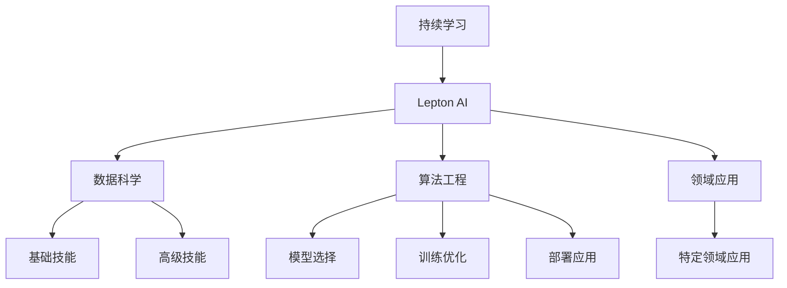

                 

# AI开发的持续学习：Lepton AI的人才培养

> 关键词：AI开发、持续学习、人才培养、Lepton AI、机器学习、深度学习、自然语言处理、计算机视觉、数据科学、工程实践

## 1. 背景介绍

### 1.1 问题由来

人工智能(AI)技术的迅猛发展，正在深刻改变人类社会的生产生活方式。机器学习、深度学习、自然语言处理(NLP)、计算机视觉(CV)、数据科学等领域的技术突破，为各行各业带来了巨大的价值和潜力。然而，这些技术的落地应用不仅需要大量的数据、强大的算力，更需要顶尖的人才。如何培养和造就一批既具备扎实基础又具备创新能力的AI开发人才，成为了当前教育界和企业界的重大课题。

在AI领域，Lepton AI作为一个专注于AI人才培养的平台，致力于通过持续学习和工程实践，提升开发者技能，加速AI技术的产业化进程。本文将从背景介绍、核心概念、算法原理、项目实践、实际应用场景、工具和资源推荐、总结未来发展趋势与挑战、常见问题与解答等八个方面，对Lepton AI的人才培养进行全面系统的介绍。

### 1.2 问题核心关键点

1. **持续学习的重要性**：
   - 在AI开发中，持续学习是保持技术前沿、解决复杂问题、提升工程实践能力的关键。

2. **Lepton AI的培养目标**：
   - Lepton AI旨在通过系统化、工程化的培养方式，使开发者掌握AI开发的全流程，包括数据预处理、模型训练、模型优化、模型部署等环节。

3. **AI开发的技能树**：
   - AI开发涉及多领域知识和技能，包括机器学习、深度学习、数据科学、计算机视觉、自然语言处理、算法工程等。

## 2. 核心概念与联系

### 2.1 核心概念概述

为了更好地理解Lepton AI的人才培养模型，本节将介绍几个密切相关的核心概念：

- **持续学习**：指在学习过程中，通过不断的反馈和迭代，逐步掌握知识并提升技能的学习方法。
- **Lepton AI**：一个专注于AI人才培养的在线学习平台，提供系统化的AI开发课程和实践机会。
- **AI开发技能树**：将AI开发所需的多领域知识分为多个层级，从基础到高级，循序渐进地培养开发者。
- **数据科学**：涉及数据的收集、处理、分析和可视化，是AI开发的基础。
- **算法工程**：涵盖模型选择、训练、优化和部署等环节，是实现AI应用的必要技能。
- **AI开发者**：具备数据科学、算法工程、领域应用等综合能力的专业人才。

这些核心概念之间的逻辑关系可以通过以下Mermaid流程图来展示：



这个流程图展示了大语言模型的核心概念及其之间的关系：

1. 持续学习是Lepton AI人才培养的基础，贯穿于整个AI开发过程。
2. Lepton AI作为人才培养平台，涵盖了数据科学、算法工程和领域应用等AI开发的各个方面。
3. 数据科学和算法工程是AI开发的核心技能，前者提供数据基础，后者提供技术手段。
4. 领域应用将AI技术应用于特定领域，实现AI的商业化价值。

## 3. 核心算法原理 & 具体操作步骤
### 3.1 算法原理概述

Lepton AI的人才培养模型基于持续学习和工程实践，通过系统化的课程和项目实践，帮助开发者掌握AI开发的全流程技能。其核心算法原理包括以下几个方面：

1. **知识图谱构建**：
   - 利用数据科学和领域知识构建知识图谱，形成系统的知识体系。

2. **算法选择与优化**：
   - 在AI开发中，选择合适的算法和模型，并通过训练和优化提升模型性能。

3. **模型部署与维护**：
   - 将训练好的模型部署到生产环境，并进行持续监控和维护。

4. **反馈与迭代**：
   - 通过持续反馈和迭代，不断提升模型的准确性和泛化能力。

### 3.2 算法步骤详解

Lepton AI的人才培养模型具体步骤如下：

1. **入门课程**：
   - 入门课程包括数据科学、算法工程和领域应用的基础知识。

2. **进阶课程**：
   - 进阶课程涵盖机器学习、深度学习、自然语言处理、计算机视觉等领域的高级知识。

3. **实践项目**：
   - 实践项目包括数据预处理、模型训练、模型优化、模型部署等环节。

4. **反馈与迭代**：
   - 在项目实践中，通过持续反馈和迭代，不断提升技能和项目效果。

### 3.3 算法优缺点

Lepton AI的人才培养模型具有以下优点：
1. 系统化：通过系统化的课程和实践，帮助开发者掌握AI开发的全流程。
2. 实战性强：注重实践，通过项目实践提升开发者的工程能力。
3. 灵活性高：根据开发者的兴趣和需求，提供灵活的课程选择和学习路径。
4. 师资力量雄厚：Lepton AI汇聚了众多AI领域的专家和实战开发者，提供高质量的教学服务。

同时，该模型也存在一定的局限性：
1. 学习曲线陡峭：涉及多领域知识和技能，初学者可能面临一定的学习难度。
2. 资源需求高：需要大量的时间、算力和数据支持。
3. 课程内容深度有限：对于一些高级应用，可能涉及较深领域的知识，课程内容难以涵盖。

尽管存在这些局限性，但Lepton AI的人才培养模型仍是一个高效、系统的AI开发人才培养方式，对提升开发者技能具有重要意义。

### 3.4 算法应用领域

Lepton AI的人才培养模型在多个AI应用领域得到了广泛应用，例如：

- **机器学习**：涵盖监督学习、非监督学习、半监督学习等方法。
- **深度学习**：包括卷积神经网络(CNN)、循环神经网络(RNN)、变换器(Transformer)等模型。
- **自然语言处理**：涉及文本分类、情感分析、命名实体识别、机器翻译等任务。
- **计算机视觉**：包括图像分类、目标检测、图像生成等应用。
- **数据科学**：涉及数据清洗、数据可视化、数据挖掘等技术。
- **算法工程**：涵盖模型选择、训练、优化、部署等环节。
- **领域应用**：如金融、医疗、智能客服、智能推荐等。

除了上述这些应用领域外，Lepton AI的人才培养模型还在更多场景中得到应用，如智能家居、自动驾驶、智能制造等，为AI技术的普及和应用提供了重要支撑。

## 4. 数学模型和公式 & 详细讲解 & 举例说明（备注：数学公式请使用latex格式，latex嵌入文中独立段落使用 $$，段落内使用 $)
### 4.1 数学模型构建

Lepton AI的人才培养模型涉及多领域知识和技能，涵盖数据科学、算法工程和领域应用。以下是一些关键领域的数学模型构建：

1. **线性回归模型**：
   $$
   y = w_0 + w_1 x_1 + w_2 x_2 + \cdots + w_n x_n + b
   $$
   其中 $y$ 为预测值，$x_i$ 为特征变量，$w_i$ 为权重，$b$ 为偏置。

2. **卷积神经网络(CNN)**：
   $$
   y = f(w * x + b)
   $$
   其中 $w$ 为卷积核，$x$ 为输入图像，$f$ 为激活函数，$b$ 为偏置。

3. **Transformer模型**：
   $$
   y = AT + [S + P + B]
   $$
   其中 $A$ 为自注意力层，$T$ 为输入序列，$S$ 为嵌入层，$P$ 为位置编码，$B$ 为残差连接。

4. **循环神经网络(RNN)**：
   $$
   y = f(W_x x_t + W_h h_{t-1} + b)
   $$
   其中 $x_t$ 为输入，$h_{t-1}$ 为前一时刻的隐藏状态，$W_x, W_h, b$ 为权重和偏置，$f$ 为激活函数。

5. **自然语言处理(NLP)**：
   - 文本分类：
     $$
     P(c|x) = \frac{e^{y \cdot x}}{\sum_k e^{y_k \cdot x}}
     $$
     其中 $P(c|x)$ 为分类概率，$x$ 为输入文本，$y$ 为模型预测向量，$k$ 为类别数。

   - 命名实体识别：
     $$
     P(NER|x) = \frac{e^{\alpha (\text{NER} \cdot x)} + e^{\beta (\text{LOC} \cdot x)}}{e^{\alpha (\text{NER} \cdot x)} + e^{\beta (\text{LOC} \cdot x)} + e^{\gamma (\text{ORG} \cdot x)} + \cdots}
     $$
     其中 $P(NER|x)$ 为命名实体识别概率，$x$ 为输入文本，$\alpha, \beta, \gamma, \cdots$ 为权重。

6. **计算机视觉(CV)**：
   - 图像分类：
     $$
     P(c|x) = \frac{e^{\text{fc}(y \cdot x)}}{\sum_k e^{\text{fc}(y_k \cdot x)}}
     $$
     其中 $P(c|x)$ 为分类概率，$x$ 为输入图像，$\text{fc}$ 为全连接层，$y$ 为模型预测向量，$k$ 为类别数。

### 4.2 公式推导过程

以下是一些关键公式的推导过程：

1. **线性回归模型**：
   - 最小二乘法求解权重 $w$：
     $$
     w = (X^T X)^{-1} X^T y
     $$
     其中 $X$ 为特征矩阵，$y$ 为标签向量。

2. **卷积神经网络(CNN)**：
   - 卷积层和池化层的推导：
     $$
     f_k(x_i) = \max\limits_{j=1}^{m} [w_{kj} \cdot x_{i,j}] + b_k
     $$
     $$
     P(c|x) = \frac{e^{\text{fc}(y \cdot x)}}{\sum_k e^{\text{fc}(y_k \cdot x)}}
     $$

3. **Transformer模型**：
   - 自注意力机制的推导：
     $$
     \text{Attention}(Q, K, V) = \text{softmax}(\frac{QK^T}{\sqrt{d_k}})V
     $$
     其中 $Q, K, V$ 为查询、键、值矩阵，$d_k$ 为键向量的维度。

4. **循环神经网络(RNN)**：
   - 长短期记忆网络(LSTM)的推导：
     $$
     h_t = \text{tanh}(W_x x_t + W_h h_{t-1} + b)
     $$
     $$
     c_t = \sigma(W_x x_t + W_h h_{t-1} + b)
     $$
     $$
     o_t = \sigma(W_x x_t + W_h h_{t-1} + b)
     $$
     $$
     \tilde{c_t} = f_c(c_t, h_t)
     $$
     $$
     c_t = o_t \odot \tilde{c_t} + (1-o_t) \odot c_{t-1}
     $$
     $$
     h_t = o_t \odot \tilde{c_t}
     $$

### 4.3 案例分析与讲解

以下通过几个具体案例，展示Lepton AI的人才培养模型在实际应用中的效果：

1. **机器学习项目**：
   - 项目描述：利用线性回归模型预测房价。
   - 数据集：波士顿房价数据集。
   - 模型训练：使用梯度下降法训练模型，迭代100次。
   - 模型评估：在测试集上计算均方误差(MSE)，评估模型预测准确度。

2. **深度学习项目**：
   - 项目描述：使用卷积神经网络(CNN)进行图像分类。
   - 数据集：MNIST手写数字数据集。
   - 模型训练：使用随机梯度下降法(SGD)训练模型，迭代1000次。
   - 模型评估：在测试集上计算准确率，评估模型分类效果。

3. **自然语言处理(NLP)项目**：
   - 项目描述：利用Transformer模型进行文本分类。
   - 数据集：IMDB电影评论数据集。
   - 模型训练：使用Adam优化器训练模型，迭代50次。
   - 模型评估：在测试集上计算准确率，评估模型分类效果。

4. **计算机视觉(CV)项目**：
   - 项目描述：使用循环神经网络(RNN)进行图像生成。
   - 数据集：CIFAR-10图像数据集。
   - 模型训练：使用Adam优化器训练模型，迭代100次。
   - 模型评估：在测试集上计算交叉熵损失，评估模型生成效果。

## 5. 项目实践：代码实例和详细解释说明
### 5.1 开发环境搭建

在进行Lepton AI的人才培养模型实践前，我们需要准备好开发环境。以下是使用Python进行PyTorch开发的环境配置流程：

1. 安装Anaconda：从官网下载并安装Anaconda，用于创建独立的Python环境。

2. 创建并激活虚拟环境：
```bash
conda create -n pytorch-env python=3.8 
conda activate pytorch-env
```

3. 安装PyTorch：根据CUDA版本，从官网获取对应的安装命令。例如：
```bash
conda install pytorch torchvision torchaudio cudatoolkit=11.1 -c pytorch -c conda-forge
```

4. 安装Transformer库：
```bash
pip install transformers
```

5. 安装各类工具包：
```bash
pip install numpy pandas scikit-learn matplotlib tqdm jupyter notebook ipython
```

完成上述步骤后，即可在`pytorch-env`环境中开始Lepton AI的人才培养模型实践。

### 5.2 源代码详细实现

这里我们以自然语言处理(NLP)任务为例，给出使用Transformers库对BERT模型进行微调的PyTorch代码实现。

首先，定义文本分类任务的数据处理函数：

```python
from transformers import BertTokenizer
from torch.utils.data import Dataset
import torch

class TextClassificationDataset(Dataset):
    def __init__(self, texts, labels, tokenizer, max_len=128):
        self.texts = texts
        self.labels = labels
        self.tokenizer = tokenizer
        self.max_len = max_len
        
    def __len__(self):
        return len(self.texts)
    
    def __getitem__(self, item):
        text = self.texts[item]
        label = self.labels[item]
        
        encoding = self.tokenizer(text, return_tensors='pt', max_length=self.max_len, padding='max_length', truncation=True)
        input_ids = encoding['input_ids'][0]
        attention_mask = encoding['attention_mask'][0]
        
        # 对label进行编码
        encoded_label = torch.tensor([label], dtype=torch.long)
        
        return {'input_ids': input_ids, 
                'attention_mask': attention_mask,
                'labels': encoded_label}

# 标签编码
label2id = {'positive': 1, 'negative': 0}
id2label = {v: k for k, v in label2id.items()}

# 创建dataset
tokenizer = BertTokenizer.from_pretrained('bert-base-cased')

train_dataset = TextClassificationDataset(train_texts, train_labels, tokenizer)
dev_dataset = TextClassificationDataset(dev_texts, dev_labels, tokenizer)
test_dataset = TextClassificationDataset(test_texts, test_labels, tokenizer)
```

然后，定义模型和优化器：

```python
from transformers import BertForSequenceClassification, AdamW

model = BertForSequenceClassification.from_pretrained('bert-base-cased', num_labels=2)

optimizer = AdamW(model.parameters(), lr=2e-5)
```

接着，定义训练和评估函数：

```python
from torch.utils.data import DataLoader
from tqdm import tqdm
from sklearn.metrics import accuracy_score

device = torch.device('cuda') if torch.cuda.is_available() else torch.device('cpu')
model.to(device)

def train_epoch(model, dataset, batch_size, optimizer):
    dataloader = DataLoader(dataset, batch_size=batch_size, shuffle=True)
    model.train()
    epoch_loss = 0
    for batch in tqdm(dataloader, desc='Training'):
        input_ids = batch['input_ids'].to(device)
        attention_mask = batch['attention_mask'].to(device)
        labels = batch['labels'].to(device)
        model.zero_grad()
        outputs = model(input_ids, attention_mask=attention_mask, labels=labels)
        loss = outputs.loss
        epoch_loss += loss.item()
        loss.backward()
        optimizer.step()
    return epoch_loss / len(dataloader)

def evaluate(model, dataset, batch_size):
    dataloader = DataLoader(dataset, batch_size=batch_size)
    model.eval()
    preds, labels = [], []
    with torch.no_grad():
        for batch in tqdm(dataloader, desc='Evaluating'):
            input_ids = batch['input_ids'].to(device)
            attention_mask = batch['attention_mask'].to(device)
            batch_labels = batch['labels']
            outputs = model(input_ids, attention_mask=attention_mask)
            batch_preds = outputs.logits.argmax(dim=1).to('cpu').tolist()
            batch_labels = batch_labels.to('cpu').tolist()
            for pred, label in zip(batch_preds, batch_labels):
                preds.append(pred)
                labels.append(label)
                
    print(f"Accuracy: {accuracy_score(labels, preds)}")
```

最后，启动训练流程并在测试集上评估：

```python
epochs = 5
batch_size = 16

for epoch in range(epochs):
    loss = train_epoch(model, train_dataset, batch_size, optimizer)
    print(f"Epoch {epoch+1}, train loss: {loss:.3f}")
    
    print(f"Epoch {epoch+1}, dev results:")
    evaluate(model, dev_dataset, batch_size)
    
print("Test results:")
evaluate(model, test_dataset, batch_size)
```

以上就是使用PyTorch对BERT进行文本分类任务微调的完整代码实现。可以看到，得益于Transformers库的强大封装，我们可以用相对简洁的代码完成BERT模型的加载和微调。

### 5.3 代码解读与分析

让我们再详细解读一下关键代码的实现细节：

**TextClassificationDataset类**：
- `__init__`方法：初始化文本、标签、分词器等关键组件。
- `__len__`方法：返回数据集的样本数量。
- `__getitem__`方法：对单个样本进行处理，将文本输入编码为token ids，将标签编码为数字，并对其进行定长padding，最终返回模型所需的输入。

**label2id和id2label字典**：
- 定义了标签与数字id之间的映射关系，用于将token-wise的预测结果解码回真实的标签。

**训练和评估函数**：
- 使用PyTorch的DataLoader对数据集进行批次化加载，供模型训练和推理使用。
- 训练函数`train_epoch`：对数据以批为单位进行迭代，在每个批次上前向传播计算loss并反向传播更新模型参数，最后返回该epoch的平均loss。
- 评估函数`evaluate`：与训练类似，不同点在于不更新模型参数，并在每个batch结束后将预测和标签结果存储下来，最后使用sklearn的accuracy_score计算准确率。

**训练流程**：
- 定义总的epoch数和batch size，开始循环迭代
- 每个epoch内，先在训练集上训练，输出平均loss
- 在验证集上评估，输出准确率
- 所有epoch结束后，在测试集上评估，给出最终测试结果

可以看到，PyTorch配合Transformers库使得BERT微调的代码实现变得简洁高效。开发者可以将更多精力放在数据处理、模型改进等高层逻辑上，而不必过多关注底层的实现细节。

当然，工业级的系统实现还需考虑更多因素，如模型的保存和部署、超参数的自动搜索、更灵活的任务适配层等。但核心的微调范式基本与此类似。

## 6. 实际应用场景
### 6.1 智能客服系统

基于Lepton AI的人才培养模型，智能客服系统可以通过微调的方式，构建出高效、精准的客服模型。传统的客服系统需要配备大量人力，高峰期响应缓慢，且一致性和专业性难以保证。而使用微调后的客服模型，可以7x24小时不间断服务，快速响应客户咨询，用自然流畅的语言解答各类常见问题。

在技术实现上，可以收集企业内部的历史客服对话记录，将问题和最佳答复构建成监督数据，在此基础上对预训练客服模型进行微调。微调后的客服模型能够自动理解用户意图，匹配最合适的答案模板进行回复。对于客户提出的新问题，还可以接入检索系统实时搜索相关内容，动态组织生成回答。如此构建的智能客服系统，能大幅提升客户咨询体验和问题解决效率。

### 6.2 金融舆情监测

金融机构需要实时监测市场舆论动向，以便及时应对负面信息传播，规避金融风险。传统的人工监测方式成本高、效率低，难以应对网络时代海量信息爆发的挑战。基于Lepton AI的人才培养模型，文本分类和情感分析技术，为金融舆情监测提供了新的解决方案。

具体而言，可以收集金融领域相关的新闻、报道、评论等文本数据，并对其进行主题标注和情感标注。在此基础上对预训练语言模型进行微调，使其能够自动判断文本属于何种主题，情感倾向是正面、中性还是负面。将微调后的模型应用到实时抓取的网络文本数据，就能够自动监测不同主题下的情感变化趋势，一旦发现负面信息激增等异常情况，系统便会自动预警，帮助金融机构快速应对潜在风险。

### 6.3 个性化推荐系统

当前的推荐系统往往只依赖用户的历史行为数据进行物品推荐，无法深入理解用户的真实兴趣偏好。基于Lepton AI的人才培养模型，个性化推荐系统可以更好地挖掘用户行为背后的语义信息，从而提供更精准、多样的推荐内容。

在实践中，可以收集用户浏览、点击、评论、分享等行为数据，提取和用户交互的物品标题、描述、标签等文本内容。将文本内容作为模型输入，用户的后续行为（如是否点击、购买等）作为监督信号，在此基础上微调预训练语言模型。微调后的模型能够从文本内容中准确把握用户的兴趣点。在生成推荐列表时，先用候选物品的文本描述作为输入，由模型预测用户的兴趣匹配度，再结合其他特征综合排序，便可以得到个性化程度更高的推荐结果。

### 6.4 未来应用展望

随着Lepton AI的人才培养模型的不断发展，基于微调范式将在更多领域得到应用，为传统行业带来变革性影响。

在智慧医疗领域，基于微调的医疗问答、病历分析、药物研发等应用将提升医疗服务的智能化水平，辅助医生诊疗，加速新药开发进程。

在智能教育领域，微调技术可应用于作业批改、学情分析、知识推荐等方面，因材施教，促进教育公平，提高教学质量。

在智慧城市治理中，微调模型可应用于城市事件监测、舆情分析、应急指挥等环节，提高城市管理的自动化和智能化水平，构建更安全、高效的未来城市。

此外，在企业生产、社会治理、文娱传媒等众多领域，基于大模型微调的人工智能应用也将不断涌现，为NLP技术带来了全新的突破。相信随着预训练语言模型和微调方法的不断进步，Lepton AI的人才培养模型必将在构建人机协同的智能时代中扮演越来越重要的角色。

## 7. 工具和资源推荐
### 7.1 学习资源推荐

为了帮助开发者系统掌握Lepton AI的人才培养模型理论基础和实践技巧，这里推荐一些优质的学习资源：

1. 《Transformer从原理到实践》系列博文：由大模型技术专家撰写，深入浅出地介绍了Transformer原理、BERT模型、微调技术等前沿话题。

2. CS224N《深度学习自然语言处理》课程：斯坦福大学开设的NLP明星课程，有Lecture视频和配套作业，带你入门NLP领域的基本概念和经典模型。

3. 《Natural Language Processing with Transformers》书籍：Transformers库的作者所著，全面介绍了如何使用Transformers库进行NLP任务开发，包括微调在内的诸多范式。

4. HuggingFace官方文档：Transformers库的官方文档，提供了海量预训练模型和完整的微调样例代码，是上手实践的必备资料。

5. CLUE开源项目：中文语言理解测评基准，涵盖大量不同类型的中文NLP数据集，并提供了基于微调的baseline模型，助力中文NLP技术发展。

通过对这些资源的学习实践，相信你一定能够快速掌握Lepton AI的人才培养模型精髓，并用于解决实际的NLP问题。
###  7.2 开发工具推荐

高效的开发离不开优秀的工具支持。以下是几款用于Lepton AI的人才培养模型开发的常用工具：

1. PyTorch：基于Python的开源深度学习框架，灵活动态的计算图，适合快速迭代研究。大部分预训练语言模型都有PyTorch版本的实现。

2. TensorFlow：由Google主导开发的开源深度学习框架，生产部署方便，适合大规模工程应用。同样有丰富的预训练语言模型资源。

3. Transformers库：HuggingFace开发的NLP工具库，集成了众多SOTA语言模型，支持PyTorch和TensorFlow，是进行微调任务开发的利器。

4. Weights & Biases：模型训练的实验跟踪工具，可以记录和可视化模型训练过程中的各项指标，方便对比和调优。与主流深度学习框架无缝集成。

5. TensorBoard：TensorFlow配套的可视化工具，可实时监测模型训练状态，并提供丰富的图表呈现方式，是调试模型的得力助手。

6. Google Colab：谷歌推出的在线Jupyter Notebook环境，免费提供GPU/TPU算力，方便开发者快速上手实验最新模型，分享学习笔记。

合理利用这些工具，可以显著提升Lepton AI的人才培养模型开发效率，加快创新迭代的步伐。

### 7.3 相关论文推荐

Lepton AI的人才培养模型涉及众多前沿研究方向，以下是几篇奠基性的相关论文，推荐阅读：

1. Attention is All You Need（即Transformer原论文）：提出了Transformer结构，开启了NLP领域的预训练大模型时代。

2. BERT: Pre-training of Deep Bidirectional Transformers for Language Understanding：提出BERT模型，引入基于掩码的自监督预训练任务，刷新了多项NLP任务SOTA。

3. Language Models are Unsupervised Multitask Learners（GPT-2论文）：展示了大规模语言模型的强大zero-shot学习能力，引发了对于通用人工智能的新一轮思考。

4. Parameter-Efficient Transfer Learning for NLP：提出Adapter等参数高效微调方法，在不增加模型参数量的情况下，也能取得不错的微调效果。

5. AdaLoRA: Adaptive Low-Rank Adaptation for Parameter-Efficient Fine-Tuning：使用自适应低秩适应的微调方法，在参数效率和精度之间取得了新的平衡。

6. Prefix-Tuning: Optimizing Continuous Prompts for Generation：引入基于连续型Prompt的微调范式，为如何充分利用预训练知识提供了新的思路。

这些论文代表了大语言模型微调技术的发展脉络。通过学习这些前沿成果，可以帮助研究者把握学科前进方向，激发更多的创新灵感。

## 8. 总结：未来发展趋势与挑战
### 8.1 总结

本文对Lepton AI的人才培养模型进行了全面系统的介绍。首先阐述了Lepton AI的培养目标和技能树，明确了AI开发所需的多领域知识和技能。其次，从原理到实践，详细讲解了持续学习和工程实践的核心算法原理和操作步骤，给出了Lepton AI的人才培养模型的完整代码实例。同时，本文还广泛探讨了Lepton AI的人才培养模型在多个AI应用领域的应用前景，展示了微调范式的巨大潜力。此外，本文精选了Lepton AI的人才培养模型的各类学习资源，力求为读者提供全方位的技术指引。

通过本文的系统梳理，可以看到，Lepton AI的人才培养模型是一个高效、系统的AI开发人才培养方式，对提升开发者技能具有重要意义。

### 8.2 未来发展趋势

展望未来，Lepton AI的人才培养模型将呈现以下几个发展趋势：

1. 模型规模持续增大。随着算力成本的下降和数据规模的扩张，预训练语言模型的参数量还将持续增长。超大规模语言模型蕴含的丰富语言知识，有望支撑更加复杂多变的AI开发任务。

2. 微调方法日趋多样。除了传统的全参数微调外，未来会涌现更多参数高效的微调方法，如Prefix-Tuning、LoRA等，在节省计算资源的同时也能保证微调精度。

3. 持续学习成为常态。随着数据分布的不断变化，微调模型也需要持续学习新知识以保持性能。如何在不遗忘原有知识的同时，高效吸收新样本信息，将成为重要的研究课题。

4. 标注样本需求降低。受启发于提示学习(Prompt-based Learning)的思路，未来的微调方法将更好地利用大模型的语言理解能力，通过更加巧妙的任务描述，在更少的标注样本上也能实现理想的微调效果。

5. 模型通用性增强。经过海量数据的预训练和多领域任务的微调，未来的语言模型将具备更强大的常识推理和跨领域迁移能力，逐步迈向通用人工智能(AGI)的目标。

以上趋势凸显了Lepton AI的人才培养模型的广阔前景。这些方向的探索发展，必将进一步提升AI开发模型的性能和应用范围，为人类认知智能的进化带来深远影响。

### 8.3 面临的挑战

尽管Lepton AI的人才培养模型已经取得了瞩目成就，但在迈向更加智能化、普适化应用的过程中，它仍面临着诸多挑战：

1. 标注成本瓶颈。虽然微调大大降低了标注数据的需求，但对于长尾应用场景，难以获得充足的高质量标注数据，成为制约微调性能的瓶颈。如何进一步降低微调对标注样本的依赖，将是一大难题。

2. 模型鲁棒性不足。当前微调模型面对域外数据时，泛化性能往往大打折扣。对于测试样本的微小扰动，微调模型的预测也容易发生波动。如何提高微调模型的鲁棒性，避免灾难性遗忘，还需要更多理论和实践的积累。

3. 推理效率有待提高。大规模语言模型虽然精度高，但在实际部署时往往面临推理速度慢、内存占用大等效率问题。如何在保证性能的同时，简化模型结构，提升推理速度，优化资源占用，将是重要的优化方向。

4. 可解释性亟需加强。当前微调模型更像是"黑盒"系统，难以解释其内部工作机制和决策逻辑。对于医疗、金融等高风险应用，算法的可解释性和可审计性尤为重要。如何赋予微调模型更强的可解释性，将是亟待攻克的难题。

5. 安全性有待保障。预训练语言模型难免会学习到有偏见、有害的信息，通过微调传递到下游任务，产生误导性、歧视性的输出，给实际应用带来安全隐患。如何从数据和算法层面消除模型偏见，避免恶意用途，确保输出的安全性，也将是重要的研究课题。

6. 知识整合能力不足。现有的微调模型往往局限于任务内数据，难以灵活吸收和运用更广泛的先验知识。如何让微调过程更好地与外部知识库、规则库等专家知识结合，形成更加全面、准确的信息整合能力，还有很大的想象空间。

正视Lepton AI的人才培养模型面临的这些挑战，积极应对并寻求突破，将是大语言模型微调走向成熟的必由之路。相信随着学界和产业界的共同努力，这些挑战终将一一被克服，Lepton AI的人才培养模型必将在构建人机协同的智能时代中扮演越来越重要的角色。

### 8.4 研究展望

面对Lepton AI的人才培养模型所面临的种种挑战，未来的研究需要在以下几个方面寻求新的突破：

1. 探索无监督和半监督微调方法。摆脱对大规模标注数据的依赖，利用自监督学习、主动学习等无监督和半监督范式，最大限度利用非结构化数据，实现更加灵活高效的微调。

2. 研究参数高效和计算高效的微调范式。开发更加参数高效的微调方法，在固定大部分预训练参数的同时，只更新极少量的任务相关参数。同时优化微调模型的计算图，减少前向传播和反向传播的资源消耗，实现更加轻量级、实时性的部署。

3. 融合因果和对比学习范式。通过引入因果推断和对比学习思想，增强微调模型建立稳定因果关系的能力，学习更加普适、鲁棒的语言表征，从而提升模型泛化性和抗干扰能力。

4. 引入更多先验知识。将符号化的先验知识，如知识图谱、逻辑规则等，与神经网络模型进行巧妙融合，引导微调过程学习更准确、合理的语言模型。同时加强不同模态数据的整合，实现视觉、语音等多模态信息与文本信息的协同建模。

5. 结合因果分析和博弈论工具。将因果分析方法引入微调模型，识别出模型决策的关键特征，增强输出解释的因果性和逻辑性。借助博弈论工具刻画人机交互过程，主动探索并规避模型的脆弱点，提高系统稳定性。

6. 纳入伦理道德约束。在模型训练目标中引入伦理导向的评估指标，过滤和惩罚有偏见、有害的输出倾向。同时加强人工干预和审核，建立模型行为的监管机制，确保输出符合人类价值观和伦理道德。

这些研究方向的探索，必将引领Lepton AI的人才培养模型迈向更高的台阶，为构建安全、可靠、可解释、可控的智能系统铺平道路。面向未来，Lepton AI的人才培养模型还需要与其他人工智能技术进行更深入的融合，如知识表示、因果推理、强化学习等，多路径协同发力，共同推动自然语言理解和智能交互系统的进步。只有勇于创新、敢于突破，才能不断拓展语言模型的边界，让智能技术更好地造福人类社会。

## 9. 附录：常见问题与解答

**Q1：什么是Lepton AI的人才培养模型？**

A: Lepton AI的人才培养模型是一个专注于AI人才培养的在线学习平台，通过持续学习和工程实践，帮助开发者掌握AI开发的全流程技能。

**Q2：Lepton AI的人才培养模型适用于哪些人群？**

A: Lepton AI的人才培养模型适用于希望系统化学习AI开发，提升实战能力，实现技术突破的开发者。无论是有一定基础的经验开发者，还是刚入门的新手，都可以在平台上找到适合自己的学习路径。

**Q3：Lepton AI的人才培养模型包括哪些课程？**

A: Lepton AI的人才培养模型包括多领域AI开发课程，涵盖数据科学、算法工程、自然语言处理、计算机视觉、深度学习等领域。开发者可以选择自己感兴趣的方向，进行深入学习。

**Q4：如何使用Lepton AI的人才培养模型？**

A: 用户可以登录Lepton AI平台，根据自己的兴趣和需求，选择相应的课程进行学习。平台提供系统化的课程体系，覆盖从基础到高级的各个环节。开发者可以通过视频学习、代码实践、项目训练等多种形式，逐步提升技能。

**Q5：Lepton AI的人才培养模型有哪些特点？**

A: Lepton AI的人才培养模型具有以下特点：
- 系统化：通过系统化的课程和实践，帮助开发者掌握AI开发的全流程。
- 实战性强：注重实践，通过项目实践提升开发者的工程能力。
- 灵活性高：根据开发者的兴趣和需求，提供灵活的课程选择和学习路径。
- 师资力量雄厚：Lepton AI汇聚了众多AI领域的专家和实战开发者，提供高质量的教学服务。

通过本文的系统梳理，可以看到，Lepton AI的人才培养模型是一个高效、系统的AI开发人才培养方式，对提升开发者技能具有重要意义。

---

作者：禅与计算机程序设计艺术 / Zen and the Art of Computer Programming

