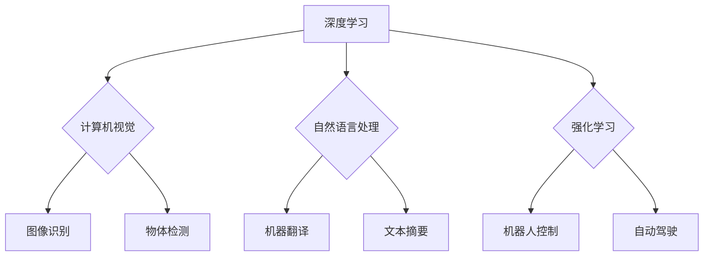

> 人工智能，深度学习，计算机视觉，自然语言处理，强化学习，应用场景，未来趋势

## 1. 背景介绍

人工智能（AI）正以惊人的速度发展，其影响力正在深刻地改变着我们的世界。从自动驾驶汽车到医疗诊断，从个性化推荐到智能客服，AI技术正在各个领域展现出强大的应用潜力。作为AI领域的领军人物之一，Andrej Karpathy 始终关注着AI技术的未来发展方向，并致力于将其应用于更广泛的领域。

Andrej Karpathy 是一位享誉世界的计算机科学家，曾担任特斯拉自动驾驶团队的负责人，现任英伟达的副总裁兼人工智能研究实验室主任。他是一位杰出的研究者和工程师，在深度学习、计算机视觉和自然语言处理等领域做出了重要贡献。

## 2. 核心概念与联系

**2.1 深度学习**

深度学习是人工智能领域的一个重要分支，它利用多层神经网络来模拟人类大脑的学习过程。通过对大量数据进行训练，深度学习模型能够自动提取特征，并进行复杂的模式识别和预测。

**2.2 计算机视觉**

计算机视觉是让计算机“看”世界的一种技术，它旨在使计算机能够理解和解释图像和视频信息。深度学习在计算机视觉领域取得了突破性的进展，例如图像识别、物体检测、图像分割等。

**2.3 自然语言处理**

自然语言处理（NLP）是让计算机“理解”人类语言的技术，它旨在使计算机能够理解、生成和处理自然语言文本。深度学习在NLP领域也取得了显著的成果，例如机器翻译、文本摘要、情感分析等。

**2.4 强化学习**

强化学习是一种机器学习方法，它通过奖励和惩罚机制来训练智能体，使其在特定环境中做出最优决策。强化学习在机器人控制、游戏 AI 和自动驾驶等领域具有广泛的应用前景。

**2.5 应用场景**

AI技术在各个领域都有着广泛的应用场景，例如：

* **医疗保健:** AI可以辅助医生诊断疾病、预测患者风险、加速药物研发。
* **金融服务:** AI可以用于欺诈检测、风险管理、个性化投资建议。
* **制造业:** AI可以提高生产效率、优化供应链、实现智能制造。
* **零售业:** AI可以提供个性化推荐、优化库存管理、提升客户服务体验。

**2.6 Mermaid 流程图**



## 3. 核心算法原理 & 具体操作步骤

**3.1 算法原理概述**

深度学习算法的核心是多层神经网络，它由多个神经元组成的层级结构组成。每个神经元接收来自上一层的输入信号，并对其进行处理，然后将处理后的信号传递到下一层。通过训练，神经网络能够学习到数据的特征表示，并进行预测或分类。

**3.2 算法步骤详解**

1. **数据预处理:** 将原始数据转换为深度学习模型可以理解的格式，例如归一化、编码等。
2. **网络结构设计:** 根据任务需求设计神经网络的层数、神经元数量、激活函数等参数。
3. **模型训练:** 使用训练数据训练神经网络，通过调整网络参数，使模型的预测结果与真实值尽可能接近。
4. **模型评估:** 使用测试数据评估模型的性能，例如准确率、召回率、F1-score等。
5. **模型调优:** 根据评估结果，调整网络参数或训练策略，以提高模型性能。

**3.3 算法优缺点**

**优点:**

* 能够自动提取特征，无需人工特征工程。
* 能够处理大规模数据，学习到更复杂的模式。
* 在图像识别、自然语言处理等领域取得了突破性进展。

**缺点:**

* 训练数据量大，需要大量的计算资源。
* 模型解释性差，难以理解模型的决策过程。
* 对数据质量要求高，容易受到噪声数据的影响。

**3.4 算法应用领域**

深度学习算法广泛应用于各个领域，例如：

* **计算机视觉:** 图像识别、物体检测、图像分割、人脸识别等。
* **自然语言处理:** 机器翻译、文本摘要、情感分析、对话系统等。
* **语音识别:** 语音转文本、语音助手等。
* **推荐系统:** 商品推荐、内容推荐等。
* **医疗诊断:** 疾病诊断、影像分析等。

## 4. 数学模型和公式 & 详细讲解 & 举例说明

**4.1 数学模型构建**

深度学习模型通常由多个神经网络层组成，每个层包含多个神经元。每个神经元接收来自上一层的输入信号，并对其进行线性变换和非线性激活函数处理。

**4.2 公式推导过程**

* **线性变换:** $z = Wx + b$，其中 $W$ 是权重矩阵， $x$ 是输入向量， $b$ 是偏置项。
* **非线性激活函数:** $a = f(z)$，其中 $f$ 是非线性激活函数，例如 sigmoid 函数、ReLU 函数等。

**4.3 案例分析与讲解**

假设我们有一个简单的两层神经网络，用于分类手写数字。第一层有 10 个神经元，第二层有 10 个神经元。输入数据是一个 28x28 的图像，经过第一层神经网络处理后，得到一个 10 维的向量。这个向量再经过第二层神经网络处理后，得到一个 10 维的输出向量，每个元素代表一个数字的概率。

**4.4 数学公式举例**

* **sigmoid 函数:** $f(z) = \frac{1}{1 + e^{-z}}$
* **ReLU 函数:** $f(z) = max(0, z)$

## 5. 项目实践：代码实例和详细解释说明

**5.1 开发环境搭建**

* Python 3.x
* TensorFlow 或 PyTorch 深度学习框架
* Jupyter Notebook 或 VS Code 代码编辑器

**5.2 源代码详细实现**

```python
import tensorflow as tf

# 定义模型结构
model = tf.keras.models.Sequential([
    tf.keras.layers.Flatten(input_shape=(28, 28)),
    tf.keras.layers.Dense(128, activation='relu'),
    tf.keras.layers.Dense(10, activation='softmax')
])

# 编译模型
model.compile(optimizer='adam',
              loss='sparse_categorical_crossentropy',
              metrics=['accuracy'])

# 训练模型
model.fit(x_train, y_train, epochs=10)

# 评估模型
loss, accuracy = model.evaluate(x_test, y_test)
print('Test loss:', loss)
print('Test accuracy:', accuracy)
```

**5.3 代码解读与分析**

* `tf.keras.models.Sequential`: 创建一个顺序模型，层级结构按照顺序连接。
* `tf.keras.layers.Flatten`: 将二维图像数据转换为一维向量。
* `tf.keras.layers.Dense`: 全连接层，每个神经元连接到上一层的所有神经元。
* `activation='relu'`: 使用 ReLU 激活函数。
* `activation='softmax'`: 使用 softmax 激活函数，输出概率分布。
* `optimizer='adam'`: 使用 Adam 优化器。
* `loss='sparse_categorical_crossentropy'`: 使用稀疏类别交叉熵损失函数。
* `metrics=['accuracy']`: 使用准确率作为评估指标。

**5.4 运行结果展示**

训练完成后，模型会输出测试集上的损失值和准确率。

## 6. 实际应用场景

**6.1 自动驾驶**

AI技术在自动驾驶领域发挥着至关重要的作用，例如：

* **环境感知:** 利用计算机视觉技术识别道路、车辆、行人等物体。
* **路径规划:** 利用强化学习算法规划最优行驶路径。
* **决策控制:** 利用深度学习模型做出驾驶决策，例如加速、减速、转向等。

**6.2 医疗诊断**

AI技术可以辅助医生进行疾病诊断，例如：

* **影像分析:** 利用深度学习模型分析 X 光片、CT 扫描等影像数据，识别肿瘤、骨折等异常情况。
* **病历分析:** 利用自然语言处理技术分析病历信息，辅助医生诊断疾病。
* **药物研发:** 利用机器学习算法加速药物研发过程。

**6.3 个性化推荐**

AI技术可以提供个性化推荐，例如：

* **商品推荐:** 根据用户的购买历史、浏览记录等信息，推荐相关的商品。
* **内容推荐:** 根据用户的兴趣爱好、阅读习惯等信息，推荐相关的文章、视频等内容。
* **音乐推荐:** 根据用户的音乐偏好，推荐相关的歌曲。

**6.4 未来应用展望**

AI技术的应用场景还在不断扩展，未来将有更多新的应用场景出现，例如：

* **智能客服:** 利用自然语言处理技术，提供更智能、更人性化的客服服务。
* **个性化教育:** 利用 AI 技术，提供个性化的学习方案和教学内容。
* **智能家居:** 利用 AI 技术，实现智能家居的控制和管理。

## 7. 工具和资源推荐

**7.1 学习资源推荐**

* **课程:**
    * 深度学习 Specialization (Coursera)
    * fast.ai
    * TensorFlow 官方教程
* **书籍:**
    * 深度学习 (Ian Goodfellow)
    * 构建深度学习模型 (François Chollet)
* **博客:**
    * Andrej Karpathy 博客
    * TensorFlow 官方博客
    * PyTorch 官方博客

**7.2 开发工具推荐**

* **深度学习框架:** TensorFlow, PyTorch, Keras
* **代码编辑器:** Jupyter Notebook, VS Code, PyCharm
* **云计算平台:** Google Cloud Platform, Amazon Web Services, Microsoft Azure

**7.3 相关论文推荐**

* **ImageNet Classification with Deep Convolutional Neural Networks (AlexNet)**
* **Deep Residual Learning for Image Recognition (ResNet)**
* **Attention Is All You Need (Transformer)**

## 8. 总结：未来发展趋势与挑战

**8.1 研究成果总结**

近年来，AI技术取得了长足的进步，在各个领域都取得了突破性的应用。深度学习算法成为 AI 技术的核心，并取得了显著的成果。

**8.2 未来发展趋势**

* **模型规模和能力的提升:** 未来 AI 模型将更加强大，能够处理更复杂的任务。
* **模型解释性和可解释性的增强:** 研究者将致力于提高 AI 模型的解释性，使人类能够更好地理解 AI 的决策过程。
* **边缘计算和联邦学习:** AI 模型将部署到边缘设备，并利用联邦学习技术进行隐私保护。
* **跨模态学习:** AI 模型将能够处理多种模态数据，例如文本、图像、音频等。

**8.3 面临的挑战**

* **数据获取和隐私保护:** AI 模型需要大量数据进行训练，如何获取高质量数据并保护用户隐私是一个挑战。
* **算法公平性和可解释性:** AI 模型可能存在偏见和不可解释性，需要研究如何确保 AI 的公平性和可解释性。
* **安全性和可靠性:** AI 系统需要保证安全性和可靠性，避免出现安全漏洞和不可预知的错误。

**8.4 研究展望**

未来 AI 研究将继续探索新的算法、模型和应用场景，并致力于解决 AI 技术面临的挑战，推动 AI 技术的健康发展。

## 9. 附录：常见问题与解答

**9.1 什么是深度学习？**

深度学习是一种机器学习方法，它利用多层神经网络来模拟人类大脑的学习过程。

**9.2 深度学习有哪些应用场景？**

深度学习应用场景广泛，例如图像识别、自然语言处理