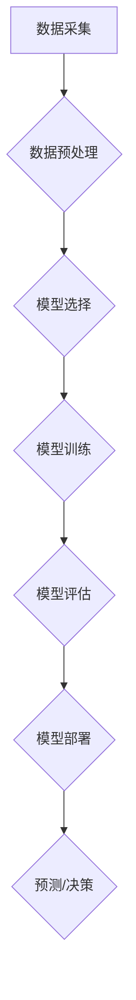

> 人工智能 (AI)
> 机器学习 (Machine Learning)
> 深度学习 (Deep Learning)
> 算法
> 模型
> 代码实例

## 1. 背景介绍

人工智能 (AI) 作为一项前沿科技，近年来发展迅速，已渗透到各个领域，深刻地改变着我们的生活方式。从智能手机的语音助手到自动驾驶汽车，从医疗诊断到金融风险评估，AI 的应用场景日益广泛。

然而，对于许多人来说，AI 仍然是一个神秘而难以理解的概念。本文将从 AI 的原理和代码实例出发，深入浅出地讲解 AI 的核心概念、算法和应用，帮助读者更好地理解和掌握 AI 的本质。

## 2. 核心概念与联系

**2.1  人工智能 (AI)**

人工智能是指模拟人类智能行为的计算机系统。这些行为包括学习、推理、决策、感知、语言理解和生成等。

**2.2  机器学习 (ML)**

机器学习是 AI 的一个重要分支，它通过算法使计算机能够从数据中学习，并根据学习到的知识进行预测或决策。机器学习算法可以分为监督学习、无监督学习和强化学习三大类。

**2.3  深度学习 (DL)**

深度学习是机器学习的一个子领域，它利用多层神经网络来模拟人类大脑的学习过程。深度学习算法能够处理海量数据，并从中提取出复杂的特征，从而实现更精准的预测和决策。

**2.4  算法与模型**

在 AI 中，算法是指解决特定问题的步骤或规则，而模型则是基于算法训练得到的参数和结构，用于对新数据进行预测或决策。

**2.5  数据**

数据是 AI 的燃料，高质量的数据是训练有效 AI 模型的关键。

**2.6  流程图**



## 3. 核心算法原理 & 具体操作步骤

### 3.1  算法原理概述

本节将介绍一种常用的机器学习算法——线性回归。线性回归是一种监督学习算法，用于预测连续变量。其核心思想是找到一条直线，使得这条直线与数据点之间的距离最小。

### 3.2  算法步骤详解

1. **数据准备:** 收集并预处理数据，将数据转换为模型可理解的格式。
2. **特征选择:** 选择与目标变量相关的特征。
3. **模型训练:** 使用训练数据训练线性回归模型，求解模型参数。
4. **模型评估:** 使用测试数据评估模型的性能，例如计算均方误差 (MSE)。
5. **模型部署:** 将训练好的模型部署到实际应用场景中。

### 3.3  算法优缺点

**优点:**

* 算法简单易懂，易于实现。
* 计算效率高，适合处理大规模数据。

**缺点:**

* 只能处理线性关系的数据。
* 对异常值敏感。

### 3.4  算法应用领域

线性回归广泛应用于以下领域:

* 房价预测
* 股票价格预测
* 销售预测
* 医疗诊断

## 4. 数学模型和公式 & 详细讲解 & 举例说明

### 4.1  数学模型构建

线性回归模型的数学表达式为:

$$y = w_0 + w_1x_1 + w_2x_2 + ... + w_nx_n + \epsilon$$

其中:

* $y$ 是目标变量
* $x_1, x_2, ..., x_n$ 是特征变量
* $w_0, w_1, w_2, ..., w_n$ 是模型参数
* $\epsilon$ 是误差项

### 4.2  公式推导过程

模型参数的求解可以通过最小化误差平方和 (MSE) 来实现。MSE 定义为:

$$MSE = \frac{1}{n} \sum_{i=1}^{n} (y_i - \hat{y}_i)^2$$

其中:

* $n$ 是样本数量
* $y_i$ 是第 $i$ 个样本的目标变量值
* $\hat{y}_i$ 是模型预测的第 $i$ 个样本的目标变量值

通过求解 MSE 的最小值，可以得到模型参数的最优解。

### 4.3  案例分析与讲解

假设我们想要预测房屋价格，特征变量包括房屋面积、房间数量和地理位置。我们可以使用线性回归模型来建立房屋价格预测模型。

通过训练模型，我们可以得到模型参数，例如房屋面积每增加 1 平方米，房屋价格会增加 1000 元。

## 5. 项目实践：代码实例和详细解释说明

### 5.1  开发环境搭建

本项目使用 Python 语言进行开发，需要安装以下软件包:

* NumPy
* Pandas
* Scikit-learn

### 5.2  源代码详细实现

```python
import numpy as np
from sklearn.linear_model import LinearRegression
from sklearn.model_selection import train_test_split

# 准备数据
data = np.array([[100, 2, 1], [150, 3, 2], [200, 4, 3], [250, 5, 4]])
X = data[:, :2]  # 特征变量
y = data[:, 2]  # 目标变量

# 将数据划分为训练集和测试集
X_train, X_test, y_train, y_test = train_test_split(X, y, test_size=0.2, random_state=42)

# 创建线性回归模型
model = LinearRegression()

# 训练模型
model.fit(X_train, y_train)

# 预测测试集数据
y_pred = model.predict(X_test)

# 评估模型性能
print('Coefficients:', model.coef_)
print('Intercept:', model.intercept_)
print('Mean Squared Error:', np.mean((y_test - y_pred)**2))
```

### 5.3  代码解读与分析

* 首先，我们准备数据并将其划分为特征变量和目标变量。
* 然后，我们使用 `train_test_split` 函数将数据划分为训练集和测试集。
* 接下来，我们创建线性回归模型并使用 `fit` 方法训练模型。
* 训练完成后，我们可以使用 `predict` 方法预测测试集数据。
* 最后，我们评估模型性能，例如计算均方误差 (MSE)。

### 5.4  运行结果展示

运行代码后，会输出模型参数和 MSE 值。

## 6. 实际应用场景

### 6.1  医疗诊断

AI 可以用于辅助医生诊断疾病，例如根据患者的症状和检查结果预测疾病的可能性。

### 6.2  金融风险评估

AI 可以用于评估客户的信用风险，帮助金融机构做出更明智的贷款决策。

### 6.3  个性化推荐

AI 可以根据用户的行为数据和偏好，推荐个性化的商品或服务。

### 6.4  未来应用展望

AI 的应用场景还在不断扩展，未来将更加广泛地应用于各个领域，例如自动驾驶、机器人、教育、娱乐等。

## 7. 工具和资源推荐

### 7.1  学习资源推荐

* **书籍:**
    * 《深度学习》
    * 《机器学习实战》
* **在线课程:**
    * Coursera
    * edX
    * Udacity

### 7.2  开发工具推荐

* **Python:** 
    * Jupyter Notebook
    * TensorFlow
    * PyTorch

### 7.3  相关论文推荐

* **AlphaGo论文:** https://arxiv.org/abs/1607.02886
* **BERT论文:** https://arxiv.org/abs/1810.04805

## 8. 总结：未来发展趋势与挑战

### 8.1  研究成果总结

近年来，AI 取得了显著的进展，例如 AlphaGo 击败世界围棋冠军，BERT 在自然语言处理任务中取得了突破性进展。

### 8.2  未来发展趋势

* **更强大的计算能力:** 随着计算能力的提升，AI 模型将能够处理更复杂的数据，并实现更精准的预测和决策。
* **更丰富的算法:** 研究人员将继续开发新的 AI 算法，例如强化学习、迁移学习等，以解决更复杂的问题。
* **更广泛的应用场景:** AI 将应用于更多领域，例如医疗、教育、金融等，改变我们的生活方式。

### 8.3  面临的挑战

* **数据安全和隐私:** AI 模型的训练需要大量数据，如何保护数据安全和隐私是一个重要的挑战。
* **算法可解释性:** 许多 AI 算法是黑箱模型，难以解释其决策过程，这可能会导致信任问题。
* **伦理问题:** AI 的发展也带来了一些伦理问题，例如算法偏见、工作岗位替代等，需要认真思考和解决。

### 8.4  研究展望

未来，AI 研究将继续朝着更智能、更安全、更可解释的方向发展，为人类社会带来更多福祉。

## 9. 附录：常见问题与解答

**Q1: 什么是机器学习？**

**A1:** 机器学习是人工智能的一个分支，它通过算法使计算机能够从数据中学习，并根据学习到的知识进行预测或决策。

**Q2: 什么是深度学习？**

**A2:** 深度学习是机器学习的一个子领域，它利用多层神经网络来模拟人类大脑的学习过程。

**Q3: 如何选择合适的 AI 算法？**

**A3:** 选择合适的 AI 算法取决于具体的应用场景和数据特点。例如，对于预测连续变量，可以使用线性回归算法；对于分类问题，可以使用决策树算法或支持向量机算法。

**Q4: 如何评估 AI 模型的性能？**

**A4:** AI 模型的性能可以通过多种指标来评估，例如准确率、召回率、F1-score、AUC等。

**Q5: AI 会取代人类工作吗？**

**A5:** AI 可能会改变一些工作岗位，但它也将会创造新的工作机会。重要的是，人类需要不断学习和适应，才能在 AI 时代保持竞争力。


作者：禅与计算机程序设计艺术 / Zen and the Art of Computer Programming 
<end_of_turn>