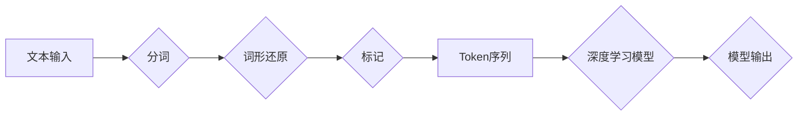

> ChatGPT, Token, 语言编码, 自然语言处理, Transformer, BERT, 词嵌入

## 1. 背景介绍

ChatGPT作为一款强大的开源语言模型，其卓越的文本生成能力和理解能力源于其对语言的精妙编码方式。在深度学习时代，将自然语言转换为计算机可理解的数字表示形式是自然语言处理 (NLP) 的核心任务之一。其中，Token化 (Tokenization) 作为语言编码的第一步，扮演着至关重要的角色。

传统的文本处理方法通常将文本视为连续的字符序列，但这对于复杂的语言结构和语义理解来说存在局限性。Token化技术则将文本分割成更小的、具有语义意义的单位，称为Token，从而为后续的深度学习模型提供更有效的输入。

## 2. 核心概念与联系

### 2.1 Token的概念

Token 是文本处理中的一种基本单位，它可以是单个字符、单词、子词或其他语义单元。Token 的选择取决于具体的应用场景和模型架构。

### 2.2 Token化过程

Token化过程通常包括以下步骤：

1. **分词:** 将文本分割成单词或子词。
2. **词形还原:** 将词形变化的词还原为基本形式。
3. **标记:** 为每个Token添加特殊标记，例如开始标记、结束标记、分隔符等。

### 2.3 Token化与深度学习模型

Token化是深度学习模型处理文本数据的重要步骤。通过将文本转换为Token序列，模型可以将文本信息转化为数字向量，以便进行计算和学习。

**Mermaid 流程图**



## 3. 核心算法原理 & 具体操作步骤

### 3.1 算法原理概述

ChatGPT 使用了一种基于 Transformer 架构的 Token 化算法。Transformer 模型能够有效地捕捉文本序列中的长距离依赖关系，从而实现更准确的语言理解和生成。

### 3.2 算法步骤详解

1. **词嵌入:** 将每个Token映射到一个低维度的向量空间中，称为词嵌入。词嵌入可以捕捉单词之间的语义相似性。
2. **位置编码:** 为每个Token添加位置信息，以便模型能够区分不同位置的Token。
3. **自注意力机制:** 允许模型关注文本序列中的不同位置，并学习单词之间的关系。
4. **多头注意力:** 使用多个注意力头，可以捕捉不同类型的语义关系。
5. **前馈神经网络:** 对每个Token的嵌入进行非线性变换，进一步提取语义信息。

### 3.3 算法优缺点

**优点:**

* 能够有效地捕捉长距离依赖关系。
* 性能优于传统的 RNN 模型。
* 可并行化训练，训练速度更快。

**缺点:**

* 计算复杂度较高。
* 需要大量的训练数据。

### 3.4 算法应用领域

* 文本生成
* 机器翻译
* 问答系统
* 语义理解
* 情感分析

## 4. 数学模型和公式 & 详细讲解 & 举例说明

### 4.1 数学模型构建

ChatGPT 的 Token 化算法基于 Transformer 模型，其核心是自注意力机制和多头注意力机制。

### 4.2 公式推导过程

**自注意力机制:**

$$
Attention(Q, K, V) = \frac{exp(Q \cdot K^T / \sqrt{d_k})}{exp(Q \cdot K^T / \sqrt{d_k})} \cdot V
$$

其中:

* $Q$ 是查询矩阵
* $K$ 是键矩阵
* $V$ 是值矩阵
* $d_k$ 是键向量的维度

**多头注意力机制:**

$$
MultiHead(Q, K, V) = Concat(head_1, head_2, ..., head_h) \cdot W_o
$$

其中:

* $head_i$ 是第 $i$ 个注意力头的输出
* $h$ 是注意力头的数量
* $W_o$ 是最终输出的线性变换矩阵

### 4.3 案例分析与讲解

假设我们有一个句子 "The cat sat on the mat"，将其 Token 化后得到：

```
["The", "cat", "sat", "on", "the", "mat"]
```

每个 Token 都会被映射到一个词嵌入向量，然后通过自注意力机制和多头注意力机制进行处理，最终得到一个表示整个句子的上下文向量。

## 5. 项目实践：代码实例和详细解释说明

### 5.1 开发环境搭建

* Python 3.7+
* PyTorch 1.7+
* Transformers 库

### 5.2 源代码详细实现

```python
from transformers import AutoTokenizer, AutoModel

# 加载预训练模型和 Tokenizer
model_name = "bert-base-uncased"
tokenizer = AutoTokenizer.from_pretrained(model_name)
model = AutoModel.from_pretrained(model_name)

# 输入文本
text = "The cat sat on the mat"

# Token 化
tokens = tokenizer.tokenize(text)

# 将 Token 转换为 ID
token_ids = tokenizer.convert_tokens_to_ids(tokens)

# 将 ID 转换为张量
input_ids = torch.tensor([token_ids])

# 获取模型输出
outputs = model(input_ids)

# 打印输出
print(outputs)
```

### 5.3 代码解读与分析

* 使用 `AutoTokenizer` 和 `AutoModel` 从预训练模型中加载 Tokenizer 和模型。
* 使用 `tokenize` 方法将文本 Token 化。
* 使用 `convert_tokens_to_ids` 方法将 Token 转换为 ID。
* 将 ID 转换为 PyTorch 张量。
* 使用模型进行前向传播，获取模型输出。

### 5.4 运行结果展示

模型输出是一个包含多个层的张量，其中包含每个 Token 的上下文向量。

## 6. 实际应用场景

### 6.1 文本生成

ChatGPT 可以用于生成各种类型的文本，例如故事、诗歌、文章等。

### 6.2 机器翻译

ChatGPT 可以用于将文本从一种语言翻译成另一种语言。

### 6.3 问答系统

ChatGPT 可以用于构建问答系统，能够回答用户提出的问题。

### 6.4 情感分析

ChatGPT 可以用于分析文本的情感倾向，例如判断文本是积极的、消极的还是中性的。

### 6.5 未来应用展望

ChatGPT 的 Token 化技术在未来将有更广泛的应用，例如：

* 更智能的聊天机器人
* 更精准的搜索引擎
* 更个性化的教育体验

## 7. 工具和资源推荐

### 7.1 学习资源推荐

* **论文:** "Attention Is All You Need"
* **博客:** Hugging Face Blog
* **在线课程:** Coursera, Udemy

### 7.2 开发工具推荐

* **PyTorch:** 深度学习框架
* **Transformers:** 预训练模型库
* **Jupyter Notebook:** 代码编辑和调试环境

### 7.3 相关论文推荐

* "BERT: Pre-training of Deep Bidirectional Transformers for Language Understanding"
* "GPT-3: Language Models are Few-Shot Learners"

## 8. 总结：未来发展趋势与挑战

### 8.1 研究成果总结

ChatGPT 的 Token 化技术取得了显著的成果，在自然语言处理领域取得了突破性的进展。

### 8.2 未来发展趋势

* 更高效的 Token 化算法
* 更强大的预训练模型
* 更广泛的应用场景

### 8.3 面临的挑战

* 数据稀缺性
* 计算资源限制
* 伦理问题

### 8.4 研究展望

未来研究将继续探索更有效的 Token 化算法，开发更强大的预训练模型，并解决 Token 化技术带来的伦理问题。

## 9. 附录：常见问题与解答

### 9.1 什么是 Token？

Token 是文本处理中的一种基本单位，它可以是单个字符、单词、子词或其他语义单元。

### 9.2 为什么需要 Token 化？

Token 化可以将文本转换为计算机可理解的数字表示形式，以便深度学习模型进行处理。

### 9.3 ChatGPT 的 Token 化算法是什么？

ChatGPT 使用了一种基于 Transformer 架构的 Token 化算法。

### 9.4 ChatGPT 的 Token 化技术有哪些应用场景？

ChatGPT 的 Token 化技术可以应用于文本生成、机器翻译、问答系统、情感分析等领域。


作者：禅与计算机程序设计艺术 / Zen and the Art of Computer Programming 
<end_of_turn>