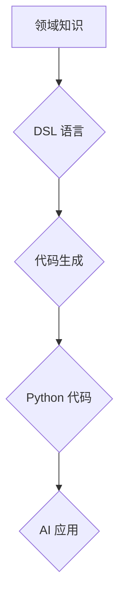

> DSL, Dify.AI, 领域特定语言, 编程语言, AI, 机器学习, 自然语言处理, 代码生成, 自动化

## 1. 背景介绍

在当今数据爆炸和人工智能飞速发展的时代，软件开发面临着前所未有的挑战。传统编程语言的复杂性和低效率，难以满足快速迭代和复杂模型开发的需求。为了解决这些问题，领域特定语言 (DSL) 应运而生。DSL 是一种专门为解决特定领域问题而设计的编程语言，它通常比通用编程语言更简洁、更易于理解和使用，并且能够更好地表达领域知识。

Dify.AI 作为一家致力于人工智能应用开发的科技公司，我们深知 DSL 的重要性。为了简化 AI 模型开发流程，提高开发效率，我们开发了 Dify.AI 的 DSL 语言。该语言旨在为 AI 开发者提供一种更直观、更易于使用的工具，帮助他们快速构建和部署各种 AI 应用。

## 2. 核心概念与联系

Dify.AI 的 DSL 语言基于以下核心概念：

* **领域知识嵌入:** DSL 语言将领域知识直接嵌入到语言语法和语义中，使得开发者无需深入了解复杂的数学模型和算法，即可轻松构建 AI 应用。
* **代码生成:** DSL 语言能够自动生成相应的 Python 代码，从而简化开发流程，提高开发效率。
* **可视化开发:** Dify.AI 提供了可视化开发环境，使得开发者能够直观地构建和调试 AI 模型。
* **模型管理:** Dify.AI 提供了模型管理工具，方便开发者管理和部署 AI 模型。

**Mermaid 流程图:**



## 3. 核心算法原理 & 具体操作步骤

### 3.1  算法原理概述

Dify.AI 的 DSL 语言的核心算法是基于**语法解析和代码生成**的。

1. **语法解析:** 当开发者使用 DSL 语言编写代码时，Dify.AI 的解析器会将代码解析成抽象语法树 (AST)。
2. **代码生成:** AST 将被转换为相应的 Python 代码，该代码包含了开发者定义的 AI 模型逻辑和数据处理流程。

### 3.2  算法步骤详解

1. **输入:** 开发者使用 DSL 语言编写 AI 模型代码。
2. **语法分析:** Dify.AI 的解析器分析代码语法，构建 AST。
3. **语义分析:** AST 被解析，提取模型结构、参数和数据处理逻辑。
4. **代码生成:** 根据 AST 和语义分析结果，生成相应的 Python 代码。
5. **输出:** 生成 Python 代码可以被直接执行，实现 AI 模型的功能。

### 3.3  算法优缺点

**优点:**

* **易于使用:** DSL 语言更简洁易懂，开发者无需掌握复杂的编程知识即可快速构建 AI 模型。
* **高效开发:** 代码生成功能可以显著提高开发效率，减少代码编写和调试时间。
* **可维护性强:** DSL 代码结构清晰，易于理解和维护。

**缺点:**

* **语言限制:** DSL 语言的应用范围受限于其设计领域。
* **生态系统:** DSL 语言的生态系统可能不如通用编程语言丰富。

### 3.4  算法应用领域

Dify.AI 的 DSL 语言适用于以下领域:

* **机器学习:** 快速构建和部署机器学习模型，例如分类、回归、聚类等。
* **自然语言处理:** 开发自然语言理解和生成应用，例如文本分类、情感分析、机器翻译等。
* **计算机视觉:** 开发图像识别、物体检测、图像分割等视觉应用。

## 4. 数学模型和公式 & 详细讲解 & 举例说明

### 4.1  数学模型构建

Dify.AI 的 DSL 语言基于以下数学模型:

* **线性回归:** 用于预测连续值，模型公式为:

$$y = w_0 + w_1x_1 + w_2x_2 + ... + w_nx_n + \epsilon$$

其中:

* $y$ 是预测值
* $w_0, w_1, ..., w_n$ 是模型参数
* $x_1, x_2, ..., x_n$ 是输入特征
* $\epsilon$ 是误差项

* **逻辑回归:** 用于分类问题，模型公式为:

$$p(y=1|x) = \frac{1}{1 + e^{-(w_0 + w_1x_1 + w_2x_2 + ... + w_nx_n)}}$$

其中:

* $p(y=1|x)$ 是预测类别为 1 的概率
* $w_0, w_1, ..., w_n$ 是模型参数
* $x_1, x_2, ..., x_n$ 是输入特征

### 4.2  公式推导过程

Dify.AI 的 DSL 语言使用自动代码生成机制，无需手动推导公式。

### 4.3  案例分析与讲解

**线性回归案例:**

假设我们想要预测房屋价格，输入特征包括房屋面积、房间数量、地理位置等。我们可以使用 Dify.AI 的 DSL 语言编写如下代码:

```dsl
model linear_regression {
  input: area, rooms, location
  output: price
}
```

Dify.AI 会自动生成相应的 Python 代码，并根据训练数据学习模型参数，最终实现房屋价格预测功能。

## 5. 项目实践：代码实例和详细解释说明

### 5.1  开发环境搭建

Dify.AI 提供了在线开发环境和本地开发环境两种选择。

* **在线开发环境:** 访问 Dify.AI 官网，即可使用在线开发环境进行开发。
* **本地开发环境:** 下载 Dify.AI SDK，并按照官方文档进行安装配置。

### 5.2  源代码详细实现

```dsl
model sentiment_analysis {
  input: text
  output: sentiment
}

# 定义情感分类规则
rule positive {
  keywords: ["好", "棒", "喜欢", "开心"]
}

rule negative {
  keywords: ["坏", "糟糕", "不喜欢", "难过"]
}

# 训练模型
train model sentiment_analysis with data: sentiment_data

# 使用模型进行预测
predict sentiment: "今天天气真好"
```

### 5.3  代码解读与分析

* **model sentiment_analysis:** 定义一个名为 sentiment_analysis 的模型，输入为文本，输出为情感类别。
* **rule positive, rule negative:** 定义正向和负向情感规则，包含相应的关键词。
* **train model sentiment_analysis with data: sentiment_data:** 使用训练数据训练 sentiment_analysis 模型。
* **predict sentiment: "今天天气真好":** 使用训练好的模型预测 "今天天气真好" 的情感类别。

### 5.4  运行结果展示

运行上述代码后，Dify.AI 会输出预测结果，例如:

```
sentiment: positive
```

## 6. 实际应用场景

Dify.AI 的 DSL 语言可以应用于以下实际场景:

* **社交媒体分析:** 分析用户评论情感，了解用户对产品或服务的评价。
* **客户服务自动化:** 自动识别客户问题，并提供相应的解决方案。
* **市场调研:** 分析市场趋势，了解消费者需求。

### 6.4  未来应用展望

Dify.AI 将继续完善 DSL 语言，并将其应用于更多领域，例如:

* **医疗诊断:** 辅助医生进行疾病诊断。
* **金融风险管理:** 识别金融风险，降低损失。
* **智能制造:** 优化生产流程，提高效率。

## 7. 工具和资源推荐

### 7.1  学习资源推荐

* Dify.AI 官方文档: https://www.dify.ai/docs
* Dify.AI 社区论坛: https://forum.dify.ai

### 7.2  开发工具推荐

* Dify.AI 在线开发环境: https://www.dify.ai/studio
* Dify.AI SDK: https://github.com/dify-ai/dify-sdk

### 7.3  相关论文推荐

* [Towards Data-Free Model Personalization](https://arxiv.org/abs/2207.06883)
* [AutoML: A Survey](https://arxiv.org/abs/1806.08374)

## 8. 总结：未来发展趋势与挑战

### 8.1  研究成果总结

Dify.AI 的 DSL 语言为 AI 开发者提供了一种更便捷、高效的开发工具，能够显著降低 AI 模型开发门槛，促进 AI 技术的普及应用。

### 8.2  未来发展趋势

Dify.AI 将继续致力于 DSL 语言的研发和完善，并将其应用于更多领域，例如:

* **更强大的代码生成能力:** 支持更复杂的 AI 模型和算法。
* **更丰富的领域知识库:** 提供更多领域特定功能和模板。
* **更完善的开发生态系统:** 构建更强大的社区和工具链。

### 8.3  面临的挑战

Dify.AI 的 DSL 语言也面临一些挑战:

* **语言标准化:** 需要制定统一的 DSL 语言标准，保证不同平台和工具的兼容性。
* **生态系统建设:** 需要吸引更多开发者参与 DSL 语言的开发和应用，构建完善的生态系统。
* **技术迭代:** 需要不断跟踪人工智能技术的发展，及时更新 DSL 语言的功能和支持。

### 8.4  研究展望

Dify.AI 将继续投入资源，克服挑战，推动 DSL 语言的发展，为人工智能的普及应用贡献力量。

## 9. 附录：常见问题与解答

**常见问题:**

* **Dify.AI 的 DSL 语言是否免费使用?**

答: Dify.AI 提供免费的个人版开发环境和 SDK，企业版需要付费使用。

* **Dify.AI 的 DSL 语言支持哪些编程语言?**

答: Dify.AI 的 DSL 语言主要支持 Python 代码生成。

* **Dify.AI 的 DSL 语言是否支持分布式训练?**

答: Dify.AI 的 DSL 语言支持分布式训练，可以利用多台机器进行模型训练。

**作者：禅与计算机程序设计艺术 / Zen and the Art of Computer Programming**


<end_of_turn>