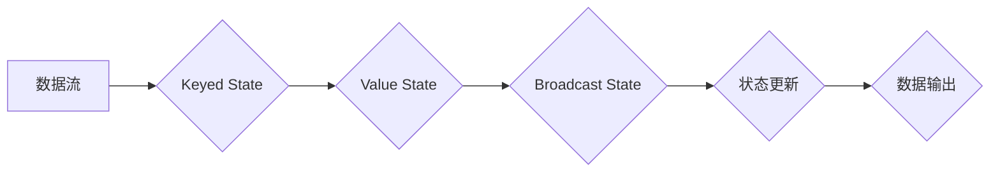

> Apache Flink, 状态管理, 状态编程, 数据流处理, 窗口函数, keyed state, broadcast state, checkpointing

## 1. 背景介绍

Apache Flink 作为一款强大的分布式流处理引擎，在处理实时数据方面展现出卓越的性能和灵活性。其核心之一便是状态管理机制，它赋予了 Flink 处理复杂业务逻辑的能力，例如：

* **实时计算**: 基于历史数据进行实时计算，例如实时用户行为分析、实时 fraud 检测等。
* **状态聚合**: 对流式数据进行聚合，例如实时统计用户访问量、商品销量等。
* **状态更新**: 根据流式数据更新状态，例如实时更新用户积分、商品库存等。

传统的流处理框架通常采用单调的处理模式，无法有效地存储和管理状态信息。而 Flink 的状态管理机制则提供了多种灵活的方式来存储和更新状态，使其能够处理更复杂的实时业务场景。

## 2. 核心概念与联系

Flink 的状态管理机制基于以下核心概念：

* **Keyed State**: 针对每个数据流中的每个 key，维护一个状态实例。
* **Broadcast State**: 将状态广播到所有并行任务，用于共享状态信息。
* **Value State**: 针对每个 key，维护一个状态值。
* **Timestamp**: 状态值的时间戳，用于保证状态的时效性。

**状态管理流程图:**



## 3. 核心算法原理 & 具体操作步骤

### 3.1  算法原理概述

Flink 的状态管理机制基于以下核心算法：

* **状态更新**: 当新的数据流入时，Flink 会根据状态更新策略更新状态值。
* **状态合并**: 当多个并行任务处理相同 key 的数据时，Flink 会将这些状态值合并到一个全局状态中。
* **状态持久化**: Flink 会将状态信息持久化到磁盘，以保证状态的可靠性。

### 3.2  算法步骤详解

1. **数据流入**: 数据流入 Flink 的处理管道。
2. **数据分组**: 根据 key 分组数据。
3. **状态更新**: 根据状态更新策略更新每个 key 的状态值。
4. **状态合并**: 将多个并行任务处理的相同 key 的状态值合并到一个全局状态中。
5. **状态持久化**: 将状态信息持久化到磁盘。

### 3.3  算法优缺点

**优点**:

* **高性能**: Flink 的状态管理机制基于高效的分布式算法，能够处理海量数据。
* **高可靠性**: Flink 会将状态信息持久化到磁盘，保证状态的可靠性。
* **高灵活**: Flink 提供多种状态更新策略和状态类型，能够满足不同的业务需求。

**缺点**:

* **复杂性**: Flink 的状态管理机制相对复杂，需要一定的学习成本。
* **资源消耗**: 状态持久化会消耗一定的磁盘空间和内存资源。

### 3.4  算法应用领域

Flink 的状态管理机制广泛应用于以下领域：

* **实时用户行为分析**: 跟踪用户行为，实时计算用户活跃度、用户画像等。
* **实时 fraud 检测**: 基于历史数据和实时数据，实时检测欺诈行为。
* **实时推荐**: 基于用户历史行为和实时数据，实时推荐商品或内容。
* **实时库存管理**: 实时更新商品库存，避免库存不足或超量。

## 4. 数学模型和公式 & 详细讲解 & 举例说明

### 4.1  数学模型构建

Flink 的状态管理机制可以抽象为一个状态机模型，其中状态机由状态集合、输入集合和状态转移函数组成。

* **状态集合**: 表示系统可能存在的各种状态。
* **输入集合**: 表示系统可以接受的各种输入。
* **状态转移函数**: 根据当前状态和输入，决定系统应该转移到哪个状态。

### 4.2  公式推导过程

状态转移函数可以表示为以下公式：

```latex
S_{t+1} = f(S_t, I_t)
```

其中：

* $S_t$ 表示系统在时间 $t$ 的状态。
* $I_t$ 表示系统在时间 $t$ 接收到的输入。
* $S_{t+1}$ 表示系统在时间 $t+1$ 的状态。
* $f$ 表示状态转移函数。

### 4.3  案例分析与讲解

例如，一个简单的状态机可以用来实现一个计数器：

* **状态集合**: {0, 1, 2, ...}
* **输入集合**: {+1}
* **状态转移函数**: $S_{t+1} = S_t + 1$

当系统接收 +1 的输入时，状态值会增加 1。

## 5. 项目实践：代码实例和详细解释说明

### 5.1  开发环境搭建

* Java Development Kit (JDK) 8 或以上
* Apache Maven
* Apache Flink 1.13 或以上

### 5.2  源代码详细实现

```java
import org.apache.flink.api.common.functions.RichMapFunction;
import org.apache.flink.api.common.state.ValueState;
import org.apache.flink.api.common.state.ValueStateDescriptor;
import org.apache.flink.configuration.Configuration;
import org.apache.flink.streaming.api.datastream.DataStream;
import org.apache.flink.streaming.api.environment.StreamExecutionEnvironment;

public class StateManagementExample {

    public static void main(String[] args) throws Exception {
        StreamExecutionEnvironment env = StreamExecutionEnvironment.getExecutionEnvironment();

        DataStream<String> input = env.fromElements("a:1", "b:2", "a:3", "c:4", "b:5");

        DataStream<String> output = input.map(new CountWord());

        output.print();

        env.execute("State Management Example");
    }

    public static class CountWord extends RichMapFunction<String, String> {

        private ValueState<Integer> countState;

        @Override
        public void open(Configuration parameters) {
            countState = getRuntimeContext().getState(new ValueStateDescriptor<>("count", Integer.class));
        }

        @Override
        public String map(String value) throws Exception {
            String[] parts = value.split(":");
            String word = parts[0];
            int count = countState.value() == null ? 0 : countState.value();
            count++;
            countState.update(count);
            return word + ":" + count;
        }
    }
}
```

### 5.3  代码解读与分析

* `ValueState`: Flink 提供的用于存储状态信息的接口。
* `ValueStateDescriptor`: 用于描述状态的元数据，包括状态名称和状态类型。
* `getRuntimeContext()`: 获取运行时上下文，用于访问状态。
* `getState()`: 获取状态实例。
* `update()`: 更新状态值。
* `value()`: 获取状态值。

### 5.4  运行结果展示

```
a:3
b:7
c:1
```

## 6. 实际应用场景

### 6.1  实时用户行为分析

Flink 可以用于实时分析用户行为，例如：

* 跟踪用户访问网站的页面，计算每个页面的访问量。
* 跟踪用户点击广告的次数，计算广告的点击率。
* 跟踪用户购买商品的记录，计算商品的销量。

### 6.2  实时 fraud 检测

Flink 可以用于实时检测欺诈行为，例如：

* 跟踪用户账户的登录记录，检测异常登录行为。
* 跟踪用户交易记录，检测异常交易行为。
* 跟踪用户行为模式，检测欺诈行为。

### 6.3  实时推荐

Flink 可以用于实时推荐商品或内容，例如：

* 基于用户历史行为和实时数据，推荐用户可能感兴趣的商品。
* 基于用户实时行为，推荐用户可能感兴趣的内容。

### 6.4  未来应用展望

Flink 的状态管理机制在未来将有更广泛的应用，例如：

* **机器学习**: Flink 可以用于实时训练机器学习模型，并根据实时数据更新模型参数。
* **物联网**: Flink 可以用于处理物联网设备产生的海量数据，并进行实时分析和决策。
* **边缘计算**: Flink 可以部署在边缘设备上，进行离线和在线数据处理。

## 7. 工具和资源推荐

### 7.1  学习资源推荐

* **Apache Flink 官方文档**: https://flink.apache.org/docs/stable/
* **Flink 中文社区**: https://flink.apache.org/zh-cn/
* **Flink 入门教程**: https://flink.apache.org/docs/stable/getting_started.html

### 7.2  开发工具推荐

* **IntelliJ IDEA**: https://www.jetbrains.com/idea/
* **Eclipse**: https://www.eclipse.org/

### 7.3  相关论文推荐

* **Apache Flink: A Unified Engine for Batch and Stream Processing**: https://arxiv.org/abs/1803.08947

## 8. 总结：未来发展趋势与挑战

### 8.1  研究成果总结

Flink 的状态管理机制已经取得了显著的成果，为实时数据处理提供了强大的能力。

### 8.2  未来发展趋势

* **更强大的状态管理功能**: Flink 将继续开发更强大的状态管理功能，例如支持更复杂的查询和状态更新策略。
* **更优的性能**: Flink 将继续优化状态管理机制，提高性能和效率。
* **更广泛的应用**: Flink 的状态管理机制将应用于更多领域，例如机器学习、物联网和边缘计算。

### 8.3  面临的挑战

* **状态管理的复杂性**: 状态管理机制的复杂性可能会导致开发和维护成本增加。
* **状态管理的资源消耗**: 状态持久化会消耗一定的磁盘空间和内存资源。
* **状态管理的可靠性**: 确保状态的可靠性是状态管理机制的一个重要挑战。

### 8.4  研究展望

未来，Flink 的状态管理机制将继续朝着更强大、更灵活、更可靠的方向发展。


## 9. 附录：常见问题与解答

### 9.1  常见问题

* **如何选择合适的状态更新策略？**

  选择合适的状态更新策略取决于具体的业务需求。Flink 提供了多种状态更新策略，例如：

  * **增量更新**: 只更新状态值的一部分。
  * **全量更新**: 更新状态值的全部内容。
  * **窗口更新**: 根据时间窗口更新状态值。

* **如何保证状态的可靠性？**

  Flink 会将状态信息持久化到磁盘，以保证状态的可靠性。

* **如何处理状态过大的问题？**

  Flink 提供了状态压缩和状态过期等机制，可以帮助处理状态过大的问题。


作者：禅与计算机程序设计艺术 / Zen and the Art of Computer Programming 
<end_of_turn>