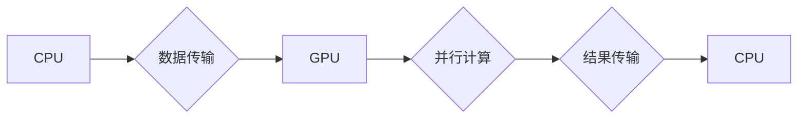

> GPU, AI, 深度学习, 并行计算, CUDA, Tensorflow, PyTorch

## 1. 背景介绍

人工智能（AI）近年来发展迅速，深度学习作为其重要分支，在图像识别、自然语言处理、语音识别等领域取得了突破性进展。然而，深度学习模型的训练需要海量数据和强大的计算能力，这使得传统的CPU架构难以满足需求。

GPU（图形处理单元）最初设计用于处理图形渲染，其并行计算能力远超CPU，因此逐渐成为深度学习训练的理想平台。本文将深入探讨GPU在AI算力中的作用，分析其核心原理、算法、应用场景以及未来发展趋势。

## 2. 核心概念与联系

**2.1 GPU架构特点**

GPU拥有大量并行计算单元，每个单元负责处理一小部分数据，通过并行计算的方式完成大规模数据处理。与CPU相比，GPU拥有以下特点：

* **并行度高:** GPU拥有数千个核心，可以同时处理大量数据。
* **内存带宽高:** GPU拥有专用高速内存，可以快速访问数据。
* **计算效率高:** GPU的计算单元专门设计用于浮点运算，在深度学习算法中效率更高。

**2.2 深度学习与GPU的结合**

深度学习算法的核心是神经网络，其训练过程需要大量的矩阵运算。GPU的并行计算能力可以有效加速这些运算，从而大幅缩短训练时间。

**2.3 CUDA架构**

CUDA（Compute Unified Device Architecture）是NVIDIA公司开发的GPU编程平台，它提供了一套API和工具，允许开发者将程序移植到GPU上进行加速。

**Mermaid 流程图**



## 3. 核心算法原理 & 具体操作步骤

**3.1 算法原理概述**

深度学习算法的核心是神经网络，它由多个层组成，每层包含多个神经元。神经元之间通过连接权重进行信息传递，通过训练调整权重，使网络能够学习数据中的模式。

**3.2 算法步骤详解**

1. **数据预处理:** 将原始数据转换为深度学习模型可以理解的格式。
2. **网络构建:** 根据任务需求设计神经网络结构，包括层数、神经元数量、激活函数等。
3. **参数初始化:** 为神经网络参数（权重、偏置）赋初值。
4. **前向传播:** 将输入数据通过网络层层传递，计算输出结果。
5. **损失函数计算:** 计算模型输出与真实值的差异，即损失值。
6. **反向传播:** 根据损失函数对网络参数进行梯度计算，更新参数值。
7. **训练迭代:** 重复前向传播、损失函数计算和反向传播步骤，直到损失值达到预设阈值。

**3.3 算法优缺点**

**优点:**

* 能够学习复杂数据模式。
* 泛化能力强，能够应用于多种任务。

**缺点:**

* 训练时间长，需要大量数据和计算资源。
* 模型复杂度高，难以解释。

**3.4 算法应用领域**

* **图像识别:** 人脸识别、物体检测、图像分类。
* **自然语言处理:** 机器翻译、文本摘要、情感分析。
* **语音识别:** 语音转文本、语音助手。
* **推荐系统:** 商品推荐、内容推荐。

## 4. 数学模型和公式 & 详细讲解 & 举例说明

**4.1 数学模型构建**

深度学习模型的核心是神经网络，其数学模型可以表示为一系列的线性变换和非线性激活函数。

**4.2 公式推导过程**

* **线性变换:**

$$
y = Wx + b
$$

其中，$x$为输入向量，$W$为权重矩阵，$b$为偏置向量，$y$为线性变换后的输出向量。

* **激活函数:**

$$
a = f(y)
$$

其中，$f$为激活函数，例如ReLU、Sigmoid等。

**4.3 案例分析与讲解**

以全连接神经网络为例，其数学模型可以表示为：

$$
h^{(l)} = f^{(l)}(W^{(l)}h^{(l-1)} + b^{(l)})
$$

其中，$h^{(l)}$为第$l$层的输出向量，$W^{(l)}$为第$l$层的权重矩阵，$b^{(l)}$为第$l$层的偏置向量，$f^{(l)}$为第$l$层的激活函数。

## 5. 项目实践：代码实例和详细解释说明

**5.1 开发环境搭建**

* 安装CUDA和cuDNN。
* 安装Python和深度学习框架（例如TensorFlow、PyTorch）。

**5.2 源代码详细实现**

```python
import tensorflow as tf

# 定义模型
model = tf.keras.models.Sequential([
    tf.keras.layers.Dense(128, activation='relu', input_shape=(784,)),
    tf.keras.layers.Dense(10, activation='softmax')
])

# 编译模型
model.compile(optimizer='adam',
              loss='sparse_categorical_crossentropy',
              metrics=['accuracy'])

# 训练模型
model.fit(x_train, y_train, epochs=10)

# 评估模型
loss, accuracy = model.evaluate(x_test, y_test)
print('Test loss:', loss)
print('Test accuracy:', accuracy)
```

**5.3 代码解读与分析**

* 使用TensorFlow框架定义一个简单的全连接神经网络模型。
* 使用Adam优化器、交叉熵损失函数和准确率指标进行模型训练。
* 使用训练数据训练模型，并使用测试数据评估模型性能。

**5.4 运行结果展示**

训练完成后，可以查看模型的训练损失和准确率曲线，以及测试集上的准确率。

## 6. 实际应用场景

**6.1 图像识别**

* **人脸识别:** 用于解锁手机、身份验证等场景。
* **物体检测:** 用于自动驾驶、安防监控等场景。

**6.2 自然语言处理**

* **机器翻译:** 将文本从一种语言翻译成另一种语言。
* **文本摘要:** 自动生成文本的简短摘要。

**6.3 语音识别**

* **语音助手:** 例如Siri、Alexa等，可以理解用户的语音指令。
* **语音转文本:** 将语音转换为文本，用于会议记录、语音输入等场景。

**6.4 未来应用展望**

* **医疗诊断:** 利用深度学习模型辅助医生诊断疾病。
* **金融风险控制:** 利用深度学习模型识别金融风险。
* **个性化推荐:** 利用深度学习模型提供个性化的商品、内容推荐。

## 7. 工具和资源推荐

**7.1 学习资源推荐**

* **书籍:**
    * 深度学习
    * 
* **在线课程:**
    * Coursera深度学习课程
    * Udacity深度学习课程

**7.2 开发工具推荐**

* **深度学习框架:** TensorFlow、PyTorch、Keras等。
* **GPU编程平台:** CUDA、cuDNN等。

**7.3 相关论文推荐**

* **ImageNet Classification with Deep Convolutional Neural Networks**
* **Deep Residual Learning for Image Recognition**
* **Attention Is All You Need**

## 8. 总结：未来发展趋势与挑战

**8.1 研究成果总结**

近年来，GPU在深度学习领域取得了显著成果，推动了人工智能的快速发展。

**8.2 未来发展趋势**

* **模型规模增长:** 模型参数数量将继续增加，需要更高效的训练方法和硬件支持。
* **硬件加速:** 新一代GPU架构将进一步提升计算性能，例如Tensor Cores。
* **边缘计算:** 将深度学习模型部署到边缘设备，实现实时推理。

**8.3 面临的挑战**

* **训练成本:** 大型模型的训练成本高昂，需要更有效的资源利用方式。
* **模型可解释性:** 深度学习模型的决策过程难以解释，需要开发更可解释的模型。
* **数据隐私:** 深度学习模型训练需要大量数据，如何保护数据隐私是一个重要挑战。

**8.4 研究展望**

未来研究将集中在以下方面：

* **高效训练方法:** 开发更有效的训练方法，降低训练成本和时间。
* **可解释性研究:** 研究深度学习模型的决策过程，提高模型可解释性。
* **隐私保护技术:** 开发隐私保护技术，保障数据安全。

## 9. 附录：常见问题与解答

**9.1 如何选择合适的GPU？**

选择GPU时需要考虑以下因素：

* **计算性能:** 核心数量、内存带宽、浮点运算能力等。
* **功耗:** 不同GPU的功耗不同，需要根据实际需求选择。
* **价格:** GPU价格差异较大，需要根据预算选择。

**9.2 如何使用CUDA编程？**

CUDA编程需要学习CUDA编程模型和API。NVIDIA官方提供了丰富的文档和教程，可以帮助开发者学习CUDA编程。

**9.3 如何优化深度学习模型的训练速度？**

可以采用以下方法优化深度学习模型的训练速度：

* **使用更强大的GPU。**
* **使用数据并行训练。**
* **使用模型并行训练。**
* **使用混合精度训练。**
* **使用模型压缩技术。**


作者：禅与计算机程序设计艺术 / Zen and the Art of Computer Programming 
<end_of_turn>