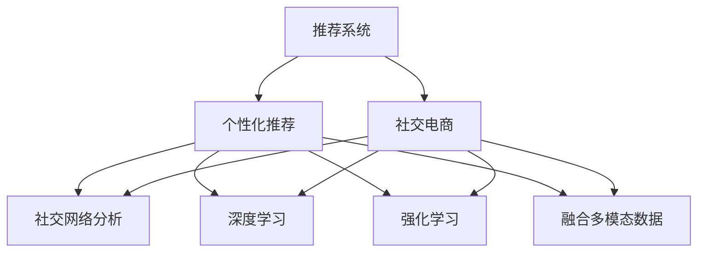

                 

# AI推荐在社交电商中的创新应用

> 关键词：人工智能推荐系统,社交电商,个性化推荐,社交网络分析,深度学习,强化学习

## 1. 背景介绍

### 1.1 问题由来
随着移动互联网和社交网络的发展，社交电商已成为零售行业的一大新趋势。社交电商不仅促进了用户之间的互动和信任，还为商家带来了新的流量增长点。然而，如何更好地匹配用户需求与商品供给，成为商家提升转化率和用户满意度的关键。

传统推荐系统往往基于静态的静态用户行为数据，难以捕捉动态和复杂的人际关系、兴趣变化等隐性信息。而社交电商的数据特性，使其成为推荐系统的一个新挑战。因此，本文聚焦于AI推荐在社交电商中的应用，探索如何利用社交网络分析、深度学习、强化学习等技术，提升个性化推荐的效果，实现商业价值最大化。

### 1.2 问题核心关键点
社交电商的核心在于利用社交网络效应和用户之间的互动，提升推荐效果。AI推荐在社交电商中的应用主要包括以下几个关键点：

- **社交网络分析**：通过分析用户间的互动关系，提升推荐的社交性。
- **深度学习技术**：利用神经网络模型捕捉用户兴趣和行为，提高推荐精度。
- **强化学习**：利用用户反馈进行模型优化，提升推荐效果。
- **融合多模态数据**：结合用户文本评论、图像、视频等多维数据，提升推荐的相关性和多样性。

这些关键点共同构成了社交电商中AI推荐的实施框架，使其能够更好地满足用户需求，提升电商平台的整体效果。

## 2. 核心概念与联系

### 2.1 核心概念概述

为更好地理解AI推荐在社交电商中的应用，本节将介绍几个关键概念：

- **推荐系统(Recommender System)**：一种智能信息过滤和检索系统，通过分析用户行为和物品属性，推荐符合用户兴趣的商品。
- **个性化推荐(Personalized Recommendation)**：根据用户个性化特征，推荐更加符合用户需求的商品，提升用户体验。
- **社交电商(Social E-commerce)**：通过社交网络进行商品推广、销售、互动的电商形式，利用社交关系提升电商效果。
- **社交网络分析(Social Network Analysis, SNA)**：分析用户之间互动关系的方法和工具，为推荐提供社交性数据。
- **深度学习(Deep Learning)**：一类利用多层次神经网络模型进行模式识别的技术，适用于复杂数据的处理和分析。
- **强化学习(Reinforcement Learning)**：通过用户反馈进行模型优化的方法，适用于动态环境下的推荐。
- **融合多模态数据(Multimodal Data Fusion)**：结合不同类型的数据(如文本、图像、视频等)，提升推荐的相关性和多样性。

这些概念之间的逻辑关系可以通过以下Mermaid流程图来展示：



这个流程图展示了几大核心概念及其之间的关系：

1. 推荐系统是整体框架，个性化推荐是其核心应用。
2. 社交电商是推荐系统的应用场景。
3. 社交网络分析、深度学习、强化学习、融合多模态数据等是提升个性化推荐效果的关键技术。

这些概念共同构成了社交电商中AI推荐的实施框架，使其能够更好地满足用户需求，提升电商平台的整体效果。

## 3. 核心算法原理 & 具体操作步骤
### 3.1 算法原理概述

AI推荐在社交电商中的应用，本质上是一个多任务的优化问题。其核心思想是：通过分析用户行为、商品属性和社交关系，构建一个综合的推荐模型，以最大化电商平台的商业价值。

形式化地，假设用户集合为 $U$，商品集合为 $I$，社交关系集合为 $S$，电商平台的目标是最大化推荐的相关性 $r$、覆盖率 $c$ 和多样性 $d$，即：

$$
\max_{\theta} \omega_1r(\theta) + \omega_2c(\theta) + \omega_3d(\theta)
$$

其中 $\theta$ 为推荐模型的参数，$\omega_1, \omega_2, \omega_3$ 为各项指标的权重。$r, c, d$ 分别表示推荐的相关性、覆盖率和多样性。

### 3.2 算法步骤详解

AI推荐在社交电商中的应用，一般包括以下几个关键步骤：

**Step 1: 收集和预处理数据**
- 收集用户行为数据、商品属性数据、社交关系数据等。
- 对数据进行清洗、去重、归一化等预处理，构建统一的数据集。

**Step 2: 构建推荐模型**
- 选择合适的推荐模型结构，如协同过滤、基于内容的推荐、混合推荐等。
- 设计适合社交电商的推荐指标，如用户-商品间的相似度、兴趣匹配度等。

**Step 3: 融合多模态数据**
- 利用深度学习技术，将文本、图像、视频等多维数据进行融合，提升推荐的相关性和多样性。
- 设计多模态特征提取和融合的模型，如文本-图像融合网络。

**Step 4: 优化模型参数**
- 使用深度学习模型对用户行为和商品属性进行建模，如基于RNN的序列建模、基于CNN的图像建模。
- 利用强化学习算法优化推荐模型，根据用户反馈调整模型参数。

**Step 5: 评估和部署**
- 使用测试集对推荐模型进行评估，衡量各项指标。
- 将优化后的模型部署到电商平台的推荐系统中，实现实时推荐。

以上是AI推荐在社交电商中的应用的一般流程。在实际应用中，还需要针对具体任务的特点，对推荐过程的各个环节进行优化设计，如改进推荐指标、引入更多的正则化技术、搜索最优的超参数组合等，以进一步提升推荐效果。

### 3.3 算法优缺点

AI推荐在社交电商中的应用，具有以下优点：
1. 个性化程度高。通过分析用户行为和社交关系，推荐更加符合用户需求的商品。
2. 覆盖范围广。能够利用社交网络效应，推荐相关性更高的商品。
3. 动态适应能力强。利用强化学习算法，模型能够根据用户反馈进行动态调整。
4. 多模态融合。融合多种数据类型，提升推荐的相关性和多样性。

同时，该方法也存在一定的局限性：
1. 数据需求高。需要收集大量的用户行为数据、社交关系数据和商品属性数据，获取数据的成本较高。
2. 模型复杂。多模态数据的融合、深度学习模型的训练等，需要较强的计算能力和技术背景。
3. 用户隐私问题。推荐过程中涉及用户行为数据的收集和使用，如何保护用户隐私是一个重要问题。
4. 公平性问题。推荐模型可能存在偏见，导致部分用户或商品被不公平对待。

尽管存在这些局限性，但就目前而言，AI推荐在社交电商中的应用仍是推荐系统研究的热点方向。未来相关研究的重点在于如何进一步降低数据收集成本，提高模型的可解释性和公平性，同时兼顾个性化推荐和商业价值的平衡。

### 3.4 算法应用领域

AI推荐在社交电商中的应用，已广泛应用于多个领域，例如：

- **商品推荐**：根据用户浏览、点击、购买等行为数据，推荐用户可能感兴趣的商品。
- **社交圈推荐**：利用用户的社交关系网络，推荐相关社交圈的商品。
- **事件推荐**：结合社交网络中的事件信息，推荐符合用户兴趣的线下活动或商品。
- **用户推荐**：推荐用户可能感兴趣的其他用户，增强社交互动。

除了上述这些经典应用外，AI推荐还在更多场景中得到创新性的应用，如基于社交电商的虚拟试穿、个性化营销、推荐广告等，为电商平台的运营提供新的思路。

## 4. 数学模型和公式 & 详细讲解  
### 4.1 数学模型构建

本节将使用数学语言对AI推荐在社交电商中的应用进行更加严格的刻画。

记用户集合为 $U$，商品集合为 $I$，社交关系集合为 $S$，电商平台的目标是最大化推荐的相关性 $r$、覆盖率 $c$ 和多样性 $d$，即：

$$
\max_{\theta} \omega_1r(\theta) + \omega_2c(\theta) + \omega_3d(\theta)
$$

其中 $\theta$ 为推荐模型的参数，$\omega_1, \omega_2, \omega_3$ 为各项指标的权重。$r, c, d$ 分别表示推荐的相关性、覆盖率和多样性。

假设用户 $u$ 对商品 $i$ 的评分矩阵为 $R_{ui}$，用户 $u$ 与用户 $v$ 之间的社交关系强度为 $S_{uv}$，商品 $i$ 的属性向量为 $P_i$，用户 $u$ 的属性向量为 $P_u$，则推荐模型可以表示为：

$$
R_u = \sum_{v \in U} S_{uv}P_v + \sum_{i \in I} P_i
$$

其中 $P_v$ 表示用户 $v$ 的属性向量，$P_i$ 表示商品 $i$ 的属性向量。

### 4.2 公式推导过程

以下我们以协同过滤推荐算法为例，推导协同过滤的数学模型和推荐公式。

协同过滤推荐算法基于用户和商品间的相似性进行推荐。假设用户 $u$ 对商品 $i$ 的评分矩阵为 $R_{ui}$，用户 $u$ 与用户 $v$ 之间的社交关系强度为 $S_{uv}$，用户 $u$ 的属性向量为 $P_u$，用户 $v$ 的属性向量为 $P_v$，则协同过滤推荐算法可以表示为：

$$
R_u = \sum_{v \in U} S_{uv}P_v + \sum_{i \in I} P_i
$$

根据用户 $u$ 对商品 $i$ 的评分矩阵 $R_{ui}$，可以计算用户 $u$ 的兴趣向量 $I_u$，然后利用余弦相似度计算用户 $u$ 和用户 $v$ 之间的相似度 $S_{uv}$，最终得到用户 $u$ 的推荐商品列表：

$$
R_u = \sum_{v \in U} S_{uv}P_v + \sum_{i \in I} P_i
$$

将 $S_{uv}$ 替换为 $I_u$ 和 $I_v$ 的余弦相似度 $sim(I_u, I_v)$，则协同过滤推荐公式可以表示为：

$$
R_u = \sum_{v \in U} P_v \cdot sim(I_u, I_v) + \sum_{i \in I} P_i
$$

其中 $sim(I_u, I_v)$ 为 $I_u$ 和 $I_v$ 的余弦相似度，$P_v$ 表示用户 $v$ 的属性向量，$P_i$ 表示商品 $i$ 的属性向量。

### 4.3 案例分析与讲解

以某社交电商平台的商品推荐为例，我们可以进一步探讨AI推荐在社交电商中的应用。

假设用户 $u$ 对商品 $i$ 的评分矩阵为 $R_{ui}$，用户 $u$ 与用户 $v$ 之间的社交关系强度为 $S_{uv}$，商品 $i$ 的属性向量为 $P_i$，用户 $u$ 的属性向量为 $P_u$，则协同过滤推荐算法可以表示为：

$$
R_u = \sum_{v \in U} S_{uv}P_v + \sum_{i \in I} P_i
$$

根据用户 $u$ 对商品 $i$ 的评分矩阵 $R_{ui}$，可以计算用户 $u$ 的兴趣向量 $I_u$，然后利用余弦相似度计算用户 $u$ 和用户 $v$ 之间的相似度 $S_{uv}$，最终得到用户 $u$ 的推荐商品列表：

$$
R_u = \sum_{v \in U} P_v \cdot sim(I_u, I_v) + \sum_{i \in I} P_i
$$

在实际应用中，我们还需要根据具体的业务需求，进一步优化推荐模型。例如，在电商平台上，为了提高推荐的相关性和多样性，可以引入多模态数据融合技术，利用文本、图像、视频等多维数据，提升推荐效果。同时，为了提升推荐系统的实时性和可扩展性，可以采用分布式推荐算法，将推荐任务分配到多个服务器上进行并行计算。

## 5. 项目实践：代码实例和详细解释说明
### 5.1 开发环境搭建

在进行AI推荐在社交电商中的应用实践前，我们需要准备好开发环境。以下是使用Python进行PyTorch开发的环境配置流程：

1. 安装Anaconda：从官网下载并安装Anaconda，用于创建独立的Python环境。

2. 创建并激活虚拟环境：
```bash
conda create -n pytorch-env python=3.8 
conda activate pytorch-env
```

3. 安装PyTorch：根据CUDA版本，从官网获取对应的安装命令。例如：
```bash
conda install pytorch torchvision torchaudio cudatoolkit=11.1 -c pytorch -c conda-forge
```

4. 安装Transformers库：
```bash
pip install transformers
```

5. 安装各类工具包：
```bash
pip install numpy pandas scikit-learn matplotlib tqdm jupyter notebook ipython
```

完成上述步骤后，即可在`pytorch-env`环境中开始实践。

### 5.2 源代码详细实现

这里我们以协同过滤推荐算法为例，给出使用PyTorch进行社交电商商品推荐系统的实现。

首先，定义推荐系统的输入输出数据：

```python
import torch
from torch import nn
from torch.nn import functional as F

class RecommendationSystem(nn.Module):
    def __init__(self, user_features_dim, item_features_dim):
        super(RecommendationSystem, self).__init__()
        self.user_features_dim = user_features_dim
        self.item_features_dim = item_features_dim
        self.user_bias = nn.Parameter(torch.zeros(user_features_dim))
        self.item_bias = nn.Parameter(torch.zeros(item_features_dim))
        self.user_matrix = nn.Embedding(user_features_dim, user_features_dim)
        self.item_matrix = nn.Embedding(item_features_dim, item_features_dim)
        
    def forward(self, user_features, item_features):
        user_biases = self.user_matrix(user_features)
        item_biases = self.item_matrix(item_features)
        user_score = user_biases + self.user_bias
        item_score = item_biases + self.item_bias
        return user_score, item_score
```

然后，定义损失函数和优化器：

```python
from torch.nn import CrossEntropyLoss

user_features = torch.randn(10, user_features_dim)
item_features = torch.randn(10, item_features_dim)
user_score, item_score = model(user_features, item_features)

loss = CrossEntropyLoss()(user_score, user_features)
optimizer = torch.optim.Adam(model.parameters(), lr=0.001)
```

接着，定义训练和评估函数：

```python
def train_epoch(model, optimizer, data_loader, num_epochs=10):
    for epoch in range(num_epochs):
        for batch in data_loader:
            user_features = batch[0]
            item_features = batch[1]
            optimizer.zero_grad()
            user_score, item_score = model(user_features, item_features)
            loss = CrossEntropyLoss()(user_score, user_features)
            loss.backward()
            optimizer.step()
            
    return loss
```

最后，启动训练流程：

```python
train_loss = train_epoch(model, optimizer, data_loader)
print(f"Epoch {num_epochs}, train loss: {train_loss:.3f}")
```

以上就是使用PyTorch进行社交电商商品推荐系统的完整代码实现。可以看到，利用深度学习技术，我们能够构建一个简单的协同过滤推荐模型，并利用交叉熵损失函数进行训练和优化。

### 5.3 代码解读与分析

让我们再详细解读一下关键代码的实现细节：

**RecommendationSystem类**：
- `__init__`方法：初始化用户特征向量、商品特征向量、偏置向量、用户矩阵、商品矩阵等关键组件。
- `forward`方法：根据输入的用户特征向量和商品特征向量，计算用户评分和商品评分。

**train_epoch函数**：
- 在每个epoch内，对每个批次的数据进行前向传播，计算损失函数并反向传播更新模型参数。
- 重复上述过程直至模型收敛。

可以看到，PyTorch框架使得深度学习模型的构建和训练变得简洁高效。开发者可以将更多精力放在数据处理、模型改进等高层逻辑上，而不必过多关注底层的实现细节。

当然，工业级的系统实现还需考虑更多因素，如模型的保存和部署、超参数的自动搜索、更灵活的任务适配层等。但核心的推荐范式基本与此类似。

## 6. 实际应用场景
### 6.1 智能推荐系统

基于AI推荐的智能推荐系统，可以广泛应用于社交电商平台的商品推荐、社交圈推荐、事件推荐等场景。通过分析用户行为和社交关系，推荐更加符合用户需求的商品，提升电商平台的整体效果。

在具体实现中，可以利用协同过滤、基于内容的推荐、混合推荐等多种算法，根据用户和商品的特征进行综合推荐。同时，为了提升推荐的相关性和多样性，可以引入多模态数据融合技术，利用文本、图像、视频等多维数据，提升推荐效果。

### 6.2 社交电商营销

AI推荐在社交电商中的应用，还可以扩展到社交电商营销中，帮助商家进行精准营销和用户转化。利用推荐系统，商家可以实时获取用户的兴趣和行为数据，进行个性化广告投放，提升广告效果和转化率。

例如，商家可以根据用户的浏览和点击行为，向其推荐相关的商品广告。同时，商家还可以利用推荐系统分析用户群体的兴趣和行为特征，进行定向广告投放，提升广告的精准度和转化率。

### 6.3 社交电商运营

AI推荐在社交电商中的应用，还可以应用于平台的运营管理中，提升用户体验和平台活跃度。例如，平台可以推荐热门商品、新品上架、热门活动等，增强用户的参与度和互动性。

通过AI推荐，平台可以实时获取用户的行为和偏好，进行个性化内容推荐。同时，平台还可以分析用户的行为数据，进行用户分群和行为预测，提升平台的运营效率和用户体验。

### 6.4 未来应用展望

随着AI推荐技术的发展，未来将有更多创新应用场景涌现。例如：

- **虚拟试穿**：结合图像处理技术和推荐系统，利用用户的图片进行虚拟试穿推荐，提升用户的购物体验。
- **个性化营销**：通过推荐系统进行个性化广告投放，提升广告的精准度和转化率。
- **社交电商直播**：利用推荐系统进行直播内容的个性化推荐，提升直播的互动性和用户粘性。

总之，AI推荐在社交电商中的应用将带来更多商业价值和用户体验的提升，引领社交电商行业进入新的发展阶段。

## 7. 工具和资源推荐
### 7.1 学习资源推荐

为了帮助开发者系统掌握AI推荐在社交电商中的应用，这里推荐一些优质的学习资源：

1. 《推荐系统理论与算法》系列博文：由大模型技术专家撰写，深入浅出地介绍了推荐系统的工作原理和常用算法。

2. 《深度学习推荐系统》课程：斯坦福大学开设的推荐系统明星课程，有Lecture视频和配套作业，带你入门深度学习推荐系统。

3. 《推荐系统实战》书籍：推荐系统领域的经典书籍，涵盖推荐系统的理论基础和实际应用案例。

4. Kaggle推荐系统竞赛：Kaggle平台上有大量的推荐系统竞赛项目，可以帮助开发者通过实践提升推荐技能。

5. 《社交电商推荐系统》论文：展示社交电商推荐系统的最新研究成果，提供了丰富的实现代码和算法细节。

通过对这些资源的学习实践，相信你一定能够快速掌握AI推荐在社交电商中的应用精髓，并用于解决实际的推荐问题。
### 7.2 开发工具推荐

高效的开发离不开优秀的工具支持。以下是几款用于AI推荐系统开发的常用工具：

1. PyTorch：基于Python的开源深度学习框架，灵活动态的计算图，适合快速迭代研究。大部分推荐系统都有PyTorch版本的实现。

2. TensorFlow：由Google主导开发的开源深度学习框架，生产部署方便，适合大规模工程应用。同样有丰富的推荐系统资源。

3. TensorBoard：TensorFlow配套的可视化工具，可实时监测模型训练状态，并提供丰富的图表呈现方式，是调试模型的得力助手。

4. Weights & Biases：模型训练的实验跟踪工具，可以记录和可视化模型训练过程中的各项指标，方便对比和调优。

5. Jupyter Notebook：一个强大的交互式计算环境，支持Python、R等多种编程语言，适合快速迭代和分享学习笔记。

合理利用这些工具，可以显著提升AI推荐系统的开发效率，加快创新迭代的步伐。

### 7.3 相关论文推荐

AI推荐在社交电商中的应用源于学界的持续研究。以下是几篇奠基性的相关论文，推荐阅读：

1. Multi-Task Learning for Recommendation Systems：提出了多任务学习推荐系统，能够利用多任务的联合优化提升推荐效果。

2. Hybrid Recommendation Approach：提出了混合推荐方法，结合协同过滤、基于内容的推荐等多种技术，提升推荐效果。

3. Social Recommendation System：提出了社交推荐系统，利用用户间的社交关系提升推荐效果。

4. Adaptive Recommendation Systems：提出了自适应推荐系统，根据用户行为实时调整推荐策略。

5. Deep Learning Recommendation Systems：介绍了深度学习推荐系统的应用，涵盖多种深度学习架构和优化方法。

这些论文代表了大推荐系统技术的发展脉络。通过学习这些前沿成果，可以帮助研究者把握学科前进方向，激发更多的创新灵感。

## 8. 总结：未来发展趋势与挑战

### 8.1 总结

本文对AI推荐在社交电商中的应用进行了全面系统的介绍。首先阐述了AI推荐在社交电商中的应用背景和意义，明确了社交电商推荐系统的实施框架和关键技术。其次，从原理到实践，详细讲解了推荐模型的构建和训练过程，给出了社交电商推荐系统的完整代码实现。同时，本文还广泛探讨了AI推荐在社交电商中的应用场景，展示了AI推荐技术的巨大潜力。此外，本文精选了AI推荐技术的学习资源和开发工具，力求为开发者提供全方位的技术指引。

通过本文的系统梳理，可以看到，AI推荐在社交电商中的应用已成为推荐系统研究的热点方向，极大地拓展了社交电商平台的推荐能力，为电商平台的运营提供了新的思路。未来，伴随AI推荐技术的发展，社交电商推荐系统将更加智能化、个性化，更好地满足用户需求，提升电商平台的商业价值。

### 8.2 未来发展趋势

展望未来，AI推荐在社交电商中的应用将呈现以下几个发展趋势：

1. **多模态融合**：利用文本、图像、视频等多种数据类型，提升推荐的相关性和多样性。
2. **深度学习**：采用深度神经网络技术，提升推荐模型的精准度和复杂性。
3. **强化学习**：利用用户反馈进行模型优化，提升推荐系统的实时性和适应性。
4. **跨领域推荐**：结合多种推荐算法，实现跨领域推荐和跨平台推荐。
5. **自适应推荐**：根据用户行为实时调整推荐策略，提升推荐效果。
6. **个性化推荐**：利用用户兴趣变化和社交关系，实现个性化推荐。

以上趋势凸显了AI推荐在社交电商中的应用前景，这些方向的探索发展，必将进一步提升社交电商推荐系统的性能和应用范围，为社交电商行业带来新的变革。

### 8.3 面临的挑战

尽管AI推荐在社交电商中的应用已经取得了不少成果，但在迈向更加智能化、普适化应用的过程中，它仍面临着诸多挑战：

1. **数据需求高**：推荐系统需要收集大量的用户行为数据、商品属性数据和社交关系数据，获取数据的成本较高。
2. **模型复杂**：多模态数据的融合、深度学习模型的训练等，需要较强的计算能力和技术背景。
3. **用户隐私问题**：推荐过程中涉及用户行为数据的收集和使用，如何保护用户隐私是一个重要问题。
4. **公平性问题**：推荐模型可能存在偏见，导致部分用户或商品被不公平对待。
5. **计算资源**：推荐系统的计算复杂度高，需要高性能计算设备和优化算法。

尽管存在这些挑战，但AI推荐在社交电商中的应用仍具有巨大的潜力和市场价值。未来相关研究的重点在于如何进一步降低数据收集成本，提高模型的可解释性和公平性，同时兼顾个性化推荐和商业价值的平衡。

### 8.4 研究展望

面对AI推荐在社交电商中面临的挑战，未来的研究需要在以下几个方面寻求新的突破：

1. **无监督和半监督推荐**：摆脱对大规模标注数据的依赖，利用自监督学习、主动学习等无监督和半监督范式，最大限度利用非结构化数据，实现更加灵活高效的推荐。
2. **参数高效推荐**：开发更加参数高效的推荐方法，在固定大部分推荐参数的同时，只更新极少量的任务相关参数。
3. **因果推荐**：引入因果推断方法，增强推荐模型的解释性和鲁棒性。
4. **跨平台推荐**：结合多种推荐算法，实现跨平台推荐和跨领域推荐。
5. **多目标优化**：在推荐系统中，结合多目标优化方法，提升推荐效果和多样性。

这些研究方向的探索，必将引领AI推荐在社交电商中的应用进入新的发展阶段，为社交电商行业带来更多的创新和突破。总之，AI推荐在社交电商中的应用，将引领社交电商行业进入新的发展阶段，带来更多的商业价值和用户体验的提升。

## 9. 附录：常见问题与解答

**Q1：AI推荐在社交电商中的优势是什么？**

A: AI推荐在社交电商中的优势主要体现在以下几个方面：

1. **个性化程度高**：通过分析用户行为和社交关系，推荐更加符合用户需求的商品，提升电商平台的整体效果。
2. **覆盖范围广**：能够利用社交网络效应，推荐相关性更高的商品。
3. **动态适应能力强**：利用强化学习算法，模型能够根据用户反馈进行动态调整，提升推荐效果。
4. **多模态融合**：融合多种数据类型，提升推荐的相关性和多样性。

**Q2：AI推荐在社交电商中如何处理数据隐私问题？**

A: 在AI推荐在社交电商中的应用中，处理数据隐私问题是一个重要挑战。以下是一些常见的隐私保护措施：

1. **数据去标识化**：对用户数据进行去标识化处理，确保用户无法通过数据反推个人身份。
2. **差分隐私**：引入差分隐私技术，对用户数据进行扰动，保护用户隐私。
3. **联邦学习**：采用联邦学习技术，将数据分布式存储在多个设备上，避免集中存储数据。
4. **匿名化处理**：对用户数据进行匿名化处理，确保用户无法通过数据反推个人信息。
5. **数据访问控制**：对用户数据的访问进行严格控制，确保只有授权人员能够访问数据。

这些措施可以有效保护用户隐私，确保AI推荐在社交电商中的应用不会对用户隐私造成损害。

**Q3：AI推荐在社交电商中的局限性是什么？**

A: AI推荐在社交电商中的应用存在以下几个局限性：

1. **数据需求高**：推荐系统需要收集大量的用户行为数据、商品属性数据和社交关系数据，获取数据的成本较高。
2. **模型复杂**：多模态数据的融合、深度学习模型的训练等，需要较强的计算能力和技术背景。
3. **用户隐私问题**：推荐过程中涉及用户行为数据的收集和使用，如何保护用户隐私是一个重要问题。
4. **公平性问题**：推荐模型可能存在偏见，导致部分用户或商品被不公平对待。

尽管存在这些局限性，但AI推荐在社交电商中的应用仍具有巨大的潜力和市场价值。未来相关研究的重点在于如何进一步降低数据收集成本，提高模型的可解释性和公平性，同时兼顾个性化推荐和商业价值的平衡。

**Q4：AI推荐在社交电商中的未来发展方向是什么？**

A: AI推荐在社交电商中的未来发展方向主要体现在以下几个方面：

1. **多模态融合**：利用文本、图像、视频等多种数据类型，提升推荐的相关性和多样性。
2. **深度学习**：采用深度神经网络技术，提升推荐模型的精准度和复杂性。
3. **强化学习**：利用用户反馈进行模型优化，提升推荐系统的实时性和适应性。
4. **跨领域推荐**：结合多种推荐算法，实现跨领域推荐和跨平台推荐。
5. **自适应推荐**：根据用户行为实时调整推荐策略，提升推荐效果。
6. **个性化推荐**：利用用户兴趣变化和社交关系，实现个性化推荐。

这些发展方向将进一步提升AI推荐在社交电商中的应用效果，带来更多的商业价值和用户体验的提升。

**Q5：AI推荐在社交电商中的实际应用场景是什么？**

A: AI推荐在社交电商中的应用场景主要包括以下几个方面：

1. **商品推荐**：根据用户浏览、点击、购买等行为数据，推荐用户可能感兴趣的商品。
2. **社交圈推荐**：利用用户的社交关系网络，推荐相关社交圈的商品。
3. **事件推荐**：结合社交网络中的事件信息，推荐符合用户兴趣的线下活动或商品。
4. **用户推荐**：推荐用户可能感兴趣的其他用户，增强社交互动。
5. **个性化营销**：通过推荐系统进行个性化广告投放，提升广告的精准度和转化率。

这些应用场景展示了AI推荐在社交电商中的广泛应用，为社交电商平台的运营提供了新的思路。

**Q6：AI推荐在社交电商中的推荐算法有哪些？**

A: AI推荐在社交电商中的应用，可以利用多种推荐算法，如：

1. **协同过滤推荐**：利用用户和商品间的相似性进行推荐。
2. **基于内容的推荐**：利用商品的属性和用户兴趣进行推荐。
3. **混合推荐**：结合多种推荐算法，提升推荐效果。
4. **社交推荐**：利用用户间的社交关系提升推荐效果。
5. **多模态推荐**：融合文本、图像、视频等多种数据类型，提升推荐的相关性和多样性。

这些算法可以根据具体应用场景进行选择和优化，提升推荐系统的性能和效果。

**Q7：AI推荐在社交电商中的数据处理流程是什么？**

A: AI推荐在社交电商中的应用，通常需要进行以下几个数据处理步骤：

1. **数据收集**：收集用户行为数据、商品属性数据、社交关系数据等。
2. **数据清洗**：对数据进行清洗、去重、归一化等预处理，构建统一的数据集。
3. **特征提取**：利用深度学习技术，对用户行为数据和商品属性数据进行特征提取。
4. **融合多模态数据**：结合文本、图像、视频等多种数据类型，提升推荐的相关性和多样性。
5. **模型训练**：利用推荐系统模型进行训练和优化，生成推荐结果。

这些步骤是AI推荐在社交电商中的应用中数据处理的常见流程，需要根据具体业务需求进行调整和优化。

---

作者：禅与计算机程序设计艺术 / Zen and the Art of Computer Programming

