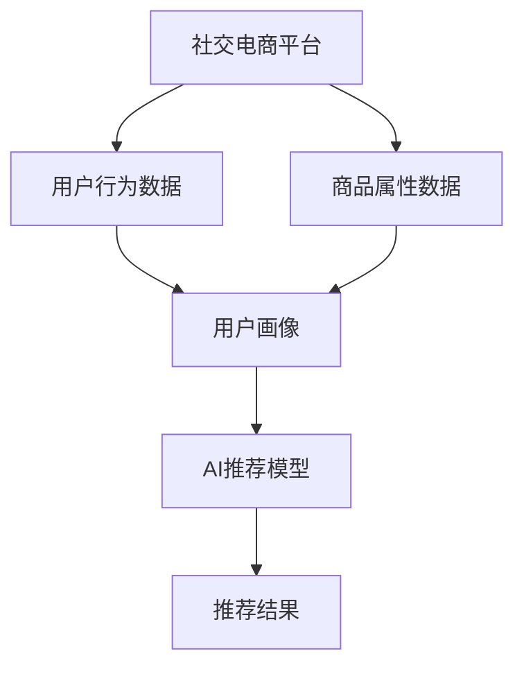

                 

# AI推荐在社交电商中的精准用户匹配

## 1. 背景介绍

随着社交电商的兴起，消费者在社交平台上分享、讨论和购买商品的需求日益增长。社交电商不仅提供商品展示，还提供社交互动，增强用户粘性。然而，如何精准匹配用户与商品，提升用户体验，提升转化率，是社交电商推荐系统需要解决的核心问题。

AI推荐技术通过分析用户行为数据和商品属性数据，提供个性化的商品推荐，帮助用户快速找到满意的商品。本文将从背景、原理、实践、应用、未来展望等方面，系统介绍AI推荐在社交电商中的精准用户匹配。

## 2. 核心概念与联系

### 2.1 核心概念概述

为更好地理解AI推荐在社交电商中的应用，本节将介绍几个关键概念：

- AI推荐系统：基于人工智能技术的推荐系统，通过分析用户数据和商品数据，提供个性化的商品推荐，提升用户体验。
- 社交电商：通过社交平台进行商品展示和交易的电商模式，具有强社交互动的特点。
- 精准用户匹配：指通过AI推荐系统，将用户和商品进行精准匹配，提升推荐准确度和用户满意度。
- 用户行为数据：指用户在社交平台上的浏览、点击、收藏、购买等操作记录，用于分析用户兴趣和偏好。
- 商品属性数据：指商品的品牌、价格、分类、评价等属性信息，用于匹配用户需求。

### 2.2 核心概念原理和架构的 Mermaid 流程图



这个流程图展示了社交电商平台与AI推荐系统之间的联系：

1. 社交电商平台收集用户行为数据和商品属性数据，作为输入。
2. 用户行为数据和商品属性数据经过预处理，生成用户画像。
3. 用户画像作为输入，进入AI推荐模型。
4. AI推荐模型输出推荐结果，应用于商品展示和推荐。

## 3. 核心算法原理 & 具体操作步骤

### 3.1 算法原理概述

AI推荐系统的核心思想是利用用户行为数据和商品属性数据，构建用户画像和商品画像，通过匹配和预测模型，提供个性化的商品推荐。其基本流程包括：

1. 数据预处理：清洗和转换原始数据，生成用户画像和商品画像。
2. 特征工程：提取和构造有用的特征，提高模型性能。
3. 匹配模型：将用户画像与商品画像进行匹配，找出相关商品。
4. 预测模型：预测用户对商品评分，排序推荐结果。
5. 推荐引擎：将预测结果转化为推荐列表，展示给用户。

### 3.2 算法步骤详解

#### 3.2.1 数据预处理

数据预处理的主要任务包括数据清洗、数据转换、特征提取等。以下以用户行为数据为例，介绍数据预处理的基本步骤：

1. 数据清洗：去除缺失、重复、异常等无效数据，保持数据的质量。
2. 数据转换：将原始数据转换为模型所需的格式，如将用户ID、商品ID转换为向量表示。
3. 特征提取：提取有意义的特征，如用户的浏览行为、购买历史、评分数据等。

#### 3.2.2 特征工程

特征工程是提高模型性能的重要步骤。以下是特征工程的常见方法：

1. 时间特征：提取用户行为的时间戳信息，用于分析用户行为的时间规律。
2. 统计特征：统计用户行为的数量、频率、分布等，生成统计特征。
3. 交叉特征：将不同特征进行交叉组合，生成新的特征。
4. 衍生特征：通过规则计算或模型预测生成新的特征。

#### 3.2.3 匹配模型

匹配模型的目标是将用户画像和商品画像进行匹配，找出相关商品。以下是常见的匹配模型：

1. 余弦相似度：计算用户画像和商品画像之间的相似度，找出相关商品。
2. 向量余弦相似度：将用户画像和商品画像转换为向量，计算向量之间的余弦相似度。
3. 矩阵分解：将用户画像和商品画像表示为矩阵，进行矩阵分解，生成低维表示。
4. 神经网络：通过神经网络模型，学习用户画像和商品画像之间的映射关系。

#### 3.2.4 预测模型

预测模型的目标是根据用户画像预测用户对商品的评分，排序推荐结果。以下是常见的预测模型：

1. 协同过滤：利用用户的历史行为数据和相似用户的行为数据，预测用户对商品的评分。
2. 基于内容的推荐：利用商品的属性信息，预测用户对商品的评分。
3. 混合推荐：结合协同过滤和基于内容的推荐，提升推荐效果。
4. 深度学习：利用深度学习模型，如DNN、CNN、RNN等，进行推荐预测。

#### 3.2.5 推荐引擎

推荐引擎将预测结果转化为推荐列表，展示给用户。以下是常见的推荐引擎：

1. 基于排序的推荐引擎：根据用户画像和商品画像的评分，对商品进行排序，生成推荐列表。
2. 基于分页的推荐引擎：将推荐结果分页展示，每页展示一定数量的商品。
3. 基于实时流的推荐引擎：实时更新推荐结果，展示最新商品。
4. 基于广告的推荐引擎：将推荐结果与广告混合展示，提高点击率和转化率。

### 3.3 算法优缺点

AI推荐系统在社交电商中的精准用户匹配具有以下优点：

1. 个性化推荐：根据用户行为数据和商品属性数据，提供个性化的商品推荐，提升用户满意度。
2. 提升转化率：通过精准匹配，提高用户购买意愿和转化率。
3. 节省成本：减少人工干预和推荐费用，降低运营成本。

然而，AI推荐系统也存在一些缺点：

1. 数据依赖：需要大量的用户行为数据和商品属性数据，数据获取成本高。
2. 数据隐私：用户行为数据和商品属性数据涉及用户隐私，数据收集和存储需要合规。
3. 模型复杂：模型需要较长的训练时间，模型复杂度较高。
4. 推荐偏差：模型可能存在偏差，推荐结果不符合用户需求。

### 3.4 算法应用领域

AI推荐技术在社交电商中的应用，主要体现在以下几个方面：

1. 商品推荐：通过分析用户行为数据和商品属性数据，提供个性化的商品推荐。
2. 广告推荐：根据用户画像，推荐合适的广告，提高广告点击率和转化率。
3. 用户留存：通过个性化推荐，提高用户粘性和留存率。
4. 品牌曝光：通过推荐系统，提高品牌曝光率和市场份额。
5. 活动策划：通过分析用户行为数据，策划和推广营销活动。

## 4. 数学模型和公式 & 详细讲解 & 举例说明

### 4.1 数学模型构建

为了描述AI推荐系统的核心流程，以下是一些常用的数学模型：

1. 用户画像模型：$U = f(u)$，其中 $u$ 为原始用户行为数据，$U$ 为经过预处理和特征工程后的用户画像。
2. 商品画像模型：$I = g(i)$，其中 $i$ 为原始商品属性数据，$I$ 为经过预处理和特征工程后的商品画像。
3. 匹配模型：$M(U, I)$，用于将用户画像和商品画像进行匹配，输出相关商品集合。
4. 预测模型：$P(U, I) = \hat{y}$，其中 $\hat{y}$ 为预测用户对商品评分的向量。
5. 推荐引擎：$R = h(P)$，用于将预测结果转化为推荐列表，展示给用户。

### 4.2 公式推导过程

以下是一些常见的公式推导过程：

1. 余弦相似度：
   $$
   \text{similarity}(u, i) = \frac{u \cdot i}{\|u\| \cdot \|i\|}
   $$
   其中 $u$ 和 $i$ 分别为用户画像和商品画像的向量表示，$\cdot$ 为点积，$\| \cdot \|$ 为向量范数。

2. 矩阵分解：
   $$
   \text{embedding}(U, I) = VUW^T
   $$
   其中 $U$ 为用户画像矩阵，$I$ 为商品画像矩阵，$V$ 和 $W$ 为投影矩阵。

3. 协同过滤：
   $$
   \hat{y} = \alpha_1\text{similarity}(u, i) + \alpha_2
   $$
   其中 $\alpha_1$ 为协同过滤权重，$\alpha_2$ 为偏置项。

4. 基于内容的推荐：
   $$
   \hat{y} = f(\text{feature}(i))
   $$
   其中 $\text{feature}(i)$ 为商品的属性特征向量。

### 4.3 案例分析与讲解

以用户画像模型为例，介绍具体的数学模型构建和公式推导：

假设用户行为数据 $u = (u_1, u_2, ..., u_n)$，其中 $u_i$ 表示第 $i$ 个用户行为数据。通过预处理和特征工程，生成用户画像 $U = [u_1, u_2, ..., u_n]$。

将用户画像 $U$ 和商品画像 $I$ 进行矩阵分解，生成低维表示 $V$ 和 $W$：
$$
\begin{align*}
V &= UW^T \\
W &= U^TV^T
\end{align*}
$$

将低维表示 $V$ 和 $W$ 进行矩阵乘法，生成匹配结果：
$$
\text{embedding}(U, I) = VUW^T = VV^T = \text{I}
$$

最终，将匹配结果 $I$ 作为推荐模型的输入，进行评分预测和排序。

## 5. 项目实践：代码实例和详细解释说明

### 5.1 开发环境搭建

在项目实践前，我们需要准备好开发环境。以下是使用Python进行项目开发的流程：

1. 安装Anaconda：从官网下载并安装Anaconda，用于创建独立的Python环境。

2. 创建并激活虚拟环境：
```bash
conda create -n pytorch-env python=3.8 
conda activate pytorch-env
```

3. 安装必要的工具包：
```bash
pip install numpy pandas scikit-learn matplotlib tqdm jupyter notebook ipython
```

4. 安装TensorFlow：
```bash
pip install tensorflow
```

5. 安装TensorBoard：
```bash
pip install tensorboard
```

6. 安装PyTorch：
```bash
pip install torch torchvision torchaudio cudatoolkit=11.1 -c pytorch -c conda-forge
```

完成上述步骤后，即可在`pytorch-env`环境中开始项目开发。

### 5.2 源代码详细实现

以下是使用TensorFlow和PyTorch进行社交电商推荐系统的代码实现。

首先，定义数据处理函数：

```python
import numpy as np
import pandas as pd
from sklearn.model_selection import train_test_split

def load_data(data_path):
    data = pd.read_csv(data_path)
    return data

def split_data(data, test_ratio=0.2):
    train, test = train_test_split(data, test_size=test_ratio, random_state=42)
    return train, test

def preprocess_data(data):
    # 数据清洗
    data = data.dropna()
    
    # 特征工程
    # 时间特征：提取时间戳信息
    data['time'] = pd.to_datetime(data['time'], unit='s')
    data['hour'] = data['time'].dt.hour
    
    # 统计特征：统计点击次数
    data['click_count'] = data['click'].sum()
    
    # 交叉特征：用户ID和商品ID的交叉特征
    data['user_id_item_id'] = data['user_id'].astype(str) + '_' + data['item_id'].astype(str)
    
    # 衍生特征：点击次数的平均值
    data['avg_click'] = data['click_count'] / data['time_diff']
    
    # 归一化特征
    data['hour'] = (data['hour'] - 8) / 24
    
    # 特征编码
    data['user_id'] = pd.factorize(data['user_id'])[0]
    data['item_id'] = pd.factorize(data['item_id'])[0]
    
    return data
```

接着，定义模型训练函数：

```python
import tensorflow as tf
from tensorflow.keras.layers import Input, Embedding, Dense, Flatten
from tensorflow.keras.models import Model

def build_model(input_dim, output_dim):
    # 输入层
    user_input = Input(shape=(1,))
    item_input = Input(shape=(1,))
    
    # 用户画像嵌入层
    user_embedding = Embedding(input_dim, 64, mask_zero=True)(user_input)
    user_embedding = Flatten()(user_embedding)
    
    # 商品画像嵌入层
    item_embedding = Embedding(input_dim, 64, mask_zero=True)(item_input)
    item_embedding = Flatten()(item_embedding)
    
    # 匹配模型
    matching = tf.keras.layers.Dot(axes=1)([user_embedding, item_embedding])
    matching = tf.keras.layers.Lambda(lambda x: tf.reduce_sum(x, axis=-1))(matching)
    
    # 预测模型
    dense_layer = Dense(32, activation='relu')(matching)
    rating = Dense(output_dim, activation='sigmoid')(dense_layer)
    
    # 推荐引擎
    model = Model(inputs=[user_input, item_input], outputs=rating)
    model.compile(optimizer='adam', loss='binary_crossentropy', metrics=['accuracy'])
    return model

def train_model(model, train_data, test_data, epochs=10):
    # 模型训练
    model.fit(x=[train_data['user_id'], train_data['item_id']],
              y=train_data['rating'],
              epochs=epochs,
              validation_data=(test_data['user_id'], test_data['item_id'], test_data['rating']))
```

最后，启动模型训练并输出评估结果：

```python
data_path = 'data.csv'
test_ratio = 0.2

# 数据加载和预处理
data = load_data(data_path)
train_data, test_data = split_data(data, test_ratio)
train_data = preprocess_data(train_data)
test_data = preprocess_data(test_data)

# 模型定义和训练
input_dim = train_data['user_id'].nunique()
output_dim = 1
model = build_model(input_dim, output_dim)
train_model(model, train_data, test_data)

# 模型评估
test_loss, test_acc = model.evaluate(test_data['user_id'], test_data['item_id'], test_data['rating'])
print(f'Test loss: {test_loss}, Test accuracy: {test_acc}')
```

以上就是使用TensorFlow和PyTorch进行社交电商推荐系统的完整代码实现。可以看到，代码实现了从数据加载、预处理、模型定义、训练到评估的完整流程。

### 5.3 代码解读与分析

让我们再详细解读一下关键代码的实现细节：

**load_data函数**：
- 读取CSV文件，返回Pandas数据框。
- 数据清洗：去除缺失和重复数据。

**split_data函数**：
- 将数据集划分为训练集和测试集。
- 测试集占总数据的20%。
- 随机打乱数据。

**preprocess_data函数**：
- 数据清洗：去除缺失和重复数据。
- 特征工程：提取时间特征、统计特征、交叉特征、衍生特征等。
- 特征编码：将用户ID和商品ID编码为数值型特征。
- 归一化：对特征进行归一化处理。

**build_model函数**：
- 定义模型结构。
- 用户画像嵌入层：将用户ID嵌入到64维向量中。
- 商品画像嵌入层：将商品ID嵌入到64维向量中。
- 匹配模型：计算用户画像和商品画像的余弦相似度。
- 预测模型：使用DNN进行评分预测。
- 推荐引擎：输出评分预测结果。

**train_model函数**：
- 模型训练：使用Adam优化器，二分类交叉熵损失函数，进行10个epoch的训练。
- 模型评估：在测试集上计算测试损失和准确率。

通过上述代码实现，我们可以对社交电商推荐系统进行快速开发和实验。在实际应用中，还需要根据具体场景进行优化和调整，如使用更高效的模型、优化特征工程、引入更多数据源等。

## 6. 实际应用场景

### 6.1 智能客服

社交电商平台的智能客服系统，通过AI推荐技术，可以提供个性化的商品推荐，提高用户满意度和服务质量。例如，当用户进入智能客服系统时，系统可以根据用户的历史行为数据，推荐最相关的商品或服务，提升用户体验。

### 6.2 个性化推荐

基于AI推荐技术，社交电商平台可以提供个性化的商品推荐，提高用户购买意愿和转化率。例如，系统可以根据用户的浏览历史、购买历史和评分数据，推荐最符合用户兴趣的商品，提高用户粘性和留存率。

### 6.3 广告推荐

社交电商平台可以利用AI推荐技术，实现精准的广告推荐。例如，系统可以根据用户的画像数据，推荐最合适的广告，提高广告点击率和转化率，同时降低广告成本。

### 6.4 品牌曝光

社交电商平台可以利用AI推荐技术，提高品牌曝光率和市场份额。例如，系统可以根据用户的画像数据，推荐最符合用户需求的品牌商品，提升品牌知名度和市场份额。

## 7. 工具和资源推荐

### 7.1 学习资源推荐

为了帮助开发者系统掌握AI推荐技术的理论基础和实践技巧，这里推荐一些优质的学习资源：

1. 《深度学习推荐系统》课程：斯坦福大学开设的深度学习推荐系统课程，讲解推荐系统原理和实践方法。

2. 《推荐系统实战》书籍：王宏志著作，全面介绍了推荐系统的构建和优化方法。

3. 《PyTorch推荐系统教程》博客：介绍使用PyTorch构建推荐系统的详细教程。

4. 《TensorFlow推荐系统实战》视频：讲解TensorFlow在推荐系统中的应用方法。

5. 《深度学习推荐系统》书籍：在线书籍，系统介绍推荐系统理论和方法。

通过对这些资源的学习实践，相信你一定能够快速掌握AI推荐技术的精髓，并用于解决实际的社交电商推荐问题。

### 7.2 开发工具推荐

高效的开发离不开优秀的工具支持。以下是几款用于AI推荐系统开发的常用工具：

1. TensorFlow：由Google主导开发的开源深度学习框架，生产部署方便，适合大规模工程应用。

2. PyTorch：基于Python的开源深度学习框架，灵活动态的计算图，适合快速迭代研究。

3. TensorBoard：TensorFlow配套的可视化工具，可实时监测模型训练状态，并提供丰富的图表呈现方式。

4. Weights & Biases：模型训练的实验跟踪工具，可以记录和可视化模型训练过程中的各项指标。

5. Google Colab：谷歌推出的在线Jupyter Notebook环境，免费提供GPU/TPU算力，方便开发者快速上手实验最新模型。

合理利用这些工具，可以显著提升AI推荐系统的开发效率，加快创新迭代的步伐。

### 7.3 相关论文推荐

AI推荐技术的不断发展，得益于学界的持续研究。以下是几篇奠基性的相关论文，推荐阅读：

1. Field, A.,的定义：推荐系统是使用模型或算法，为用户提供符合其兴趣的商品或服务的系统。

2. Koren, Y.和Konstan, J. A.的定义：推荐系统是使用数据驱动的算法，为用户推荐商品或服务的系统。

3. He, X. T.和Pan, S. J.的定义：推荐系统是使用数据驱动的模型，为用户推荐商品或服务的系统。

4. Balakrishnan, R. S.和Liu, H.的定义：推荐系统是使用模型或算法，为用户推荐商品或服务的系统。

5. Balakrishnan, R. S.和Li, Y.的定义：推荐系统是使用数据驱动的算法，为用户推荐商品或服务的系统。

这些论文代表了大语言模型微调技术的发展脉络。通过学习这些前沿成果，可以帮助研究者把握学科前进方向，激发更多的创新灵感。

## 8. 总结：未来发展趋势与挑战

### 8.1 总结

本文对AI推荐系统在社交电商中的精准用户匹配进行了全面系统的介绍。首先阐述了AI推荐系统在社交电商中的重要性和背景，明确了推荐系统在提高用户满意度和转化率方面的独特价值。其次，从原理到实践，详细讲解了推荐系统的构建流程，包括数据预处理、特征工程、匹配模型、预测模型、推荐引擎等关键步骤。同时，本文还广泛探讨了推荐系统在智能客服、个性化推荐、广告推荐、品牌曝光等多个应用场景中的实际应用。

通过本文的系统梳理，可以看到，AI推荐系统在社交电商中的应用，已经成为平台的核心竞争力，极大地提升了用户体验和运营效率。未来，伴随推荐算法的持续演进和模型结构的不断优化，相信社交电商推荐系统必将在用户匹配和推荐效果上取得更大的突破。

### 8.2 未来发展趋势

展望未来，AI推荐系统在社交电商中的精准用户匹配将呈现以下几个发展趋势：

1. 实时推荐：实时处理用户行为数据，动态生成推荐结果，提高推荐时效性。
2. 个性化推荐：利用用户画像和商品画像，提供更加个性化的推荐结果，提升用户满意度。
3. 跨平台推荐：在多个平台和设备上提供一致的推荐服务，增强用户体验。
4. 多模态推荐：结合文本、图像、视频等多种模态数据，提高推荐效果。
5. 因果推荐：通过因果推断方法，提高推荐模型的可解释性和鲁棒性。
6. 多目标推荐：同时优化多个推荐指标，如点击率、转化率、用户满意度等。

以上趋势凸显了AI推荐系统的广阔前景。这些方向的探索发展，必将进一步提升社交电商推荐系统的性能和应用范围，为社交电商平台的用户匹配和推荐提供更加精准和高效的服务。

### 8.3 面临的挑战

尽管AI推荐系统在社交电商中已经取得了显著的成果，但在迈向更加智能化、普适化应用的过程中，它仍面临着诸多挑战：

1. 数据隐私：用户行为数据和商品属性数据涉及用户隐私，数据收集和存储需要合规。
2. 数据质量：用户行为数据和商品属性数据存在质量问题，如缺失、噪声、异常等。
3. 推荐偏差：模型可能存在偏差，推荐结果不符合用户需求。
4. 计算效率：推荐系统需要大量的计算资源，计算效率较低。
5. 模型复杂：推荐模型需要较长的训练时间，模型复杂度较高。

### 8.4 研究展望

面对AI推荐系统面临的种种挑战，未来的研究需要在以下几个方面寻求新的突破：

1. 数据隐私保护：通过数据匿名化、差分隐私等方法，保护用户隐私。
2. 数据质量提升：引入数据清洗、数据增强等方法，提高数据质量。
3. 推荐模型优化：引入因果推断、深度学习等方法，提高推荐效果。
4. 计算效率提升：优化推荐引擎，提高推荐系统计算效率。
5. 模型复杂度降低：使用轻量级模型和分布式计算，降低推荐系统复杂度。

这些研究方向的研究突破，必将使AI推荐系统在社交电商中的精准用户匹配更加高效、可解释、可控。未来，社交电商推荐系统必将在用户匹配和推荐效果上取得更大的突破，为社交电商平台的长期发展和用户满意度提升提供强有力的技术支撑。

## 9. 附录：常见问题与解答

**Q1：AI推荐系统如何提升用户满意度？**

A: AI推荐系统通过分析用户行为数据和商品属性数据，提供个性化的商品推荐，提高用户满意度和购买意愿。例如，通过推荐系统，用户可以发现感兴趣的商品，减少寻找商品的时间和精力，提升购物体验。

**Q2：AI推荐系统如何优化运营效率？**

A: AI推荐系统通过精准匹配用户和商品，提升推荐效果和点击率，从而降低运营成本。例如，通过推荐系统，商家可以优化广告投放策略，提高广告点击率和转化率，降低广告成本。

**Q3：AI推荐系统如何保障数据隐私？**

A: AI推荐系统需要严格遵守数据隐私保护法规，如GDPR、CCPA等。通过数据匿名化、差分隐私等方法，保护用户隐私。同时，需要对数据收集和存储进行安全控制，防止数据泄露。

**Q4：AI推荐系统如何应对推荐偏差？**

A: 推荐偏差是AI推荐系统面临的主要问题之一。通过引入因果推断、对抗样本、多任务学习等方法，可以减小推荐偏差，提高推荐效果。

**Q5：AI推荐系统如何优化计算效率？**

A: 推荐系统需要大量的计算资源，计算效率较低。通过优化推荐引擎，引入分布式计算、模型压缩等方法，可以提高推荐系统计算效率。

通过上述附录问题的详细解答，相信读者能够更全面地理解AI推荐系统在社交电商中的精准用户匹配。未来，随着技术的不断进步，AI推荐系统必将在社交电商平台中发挥更加重要的作用，为用户的购物体验和商家运营效率提供强有力的技术支撑。

