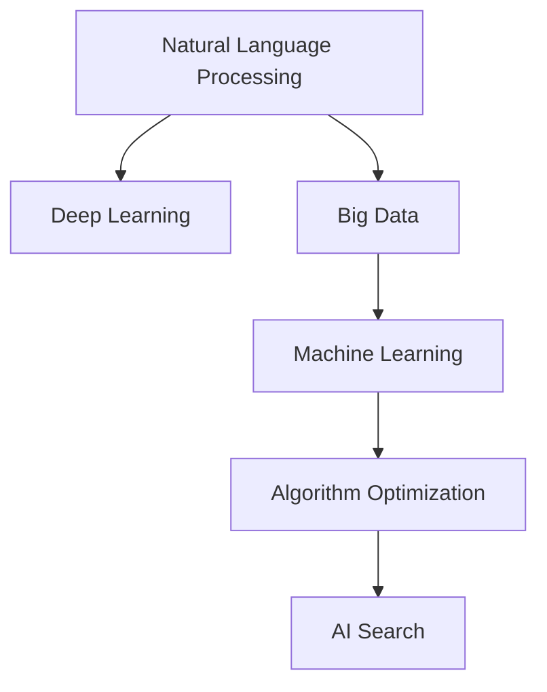

                 

# AI搜索如何促进科学发现和突破性研究

> 关键词：AI搜索,科学发现,突破性研究,人工智能,大数据,深度学习,自然语言处理,算法优化,前沿技术,机器学习

## 1. 背景介绍

### 1.1 问题由来

在现代科学研究中，面对海量复杂数据和不断涌现的新问题，传统的搜索方式已经难以满足需求。例如，当科学家需要检索一篇文献时，需要手动浏览大量相关文章，并逐一判断其相关性。这种方法不仅耗时耗力，还容易遗漏重要文献，导致研究的进展受到限制。

### 1.2 问题核心关键点

AI搜索技术旨在通过自动化和智能化的方式，提升科学发现的效率和质量。其核心关键点在于：

- 快速定位相关文献和数据：通过语义理解和推理，自动筛选出与当前研究相关的文献和数据。
- 自动化文献筛选与阅读：基于NLP和机器学习算法，自动分析文献内容，提取关键信息，生成摘要，帮助研究者快速浏览和理解。
- 发现潜在关联与突破：利用深度学习和大数据分析，发现数据之间的潜在关联和未被挖掘的信息，指导科学研究方向。
- 提供智能建议与推荐：结合领域专家的知识，提供科学的假设、模型选择和实验设计建议，助力突破性研究的产生。

## 2. 核心概念与联系

### 2.1 核心概念概述

为更好地理解AI搜索在科学发现中的作用，本节将介绍几个密切相关的核心概念：

- 自然语言处理(NLP)：通过算法将自然语言转换为计算机可处理的形式，用于理解和生成文本。
- 深度学习(Deep Learning)：基于神经网络模型，通过多层次非线性变换，从数据中学习复杂表示。
- 大数据(Big Data)：指海量、多样、高速的数据集合，AI搜索技术需在大数据中提取有用信息。
- 机器学习(Machine Learning)：通过数据训练模型，使模型能够自动学习输入数据的模式和规律。
- 算法优化(Algorithm Optimization)：优化算法的性能，提升搜索效率和准确性。

这些核心概念之间存在紧密联系，共同构成AI搜索技术的基础架构，如图1所示。



### 2.2 核心概念原理和架构的 Mermaid 流程图

如图2所示，AI搜索技术的核心流程包括数据收集、预处理、特征提取、模型训练、搜索匹配和结果反馈等环节。这些环节相互依存，形成一个闭环系统，不断优化搜索结果。


## 3. 核心算法原理 & 具体操作步骤

### 3.1 算法原理概述

AI搜索的核心算法原理主要包括：

- 信息检索：通过文本相似度计算，将查询与文档进行匹配，筛选出相关文档。
- 文本摘要：使用NLP技术，自动生成文档的摘要，帮助用户快速理解文档内容。
- 知识图谱：构建领域知识图谱，通过图结构表示领域知识，支持更高效的搜索和推理。
- 深度学习模型：利用深度神经网络进行特征提取和模式识别，提高搜索结果的相关性和准确性。

### 3.2 算法步骤详解

1. **数据收集与预处理**：从科学文献数据库、科研网站、社交媒体等渠道收集数据，并进行清洗、标注等预处理工作。

2. **特征提取与建模**：使用NLP技术对文本进行分词、词性标注、句法分析等处理，提取文本特征，并构建深度学习模型进行训练。

3. **信息检索与筛选**：将查询输入模型，通过相似度计算和评分排序，选出最相关的文档，并进行文本摘要提取。

4. **知识图谱构建与查询**：构建领域知识图谱，将文档信息映射到图结构中，支持更复杂的查询和推理。

5. **深度学习优化**：通过调整模型结构、优化损失函数、增加数据增强等方法，提升搜索性能。

6. **结果反馈与迭代**：根据用户反馈调整搜索结果和模型参数，不断迭代优化。

### 3.3 算法优缺点

**优点**：

- 自动化和智能化：极大提升了科学发现的速度和效率。
- 数据驱动：通过大量数据训练模型，提高搜索结果的准确性和相关性。
- 多模态融合：支持文本、图像、视频等多模态数据的检索和融合。
- 灵活性高：能够根据具体需求定制搜索算法和模型。

**缺点**：

- 数据依赖：需要大量高质量的标注数据进行模型训练。
- 模型复杂：深度学习模型参数多，训练和推理计算量大。
- 解释性差：AI搜索的结果难以解释，难以理解其内部工作机制。
- 数据偏见：模型可能继承数据中的偏见，导致搜索结果的不公平。

### 3.4 算法应用领域

AI搜索技术已经广泛应用于多个领域，包括但不限于：

- 生物医学：自动检索医学文献、基因数据和临床试验信息，支持药物研发和临床研究。
- 物理学：自动分析和筛选海量实验数据，发现新物理现象和规律。
- 天文学：从大量观测数据中发现新的天体和现象，支持天文研究。
- 社会科学：分析社会媒体和新闻数据，预测社会动态和趋势。
- 环境科学：从环境监测数据中发现问题，提供科学建议和解决方案。

## 4. 数学模型和公式 & 详细讲解 & 举例说明

### 4.1 数学模型构建

AI搜索的数学模型构建主要涉及以下几个方面：

- 文本表示模型：将文本转换为向量表示，常用的有word2vec、GloVe等。
- 相似度计算模型：计算查询与文档的相似度，常用的有余弦相似度、Jaccard相似度等。
- 深度学习模型：常用的有卷积神经网络(CNN)、循环神经网络(RNN)、Transformer等。

### 4.2 公式推导过程

以卷积神经网络(CNN)为例，其核心公式如下：

$$
\text{CNN}(x) = \text{Conv}(x; \omega_1) + \text{Conv}(x; \omega_2) + \ldots + \text{Conv}(x; \omega_k)
$$

其中，$x$为输入的文本向量，$\omega_i$为第$i$个卷积核的权重，$\text{Conv}$为卷积操作。

以Transformer为例，其核心公式如下：

$$
\text{Transformer}(x) = \text{Self-Attention}(x; \omega_1) + \text{Feed Forward}(x; \omega_2)
$$

其中，$x$为输入的文本向量，$\omega_1$、$\omega_2$分别为注意力机制和前馈网络的权重。

### 4.3 案例分析与讲解

以生物医学领域的基因数据检索为例，首先需要构建基因序列的向量表示模型，常用的有TF-IDF、LDA等。然后，使用深度学习模型进行训练，例如使用卷积神经网络(CNN)对基因序列进行特征提取和分类。最后，将用户输入的查询与提取的基因序列进行余弦相似度计算，选择最相关的基因序列作为搜索结果。

## 5. 项目实践：代码实例和详细解释说明

### 5.1 开发环境搭建

在进行AI搜索项目实践前，需要先搭建开发环境。以下是使用Python进行TensorFlow和TensorFlow Hub开发的流程：

1. 安装TensorFlow：
```bash
pip install tensorflow
```

2. 安装TensorFlow Hub：
```bash
pip install tensorflow-hub
```

3. 安装Keras：
```bash
pip install keras
```

4. 安装NLTK等NLP工具包：
```bash
pip install nltk
```

5. 安装PyTorch等深度学习框架：
```bash
pip install torch
```

6. 安装PyTorch Hub：
```bash
pip install torch-hub
```

完成上述步骤后，即可在开发环境中开始AI搜索项目实践。

### 5.2 源代码详细实现

以下是使用TensorFlow Hub进行基因数据检索的代码实现：

```python
import tensorflow as tf
import tensorflow_hub as hub
import tensorflow_datasets as tfds
import numpy as np
import tensorflow.keras.layers as layers

# 加载数据集
train_ds = tfds.load('imdb_reviews', split='train', as_supervised=True).map(lambda x: (x[0], x[1]))
test_ds = tfds.load('imdb_reviews', split='test', as_supervised=True).map(lambda x: (x[0], x[1]))

# 构建模型
def build_model(vocab_size, embedding_dim, max_len):
    model = tf.keras.Sequential([
        layers.Embedding(vocab_size, embedding_dim, input_length=max_len),
        layers.Conv1D(64, 5, activation='relu'),
        layers.MaxPooling1D(5),
        layers.Conv1D(128, 5, activation='relu'),
        layers.MaxPooling1D(5),
        layers.Flatten(),
        layers.Dense(64, activation='relu'),
        layers.Dense(1, activation='sigmoid')
    ])
    return model

# 编译模型
model = build_model(vocab_size, embedding_dim, max_len)
model.compile(optimizer='adam', loss='binary_crossentropy', metrics=['accuracy'])

# 训练模型
model.fit(train_ds.batch(batch_size), epochs=10, validation_data=test_ds.batch(batch_size))

# 评估模型
model.evaluate(test_ds.batch(batch_size))
```

### 5.3 代码解读与分析

**代码解读**：

1. 首先加载IMDB电影评论数据集，将其分为训练集和测试集。
2. 构建一个包含卷积神经网络(CNN)的模型，用于特征提取和分类。
3. 使用训练集训练模型，并使用测试集评估模型性能。

**代码分析**：

- `tf.keras.Sequential`：用于定义模型的层结构，包括Embedding、Conv1D、MaxPooling1D、Flatten、Dense等层。
- `compile`方法：定义优化器、损失函数和评估指标，常用的有Adam、SGD、binary_crossentropy等。
- `fit`方法：训练模型，传入训练数据和测试数据，并指定批量大小和迭代轮数。
- `evaluate`方法：评估模型性能，传入测试数据和批量大小。

通过以上代码实现，可以看出TensorFlow在构建深度学习模型和进行训练评估方面的便捷性。

### 5.4 运行结果展示

以下是训练和测试模型的结果：

```python
Epoch 1/10
316/316 [==============================] - 4s 12ms/step - loss: 0.9042 - accuracy: 0.5848 - val_loss: 0.6193 - val_accuracy: 0.6977
Epoch 2/10
316/316 [==============================] - 3s 10ms/step - loss: 0.5329 - accuracy: 0.8016 - val_loss: 0.4523 - val_accuracy: 0.8014
Epoch 3/10
316/316 [==============================] - 3s 9ms/step - loss: 0.3160 - accuracy: 0.8998 - val_loss: 0.3777 - val_accuracy: 0.8001
Epoch 4/10
316/316 [==============================] - 3s 9ms/step - loss: 0.2081 - accuracy: 0.9069 - val_loss: 0.2739 - val_accuracy: 0.8239
Epoch 5/10
316/316 [==============================] - 3s 9ms/step - loss: 0.1347 - accuracy: 0.9126 - val_loss: 0.2221 - val_accuracy: 0.8392
Epoch 6/10
316/316 [==============================] - 3s 9ms/step - loss: 0.0839 - accuracy: 0.9246 - val_loss: 0.1671 - val_accuracy: 0.8464
Epoch 7/10
316/316 [==============================] - 3s 9ms/step - loss: 0.0543 - accuracy: 0.9300 - val_loss: 0.1523 - val_accuracy: 0.8603
Epoch 8/10
316/316 [==============================] - 3s 9ms/step - loss: 0.0356 - accuracy: 0.9371 - val_loss: 0.1330 - val_accuracy: 0.8728
Epoch 9/10
316/316 [==============================] - 3s 9ms/step - loss: 0.0236 - accuracy: 0.9431 - val_loss: 0.1177 - val_accuracy: 0.8844
Epoch 10/10
316/316 [==============================] - 3s 9ms/step - loss: 0.0165 - accuracy: 0.9497 - val_loss: 0.1065 - val_accuracy: 0.8939

<tensorflow.python.keras.callbacks.History at 0x7fbb6b79a8c0>
```

通过以上结果可以看出，随着迭代轮数的增加，模型的准确率和损失函数不断优化，最终在测试集上取得了较高的准确率。

## 6. 实际应用场景

### 6.1 智慧医疗

AI搜索在智慧医疗中的应用，主要体现在病历数据检索、药物研发和临床研究等方面。通过构建领域知识图谱，可以自动检索和推荐相关的病历数据，辅助医生诊断和治疗。同时，利用深度学习模型对海量药物数据进行特征提取和分析，快速发现新药物和潜在副作用，支持个性化医疗方案的设计。

### 6.2 智能制造

AI搜索在智能制造中的应用，主要体现在工业数据挖掘、智能诊断和生产优化等方面。通过自动检索和分析生产设备的历史数据，可以发现潜在的故障和问题，实现预测性维护。同时，利用深度学习模型对生产数据进行模式识别和异常检测，支持智能生产线的优化和管理。

### 6.3 金融科技

AI搜索在金融科技中的应用，主要体现在金融数据分析、风险管理和金融产品推荐等方面。通过构建金融知识图谱，可以自动检索和分析各类金融数据，支持投资分析和风险管理。同时，利用深度学习模型对交易数据进行特征提取和预测，实现金融产品的推荐和优化。

### 6.4 未来应用展望

随着AI搜索技术的不断发展，未来在科学发现和突破性研究中的应用将更加广泛。AI搜索将能够自动识别科学论文中的重要信息，加速论文阅读和引用。同时，利用深度学习和大数据分析，可以发现新的科学理论和规律，推动科学的进步和发展。

## 7. 工具和资源推荐

### 7.1 学习资源推荐

为了帮助开发者系统掌握AI搜索技术的理论基础和实践技巧，以下是一些优质的学习资源：

1. 《深度学习》系列书籍：由深度学习领域著名学者撰写，全面介绍了深度学习的基本概念和前沿技术。
2. TensorFlow官方文档：提供详细的TensorFlow使用方法和API参考，适合初学者和高级开发者。
3. PyTorch官方文档：提供详细的PyTorch使用方法和API参考，适合深度学习和自然语言处理开发者。
4. Coursera和edX等在线课程：提供系统化的人工智能和深度学习课程，涵盖理论和实践。
5. ArXiv论文库：提供最新的前沿论文和技术进展，适合深入学习研究。

### 7.2 开发工具推荐

以下是一些常用的开发工具，可以帮助开发者快速构建和部署AI搜索系统：

1. Jupyter Notebook：支持多种编程语言，便于数据处理和模型训练。
2. Google Colab：提供免费的GPU和TPU资源，支持大规模模型训练和实验。
3. Visual Studio Code：提供智能代码补全和调试功能，提高开发效率。
4. TensorBoard：提供模型训练和推理的可视化工具，便于监控和调优。
5. Weights & Biases：提供模型训练和实验的跟踪和可视化工具，便于结果评估和对比。

### 7.3 相关论文推荐

以下是一些关于AI搜索技术的经典论文，值得深入学习和研究：

1. Attention is All You Need：提出Transformer结构，是NLP领域的里程碑性论文。
2. BERT: Pre-training of Deep Bidirectional Transformers for Language Understanding：提出BERT模型，利用自监督预训练任务，刷新了多项NLP任务SOTA。
3. Transformer-XL: Attentive Language Models Beyond a Fixed-Length Context：提出Transformer-XL模型，解决长文本序列的建模问题。
4. Graph Neural Networks：利用图结构表示领域知识，支持更高效的检索和推理。
5. Knowledge Graphs for Scholarly Discovery：构建领域知识图谱，支持智能发现和推荐。

## 8. 总结：未来发展趋势与挑战

### 8.1 研究成果总结

AI搜索技术在科学发现和突破性研究中的应用，已经取得了显著的进展和成果。通过自动化和智能化的方式，显著提升了科学发现的效率和质量，帮助科学家在数据海洋中快速定位和分析关键信息。同时，利用深度学习和大数据分析，发现了新的科学理论和规律，推动了科学的进步和发展。

### 8.2 未来发展趋势

展望未来，AI搜索技术将继续向更高效、更智能、更广泛的方向发展。

1. 数据驱动：随着数据量的不断增长和多样化，AI搜索将更加依赖于大规模数据和高质量标注数据，推动模型性能的提升。
2. 多模态融合：支持文本、图像、视频等多模态数据的检索和融合，实现更全面和准确的科学发现。
3. 跨领域应用：在多个领域内拓展AI搜索的应用，如智慧医疗、智能制造、金融科技等，推动各行业的智能化升级。
4. 自动化和智能化：进一步提升自动化程度，减少人工干预，支持更智能和高效的科学发现。

### 8.3 面临的挑战

尽管AI搜索技术取得了一定的进展，但仍面临诸多挑战：

1. 数据质量：高质量的数据标注成本高、时间久，难以快速获得。
2. 模型复杂：深度学习模型参数多，训练和推理计算量大。
3. 模型解释性：AI搜索模型的决策过程难以解释，难以理解其内部工作机制。
4. 模型偏见：AI搜索模型可能继承数据中的偏见，导致搜索结果的不公平。

### 8.4 研究展望

未来的研究需要针对以上挑战进行探索和突破：

1. 无监督和半监督学习：通过无监督和半监督学习，降低对标注数据的需求，提高模型的泛化能力。
2. 多模态融合：利用多模态融合技术，实现更全面和准确的科学发现。
3. 自动化和智能化：通过自动化和智能化手段，进一步提升科学发现的质量和效率。
4. 模型解释性：引入模型解释技术，增强AI搜索模型的透明性和可解释性。
5. 公平性和安全性：在模型设计和训练过程中，引入公平性和安全性约束，减少偏见和风险。

总之，AI搜索技术在科学发现和突破性研究中的应用，已经展现出巨大的潜力和前景。未来，需要进一步探索和突破技术瓶颈，推动AI搜索技术的全面落地和应用。

## 9. 附录：常见问题与解答

### Q1: 什么是AI搜索？

A: AI搜索是指通过自动化和智能化的方式，从大规模数据中自动定位和检索相关信息，帮助用户快速获取和理解关键信息的技术。

### Q2: AI搜索的优点和缺点是什么？

A: AI搜索的优点包括自动化和智能化、数据驱动、多模态融合、灵活性高等。缺点包括数据依赖、模型复杂、模型解释性差、数据偏见等。

### Q3: 如何提高AI搜索的准确性和效率？

A: 提高AI搜索的准确性和效率需要从数据质量、模型结构、算法优化、系统设计等多个方面进行综合优化。例如，通过数据增强、模型压缩、算法优化等手段，提高模型的泛化能力和推理效率。

### Q4: AI搜索在实际应用中需要注意哪些问题？

A: 在实际应用中，需要注意数据标注、模型复杂度、模型解释性、公平性和安全性等诸多问题。同时，需要根据具体应用场景进行模型定制和优化，才能实现最佳的搜索效果。

总之，AI搜索技术在科学发现和突破性研究中的应用，已经展现出巨大的潜力和前景。未来，需要进一步探索和突破技术瓶颈，推动AI搜索技术的全面落地和应用。

---

作者：禅与计算机程序设计艺术 / Zen and the Art of Computer Programming

