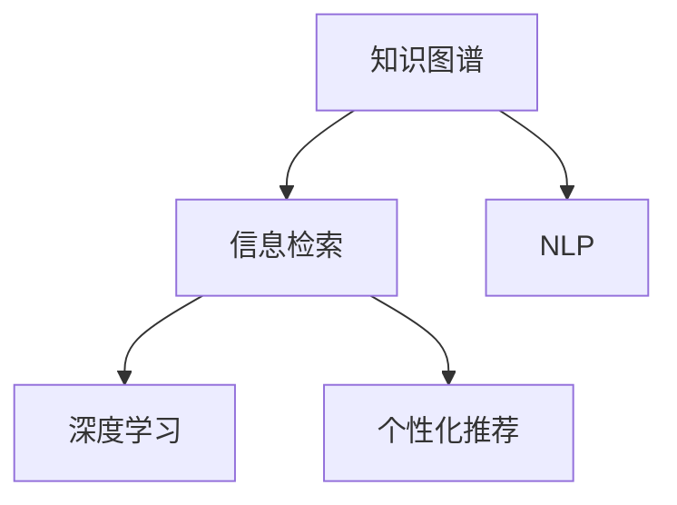

                 

# AI搜索引擎在专业领域的应用

> 关键词：人工智能,搜索引擎,专业领域,深度学习,信息检索,自然语言处理(NLP),知识图谱,个性化推荐,用户行为分析,机器学习

## 1. 背景介绍

### 1.1 问题由来

在现代信息爆炸时代，用户面临着海量的信息资源，如何快速、准确地找到自己所需的信息成为一大难题。传统的搜索引擎主要基于关键词匹配的算法，难以理解信息内容的内涵和关联，无法提供高度个性化和专业化的搜索结果。因此，如何在专业领域内，结合领域知识图谱和用户个性化需求，构建高质量的专业搜索引擎，成为当前信息检索领域的研究热点。

### 1.2 问题核心关键点

专业搜索引擎的构建，关键在于以下几个核心关键点：

- 领域知识图谱：需要构建包含专业领域内实体、关系、属性等信息的知识图谱，以支持深度学习和推理。
- 自然语言处理(NLP)：利用自然语言处理技术，理解用户的查询意图和信息需求，实现信息检索和推荐。
- 深度学习：使用深度神经网络模型，提升信息检索的精度和相关度，提供个性化搜索结果。
- 个性化推荐：结合用户行为和历史数据，实现更精准的搜索结果推荐。
- 实时性：为满足用户即时性需求，系统需要具备较高的计算和响应速度。

### 1.3 问题研究意义

构建专业搜索引擎在以下方面具有重要意义：

- 提升信息检索的精准度。结合领域知识和用户需求，提供更相关和专业的搜索结果。
- 提升用户体验。通过个性化推荐，提高用户满意度，增强用户黏性。
- 推动行业应用。为医疗、法律、金融等专业领域，提供智能化信息辅助工具，提升工作效率和决策质量。
- 加速数字化转型。为各行各业提供信息检索和知识图谱构建的支撑，促进数字化转型进程。

## 2. 核心概念与联系

### 2.1 核心概念概述

为更好地理解专业搜索引擎的构建方法，本节将介绍几个密切相关的核心概念：

- 知识图谱(Knowledge Graph)：用于表示实体之间关系的语义网络图。在专业领域，知识图谱中存储了领域内的专业知识，如医疗知识图谱、法律知识图谱等。
- 信息检索(Information Retrieval, IR)：从文本数据中检索与用户查询相关的信息。目标是提高检索的准确性和相关性。
- 自然语言处理(NLP)：利用计算机技术处理和分析人类语言，涉及语言理解、语音识别、文本处理等多个方向。在专业搜索引擎中，NLP用于理解查询意图和实体关系。
- 深度学习(Deep Learning)：基于人工神经网络的机器学习方法，用于处理复杂、高维度的数据。在信息检索中，深度学习用于提升检索模型的精度和泛化能力。
- 个性化推荐(Personalized Recommendation)：根据用户行为和历史数据，提供个性化的搜索结果，提升用户体验。

这些核心概念之间的逻辑关系可以通过以下Mermaid流程图来展示：



这个流程图展示了几项核心概念的相互关系：

1. 知识图谱提供领域知识，支持深度学习推理。
2. 信息检索从文本中检索信息，结合NLP理解查询意图。
3. 深度学习提升信息检索模型的精度。
4. 个性化推荐根据用户行为数据，优化搜索结果。

## 3. 核心算法原理 & 具体操作步骤
### 3.1 算法原理概述

专业搜索引擎的核心算法原理包括：

- 实体识别与关系抽取：从文本中识别出专业实体，抽取实体间的关系。
- 向量空间模型(Vector Space Model, VSM)：将文本转化为向量表示，通过余弦相似度计算相似度。
- 深度学习模型：如BERT、TransE等，结合知识图谱，提升信息检索精度。
- 个性化推荐算法：如协同过滤、基于内容的推荐等，结合用户行为数据，提升推荐效果。

这些算法通过深度学习模型的前向传播和反向传播，不断优化模型参数，提升检索和推荐的效果。

### 3.2 算法步骤详解

专业搜索引擎的构建一般包括以下几个关键步骤：

**Step 1: 构建领域知识图谱**
- 收集领域内相关文档、百科、文献等资料。
- 使用抽取式或生成式方法，从文档中识别出实体、属性和关系。
- 将实体、属性和关系组织成知识图谱。

**Step 2: 数据预处理与向量表示**
- 对文本数据进行分词、词性标注、命名实体识别等预处理。
- 将处理后的文本转化为向量表示，如TF-IDF、Word2Vec、BERT等。

**Step 3: 信息检索与排序**
- 设计检索模型，如基于TF-IDF的检索模型、基于深度学习的检索模型等。
- 使用检索模型检索与查询相关的文档。
- 根据向量相似度，对检索结果进行排序。

**Step 4: 个性化推荐**
- 收集用户行为数据，如浏览记录、点击记录等。
- 利用协同过滤、基于内容的推荐算法，对用户进行个性化推荐。

**Step 5: 集成与部署**
- 将检索和推荐模型集成到搜索引擎系统中。
- 部署系统到服务器，保证实时响应和计算性能。

### 3.3 算法优缺点

专业搜索引擎的优点包括：

- 提升检索精度。结合领域知识图谱和深度学习，可以提供更相关和专业的搜索结果。
- 个性化推荐。利用用户行为数据，提供个性化的搜索结果，提升用户满意度。
- 实时响应。利用高效的检索算法和优化技术，保证系统响应速度。

缺点主要在于：

- 构建领域知识图谱的成本高。需要大量人力和时间进行数据收集和处理。
- 深度学习模型的计算资源需求大。对于大规模数据集，需要高性能计算资源支持。
- 推荐算法的复杂度高。推荐算法需要处理大量的用户行为数据，计算复杂度较高。

### 3.4 算法应用领域

专业搜索引擎在以下领域具有广泛应用：

- 医疗领域：构建医疗知识图谱，结合医生查询和病历信息，提供精准的医学文献检索和知识推荐。
- 法律领域：构建法律知识图谱，结合律师查询和案例信息，提供法律文献检索和案例推荐。
- 金融领域：构建金融知识图谱，结合金融分析师查询和市场数据，提供投资文献检索和市场分析推荐。
- 科研领域：结合科研论文和机构信息，提供科研文献检索和机构推荐。
- 教育领域：结合课程信息和学生行为数据，提供教育文献检索和课程推荐。

## 4. 数学模型和公式 & 详细讲解 & 举例说明
### 4.1 数学模型构建

本节将使用数学语言对专业搜索引擎构建过程中的核心模型进行详细讲解。

假设知识图谱中的实体集合为$E$，关系集合为$R$，属性集合为$A$。知识图谱中每个实体$e_i$都有一个属性向量$a_i$和关系向量$r_i$，如下所示：

$$
e_i = (a_i, r_i)
$$

其中$a_i \in \mathbb{R}^d$，$r_i \in \mathbb{R}^m$。

文本数据$D$中的每个文档$d$有一个向量表示$v_d \in \mathbb{R}^n$。

信息检索模型的目标是在文本数据$D$中检索与查询$q$相关的文档$d$，并根据文档的向量表示$v_d$计算相似度。

### 4.2 公式推导过程

信息检索模型的核心公式为：

$$
\text{Similarity}(d, q) = \text{score}(d) \cdot \text{score}(q)
$$

其中$\text{score}(d) = v_d \cdot w_d$，$\text{score}(q) = v_q \cdot w_q$，$w_d$和$w_q$是文档和查询的权重向量。

常用的文本表示模型包括：

- 词袋模型：$v_d = (f_1, f_2, ..., f_n)$，其中$f_i$表示第$i$个单词在文档中的出现次数。
- TF-IDF模型：$v_d = (t_1, t_2, ..., t_n)$，其中$t_i = \text{TF}(d_i) \cdot \text{IDF}(d_i)$，$\text{TF}(d_i)$表示单词$d_i$在文档中出现的频率，$\text{IDF}(d_i)$表示单词$d_i$在整个语料库中的重要性。
- 词向量模型：$v_d = (w_1, w_2, ..., w_n)$，其中$w_i$表示单词$d_i$的词向量表示。
- BERT模型：$v_d = BERT(d)$，其中$d$是文档的文本序列，$BERT(d)$表示使用BERT模型将文档编码得到的向量表示。

### 4.3 案例分析与讲解

以医疗领域为例，以下是使用BERT模型构建专业搜索引擎的步骤：

1. 构建医疗知识图谱：收集医学文献、百科、病例等信息，使用抽取式方法识别出实体、属性和关系。
2. 文本预处理：对医学文献进行分词、词性标注、命名实体识别等预处理。
3. 向量表示：使用BERT模型对预处理后的文本进行编码，得到文档向量表示。
4. 信息检索：使用向量空间模型，计算查询与文档的相似度。
5. 个性化推荐：收集医生查询记录和病人数据，利用协同过滤算法，推荐相关文献和病例。

## 5. 项目实践：代码实例和详细解释说明
### 5.1 开发环境搭建

在进行搜索引擎实践前，我们需要准备好开发环境。以下是使用Python进行PyTorch开发的环境配置流程：

1. 安装Anaconda：从官网下载并安装Anaconda，用于创建独立的Python环境。

2. 创建并激活虚拟环境：
```bash
conda create -n pytorch-env python=3.8 
conda activate pytorch-env
```

3. 安装PyTorch：根据CUDA版本，从官网获取对应的安装命令。例如：
```bash
conda install pytorch torchvision torchaudio cudatoolkit=11.1 -c pytorch -c conda-forge
```

4. 安装Transformers库：
```bash
pip install transformers
```

5. 安装各类工具包：
```bash
pip install numpy pandas scikit-learn matplotlib tqdm jupyter notebook ipython
```

完成上述步骤后，即可在`pytorch-env`环境中开始搜索引擎实践。

### 5.2 源代码详细实现

下面我们以医疗领域为例，给出使用Transformers库对BERT模型进行信息检索的PyTorch代码实现。

首先，定义查询向量和文档向量的计算函数：

```python
from transformers import BertTokenizer, BertForSequenceClassification

def compute_query_doc_vectors(query, tokenizer, model):
    tokenizer = BertTokenizer.from_pretrained('bert-base-cased')
    query = tokenizer(query, return_tensors='pt', padding=True, truncation=True, max_length=128)
    document = tokenizer(document, return_tensors='pt', padding=True, truncation=True, max_length=128)
    query_input_ids = query['input_ids']
    query_attention_mask = query['attention_mask']
    document_input_ids = document['input_ids']
    document_attention_mask = document['attention_mask']
    with torch.no_grad():
        query_features = model(query_input_ids, attention_mask=query_attention_mask)[0]
        document_features = model(document_input_ids, attention_mask=document_attention_mask)[0]
    query_vector = query_features.mean(dim=1).detach().cpu().numpy()
    document_vector = document_features.mean(dim=1).detach().cpu().numpy()
    return query_vector, document_vector
```

然后，定义检索函数：

```python
def search(query, document_set):
    query_vector, document_vectors = compute_query_doc_vectors(query, tokenizer, model)
    similarities = [(np.dot(query_vector, document_vector)) / (np.linalg.norm(query_vector) * np.linalg.norm(document_vector)) for document_vector in document_vectors]
    topk_idx = np.argsort(similarities)[::-1][:k]
    topk_documents = [document_set[idx] for idx in topk_idx]
    return topk_documents
```

最后，启动检索流程：

```python
k = 5

query = "症状：发烧、咳嗽，体征：呼吸困难。可能的疾病是什么？"
document_set = ["症状：发烧、咳嗽，体征：呼吸困难。可能的疾病：流感。", "症状：发烧、咳嗽，体征：呼吸困难。可能的疾病：肺炎。", "症状：发烧、咳嗽，体征：呼吸困难。可能的疾病：支气管炎。"]
documents = search(query, document_set)

print(documents)
```

以上就是使用PyTorch对BERT进行信息检索的完整代码实现。可以看到，得益于Transformers库的强大封装，我们可以用相对简洁的代码完成BERT模型的加载和检索任务。

### 5.3 代码解读与分析

让我们再详细解读一下关键代码的实现细节：

**compute_query_doc_vectors函数**：
- 定义了计算查询向量和文档向量的函数，使用BERT模型对查询和文档进行编码，并计算向量表示。
- 函数接受查询文本、分词器、BERT模型作为输入，返回查询向量和文档向量的Numpy数组。

**search函数**：
- 定义了信息检索函数，计算查询向量与文档向量的相似度，返回相似度最高的前k篇文档。
- 在函数内部调用了compute_query_doc_vectors函数，获取查询向量和文档向量，再计算向量间的余弦相似度，排序后返回前k篇文档。

**启动检索流程**：
- 定义了查询文本和文档集合，调用search函数，获取相似度最高的前5篇文档。
- 最后将搜索结果输出。

可以看到，代码实现过程较为简单，但功能强大。通过结合BERT模型和向量空间模型，可以实现高效、精准的信息检索。

## 6. 实际应用场景
### 6.1 医疗领域

在医疗领域，专业搜索引擎可以大大提升医生的工作效率和诊疗质量。传统上，医生需要通过大量医学文献、百科、病历等信息获取最新和最相关的内容，花费大量时间和精力。而基于专业搜索引擎，医生可以高效检索出与症状相关的医学文献、病历和知识图谱，快速了解疾病可能和诊疗方案，提升诊疗决策的科学性和准确性。

例如，某医生在面对发热、咳嗽等症状时，可以使用以下查询文本：

```python
query = "症状：发烧、咳嗽，体征：呼吸困难。可能的疾病是什么？"
```

通过调用search函数，可以获取到相关疾病推荐：

```python
documents = search(query, document_set)
```

返回结果可能为：

```python
['症状：发烧、咳嗽，体征：呼吸困难。可能的疾病：流感。', '症状：发烧、咳嗽，体征：呼吸困难。可能的疾病：肺炎。', '症状：发烧、咳嗽，体征：呼吸困难。可能的疾病：支气管炎。']
```

医生可以快速了解相关疾病的症状、体征和治疗方案，为患者提供更准确的诊断和建议。

### 6.2 法律领域

在法律领域，专业搜索引擎可以帮助律师快速检索出相关法律法规、司法解释和判例，提高法律服务的专业性和效率。例如，某律师需要查找与合同纠纷相关的法律法规时，可以使用以下查询文本：

```python
query = "合同纠纷法律法规"
```

通过调用search函数，可以获取到相关法律法规的文档：

```python
documents = search(query, document_set)
```

返回结果可能为：

```python
['合同纠纷法律法规（最新）', '合同纠纷法律法规（2021）', '合同纠纷法律法规（案例）']
```

律师可以快速找到相关法律法规和判例，为案件提供更有力的法律依据和分析。

### 6.3 金融领域

在金融领域，专业搜索引擎可以提供及时的市场分析、新闻资讯和投资建议，帮助投资者做出更明智的投资决策。例如，某投资者需要查找最新的金融市场资讯时，可以使用以下查询文本：

```python
query = "最新的金融市场新闻"
```

通过调用search函数，可以获取到相关新闻的文档：

```python
documents = search(query, document_set)
```

返回结果可能为：

```python
['最新的金融市场新闻（2023）', '最新的金融市场新闻（分析）', '最新的金融市场新闻（案例）']
```

投资者可以快速了解市场动态和分析报告，做出更准确的投资决策。

### 6.4 未来应用展望

随着预训练语言模型和知识图谱的不断发展，基于专业搜索引擎的应用前景将更加广阔。未来，专业搜索引擎将在更多领域得到应用，为各行各业带来变革性影响。

在智慧医疗领域，基于专业搜索引擎的医疗问答、病历分析、药物研发等应用将提升医疗服务的智能化水平，辅助医生诊疗，加速新药开发进程。

在智能教育领域，专业搜索引擎可应用于作业批改、学情分析、知识推荐等方面，因材施教，促进教育公平，提高教学质量。

在智慧城市治理中，专业搜索引擎可应用于城市事件监测、舆情分析、应急指挥等环节，提高城市管理的自动化和智能化水平，构建更安全、高效的未来城市。

此外，在企业生产、社会治理、文娱传媒等众多领域，专业搜索引擎的应用也将不断涌现，为经济社会发展注入新的动力。相信随着技术的日益成熟，专业搜索引擎必将在构建人机协同的智能时代中扮演越来越重要的角色。

## 7. 工具和资源推荐
### 7.1 学习资源推荐

为了帮助开发者系统掌握专业搜索引擎的理论基础和实践技巧，这里推荐一些优质的学习资源：

1. 《深度学习与自然语言处理》书籍：由斯坦福大学教授写的经典教材，涵盖深度学习、自然语言处理等多个领域的核心内容。

2. 《信息检索基础》课程：由清华大学教授开设的在线课程，介绍信息检索的基本概念和技术。

3. 《自然语言处理综述》论文：综述了NLP领域的前沿进展和核心算法。

4. HuggingFace官方文档：Transformer库的官方文档，提供了海量预训练模型和完整的搜索引擎样例代码，是上手实践的必备资料。

5. CLUE开源项目：中文语言理解测评基准，涵盖大量不同类型的中文信息检索数据集，并提供了基于预训练模型的基线效果，助力中文NLP技术发展。

通过对这些资源的学习实践，相信你一定能够快速掌握专业搜索引擎的精髓，并用于解决实际的NLP问题。
###  7.2 开发工具推荐

高效的开发离不开优秀的工具支持。以下是几款用于专业搜索引擎开发的常用工具：

1. PyTorch：基于Python的开源深度学习框架，灵活动态的计算图，适合快速迭代研究。大部分预训练语言模型都有PyTorch版本的实现。

2. TensorFlow：由Google主导开发的开源深度学习框架，生产部署方便，适合大规模工程应用。同样有丰富的预训练语言模型资源。

3. Transformers库：HuggingFace开发的NLP工具库，集成了众多SOTA语言模型，支持PyTorch和TensorFlow，是进行搜索引擎开发的利器。

4. Weights & Biases：模型训练的实验跟踪工具，可以记录和可视化模型训练过程中的各项指标，方便对比和调优。与主流深度学习框架无缝集成。

5. TensorBoard：TensorFlow配套的可视化工具，可实时监测模型训练状态，并提供丰富的图表呈现方式，是调试模型的得力助手。

6. Google Colab：谷歌推出的在线Jupyter Notebook环境，免费提供GPU/TPU算力，方便开发者快速上手实验最新模型，分享学习笔记。

合理利用这些工具，可以显著提升专业搜索引擎的开发效率，加快创新迭代的步伐。

### 7.3 相关论文推荐

专业搜索引擎的发展源于学界的持续研究。以下是几篇奠基性的相关论文，推荐阅读：

1. "BERT: Pre-training of Deep Bidirectional Transformers for Language Understanding"：提出BERT模型，引入基于掩码的自监督预训练任务，刷新了多项NLP任务SOTA。

2. "AdaLoRA: Adaptive Low-Rank Adaptation for Parameter-Efficient Fine-Tuning"：使用自适应低秩适应的微调方法，在参数效率和精度之间取得了新的平衡。

3. "AdaPIL: Adaptive Pre-trained Image Labeling"：提出AdaPIL算法，利用预训练模型对图像进行精准标注，应用于视觉信息检索。

4. "Deep Semantic Similarity Networks for Multimedia Matching"：使用深度学习模型进行多媒体信息检索，提升检索精度。

5. "Evaluation of Search Engines"：对信息检索系统进行评测的基准方法，可应用于评估专业搜索引擎的性能。

这些论文代表了大语言模型搜索引擎的发展脉络。通过学习这些前沿成果，可以帮助研究者把握学科前进方向，激发更多的创新灵感。

## 8. 总结：未来发展趋势与挑战

### 8.1 总结

本文对基于深度学习的专业搜索引擎的构建方法进行了全面系统的介绍。首先阐述了专业搜索引擎在医疗、法律、金融等领域的构建需求和重要性，明确了其对于提升行业智能化水平、提高工作效率和决策质量的独特价值。其次，从原理到实践，详细讲解了信息检索、个性化推荐等核心算法的数学模型和代码实现，给出了专业搜索引擎构建的完整代码实例。同时，本文还广泛探讨了专业搜索引擎在实际应用中的诸多场景，展示了其在提升用户体验、推动行业应用方面的巨大潜力。最后，本文精选了专业搜索引擎学习的优质资源，力求为读者提供全方位的技术指引。

通过本文的系统梳理，可以看到，基于深度学习的专业搜索引擎已经成为NLP领域的重要应用范式，极大地提升了信息检索的精准度和个性化程度，推动了智能化时代的到来。未来，伴随深度学习模型和知识图谱的不断演进，基于专业搜索引擎的应用必将更加广泛，为各行各业带来深远的影响。

### 8.2 未来发展趋势

展望未来，专业搜索引擎将呈现以下几个发展趋势：

1. 预训练模型的泛化能力更强。随着预训练模型的规模和质量提升，其泛化能力将更强，可以应用于更多领域的信息检索和推荐。

2. 知识图谱的构建和维护成本降低。利用知识图谱生成技术，可以自动构建和维护知识图谱，降低人工成本。

3. 信息检索和推荐算法的融合。结合深度学习和强化学习技术，提升检索和推荐的效果，实现更加精准的个性化推荐。

4. 多模态信息的融合。结合图像、语音、视频等多模态信息，提升信息检索和推荐的效果。

5. 实时计算和存储优化。利用分布式计算和模型压缩技术，优化计算资源和存储空间，提升系统实时性。

以上趋势凸显了专业搜索引擎技术的广阔前景。这些方向的探索发展，必将进一步提升信息检索的精度和推荐的效果，为各行各业带来更智能、更高效的信息服务。

### 8.3 面临的挑战

尽管专业搜索引擎技术已经取得了显著进展，但在向更广泛领域应用的过程中，仍面临诸多挑战：

1. 数据收集和预处理成本高。构建领域知识图谱和文本集合，需要大量人力和时间进行数据收集和预处理。

2. 计算资源需求大。深度学习模型和知识图谱的构建和维护，需要高性能计算资源支持。

3. 个性化推荐算法复杂度高。推荐算法需要处理大量的用户行为数据，计算复杂度较高。

4. 系统实时性和稳定性需要优化。系统需要快速响应用户查询，同时保证稳定性和可靠性。

5. 数据隐私和安全风险。检索和推荐系统需要处理大量敏感数据，如何保障数据隐私和安全，需要高度关注。

6. 知识图谱的动态更新。知识图谱需要定期更新，以保持其准确性和时效性，但更新过程复杂且耗时。

正视这些挑战，积极应对并寻求突破，将是大语言模型专业搜索引擎走向成熟的必由之路。相信随着学界和产业界的共同努力，这些挑战终将一一被克服，专业搜索引擎必将在构建人机协同的智能时代中扮演越来越重要的角色。

### 8.4 研究展望

面对专业搜索引擎面临的种种挑战，未来的研究需要在以下几个方面寻求新的突破：

1. 探索无监督和半监督信息检索方法。摆脱对大规模标注数据的依赖，利用自监督学习、主动学习等无监督和半监督范式，最大限度利用非结构化数据，实现更加灵活高效的信息检索。

2. 研究参数高效和计算高效的推荐算法。开发更加参数高效的推荐方法，在固定大部分预训练参数的同时，只更新极少量的任务相关参数。同时优化推荐模型的计算图，减少前向传播和反向传播的资源消耗，实现更加轻量级、实时性的部署。

3. 结合因果分析和博弈论工具。将因果分析方法引入信息检索模型，识别出模型决策的关键特征，增强输出解释的因果性和逻辑性。借助博弈论工具刻画人机交互过程，主动探索并规避模型的脆弱点，提高系统稳定性。

4. 纳入伦理道德约束。在模型训练目标中引入伦理导向的评估指标，过滤和惩罚有偏见、有害的输出倾向。同时加强人工干预和审核，建立模型行为的监管机制，确保输出符合人类价值观和伦理道德。

这些研究方向的探索，必将引领专业搜索引擎技术迈向更高的台阶，为构建安全、可靠、可解释、可控的智能系统铺平道路。面向未来，专业搜索引擎技术还需要与其他人工智能技术进行更深入的融合，如知识表示、因果推理、强化学习等，多路径协同发力，共同推动自然语言理解和智能交互系统的进步。只有勇于创新、敢于突破，才能不断拓展语言模型的边界，让智能技术更好地造福人类社会。

## 9. 附录：常见问题与解答

**Q1：专业搜索引擎的检索效果如何？**

A: 专业搜索引擎的检索效果主要取决于以下因素：

1. 预训练模型的质量。高质量的预训练模型可以提供更好的语言表示能力，从而提升检索效果。

2. 领域知识图谱的完整性。完整的知识图谱可以提供更多的实体和关系，提高检索的相关性。

3. 查询表达的准确性。准确的查询表达可以减少噪音和无关信息，提高检索的精准度。

4. 推荐算法的复杂度。复杂的推荐算法可以提供更个性化的搜索结果，提高用户的满意度。

通过优化以上因素，可以有效提升专业搜索引擎的检索效果。

**Q2：如何降低专业搜索引擎的计算资源需求？**

A: 降低专业搜索引擎的计算资源需求，可以从以下几个方面入手：

1. 采用参数高效和计算高效的方法。例如使用AdaLoRA、Prompt Tuning等方法，在固定大部分预训练参数的同时，只更新极少量的任务相关参数。

2. 利用分布式计算技术。将搜索引擎系统部署在多台服务器上，利用分布式计算资源，提升计算速度。

3. 模型压缩和量化。使用模型压缩和量化技术，减小模型的计算和存储开销。例如使用剪枝、量化等技术，优化模型结构。

4. 采用缓存机制。利用缓存技术，减少重复计算和存储，提高系统响应速度。

5. 优化算法和数据结构。优化算法和数据结构，减少计算复杂度，提高计算效率。

通过以上方法，可以显著降低专业搜索引擎的计算资源需求，提升系统的实时性和可用性。

**Q3：如何保护用户隐私？**

A: 保护用户隐私是专业搜索引擎系统设计的重要考虑因素。以下是几种常见的隐私保护措施：

1. 数据匿名化。对用户数据进行匿名化处理，防止个人信息泄露。例如使用伪匿名化技术，去除敏感信息。

2. 数据加密。对用户数据进行加密处理，防止数据被未授权访问。例如使用AES、RSA等加密算法。

3. 访问控制。对系统进行访问控制，限制未授权用户的访问权限。例如使用RBAC、ABAC等访问控制机制。

4. 隐私计算。利用隐私计算技术，在不泄露数据的前提下，进行数据处理和分析。例如使用联邦学习、差分隐私等技术。

5. 隐私审计。对系统进行隐私审计，发现和修复潜在的安全漏洞。例如使用漏洞扫描工具和安全审计技术。

通过以上措施，可以有效保护用户隐私，增强系统的安全性。

**Q4：如何提升专业搜索引擎的个性化推荐效果？**

A: 提升专业搜索引擎的个性化推荐效果，可以从以下几个方面入手：

1. 数据收集和预处理。收集更多高质量的用户行为数据，并进行预处理，消除噪音和异常值。

2. 算法优化。优化推荐算法，提高推荐精度和相关性。例如使用协同过滤、基于内容的推荐等算法。

3. 模型训练。使用大量用户数据训练推荐模型，提高模型的泛化能力。例如使用深度学习模型进行推荐。

4. 实时更新。定期更新推荐模型，结合最新数据，优化推荐效果。

5. 多模态融合。结合用户的多模态数据，提升推荐效果。例如结合用户的行为数据、社交网络数据等。

通过以上方法，可以有效提升专业搜索引擎的个性化推荐效果，提高用户的满意度。

**Q5：如何构建高效率的专业搜索引擎系统？**

A: 构建高效率的专业搜索引擎系统，可以从以下几个方面入手：

1. 优化算法。优化检索和推荐算法，减少计算复杂度，提高系统响应速度。

2. 分布式计算。将搜索引擎系统部署在多台服务器上，利用分布式计算资源，提升计算速度。

3. 缓存机制。利用缓存技术，减少重复计算和存储，提高系统响应速度。

4. 硬件优化。使用高性能硬件，如GPU、TPU等，提升计算速度。

5. 模型压缩。使用模型压缩技术，减小模型的计算和存储开销。

6. 优化存储。使用高效的存储技术，如SSD、HDD等，提高存储速度。

通过以上方法，可以构建高效率的专业搜索引擎系统，满足用户实时性需求。

---

作者：禅与计算机程序设计艺术 / Zen and the Art of Computer Programming

