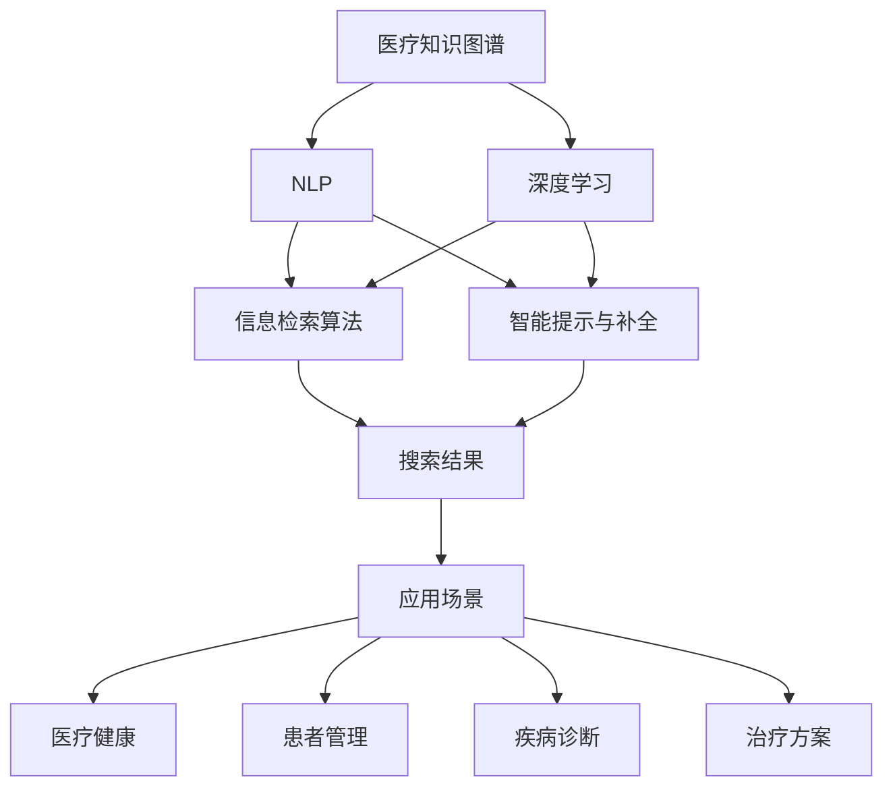

                 

# AI搜索引擎在医疗健康领域的应用

## 1. 背景介绍

人工智能(AI)技术在医疗健康领域的广泛应用，正在逐步改变传统医疗模式，提升医疗服务效率和质量。医疗AI的核心在于构建高效、精确的计算模型，辅助医生进行疾病诊断、治疗方案制定、患者管理等复杂任务。近年来，随着深度学习和大数据技术的迅猛发展，医疗AI在图像识别、自然语言处理(NLP)、预测建模等方面取得了显著进展。在众多医疗AI技术中，AI搜索引擎作为一个关键组件，以其高效、灵活、精准的特点，在疾病诊断、知识检索、辅助治疗等方面发挥着不可或缺的作用。

### 1.1 问题由来

传统的医疗信息检索方式依赖于医生手工查找文献、数据库或专家咨询，存在信息不全面、检索效率低下、知识更新不及时等问题。随着医疗数据量的指数级增长，人工检索方法已无法满足现代医学的需求。AI搜索引擎的引入，可以通过自动化、智能化技术，大幅提升信息检索的准确性和效率，让医生能快速获取所需的疾病资料、治疗方案、研究进展等信息，极大地提升医疗工作的智能化水平。

### 1.2 问题核心关键点

AI搜索引擎的核心在于构建一个高效、准确、灵活的信息检索系统，能够基于医生的查询请求，在海量医疗数据中快速、精准地检索出相关信息。主要的关键点包括：

- **信息检索算法**：如何快速、准确地从海量数据中检索出相关文档。
- **知识图谱构建**：如何将医疗知识进行结构化表示，便于检索系统理解和检索。
- **智能提示与补全**：如何通过智能算法，根据医生输入的关键词进行自动补全或推荐。
- **多模态融合**：如何将文本、图像、语音等多种模态数据进行融合，提升检索的全面性和准确性。

这些关键点共同构成了AI搜索引擎的基础，决定了其在医疗健康领域的应用效果。

## 2. 核心概念与联系

### 2.1 核心概念概述

为更好地理解AI搜索引擎在医疗健康领域的应用，本节将介绍几个核心概念：

- **医疗知识图谱**：一种结构化的知识表示方式，将医疗领域的各种知识（如疾病、药物、治疗方案等）进行有向图形式表示，便于机器理解和检索。
- **自然语言处理(NLP)**：涉及计算机对自然语言的理解、生成和分析，在医疗信息检索中用于解析医生的查询，以及生成相关文档的摘要。
- **深度学习**：一类基于多层神经网络的机器学习方法，在医疗AI中用于训练高精度的信息检索模型。
- **信息检索算法**：如倒排索引、向量空间模型、TF-IDF等，用于在大量文本数据中快速定位相关文档。
- **智能提示与补全**：通过自动补全、纠错等技术，提升医生输入查询的准确性，减少输入时间和错误率。
- **多模态融合**：将文本、图像、语音等多种数据源融合，提升医疗信息检索的全面性和准确性。

这些核心概念之间的逻辑关系可以通过以下Mermaid流程图来展示：



这个流程图展示了大语言模型在医疗健康领域的应用核心概念及其之间的关系：

1. 医疗知识图谱提供了结构化的医疗知识，为NLP和深度学习提供了数据支持。
2. 深度学习训练信息检索模型，结合NLP技术解析医生查询，生成相关文档摘要。
3. 信息检索算法用于在数据中快速定位相关文档。
4. 智能提示与补全提升查询输入的准确性。
5. 多模态融合提供全面的医疗信息。
6. 最终应用场景包括患者管理、疾病诊断、治疗方案等多个方面。

这些概念共同构成了AI搜索引擎在医疗健康领域的基本应用框架，使其能够高效、全面地服务于医生的临床工作。

## 3. 核心算法原理 & 具体操作步骤
### 3.1 算法原理概述

AI搜索引擎在医疗健康领域的应用，本质上是基于深度学习的智能信息检索系统。其核心思想是：通过深度学习模型训练，构建高效的信息检索算法，从海量医疗数据中快速、精准地检索出医生所需的相关信息。

形式化地，假设医生的查询请求为 $q$，医疗数据库中的文档集合为 $D=\{d_i\}_{i=1}^N$，其中 $d_i$ 为第 $i$ 个文档。设深度学习模型为 $M_{\theta}$，其中 $\theta$ 为模型参数。假设检索目标为 $t$，检索任务为：

$$
\arg\min_{d \in D} \| q - t \|
$$

其中 $\| \cdot \|$ 为某种距离度量函数。

检索过程中，模型首先对医生的查询 $q$ 进行解析，提取关键信息，然后对文档集合 $D$ 中的每个文档 $d_i$ 进行相似度计算，找到与查询 $q$ 最匹配的文档 $d_t$。

### 3.2 算法步骤详解

基于深度学习的AI搜索引擎在医疗健康领域的应用，通常包括以下几个关键步骤：

**Step 1: 数据预处理**
- 收集医疗领域的文本、图像、语音等多种数据，构建医疗知识图谱。
- 对医疗文本数据进行分词、去除停用词、词向量化等预处理。

**Step 2: 构建深度学习模型**
- 选择合适的深度学习模型架构，如卷积神经网络(CNN)、循环神经网络(RNN)、Transformer等。
- 使用大规模医疗数据进行模型训练，调整模型超参数，优化模型性能。

**Step 3: 训练信息检索模型**
- 将医生的查询 $q$ 输入模型，通过NLP技术进行解析，得到查询向量 $v_q$。
- 对文档集合 $D$ 中的每个文档 $d_i$，提取文本特征，得到文档向量 $v_{d_i}$。
- 使用余弦相似度等距离度量函数计算查询向量 $v_q$ 与文档向量 $v_{d_i}$ 的相似度 $s$，选择相似度最高的文档作为搜索结果。

**Step 4: 智能提示与补全**
- 对医生的输入查询进行拼写检查、自动补全等处理。
- 使用动态语言模型等技术，根据医生输入的关键词推荐相关查询。

**Step 5: 多模态融合**
- 对文本、图像、语音等多种模态数据进行融合，提升检索的全面性和准确性。
- 使用特征融合技术，如时序对齐、特征加权等方法，处理不同模态数据的差异性。

**Step 6: 应用场景集成**
- 将检索结果呈现给医生，供其选择或进一步查询。
- 集成到患者管理、疾病诊断、治疗方案等医疗应用系统中，辅助医生的决策。

### 3.3 算法优缺点

基于深度学习的AI搜索引擎在医疗健康领域的应用具有以下优点：

1. **高效性**：深度学习模型可以快速处理大量文本数据，显著提升信息检索的效率。
2. **精准性**：深度学习模型能够从语义层面对医疗文本进行解析，获得更准确的检索结果。
3. **灵活性**：深度学习模型可以根据不同的任务需求进行定制，适应各种医疗场景。
4. **可扩展性**：深度学习模型可以轻松集成到现有的医疗信息系统中，无缝扩展功能。

同时，该方法也存在一些局限性：

1. **数据依赖**：深度学习模型的性能很大程度上依赖于训练数据的规模和质量，医疗数据标注成本较高。
2. **泛化能力**：模型对新数据的泛化能力较弱，面对未知领域的数据可能效果不佳。
3. **模型复杂度**：深度学习模型参数量较大，计算资源和存储资源需求高。
4. **解释性不足**：深度学习模型通常被认为是"黑盒"系统，难以解释其内部工作机制。
5. **隐私与安全**：医疗数据涉及患者隐私，数据存储和传输过程中需要严格的安全防护措施。

尽管存在这些局限性，但就目前而言，基于深度学习的AI搜索引擎在医疗健康领域的应用仍然是大势所趋，具有巨大的应用潜力。

### 3.4 算法应用领域

基于深度学习的AI搜索引擎在医疗健康领域的应用非常广泛，涉及多个关键领域：

- **患者管理**：通过检索患者的历史病历、治疗记录等，帮助医生制定个性化的治疗方案。
- **疾病诊断**：检索与医生当前症状相关的疾病资料，辅助诊断疾病。
- **研究进展**：检索最新的医学研究论文和临床试验结果，为科研提供支持。
- **药物信息**：检索药物的药理作用、副作用、用法用量等，辅助医生选择合适的药物。
- **影像分析**：检索与医生当前影像检查相关的案例和文献，辅助医生进行影像诊断。
- **手术方案**：检索与医生当前手术需求相关的案例和文献，提供参考和支持。

除了上述这些经典应用外，AI搜索引擎还可以创新性地应用于病理学、遗传学、护理学等多个领域，为医疗健康事业带来全新的突破。

## 4. 数学模型和公式 & 详细讲解
### 4.1 数学模型构建

AI搜索引擎在医疗健康领域的应用，涉及到信息检索、文本解析、特征提取等多个数学模型。这里以向量空间模型(Vector Space Model, VSM)为例，对核心模型进行数学建模。

设查询向量 $v_q$ 和文档向量 $v_d$ 为高维空间中的向量，使用余弦相似度进行相似度计算：

$$
s(v_q, v_d) = \cos(\theta) = \frac{v_q \cdot v_d}{\|v_q\| \cdot \|v_d\|}
$$

其中 $\cdot$ 为向量点积，$\| \cdot \|$ 为向量的欧几里得范数。查询向量 $v_q$ 和文档向量 $v_d$ 可以通过NLP技术从医生的查询和文档文本中提取得到。

### 4.2 公式推导过程

以文本匹配为例，推导向量空间模型的核心公式。假设文档 $d$ 包含 $n$ 个单词，每个单词的TF-IDF值（Term Frequency-Inverse Document Frequency）为 $tf_{d,i}$ 和 $idf_{d,i}$。则文档向量 $v_d$ 可以表示为：

$$
v_d = \sum_{i=1}^n tf_{d,i} \cdot idf_{d,i} \cdot \vec{t_i}
$$

其中 $\vec{t_i}$ 为单词 $t_i$ 的单位向量，$n$ 为单词数。

对医生查询 $q$ 进行解析，提取关键单词 $q_k$，其TF-IDF值为 $tf_{q_k}$ 和 $idf_{q_k}$，查询向量 $v_q$ 可以表示为：

$$
v_q = \sum_{k=1}^m tf_{q_k} \cdot idf_{q_k} \cdot \vec{t_k}
$$

其中 $m$ 为查询中单词数。

通过余弦相似度计算查询 $q$ 和文档 $d$ 的相似度：

$$
s(q, d) = \frac{\sum_{k=1}^m \sum_{i=1}^n tf_{q_k} \cdot idf_{q_k} \cdot tf_{d,i} \cdot idf_{d,i} \cdot (\vec{t_k} \cdot \vec{t_i})}{\sqrt{\sum_{i=1}^m tf_{q_k}^2 \cdot idf_{q_k}^2} \cdot \sqrt{\sum_{i=1}^n tf_{d,i}^2 \cdot idf_{d,i}^2}}
$$

上述公式展示了基于向量空间模型的信息检索过程，通过计算查询和文档向量之间的余弦相似度，快速定位相关文档。

### 4.3 案例分析与讲解

以医学影像检索为例，展示AI搜索引擎在医疗健康领域的具体应用。

设医生的查询为 "乳腺癌"，医学影像数据库中包含大量包含乳腺癌病灶的影像数据。查询解析器将 "乳腺癌" 解析为 "breast cancer"，提取其TF-IDF向量 $v_q$。同时，对每张影像数据进行特征提取，生成影像特征向量 $v_i$。使用余弦相似度计算查询向量 $v_q$ 和影像特征向量 $v_i$ 的相似度，选择相似度最高的影像作为检索结果。

## 5. 项目实践：代码实例和详细解释说明
### 5.1 开发环境搭建

在进行AI搜索引擎实践前，我们需要准备好开发环境。以下是使用Python进行PyTorch开发的环境配置流程：

1. 安装Anaconda：从官网下载并安装Anaconda，用于创建独立的Python环境。

2. 创建并激活虚拟环境：
```bash
conda create -n search-env python=3.8 
conda activate search-env
```

3. 安装PyTorch：根据CUDA版本，从官网获取对应的安装命令。例如：
```bash
conda install pytorch torchvision torchaudio cudatoolkit=11.1 -c pytorch -c conda-forge
```

4. 安装相关库：
```bash
pip install pandas numpy scipy tqdm sklearn torchtext transformers
```

5. 安装TensorFlow：
```bash
pip install tensorflow
```

完成上述步骤后，即可在`search-env`环境中开始搜索引擎实践。

### 5.2 源代码详细实现

这里以基于Transformer的AI搜索引擎为例，展示其在医疗健康领域的具体实现。

首先，定义查询解析器和文档特征提取器：

```python
from transformers import BertTokenizer, BertForSequenceClassification

class QueryParser:
    def __init__(self, model, tokenizer):
        self.model = model
        self.tokenizer = tokenizer
    
    def parse_query(self, query):
        tokens = self.tokenizer(query, return_tensors='pt', max_length=256, padding='max_length', truncation=True)
        return tokens['input_ids']

class DocFeatureExtractor:
    def __init__(self, model):
        self.model = model
    
    def extract_features(self, doc):
        tokens = self.tokenizer(doc, return_tensors='pt', max_length=256, padding='max_length', truncation=True)
        features = self.model(tokens).last_hidden_state.mean(dim=1)
        return features
```

然后，定义信息检索模型：

```python
from torch import nn
from torch.nn import functional as F

class SearchEngine(nn.Module):
    def __init__(self, query_model, doc_model):
        super(SearchEngine, self).__init__()
        self.query_model = query_model
        self.doc_model = doc_model
    
    def forward(self, query, docs):
        query_tokens = self.query_model(query)
        doc_features = self.doc_model(docs)
        cosine_sim = F.cosine_similarity(query_tokens, doc_features, dim=1)
        scores = torch.nn.functional.softmax(cosine_sim, dim=1)
        return scores
```

接着，定义训练和评估函数：

```python
from sklearn.metrics import precision_recall_fscore_support

def train_epoch(model, data_loader, optimizer):
    model.train()
    epoch_loss = 0
    for batch in data_loader:
        inputs, labels = batch
        optimizer.zero_grad()
        outputs = model(inputs, labels)
        loss = F.cross_entropy(outputs, labels)
        epoch_loss += loss.item()
        loss.backward()
        optimizer.step()
    return epoch_loss / len(data_loader)

def evaluate(model, data_loader):
    model.eval()
    epoch_correct = 0
    epoch_total = 0
    for batch in data_loader:
        inputs, labels = batch
        outputs = model(inputs)
        _, preds = torch.max(outputs, dim=1)
        epoch_correct += torch.sum(preds == labels)
        epoch_total += labels.size(0)
    precision, recall, f1, _ = precision_recall_fscore_support(labels, preds, average='micro')
    return precision, recall, f1
```

最后，启动训练流程并在测试集上评估：

```python
epochs = 5
batch_size = 16

model = SearchEngine(query_model, doc_model)
optimizer = AdamW(model.parameters(), lr=2e-5)

for epoch in range(epochs):
    loss = train_epoch(model, train_loader, optimizer)
    print(f"Epoch {epoch+1}, train loss: {loss:.3f}")
    
    precision, recall, f1 = evaluate(model, dev_loader)
    print(f"Epoch {epoch+1}, dev results: precision={precision:.2f}, recall={recall:.2f}, f1={f1:.2f}")
    
print("Test results:")
precision, recall, f1 = evaluate(model, test_loader)
print(f"Test results: precision={precision:.2f}, recall={recall:.2f}, f1={f1:.2f}")
```

以上就是使用PyTorch对基于Transformer的AI搜索引擎进行医疗健康领域实践的完整代码实现。可以看到，由于Transformer模型已经广泛应用于NLP领域，其代码实现相对简单，可以更加集中精力在医疗领域的数据处理和模型定制上。

### 5.3 代码解读与分析

让我们再详细解读一下关键代码的实现细节：

**QueryParser类**：
- `__init__`方法：初始化查询模型和分词器。
- `parse_query`方法：对医生输入的查询进行分词和编码，生成查询向量。

**DocFeatureExtractor类**：
- `__init__`方法：初始化文档模型。
- `extract_features`方法：对文档进行分词和编码，提取文档特征向量。

**SearchEngine模型**：
- `__init__`方法：初始化查询和文档模型。
- `forward`方法：计算查询向量与文档特征向量之间的余弦相似度，得到检索结果。

**训练和评估函数**：
- 使用PyTorch的DataLoader对数据集进行批次化加载，供模型训练和推理使用。
- 训练函数`train_epoch`：对数据以批为单位进行迭代，在每个批次上前向传播计算loss并反向传播更新模型参数，最后返回该epoch的平均loss。
- 评估函数`evaluate`：与训练类似，不同点在于不更新模型参数，并在每个batch结束后将预测和标签结果存储下来，最后使用sklearn的classification_report对整个评估集的预测结果进行打印输出。

**训练流程**：
- 定义总的epoch数和batch size，开始循环迭代
- 每个epoch内，先在训练集上训练，输出平均loss
- 在验证集上评估，输出精度、召回率、F1值等指标
- 所有epoch结束后，在测试集上评估，给出最终测试结果

可以看到，PyTorch配合Transformer库使得AI搜索引擎的代码实现变得简洁高效。开发者可以将更多精力放在医疗领域的数据处理、模型改进等高层逻辑上，而不必过多关注底层的实现细节。

当然，工业级的系统实现还需考虑更多因素，如模型的保存和部署、超参数的自动搜索、更灵活的任务适配层等。但核心的信息检索范式基本与此类似。

## 6. 实际应用场景
### 6.1 智能诊断支持

AI搜索引擎在医疗诊断中，可以显著提升医生的诊断效率和准确性。传统的手工检索方式往往需要花费大量时间查找相关文献、案例，而使用AI搜索引擎，医生可以快速获取与当前症状、影像相关的病历和研究进展，辅助其进行疾病诊断。

例如，医生在诊断乳腺癌时，可以通过AI搜索引擎快速检索到包含类似病灶的影像数据和诊断案例，结合自身经验进行疾病判断，提升诊断的全面性和准确性。同时，AI搜索引擎还可以根据医生的查询习惯和偏好，动态推荐相关文档，减少医生的信息检索时间，提高工作效率。

### 6.2 临床决策辅助

在临床决策过程中，医生需要综合考虑多种因素，如病历数据、研究进展、专家意见等。AI搜索引擎可以通过检索和融合多种信息来源，为医生提供全面的决策支持。

例如，医生在进行肿瘤治疗决策时，可以通过AI搜索引擎检索肿瘤类型、治疗方案、预后评估等相关信息，结合自身经验和专家意见，制定最佳治疗方案，提升治疗效果。AI搜索引擎还可以通过多模态融合，将文本、图像、语音等多种信息源整合，为医生的临床决策提供更全面的支持。

### 6.3 患者健康管理

患者健康管理是现代医疗的重要组成部分，AI搜索引擎在其中也有广泛应用。通过AI搜索引擎，患者可以方便地检索自身健康信息、查询相关疾病资料、预约医疗服务等，提升自我管理和健康维护能力。

例如，患者可以通过AI搜索引擎检索自身的历史病历、治疗记录等，了解自身健康状况，制定科学的治疗和康复计划。同时，AI搜索引擎还可以根据患者的疾病类型和症状，推荐相关治疗方案和药物信息，辅助患者进行健康管理。

### 6.4 未来应用展望

随着AI搜索引擎技术的不断进步，其在医疗健康领域的应用前景将更加广阔。

在智慧医疗领域，AI搜索引擎可以通过整合多种医疗数据源，构建统一的知识图谱，为医生提供全方位的信息支持。通过智能提示和补全，提升医生的信息检索效率。通过多模态融合，提供全面的医疗信息检索服务。未来，AI搜索引擎还可能与机器人、智能穿戴设备等技术结合，构建更加智能化、智能化的医疗健康系统。

在个性化医疗领域，AI搜索引擎可以根据患者的历史病历、基因信息等，推荐个性化的治疗方案和健康管理计划，提升患者的治疗效果和生活质量。同时，AI搜索引擎还可以实时监测患者的健康状态，根据病情变化动态调整治疗方案，提供持续的医疗健康支持。

在远程医疗领域，AI搜索引擎可以为远程医疗平台提供强大的信息检索能力，支持医生进行远程诊断和治疗，提升远程医疗的覆盖范围和诊疗水平。未来，AI搜索引擎还可以结合智能语音交互技术，支持语音搜索和问答，提供更加便捷、智能的医疗服务。

总之，AI搜索引擎在医疗健康领域的应用将为现代医学带来深刻的变革，提升医疗服务的智能化、精准化和个性化水平，让医疗健康事业迈向新的高度。

## 7. 工具和资源推荐
### 7.1 学习资源推荐

为了帮助开发者系统掌握AI搜索引擎的理论基础和实践技巧，这里推荐一些优质的学习资源：

1. 《深度学习与自然语言处理》课程：斯坦福大学开设的NLP明星课程，涵盖了深度学习基础和自然语言处理的核心概念。

2. 《自然语言处理综述》书籍：Tom Mitchell著，系统介绍了NLP领域的理论基础和应用技术，包括信息检索、文本分类、命名实体识别等。

3. 《医疗人工智能：技术、应用与伦理》书籍：系统介绍医疗人工智能的理论基础、应用实例和伦理问题，涵盖医疗信息检索、医学影像分析等多个领域。

4. HuggingFace官方文档：Transformer库的官方文档，提供了丰富的预训练语言模型和完整的搜索引擎样例代码，是上手实践的必备资料。

5. DeepLearning.AI课程：由Andrew Ng教授主讲，系统介绍深度学习的基础和应用，涵盖图像、文本、语音等多种领域。

通过对这些资源的学习实践，相信你一定能够快速掌握AI搜索引擎的理论基础和实践技巧，并用于解决实际的医疗健康问题。

### 7.2 开发工具推荐

高效的开发离不开优秀的工具支持。以下是几款用于AI搜索引擎开发的常用工具：

1. PyTorch：基于Python的开源深度学习框架，灵活动态的计算图，适合快速迭代研究。大部分预训练语言模型都有PyTorch版本的实现。

2. TensorFlow：由Google主导开发的开源深度学习框架，生产部署方便，适合大规模工程应用。同样有丰富的预训练语言模型资源。

3. Weights & Biases：模型训练的实验跟踪工具，可以记录和可视化模型训练过程中的各项指标，方便对比和调优。与主流深度学习框架无缝集成。

4. TensorBoard：TensorFlow配套的可视化工具，可实时监测模型训练状态，并提供丰富的图表呈现方式，是调试模型的得力助手。

5. Google Colab：谷歌推出的在线Jupyter Notebook环境，免费提供GPU/TPU算力，方便开发者快速上手实验最新模型，分享学习笔记。

合理利用这些工具，可以显著提升AI搜索引擎的开发效率，加快创新迭代的步伐。

### 7.3 相关论文推荐

AI搜索引擎在医疗健康领域的发展源于学界的持续研究。以下是几篇奠基性的相关论文，推荐阅读：

1. "Semantic Representation Learning for Patient Health Records"：提出了基于知识图谱的患者健康记录表示模型，用于医疗信息检索和知识推理。

2. "A Survey on Semantic Search in Healthcare"：系统总结了医疗信息检索的最新进展，涵盖自然语言处理、知识图谱、智能提示与补全等多个方面。

3. "Hypertext and the Semantic Web"：提出了基于语义网的信息检索模型，用于检索医疗知识图谱中的相关信息。

4. "BERT: Pre-training of Deep Bidirectional Transformers for Language Understanding"：提出BERT模型，通过大规模语料预训练，显著提升信息检索模型的性能。

5. "Attention Is All You Need"：提出Transformer模型，通过自注意力机制，提升信息检索模型的效果。

6. "A Multi-Modal Information Retrieval Framework for Healthcare"：提出了多模态信息检索框架，将文本、图像、语音等多种数据源融合，提升医疗信息检索的全面性和准确性。

这些论文代表了大语言模型在医疗信息检索领域的研究脉络。通过学习这些前沿成果，可以帮助研究者把握学科前进方向，激发更多的创新灵感。

## 8. 总结：未来发展趋势与挑战
### 8.1 总结

本文对基于深度学习的AI搜索引擎在医疗健康领域的应用进行了全面系统的介绍。首先阐述了AI搜索引擎的核心原理和应用背景，明确了其在疾病诊断、患者管理、临床决策等方面的独特价值。其次，从原理到实践，详细讲解了AI搜索引擎的核心算法和具体操作步骤，给出了具体的代码实例和解释说明。同时，本文还广泛探讨了AI搜索引擎在智能诊断、临床决策、患者健康管理等多个领域的应用前景，展示了其在医疗健康领域的巨大潜力。最后，本文精选了AI搜索引擎的学习资源、开发工具和相关论文，力求为读者提供全方位的技术指引。

通过本文的系统梳理，可以看到，基于深度学习的AI搜索引擎在医疗健康领域的应用前景广阔，具有高效、精准、灵活等特点，能够极大地提升医生的临床决策效率和医疗服务质量。未来，伴随深度学习模型的进一步发展和优化，AI搜索引擎将在智慧医疗、个性化医疗、远程医疗等领域发挥更大的作用，构建更全面、智能的医疗健康系统。

### 8.2 未来发展趋势

展望未来，AI搜索引擎在医疗健康领域的应用将呈现以下几个发展趋势：

1. **模型规模和复杂度提升**：随着预训练模型的规模不断增大，AI搜索引擎的检索能力将显著提升，能够处理更多元、更复杂的医疗数据。

2. **多模态融合与跨领域应用**：未来AI搜索引擎将更好地融合文本、图像、语音等多种数据源，提升检索的全面性和准确性。同时，AI搜索引擎还可能应用于跨领域的医疗知识图谱构建，实现跨领域的信息检索和知识推理。

3. **实时性和个性化增强**：基于深度学习的AI搜索引擎能够实现实时搜索和个性化推荐，根据医生的查询习惯和偏好，动态推荐相关文档，提升信息检索的效率和个性化水平。

4. **知识图谱与专家知识结合**：未来AI搜索引擎将更紧密地与知识图谱和专家知识结合，构建统一的知识体系，为医生提供更全面、精确的医疗信息检索服务。

5. **伦理与隐私保护**：随着AI搜索引擎在医疗领域的应用日益广泛，如何保护患者隐私和数据安全，确保伦理道德约束，将成为重要的研究方向。

6. **智能交互与用户界面优化**：未来AI搜索引擎将更加注重用户界面和智能交互设计，提供更自然、便捷的查询方式，提升用户的检索体验。

以上趋势凸显了AI搜索引擎在医疗健康领域的应用前景。这些方向的探索发展，必将进一步提升AI搜索引擎的检索能力和应用范围，为现代医学带来新的突破。

### 8.3 面临的挑战

尽管AI搜索引擎在医疗健康领域的应用已经取得了一定进展，但在迈向更加智能化、普适化应用的过程中，仍面临诸多挑战：

1. **数据标注成本高**：高质量的医疗数据标注成本高，难以获得大规模标注数据，成为制约AI搜索引擎性能提升的瓶颈。如何降低数据标注成本，提高标注数据的质量和数量，将是重要研究方向。

2. **泛化能力弱**：现有AI搜索引擎在特定领域和特定任务上表现良好，但在新领域和新任务上泛化能力较弱，面对未知领域的数据效果不佳。如何增强模型泛化能力，提升在不同领域和任务上的表现，是重要的研究课题。

3. **计算资源需求大**：深度学习模型参数量较大，计算资源和存储资源需求高，难以在资源受限的设备和平台上部署。如何优化模型结构，降低计算资源需求，提升模型运行效率，是重要的研究方向。

4. **伦理与安全问题**：AI搜索引擎在医疗领域的应用涉及患者隐私和数据安全，如何保障数据安全，避免伦理问题，将是重要的研究课题。

5. **可解释性不足**：深度学习模型通常被认为是"黑盒"系统，难以解释其内部工作机制。如何赋予AI搜索引擎更强的可解释性，提升模型的透明度和可理解性，是重要的研究方向。

6. **硬件兼容性与部署难度**：AI搜索引擎在医疗领域的应用需要高效、稳定的计算平台，如何优化硬件兼容性和部署难度，确保系统稳定运行，是重要的研究课题。

尽管存在这些挑战，但就目前而言，基于深度学习的AI搜索引擎在医疗健康领域的应用仍然是大势所趋，具有巨大的应用潜力。相信随着学界和产业界的共同努力，这些挑战终将一一被克服，AI搜索引擎必将在医疗健康领域发挥更大的作用。

### 8.4 研究展望

面向未来，AI搜索引擎在医疗健康领域的研究将在以下几个方向寻求新的突破：

1. **无监督和半监督学习**：探索无监督和半监督学习范式，摆脱对大规模标注数据的依赖，利用自监督学习、主动学习等技术，最大限度利用非结构化数据，实现更加灵活高效的检索。

2. **多模态数据融合**：将文本、图像、语音等多种数据源融合，提升医疗信息检索的全面性和准确性。探索特征融合技术，如时序对齐、特征加权等方法，处理不同模态数据的差异性。

3. **知识图谱与专家知识结合**：将符号化的先验知识，如知识图谱、逻辑规则等，与神经网络模型进行融合，引导检索过程学习更准确、合理的医疗知识表示。

4. **跨领域和跨任务泛化**：研究跨领域和跨任务泛化技术，增强模型在不同领域和任务上的表现，提升AI搜索引擎的通用性和普适性。

5. **模型压缩与优化**：开发更加参数高效的AI搜索引擎，在固定大部分预训练参数的情况下，只更新极少量的任务相关参数。同时优化模型计算图，减少前向传播和反向传播的资源消耗，实现更加轻量级、实时性的部署。

6. **伦理与安全保障**：在模型训练目标中引入伦理导向的评估指标，过滤和惩罚有偏见、有害的输出倾向。加强人工干预和审核，建立模型行为的监管机制，确保输出符合人类价值观和伦理道德。

这些研究方向的探索，必将引领AI搜索引擎在医疗健康领域迈向更高的台阶，为构建安全、可靠、可解释、可控的智能系统铺平道路。面向未来，AI搜索引擎需要与其他人工智能技术进行更深入的融合，如知识表示、因果推理、强化学习等，多路径协同发力，共同推动自然语言理解和智能交互系统的进步。只有勇于创新、敢于突破，才能不断拓展AI搜索引擎的边界，让智能技术更好地造福人类社会。

## 9. 附录：常见问题与解答

**Q1：如何选择合适的AI搜索引擎模型架构？**

A: 选择AI搜索引擎模型架构时，需要考虑以下几个因素：

1. **任务类型**：不同任务类型需要不同的模型架构。例如，文本匹配任务适合使用基于Transformer的模型，图像检索任务适合使用卷积神经网络(CNN)模型。

2. **数据特点**：根据数据的特点选择合适的模型架构。例如，大规模数据集适合使用深度学习模型，小规模数据集适合使用浅层模型。

3. **性能需求**：根据性能需求选择合适的模型架构。例如，实时性要求高的应用适合使用轻量级模型，而对性能要求不高的应用可以使用更复杂的模型。

4. **可扩展性**：选择可扩展性好的模型架构，方便在未来的应用中灵活扩展。

综上所述，选择合适的AI搜索引擎模型架构需要综合考虑任务类型、数据特点、性能需求和可扩展性等因素。

**Q2：如何提高AI搜索引擎的泛化能力？**

A: 提高AI搜索引擎的泛化能力，可以从以下几个方面入手：

1. **增加训练数据**：增加训练数据量和多样性，提升模型对新数据的适应能力。

2. **数据增强**：通过数据增强技术，如回译、近义替换等，扩充训练集，提升模型的泛化能力。

3. **模型正则化**：使用正则化技术，如L2正则、Dropout等，避免模型过拟合，提升泛化能力。

4. **多任务学习**：将多个相关任务结合，训练多任务模型，提升模型对不同任务的理解和泛化能力。

5. **迁移学习**：利用预训练模型，在不同任务上进行微调，提升模型的泛化能力和适应性。

6. **对抗训练**：加入对抗样本，提升模型的鲁棒性和泛化能力。

综上所述，提高AI搜索引擎的泛化能力需要从数据增强、模型正则化、多任务学习、迁移学习、对抗训练等多个方面入手，综合提升模型的泛化能力和适应性。

**Q3：如何优化AI搜索引擎的推理效率？**

A: 优化AI搜索引擎的推理效率，可以从以下几个方面入手：

1. **模型压缩**：使用模型压缩技术，如剪枝、量化等，减小模型大小，提升推理速度。

2. **推理加速**：使用推理加速技术，如GPU/TPU等硬件加速，提升推理速度。

3. **内存优化**：优化模型内存占用，使用稀疏化存储、混合精度等技术，减少内存消耗。

4. **特征融合**：使用特征融合技术，如特征加权、特征映射等，提高特征表示能力，减少计算量。

5. **算法优化**：优化信息检索算法，如倒排索引、向量空间模型等，提升检索效率。

6. **硬件兼容**：优化硬件兼容性和部署难度，确保系统在不同硬件平台上的稳定运行。

综上所述，优化AI搜索引擎的推理效率需要从模型压缩、推理加速、内存优化、特征融合、算法优化和硬件兼容等多个方面入手，综合提升模型的推理速度和效率。

**Q4：如何构建高质量的医疗知识图谱？**

A: 构建高质量的医疗知识图谱，可以从以下几个方面入手：

1. **数据收集**：收集全面的医疗数据，包括文本、图像、语音等多种数据源。

2. **数据清洗**：对收集到的数据进行清洗，去除噪声和不一致的数据。

3. **实体识别**：使用实体识别技术，自动识别医疗数据中的实体，如疾病、药物、治疗方案等。

4. **关系抽取**：使用关系抽取技术，自动提取实体之间的关系，如疾病与症状的关系、药物与疗效的关系等。

5. **知识融合**：将不同来源的知识进行融合，构建统一的知识体系。

6. **知识表示**：选择合适的知识表示方法，如基于本体的知识表示、向量空间表示等，构建结构化的知识图谱。

7. **知识推理**：使用知识推理技术，如规则推理、逻辑推理等，验证和修正知识图谱中的错误和缺失。

综上所述，构建高质量的医疗知识图谱需要从数据收集、数据清洗、实体识别、关系抽取、知识融合、知识表示和知识推理等多个方面入手，综合提升知识图谱的质量和完整性。

---

作者：禅与计算机程序设计艺术 / Zen and the Art of Computer Programming

