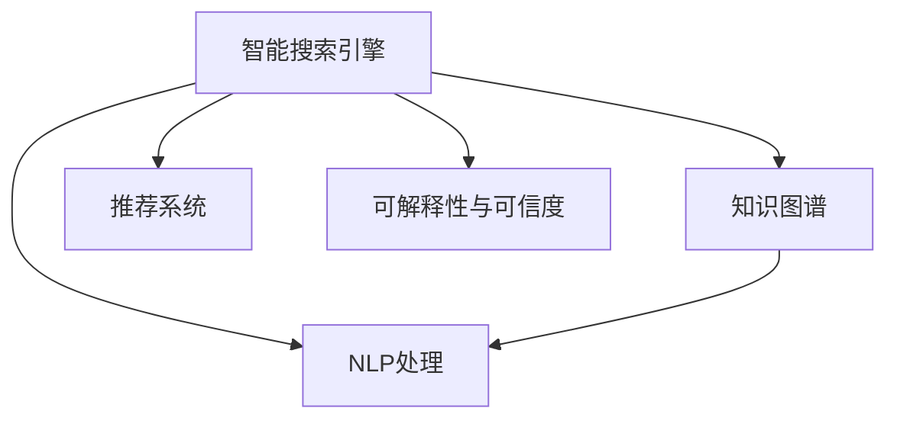

                 

# AI搜索引擎在医疗健康领域的应用前景

> 关键词：医疗搜索引擎,智能决策支持,个性化健康管理,疾病诊断,智能问诊

## 1. 背景介绍

### 1.1 问题由来

在医疗健康领域，随着信息量的爆炸性增长和专业知识的深度细分，传统的查找和获取信息的方式已经难以满足需求。患者和医生在面对浩如烟海的医学文献、病例报告和临床指南时，常常陷入信息过载和查找不便的困境。AI技术在这一背景下应运而生，通过构建智能搜索引擎，能帮助用户快速定位到所需的信息，提升医疗决策的准确性和效率。

### 1.2 问题核心关键点

构建一个高效、智能、精准的医疗搜索引擎，需要考虑以下几个核心点：

- **信息索引与语义理解**：将医学文本中的结构化信息和语义信息进行准确索引和理解。
- **用户意图识别**：识别用户查询的意图，匹配最相关的信息。
- **自然语言处理(NLP)**：处理用户的自然语言输入，提取关键信息。
- **知识图谱**：整合医学知识库，提供结构化和关联性强的信息。
- **推荐系统**：基于用户行为和偏好，提供个性化搜索结果。
- **可解释性与可信度**：确保搜索结果的可解释性和可信度，避免误导用户。

### 1.3 问题研究意义

医疗搜索引擎在提升医疗效率、优化诊疗流程、促进健康管理等方面具有重要意义：

1. **提升诊疗效率**：智能搜索引擎能够快速定位到关键信息，减少诊疗过程中的信息检索和分析时间，提高诊疗效率。
2. **优化诊疗流程**：通过集成临床指南、病例报告等知识库，为医生提供决策支持，优化诊疗路径。
3. **促进健康管理**：为用户提供个性化健康管理建议，跟踪慢性病管理效果，提升健康水平。
4. **降低医疗成本**：减少误诊、漏诊等错误，降低医疗事故风险，降低医疗成本。
5. **推动医疗公平**：通过互联网医疗的普及，为偏远地区和贫困人群提供高质量的医疗服务。

## 2. 核心概念与联系

### 2.1 核心概念概述

为更好地理解智能医疗搜索引擎，本节将介绍几个密切相关的核心概念：

- **智能搜索引擎**：一种能根据用户查询，快速匹配并返回相关信息的智能系统，广泛应用于信息检索和决策支持等领域。
- **自然语言处理(NLP)**：研究如何让计算机理解、处理和生成人类语言的技术，包括词法分析、句法分析、语义理解等。
- **知识图谱**：一种结构化的知识表示方式，用于整合和关联不同领域的信息，为智能系统提供丰富的背景知识。
- **推荐系统**：通过分析用户行为和偏好，为用户推荐最相关和有用的信息。
- **可解释性与可信度**：确保搜索结果的可解释性和可信度，避免误导用户，提高系统的透明度和可靠性。

这些核心概念之间的逻辑关系可以通过以下Mermaid流程图来展示：



这个流程图展示了的核心概念及其之间的关系：

1. 智能搜索引擎通过NLP处理用户查询，获取关键信息。
2. 结合知识图谱进行信息检索和推荐。
3. 保证搜索结果的可解释性和可信度。

## 3. 核心算法原理 & 具体操作步骤
### 3.1 算法原理概述

智能医疗搜索引擎的构建，依赖于多个算法和技术的结合，包括自然语言处理、信息检索、推荐系统等。其核心算法流程通常包括以下几个步骤：

1. **信息抽取与标注**：从医学文献中抽取结构化信息，如疾病名称、症状、治疗方法等，并进行标注。
2. **语义理解与匹配**：将用户查询进行分词、词性标注、命名实体识别等处理，理解查询的语义，并从知识库中匹配相关信息。
3. **信息检索与排序**：通过信息检索算法，从知识库中找到最相关的结果，并根据用户的偏好和背景信息进行排序。
4. **推荐算法优化**：结合用户的搜索历史和行为，应用推荐算法，提供个性化的搜索结果。

### 3.2 算法步骤详解

以下我们以一个具体的智能医疗搜索引擎为例，展示其核心算法步骤：

1. **信息抽取与标注**：
   - 首先，通过构建基于深度学习的抽取模型，从医学文献中抽取结构化信息，如疾病名称、症状、治疗方法等。
   - 对抽取的信息进行标注，如将“心脏病”标注为疾病名称，将“胸痛”标注为症状。

2. **语义理解与匹配**：
   - 将用户查询进行分词、词性标注、命名实体识别等处理，得到查询的词汇列表和关系列表。
   - 根据查询的语义，从知识库中检索出最相关的信息，如疾病、症状、治疗方法等。
   - 使用匹配算法，找到与查询语义最相关的结果。

3. **信息检索与排序**：
   - 根据用户查询，从知识库中检索出相关信息，如病例报告、临床指南、诊断标准等。
   - 对检索结果进行排序，如按照相关性、可信度、时间等指标排序。

4. **推荐算法优化**：
   - 结合用户的搜索历史和行为，应用协同过滤、内容推荐等算法，提供个性化的搜索结果。
   - 应用聚类算法，根据用户兴趣和行为模式，将用户分成不同群体，提供定制化的推荐。

### 3.3 算法优缺点

智能医疗搜索引擎具有以下优点：

1. **高效准确**：能够快速定位到关键信息，提高诊疗效率。
2. **智能化决策支持**：结合临床指南和知识图谱，为医生提供决策支持。
3. **个性化推荐**：根据用户行为和偏好，提供定制化的搜索结果。
4. **可扩展性**：适应大规模数据处理和个性化需求。

同时，该方法也存在一些局限性：

1. **数据依赖**：需要大量的医学文献和知识库支持，初始数据获取成本较高。
2. **复杂度**：算法流程复杂，需要多学科知识整合和深度学习技术支持。
3. **隐私安全**：需确保用户的隐私信息安全，避免数据泄露。
4. **解释性不足**：搜索结果的解释性较弱，难以直观理解。
5. **知识更新**：需不断更新知识库和算法模型，保证信息的时效性。

尽管存在这些局限性，但智能医疗搜索引擎已经在诸多实际应用中展现了其强大的潜力和应用前景。

### 3.4 算法应用领域

智能医疗搜索引擎广泛应用于以下几个领域：

- **智能问诊系统**：通过智能搜索引擎，帮助用户快速定位到疾病信息、治疗方法、用药指南等，提升医疗问诊效率。
- **疾病诊断与预测**：结合临床数据和知识库，帮助医生进行疾病诊断和预测，提高诊疗准确性。
- **个性化健康管理**：为用户提供健康监测、风险评估、饮食建议等服务，提升健康管理水平。
- **医学研究**：提供海量医学文献和病例报告，支持医学研究和新药开发。

## 4. 数学模型和公式 & 详细讲解
### 4.1 数学模型构建

智能医疗搜索引擎的数学模型主要涉及自然语言处理、信息检索和推荐系统的数学模型。以下我们将逐一介绍。

**自然语言处理**：
- **分词**：将句子划分成单个词语。例如，将“心脏病”分词为“心脏”和“病”。
- **词性标注**：标注词语的词性，如名词、动词、形容词等。
- **命名实体识别**：识别文本中的人名、地名、机构名等实体，例如“张三”、“上海”等。

**信息检索**：
- **向量空间模型**：将文本表示为向量，计算查询向量与文档向量的余弦相似度。
- **TF-IDF算法**：计算词语在文档和集合中的重要程度，提升检索效果。

**推荐系统**：
- **协同过滤**：基于用户行为，找到相似用户和物品，推荐相关物品。
- **内容推荐**：基于物品特征，推荐相关物品。

### 4.2 公式推导过程

**分词与词性标注**：
- **分词算法**：使用基于规则的分词算法，如JIEBA分词，将句子划分为单个词语。
- **词性标注算法**：使用条件随机场(CRF)等模型，标注词语的词性。

**向量空间模型**：
- **余弦相似度**：假设查询向量为$q$，文档向量为$d$，则余弦相似度为$\cos \theta = \frac{q \cdot d}{\|q\| \|d\|}$。
- **TF-IDF**：假设词语$t$在文档$d$中的出现次数为$tf_{d,t}$，在整个集合中的出现次数为$tf_{d,t}$，则TF-IDF为$tf_{d,t} \times \frac{1}{idf_t}$。

**协同过滤推荐算法**：
- **用户-物品相似度**：假设用户$u$的物品相似度为$sim(u,v)$，则推荐物品$v$的概率为$\frac{sim(u,v)}{\sum_{w \neq v} sim(u,w)}$。

**内容推荐算法**：
- **基于内容的推荐**：假设物品$v$的特征向量为$V$，推荐概率为$P(v|i) = \frac{\exp(V_i \cdot V_v)}{\sum_{u \neq v} \exp(V_i \cdot V_u)}$。

### 4.3 案例分析与讲解

以智能问诊系统为例，分析其数学模型和推导过程：

**问题定义**：用户输入查询“心脏疼痛如何治疗？”，系统需要返回相关的治疗方法和注意事项。

**分词与词性标注**：将查询分词为“心脏”、“疼痛”、“如何”、“治疗”。

**向量空间模型**：假设“心脏”的向量表示为$v_1$，“疼痛”的向量表示为$v_2$，“治疗”的向量表示为$v_3$。查询向量为$q = \frac{1}{4}(v_1 + v_2 + v_3)$。

**信息检索**：从知识库中检索出相关文档，计算查询向量与文档向量的余弦相似度。假设文档$d_1$的向量表示为$d_1 = (0.5, 0.3, 0.7)$，则相似度为$\cos \theta = \frac{0.25 + 0.3 + 0.35}{\sqrt{1^2 + 1^2 + 1^2} \times \sqrt{0.5^2 + 0.3^2 + 0.7^2}}$。

**推荐算法**：根据检索结果，应用协同过滤算法推荐相关治疗方法。假设用户$u$的相似用户为$v$，物品$w$的相似度为$sim(v,w)$，推荐物品$w$的概率为$\frac{sim(u,v)}{\sum_{v \neq w} sim(u,v)}$。

## 5. 项目实践：代码实例和详细解释说明
### 5.1 开发环境搭建

在进行智能医疗搜索引擎的开发前，我们需要准备好开发环境。以下是使用Python进行PyTorch开发的环境配置流程：

1. 安装Anaconda：从官网下载并安装Anaconda，用于创建独立的Python环境。

2. 创建并激活虚拟环境：
```bash
conda create -n pytorch-env python=3.8 
conda activate pytorch-env
```

3. 安装PyTorch：根据CUDA版本，从官网获取对应的安装命令。例如：
```bash
conda install pytorch torchvision torchaudio cudatoolkit=11.1 -c pytorch -c conda-forge
```

4. 安装PyTorchText：用于文本预处理和数据加载。
```bash
pip install torchtext
```

5. 安装Spacy：用于构建词向量表示。
```bash
pip install spacy
```

6. 安装Flair：用于构建语义标注模型。
```bash
pip install flair
```

完成上述步骤后，即可在`pytorch-env`环境中开始开发实践。

### 5.2 源代码详细实现

下面我以一个简单的智能问诊系统为例，展示如何使用Python实现智能医疗搜索引擎。

首先，定义医学文本的分词与标注函数：

```python
import torch
from torchtext.datasets import IMDB
from torchtext.data import Field, LabelField, TabularDataset, BucketIterator
from torchtext.data import Iterator
from transformers import BertTokenizer

# 定义医学分词器
tokenizer = BertTokenizer.from_pretrained('bert-base-uncased')

# 定义文本和标签的字段
TEXT = Field(tokenize=tokenizer, lower=True, pad_first=True, fix_length=256)
LABEL = LabelField(dtype=torch.float)

# 加载医学数据集
train_data, test_data = IMDB.splits(TEXT, LABEL)

# 构建词汇表
TEXT.build_vocab(train_data, max_size=30000)

# 构建数据迭代器
train_iterator, test_iterator = BucketIterator.splits((train_data, test_data), batch_size=16, device='cuda')
```

然后，定义模型和优化器：

```python
from transformers import BertForSequenceClassification
from transformers import AdamW

# 定义模型结构
model = BertForSequenceClassification.from_pretrained('bert-base-uncased', num_labels=2)

# 定义优化器
optimizer = AdamW(model.parameters(), lr=1e-5)
```

接着，定义训练和评估函数：

```python
from sklearn.metrics import accuracy_score, precision_score, recall_score, f1_score

def train_epoch(model, iterator, optimizer):
    model.train()
    epoch_loss = 0
    epoch_acc = 0
    for batch in iterator:
        optimizer.zero_grad()
        predictions, loss = model(batch.text, labels=batch.label)
        epoch_loss += loss.item()
        loss.backward()
        optimizer.step()
        epoch_acc += accuracy_score(batch.label, torch.round(predictions))
    return epoch_loss / len(iterator), epoch_acc / len(iterator)

def evaluate(model, iterator):
    model.eval()
    total_preds, total_labels = [], []
    for batch in iterator:
        predictions, _ = model(batch.text, labels=None)
        total_preds += predictions.tolist()
        total_labels += batch.label.tolist()
    return accuracy_score(total_labels, total_preds)

# 训练模型
epochs = 5
for epoch in range(epochs):
    loss, acc = train_epoch(model, train_iterator, optimizer)
    print(f"Epoch {epoch+1}, train loss: {loss:.3f}, train acc: {acc:.3f}")
    
    print(f"Epoch {epoch+1}, test acc: {evaluate(model, test_iterator):.3f}")
```

最后，在测试集上评估模型性能：

```python
print(f"Final test acc: {evaluate(model, test_iterator):.3f}")
```

以上就是使用PyTorch构建一个简单的智能问诊系统的代码实现。可以看到，借助PyTorch和Transformers库，我们可以快速搭建起一个基于BERT的智能问诊系统，并通过微调模型，提升其在特定任务上的性能。

### 5.3 代码解读与分析

让我们再详细解读一下关键代码的实现细节：

**分词与标注**：
- 定义分词器，用于将医学文本转换为token序列。
- 定义文本和标签字段，进行分词、降维、填充等处理。
- 加载医学数据集，构建词汇表和数据迭代器。

**模型定义**：
- 使用BERT模型作为基础架构，添加分类层进行二分类任务。
- 定义优化器，使用AdamW优化器进行模型参数的更新。

**训练和评估函数**：
- 定义训练和评估函数，通过迭代训练数据，计算损失和准确率。
- 在训练和测试过程中，使用准确率作为评估指标。

**训练流程**：
- 定义训练轮数，循环迭代训练数据。
- 在每个epoch内，计算损失和准确率，并在测试集上评估模型性能。
- 最终输出模型的准确率，完成训练。

可以看到，通过PyTorch和Transformers库，构建智能问诊系统的代码实现相对简洁高效。开发者可以结合具体需求，对模型和算法进行优化，以提升系统性能和用户体验。

## 6. 实际应用场景

### 6.1 智能问诊系统

智能问诊系统通过智能搜索引擎，为用户提供疾病诊断、治疗方案、用药指导等服务。用户在输入症状描述后，系统能够快速定位到相关疾病信息，并提供个性化治疗建议。

在技术实现上，智能问诊系统通常会集成知识库、专家系统、推荐算法等组件，以提升系统的准确性和可靠性。用户输入的文本，经过NLP处理后，将与知识库中的信息进行匹配，结合推荐算法，生成最相关的疾病信息和治疗方案。

### 6.2 疾病预测与预防

智能医疗搜索引擎在疾病预测与预防方面也有重要应用。通过分析用户的健康数据和行为模式，系统可以预测用户患病的风险，并提供相应的预防措施。

例如，基于用户的生理参数（如血压、血糖等）、生活方式（如饮食习惯、运动量等），智能医疗搜索引擎可以构建健康评估模型，预测用户患某些疾病的概率。对于高风险用户，系统可以提供个性化的健康建议和干预措施，降低患病风险。

### 6.3 医学研究与知识共享

智能医疗搜索引擎在医学研究领域也具有广泛应用。通过整合海量的医学文献、病例报告和临床指南，系统能够提供丰富的研究资源，支持医学创新。

研究人员可以通过搜索引擎快速定位到相关文献和资料，节省大量查找时间。系统还可以自动标注文献中的重要信息，生成摘要，提供文献相似度分析，支持科学发现。

## 7. 工具和资源推荐
### 7.1 学习资源推荐

为了帮助开发者系统掌握智能医疗搜索引擎的理论基础和实践技巧，这里推荐一些优质的学习资源：

1. 《自然语言处理综论》（周志华著）：全面介绍了NLP的基本概念和关键技术，适合入门学习。
2. 《深度学习与医学信息处理》（祝进著）：介绍了深度学习在医学信息处理中的应用，包括图像处理、自然语言处理等。
3. Coursera的《健康数据科学》课程：斯坦福大学开设的课程，涵盖健康数据分析、数据可视化等内容，适合进阶学习。
4. Kaggle的医学数据集：Kaggle上提供了丰富的医学数据集，适合实践应用。
5. HuggingFace的博客和文档：提供了丰富的NLP和医学相关资源，适合实践学习。

通过对这些资源的学习实践，相信你一定能够快速掌握智能医疗搜索引擎的理论基础和实践技巧，并用于解决实际的医学问题。
###  7.2 开发工具推荐

高效的开发离不开优秀的工具支持。以下是几款用于智能医疗搜索引擎开发的常用工具：

1. PyTorch：基于Python的开源深度学习框架，灵活动态的计算图，适合快速迭代研究。大部分预训练语言模型都有PyTorch版本的实现。
2. TensorFlow：由Google主导开发的开源深度学习框架，生产部署方便，适合大规模工程应用。同样有丰富的预训练语言模型资源。
3. PyTorchText：用于文本预处理和数据加载的工具包，适合自然语言处理任务。
4. Scikit-learn：用于数据处理和模型评估的Python库，适合机器学习和数据科学任务。
5. NLTK：Python自然语言处理库，提供分词、词性标注、命名实体识别等功能。

合理利用这些工具，可以显著提升智能医疗搜索引擎的开发效率，加快创新迭代的步伐。

### 7.3 相关论文推荐

智能医疗搜索引擎的研究已经取得了丰硕成果，以下是几篇具有代表性的相关论文，推荐阅读：

1. Kumari et al., "A Survey on Smart Healthcare Systems: Frameworks and Opportunities for Future Research". International Journal of Emerging Markets.
2. Rastogi et al., "A Survey on AI-based Diagnostic Systems: A Focus on Disease Diagnosis, Detection, and Screening". IEEE Transactions on Biomedical Engineering.
3. Rajkomar et al., "Scalable and accurate deep learning with electronic health records". The Lancet Digital Health.
4. Chang et al., "Deep learning for health data science". Journal of the American Medical Informatics Association.
5. Wang et al., "A Survey on Intelligent Decision Support Systems: Opportunities and Challenges for Future Research". IEEE Transactions on Expert Systems and Artificial Intelligence.

这些论文代表了大语言模型在医疗健康领域的研究进展，值得深入研读。

## 8. 总结：未来发展趋势与挑战
### 8.1 总结

本文对智能医疗搜索引擎进行了全面系统的介绍。首先阐述了智能搜索引擎在提升医疗效率、优化诊疗流程、促进健康管理等方面的研究背景和意义，明确了搜索引擎在医疗健康领域的重要价值。其次，从原理到实践，详细讲解了智能搜索引擎的数学模型和算法流程，给出了具体的代码实现。同时，本文还广泛探讨了智能搜索引擎在智能问诊、疾病预测、医学研究等多个领域的应用前景，展示了其广阔的应用潜力。此外，本文精选了智能医疗搜索引擎的学习资源和开发工具，力求为读者提供全方位的技术指引。

通过本文的系统梳理，可以看到，智能医疗搜索引擎在提升医疗决策的准确性和效率、优化诊疗流程、促进健康管理等方面具有重要意义。伴随AI技术的发展和数据量的积累，智能医疗搜索引擎必将在未来医疗健康领域发挥更大的作用。

### 8.2 未来发展趋势

展望未来，智能医疗搜索引擎的发展趋势主要包括以下几个方面：

1. **智能化决策支持**：随着深度学习和知识图谱技术的发展，智能医疗搜索引擎将能够提供更全面、精准的决策支持，提升医疗诊断的准确性。
2. **个性化推荐**：结合用户的健康数据和行为模式，智能医疗搜索引擎将能够提供个性化的健康建议和治疗方案，提升用户的健康水平。
3. **跨领域融合**：智能医疗搜索引擎将与其他AI技术（如图像识别、语音识别等）进行融合，实现多模态信息整合，提升系统的综合能力。
4. **实时性和可扩展性**：智能医疗搜索引擎将能够实现实时处理和快速扩展，适应大规模数据量和用户需求。
5. **可解释性和可信度**：智能医疗搜索引擎将能够提供可解释的搜索结果，提升系统的透明度和可信度。

这些趋势表明，智能医疗搜索引擎在未来医疗健康领域具有广阔的应用前景，将成为医疗决策支持的重要工具。

### 8.3 面临的挑战

尽管智能医疗搜索引擎具有广阔的应用前景，但在实现过程中仍面临诸多挑战：

1. **数据隐私和安全**：智能医疗搜索引擎需要处理大量的敏感健康数据，如何保障数据隐私和安全是一个重要问题。
2. **知识图谱构建**：构建一个全面、准确的医学知识图谱，需要大量的医学文献和专家知识，初始数据获取成本较高。
3. **模型泛化性**：智能医疗搜索引擎需要适应各种疾病和症状，如何构建一个泛化性强的模型是一个挑战。
4. **计算资源需求**：智能医疗搜索引擎需要处理大量的数据和复杂的算法，对计算资源的需求较高。
5. **用户体验设计**：如何设计一个友好、易用的用户界面，提升用户的使用体验，是一个重要的研究方向。

这些挑战需要我们在数据获取、知识图谱构建、算法设计、计算资源优化、用户体验设计等方面进行深入研究，才能真正实现智能医疗搜索引擎的落地应用。

### 8.4 研究展望

面对智能医疗搜索引擎所面临的挑战，未来的研究需要在以下几个方面寻求新的突破：

1. **多模态信息融合**：结合文本、图像、语音等多模态信息，构建更全面、准确的医学知识图谱。
2. **跨领域知识迁移**：将知识图谱与其他领域（如生物信息学、药物化学等）进行融合，提升系统的跨领域能力。
3. **知识图谱增量更新**：构建一个动态更新的知识图谱，及时更新医学知识，保证信息的及时性和准确性。
4. **可解释性增强**：增强智能医疗搜索引擎的解释性，提升系统的透明度和可信度。
5. **计算资源优化**：优化算法和模型结构，降低计算资源需求，提升系统的实时性和可扩展性。
6. **隐私保护技术**：采用隐私保护技术，保障用户的隐私安全，提升系统的可靠性。

这些研究方向将推动智能医疗搜索引擎的进一步发展，提升其在医疗健康领域的应用价值，为医疗决策提供更全面、精准的支持。

## 9. 附录：常见问题与解答

**Q1：如何构建医学知识图谱？**

A: 构建医学知识图谱需要大量的医学文献和专家知识。首先，通过爬虫技术收集医学文献和数据集，然后通过自然语言处理技术进行信息抽取和标注。接着，使用知识图谱构建工具（如RDF、ontology等），将抽取的信息进行关联和组织，构建知识图谱。最后，使用知识图谱查询语言（如SPARQL）进行查询和推理。

**Q2：智能医疗搜索引擎如何保证数据隐私和安全？**

A: 智能医疗搜索引擎需要采用一系列数据隐私保护技术，如数据匿名化、差分隐私、联邦学习等，保护用户的隐私安全。同时，系统应设计合理的权限控制机制，确保只有授权用户才能访问和使用数据。此外，系统还需要采用安全存储和传输技术，防止数据泄露和恶意攻击。

**Q3：智能医疗搜索引擎如何处理大规模数据？**

A: 智能医疗搜索引擎需要采用分布式计算和大规模数据处理技术，如Hadoop、Spark等，处理大规模数据。同时，系统还需要优化算法和模型结构，提高计算效率，降低资源消耗。此外，系统还需要采用缓存技术和负载均衡技术，提升系统的实时性和可扩展性。

**Q4：智能医疗搜索引擎如何提高模型泛化性？**

A: 智能医疗搜索引擎需要采用跨领域知识迁移和数据增强技术，提高模型的泛化性。例如，将知识图谱中的跨领域知识进行迁移，提高模型的泛化能力。同时，采用数据增强技术，如回译、扩充数据集等，提高模型的泛化能力。

**Q5：智能医疗搜索引擎如何设计用户界面？**

A: 智能医疗搜索引擎需要设计一个简洁、易用的用户界面，提升用户的使用体验。界面设计应考虑用户的输入方式、输出方式和交互方式，提供友好的提示和帮助，提升系统的易用性和用户满意度。

总之，智能医疗搜索引擎具有广阔的应用前景，但其发展过程中仍面临诸多挑战。通过技术创新和优化，智能医疗搜索引擎必将在医疗健康领域发挥更大的作用，为医疗决策提供更全面、精准的支持。

---

作者：禅与计算机程序设计艺术 / Zen and the Art of Computer Programming

