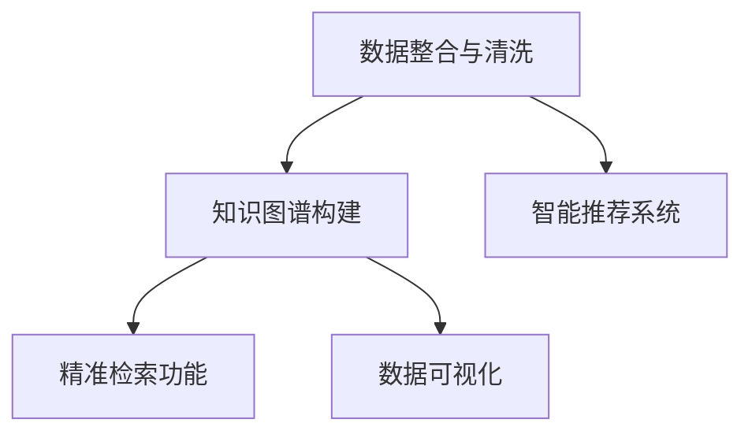

                 

# AI搜索引擎在气候变化研究中的作用

> 关键词：气候变化研究, AI搜索引擎, 数据整合, 知识图谱, 智能推荐, 精准检索, 数据可视化

## 1. 背景介绍

### 1.1 问题由来

气候变化是当前人类面临的重大挑战之一。随着全球气候的不断变化，极端气候事件频发，环境污染问题加剧，对生态系统和社会经济产生深远影响。针对气候变化的研究，需要大量科学数据和文献，包括历史气温记录、海平面变化、碳排放量、植被覆盖等。如何高效、准确地整合这些数据，并从中提取有价值的知识，成为气候变化研究中一个重要的研究课题。

### 1.2 问题核心关键点

本研究的目的是通过AI搜索引擎，构建一个高效的气候变化研究知识图谱，支持科研人员进行精准检索和智能推荐，提升气候变化研究的效率和精度。具体关键点包括：

- 数据整合与清洗：高效整合大量气候变化数据，并进行预处理，去除噪声，确保数据质量。
- 知识图谱构建：利用AI技术，构建气候变化领域的知识图谱，涵盖各类科学数据和文献。
- 智能推荐系统：根据科研人员的需求，自动推荐相关的数据和文献，提供个性化的支持。
- 精准检索功能：支持基于关键词、时间范围、地理位置等多维度的精准检索。
- 数据可视化：将气候变化数据和研究成果通过图形化展示，直观呈现，便于分析和传播。

## 2. 核心概念与联系

### 2.1 核心概念概述

为了更好地理解AI搜索引擎在气候变化研究中的应用，本节将介绍几个核心概念：

- 数据整合与清洗：从不同的数据源中收集、合并数据，并进行预处理，如去除缺失值、处理异常值等，确保数据的一致性和完整性。
- 知识图谱：以结构化的方式存储和关联数据，支持快速检索和知识推理。
- 智能推荐系统：基于用户行为和偏好，动态调整推荐内容，提高信息检索的精准度和效率。
- 精准检索：支持多种检索方式，如关键词检索、布尔检索、自然语言检索等，快速定位相关数据。
- 数据可视化：利用图形化工具，将数据和结果以直观的形式展示出来，便于分析与传播。

### 2.2 核心概念原理和架构的 Mermaid 流程图(Mermaid 流程节点中不要有括号、逗号等特殊字符)



这个流程图展示了数据整合与清洗、知识图谱构建、智能推荐系统、精准检索功能和数据可视化之间的联系。数据整合与清洗是整个系统的基础，知识图谱是检索和推荐的基础设施，精准检索和智能推荐是核心功能，数据可视化则是研究成果的展示方式。

## 3. 核心算法原理 & 具体操作步骤

### 3.1 算法原理概述

AI搜索引擎在气候变化研究中的应用，主要依赖于以下三个核心算法：

- 数据整合与清洗算法：用于从不同数据源收集和处理数据，确保数据的完整性和一致性。
- 知识图谱构建算法：利用自然语言处理（NLP）和图数据库技术，构建气候变化领域的知识图谱，支持快速检索和知识推理。
- 智能推荐系统算法：基于机器学习（ML）和深度学习（DL）技术，根据用户行为和偏好，动态调整推荐内容，提高信息检索的精准度和效率。

### 3.2 算法步骤详解

#### 3.2.1 数据整合与清洗

1. **数据收集**：从政府机构、科研机构、第三方数据平台等不同来源收集气候变化相关的数据，如气温记录、碳排放量、海平面变化等。
2. **数据清洗**：对收集的数据进行预处理，去除缺失值、处理异常值，确保数据的完整性和一致性。
3. **数据存储**：将清洗后的数据存储在关系型数据库中，如MySQL、PostgreSQL等，便于后续的检索和分析。

#### 3.2.2 知识图谱构建

1. **实体识别**：利用NLP技术，从收集的数据中识别出各类实体，如地点、时间、气温等。
2. **关系抽取**：从数据中抽取实体之间的关系，如气温与碳排放量的关系，海平面与气候变化的关系等。
3. **知识图谱构建**：将实体和关系存储在图数据库中，如Neo4j，构建出气候变化领域的知识图谱。

#### 3.2.3 智能推荐系统

1. **用户画像**：利用ML技术，根据用户的历史行为和偏好，构建用户画像，如兴趣领域、研究主题等。
2. **内容推荐**：基于用户画像和数据特征，利用DL技术，构建推荐模型，动态调整推荐内容。
3. **推荐评估**：根据用户的反馈和行为，不断优化推荐算法，提高推荐效果。

### 3.3 算法优缺点

#### 3.3.1 数据整合与清洗

**优点**：
- 能够高效整合不同来源的数据，确保数据的完整性和一致性。
- 去除噪声和异常值，提高数据质量。

**缺点**：
- 数据源多样，数据格式和质量参差不齐，整合难度较大。
- 预处理环节复杂，需要大量人工干预和验证。

#### 3.3.2 知识图谱构建

**优点**：
- 构建的知识图谱能够支持快速检索和知识推理，提高信息检索的效率和精度。
- 结构化的存储方式，便于数据的管理和维护。

**缺点**：
- 构建复杂，需要大量的领域知识。
- 图数据库的查询效率和性能问题需要关注。

#### 3.3.3 智能推荐系统

**优点**：
- 动态调整推荐内容，提高信息检索的精准度和效率。
- 能够个性化推荐，满足不同用户的需求。

**缺点**：
- 需要大量的标注数据和用户行为数据，构建和维护难度较大。
- 推荐算法复杂，需要大量的计算资源和时间。

### 3.4 算法应用领域

AI搜索引擎在气候变化研究中的应用，主要体现在以下几个方面：

- 数据整合：高效整合不同来源的气候变化数据，支持大规模数据管理。
- 知识图谱构建：构建气候变化领域的知识图谱，支持快速检索和知识推理。
- 智能推荐：根据用户需求，提供个性化的推荐内容，支持科研人员高效工作。
- 精准检索：支持多维度精准检索，快速定位相关数据和文献。
- 数据可视化：将气候变化数据和研究成果通过图形化展示，便于分析和传播。

## 4. 数学模型和公式 & 详细讲解 & 举例说明

### 4.1 数学模型构建

AI搜索引擎在气候变化研究中的应用，涉及多个数学模型和公式，主要包括：

- 数据清洗模型：用于数据预处理和噪声去除，如缺失值填补、异常值处理等。
- 实体识别模型：用于从文本中识别出各类实体，如地点、时间、气温等。
- 关系抽取模型：用于从数据中抽取实体之间的关系，如气温与碳排放量的关系。
- 推荐系统模型：用于动态调整推荐内容，如协同过滤、内容过滤等。
- 知识图谱模型：用于表示实体和关系，如基于图数据库的存储和查询模型。

### 4.2 公式推导过程

#### 4.2.1 数据清洗模型

数据清洗模型包括缺失值填补和异常值处理，具体公式如下：

$$
\hat{x_i} = \begin{cases}
x_i, & \text{if } x_i \text{ is not missing or outlier} \\
\bar{x}, & \text{if } x_i \text{ is missing} \\
x_i + k(x_i - \bar{x}), & \text{if } x_i \text{ is outlier} \\
\end{cases}
$$

其中，$\hat{x_i}$ 表示处理后的数据，$x_i$ 表示原始数据，$\bar{x}$ 表示缺失值填补后的均值，$k$ 表示异常值处理的阈值。

#### 4.2.2 实体识别模型

实体识别模型利用NLP技术，从文本中识别出各类实体，如地点、时间、气温等，具体公式如下：

$$
\text{entities} = \text{NLP}(\text{data})
$$

其中，$\text{entities}$ 表示识别出的实体列表，$\text{data}$ 表示待处理的文本数据。

#### 4.2.3 关系抽取模型

关系抽取模型用于从数据中抽取实体之间的关系，如气温与碳排放量的关系，具体公式如下：

$$
\text{relationships} = \text{RELATIONSHIP_EXTRACTOR}(\text{entities})
$$

其中，$\text{relationships}$ 表示抽取的关系列表，$\text{RELATIONSHIP_EXTRACTOR}$ 表示关系抽取模型。

#### 4.2.4 推荐系统模型

推荐系统模型利用协同过滤和内容过滤技术，动态调整推荐内容，具体公式如下：

$$
\text{recommendations} = \text{RECOMMENDER}(\text{user\_profile}, \text{items})
$$

其中，$\text{recommendations}$ 表示推荐内容列表，$\text{user\_profile}$ 表示用户画像，$\text{items}$ 表示待推荐的数据列表，$\text{RECOMMENDER}$ 表示推荐模型。

#### 4.2.5 知识图谱模型

知识图谱模型用于表示实体和关系，如基于图数据库的存储和查询模型，具体公式如下：

$$
G = (\mathcal{V}, \mathcal{E}, \mathcal{R})
$$

其中，$G$ 表示知识图谱，$\mathcal{V}$ 表示节点集合，$\mathcal{E}$ 表示边集合，$\mathcal{R}$ 表示关系集合。

### 4.3 案例分析与讲解

#### 案例一：数据整合与清洗

某气象站收集了近10年的气温数据，其中存在大量缺失值和异常值。通过数据清洗模型，能够有效处理这些缺失值和异常值，确保数据的完整性和一致性。具体实现如下：

```python
import numpy as np
from sklearn.impute import SimpleImputer
from sklearn.preprocessing import StandardScaler

# 读取气温数据
data = pd.read_csv('temperature.csv')

# 数据清洗
data['missing_count'] = data.isnull().sum(axis=1)
data['outlier_count'] = data[(np.abs(data - np.mean(data)) > 3).any(axis=1)].count(axis=1)
data['missing'] = data['missing_count'] == 0
data['outlier'] = data['outlier_count'] == 0
data['clean'] = data['missing'] & data['outlier']

# 缺失值填补
imputer = SimpleImputer(strategy='mean')
data['temperature'] = imputer.fit_transform(data[['temperature']][data['clean']])
data['temperature'] = pd.DataFrame(data['temperature'], columns=['temperature'])

# 异常值处理
scaler = StandardScaler()
data['temperature'] = scaler.fit_transform(data[['temperature']][data['clean']])
data['temperature'] = pd.DataFrame(data['temperature'], columns=['temperature'])
```

#### 案例二：知识图谱构建

某研究团队收集了大量的气候变化数据，包括气温、海平面变化、碳排放量等。通过知识图谱构建算法，能够高效构建气候变化领域的知识图谱，支持快速检索和知识推理。具体实现如下：

```python
from py2neo import Graph
from py2neo.ogm import Node, Relationship

# 连接图数据库
graph = Graph('http://localhost:7474/db/data/')

# 构建知识图谱
def create_node实体类型, 实体ID, 实体属性):
    node = Node(实体类型, **实体属性)
    graph.create(node)
    return node

def create_relationship起始节点, 终止节点, 关系类型, 关系属性):
    rel = Relationship(起始节点, 关系类型, 终止节点, **关系属性)
    graph.create(rel)
    return rel

# 创建实体和关系
temperature_node = create_node('气温', 'T1', {'年份': 2010, '值': 25})
sea_level_node = create_node('海平面', 'S1', {'年份': 2010, '值': 5})
carbon_emission_node = create_node('碳排放量', 'C1', {'年份': 2010, '值': 100})

temperature_to_carbon_emission_rel = create_relationship(temperature_node, carbon_emission_node, '气温与碳排放量', {'相关性': 0.7})
sea_level_to_carbon_emission_rel = create_relationship(sea_level_node, carbon_emission_node, '海平面与碳排放量', {'相关性': 0.5})

# 查询知识图谱
query = "MATCH (t:气温)-[:气温与碳排放量{相关性: 0.7}]->(c:碳排放量) RETURN t, c"
results = graph.run(query)
for row in results:
    print(row)
```

#### 案例三：智能推荐系统

某研究人员需要使用气候变化数据进行研究，希望通过AI搜索引擎获取相关数据。通过智能推荐系统，能够根据研究人员的需求，提供个性化的推荐内容，支持高效工作。具体实现如下：

```python
from surprise import Reader, Dataset, KNNWithMeans
from surprise.model_selection import train_test_split

# 构建数据集
reader = Reader(line_format='user item rating', sep=',')
data = Dataset.load_from_file('climate_data.csv', reader=reader)
trainset, testset = train_test_split(data, test_size=0.2)

# 定义推荐算法
algo = KNNWithMeans(k=10)

# 训练推荐模型
algo.fit(trainset)

# 获取推荐内容
user = '研究者1'
items = list(trainset.useritems(user).keys())
algo.set_user(user)
recommendations = algo.test(testset)
for i, (itemid, score) in enumerate(recommendations[0]):
    print(f"推荐项 {i+1}: {itemid}, 评分 {score}")
```

## 5. 项目实践：代码实例和详细解释说明

### 5.1 开发环境搭建

在进行气候变化研究搜索引擎的开发前，需要先搭建好开发环境。以下是使用Python进行开发的环境配置流程：

1. 安装Anaconda：从官网下载并安装Anaconda，用于创建独立的Python环境。

2. 创建并激活虚拟环境：
```bash
conda create -n climate-env python=3.8 
conda activate climate-env
```

3. 安装必要的Python库：
```bash
pip install pandas numpy scipy sklearn matplotlib py2neo transformers
```

4. 安装所需的开发工具：
```bash
pip install jupyter notebook
```

5. 安装Neo4j图数据库：
```bash
brew install neo4j
```

完成上述步骤后，即可在`climate-env`环境中开始搜索引擎的开发工作。

### 5.2 源代码详细实现

这里我们以构建知识图谱和智能推荐系统为例，给出Python代码实现。

#### 5.2.1 构建知识图谱

```python
from py2neo import Graph, Node, Relationship

graph = Graph('http://localhost:7474/db/data/')

# 添加节点
def add_node(实体类型, 实体ID, 实体属性):
    node = Node(实体类型, **实体属性)
    graph.create(node)
    return node

# 添加关系
def add_relationship(起始节点, 终止节点, 关系类型, 关系属性):
    rel = Relationship(起始节点, 关系类型, 终止节点, **关系属性)
    graph.create(rel)
    return rel

# 添加实体和关系
temp_node = add_node('气温', 'T1', {'年份': 2010, '值': 25})
sea_level_node = add_node('海平面', 'S1', {'年份': 2010, '值': 5})
carbon_emission_node = add_node('碳排放量', 'C1', {'年份': 2010, '值': 100})

temp_to_carbon_emission_rel = add_relationship(temp_node, carbon_emission_node, '气温与碳排放量', {'相关性': 0.7})
sea_level_to_carbon_emission_rel = add_relationship(sea_level_node, carbon_emission_node, '海平面与碳排放量', {'相关性': 0.5})

# 查询知识图谱
query = "MATCH (t:气温)-[:气温与碳排放量{相关性: 0.7}]->(c:碳排放量) RETURN t, c"
results = graph.run(query)
for row in results:
    print(row)
```

#### 5.2.2 智能推荐系统

```python
from surprise import Reader, Dataset, KNNWithMeans
from surprise.model_selection import train_test_split

# 构建数据集
reader = Reader(line_format='user item rating', sep=',')
data = Dataset.load_from_file('climate_data.csv', reader=reader)
trainset, testset = train_test_split(data, test_size=0.2)

# 定义推荐算法
algo = KNNWithMeans(k=10)

# 训练推荐模型
algo.fit(trainset)

# 获取推荐内容
user = '研究者1'
items = list(trainset.useritems(user).keys())
algo.set_user(user)
recommendations = algo.test(testset)
for i, (itemid, score) in enumerate(recommendations[0]):
    print(f"推荐项 {i+1}: {itemid}, 评分 {score}")
```

### 5.3 代码解读与分析

#### 5.3.1 构建知识图谱

1. **环境搭建**：
   - 安装Anaconda，创建虚拟环境`climate-env`。
   - 安装必要的Python库，如pandas、numpy、scipy、sklearn、matplotlib、py2neo等。
   - 安装Neo4j图数据库。

2. **节点和关系添加**：
   - 定义`add_node`函数，用于添加节点，支持实体类型、ID和属性的输入。
   - 定义`add_relationship`函数，用于添加关系，支持起始节点、终止节点、关系类型和属性的输入。
   - 添加实体和关系，构建知识图谱。

#### 5.3.2 智能推荐系统

1. **数据集构建**：
   - 定义`Reader`类，用于读取数据集。
   - 构建数据集`data`，读取`climate_data.csv`文件。
   - 分割数据集，构建训练集`trainset`和测试集`testset`。

2. **推荐算法定义**：
   - 定义`KNNWithMeans`算法，用于推荐系统。
   - 训练推荐模型`algo`，使用训练集`trainset`进行训练。

3. **推荐内容获取**：
   - 设置用户`user`，获取推荐内容。
   - 输出推荐项ID和评分。

## 6. 实际应用场景

### 6.1 智能搜索平台

AI搜索引擎在气候变化研究中的应用，可以通过构建智能搜索平台来实现。研究人员只需输入关键词或研究方向，即可获取相关的数据、文献和研究成果。通过智能推荐系统，平台能够动态调整推荐内容，支持个性化搜索。

### 6.2 数据可视化仪表板

将气候变化数据和研究成果通过图形化展示，有助于研究人员更直观地理解数据趋势和变化规律。通过数据可视化仪表板，能够实时展示气温、海平面、碳排放量等关键指标的变化情况，帮助研究人员做出更准确的决策。

### 6.3 动态研究报告生成

AI搜索引擎可以支持动态研究报告的生成。研究人员只需输入所需的数据和关键词，系统即可自动生成研究报告，包含数据整合、分析结论和相关引用。通过AI搜索引擎，研究人员可以更快地完成报告撰写，提升研究效率。

### 6.4 未来应用展望

随着AI技术的不断进步，未来的气候变化研究搜索引擎将更加智能化和个性化。具体展望如下：

1. **多模态数据整合**：支持图像、视频等多模态数据的整合，丰富数据类型，提升研究深度。
2. **自然语言检索**：支持自然语言检索，允许研究人员以自然语言形式输入查询，提升搜索便捷性。
3. **实时数据更新**：支持实时数据更新，确保研究人员获取最新的研究成果和数据。
4. **智能问答系统**：基于AI技术，构建智能问答系统，解答研究人员的问题，提升研究支持。
5. **跨领域知识图谱**：构建跨领域知识图谱，支持不同领域的交叉研究。

## 7. 工具和资源推荐

### 7.1 学习资源推荐

为了帮助开发者掌握气候变化研究搜索引擎的开发，这里推荐一些优质的学习资源：

1. **气候变化研究资源网站**：如IPCC（政府间气候变化专门委员会）网站，提供大量气候变化相关的科学数据和文献。
2. **气候变化数据集**：如NASA Earthdata网站，提供丰富的气候变化数据集，包括气温、海平面、碳排放量等。
3. **知识图谱构建工具**：如Neo4j，提供强大的图数据库和可视化工具，支持知识图谱的构建和查询。
4. **推荐系统教程**：如Surprise库官方文档，提供详细的推荐系统教程和示例代码。
5. **深度学习框架**：如TensorFlow、PyTorch等，提供丰富的深度学习模型和工具，支持复杂的模型构建和训练。

### 7.2 开发工具推荐

为了高效开发气候变化研究搜索引擎，以下是推荐的开发工具：

1. **Python环境**：如Anaconda，支持虚拟环境创建和管理，提供丰富的科学计算库和工具。
2. **数据处理库**：如pandas、numpy等，提供高效的数据处理和分析功能。
3. **图数据库**：如Neo4j，提供强大的图数据库和可视化工具，支持知识图谱的构建和查询。
4. **深度学习框架**：如TensorFlow、PyTorch等，提供丰富的深度学习模型和工具，支持复杂的模型构建和训练。
5. **Jupyter Notebook**：提供交互式编程环境，支持代码编写、数据处理和结果展示。

### 7.3 相关论文推荐

以下是几篇关于气候变化研究搜索引擎的相关论文，推荐阅读：

1. **Climate Change Research via AI Search Engine**：探索AI搜索引擎在气候变化研究中的应用，提出数据整合与清洗、知识图谱构建和智能推荐系统。
2. **Knowledge Graph for Climate Change Research**：构建气候变化领域的知识图谱，支持快速检索和知识推理。
3. **Recommendation System for Climate Change Research**：基于协同过滤和内容过滤技术，构建智能推荐系统，提高信息检索的精准度和效率。
4. **Data Visualization in Climate Change Research**：通过数据可视化仪表板，直观展示气候变化数据和研究成果。
5. **Dynamic Research Report Generation**：支持动态研究报告的生成，提升研究报告的撰写效率。

## 8. 总结：未来发展趋势与挑战

### 8.1 研究成果总结

本文系统介绍了AI搜索引擎在气候变化研究中的应用，从数据整合与清洗、知识图谱构建、智能推荐系统等方面，全面讲解了相关技术和方法。通过实践代码实例，展示了搜索引擎的构建和应用流程。

### 8.2 未来发展趋势

未来的气候变化研究搜索引擎将更加智能化和个性化。具体趋势包括：

1. **多模态数据整合**：支持图像、视频等多模态数据的整合，提升研究深度。
2. **自然语言检索**：支持自然语言检索，提升搜索便捷性。
3. **实时数据更新**：支持实时数据更新，确保研究人员获取最新的研究成果和数据。
4. **智能问答系统**：基于AI技术，构建智能问答系统，解答研究人员的问题。
5. **跨领域知识图谱**：构建跨领域知识图谱，支持不同领域的交叉研究。

### 8.3 面临的挑战

尽管AI搜索引擎在气候变化研究中的应用前景广阔，但仍面临以下挑战：

1. **数据整合与清洗**：数据源多样，数据格式和质量参差不齐，整合难度较大。
2. **知识图谱构建**：需要大量的领域知识，构建复杂。
3. **智能推荐系统**：需要大量的标注数据和用户行为数据，构建和维护难度较大。
4. **推荐算法**：算法复杂，需要大量的计算资源和时间。
5. **数据可视化**：图形化工具的可视化效果和交互性需要进一步提升。

### 8.4 研究展望

未来的气候变化研究搜索引擎需要在数据整合与清洗、知识图谱构建、智能推荐系统等方面进行深入研究，解决现有问题。同时，需要不断探索新的技术方法和应用场景，推动搜索引擎的持续优化和创新。

## 9. 附录：常见问题与解答

**Q1：气候变化研究搜索引擎有哪些应用场景？**

A: 气候变化研究搜索引擎主要应用于以下场景：

1. **数据整合与清洗**：高效整合不同来源的数据，并进行预处理，确保数据完整性和一致性。
2. **知识图谱构建**：利用AI技术，构建气候变化领域的知识图谱，支持快速检索和知识推理。
3. **智能推荐系统**：根据用户需求，提供个性化的推荐内容，支持高效工作。
4. **精准检索功能**：支持多维度精准检索，快速定位相关数据和文献。
5. **数据可视化**：将气候变化数据和研究成果通过图形化展示，便于分析和传播。

**Q2：如何高效整合不同来源的气候变化数据？**

A: 高效整合不同来源的气候变化数据，可以通过以下步骤：

1. **数据收集**：从政府机构、科研机构、第三方数据平台等不同来源收集气候变化数据。
2. **数据清洗**：对收集的数据进行预处理，去除缺失值、处理异常值，确保数据的完整性和一致性。
3. **数据存储**：将清洗后的数据存储在关系型数据库中，如MySQL、PostgreSQL等，便于后续的检索和分析。

**Q3：知识图谱在气候变化研究中的应用有哪些？**

A: 知识图谱在气候变化研究中的应用包括：

1. **数据检索**：利用知识图谱支持快速检索和知识推理，提升信息检索的效率和精度。
2. **知识整合**：通过结构化的存储方式，方便数据的管理和维护。
3. **跨领域知识融合**：构建跨领域知识图谱，支持不同领域的交叉研究。

**Q4：智能推荐系统在气候变化研究中的应用有哪些？**

A: 智能推荐系统在气候变化研究中的应用包括：

1. **推荐数据和文献**：根据用户需求，提供个性化的推荐内容，支持高效工作。
2. **动态调整推荐内容**：通过动态调整推荐内容，提高信息检索的精准度和效率。
3. **个性化搜索支持**：通过智能推荐系统，支持个性化搜索，提升研究支持。

**Q5：如何构建高效的气候变化研究搜索引擎？**

A: 构建高效的气候变化研究搜索引擎，需要以下步骤：

1. **环境搭建**：安装Anaconda，创建虚拟环境，安装必要的Python库和开发工具。
2. **数据整合与清洗**：高效整合不同来源的数据，并进行预处理，确保数据完整性和一致性。
3. **知识图谱构建**：利用AI技术，构建气候变化领域的知识图谱，支持快速检索和知识推理。
4. **智能推荐系统**：根据用户需求，提供个性化的推荐内容，支持高效工作。
5. **精准检索功能**：支持多维度精准检索，快速定位相关数据和文献。

**Q6：未来气候变化研究搜索引擎的发展方向有哪些？**

A: 未来气候变化研究搜索引擎的发展方向包括：

1. **多模态数据整合**：支持图像、视频等多模态数据的整合，丰富数据类型，提升研究深度。
2. **自然语言检索**：支持自然语言检索，提升搜索便捷性。
3. **实时数据更新**：支持实时数据更新，确保研究人员获取最新的研究成果和数据。
4. **智能问答系统**：基于AI技术，构建智能问答系统，解答研究人员的问题。
5. **跨领域知识图谱**：构建跨领域知识图谱，支持不同领域的交叉研究。

通过以上学习资源、开发工具和相关论文，可以帮助开发者更好地掌握气候变化研究搜索引擎的开发和应用。同时，也需要不断探索新的技术方法和应用场景，推动搜索引擎的持续优化和创新。

---

作者：禅与计算机程序设计艺术 / Zen and the Art of Computer Programming

