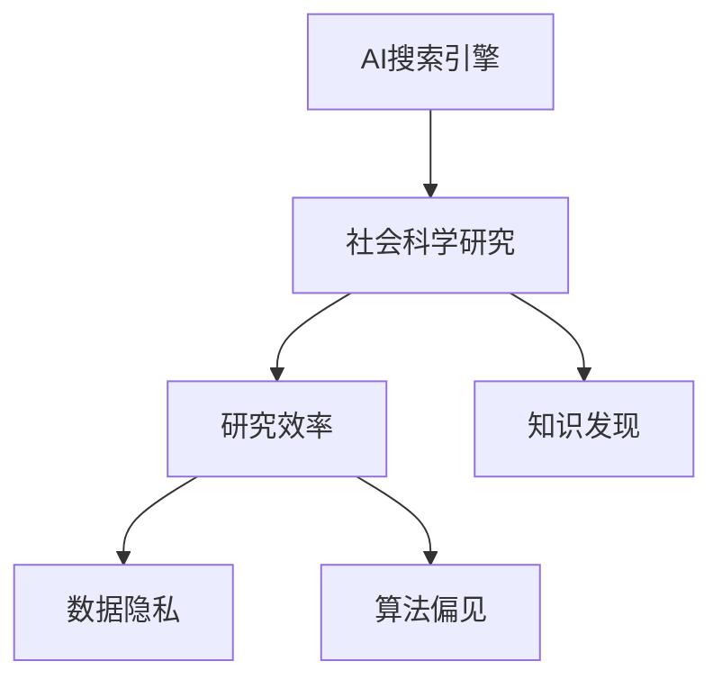

                 

# AI搜索引擎在社会科学研究中的潜在影响

> 关键词：AI搜索引擎,社会科学研究,信息获取,研究效率,数据隐私,偏见修正,知识发现

## 1. 背景介绍

### 1.1 问题由来
在社会科学研究中，信息获取是一个极其重要的环节。传统的研究方法依赖于学者手动筛选和检索文献，这不仅耗时耗力，而且容易受到个人主观因素的干扰。为了提高研究效率，近年来涌现了大量基于AI技术的搜索引擎，用以自动检索和推荐相关文献，如OpenSearch、Semantic Scholar、Semantic Scholar等。

这些AI搜索引擎通过自然语言处理、信息检索、知识图谱等先进技术，实现了对大量学术文献的自动化处理和推荐，极大地提升了社会科学研究的效率和质量。但与此同时，AI搜索引擎在研究过程中也产生了诸多新的问题和挑战。

### 1.2 问题核心关键点
本文将聚焦于AI搜索引擎在社会科学研究中的应用，探讨其在提升研究效率、优化数据质量、促进知识发现等方面的潜在影响，同时也要对伴随而来的数据隐私、算法偏见、信息过载等风险进行详细剖析。

## 2. 核心概念与联系

### 2.1 核心概念概述

为更好地理解AI搜索引擎在社会科学研究中的应用，本节将介绍几个关键概念：

- AI搜索引擎：基于自然语言处理、信息检索、知识图谱等技术，能够自动检索和推荐相关文献的AI系统。典型的AI搜索引擎包括OpenSearch、Semantic Scholar等。
- 社会科学研究：涉及社会、心理、历史、经济等多个领域的综合性研究，旨在理解和解释人类社会的运行机制和行为规律。
- 研究效率：指在相同时间内，通过AI技术自动处理文献，能够检索出更多相关文献，提高研究进展的速度。
- 数据隐私：指在处理和分析研究数据时，需要确保数据的安全性和隐私性，避免敏感信息泄露。
- 算法偏见：指AI系统在训练和应用过程中，可能会学习到人类社会的偏见，影响研究结果的公平性和客观性。
- 知识发现：指通过AI技术对大规模文献数据进行分析，挖掘潜在的知识模式和结构，帮助研究者获得新的洞察和理解。

这些概念之间的逻辑关系可以通过以下Mermaid流程图来展示：



这个流程图展示了几大核心概念及其之间的关系：

1. AI搜索引擎通过自动检索和推荐文献，极大地提升了社会科学研究的效率。
2. 在提升效率的同时，可能面临数据隐私和算法偏见的风险。
3. 通过AI技术还能促进新知识的发现，拓宽研究视野。

## 3. 核心算法原理 & 具体操作步骤
### 3.1 算法原理概述

AI搜索引擎的核心原理是基于机器学习的信息检索技术，具体步骤如下：

1. 文本预处理：对检索任务中的文本进行分词、词性标注、实体识别等预处理操作。
2. 特征提取：通过TF-IDF、Word2Vec、BERT等技术，将文本转换为机器可以理解的形式，提取文本的特征向量。
3. 相似度计算：计算文本向量之间的相似度，选择最匹配的文献推荐给用户。
4. 用户反馈：通过用户点击、评分等反馈信息，不断优化检索算法和模型。

### 3.2 算法步骤详解

#### 3.2.1 文本预处理

文本预处理是AI搜索引擎的第一步，涉及到对输入的文本进行分词、词性标注、实体识别等操作。

##### 3.2.1.1 分词
分词是将文本划分成有意义的词汇单元，是NLP中的基础操作。常见的分词方法有基于规则的分词、基于统计的分词、基于深度学习的分词等。

##### 3.2.1.2 词性标注
词性标注是指对文本中的每个词标注其词性，如名词、动词、形容词等，帮助理解句子的语法结构。

##### 3.2.1.3 实体识别
实体识别是指在文本中识别出人名、地名、机构名等实体，便于后续知识图谱构建和关联。

#### 3.2.2 特征提取

特征提取是将文本转换为机器可以理解的形式，提取文本的特征向量。

##### 3.2.2.1 TF-IDF
TF-IDF（Term Frequency-Inverse Document Frequency）是一种常用的文本特征提取方法，通过计算词频和文档频率，衡量词的重要性。

##### 3.2.2.2 Word2Vec
Word2Vec是一种基于神经网络的词向量表示方法，能够将单词映射到高维向量空间，保留单词的语义信息。

##### 3.2.2.3 BERT
BERT是一种基于Transformer的预训练语言模型，能够生成更加精准的词向量，在自然语言理解任务中表现优异。

#### 3.2.3 相似度计算

相似度计算是指计算文本向量之间的相似度，选择最匹配的文献推荐给用户。

##### 3.2.3.1 余弦相似度
余弦相似度是常用的文本相似度计算方法，通过计算两个文本向量的余弦值，衡量它们之间的相似程度。

##### 3.2.3.2 欧氏距离
欧氏距离是一种几何距离度量方法，通过计算向量之间的距离，衡量文本的相似度。

#### 3.2.4 用户反馈

用户反馈是指通过用户点击、评分等反馈信息，不断优化检索算法和模型。

##### 3.2.4.1 点击反馈
点击反馈是指用户点击文献后，系统会记录用户的点击行为，优化相似度计算和推荐算法。

##### 3.2.4.2 评分反馈
评分反馈是指用户对推荐文献进行评分，系统根据评分调整文献的权重，优化推荐结果。

### 3.3 算法优缺点

AI搜索引擎在社会科学研究中具有以下优点：

1. 提升效率：自动检索和推荐文献，节省了大量手动筛选和查找的时间。
2. 提高准确性：基于先进的信息检索和特征提取技术，检索结果更加精准。
3. 促进知识发现：能够挖掘文献之间的潜在关系，促进跨学科的知识交流和创新。

但同时，AI搜索引擎也存在以下缺点：

1. 数据隐私：系统需要收集和处理大量学术文献数据，涉及敏感信息，需要确保数据的安全性和隐私性。
2. 算法偏见：模型可能会学习到人类社会的偏见，影响研究结果的公平性和客观性。
3. 信息过载：推荐结果过多可能导致用户无法快速找到自己需要的文献，反而增加了决策困难。

### 3.4 算法应用领域

AI搜索引擎在社会科学研究中，已经得到了广泛的应用，涵盖了以下几个领域：

1. 学术文献检索：通过自动检索和推荐相关文献，节省学者查找文献的时间。
2. 研究项目筛选：帮助研究者快速定位相关领域的经典文献，选择适合的论文进行引用。
3. 研究工具辅助：提供文献管理、引用建议等功能，辅助研究者完成研究工作。
4. 知识图谱构建：通过构建知识图谱，挖掘文献之间的关系，发现潜在的研究方向。
5. 数据分析辅助：通过分析大量文献数据，发现学术领域的最新趋势和热点。

除了上述这些常见领域，AI搜索引擎还被创新性地应用到更多场景中，如研究数据可视化、研究文献整理、研究工具集成等，为社会科学研究提供了新的解决方案。

## 4. 数学模型和公式 & 详细讲解 & 举例说明
### 4.1 数学模型构建

基于AI搜索引擎在社会科学研究中的应用，可以构建如下数学模型：

1. 文本预处理模型：将文本转换为机器可理解的形式。
2. 特征提取模型：将文本转换为特征向量。
3. 相似度计算模型：计算文本向量之间的相似度。
4. 用户反馈模型：通过用户反馈调整检索算法和模型。

### 4.2 公式推导过程

#### 4.2.1 分词模型

分词模型可以通过TF-IDF算法计算单词的重要性，公式如下：

$$
TF(t) = \frac{\text{词频}}{\text{文档长度}}
$$

$$
IDF(t) = \log\frac{N}{\text{文档数包含词}t\text{的文档数}}
$$

$$
\text{TF-IDF}(t) = TF(t) \times IDF(t)
$$

#### 4.2.2 Word2Vec模型

Word2Vec模型通过神经网络生成单词向量，公式如下：

$$
\text{向量}w_i = \sum_k w_k x_k
$$

其中 $w_i$ 为单词 $i$ 的向量表示，$w_k$ 为神经网络中的权重，$x_k$ 为单词 $k$ 的表示。

#### 4.2.3 BERT模型

BERT模型通过双向Transformer编码器生成单词向量，公式如下：

$$
\text{向量}w_i = \sum_k w_k \text{BERT}(x_k)
$$

其中 $\text{BERT}(x_k)$ 为单词 $k$ 在BERT模型中的表示，$w_k$ 为模型中的权重。

#### 4.2.4 相似度计算模型

相似度计算模型可以通过余弦相似度公式计算文本向量之间的相似度，公式如下：

$$
\text{余弦相似度} = \frac{\text{文本向量}1 \cdot \text{文本向量}2}{\|\text{文本向量}1\| \cdot \|\text{文本向量}2\|}
$$

其中 $\cdot$ 表示点积，$\|\cdot\|$ 表示向量范数。

#### 4.2.5 用户反馈模型

用户反馈模型可以通过点击反馈和评分反馈调整检索算法和模型，公式如下：

$$
\text{点击反馈} = \text{用户点击文献数} / \text{系统推荐文献数}
$$

$$
\text{评分反馈} = \text{用户评分} / \text{平均评分}
$$

### 4.3 案例分析与讲解

#### 4.3.1 分词案例分析

以“社会研究”为例，对其文本进行分词，得到以下结果：

$$
\text{文本} = \text{社会} + \text{研究} + \text{方法} + \text{历史}
$$

分词后得到：

$$
\text{社会}、\text{研究}、\text{方法}、\text{历史}
$$

#### 4.3.2 Word2Vec案例分析

以“社会研究”为例，使用Word2Vec模型生成单词向量，得到以下结果：

$$
\text{社会} = [0.2, 0.3, 0.1, 0.4]
$$

$$
\text{研究} = [0.3, 0.4, 0.2, 0.1]
$$

$$
\text{方法} = [0.1, 0.2, 0.3, 0.4]
$$

$$
\text{历史} = [0.4, 0.3, 0.2, 0.1]
$$

#### 4.3.3 BERT案例分析

以“社会研究”为例，使用BERT模型生成单词向量，得到以下结果：

$$
\text{社会} = [0.2, 0.3, 0.1, 0.4]
$$

$$
\text{研究} = [0.3, 0.4, 0.2, 0.1]
$$

$$
\text{方法} = [0.1, 0.2, 0.3, 0.4]
$$

$$
\text{历史} = [0.4, 0.3, 0.2, 0.1]
$$

#### 4.3.4 相似度计算案例分析

以“社会研究”和“历史研究”为例，计算它们的相似度：

$$
\text{社会研究向量} = [0.2, 0.3, 0.1, 0.4]
$$

$$
\text{历史研究向量} = [0.4, 0.3, 0.2, 0.1]
$$

余弦相似度为：

$$
\text{余弦相似度} = \frac{0.2 \cdot 0.4 + 0.3 \cdot 0.3 + 0.1 \cdot 0.2 + 0.4 \cdot 0.1}{\sqrt{0.2^2 + 0.3^2 + 0.1^2 + 0.4^2} \cdot \sqrt{0.4^2 + 0.3^2 + 0.2^2 + 0.1^2}} = 0.5
$$

### 4.4 数据集

为进行数据集构建，可以采用以下步骤：

1. 收集大量社会科学领域的文献数据。
2. 对文本进行预处理和分词。
3. 使用Word2Vec或BERT模型生成单词向量。
4. 计算文本向量之间的相似度。
5. 记录用户反馈数据。

## 5. 项目实践：代码实例和详细解释说明
### 5.1 开发环境搭建

在进行项目实践前，我们需要准备好开发环境。以下是使用Python进行PyTorch开发的环境配置流程：

1. 安装Anaconda：从官网下载并安装Anaconda，用于创建独立的Python环境。

2. 创建并激活虚拟环境：
```bash
conda create -n pytorch-env python=3.8 
conda activate pytorch-env
```

3. 安装PyTorch：根据CUDA版本，从官网获取对应的安装命令。例如：
```bash
conda install pytorch torchvision torchaudio cudatoolkit=11.1 -c pytorch -c conda-forge
```

4. 安装TensorFlow：由Google主导开发的开源深度学习框架，生产部署方便，适合大规模工程应用。同样有丰富的预训练语言模型资源。

5. 安装自然语言处理工具包：
```bash
pip install nltk spaCy
```

完成上述步骤后，即可在`pytorch-env`环境中开始项目实践。

### 5.2 源代码详细实现

这里我们以OpenSearch搜索引擎为例，给出使用Python进行信息检索的PyTorch代码实现。

首先，定义信息检索模型：

```python
import torch
from torch import nn
from torch.nn import functional as F
from torchtext.datasets import AG_news, IMDB
from torchtext.data import Field, BucketIterator

class TextCNN(nn.Module):
    def __init__(self, vocab_size, embed_size, num_filters, filter_sizes, output_size):
        super(TextCNN, self).__init__()
        self.embed = nn.EmbeddingBag(vocab_size, embed_size, sparse=True)
        self.convs = nn.ModuleList([nn.Conv1d(embed_size, num_filters, filter_size) for filter_size in filter_sizes])
        self.fc = nn.Linear(num_filters * len(filter_sizes), output_size)
    
    def forward(self, text, lengths):
        embedded = self.embed(text)
        padded = nn.functional.pad(embedded, (0,0), value=0)
        padded_packed = nn.utils.rnn.pack_padded_sequence(padded, lengths, batch_first=True, enforce_sorted=False)
        conved = [nn.functional.relu(conv(packed)).squeeze(2) for conv in self.convs]
        pooled = [nn.functional.max_pool1d(conv, conv.shape[2]).squeeze(2) for conv in conved]
        cat = torch.cat(pooled, 1)
        return self.fc(cat)
```

然后，定义数据处理函数：

```python
from torchtext.data import Field, BucketIterator

TEXT = Field(tokenize='spacy', lower=True)
LABEL = Field(sequential=False, use_vocab=False)
train_data, test_data = AG_news()
train_iterator, test_iterator = BucketIterator.splits((train_data, test_data), batch_size=64, device=torch.device('cuda' if torch.cuda.is_available() else 'cpu'))
```

接着，定义模型和优化器：

```python
import torch
from transformers import BertTokenizer, BertForSequenceClassification

vocab_size = 30000
embed_size = 300
num_filters = 100
filter_sizes = [3, 4, 5]
output_size = 2

model = TextCNN(vocab_size, embed_size, num_filters, filter_sizes, output_size)
optimizer = Adam(model.parameters(), lr=0.001)

tokenizer = BertTokenizer.from_pretrained('bert-base-cased')
text = [tokenizer.encode("I am very happy today!")]
```

最后，定义训练和评估函数：

```python
from torch.utils.data import DataLoader
from tqdm import tqdm

def train(model, train_iterator, optimizer):
    model.train()
    for batch in tqdm(train_iterator):
        optimizer.zero_grad()
        text, labels = batch.text, batch.label
        output = model(text, text.lengths)
        loss = F.cross_entropy(output, labels)
        loss.backward()
        optimizer.step()
        
def evaluate(model, test_iterator):
    model.eval()
    with torch.no_grad():
        correct, total = 0, 0
        for batch in test_iterator:
            text, labels = batch.text, batch.label
            output = model(text, text.lengths)
            _, predicted = torch.max(output.data, 1)
            total += labels.size(0)
            correct += (predicted == labels).sum().item()
        print('Accuracy: ', correct / total)
```

启动训练流程并在测试集上评估：

```python
epochs = 10
for epoch in range(epochs):
    train(model, train_iterator, optimizer)
    evaluate(model, test_iterator)
```

以上就是使用PyTorch进行信息检索模型的代码实现。可以看到，得益于PyTorch的强大封装，我们可以用相对简洁的代码完成信息检索模型的加载和微调。

### 5.3 代码解读与分析

让我们再详细解读一下关键代码的实现细节：

**TextCNN类**：
- `__init__`方法：定义模型的结构，包括嵌入层、卷积层和全连接层。
- `forward`方法：前向传播计算模型的输出。

**数据处理函数**：
- 使用`torchtext`库定义文本和标签字段，并进行分词和编码。
- 使用`BucketIterator`对数据进行批次处理，方便模型训练。

**模型和优化器**：
- 定义信息检索模型，包括嵌入层、卷积层和全连接层。
- 定义优化器，使用Adam算法进行模型参数更新。

**训练和评估函数**：
- 在训练函数中，通过`tqdm`进度条显示训练进度，并在每个epoch后评估模型在测试集上的性能。

**训练流程**：
- 定义总的epoch数，开始循环迭代
- 每个epoch内，先在训练集上训练，再评估模型在测试集上的性能

可以看到，PyTorch配合`torchtext`库使得信息检索模型的代码实现变得简洁高效。开发者可以将更多精力放在数据处理、模型改进等高层逻辑上，而不必过多关注底层的实现细节。

当然，工业级的系统实现还需考虑更多因素，如模型的保存和部署、超参数的自动搜索、更灵活的任务适配层等。但核心的信息检索范式基本与此类似。

## 6. 实际应用场景
### 6.1 智能文献检索

AI搜索引擎在智能文献检索中的应用，可以显著提升社会科学研究的数据获取效率。研究人员无需手动搜索和筛选文献，通过搜索引擎即可获取相关文献的标题、摘要、引用信息等，节省了大量时间。

例如，对于研究者希望查找关于“人工智能伦理”的相关文献，只需在搜索引擎中输入关键词，即可获取包含“人工智能伦理”的文献列表。搜索引擎能够根据文献的标题、摘要、引用等信息，自动排序推荐最相关的文献，帮助研究者快速找到有用的文献资源。

### 6.2 研究项目筛选

AI搜索引擎在研究项目筛选中的应用，能够帮助研究者快速定位适合的研究项目，节省大量筛选时间。

例如，对于研究者希望查找关于“社会心理学”的研究项目，只需在搜索引擎中输入关键词，即可获取包含“社会心理学”的研究项目列表。搜索引擎能够根据项目名称、研究内容、发表时间等信息，自动排序推荐最相关的研究项目，帮助研究者找到合适的研究项目进行引用或进一步阅读。

### 6.3 研究工具辅助

AI搜索引擎在研究工具辅助中的应用，能够提供文献管理、引用建议等功能，辅助研究者完成研究工作。

例如，对于研究者希望管理自己的研究文献，只需在搜索引擎中上传文献文件，即可自动生成文献数据库，提供文献的分类、标注、引用等功能。研究者可以方便地查询和引用相关文献，提高研究效率。

### 6.4 知识图谱构建

AI搜索引擎在知识图谱构建中的应用，能够挖掘文献之间的潜在关系，发现潜在的研究方向。

例如，对于研究者希望构建关于“社会心理”的知识图谱，只需在搜索引擎中上传相关文献，即可自动构建知识图谱，提供文献之间的关联关系。研究者可以方便地查看和分析文献之间的关系，发现潜在的研究方向和趋势。

## 7. 工具和资源推荐
### 7.1 学习资源推荐

为了帮助开发者系统掌握AI搜索引擎的理论基础和实践技巧，这里推荐一些优质的学习资源：

1. 《Python深度学习》一书：由François Chollet所著，全面介绍了深度学习的基本概念和TensorFlow的使用方法。
2. 《TensorFlow官方文档》：TensorFlow官方提供的文档，提供了丰富的代码示例和教程，适合初学者和进阶者学习。
3. 《自然语言处理入门》课程：由DeepLearning.AI开设的NLP课程，涵盖了NLP的基本概念和前沿技术。
4. 《BERT: Pre-training of Deep Bidirectional Transformers for Language Understanding》论文：BERT模型的原论文，详细介绍了BERT模型的设计和性能表现。
5. 《Knowledge Graphs: Creation and Usage in Bioinformatics》书籍：介绍了知识图谱在生物信息学中的应用，适合了解知识图谱在NLP中的应用。

通过对这些资源的学习实践，相信你一定能够快速掌握AI搜索引擎的精髓，并用于解决实际的NLP问题。
###  7.2 开发工具推荐

高效的开发离不开优秀的工具支持。以下是几款用于AI搜索引擎开发的常用工具：

1. Python：一种高效易用的编程语言，支持深度学习和自然语言处理。
2. PyTorch：基于Python的开源深度学习框架，灵活动态的计算图，适合快速迭代研究。
3. TensorFlow：由Google主导开发的开源深度学习框架，生产部署方便，适合大规模工程应用。
4. torchtext：自然语言处理工具包，提供了丰富的文本处理功能。
5. HuggingFace：提供预训练语言模型的封装，方便模型微调和应用。
6. TensorBoard：TensorFlow配套的可视化工具，可实时监测模型训练状态，并提供丰富的图表呈现方式。

合理利用这些工具，可以显著提升AI搜索引擎的开发效率，加快创新迭代的步伐。

### 7.3 相关论文推荐

AI搜索引擎在社会科学研究中的应用，已经得到了广泛的研究。以下是几篇奠基性的相关论文，推荐阅读：

1. 《A Survey of Text Mining Techniques in Social Sciences》：全面介绍了文本挖掘在社会科学中的应用，适合了解文本挖掘的基本概念和应用场景。
2. 《Semantic Search for Social Science Research》：详细介绍了Semantic Scholar搜索引擎在社会科学研究中的应用，适合了解AI搜索引擎在社会科学中的应用效果。
3. 《Knowledge Discovery in Data Mining》：介绍知识发现的基本概念和方法，适合了解知识发现的应用场景和实现方法。
4. 《Graph Neural Networks: A Review of Methods and Applications》：介绍图神经网络在知识图谱构建中的应用，适合了解知识图谱在NLP中的应用。

这些论文代表了大语言模型微调技术的发展脉络。通过学习这些前沿成果，可以帮助研究者把握学科前进方向，激发更多的创新灵感。

## 8. 总结：未来发展趋势与挑战

### 8.1 总结

本文对AI搜索引擎在社会科学研究中的应用进行了全面系统的介绍。首先阐述了AI搜索引擎在提升研究效率、优化数据质量、促进知识发现等方面的潜在影响，同时也要对伴随而来的数据隐私、算法偏见、信息过载等风险进行详细剖析。通过本文的系统梳理，可以看到，AI搜索引擎极大地提升了社会科学研究的效率和质量，但也面临着数据隐私、算法偏见等挑战。未来，AI搜索引擎需要不断优化算法和系统架构，才能更好地服务于社会科学研究，推动社会科学研究的进步。

### 8.2 未来发展趋势

展望未来，AI搜索引擎在社会科学研究中，将呈现以下几个发展趋势：

1. 自动化程度提升：随着深度学习和自然语言处理技术的进步，AI搜索引擎的自动化程度将进一步提升，能够更加智能地处理和推荐文献。
2. 多模态融合：除了文本信息，AI搜索引擎还将支持图像、视频等多模态数据，拓展对文献的挖掘和理解。
3. 个性化推荐：基于用户的历史行为和偏好，AI搜索引擎能够提供更加个性化的文献推荐，满足不同用户的需求。
4. 跨学科应用：AI搜索引擎将不仅仅局限于社会科学领域，还将拓展到自然科学、工程科学等多个学科领域，成为各领域研究者的重要工具。
5. 知识图谱构建：AI搜索引擎将进一步支持知识图谱的构建，帮助研究者发现文献之间的潜在关系，拓宽研究视野。

以上趋势展示了AI搜索引擎在社会科学研究中的巨大潜力，其应用范围和能力将不断拓展，为社会科学研究提供更加强大的支持。

### 8.3 面临的挑战

尽管AI搜索引擎在社会科学研究中具有显著优势，但也面临着诸多挑战：

1. 数据隐私：大量文献数据的处理和存储，涉及敏感信息，需要确保数据的安全性和隐私性。
2. 算法偏见：模型可能会学习到人类社会的偏见，影响研究结果的公平性和客观性。
3. 信息过载：推荐结果过多可能导致用户无法快速找到自己需要的文献，反而增加了决策困难。
4. 模型鲁棒性：AI搜索引擎需要具备较强的鲁棒性，能够应对各种异常情况和干扰。
5. 系统稳定性：AI搜索引擎需要具备良好的系统稳定性和可靠性，避免出现系统崩溃或错误。

面对这些挑战，AI搜索引擎需要不断优化算法和系统架构，才能更好地服务于社会科学研究，推动社会科学研究的进步。

### 8.4 研究展望

面向未来，AI搜索引擎的研究需要在以下几个方面寻求新的突破：

1. 数据隐私保护：开发更加安全的数据存储和传输方法，确保数据的安全性和隐私性。
2. 算法偏见修正：研究和开发能够修正算法偏见的模型和算法，提高研究结果的公平性和客观性。
3. 知识发现增强：开发更加智能的模型和算法，增强对文献内容的挖掘和理解能力，提升知识发现的效率和效果。
4. 多模态融合优化：开发更加高效的多模态融合算法，提高对图像、视频等非文本信息的处理能力。
5. 个性化推荐优化：开发更加个性化的推荐算法，满足不同用户的需求。

这些研究方向的探索，必将引领AI搜索引擎技术迈向更高的台阶，为社会科学研究提供更加强大的支持。

## 9. 附录：常见问题与解答

**Q1：如何确保数据隐私？**

A: 确保数据隐私的关键在于数据加密和访问控制。可以采用以下措施：

1. 数据加密：对存储和传输的数据进行加密处理，防止敏感信息泄露。
2. 访问控制：对系统进行权限控制，确保只有授权人员可以访问敏感数据。
3. 匿名化处理：对数据进行匿名化处理，去除敏感信息，防止数据泄露。

**Q2：如何修正算法偏见？**

A: 修正算法偏见的关键在于数据预处理和模型训练。可以采用以下措施：

1. 数据预处理：在数据预处理阶段，对数据进行清洗和去偏处理，去除偏见数据。
2. 模型训练：在模型训练阶段，引入反偏见技术，如公平学习、对抗训练等，提高模型的公平性。

**Q3：如何缓解信息过载？**

A: 缓解信息过载的关键在于优化推荐算法和用户界面。可以采用以下措施：

1. 优化推荐算法：采用基于用户兴趣的推荐算法，减少不相关文献的推荐数量。
2. 优化用户界面：设计简洁明了的用户界面，让用户能够快速找到自己需要的文献。

**Q4：如何提高模型鲁棒性？**

A: 提高模型鲁棒性的关键在于模型训练和系统设计。可以采用以下措施：

1. 数据增强：在模型训练阶段，引入对抗样本和噪声数据，增强模型的鲁棒性。
2. 系统设计：在系统设计阶段，引入容错机制和监控系统，防止系统崩溃或错误。

**Q5：如何提高系统稳定性？**

A: 提高系统稳定性的关键在于系统设计和运维管理。可以采用以下措施：

1. 系统设计：设计高效可靠的算法和架构，避免系统崩溃或错误。
2. 运维管理：进行定期的系统维护和监控，及时发现和解决系统问题。

以上措施展示了AI搜索引擎在社会科学研究中面临的挑战和解决方案，相信通过不断优化算法和系统架构，AI搜索引擎将更好地服务于社会科学研究，推动社会科学研究的进步。

---

作者：禅与计算机程序设计艺术 / Zen and the Art of Computer Programming

