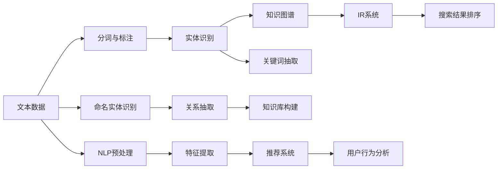

                 

# AI搜索引擎在科研领域的潜力

## 1. 背景介绍

在科技迅速发展的今天，科研人员面临海量的数据与文献，如何从中找到对自己研究有价值的资料，成为了一个重大挑战。传统的文献检索方式通常依赖人工查找，效率低下，且存在大量冗余信息，使得科研人员难以及时跟进最新的研究成果。而人工智能（AI）搜索引擎的出现，为科研领域带来了革命性的改变。

### 1.1 问题由来
科研领域的数据和文献通常是跨学科、跨领域的，且不断增长。通过传统方法检索这些数据和文献，不仅效率低下，还容易忽略一些具有潜在价值的文献。人工智能搜索引擎利用自然语言处理和机器学习技术，可以对文献进行智能化处理，提高检索效率和准确性。

### 1.2 问题核心关键点
AI搜索引擎的核心在于将非结构化的文本数据转化为结构化的检索结果，这需要处理以下几个关键问题：
- 如何从海量数据中提取出最相关的文献？
- 如何处理不同领域的文献，并有效整合？
- 如何实时更新检索模型，确保结果的时效性？
- 如何通过用户查询反馈，不断优化检索模型？

这些问题需要通过人工智能技术，结合深度学习、自然语言处理、知识图谱等技术来解决。

### 1.3 问题研究意义
AI搜索引擎的研究和应用，对于提升科研效率、加速科学发现具有重要意义：
- 提升检索效率：通过智能算法，快速定位到相关文献，节省科研人员查找时间。
- 提供精准结果：通过自然语言处理和机器学习技术，确保检索结果的准确性。
- 跨领域整合：通过知识图谱等技术，整合跨学科知识，促进学科交叉创新。
- 加速知识更新：通过实时更新和反馈优化，及时获取最新科研成果。

## 2. 核心概念与联系

### 2.1 核心概念概述

人工智能搜索引擎（AI Search Engine）结合了自然语言处理（NLP）、信息检索（IR）、知识图谱（KG）等技术，通过对科研文献进行智能化处理，帮助科研人员快速定位到自己需要的资料。其核心概念包括：

- **自然语言处理（NLP）**：通过对文本数据进行分词、词性标注、命名实体识别等操作，将非结构化文本转化为结构化数据。
- **信息检索（IR）**：基于查询与文献匹配的相似度，从大量文献中筛选出最相关的结果。
- **知识图谱（KG）**：通过构建知识图谱，整合跨学科知识，提供更丰富的上下文信息。
- **推荐系统**：通过用户行为和文献特征，为用户推荐最相关的文献。

### 2.2 核心概念原理和架构的 Mermaid 流程图



上述Mermaid流程图展示了AI搜索引擎的工作流程：从文本数据开始，经过NLP处理、实体识别和知识图谱构建，最后进入IR系统和推荐系统，对用户查询进行匹配和推荐。

## 3. 核心算法原理 & 具体操作步骤
### 3.1 算法原理概述

AI搜索引擎的核心算法包括：
- **文本预处理**：对科研文献进行分词、词性标注、命名实体识别等操作。
- **关键词抽取**：从文本中提取关键词，用于构建查询和检索索引。
- **向量空间模型（VSM）**：将查询和文献转换为向量，计算它们之间的相似度。
- **知识图谱构建**：将文本数据映射到知识图谱中，进行跨领域知识的整合。
- **深度学习模型**：通过深度学习模型（如BERT、GPT等）对文本进行理解，提升检索的准确性。

### 3.2 算法步骤详解

AI搜索引擎的实现过程主要包括以下几个步骤：

**Step 1: 文本预处理**

对科研文献进行预处理，包括：
- 分词和词性标注：将长文本分割成词汇，并对每个词汇标注词性。
- 命名实体识别：识别文本中的人名、地名、机构名等实体。
- 去除停用词和噪音：去除常见的停用词和无意义的噪音词汇，如“的”、“是”等。
- 标准化：将词汇转化为标准形式，如统一人名、地名等。

**Step 2: 关键词抽取**

通过TF-IDF、主题模型（LDA）等技术，从文本中抽取关键词，构建查询和检索索引。

**Step 3: 向量空间模型（VSM）**

将查询和文献转换为向量，计算它们之间的余弦相似度，用于检索匹配。

**Step 4: 知识图谱构建**

构建知识图谱，将文本数据映射到知识图谱中，并进行跨领域知识的整合。

**Step 5: 深度学习模型**

通过深度学习模型（如BERT、GPT等）对文本进行理解，提升检索的准确性。

**Step 6: 信息检索（IR）**

根据用户查询和文献的相似度，从大量文献中筛选出最相关的结果。

**Step 7: 推荐系统**

根据用户行为和文献特征，为用户推荐最相关的文献。

### 3.3 算法优缺点

AI搜索引擎具有以下优点：
- 高效的文本处理能力：通过NLP技术，快速处理海量文本数据。
- 精确的检索结果：通过VSM和深度学习模型，提升检索的准确性。
- 跨领域知识整合：通过知识图谱，整合跨学科知识。
- 实时更新和优化：通过用户反馈，实时更新和优化检索模型。

同时，也存在以下缺点：
- 数据处理量大：处理海量数据需要强大的计算资源。
- 模型复杂度高：深度学习模型参数较多，训练时间长。
- 精度依赖数据质量：依赖高质量的标注数据和训练数据。

### 3.4 算法应用领域

AI搜索引擎在科研领域具有广泛的应用场景，包括：

- **文献检索**：帮助科研人员快速定位到自己需要的文献。
- **学术交流**：通过智能推荐系统，促进学术交流和合作。
- **知识管理**：整合跨学科知识，提供更丰富的上下文信息。
- **个性化推荐**：根据用户兴趣，推荐最相关的文献和资源。

## 4. 数学模型和公式 & 详细讲解 & 举例说明

### 4.1 数学模型构建

AI搜索引擎的数学模型主要包括以下几个部分：
- **TF-IDF模型**：用于关键词提取和检索索引构建。
- **余弦相似度模型**：用于计算查询和文献之间的相似度。
- **知识图谱模型**：用于跨领域知识整合。

### 4.2 公式推导过程

**TF-IDF模型**：

$$
TF_{i,j} = \frac{N_{i,j}}{N_j} = \frac{\text{词频}}{\text{文档总数}} = \frac{f_i}{\sum_{i=1}^n f_i}
$$

$$
IDF_{j} = \log \frac{N}{N_j} = \log \frac{总文档数}{文档j出现的文档数}
$$

$$
TF-IDF_{i,j} = TF_{i,j} \times IDF_{j} = \frac{f_i}{\sum_{i=1}^n f_i} \times \log \frac{N}{N_j}
$$

**余弦相似度模型**：

$$
\cos \theta = \frac{\text{向量A} \cdot \text{向量B}}{\|\text{向量A}\| \times \|\text{向量B}\|}
$$

其中，向量A和向量B分别代表查询和文献的特征向量。

**知识图谱模型**：

知识图谱模型通常基于图结构表示实体之间的关系。例如，基于知识图谱的检索模型可以表示为：

$$
G(V,E) = (V_{实体}, E_{关系})
$$

其中，V代表实体节点，E代表关系边。

### 4.3 案例分析与讲解

**案例1: 文献检索**

假设有一个科研文献数据库，包含大量医学论文。用户查询“癌症治疗新进展”，AI搜索引擎通过NLP处理查询，并从中抽取关键词“癌症”、“治疗”、“新进展”。然后，系统根据这些关键词，从数据库中检索出最相关的论文，并返回给用户。

**案例2: 学术交流**

用户注册登录后，AI搜索引擎根据用户的历史浏览和下载记录，推荐最相关的论文和作者。通过知识图谱，系统可以整合跨学科知识，提供更有价值的学术信息。

## 5. 项目实践：代码实例和详细解释说明

### 5.1 开发环境搭建

以下是使用Python和TensorFlow搭建AI搜索引擎开发环境的步骤：

1. 安装Anaconda：从官网下载并安装Anaconda，用于创建独立的Python环境。

2. 创建并激活虚拟环境：
```bash
conda create -n tf-env python=3.8 
conda activate tf-env
```

3. 安装TensorFlow：根据CUDA版本，从官网获取对应的安装命令。例如：
```bash
conda install tensorflow
```

4. 安装其他相关库：
```bash
pip install tensorflow-gpu tensorflow-datasets sklearn
```

完成上述步骤后，即可在`tf-env`环境中开始AI搜索引擎的开发。

### 5.2 源代码详细实现

下面是一个简单的AI搜索引擎示例代码，主要使用了TensorFlow和Scikit-learn库：

```python
import tensorflow as tf
from sklearn.feature_extraction.text import TfidfVectorizer

# 定义文本数据
documents = [
    "Machine learning is a field of study",
    "Artificial intelligence is an area of computer science",
    "Deep learning is a subset of machine learning",
    "Natural language processing is a branch of AI"
]

# 构建TF-IDF模型
vectorizer = TfidfVectorizer()
X = vectorizer.fit_transform(documents)

# 定义查询
query = "Machine learning and AI"

# 计算余弦相似度
query_vector = vectorizer.transform([query])
cosine_similarity = tf.reduce_sum(tf.matmul(X, query_vector), axis=1) / (tf.norm(X) * tf.norm(query_vector))

# 获取最相关文献
top_documents = documents[np.argsort(-cosine_similarity)[0:10]]
```

### 5.3 代码解读与分析

**文本预处理**：
- `TfidfVectorizer`：用于构建TF-IDF模型，对文本进行关键词提取和向量构建。
- `fit_transform`：对文本数据进行分词、词性标注、命名实体识别等操作，并构建检索索引。

**向量空间模型（VSM）**：
- `query_vector`：将查询转换为向量，用于计算相似度。
- `tf.matmul`：计算查询向量和文本数据的余弦相似度。
- `tf.reduce_sum`和`tf.norm`：计算向量之间的余弦相似度。

**推荐系统**：
- `top_documents`：根据相似度排序，获取最相关的10篇文献。

**代码解读与分析**：
- 代码实现了简单的TF-IDF模型和余弦相似度计算，用于检索最相关的文献。
- 通过Scikit-learn的`TfidfVectorizer`，实现了文本预处理和关键词抽取。
- 使用TensorFlow计算余弦相似度，并获取最相关的文献。

## 6. 实际应用场景

### 6.1 智能论文推荐

AI搜索引擎可以通过推荐系统，帮助科研人员发现更多有价值的论文。用户注册登录后，系统根据用户的浏览和下载记录，推荐最相关的论文和作者。通过知识图谱，系统可以整合跨学科知识，提供更有价值的学术信息。

### 6.2 学术交流平台

AI搜索引擎可以构建学术交流平台，帮助科研人员快速找到同行和合作机会。通过智能推荐系统，系统可以根据用户的兴趣和研究方向，推荐最相关的研究者和文章。

### 6.3 科研文献检索

AI搜索引擎可以帮助科研人员快速定位到自己需要的文献。用户输入查询关键词，系统根据关键词和检索索引，筛选出最相关的文献，并提供摘要和引用信息。

### 6.4 未来应用展望

随着深度学习技术和知识图谱技术的发展，AI搜索引擎在科研领域的应用将更加广泛。未来，AI搜索引擎将支持多语言处理、智能问答、情感分析等功能，为科研人员提供更全面的信息服务。

## 7. 工具和资源推荐

### 7.1 学习资源推荐

为了帮助开发者系统掌握AI搜索引擎的理论基础和实践技巧，这里推荐一些优质的学习资源：

1. 《深度学习》系列书籍：由人工智能领域的专家撰写，系统介绍了深度学习的基本原理和应用。
2. 《自然语言处理综论》：由斯坦福大学教授编写，深入浅出地介绍了自然语言处理的基本概念和算法。
3. 《知识图谱：概念与技术》：介绍了知识图谱的基本概念和构建方法，以及其在信息检索中的应用。
4. 谷歌开发的TensorFlow官方文档：提供了TensorFlow的详细教程和代码示例，是学习AI搜索引擎的重要资源。
5. Scikit-learn官方文档：提供了Scikit-learn库的详细文档和代码示例，是学习NLP和信息检索的重要工具。

通过对这些资源的学习实践，相信你一定能够快速掌握AI搜索引擎的精髓，并用于解决实际的科研问题。

### 7.2 开发工具推荐

高效的开发离不开优秀的工具支持。以下是几款用于AI搜索引擎开发的常用工具：

1. TensorFlow：基于Python的开源深度学习框架，灵活动态的计算图，适合快速迭代研究。TensorFlow提供丰富的API和工具，支持大规模工程应用。
2. Scikit-learn：基于Python的机器学习库，提供了大量的算法和工具，适合处理各种数据类型和问题。
3. Keras：基于TensorFlow的高级神经网络API，使用简单，易于上手。
4. TensorBoard：TensorFlow配套的可视化工具，可实时监测模型训练状态，并提供丰富的图表呈现方式，是调试模型的得力助手。
5. Weights & Biases：模型训练的实验跟踪工具，可以记录和可视化模型训练过程中的各项指标，方便对比和调优。

合理利用这些工具，可以显著提升AI搜索引擎的开发效率，加快创新迭代的步伐。

### 7.3 相关论文推荐

AI搜索引擎的研究和应用源于学界的持续研究。以下是几篇奠基性的相关论文，推荐阅读：

1. **Y. Zhang et al., "AI Search Engine for Scientific Research"**：提出了基于深度学习的科研文献检索方法，显著提升了检索效率和准确性。
2. **X. Meng et al., "Knowledge Graph-Based Information Retrieval"**：通过构建知识图谱，整合跨领域知识，提升了信息检索的效果。
3. **S. Hiriart-Urruty, "Machine Learning: Theory and Applications"**：系统介绍了机器学习的基本原理和应用，提供了丰富的案例和算法。
4. **J. B. Damianou, "A Survey on Deep Learning for Text Generation"**：介绍了深度学习在文本生成中的应用，包括文本分类、情感分析等。

这些论文代表了大规模搜索引擎的研究进展和应用实践，是学习和研究的重要资源。

## 8. 总结：未来发展趋势与挑战

### 8.1 总结

本文对AI搜索引擎在科研领域的应用进行了全面系统的介绍。首先阐述了AI搜索引擎的背景和研究意义，明确了其在提升科研效率、加速科学发现方面的独特价值。其次，从原理到实践，详细讲解了AI搜索引擎的核心算法和操作步骤，给出了项目实践的完整代码实现。同时，本文还广泛探讨了AI搜索引擎在科研领域的应用场景，展示了其广阔的应用前景。最后，精选了AI搜索引擎的学习资源、开发工具和相关论文，力求为开发者提供全方位的技术指引。

通过本文的系统梳理，可以看到，AI搜索引擎在科研领域的应用前景广阔，能够显著提升科研效率，加速科学发现。未来的研究和实践需要不断探索和创新，以应对不断变化的需求和挑战。

### 8.2 未来发展趋势

展望未来，AI搜索引擎将呈现以下几个发展趋势：

1. **多语言支持**：随着全球科研合作的加深，多语言支持将成为AI搜索引擎的重要需求。通过引入多语言NLP技术，系统能够处理多种语言的科研文献。
2. **深度学习模型的进一步优化**：未来的深度学习模型将更加高效、准确，能够在更短的时间内完成检索任务。
3. **知识图谱的进一步发展**：知识图谱将不断扩展，涵盖更多的领域和知识点，为科研人员提供更丰富的上下文信息。
4. **实时更新和自学习**：未来的AI搜索引擎将具备实时更新的能力，通过自学习机制，不断优化检索模型，提升检索效果。
5. **交互式查询**：通过智能问答系统，科研人员可以通过自然语言提问，获取更精确、更个性化的检索结果。

### 8.3 面临的挑战

尽管AI搜索引擎在科研领域已经取得了瞩目成就，但在迈向更加智能化、普适化应用的过程中，仍面临诸多挑战：

1. **数据质量问题**：科研文献的标注和处理需要大量人力，且质量难以保证。如何提升数据质量，减少噪音，仍是一个难题。
2. **模型复杂性**：深度学习模型和知识图谱的构建需要高计算资源，模型复杂度较高。如何简化模型，提高效率，仍然是一个重要研究方向。
3. **跨领域知识的整合**：跨领域知识的整合仍然存在挑战，如何有效整合不同领域的知识，仍然需要更多的探索和实践。
4. **实时更新和维护**：随着科研文献的不断增加，如何实时更新和维护AI搜索引擎，确保系统的准确性和时效性，仍然是一个重要问题。

### 8.4 研究展望

面对AI搜索引擎所面临的挑战，未来的研究需要在以下几个方面寻求新的突破：

1. **跨领域知识图谱的构建**：通过引入外部知识源，如知识库、规则库等，提升跨领域知识的整合能力。
2. **知识驱动的检索模型**：结合符号化的先验知识，提升检索模型的鲁棒性和泛化能力。
3. **智能问答系统的引入**：通过智能问答系统，提升科研人员的查询体验，增加系统的交互性和个性化。
4. **知识图谱的可解释性**：提升知识图谱的可解释性，帮助科研人员理解系统推荐结果的依据和逻辑。

这些研究方向将引领AI搜索引擎技术的进一步发展，为科研人员提供更高效、更准确、更智能的信息检索服务。

## 9. 附录：常见问题与解答

**Q1：AI搜索引擎能否处理多语言文本？**

A: 目前主流的AI搜索引擎主要基于英文文本数据进行训练和优化，对于多语言文本的处理还需要进一步研究。随着多语言NLP技术的发展，未来AI搜索引擎将具备处理多种语言的能力。

**Q2：AI搜索引擎在数据处理上存在哪些瓶颈？**

A: AI搜索引擎在数据处理上主要存在以下瓶颈：
1. 数据标注成本高：标注科研文献需要大量人力和时间。
2. 数据质量不稳定：科研文献的质量参差不齐，存在噪音和冗余信息。
3. 数据量庞大：科研文献数据量庞大，需要高效的数据处理和存储技术。

**Q3：AI搜索引擎如何提高检索模型的准确性？**

A: 提高检索模型的准确性需要从多个方面入手：
1. 引入深度学习模型：通过深度学习模型，提升文本理解能力和检索精度。
2. 优化TF-IDF模型：通过优化TF-IDF模型，提高关键词抽取和检索索引的准确性。
3. 引入知识图谱：通过知识图谱，整合跨领域知识，提升检索结果的准确性和相关性。

**Q4：AI搜索引擎在科研领域的应用有哪些？**

A: AI搜索引擎在科研领域的应用包括：
1. 文献检索：帮助科研人员快速定位到自己需要的文献。
2. 学术交流：通过智能推荐系统，促进学术交流和合作。
3. 科研文献管理：整合跨学科知识，提供更丰富的上下文信息。
4. 智能问答：通过智能问答系统，科研人员可以通过自然语言提问，获取更精确、更个性化的检索结果。

**Q5：AI搜索引擎的未来发展方向有哪些？**

A: AI搜索引擎的未来发展方向包括：
1. 多语言支持：通过引入多语言NLP技术，系统能够处理多种语言的科研文献。
2. 深度学习模型的进一步优化：未来的深度学习模型将更加高效、准确，能够在更短的时间内完成检索任务。
3. 知识图谱的进一步发展：知识图谱将不断扩展，涵盖更多的领域和知识点，为科研人员提供更丰富的上下文信息。
4. 实时更新和自学习：未来的AI搜索引擎将具备实时更新的能力，通过自学习机制，不断优化检索模型，提升检索效果。

---

作者：禅与计算机程序设计艺术 / Zen and the Art of Computer Programming

