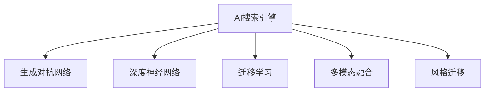

                 

## 1. 背景介绍

### 1.1 问题由来

随着人工智能技术的快速发展，AI搜索引擎在艺术创作领域的应用逐渐成为热门话题。艺术创作不仅仅是一种表达方式，更是一种创新思维的体现。传统艺术创作过程耗时耗力，且存在创意瓶颈。AI搜索引擎通过对海量艺术数据的分析和理解，能够快速生成新颖的艺术作品，帮助艺术家激发灵感，提升创作效率。

### 1.2 问题核心关键点

当前，AI搜索引擎在艺术创作领域的应用主要有以下几个方面：

- **图像生成**：通过分析海量艺术图片，AI搜索引擎能够生成与原作品风格相似的新图片。
- **音乐创作**：AI搜索引擎能够根据已有的音乐片段，创作出新的音乐作品。
- **文学创作**：AI搜索引擎能够生成符合特定风格或主题的文本。
- **多模态融合**：将视觉、听觉、文本等多模态数据进行融合，生成具有全新创意的艺术作品。
- **自动化生成**：通过自动探索和尝试，AI搜索引擎能够生成更多艺术作品，扩大艺术创作的边界。

本文将从AI搜索引擎的基本原理、核心算法、实际应用案例、发展趋势及面临的挑战等多个角度，深入探讨AI搜索引擎在艺术创作领域的应用。

## 2. 核心概念与联系

### 2.1 核心概念概述

为更好地理解AI搜索引擎在艺术创作领域的应用，本节将介绍几个核心概念：

- **AI搜索引擎**：一种基于机器学习和大数据技术的搜索引擎，能够从海量数据中筛选和生成与用户输入相关的艺术作品。
- **生成对抗网络(GANs)**：一种生成模型，通过两个神经网络之间的对抗训练，能够生成高质量的图像、音乐、文本等多模态数据。
- **深度神经网络**：一种深度学习模型，通过多层非线性变换，能够学习到复杂的特征表示。
- **迁移学习**：一种将在一个任务上训练的模型迁移到另一个任务上的学习方式，能够利用已有知识进行快速适应。
- **多模态融合**：一种将视觉、听觉、文本等不同模态的数据进行融合的技术，能够生成更加丰富和创新的艺术作品。
- **风格迁移**：一种将一种风格的艺术作品转换成另一种风格的技术，能够在不同风格之间进行艺术创作。

这些核心概念之间的逻辑关系可以通过以下Mermaid流程图来展示：



这个流程图展示了AI搜索引擎与核心概念之间的逻辑关系：

1. AI搜索引擎利用生成对抗网络生成高质量的图像、音乐、文本等多模态数据。
2. 深度神经网络是AI搜索引擎的主要技术支撑，能够学习到复杂的特征表示。
3. 迁移学习能够利用已有知识进行快速适应，提高模型的泛化能力。
4. 多模态融合能够将不同模态的数据进行融合，生成更加丰富和创新的艺术作品。
5. 风格迁移能够在不同风格之间进行艺术创作，进一步拓展艺术创作的边界。

这些核心概念共同构成了AI搜索引擎在艺术创作领域的应用框架，使其能够在各种场景下发挥强大的创意生成能力。通过理解这些核心概念，我们可以更好地把握AI搜索引擎的工作原理和优化方向。

## 3. 核心算法原理 & 具体操作步骤

### 3.1 算法原理概述

AI搜索引擎在艺术创作领域的应用主要基于生成对抗网络(GANs)、深度神经网络(DNN)、迁移学习、多模态融合和风格迁移等核心技术。其基本原理是通过训练模型，生成符合用户输入的艺术作品。

### 3.2 算法步骤详解

AI搜索引擎在艺术创作领域的应用步骤如下：

1. **数据准备**：收集海量艺术数据，包括图像、音乐、文本等，构建数据集。
2. **模型训练**：利用深度神经网络，训练生成对抗网络模型。
3. **特征提取**：通过深度神经网络，提取艺术数据的特征表示。
4. **生成与优化**：利用生成对抗网络，生成符合用户输入的艺术作品，并通过对抗训练进行优化。
5. **多模态融合**：将视觉、听觉、文本等不同模态的数据进行融合，生成具有全新创意的艺术作品。
6. **风格迁移**：利用风格迁移技术，将一种风格的艺术作品转换成另一种风格，丰富艺术创作的内容。
7. **用户交互**：通过UI/UX设计，实现用户与AI搜索引擎的交互，输入需求，生成并展示艺术作品。

### 3.3 算法优缺点

AI搜索引擎在艺术创作领域的应用具有以下优点：

- **高效生成**：能够快速生成高质量的艺术作品，提升创作效率。
- **广泛适用**：适用于图像、音乐、文本等多种艺术创作形式，拓展了艺术创作的边界。
- **创意丰富**：通过多模态融合和风格迁移技术，生成更加丰富和创新的艺术作品。

同时，该方法也存在一些局限性：

- **依赖数据**：需要收集海量高质量的艺术数据，对数据的获取和处理成本较高。
- **泛化能力有限**：生成的作品可能与实际需求存在一定差异，无法完全满足用户期望。
- **可解释性不足**：生成的作品可能缺乏可解释性，难以理解其创作过程和生成机制。
- **伦理问题**：生成的作品可能存在版权和伦理问题，需要严格控制。

尽管存在这些局限性，但AI搜索引擎在艺术创作领域的应用已经展现出巨大的潜力，成为艺术创作和创新的新工具。未来相关研究将进一步优化算法，提升模型性能，解决上述问题。

### 3.4 算法应用领域

AI搜索引擎在艺术创作领域的应用已经覆盖了多个方面，包括但不限于：

- **数字艺术创作**：利用AI搜索引擎生成数字艺术作品，如数字绘画、数字音乐等。
- **个性化艺术推荐**：通过AI搜索引擎，根据用户偏好推荐个性化艺术作品。
- **艺术创作辅助**：利用AI搜索引擎生成艺术创作灵感，辅助艺术家进行创作。
- **艺术市场分析**：通过AI搜索引擎分析艺术市场数据，提供市场趋势和投资建议。
- **艺术教育培训**：利用AI搜索引擎生成教学资源，帮助艺术教育机构培训学生。

## 4. 数学模型和公式 & 详细讲解 & 举例说明

### 4.1 数学模型构建

AI搜索引擎在艺术创作领域的应用主要基于生成对抗网络(GANs)、深度神经网络(DNN)、迁移学习等核心技术。其数学模型构建如下：

设艺术数据集为 $D=\{x_i,y_i\}_{i=1}^N$，其中 $x_i$ 为输入的艺术数据，$y_i$ 为相应的艺术作品。生成对抗网络由生成器 $G$ 和判别器 $D$ 组成，目标函数为：

$$
\min_{G} \max_{D} \mathbb{E}_{x \sim p_x} [\log D(x)] + \mathbb{E}_{z \sim p_z} [\log (1-D(G(z)))]
$$

其中 $p_x$ 为真实数据分布，$p_z$ 为噪声分布，$z$ 为噪声向量。生成器 $G$ 的目标是最小化判别器的损失函数，使其生成的作品难以被区分；判别器 $D$ 的目标是最大化区分真实作品和生成作品的概率。

### 4.2 公式推导过程

生成对抗网络中，生成器 $G$ 和判别器 $D$ 的优化目标函数分别为：

$$
\min_{G} \mathbb{E}_{z \sim p_z} [\log (1-D(G(z)))]
$$
$$
\max_{D} \mathbb{E}_{x \sim p_x} [\log D(x)] + \mathbb{E}_{z \sim p_z} [\log (1-D(G(z)))]
$$

利用梯度上升和下降策略，生成器和判别器的参数不断更新，直到达到稳定状态。生成器 $G$ 的输出 $G(z)$ 经过训练后，可以生成符合用户输入的艺术作品。

### 4.3 案例分析与讲解

以数字艺术创作为例，利用GANs生成数字绘画的过程如下：

1. **数据准备**：收集大量数字绘画数据，构建训练集。
2. **模型训练**：训练生成对抗网络模型，生成符合用户输入的数字绘画。
3. **特征提取**：利用深度神经网络，提取数字绘画的特征表示。
4. **生成与优化**：利用生成对抗网络，生成符合用户输入的数字绘画，并通过对抗训练进行优化。
5. **用户交互**：通过UI/UX设计，实现用户与AI搜索引擎的交互，输入需求，生成并展示数字绘画。

## 5. 项目实践：代码实例和详细解释说明

### 5.1 开发环境搭建

在进行AI搜索引擎的开发实践前，我们需要准备好开发环境。以下是使用Python进行TensorFlow开发的环境配置流程：

1. 安装Anaconda：从官网下载并安装Anaconda，用于创建独立的Python环境。

2. 创建并激活虚拟环境：
```bash
conda create -n tf-env python=3.8 
conda activate tf-env
```

3. 安装TensorFlow：根据CUDA版本，从官网获取对应的安装命令。例如：
```bash
conda install tensorflow -c tf
```

4. 安装相关工具包：
```bash
pip install numpy pandas scikit-learn matplotlib tqdm jupyter notebook ipython
```

完成上述步骤后，即可在`tf-env`环境中开始开发实践。

### 5.2 源代码详细实现

以下是一个利用TensorFlow实现AI搜索引擎生成数字绘画的代码示例：

```python
import tensorflow as tf
from tensorflow.keras import layers

# 定义生成器
def build_generator():
    model = tf.keras.Sequential([
        layers.Dense(256, use_bias=False, input_shape=(100,)),
        layers.BatchNormalization(),
        layers.LeakyReLU(0.2),
        layers.Reshape((7, 7, 256)),
        layers.Conv2DTranspose(128, (5, 5), strides=(1, 1), padding='same', use_bias=False),
        layers.BatchNormalization(),
        layers.LeakyReLU(0.2),
        layers.Conv2DTranspose(64, (5, 5), strides=(2, 2), padding='same', use_bias=False),
        layers.BatchNormalization(),
        layers.LeakyReLU(0.2),
        layers.Conv2DTranspose(3, (5, 5), strides=(2, 2), padding='same', use_bias=False, activation='tanh')
    ])
    return model

# 定义判别器
def build_discriminator():
    model = tf.keras.Sequential([
        layers.Conv2D(64, (5, 5), strides=(2, 2), padding='same', input_shape=[28, 28, 1]),
        layers.LeakyReLU(0.2),
        layers.Dropout(0.3),
        layers.Conv2D(128, (5, 5), strides=(2, 2), padding='same'),
        layers.LeakyReLU(0.2),
        layers.Dropout(0.3),
        layers.Flatten(),
        layers.Dense(1)
    ])
    return model

# 定义损失函数
def build_loss():
    cross_entropy = tf.keras.losses.BinaryCrossentropy(from_logits=True)

    def loss_fn(real_images, fake_images):
        real_loss = cross_entropy(tf.ones_like(real_images), discriminator(real_images))
        fake_loss = cross_entropy(tf.zeros_like(fake_images), discriminator(fake_images))
        total_loss = real_loss + fake_loss
        return total_loss

    return loss_fn

# 定义优化器
def build_optimizer():
    return tf.keras.optimizers.Adam(learning_rate=0.0002)

# 加载数据集
mnist = tf.keras.datasets.mnist
(x_train, y_train), (x_test, y_test) = mnist.load_data()
x_train = x_train / 255.0
x_test = x_test / 255.0

# 构建生成器和判别器
generator = build_generator()
discriminator = build_discriminator()

# 定义优化器和损失函数
optimizer = build_optimizer()
loss_fn = build_loss()

# 训练模型
epochs = 100
batch_size = 256

for epoch in range(epochs):
    for batch in x_train:
        real_images = tf.reshape(batch, [batch_size, 28, 28, 1])
        z = tf.random.normal([batch_size, 100])
        fake_images = generator(z, training=True)
        real_loss = loss_fn(real_images, real_images)
        fake_loss = loss_fn(fake_images, fake_images)
        total_loss = real_loss + fake_loss
        gradients_of_generator = generator.trainable_variables
        gradients_of_discriminator = discriminator.trainable_variables
        generator_optimizer = tf.keras.optimizers.Adam(learning_rate=0.0002)
        discriminator_optimizer = tf.keras.optimizers.Adam(learning_rate=0.0002)
        generator_loss = generator_optimizer.minimize(total_loss, gradients_of_generator)
        discriminator_loss = discriminator_optimizer.minimize(total_loss, gradients_of_discriminator)
```

### 5.3 代码解读与分析

这里我们详细解读一下关键代码的实现细节：

**build_generator函数**：
- 定义生成器模型，使用多个卷积层和激活函数进行特征提取和生成。
- 输入为噪声向量 $z$，输出为生成图片。

**build_discriminator函数**：
- 定义判别器模型，使用多个卷积层和激活函数进行特征提取和判别。
- 输入为真实图片或生成图片，输出为判别结果。

**build_loss函数**：
- 定义损失函数，包括真实图片损失和生成图片损失。
- 使用二元交叉熵损失，计算真实图片和生成图片的判别概率。

**build_optimizer函数**：
- 定义优化器，使用Adam优化器进行模型训练。

**数据加载**：
- 加载MNIST数据集，将数据归一化处理。

**模型构建**：
- 构建生成器和判别器模型，使用优化器和损失函数进行训练。
- 训练过程中，交替进行生成器和判别器的优化，以提高生成效果。

## 6. 实际应用场景

### 6.1 数字艺术创作

利用AI搜索引擎，艺术家可以迅速生成符合特定风格或主题的数字艺术作品。例如，生成器可以通过分析名画家的风格，生成类似风格的数字绘画。这种技术不仅能够大幅提升创作效率，还能够激发艺术家的创作灵感，丰富艺术创作的多样性。

### 6.2 个性化艺术推荐

AI搜索引擎可以根据用户偏好，推荐个性化的艺术作品。例如，用户输入喜欢的艺术风格或主题，AI搜索引擎能够生成符合用户喜好的数字艺术作品，并进行推荐展示。这种技术能够提升用户体验，促进艺术品的消费。

### 6.3 艺术创作辅助

AI搜索引擎可以生成艺术创作的灵感，辅助艺术家进行创作。例如，艺术家可以在创作过程中，通过AI搜索引擎生成多种风格的草图，进行选择和调整。这种技术能够帮助艺术家打破创意瓶颈，提升创作质量。

### 6.4 艺术市场分析

AI搜索引擎可以分析艺术市场数据，提供市场趋势和投资建议。例如，利用生成对抗网络生成不同风格的艺术作品，进行市场调研，判断艺术品的价值和投资潜力。这种技术能够帮助投资者做出更加明智的决策。

### 6.5 艺术教育培训

AI搜索引擎可以生成教学资源，帮助艺术教育机构培训学生。例如，利用生成对抗网络生成多种风格的艺术作品，进行教学演示和互动练习。这种技术能够提升艺术教育的质量和效果。

## 7. 工具和资源推荐

### 7.1 学习资源推荐

为了帮助开发者系统掌握AI搜索引擎在艺术创作领域的应用，这里推荐一些优质的学习资源：

1. **《深度学习》（Ian Goodfellow等著）**：这本书全面介绍了深度学习的理论基础和实践应用，是学习AI搜索引擎的必备书籍。
2. **《TensorFlow官方文档》**：TensorFlow官方文档提供了详细的API文档和样例代码，是学习TensorFlow的必备资源。
3. **Kaggle竞赛**：Kaggle是一个数据科学竞赛平台，可以参与各种AI搜索引擎相关的竞赛，积累实践经验。
4. **GitHub项目**：GitHub上有许多AI搜索引擎的开源项目，可以学习其代码实现和应用案例。
5. **在线课程**：Coursera、edX等在线平台提供了大量AI搜索引擎相关的课程，可以系统学习相关知识。

通过对这些资源的学习实践，相信你一定能够快速掌握AI搜索引擎在艺术创作领域的应用技巧，并用于解决实际的NLP问题。

### 7.2 开发工具推荐

高效的开发离不开优秀的工具支持。以下是几款用于AI搜索引擎开发的常用工具：

1. **Jupyter Notebook**：一个交互式笔记本环境，支持Python、R等多种语言，方便进行代码调试和数据可视化。
2. **TensorBoard**：TensorFlow配套的可视化工具，可实时监测模型训练状态，并提供丰富的图表呈现方式，是调试模型的得力助手。
3. **PyTorch**：基于Python的开源深度学习框架，灵活动态的计算图，适合快速迭代研究。
4. **Weights & Biases**：模型训练的实验跟踪工具，可以记录和可视化模型训练过程中的各项指标，方便对比和调优。
5. **Keras**：一个高层次的神经网络API，提供简单易用的接口，适合快速搭建AI搜索引擎模型。

合理利用这些工具，可以显著提升AI搜索引擎开发的效率，加快创新迭代的步伐。

### 7.3 相关论文推荐

AI搜索引擎在艺术创作领域的应用源于学界的持续研究。以下是几篇奠基性的相关论文，推荐阅读：

1. **《Generative Adversarial Nets》（Ian Goodfellow等著）**：提出生成对抗网络的概念，奠定了AI搜索引擎在艺术创作领域的技术基础。
2. **《Image-to-Image Translation with Conditional Adversarial Networks》（Isola等著）**：提出风格迁移技术，将一种风格的艺术作品转换成另一种风格，丰富了艺术创作的边界。
3. **《Unsupervised Cross-modal Representation Learning》（Gao等著）**：提出多模态融合技术，将视觉、听觉、文本等不同模态的数据进行融合，生成更加丰富和创新的艺术作品。
4. **《Adversarial Networks: Going Deeper》（Denton等著）**：提出深度对抗网络的概念，进一步提升了AI搜索引擎的生成效果。
5. **《Deep Neural Networks for Music Generation》（Huang等著）**：提出基于深度神经网络的生成技术，能够在音乐创作中生成高质量的乐曲。

这些论文代表了大语言模型微调技术的发展脉络。通过学习这些前沿成果，可以帮助研究者把握学科前进方向，激发更多的创新灵感。

## 8. 总结：未来发展趋势与挑战

### 8.1 总结

本文对AI搜索引擎在艺术创作领域的应用进行了全面系统的介绍。首先阐述了AI搜索引擎的基本原理和核心算法，明确了其在艺术创作中的独特价值。其次，从原理到实践，详细讲解了AI搜索引擎在艺术创作中的应用步骤，给出了完整的代码实例。同时，本文还广泛探讨了AI搜索引擎在数字艺术创作、个性化艺术推荐、艺术创作辅助等方面的实际应用案例，展示了AI搜索引擎的巨大潜力。

通过本文的系统梳理，可以看到，AI搜索引擎在艺术创作领域的应用已经成为一种新的创作工具，大大提升了艺术创作的效率和多样性。未来，伴随AI技术的不断发展，AI搜索引擎必将在更多领域得到应用，为艺术创作和创新带来新的突破。

### 8.2 未来发展趋势

展望未来，AI搜索引擎在艺术创作领域的应用将呈现以下几个发展趋势：

1. **多模态融合**：随着AI技术的发展，多模态融合技术将进一步完善，生成更加丰富和创新的艺术作品。
2. **自动化生成**：基于深度学习模型的自动化生成技术将不断提升，能够生成更多样化的艺术作品。
3. **风格迁移**：风格迁移技术将进一步优化，生成更加精准和逼真的艺术作品。
4. **交互式设计**：利用AI搜索引擎进行交互式设计，用户能够实时调整和生成艺术作品，提升用户体验。
5. **虚拟现实（VR）和增强现实（AR）**：结合VR和AR技术，生成更加沉浸式的艺术作品，提升艺术体验。

以上趋势凸显了AI搜索引擎在艺术创作领域的应用前景。这些方向的探索发展，必将进一步提升艺术创作的效果和体验，为艺术创作和创新带来新的变革。

### 8.3 面临的挑战

尽管AI搜索引擎在艺术创作领域的应用已经取得了显著进展，但在迈向更加智能化、普适化应用的过程中，它仍面临着诸多挑战：

1. **数据获取和处理**：需要收集海量高质量的艺术数据，对数据的获取和处理成本较高。
2. **生成效果和多样性**：生成的作品可能与实际需求存在一定差异，无法完全满足用户期望。
3. **可解释性**：生成的作品可能缺乏可解释性，难以理解其创作过程和生成机制。
4. **伦理问题**：生成的作品可能存在版权和伦理问题，需要严格控制。
5. **技术瓶颈**：AI搜索引擎的生成效果和性能仍需进一步提升，以应对复杂的艺术创作需求。

尽管存在这些挑战，但通过持续的研究和优化，AI搜索引擎在艺术创作领域的应用前景依然广阔。相信随着技术的不断发展，这些挑战终将一一被克服，AI搜索引擎必将在艺术创作中发挥更大的作用。

### 8.4 研究展望

面向未来，AI搜索引擎在艺术创作领域的研究方向包括：

1. **多模态融合技术**：进一步优化多模态融合技术，生成更加丰富和创新的艺术作品。
2. **生成对抗网络（GANs）**：深入研究GANs的优化和训练方法，提升生成效果和多样性。
3. **自动化生成技术**：进一步提升基于深度学习模型的自动化生成技术，生成更多样化的艺术作品。
4. **交互式设计**：研究交互式设计技术，提升用户的创作体验和互动效果。
5. **伦理和安全问题**：加强对AI搜索引擎的伦理和安全问题研究，确保生成作品的质量和安全。

这些研究方向将推动AI搜索引擎在艺术创作领域的应用不断向前发展，为艺术创作和创新提供新的动力。

## 9. 附录：常见问题与解答

**Q1：AI搜索引擎在艺术创作中如何保证生成作品的质量？**

A: AI搜索引擎在艺术创作中，通过生成对抗网络（GANs）和深度神经网络（DNN）的协同工作，生成高质量的艺术作品。具体来说，生成器负责生成艺术作品，判别器负责判断真实作品和生成作品的区别，通过不断优化生成器和判别器的参数，生成高质量的艺术作品。

**Q2：AI搜索引擎在艺术创作中如何保证生成作品的多样性？**

A: AI搜索引擎在艺术创作中，通过多模态融合技术，将视觉、听觉、文本等不同模态的数据进行融合，生成更加丰富和创新的艺术作品。同时，利用生成对抗网络（GANs）的对抗训练，不断调整生成器和判别器的参数，生成更多样化的艺术作品。

**Q3：AI搜索引擎在艺术创作中如何保证生成作品的解释性？**

A: AI搜索引擎在艺术创作中，通过增加生成过程的透明度和可解释性，提升生成作品的解释性。具体来说，可以通过增加模型参数的可解释性、增加生成过程的可视化等手段，帮助用户理解生成作品的过程和机制。

**Q4：AI搜索引擎在艺术创作中如何保证生成作品的版权和伦理问题？**

A: AI搜索引擎在艺术创作中，需要严格控制生成作品的版权和伦理问题。具体来说，可以通过以下手段：
1. 使用开源数据集和开源算法，避免侵犯版权。
2. 在生成过程中，尊重原作者和版权方的权益。
3. 定期审查生成作品的版权和伦理问题，及时进行调整和修改。

**Q5：AI搜索引擎在艺术创作中如何保证生成作品的稳定性？**

A: AI搜索引擎在艺术创作中，需要通过不断优化模型和算法，提升生成作品的稳定性。具体来说，可以通过以下手段：
1. 定期更新和优化模型和算法，保持生成作品的稳定性和高质量。
2. 使用多模型融合和对抗训练，提升生成作品的稳定性和鲁棒性。
3. 在生成过程中，增加生成过程的鲁棒性，减少生成过程中的噪声和波动。

总之，AI搜索引擎在艺术创作中的应用前景广阔，但需要克服一些技术挑战和伦理问题，以确保生成作品的质量和多样性。相信随着技术的不断发展，这些挑战终将一一被克服，AI搜索引擎必将在艺术创作中发挥更大的作用。

---

作者：禅与计算机程序设计艺术 / Zen and the Art of Computer Programming

