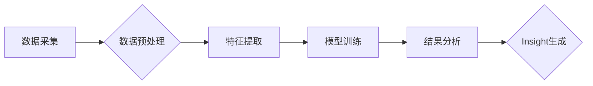

> Insight, 人工智能, 机器学习, 深度学习, 预测分析, 决策支持, 优化, 智能制造, 个性化教育, 金融风险管理, 医疗诊断, 军事决策

## 1. 背景介绍

在当今数据爆炸的时代，海量数据蕴藏着丰富的价值，但如何从海量数据中挖掘出有价值的洞察力（Insight）成为了一个关键问题。Insight是指从数据中发现的隐藏模式、趋势和关系，能够帮助我们更好地理解问题、做出更明智的决策。

人工智能（AI）技术的快速发展为数据洞察提供了强大的工具。特别是机器学习（ML）和深度学习（DL）算法，能够从复杂的数据中自动学习和发现模式，从而生成有价值的Insight。

## 2. 核心概念与联系

Insight的生成是一个多步骤的过程，涉及数据采集、预处理、特征提取、模型训练、结果分析等环节。

**数据采集:** 从各种来源收集相关数据，例如传感器数据、用户行为数据、财务数据等。

**数据预处理:** 对收集到的数据进行清洗、转换、归一化等处理，以确保数据质量和模型训练的有效性。

**特征提取:** 从原始数据中提取有价值的特征，这些特征能够反映数据的本质属性和潜在模式。

**模型训练:** 使用机器学习或深度学习算法对提取的特征进行训练，建立能够预测或分类的模型。

**结果分析:** 对模型的预测结果进行分析和解释，从中发现隐藏的模式和趋势，生成有价值的Insight。

**Mermaid 流程图:**



## 3. 核心算法原理 & 具体操作步骤

### 3.1  算法原理概述

Insight的生成通常依赖于机器学习和深度学习算法。

* **机器学习算法:** 包括监督学习、无监督学习和强化学习等。监督学习算法需要 labeled 数据进行训练，例如分类和回归问题。无监督学习算法可以从未标记的数据中发现模式，例如聚类和降维。强化学习算法通过与环境交互学习，例如游戏和机器人控制。

* **深度学习算法:** 是机器学习算法的一种，使用多层神经网络来模拟人类大脑的学习过程。深度学习算法能够处理复杂的数据，例如图像、文本和音频，并取得了优异的性能。

### 3.2  算法步骤详解

**具体操作步骤:**

1. **数据收集和预处理:** 收集相关数据，并进行清洗、转换、归一化等预处理操作。
2. **特征工程:** 从原始数据中提取有价值的特征，例如文本中的关键词、图像中的边缘信息等。
3. **模型选择:** 根据具体问题选择合适的机器学习或深度学习算法。
4. **模型训练:** 使用训练数据训练模型，并调整模型参数以获得最佳性能。
5. **模型评估:** 使用测试数据评估模型的性能，例如准确率、召回率、F1-score等。
6. **模型部署:** 将训练好的模型部署到生产环境中，用于进行预测或分类。
7. **结果分析:** 对模型的预测结果进行分析和解释，从中发现隐藏的模式和趋势，生成有价值的Insight。

### 3.3  算法优缺点

**优点:**

* **自动化:** 机器学习和深度学习算法能够自动学习和发现模式，无需人工干预。
* **精准度:** 这些算法能够从复杂的数据中提取出隐藏的模式，并进行精准的预测或分类。
* **可扩展性:** 这些算法能够处理海量数据，并随着数据量的增加而提高性能。

**缺点:**

* **数据依赖:** 这些算法需要大量的 labeled 数据进行训练，否则性能会下降。
* **黑盒效应:** 这些算法的内部工作机制复杂，难以理解，因此难以解释模型的预测结果。
* **计算资源:** 训练深度学习模型需要大量的计算资源，例如GPU和TPU。

### 3.4  算法应用领域

机器学习和深度学习算法在各个领域都有广泛的应用，例如：

* **制造业:** 智能制造、预测性维护、质量控制
* **教育:** 个性化学习、智能辅导、自动批改
* **金融:** 风险管理、欺诈检测、投资决策
* **医疗:** 疾病诊断、药物研发、患者监测
* **军事:** 情报分析、目标识别、无人驾驶

## 4. 数学模型和公式 & 详细讲解 & 举例说明

### 4.1  数学模型构建

Insight的生成可以看作是一个数学模型构建的过程。

* **输入:** 数据特征向量
* **输出:** Insight向量

**数学模型:**

$$
Insight = f(特征向量)
$$

其中，f()代表一个复杂的数学函数，例如神经网络或决策树。

### 4.2  公式推导过程

具体的数学模型和公式推导过程取决于所使用的算法。例如，线性回归模型的公式如下：

$$
y = w_0 + w_1x_1 + w_2x_2 + ... + w_nx_n + \epsilon
$$

其中：

* y 是预测值
* $w_0, w_1, ..., w_n$ 是模型参数
* $x_1, x_2, ..., x_n$ 是输入特征
* $\epsilon$ 是误差项

### 4.3  案例分析与讲解

**举例说明:**

假设我们想要预测房价，可以使用线性回归模型。输入特征包括房屋面积、房间数量、地理位置等，输出是房价。通过训练模型，我们可以得到房价预测公式，并根据新的房屋特征预测其价格。

## 5. 项目实践：代码实例和详细解释说明

### 5.1  开发环境搭建

* **操作系统:** Linux 或 macOS
* **编程语言:** Python
* **库和框架:** scikit-learn, TensorFlow, PyTorch

### 5.2  源代码详细实现

```python
# 导入必要的库
import pandas as pd
from sklearn.model_selection import train_test_split
from sklearn.linear_model import LinearRegression
from sklearn.metrics import mean_squared_error

# 加载数据
data = pd.read_csv('house_data.csv')

# 选择特征和目标变量
features = ['面积', '房间数量', '地理位置']
target = '房价'

# 将数据分成训练集和测试集
X_train, X_test, y_train, y_test = train_test_split(data[features], data[target], test_size=0.2)

# 创建线性回归模型
model = LinearRegression()

# 训练模型
model.fit(X_train, y_train)

# 预测测试集数据
y_pred = model.predict(X_test)

# 计算模型性能
mse = mean_squared_error(y_test, y_pred)
print(f'均方误差: {mse}')
```

### 5.3  代码解读与分析

* **数据加载和预处理:** 使用 pandas 库加载数据，并选择特征和目标变量。
* **数据分割:** 使用 train_test_split 函数将数据分成训练集和测试集。
* **模型创建和训练:** 使用 LinearRegression 类创建线性回归模型，并使用 fit 函数训练模型。
* **模型预测:** 使用 predict 函数对测试集数据进行预测。
* **模型性能评估:** 使用 mean_squared_error 函数计算模型的均方误差，作为模型性能的指标。

### 5.4  运行结果展示

运行代码后，会输出模型的均方误差值，该值越小，模型的预测性能越好。

## 6. 实际应用场景

### 6.1  制造业

* **智能制造:** 使用机器学习算法分析生产数据，预测设备故障、优化生产流程、提高生产效率。
* **预测性维护:** 通过分析设备运行数据，预测设备故障时间，提前进行维护，降低设备停机时间和维修成本。
* **质量控制:** 使用计算机视觉技术和机器学习算法对产品进行质量检测，识别缺陷产品，提高产品质量。

### 6.2  教育

* **个性化学习:** 根据学生的学习进度和能力，定制个性化的学习计划和内容，提高学习效率。
* **智能辅导:** 使用聊天机器人或虚拟助教，为学生提供个性化的学习辅导，解答学生疑问，提高学习兴趣。
* **自动批改:** 使用机器学习算法自动批改学生的作业，节省教师时间，提高批改效率。

### 6.3  金融

* **风险管理:** 使用机器学习算法分析客户数据，识别潜在的风险客户，降低金融机构的风险。
* **欺诈检测:** 使用机器学习算法分析交易数据，识别异常交易行为，防止金融欺诈。
* **投资决策:** 使用机器学习算法分析市场数据，预测股票价格走势，辅助投资决策。

### 6.4  医疗

* **疾病诊断:** 使用机器学习算法分析患者数据，辅助医生诊断疾病，提高诊断准确率。
* **药物研发:** 使用机器学习算法分析药物数据，加速药物研发过程，降低研发成本。
* **患者监测:** 使用机器学习算法分析患者的生理数据，监测患者的健康状况，及时发现异常情况。

### 6.5  军事

* **情报分析:** 使用机器学习算法分析情报数据，识别潜在的威胁，辅助军事决策。
* **目标识别:** 使用计算机视觉技术和机器学习算法识别目标，提高军事行动的准确性。
* **无人驾驶:** 使用机器学习算法控制无人机，提高无人机的自主性，降低人员伤亡风险。

## 7. 工具和资源推荐

### 7.1  学习资源推荐

* **书籍:**
    * 《深度学习》
    * 《机器学习实战》
    * 《Python机器学习》
* **在线课程:**
    * Coursera: 深度学习
    * edX: 机器学习
    * Udacity: 机器学习工程师

### 7.2  开发工具推荐

* **编程语言:** Python
* **机器学习库:** scikit-learn, TensorFlow, PyTorch
* **数据可视化工具:** Matplotlib, Seaborn

### 7.3  相关论文推荐

* **AlphaGo论文:** https://arxiv.org/abs/1607.02886
* **BERT论文:** https://arxiv.org/abs/1810.04805
* **GPT-3论文:** https://arxiv.org/abs/2005.14165

## 8. 总结：未来发展趋势与挑战

### 8.1  研究成果总结

Insight的生成已经取得了显著的成果，在各个领域都有广泛的应用。机器学习和深度学习算法的不断发展，使得Insight的生成更加精准、高效。

### 8.2  未来发展趋势

* **更强大的算法:** 研究更强大的机器学习和深度学习算法，能够处理更复杂的数据，生成更精准的Insight。
* **解释性AI:** 研究更解释性强的AI算法，能够解释模型的预测结果，提高用户对AI的信任。
* **边缘计算:** 将AI算法部署到边缘设备，实现实时Insight生成，降低数据传输成本和延迟。

### 8.3  面临的挑战

* **数据质量:** Insight的生成依赖于高质量的数据，数据质量问题会影响Insight的准确性和可靠性。
* **算法可解释性:** 许多AI算法是黑盒模型，难以解释模型的预测结果，这限制了AI在一些领域应用的推广。
* **伦理问题:** AI算法可能会产生偏见，导致不公平的结果，需要关注AI算法的伦理问题。

### 8.4  研究展望

未来，Insight的生成将更加智能、高效、可解释，并将应用于更多领域，为人类社会带来更大的价值。


## 9. 附录：常见问题与解答

**常见问题:**

* **如何选择合适的机器学习算法？**

**解答:** 选择合适的机器学习算法取决于具体问题和