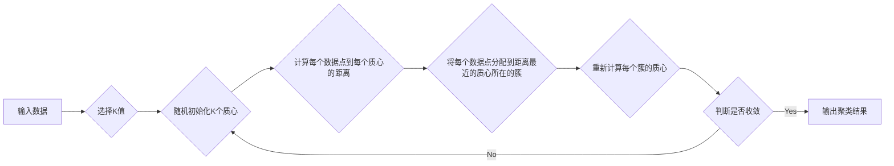

> K-means, 聚类算法, 机器学习, 数据挖掘, 算法原理, 代码实现, Python

## 1. 背景介绍

在海量数据时代，如何有效地对数据进行分析和挖掘，是机器学习和数据科学领域的核心问题之一。聚类算法作为一种无监督学习方法，能够将数据点根据相似性自动地划分为不同的类别，为数据分析和理解提供新的视角。

K-均值聚类算法（K-means clustering）作为一种经典的聚类算法，因其简单易懂、计算效率高而被广泛应用于各个领域，例如图像分割、客户群分析、异常检测等。

## 2. 核心概念与联系

K-均值聚类算法的核心思想是将数据点划分为K个簇，每个簇都包含相似的点，而簇之间的差异最大。

**流程图：**



## 3. 核心算法原理 & 具体操作步骤

### 3.1  算法原理概述

K-均值聚类算法基于以下核心原理：

* **最小化误差：** 算法的目标是将数据点分配到不同的簇中，使得每个簇内数据点到质心的距离最小，即最小化簇内误差。
* **质心迭代更新：** 算法通过迭代更新质心的位置，不断逼近最优的簇划分结果。

### 3.2  算法步骤详解

K-均值聚类算法的具体步骤如下：

1. **选择K值：** 首先需要确定聚类所需的簇数K。K值的选择直接影响聚类结果的质量，通常需要根据实际问题和数据特征进行选择。
2. **随机初始化K个质心：** 从数据集中随机选择K个数据点作为初始质心。
3. **计算每个数据点到每个质心的距离：** 使用距离度量（例如欧氏距离）计算每个数据点到所有质心的距离。
4. **将每个数据点分配到距离最近的质心所在的簇：** 将每个数据点分配到距离其最近的质心所在的簇。
5. **重新计算每个簇的质心：** 计算每个簇内所有数据点的平均值作为该簇的新质心。
6. **判断是否收敛：** 判断质心的位置是否发生变化，如果变化小于某个阈值，则认为算法收敛，输出聚类结果；否则，重复步骤3-5。

### 3.3  算法优缺点

**优点：**

* 简单易懂，实现简单。
* 计算效率高，适合处理大规模数据。

**缺点：**

* 容易受到初始质心选择的影响，可能导致局部最优解。
* 需要事先确定K值，K值的选择对聚类结果有很大影响。
* 对数据分布形状敏感，对非球形数据簇效果较差。

### 3.4  算法应用领域

K-均值聚类算法广泛应用于以下领域：

* **图像分割：** 将图像分割成不同的区域，例如背景和前景。
* **客户群分析：** 将客户根据消费行为、购买习惯等特征进行分类，以便制定针对性的营销策略。
* **异常检测：** 将异常数据点从正常数据集中分离出来，例如网络入侵检测。
* **文档聚类：** 将文档根据主题或内容进行分类。

## 4. 数学模型和公式 & 详细讲解 & 举例说明

### 4.1  数学模型构建

K-均值聚类算法的目标是找到K个质心，使得每个数据点到其所属质心的距离最小。

数学模型可以表示为：

$$
\min \sum_{i=1}^{K} \sum_{x \in C_i} ||x - \mu_i||^2
$$

其中：

* $C_i$ 表示第i个簇。
* $x$ 表示数据点。
* $\mu_i$ 表示第i个质心的坐标。
* $||x - \mu_i||^2$ 表示数据点$x$到质心$\mu_i$的欧氏距离平方。

### 4.2  公式推导过程

K-均值算法通过迭代更新质心的位置来最小化目标函数。

1. **初始化质心：** 随机选择K个数据点作为初始质心。
2. **分配数据点：** 计算每个数据点到所有质心的距离，并将每个数据点分配到距离其最近的质心所在的簇。
3. **更新质心：** 计算每个簇内所有数据点的平均值作为该簇的新质心。
4. **重复步骤2-3：** 直到质心的位置不再发生变化，或者达到最大迭代次数。

### 4.3  案例分析与讲解

假设我们有以下数据点：

```
(1, 2), (1.5, 1.8), (5, 8), (8, 8), (1, 0.6), (9, 11)
```

我们希望将这些数据点聚类成两个簇。

1. **初始化质心：** 随机选择数据点(1, 2)和(8, 8)作为初始质心。
2. **分配数据点：** 计算每个数据点到两个质心的距离，并将每个数据点分配到距离其最近的质心所在的簇。
3. **更新质心：** 计算每个簇内所有数据点的平均值作为该簇的新质心。
4. **重复步骤2-3：** 直到质心的位置不再发生变化。

经过迭代更新，最终得到的聚类结果可能是：

* 簇1： (1, 2), (1.5, 1.8), (1, 0.6)
* 簇2： (5, 8), (8, 8), (9, 11)

## 5. 项目实践：代码实例和详细解释说明

### 5.1  开发环境搭建

本示例使用Python语言和scikit-learn库进行实现。

需要安装以下软件包：

* Python 3.x
* scikit-learn

可以使用pip命令进行安装：

```
pip install scikit-learn
```

### 5.2  源代码详细实现

```python
import numpy as np
from sklearn.cluster import KMeans
import matplotlib.pyplot as plt

# 生成示例数据
X = np.array([[1, 2], [1.5, 1.8], [5, 8], [8, 8], [1, 0.6], [9, 11]])

# 使用K-means算法进行聚类
kmeans = KMeans(n_clusters=2, random_state=0)
kmeans.fit(X)

# 获取聚类结果
labels = kmeans.labels_
centroids = kmeans.cluster_centers_

# 可视化聚类结果
plt.scatter(X[:, 0], X[:, 1], c=labels, cmap='viridis')
plt.scatter(centroids[:, 0], centroids[:, 1], marker='x', s=200, c='red')
plt.title('K-means聚类结果')
plt.show()
```

### 5.3  代码解读与分析

1. **数据生成：** 使用NumPy库生成示例数据，包含6个数据点，每个数据点有两个特征。
2. **K-means模型初始化：** 使用scikit-learn库的KMeans类初始化K-means模型，设置聚类数为2，随机种子为0。
3. **模型训练：** 使用fit()方法训练模型，将数据点聚类成2个簇。
4. **获取聚类结果：** 使用labels_属性获取每个数据点的所属簇标签，使用cluster_centers_属性获取每个簇的质心坐标。
5. **可视化结果：** 使用matplotlib库绘制散点图，将数据点根据所属簇颜色进行区分，并用红色标记质心位置。

### 5.4  运行结果展示

运行代码后，将生成一个散点图，展示K-means聚类结果。

## 6. 实际应用场景

K-means聚类算法在各个领域都有广泛的应用场景：

* **图像分割：** 将图像分割成不同的区域，例如背景和前景，用于图像处理和分析。
* **客户群分析：** 将客户根据消费行为、购买习惯等特征进行分类，以便制定针对性的营销策略。
* **异常检测：** 将异常数据点从正常数据集中分离出来，例如网络入侵检测和欺诈检测。
* **文档聚类：** 将文档根据主题或内容进行分类，用于信息检索和文本挖掘。

### 6.4  未来应用展望

随着人工智能和机器学习技术的不断发展，K-means聚类算法的应用场景将会更加广泛。

例如，可以结合深度学习技术，实现更准确的图像分割和文档聚类；可以应用于大规模数据的分析和处理，例如社交网络分析和基因组数据分析。

## 7. 工具和资源推荐

### 7.1  学习资源推荐

* **书籍：**
    * 《机器学习》 - 周志华
    * 《Python机器学习实战》 - 塞缪尔·阿布拉姆斯
* **在线课程：**
    * Coursera: Machine Learning
    * edX: Introduction to Artificial Intelligence

### 7.2  开发工具推荐

* **Python:** 
    * scikit-learn: 机器学习库
    * NumPy: 数值计算库
    * matplotlib: 数据可视化库
* **其他工具:**
    * Jupyter Notebook: 交互式编程环境

### 7.3  相关论文推荐

* **K-means Clustering: Algorithm, Applications, and Extensions:** https://www.sciencedirect.com/science/article/pii/S016792361730087X
* **A Survey on K-Means Clustering Algorithm:** https://ieeexplore.ieee.org/document/8807777

## 8. 总结：未来发展趋势与挑战

### 8.1  研究成果总结

K-means聚类算法作为一种经典的聚类算法，在数据分析和挖掘领域取得了显著的成果。

其简单易懂、计算效率高、应用广泛的特点使其成为许多领域的首选聚类算法。

### 8.2  未来发展趋势

未来，K-means聚类算法的研究将朝着以下方向发展：

* **提高算法鲁棒性：** 针对K-means算法对初始质心选择敏感和对数据分布形状敏感的问题，研究更鲁棒的算法变体。
* **结合深度学习技术：** 将K-means算法与深度学习技术结合，实现更准确的聚类结果。
* **应用于大规模数据分析：** 研究并开发针对大规模数据的K-means算法优化方法。

### 8.3  面临的挑战

K-means聚类算法也面临一些挑战：

* **K值的选择：** K值的选择对聚类结果有很大影响，如何确定最优K值仍然是一个难题。
* **非球形数据簇：** K-means算法对非球形数据簇效果较差，需要研究针对非球形数据簇的聚类算法。
* **数据噪声：** 数据噪声会影响聚类结果的准确性，需要研究噪声处理方法。

### 8.4  研究展望

未来，K-means聚类算法的研究将继续深入，探索更有效的聚类方法，并将其应用于更多领域，为数据分析和挖掘提供更强大的工具。

## 9. 附录：常见问题与解答

**1. 如何选择K值？**

常用的方法包括肘部法则、Silhouette分析等。

