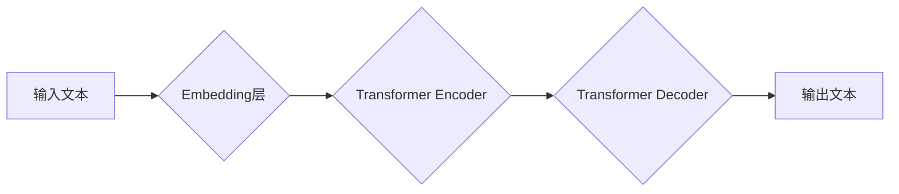

>  LLM, 大语言模型, 深度学习, 自然语言处理, 迁移学习, 知识图谱, 伦理问题, 安全问题

## 1. 背景介绍

近年来，深度学习技术取得了飞速发展，特别是Transformer模型的出现，为自然语言处理（NLP）领域带来了革命性的变革。基于Transformer架构的大语言模型（LLM）凭借其强大的文本生成、理解和翻译能力，在各个领域展现出巨大的应用潜力。从ChatGPT的爆火到Google的LaMDA，LLM正在逐渐改变我们与人工智能交互的方式，并对未来社会产生深远影响。

## 2. 核心概念与联系

**2.1  大语言模型 (LLM)**

大语言模型是指在海量文本数据上训练的深度学习模型，能够理解和生成人类语言。其核心特点是：

* **规模庞大:** LLM通常拥有数十亿甚至数千亿个参数，拥有强大的学习能力。
* **多任务学习:** LLM能够胜任多种自然语言处理任务，例如文本分类、问答、机器翻译、文本摘要等。
* **上下文理解:** LLM能够理解文本中的上下文关系，生成更自然流畅的文本。

**2.2  Transformer模型**

Transformer模型是一种专门用于处理序列数据的深度学习架构，其核心是“注意力机制”，能够有效捕捉文本中的长距离依赖关系。

**2.3  LLM与NLP的关系**

LLM是NLP领域的重要发展方向，其强大的文本处理能力为NLP任务的自动化和智能化提供了新的可能性。

**2.4  LLM架构图**



## 3. 核心算法原理 & 具体操作步骤

**3.1  算法原理概述**

LLM的核心算法是基于Transformer模型的深度学习算法。其训练过程主要包括以下步骤：

1. **文本预处理:** 将原始文本进行清洗、分词、标记等预处理操作。
2. **词嵌入:** 将文本中的每个词转换为向量表示，以便模型进行学习。
3. **Transformer编码器:** 利用Transformer编码器对输入文本进行编码，提取文本的语义信息。
4. **Transformer解码器:** 利用Transformer解码器根据编码后的文本生成目标文本。
5. **损失函数:** 使用交叉熵损失函数衡量模型的预测结果与真实结果之间的差异。
6. **反向传播:** 利用梯度下降算法更新模型参数，降低损失函数的值。

**3.2  算法步骤详解**

1. **数据准备:** 收集海量文本数据，并进行清洗、分词、标记等预处理操作。
2. **模型训练:** 使用深度学习框架（如TensorFlow、PyTorch）搭建LLM模型，并利用训练数据进行模型训练。
3. **模型评估:** 使用测试数据评估模型的性能，并根据评估结果进行模型调优。
4. **模型部署:** 将训练好的模型部署到生产环境中，用于实际应用。

**3.3  算法优缺点**

**优点:**

* 强大的文本处理能力
* 多任务学习能力
* 能够理解上下文关系

**缺点:**

* 训练成本高
* 容易受到训练数据偏差的影响
* 缺乏可解释性

**3.4  算法应用领域**

* **自然语言理解:** 文本分类、问答、情感分析等
* **自然语言生成:** 文本摘要、机器翻译、对话系统等
* **代码生成:** 代码补全、代码生成等
* **其他领域:** 医疗诊断、法律分析、金融预测等

## 4. 数学模型和公式 & 详细讲解 & 举例说明

**4.1  数学模型构建**

LLM的数学模型主要基于Transformer架构，其核心是注意力机制。注意力机制能够学习文本中不同词之间的关系，并赋予不同词不同的权重，从而更好地理解文本的语义信息。

**4.2  公式推导过程**

注意力机制的计算公式如下：

$$
Attention(Q, K, V) = softmax(\frac{QK^T}{\sqrt{d_k}})V
$$

其中：

* $Q$：查询矩阵
* $K$：键矩阵
* $V$：值矩阵
* $d_k$：键向量的维度
* $softmax$：softmax函数

**4.3  案例分析与讲解**

假设我们有一个句子“我爱吃苹果”，其词向量表示为：

* 我：[0.1, 0.2, 0.3]
* 爱：[0.4, 0.5, 0.6]
* 吃：[0.7, 0.8, 0.9]
* 苹果：[1.0, 1.1, 1.2]

利用注意力机制，我们可以计算出每个词对其他词的注意力权重，例如，“我”对“苹果”的注意力权重可能较高，因为它们在语义上相关。

## 5. 项目实践：代码实例和详细解释说明

**5.1  开发环境搭建**

* Python 3.7+
* TensorFlow/PyTorch
* CUDA/cuDNN

**5.2  源代码详细实现**

```python
import tensorflow as tf

# 定义Transformer模型
class Transformer(tf.keras.Model):
    def __init__(self, vocab_size, embedding_dim, num_heads, num_layers):
        super(Transformer, self).__init__()
        self.embedding = tf.keras.layers.Embedding(vocab_size, embedding_dim)
        self.transformer_encoder = tf.keras.layers.TransformerEncoder(
            tf.keras.layers.MultiHeadAttention(num_heads=num_heads),
            num_layers=num_layers
        )

    def call(self, inputs):
        embeddings = self.embedding(inputs)
        encoded = self.transformer_encoder(embeddings)
        return encoded

# 实例化模型
model = Transformer(vocab_size=10000, embedding_dim=128, num_heads=8, num_layers=6)

# 训练模型
model.compile(optimizer='adam', loss='mse')
model.fit(train_data, train_labels, epochs=10)
```

**5.3  代码解读与分析**

* 代码定义了一个Transformer模型，包含嵌入层、Transformer编码器等组件。
* 嵌入层将词向量化，Transformer编码器利用注意力机制对文本进行编码。
* 模型使用Adam优化器和均方误差损失函数进行训练。

**5.4  运行结果展示**

训练完成后，模型可以用于预测新的文本序列。

## 6. 实际应用场景

**6.1  聊天机器人**

LLM可以用于构建更智能、更自然的聊天机器人，能够理解用户的意图并提供更精准的回复。

**6.2  文本生成**

LLM可以用于生成各种类型的文本，例如文章、故事、诗歌等，可以辅助人类创作或自动化文本生成任务。

**6.3  机器翻译**

LLM可以用于实现更准确、更流畅的机器翻译，突破语言障碍，促进跨文化交流。

**6.4  未来应用展望**

LLM的应用场景还在不断扩展，未来可能应用于教育、医疗、法律、金融等各个领域，为人类社会带来更多便利和价值。

## 7. 工具和资源推荐

**7.1  学习资源推荐**

* **书籍:**
    * 《深度学习》
    * 《自然语言处理》
* **在线课程:**
    * Coursera: 自然语言处理
    * edX: 深度学习
* **博客:**
    * The Gradient
    * Towards Data Science

**7.2  开发工具推荐**

* **深度学习框架:** TensorFlow, PyTorch
* **文本处理工具:** NLTK, SpaCy
* **云平台:** Google Cloud AI Platform, AWS SageMaker

**7.3  相关论文推荐**

* 《Attention Is All You Need》
* 《BERT: Pre-training of Deep Bidirectional Transformers for Language Understanding》
* 《GPT-3: Language Models are Few-Shot Learners》

## 8. 总结：未来发展趋势与挑战

**8.1  研究成果总结**

近年来，LLM取得了显著进展，其文本处理能力不断提升，应用场景也越来越广泛。

**8.2  未来发展趋势**

* **模型规模更大:** 随着计算能力的提升，LLM模型规模将进一步扩大，性能将得到进一步提升。
* **多模态学习:** LLM将与其他模态数据（如图像、音频）融合，实现多模态理解和生成。
* **可解释性增强:** 研究者将致力于提高LLM的可解释性，使其决策过程更加透明。
* **个性化定制:** LLM将根据用户的需求进行个性化定制，提供更精准、更符合用户偏好的服务。

**8.3  面临的挑战**

* **数据安全和隐私:** LLM的训练需要海量数据，如何保证数据安全和隐私是一个重要挑战。
* **算法偏见:** LLM容易受到训练数据偏见的影响，如何消除算法偏见是一个需要解决的问题。
* **伦理问题:** LLM的应用可能带来一些伦理问题，例如信息操纵、深度伪造等，需要谨慎对待。

**8.4  研究展望**

未来，LLM研究将继续朝着更智能、更安全、更可解释的方向发展，为人类社会带来更多福祉。

## 9. 附录：常见问题与解答

**9.1  LLM与RNN的区别是什么？**

RNN（循环神经网络）是一种专门用于处理序列数据的深度学习模型，其核心特点是具有记忆功能，能够记住之前的信息。而LLM基于Transformer架构，其注意力机制能够有效捕捉文本中的长距离依赖关系，无需像RNN那样依赖循环结构。

**9.2  如何训练一个LLM模型？**

训练一个LLM模型需要海量文本数据、强大的计算资源和专业的机器学习知识。具体步骤包括数据预处理、模型搭建、模型训练、模型评估和模型部署。

**9.3  LLM有哪些应用场景？**

LLM的应用场景非常广泛，包括聊天机器人、文本生成、机器翻译、代码生成、教育、医疗、法律、金融等各个领域。

**9.4  LLM有哪些伦理问题？**

LLM的应用可能带来一些伦理问题，例如信息操纵、深度伪造、算法偏见等，需要谨慎对待。

**9.5  LLM的未来发展趋势是什么？**

LLM的未来发展趋势包括模型规模更大、多模态学习、可解释性增强、个性化定制等。


作者：禅与计算机程序设计艺术 / Zen and the Art of Computer Programming 
<end_of_turn>